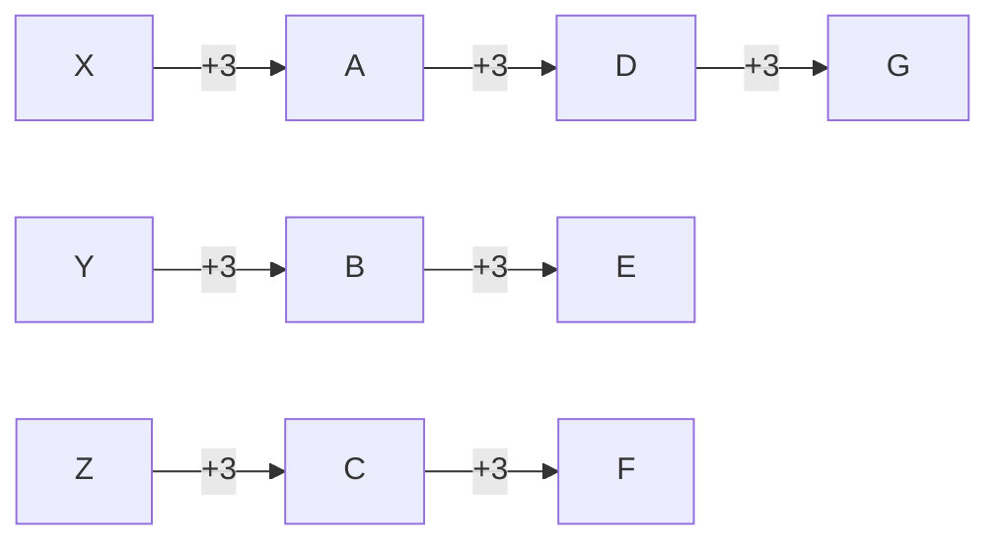
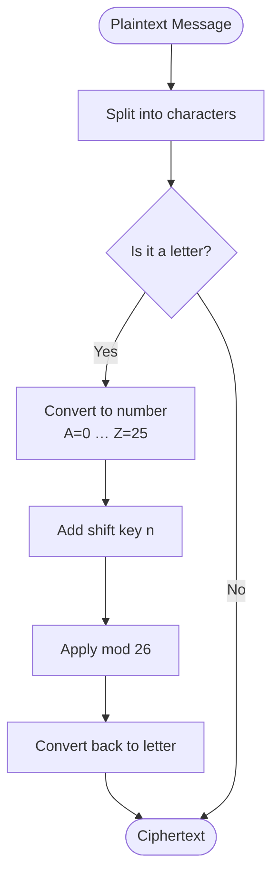
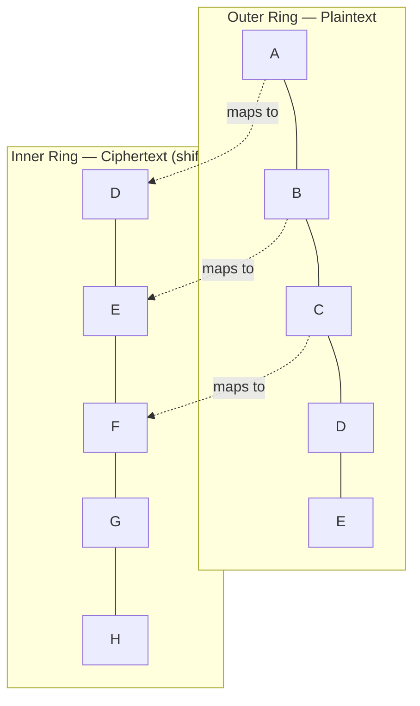
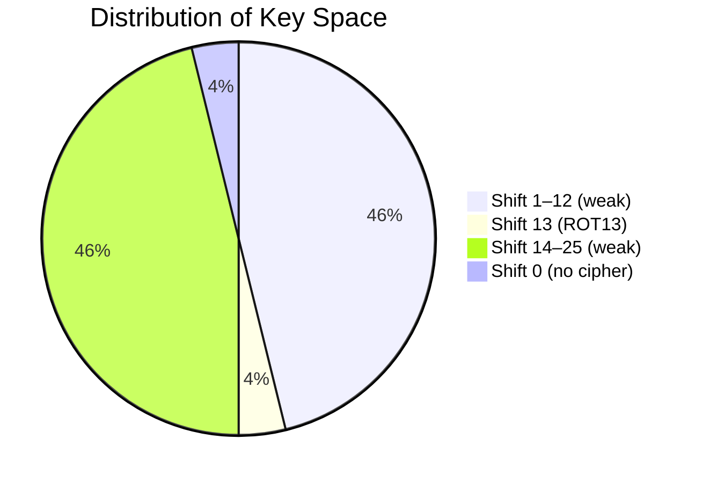
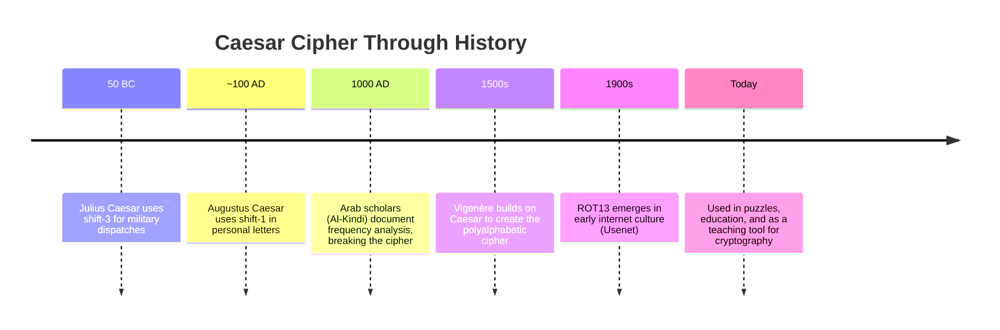
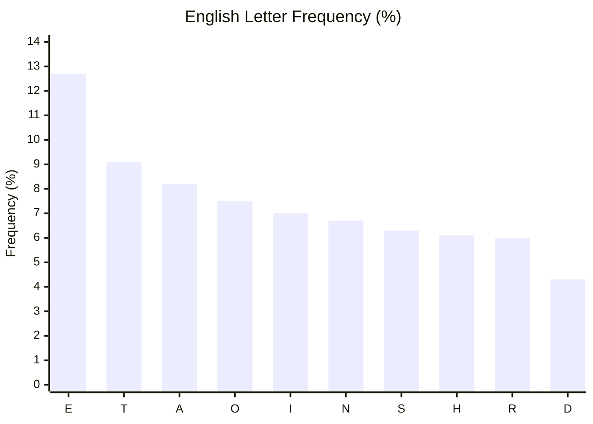
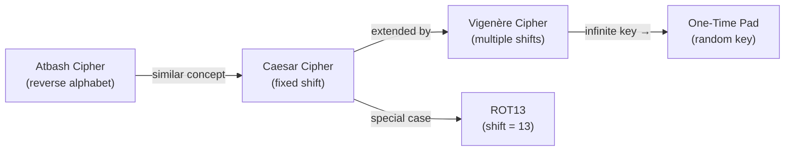

> *"If he had anything confidential to say, he wrote it in cipher..."*
> — Suetonius, *The Twelve Caesars*

---

#### What Is It?

The **Caesar cipher** is one of the oldest and simplest encryption techniques known. It is a **substitution cipher** in which each letter in the plaintext is shifted a fixed number of positions along the alphabet. Named after Julius Caesar, who reportedly used it with a shift of 3 to protect military communications.

---

## How It Works

Each letter is replaced by the letter **N positions** further in the alphabet. The alphabet wraps around — after `Z` comes `A` again.

### Encryption Formula

```
E(x) = (x + n) mod 26
```

### Decryption Formula

```
D(x) = (x - n + 26) mod 26
```

Where:
- `x` = position of the letter (A=0, B=1, … Z=25)
- `n` = shift value (key)

---

## Shift Visualisation (Shift = 3)



---

## Encryption Flow



---

## Example: Encrypting "HELLO" with Shift 3

| Plaintext | Index | + Shift | mod 26 | Ciphertext |
|-----------|-------|---------|--------|------------|
| H         | 7     | 10      | 10     | **K**      |
| E         | 4     | 7       | 7      | **H**      |
| L         | 11    | 14      | 14     | **O**      |
| L         | 11    | 14      | 14     | **O**      |
| O         | 14    | 17      | 17     | **R**      |

**HELLO → KHOOR**

---

## The Cipher Wheel



---

## Key Space

The Caesar cipher has only **26 possible keys** (shifts 0–25). Shift 0 means no encryption.



---

## ROT13 — The Special Case

When the shift is exactly **13**, the cipher is its own inverse:

```
Encrypt(ROT13(x)) = Decrypt(ROT13(x))
```

This means applying ROT13 **twice** returns the original text. It is widely used online to hide spoilers or puzzle answers.

---

## Historical Usage



---

## Security Analysis

| Property         | Caesar Cipher       |
|------------------|---------------------|
| Key space        | 26 keys             |
| Security         | ❌ Extremely weak    |
| Brute-force      | Trivially possible  |
| Frequency attack | Easy — 1 sample     |
| Modern use       | Educational only    |

### Why It Fails: Frequency Analysis

Because letter frequencies are preserved, an attacker can compare the ciphertext frequency distribution to known language frequencies (e.g. `E` is the most common letter in English). A single ciphertext of ~20 characters is usually enough to crack it.



---

## Comparison with Related Ciphers



---

## Quick Reference

```
Alphabet: A B C D E F G H I J K L M N O P Q R S T U V W X Y Z
Shift +3: D E F G H I J K L M N O P Q R S T U V W X Y Z A B C
```

To **encrypt**: find the letter in the top row → take the letter below it.
To **decrypt**: find the letter in the bottom row → take the letter above it.

---

## Summary

The Caesar cipher is a cornerstone of cryptography history — simple enough to grasp immediately, yet illustrative of fundamental concepts like **key-based transformation**, **modular arithmetic**, and **the importance of key space size**. While completely insecure by modern standards, it remains the perfect starting point for understanding how encryption works.