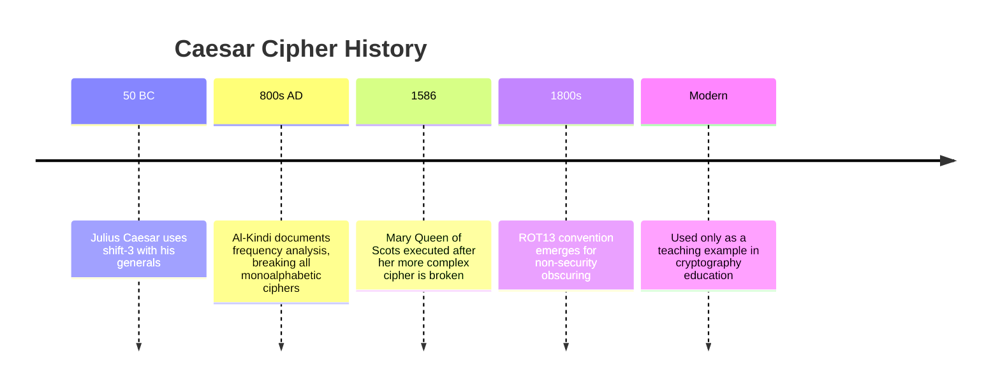

The Caesar cipher is the simplest and most famous substitution cipher. Julius Caesar used it to communicate with his generals around 50 BC, shifting each letter three positions forward in the alphabet. It is trivially broken today, but it introduces every fundamental concept in cryptanalysis: key space, frequency analysis, and the relationship between simplicity and security.

## How It Works

The Caesar cipher replaces each letter with the letter **N positions** later in the alphabet, wrapping around at Z back to A.

With a shift of 3 (the classic Caesar):

```
Plaintext:  A B C D E F G H I J K L M N O P Q R S T U V W X Y Z
Ciphertext: D E F G H I J K L M N O P Q R S T U V W X Y Z A B C
```

**Example:** `HELLO` → `KHOOR`

```
H(7)  + 3 = K(10)
E(4)  + 3 = H(7)
L(11) + 3 = O(14)
L(11) + 3 = O(14)
O(14) + 3 = R(17)
```

## The Math

Encrypt: `C = (P + shift) mod 26`

Decrypt: `P = (C - shift + 26) mod 26`

Where P is the plaintext letter number (A=0, B=1, … Z=25) and C is the ciphertext letter number.

The `mod 26` operation ensures the alphabet wraps around: Z (25) + 3 = 2 → C.

```python
def caesar_encrypt(text: str, shift: int) -> str:
    result = []
    for char in text.upper():
        if char.isalpha():
            result.append(chr((ord(char) - ord('A') + shift) % 26 + ord('A')))
        else:
            result.append(char)
    return ''.join(result)

def caesar_decrypt(text: str, shift: int) -> str:
    return caesar_encrypt(text, -shift)

# Example
print(caesar_encrypt("HELLO WORLD", 3))   # KHOOR ZRUOG
print(caesar_decrypt("KHOOR ZRUOG", 3))   # HELLO WORLD
```

## Shift Visualization

```
Shift 0:  A B C D E F G H I J K L M N O P Q R S T U V W X Y Z  (no change)
Shift 1:  B C D E F G H I J K L M N O P Q R S T U V W X Y Z A
Shift 3:  D E F G H I J K L M N O P Q R S T U V W X Y Z A B C  ← Caesar's choice
Shift 13: N O P Q R S T U V W X Y Z A B C D E F G H I J K L M  ← ROT13 (special case)
```

**ROT13** (shift 13) is self-inverse: applying it twice returns the original text. It is used in online forums to hide spoilers, not for security.

## Key Space Analysis

The Caesar cipher has only **26 possible keys** (shifts 0–25). An attacker can try all of them in seconds — even by hand. This is called an **exhaustive key search** or **brute force attack**.

```
Shift 0: KHOOR ZRUOG
Shift 1: JGNNQ YQTNF
Shift 2: IFMMP XPSME
Shift 3: HELLO WORLD  ← plaintext recovered
Shift 4: GDKKN VNQKC
...
```

A cipher with only 26 possible keys provides essentially zero security by modern standards. AES-256 has 2²⁵⁶ possible keys — exhaustive search is computationally infeasible.

## Frequency Analysis

Even without trying all shifts, the cipher breaks via frequency analysis. In English, 'E' is the most common letter (12.7%). Find the most frequent letter in the ciphertext — it is almost certainly the encryption of 'E'. The shift is the difference between that letter and 'E'.

```python
from collections import Counter

def crack_caesar(ciphertext: str) -> tuple[str, int]:
    # Count letter frequencies in ciphertext
    letters = [c for c in ciphertext.upper() if c.isalpha()]
    freq = Counter(letters)
    most_common = freq.most_common(1)[0][0]

    # Most frequent letter is probably 'E' (position 4)
    shift = (ord(most_common) - ord('E')) % 26

    return caesar_decrypt(ciphertext, shift), shift

text = "WKH TXLFN EURZQ IRA MXPSV RYHU WKH ODCB GRJ"
plaintext, shift = crack_caesar(text)
print(f"Shift: {shift}, Plaintext: {plaintext}")
# Shift: 3, Plaintext: THE QUICK BROWN FOX JUMPS OVER THE LAZY DOG
```

## Historical Context



Julius Caesar trusted the cipher partly because most of his enemies were illiterate — security through obscurity. His nephew Augustus later used a shift of 1 (and reportedly never carried the cipher back across the alphabet, losing characters at the end — a bug in implementation).

## Security Analysis

| Property | Caesar Cipher | Secure Cipher (AES-256) |
|----------|--------------|------------------------|
| Key space | 26 | 2²⁵⁶ ≈ 10⁷⁷ |
| Brute force time | < 1 second | Longer than the age of the universe |
| Frequency analysis | Immediate | Not applicable (ciphertext appears random) |
| Known-plaintext attack | Trivial | Infeasible |
| Ciphertext-only attack | Trivial | Infeasible |

The Caesar cipher fails every modern security requirement:
- **Too small a key space** — 26 keys is not a key space, it is a list
- **Preserves frequency distribution** — statistical patterns survive encryption
- **No diffusion** — each output letter depends only on the corresponding input letter
- **No confusion** — the relationship between key and ciphertext is completely linear

## Related Ciphers

| Cipher | Relationship | Improvement |
|--------|-------------|-------------|
| Atbash | Caesar with fixed shift 13 on reversed alphabet | None — equally trivial |
| ROT13 | Caesar with shift 13 | Self-inverse, but same security |
| Affine Cipher | C = (aP + b) mod 26 | Two parameters, still monoalphabetic |
| Substitution Cipher | Any permutation of the 26-letter alphabet | 26! ≈ 4×10²⁶ possible keys — still broken by frequency analysis |
| Vigenère Cipher | Caesar with a repeating keyword | Polyalphabetic — resists simple frequency analysis |
| One-Time Pad | Caesar with a truly random key the length of the message | Provably unbreakable — but impractical |

The substitution cipher shows an important lesson: a larger key space alone does not guarantee security. Even with 26! ≈ 4×10²⁶ possible keys, frequency analysis breaks a substitution cipher in minutes because each letter always maps to the same ciphertext letter.
