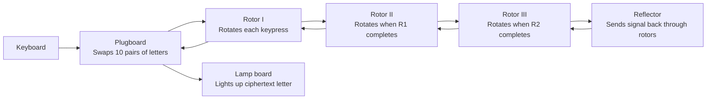

The Enigma machine was a masterpiece of electromechanical engineering that took polyalphabetic encryption far beyond what any human could do with pen and paper. For most of the 1930s and 1940s, German military commanders believed it was mathematically unbreakable. They were wrong — but breaking it required an entirely new field of mathematics, a purpose-built computer, and one of history's most brilliant minds.

## What Made Enigma Different

Every cipher discussed so far had a fixed or slowly-changing substitution. Enigma had a substitution that changed **with every single keypress**. After you pressed a key:
1. The substitution for the next letter was completely different
2. The relationship between letters was non-linear and complex
3. The same letter pressed twice in a row produced two different ciphertext letters

With 158 quintillion (1.58 × 10²⁰) possible configurations for the naval Enigma, brute force was impossible with 1940s technology.

## Machine Components



### The Rotors

Each rotor is a disc with 26 electrical contacts on each side, wired in a scrambled pattern. When a key is pressed, an electrical signal passes through the rotor substituting one letter for another.

**The critical innovation:** After each keypress, the right rotor advances by one position, changing its substitution. When the right rotor completes a full revolution (26 presses), it advances the middle rotor. When the middle completes, it advances the left rotor. This is the same mechanism as an odometer — but with electrical contacts instead of numbers.

```
Rotor positions after each keypress (3 rotors):

Press 1:  A A A  → encrypts with substitution S₀
Press 2:  A A B  → completely different substitution S₁
Press 3:  A A C  → completely different substitution S₂
...
Press 26: A A Z  → substitution S₂₅
Press 27: A B A  → middle rotor advances, completely different substitution S₂₆
...
Press 676: A Z Z  →
Press 677: B A A  → left rotor advances
```

German military Enigma used 3 rotors chosen from a set of 5 (later 8 for naval), giving:
- **Rotor selection:** 5 × 4 × 3 = 60 possible combinations
- **Rotor starting positions:** 26³ = 17,576
- **Ring settings:** 26³ = 17,576
- **Plugboard:** ~150 trillion combinations

Total: **≈ 1.58 × 10²⁰ configurations** per day

### The Reflector

The reflector (Umkehrwalze) sends the signal back through the rotors in reverse, allowing the same machine settings to both encrypt and decrypt. This was a practical convenience — but it introduced a critical flaw:

**A letter can never encrypt to itself.**

If you pressed 'A', the ciphertext letter was guaranteed to be anything except 'A'. This seemed like a security feature, but it became one of the most important weaknesses Bletchley Park exploited.

### The Plugboard

The plugboard (Steckerbrett) connected pairs of letters with cables before and after the rotor pass, swapping them. With 10 cables plugged in (the standard German practice), the plugboard added approximately 150 trillion additional configurations.

## Daily Key Settings

Each day, the Germans issued a new **key sheet** to all Enigma operators specifying:
1. Which 3 rotors to use (from the available set)
2. The initial rotor positions (3 letters, e.g., "QCM")
3. Ring settings for each rotor
4. Plugboard connections (10 letter pairs)

All operators synchronized to the same daily settings, which reset at midnight.

## How Messages Were Sent

An operator would:
1. Set the machine to the daily key settings
2. Choose a random 3-letter **message key** (e.g., "XYZ") — the actual starting position for this message
3. Encrypt the message key twice using the daily settings: press X, Y, Z, X, Y, Z → get 6 ciphertext letters
4. Reset the rotors to "XYZ" and encrypt the actual message
5. Transmit: the 6-letter indicator group, then the message

The double-encryption of the message key was intended to confirm correct reception — but it was a catastrophic mistake that Polish mathematicians exploited.

## How It Was Broken

### Step 1: Polish Mathematicians (1932–1939)

The Polish Cipher Bureau, led by Marian Rejewski, broke early Enigma in 1932 using pure mathematics. They exploited the **doubled message key** — the fact that positions 1–3 and 4–6 of the indicator group encrypted the same three letters.

If position 1 encrypted to 'A', and position 4 (the same letter encrypted again with rotors 3 positions later) encrypted to 'F', this relationship constrained the rotor wirings. With 6 months of messages, Rejewski reconstructed the rotor wiring from pure algebra.

The Poles built **Bomba** machines — electrical devices that tested multiple rotor configurations simultaneously. They could read German communications for 7 years.

When Germany added two more rotors in 1938, making the problem much harder, the Poles shared everything with France and Britain in July 1939 — just months before the war began.

### Step 2: Alan Turing and the Bombe (1939–1941)

Alan Turing arrived at Bletchley Park (Government Code and Cypher School, GC&CS) and transformed the Polish approach.

**The Crib Exploit:** German operators were lazy and predictable. Weather reports always started with "WETTER" (weather). The greeting "KEINE BESONDEREN EREIGNISSE" (nothing to report) appeared constantly. These known plaintext fragments were called **cribs**.

A crib gave Bletchley analysts a known plaintext/ciphertext pair. Turing's insight: use the crib to create a chain of logical implications about the rotor settings, rather than testing all configurations directly.

**The No-Self-Encryption Rule:** Since a letter could never encrypt to itself, if a crib overlaid the ciphertext and any crib letter matched the ciphertext letter at that position, this rotor setting was impossible. This eliminated vast numbers of configurations.

Turing designed the **Bombe** — an electromechanical device that implemented these logical constraints. Each Bombe had 36 sets of Enigma rotors spinning simultaneously. When a valid configuration was found (no self-encryptions for the crib), it stopped and printed the position.

```
Crib attack example:

Ciphertext: X M Z P F H G S
Crib:       W E A T H E R ?

Position 1: X ≠ W ✓ (could be valid)
Position 2: M ≠ E ✓
Position 3: Z ≠ A ✓
Position 4: P ≠ T ✓
Position 5: F ≠ H ✓ 
Position 6: H ≠ E ✓
Position 7: G ≠ R ✓

No violations found → this is a candidate setting → test fully
```

### Step 3: Naval Enigma and the Weather Cribs

Naval Enigma used 4 rotors instead of 3, making it 26 times harder. The key breakthrough came from capturing physical key sheets from sunken submarines, and from **Gordon Welchman**'s "diagonal board" enhancement that made Bombes dramatically more efficient.

By 1943, Bletchley Park was reading German naval communications within hours of transmission — often faster than the German commanders receiving the originals.

## Impact on World War II

Historians estimate that breaking Enigma shortened World War II by **2–4 years**, saving an estimated 14–21 million lives.

The intelligence gathered from Enigma (codenamed **ULTRA**) was so sensitive that its existence was kept secret until 1974 — 30 years after the war. Churchill referred to Ultra intelligence as his "golden goose that never cackled."

Some known impacts:
- **Battle of the Atlantic (1942–43):** Reading U-boat positions allowed routing convoys around submarine wolf-packs. The Allies won the naval war.
- **North Africa (1942):** Rommel's supply lines were repeatedly interdicted because shipping routes were read in advance.
- **D-Day (1944):** German reinforcement plans and troop movements were known before the Normandy landings.

## Why It Was Broken: Key Lessons

| Enigma Design Choice | Security Assumption | Reality |
|---------------------|--------------------|---------| 
| No letter encrypts to itself | "This proves correctness" | This is exploitable in crib attacks |
| Message key encrypted twice | "Redundancy for reliability" | This doubled-key reveals internal structure |
| Fixed daily key for all operators | "Operationally convenient" | A single compromised machine unlocks all traffic |
| Known greeting formats | "Operational necessity" | Known-plaintext attacks work |
| Weather report always starts with WETTER | "Unavoidable" | Cribs eliminate most configurations |

Enigma failed not because of a mathematical weakness in the rotor design, but because of **implementation and operational failures** — predictable message formats, lazy operators, and the no-self-encryption reflector flaw.

## Legacy

Enigma's defeat fundamentally changed cryptography:

1. **Kerckhoffs's principle confirmed:** Security must come from the key, not the algorithm's secrecy. Enigma's design was captured but the machine was still used because key settings changed daily.

2. **The birth of computing:** The Bombe was not a general-purpose computer, but it proved that computational automation could solve problems humans could not. Turing's theoretical work on computation was directly motivated by the needs of cryptanalysis.

3. **Modern cipher design:** Secure ciphers must have no exploitable regularities — no letter should have special properties (like never encrypting to itself), and operational procedures must prevent known-plaintext attacks.

The Enigma story is the best historical example of a security system that appeared unbreakable but was defeated by the combination of mathematical insight, engineering, and the exploitation of human error.

## Simulate Enigma in Python

```python
class EnigmaRotor:
    def __init__(self, wiring: str, notch: str):
        self.wiring = wiring
        self.notch = notch
        self.position = 0
        self.ring = 0

    def forward(self, char: int) -> int:
        c = (char + self.position - self.ring) % 26
        c = (ord(self.wiring[c]) - ord('A') - self.position + self.ring + 26) % 26
        return c

    def backward(self, char: int) -> int:
        c = (char + self.position - self.ring) % 26
        c = (self.wiring.index(chr(c + ord('A'))) - self.position + self.ring + 26) % 26
        return c

    def step(self) -> bool:
        at_notch = chr(self.position + ord('A')) in self.notch
        self.position = (self.position + 1) % 26
        return at_notch

# Historical Enigma I rotor wirings
ROTORS = {
    'I':   EnigmaRotor('EKMFLGDQVZNTOWYHXUSPAIBRCJ', 'Q'),
    'II':  EnigmaRotor('AJDKSIRUXBLHWTMCQGZNPYFVOE', 'E'),
    'III': EnigmaRotor('BDFHJLCPRTXVZNYEIWGAKMUSQO', 'V'),
}
REFLECTOR_B = 'YRUHQSLDPXNGOKMIEBFZCWVJAT'

def enigma_encrypt(message: str, rotor_order: list, positions: list) -> str:
    rotors = [ROTORS[r] for r in rotor_order]
    for i, pos in enumerate(positions):
        rotors[i].position = ord(pos) - ord('A')

    result = []
    for char in message.upper():
        if not char.isalpha():
            result.append(char)
            continue

        # Advance rotors
        if rotors[1].position == ord(rotors[1].notch) - ord('A'):
            rotors[1].step()
            rotors[0].step()
        if rotors[2].position == ord(rotors[2].notch) - ord('A'):
            rotors[1].step()
        rotors[2].step()

        c = ord(char) - ord('A')
        for rotor in reversed(rotors):
            c = rotor.forward(c)
        c = ord(REFLECTOR_B[c]) - ord('A')
        for rotor in rotors:
            c = rotor.backward(c)

        result.append(chr(c + ord('A')))

    return ''.join(result)
```
