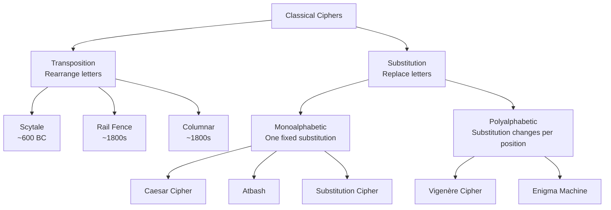

Cryptography is one of the oldest human endeavors. The desire to send secret messages predates computers by millennia — armies, diplomats, lovers, and conspirators all needed ways to communicate that enemies could not read. Classical ciphers are the ancestors of modern cryptography. Understanding them reveals why simple patterns are insecure and what a strong cipher must guarantee.

## What Is a Cipher?

A **cipher** is an algorithm for performing encryption and decryption. Classical ciphers manipulate plaintext at the letter level — rearranging or substituting characters according to a key or rule.

They differ from **codes**, which replace entire words or phrases with code words (like a diplomatic codebook). Ciphers operate on the structure of the message itself, which means they can be applied to any text without a shared codebook.

## Two Families of Classical Ciphers

**Transposition ciphers** rearrange the letters of a message without changing them. The letters are all present — just in a different order. The Scytale and Rail Fence are transposition ciphers.

**Substitution ciphers** replace each letter with a different letter, symbol, or number. The Caesar cipher replaces each letter with the one three positions later; a general substitution cipher can use any permutation of the alphabet.

## A Brief History

| Era | Development |
|-----|-------------|
| ~1900 BC | Ancient Egyptians used non-standard hieroglyphs as a simple cipher |
| ~600 BC | Hebrew scribes used the Atbash cipher (A↔Z reversal) |
| ~487 BC | Spartans used the Scytale — a transposition cipher with a rod |
| ~50 BC | Julius Caesar used his famous shift cipher |
| 800s AD | Al-Kindi writes the first treatise on frequency analysis — breaking all monoalphabetic ciphers |
| 1467 | Leon Battista Alberti invents the cipher disk — the first polyalphabetic concept |
| 1553 | Giovan Battista Bellaso describes what becomes known as the Vigenère cipher |
| 1586 | Mary Queen of Scots is executed after her cipher is broken |
| 1854 | Charles Babbage secretly breaks the Vigenère cipher (Kasiski publishes in 1863) |
| 1918 | Arthur Scherbius patents the Enigma machine |
| 1940s | Alan Turing and Bletchley Park break Enigma, shortening WWII |
| 1976 | Diffie-Hellman introduces public-key cryptography — the modern era begins |

## Why Classical Ciphers Failed

All classical ciphers share a fundamental weakness: they preserve the statistical structure of language. Even when letters are replaced or rearranged, patterns survive.

**Frequency analysis** exploits this. In English:

| Letter | Frequency | Letter | Frequency |
|--------|-----------|--------|-----------|
| E | 12.7% | H | 6.1% |
| T | 9.1% | R | 6.0% |
| A | 8.2% | D | 4.3% |
| O | 7.5% | L | 4.0% |
| I | 7.0% | U | 2.8% |
| N | 6.7% | Q | 0.1% |
| S | 6.3% | Z | 0.07% |

If you encrypt with a Caesar cipher, the most frequent letter in the ciphertext corresponds to the encrypted 'E'. Shift it back by the same amount and the cipher falls immediately. Al-Kindi documented this attack in the 9th century — monoalphabetic ciphers have been broken for over a thousand years.

**Polyalphabetic ciphers** like Vigenère hide individual frequencies by cycling through multiple substitution alphabets — but the key length is detectable via pattern repetitions (Kasiski test), and once the key length is known, the cipher reduces to multiple independent monoalphabetic problems.

**Enigma** added mechanical permutations and a plugboard to make frequency analysis infeasible by hand — but the machine's mathematical structure contained exploitable regularities: no letter could encrypt to itself, the machine was symmetric, and weather reports gave known-plaintext cribs to codebreakers.

The lesson: **security cannot come from obscurity alone**. A secure cipher must provide no usable statistical information even when the algorithm is fully known — the key is the only secret.

## Topics in This Section

| Topic | What you'll learn |
|-------|------------------|
| [Caesar Cipher](./caesar-cipher) | Shift ciphers; modular arithmetic; key space analysis |
| [Substitution Ciphers](./substitution-ciphers) | Monoalphabetic substitution; symbol ciphers; physical transposition; frequency analysis |
| [Vigenère Cipher](./vigenere-cipher) | Polyalphabetic encryption; the Vigenère square; Kasiski test |
| [Enigma Machine](./enigma) | Rotor-based encryption; Bletchley Park; impact on modern cryptography |

## Extended Cipher Research

Classical cryptography contains dozens of fascinating systems. Some worth exploring:

| Cipher | Type | Key idea |
|--------|------|----------|
| Atbash | Monoalphabetic | A↔Z mirror reversal; used in the Hebrew Bible |
| Playfair | Digraph substitution | Pairs of letters on a 5×5 grid; used in WWI |
| Four-Square | Digraph substitution | Two keyword grids |
| Polybius Square | Fractionating | Letters encoded as coordinate pairs (row, col) |
| Hill Cipher | Linear algebra | Matrix multiplication over Z₂₆ |
| Beaufort Cipher | Polyalphabetic | Variant of Vigenère; self-reciprocal |
| One-Time Pad | Polyalphabetic | Provably unbreakable when used correctly; impractical |
| M-94 | Mechanical polyalphabetic | US Army cylinder device (1922–1943) |
| ADFGVX | Combined | Transposition + substitution; WWI German field cipher |
| Nihilist | Numeric substitution | Used by Russian revolutionary underground |
| Pigpen | Symbol substitution | Masonic cipher using grid symbols |
| Bacon's Cipher | Steganographic | Binary encoding hidden in font variation |
