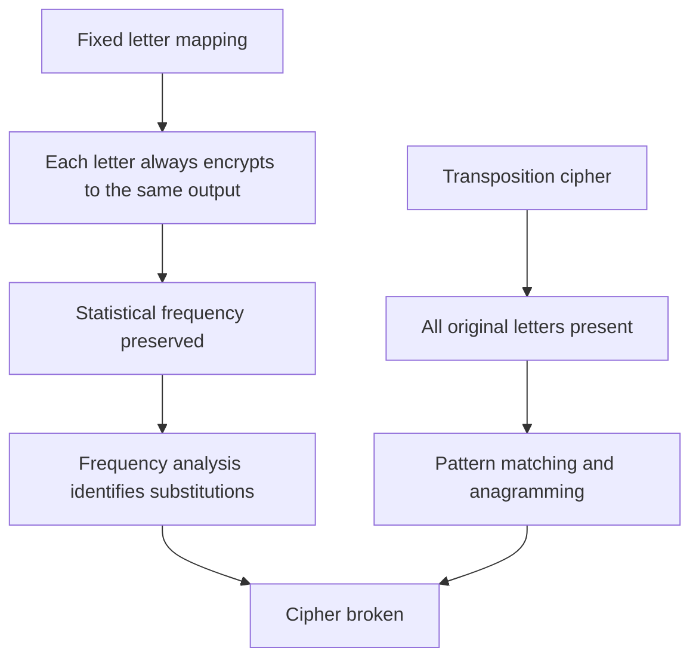

Substitution ciphers replace letters with other letters, symbols, or numbers according to a fixed mapping. They are the most widespread family of classical ciphers, appearing in ancient Hebrew texts, Renaissance diplomacy, and Mary Queen of Scots' fatal correspondence. Despite their variety, they all share the same fundamental weakness: a fixed mapping preserves the statistical fingerprint of the language.

## Monoalphabetic Substitution

A **monoalphabetic substitution cipher** uses a single fixed substitution alphabet for the entire message. The Caesar cipher is a special case where the alphabet is shifted by a constant. A general substitution cipher allows any permutation of the 26 letters.

### Key Space

A random substitution key is a permutation of 26 letters:

```
Plaintext:  A B C D E F G H I J K L M N O P Q R S T U V W X Y Z
Ciphertext: Q W E R T Y U I O P A S D F G H J K L Z X C V B N M
```

There are **26! ≈ 4 × 10²⁶** possible keys — far more than the 26 of a Caesar cipher. Brute force is completely infeasible.

Yet a substitution cipher is broken in minutes. The key space is irrelevant because frequency analysis does not try keys one at a time — it reads the pattern directly from the ciphertext.

### Breaking It with Frequency Analysis

```python
import string
from collections import Counter

def frequency_analysis(ciphertext: str) -> dict:
    letters = [c for c in ciphertext.upper() if c.isalpha()]
    total = len(letters)
    freq = Counter(letters)
    return {char: count / total * 100 for char, count in freq.most_common()}

# English letter frequencies (reference)
ENGLISH_FREQ = {
    'E': 12.7, 'T': 9.1, 'A': 8.2, 'O': 7.5, 'I': 7.0,
    'N': 6.7, 'S': 6.3, 'H': 6.1, 'R': 6.0, 'D': 4.3,
    'L': 4.0, 'C': 2.8, 'U': 2.8, 'M': 2.4, 'W': 2.4
}
```

**Attack strategy:**
1. Count letter frequencies in the ciphertext
2. Map the most frequent ciphertext letter → 'E'
3. Map the next most frequent → 'T', 'A', 'O'…
4. Use bigram patterns (TH, HE, IN, ER are most common English pairs) to refine
5. Guess words from partial decryption — short words like THE, AND, IS confirm assignments

With even 100 characters of ciphertext, a skilled analyst can break a substitution cipher by hand in 10–15 minutes. With a computer, it takes milliseconds.

## Symbol Substitution

Symbol substitution replaces letters with arbitrary symbols — icons, shapes, or made-up characters — instead of other letters. The encoding looks completely different from text, but the underlying mathematics is identical to a monoalphabetic substitution cipher.

### Mary Queen of Scots (1586)

Mary Queen of Scots used an elaborate symbol substitution cipher to communicate with Anthony Babington about a plot to assassinate Queen Elizabeth I. The cipher used:
- Symbols for each letter of the alphabet
- Additional symbols for common words (and, with, for…)
- Null symbols (symbols with no meaning) to confuse analysis
- A symbol to indicate the next symbol is a double letter

Despite this sophistication, the cipher was broken by Elizabeth's spymaster Francis Walsingham. His cryptanalyst Thomas Phelippes identified the null symbols, built a frequency table of the remaining symbols, and decoded the messages revealing Mary's complicity. Mary was executed in February 1587.

**The lesson:** Adding symbols and nulls delays analysis but does not defeat it. The statistical fingerprint of English survives any fixed substitution of letters for symbols.

```
Mary's cipher example:
Symbol mapping (partial):
  △ = A    ◯ = E    □ = T    ⬟ = H
  ✦ = [null, ignore]    ★ = [double next letter]

Encrypted: △ ⬟ ◯ ✦ □ ⬟ ★ □ ◯
Decrypted: A  H  E  _  T  H  (TT) E  → "THE ATTE[mpt]"
```

## Physical Transposition: The Scytale

The **Scytale** (pronounced SKIT-uh-lee) is one of the earliest known ciphers, used by the Spartans around 487 BC. It is a **transposition cipher** — the letters are the same, just rearranged.

### How It Works

A strip of paper or leather is wound in a spiral around a wooden rod (the scytale). The message is written along the length of the rod, one letter per row. When the strip is unwound, the letters appear in a scrambled order. Only a rod of the same diameter will re-wrap the strip to reveal the message.

```
Rod diameter: 4 letters per wrap

Write on rod:        T H I S
                     I S A S
                     E C R E
                     T M S G

Strip reads (unwound): TISI SARE HMSC SERG  →  TISISHARE...
(letters read in column order when unwrapped)
```

**The key** is the rod diameter. Different diameters produce completely different scrambled outputs.

**Security:** The Scytale has very few possible keys (only as many as practical rod sizes), and transposition ciphers are easily broken because all the original letters are present — the word structure can be reconstructed by anagramming.

## Rail Fence Cipher

The **Rail Fence cipher** is a transposition cipher that writes the plaintext in a zigzag pattern across multiple "rails" (rows), then reads across each rail.

### How It Works (2 rails)

```
Plaintext: HELLO WORLD

Write in zigzag (2 rails):
Rail 1: H . L . O . O . L .
Rail 2: . E . L . W . R . D

Rail 1: H L O O L
Rail 2: E L W R D

Ciphertext: HLOOL  +  ELWRD  =  HLOOLELWRD
```

**With 3 rails:**

```
Plaintext: WEAREDISCOVERED

W . . . E . . . I . . . V . .
. E . R . D . S . O . E . E .
. . A . . . I . . . C . . . D

Ciphertext: WEIVERDSOEEA ID → WIEVREDSOEEAID (read each rail left to right)
```

### Implementation

```python
def rail_fence_encrypt(text: str, rails: int) -> str:
    fence = [[] for _ in range(rails)]
    rail, direction = 0, 1

    for char in text:
        fence[rail].append(char)
        if rail == 0:
            direction = 1
        elif rail == rails - 1:
            direction = -1
        rail += direction

    return ''.join(''.join(row) for row in fence)

def rail_fence_decrypt(ciphertext: str, rails: int) -> str:
    n = len(ciphertext)
    pattern = []
    rail, direction = 0, 1
    for i in range(n):
        pattern.append(rail)
        if rail == 0:
            direction = 1
        elif rail == rails - 1:
            direction = -1
        rail += direction

    indices = sorted(range(n), key=lambda i: pattern[i])
    result = [''] * n
    for i, char in zip(indices, ciphertext):
        result[i] = char
    return ''.join(result)

print(rail_fence_encrypt("HELLO WORLD", 2))  # HLOOLEL WRD (spaces treated as chars)
```

**Security:** Like all transposition ciphers, rail fence is trivially broken. All original letters are present, so the message can be recovered by trying all possible rail counts (typically 2–10) and selecting the one that produces readable English.

## Why They All Fail

All monoalphabetic substitution and simple transposition ciphers fail for the same reason:



**What a secure cipher needs:**
- **Confusion:** The relationship between key and ciphertext must be complex and non-linear
- **Diffusion:** Each plaintext bit should influence many ciphertext bits, and vice versa
- **Large key space:** But key space alone is insufficient if patterns survive

These properties, formalized by Claude Shannon in 1949, describe exactly what classical ciphers lack and what AES provides.

## Comparison

| Cipher | Type | Key space | Broken by |
|--------|------|-----------|-----------|
| Caesar | Monoalphabetic shift | 26 | Brute force (< 1 second) |
| Atbash | Monoalphabetic (fixed) | 1 | Trivial reversal |
| Substitution | Monoalphabetic (permutation) | 26! ≈ 4×10²⁶ | Frequency analysis (minutes) |
| Mary's symbol cipher | Symbol substitution | 26! | Frequency analysis (hours) |
| Scytale | Transposition | ~10–50 | Brute force + anagram |
| Rail Fence | Transposition | ~10 | Brute force (seconds) |
| Vigenère | Polyalphabetic | 26^n (key length n) | Kasiski test + frequency analysis |
