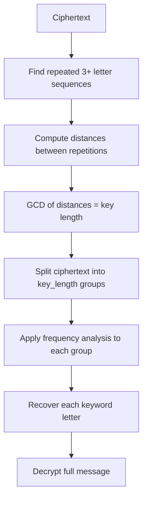

For 300 years, the Vigenère cipher was known as *le chiffre indéchiffrable* — the unbreakable cipher. Unlike monoalphabetic ciphers, it uses a different substitution alphabet for each letter of the message, making simple frequency analysis useless. Understanding how it was finally broken in the 1800s reveals what "computationally secure" actually means — and why pattern is the enemy of secrecy.

## How It Works

The Vigenère cipher uses a **keyword** to determine the shift applied to each letter. Each letter of the keyword specifies a different Caesar shift. The keyword repeats for as long as the message.

**Keyword:** `KEY`  
**K=10, E=4, Y=24** (shift values for each position)

```
Plaintext:  A T T A C K A T D A W N
Keyword:    K E Y K E Y K E Y K E Y
Shifts:    10  4 24 10  4 24 10  4 24 10  4 24

A+10 = K
T+4  = X
T+24 = R
A+10 = K
C+4  = G
K+24 = I
A+10 = K
T+4  = X
D+24 = B
A+10 = K
W+4  = A
N+24 = L

Ciphertext: K X R K G I K X B K A L
```

## The Vigenère Square

The Vigenère square (tabula recta) is a 26×26 grid where row i contains the Caesar cipher for shift i. To encrypt: find the row for the keyword letter, then the column for the plaintext letter — the intersection is the ciphertext letter.

```
     A B C D E F G H I J K L M N O P Q R S T U V W X Y Z
A  [ A B C D E F G H I J K L M N O P Q R S T U V W X Y Z ]
B  [ B C D E F G H I J K L M N O P Q R S T U V W X Y Z A ]
C  [ C D E F G H I J K L M N O P Q R S T U V W X Y Z A B ]
...
K  [ K L M N O P Q R S T U V W X Y Z A B C D E F G H I J ]   ← row for keyword letter K
...
```

**To encrypt A with key K:** Row K, Column A = **K**  
**To decrypt K with key K:** Find K in Row K → column A = **A**

## Encryption and Decryption

```python
def vigenere_encrypt(plaintext: str, keyword: str) -> str:
    result = []
    keyword = keyword.upper()
    key_index = 0

    for char in plaintext.upper():
        if char.isalpha():
            shift = ord(keyword[key_index % len(keyword)]) - ord('A')
            encrypted = chr((ord(char) - ord('A') + shift) % 26 + ord('A'))
            result.append(encrypted)
            key_index += 1
        else:
            result.append(char)

    return ''.join(result)

def vigenere_decrypt(ciphertext: str, keyword: str) -> str:
    result = []
    keyword = keyword.upper()
    key_index = 0

    for char in ciphertext.upper():
        if char.isalpha():
            shift = ord(keyword[key_index % len(keyword)]) - ord('A')
            decrypted = chr((ord(char) - ord('A') - shift + 26) % 26 + ord('A'))
            result.append(decrypted)
            key_index += 1
        else:
            result.append(char)

    return ''.join(result)

# Example
cipher = vigenere_encrypt("ATTACK AT DAWN", "KEY")
print(cipher)   # KXRKGI KX BKAL
plain = vigenere_decrypt(cipher, "KEY")
print(plain)    # ATTACK AT DAWN
```

## Why It Defeated Frequency Analysis

With a monoalphabetic cipher, 'E' always maps to the same ciphertext letter. With Vigenère, 'E' maps to different letters depending on its position in the message:

```
Keyword: KEY  (repeating)

Position 1 (K, shift 10): E → O
Position 2 (E, shift  4): E → I
Position 3 (Y, shift 24): E → C
Position 4 (K, shift 10): E → O  (repeats)
...
```

The frequency peak for 'E' is spread across multiple ciphertext letters. If you plot letter frequencies, you get a much flatter distribution — the distinctive English peaks are hidden.

```
Monoalphabetic: Frequency peaks are clear → frequency analysis works immediately
Vigenère:       Frequencies are smoothed → simple frequency analysis fails
```

## The Kasiski Test: Breaking Vigenère

**Charles Babbage** (famous for the Difference Engine) broke the Vigenère cipher around 1854, though he never published. Friedrich Kasiski independently published the attack in 1863.

**The key insight:** If the same plaintext sequence appears at a distance that is a multiple of the keyword length, it will produce the same ciphertext sequence. These repeated sequences reveal the keyword length.

### Step 1: Find Repeated Sequences

Search the ciphertext for sequences of 3+ letters that appear more than once:

```
Ciphertext: VHVSSPQUCEMRVBVBBBVHVSURQGIBDUGRNICJPBRVBVBUWVHVSQBKCGDGVKUHM...

Repeated sequences:
  "VHV" appears at positions 0 and 18 → distance = 18
  "VBV" appears at positions 12 and 24 → distance = 12
  "BVB" appears at positions 13 and 25 → distance = 12
```

### Step 2: Find the Key Length

The key length divides all the distances between repeated sequences.

```
Distances: 18, 12, 12
GCD(18, 12, 12) = 6

Likely key length: 6 (or a factor: 3, 2, 1)
```

### Step 3: Frequency Analysis on Each Sub-Alphabet

With key length 6, every 6th letter was encrypted with the same shift — so it's just a Caesar cipher. Extract every 6th letter starting at positions 0, 1, 2, 3, 4, 5 and apply frequency analysis to each group independently.

```python
def find_key_length(ciphertext: str, max_key_length: int = 20) -> int:
    from math import gcd
    from functools import reduce

    text = ''.join(c for c in ciphertext.upper() if c.isalpha())
    distances = []

    # Find repeated trigrams and their distances
    for i in range(len(text) - 3):
        trigram = text[i:i+3]
        for j in range(i + 3, len(text) - 3):
            if text[j:j+3] == trigram:
                distances.append(j - i)

    if not distances:
        return -1  # No repeated sequences found

    return reduce(gcd, distances)

def crack_vigenere(ciphertext: str, key_length: int) -> str:
    from collections import Counter
    text = ''.join(c for c in ciphertext.upper() if c.isalpha())
    key = []

    english_freq_order = 'ETAOINSHRDLCUMWFGYPBVKJXQZ'

    for i in range(key_length):
        # Extract every key_length-th character starting at position i
        group = text[i::key_length]
        freq = Counter(group)
        most_common = freq.most_common(1)[0][0]
        # Assume most common maps to 'E'
        shift = (ord(most_common) - ord('E')) % 26
        key.append(chr(shift + ord('A')))

    return ''.join(key)
```

### The Attack Summary



## Historical Significance

| Year | Event |
|------|-------|
| 1553 | Giovan Battista Bellaso describes the cipher (misattributed to Vigenère) |
| 1586 | Blaise de Vigenère publishes a variant using autokey |
| 1800s | Cipher used by Confederate Army in US Civil War for field communications |
| ~1854 | Charles Babbage breaks it (classified, never published) |
| 1863 | Friedrich Kasiski publishes the Kasiski test |
| 1917 | Gilbert Vernam proposes the one-time pad — theoretically perfect Vigenère |

The Confederacy used the Vigenère cipher during the American Civil War. Their standard keys were phrases like "MANCHESTER BLUFF" and "COMPLETE VICTORY". Union cryptanalysts repeatedly broke their messages, giving the Union significant intelligence advantages.

## Variants and Improvements

**Autokey cipher:** Instead of repeating the keyword, the plaintext itself becomes the key after the initial keyword. This prevents the periodicity that the Kasiski test exploits — but is broken by a different technique (the index of coincidence method).

**Running key cipher:** Use a long, non-repeating text (a book page) as the key. This eliminates periodicity entirely. However, if the key text is not truly random, statistical methods can still attack it.

**One-time pad:** Use a truly random key the same length as the message, used only once. This is provably unbreakable — but the key distribution problem makes it impractical for most applications.

## Security Comparison

| Cipher | Key length | Broken by | When broken |
|--------|-----------|-----------|-------------|
| Caesar | Fixed (1) | Brute force | Ancient |
| Substitution | Fixed (1 permutation) | Frequency analysis | ~800 AD |
| Vigenère | Repeating keyword | Kasiski test | 1863 |
| Autokey | Plaintext-extended | Index of coincidence | 1800s |
| Enigma | Mechanical daily key | Mathematical cryptanalysis | 1940s |
| AES-256 | 256 bits | Not broken | Present |
