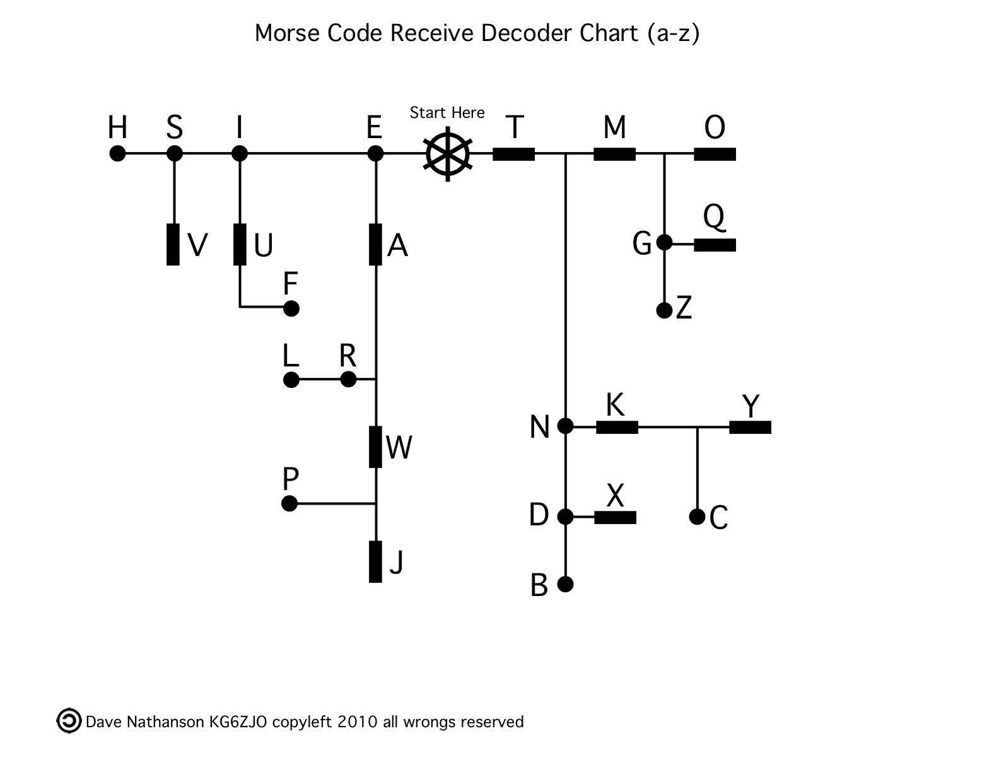

Morse code is a transmission encoding — a system for representing letters and numbers as sequences of short and long signals (dots and dashes) that can be sent over any medium capable of two states: sound, light, radio waves, or electrical pulses. It was the first encoding system designed specifically for long-distance electronic communication, and it shaped how we think about information transmission.

## History

The telegraph, invented in the 1830s, could send electrical pulses over long distances — but only pulses, not letters. Samuel Morse (with Alfred Vail) developed Morse code in 1838 to solve this problem: encode letters as sequences of short (dot ·) and long (dash −) signals.

The first message sent by Morse code over a long-distance line was transmitted on May 24, 1844, from Washington D.C. to Baltimore: **"WHAT HATH GOD WROUGHT"** (Numbers 23:23).

Morse code dominated global communication for over a century:
- **1850s:** Submarine cables begin connecting continents
- **1906:** International wireless telegraphy conference standardizes Morse internationally
- **1912:** Titanic uses Morse code for distress calls (CQD and SOS)
- **WWII:** Morse code is essential for military communications
- **1999:** The Global Maritime Distress and Safety System (GMDSS) officially replaces Morse code for maritime distress
- **2003:** US Coast Guard discontinues routine Morse monitoring

## The Code

International Morse Code (ITU standard):

### Letters

| Letter | Code | | Letter | Code |
|--------|------|-|--------|------|
| A | · − | | N | − · |
| B | − · · · | | O | − − − |
| C | − · − · | | P | · − − · |
| D | − · · | | Q | − − · − |
| E | · | | R | · − · |
| F | · · − · | | S | · · · |
| G | − − · | | T | − |
| H | · · · · | | U | · · − |
| I | · · | | V | · · · − |
| J | · − − − | | W | · − − |
| K | − · − | | X | − · · − |
| L | · − · · | | Y | − · − − |
| M | − − | | Z | − − · · |




### Digits

| Digit | Code |
|-------|------|
| 0 | − − − − − |
| 1 | · − − − − |
| 2 | · · − − − |
| 3 | · · · − − |
| 4 | · · · · − |
| 5 | · · · · · |
| 6 | − · · · · |
| 7 | − − · · · |
| 8 | − − − · · |
| 9 | − − − − · |

### Common Prosigns and Special Sequences

| Sequence | Meaning | Code |
|----------|---------|------|
| SOS | International distress signal | · · · − − − · · · |
| AR | End of transmission | · − · − · |
| SK | End of contact | · · · − · − |
| BT | New paragraph | − · · · − |

**SOS** was chosen not because it stands for anything, but because it's the most distinctive pattern: three dots, three dashes, three dots — impossible to confuse with normal transmission noise.

## Timing

Morse code is defined by timing ratios:

```
1 dot  = 1 unit
1 dash = 3 units

Gap between dots/dashes within a letter: 1 unit
Gap between letters: 3 units
Gap between words: 7 units
```

This means "SOS" sent correctly looks like:

```
· · · [3 units] − − − [3 units] · · ·

· [1] · [1] ·                   (S: 3 units total + gaps)
− [3] − [3] −                   (O: 9 units + gaps)
· [1] · [1] ·                   (S)
```

Experienced operators can send and receive 20–25 words per minute. Top competitors exceed 50 WPM.

## Encoding and Decoding

```python
MORSE_CODE = {
    'A': '.-',   'B': '-...',  'C': '-.-.',  'D': '-..',
    'E': '.',    'F': '..-.',  'G': '--.',   'H': '....',
    'I': '..',   'J': '.---',  'K': '-.-',   'L': '.-..',
    'M': '--',   'N': '-.',    'O': '---',   'P': '.--.',
    'Q': '--.-', 'R': '.-.',   'S': '...',   'T': '-',
    'U': '..-',  'V': '...-',  'W': '.--',   'X': '-..-',
    'Y': '-.--', 'Z': '--..',
    '0': '-----', '1': '.----', '2': '..---', '3': '...--',
    '4': '....-', '5': '.....', '6': '-....', '7': '--...',
    '8': '---..',  '9': '----.',
    '.': '.-.-.-', ',': '--..--', '?': '..--..', "'": '.----.',
    '!': '-.-.--', '/': '-..-.', '(': '-.--.', ')': '-.--.-',
    '&': '.-...', ':': '---...', ';': '-.-.-.', '=': '-...-',
    '+': '.-.-.', '-': '-....-', '_': '..--.-', '"': '.-..-.',
    '$': '...-..-', '@': '.--.-.', ' ': '/'
}

REVERSE_MORSE = {v: k for k, v in MORSE_CODE.items()}

def text_to_morse(text: str) -> str:
    result = []
    for char in text.upper():
        if char in MORSE_CODE:
            result.append(MORSE_CODE[char])
        else:
            result.append('?')
    return ' '.join(result)

def morse_to_text(morse: str) -> str:
    words = morse.strip().split(' / ')
    decoded_words = []
    for word in words:
        letters = word.split(' ')
        decoded_words.append(''.join(REVERSE_MORSE.get(code, '?') for code in letters))
    return ' '.join(decoded_words)

# Examples
print(text_to_morse("SOS"))
# ... --- ...

print(text_to_morse("HELLO WORLD"))
# .... . .-.. .-.. --- / .-- --- .-. .-.. -..

print(morse_to_text(".... . .-.. .-.. --- / .-- --- .-. .-.. -.."))
# HELLO WORLD
```

## The Morse Decoding Tree

A binary tree structure makes Morse decoding efficient. Start at the root; go left for dot, right for dash. Each node is a letter.

```
                    [root]
           ·/              \−
          E                  T
        ·/ \−             ·/ \−
       I     A           N     M
     ·/\−  ·/\−        ·/\−  ·/\−
     S   U  R   W     D   K  G   O
    ...
```

To decode `−·−` (K):
1. Start at root
2. Dash → go right → T
3. Dot → go left → N
4. Dash → go right → K ✓

## Transmission Media

Morse code was designed to be transmission-medium agnostic. The two-state encoding works on any channel that supports two distinguishable states:

| Medium | Dot | Dash |
|--------|-----|------|
| Telegraph wire | Short pulse | Long pulse |
| Radio (CW) | Short tone | Long tone |
| Light (lamp) | Short flash | Long flash |
| Sound | Short beep | Long beep |
| Flags (semaphore-style) | Quick wave | Slow wave |
| Tapping | One tap | Two taps |

This medium independence is why Morse code survived long after the telegraph era. Navy signals, pilot distress, cave rescue, and even covert prison communication have all used Morse.

## Is Morse Code Secure?

Morse code is **encoding, not encryption**. Anyone who knows the code table can decode any Morse transmission. Historically, military Morse transmissions were encrypted *before* encoding in Morse — the content was already ciphertext, and Morse was just the transmission format.

The distinction matters: a sequence of dots and dashes looks mysterious to someone who doesn't know Morse, but it provides zero security against anyone who does. "Security through obscurity" fails here as it does everywhere.

## Modern Relevance

Morse code is no longer used for maritime distress signals (replaced by GMDSS), but it persists in:

- **Amateur radio (ham radio):** Many operators still use CW (continuous wave) Morse transmission; some licenses require Morse knowledge
- **Aviation:** VOR and NDB navigation beacons still transmit their identifier in Morse code
- **Military:** Special forces trained in radio operations learn Morse as a fallback communication method
- **Accessibility:** iOS and Android support Morse code as an input method for users with motor disabilities (tapping the screen)
- **Cultural:** SOS (· · · − − − · · ·) is universally recognized
