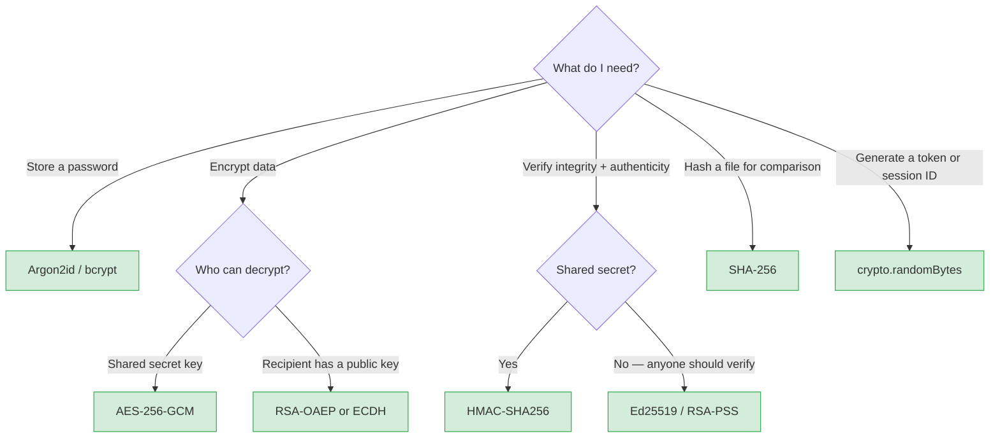

Cryptography is the mathematical foundation of application security. You don't need to implement it, but you need to understand what each primitive guarantees so you use it correctly.


*Symmetric encryption: the same key encrypts and decrypts. Asymmetric encryption uses a key pair.*

## Core Properties

| Property | Definition | Achieved by |
|---|---|---|
| **Confidentiality** | Only authorized parties can read the data | Symmetric/asymmetric encryption |
| **Integrity** | Data has not been modified in transit or at rest | MACs, digital signatures, authenticated encryption |
| **Authenticity** | Data came from who it claims it came from | Digital signatures, MACs with shared key |
| **Non-repudiation** | Sender cannot deny sending the data | Asymmetric digital signatures |
| **Freshness** | Data is not a replay of old data | Nonces, timestamps, sequence numbers |

No single primitive provides all properties. Secure systems combine primitives.

---

## Hashing

A hash function takes arbitrary input and produces a fixed-size digest. It is **one-way** (non-reversible) and **deterministic** (same input always gives same output).

**Properties of a secure hash function:**
- **Collision resistance:** Infeasible to find two inputs with the same digest
- **Preimage resistance:** Infeasible to reverse a digest to its input
- **Avalanche effect:** A 1-bit change in input changes ~50% of output bits

### Use Cases

| Use case | Algorithm |
|---|---|
| Password hashing | Argon2id, bcrypt, scrypt |
| Data integrity (checksums) | SHA-256, SHA-3 |
| Digital signatures (hash-then-sign) | SHA-256, SHA-384 |
| HMAC keys/tokens | SHA-256, SHA-512 |
| File deduplication | SHA-256 |

### What Not to Use

| Algorithm | Problem |
|---|---|
| MD5 | Broken — collisions found in seconds |
| SHA-1 | Broken — collisions demonstrated (SHAttered attack) |
| SHA-256 (for passwords) | Too fast — brute-forceable with GPUs; use a KDF instead |

**The MD5/SHA-1 trap:** These are not "slightly weaker" — they are cryptographically broken for integrity and signature use cases. Never use them for new applications.

---

## Message Authentication Codes (MACs)

A MAC combines a message with a shared secret key to produce an authentication tag. Unlike hashes, only parties with the key can verify or generate a valid tag.

```
MAC(key, message) → tag

Verify: MAC(key, received_message) == received_tag
```

**HMAC (Hash-based MAC)** is the standard:

```javascript
import { createHmac } from 'crypto';

const tag = createHmac('sha256', secretKey)
  .update(message)
  .digest('hex');
```

**Use cases:** Token signing (HMAC-SHA256 in JWTs), webhook payload verification, request signing.

**Critical:** Always use a constant-time comparison to verify MACs. A byte-by-byte short-circuit comparison leaks timing information:

```javascript
// ✗ Vulnerable to timing attack
if (receivedTag === computedTag) { ... }

// ✓ Constant-time comparison
import { timingSafeEqual } from 'crypto';
const safe = timingSafeEqual(
  Buffer.from(receivedTag, 'hex'),
  Buffer.from(computedTag, 'hex')
);
```

---

## Symmetric Encryption

Both parties share a single secret key. Fast — used for bulk data encryption.

**The only algorithm to use for new applications: AES-256-GCM**

- **AES (Advanced Encryption Standard):** The standard block cipher, standardized by NIST
- **256-bit key:** 2^256 possible keys — computationally infeasible to brute-force
- **GCM (Galois/Counter Mode):** Provides authenticated encryption — it simultaneously encrypts and authenticates, preventing tampering

```
AES-256-GCM:
  Input: plaintext + 256-bit key + 96-bit nonce (IV)
  Output: ciphertext + 128-bit authentication tag

Decrypt fails if the tag doesn't match → detects tampering
```

See [Symmetric Encryption](/security/cryptography/symmetric-encryption) for implementation details.

**Do not use:**
- ECB mode — identical plaintext blocks produce identical ciphertext blocks, leaking patterns
- CBC mode without MAC — vulnerable to padding oracle attacks (POODLE, BEAST)
- DES / 3DES — key lengths too short for modern hardware

---

## Asymmetric Encryption

Two mathematically related keys: a public key (share freely) and a private key (keep secret). What one key encrypts, only the other can decrypt.

**Primary use cases:**
- **Key exchange:** One party encrypts a session key with the other's public key; only that party can decrypt it
- **Digital signatures:** Sign with private key; anyone with the public key can verify

**Algorithms:**

| Algorithm | Key type | Use case |
|---|---|---|
| RSA-OAEP | Encryption | Encrypt small data, key exchange |
| ECDH / X25519 | Key agreement | Establish shared secret (TLS, Signal) |
| RSA-PSS | Signatures | Sign with RSA private key |
| ECDSA | Signatures | Elliptic curve signatures |
| Ed25519 | Signatures | Modern, fast, small keys |

See [Asymmetric Encryption](/security/cryptography/asymmetric-encryption) for implementation and TLS details.

---

## Key Derivation Functions (KDFs)

KDFs derive a cryptographic key from a lower-entropy source (password, passphrase). They are intentionally slow and memory-hard to make brute-force attacks expensive.

| KDF | Recommended? | Notes |
|---|---|---|
| **Argon2id** | ✓ Best for passwords | Winner of Password Hashing Competition; configurable memory + time cost |
| **bcrypt** | ✓ Widely supported | 72-byte password limit; work factor via cost parameter |
| **scrypt** | ✓ Memory-hard | Older than Argon2 but solid |
| PBKDF2-SHA256 | ⚠ Only if required | Not memory-hard; only use if Argon2/bcrypt unavailable |
| MD5 / SHA-1 | ✗ Never | Not KDFs — instant cracking |

```javascript
// Node.js — argon2 package
import argon2 from 'argon2';

const hash = await argon2.hash(password, {
  type: argon2.argon2id,
  memoryCost: 65536,   // 64 MiB
  timeCost: 3,         // 3 iterations
  parallelism: 4,
});

const valid = await argon2.verify(hash, submittedPassword);
```

---

## Randomness

Cryptographic operations require unpredictable random values. Use a **CSPRNG** (Cryptographically Secure Pseudo-Random Number Generator).

```javascript
// Node.js
import { randomBytes } from 'crypto';

const nonce = randomBytes(16);         // 128-bit nonce
const sessionId = randomBytes(32).toString('hex');  // 256-bit session ID
const token = randomBytes(32).toString('base64url'); // URL-safe token
```

**Never use:**
- `Math.random()` — not cryptographically secure; predictable
- Timestamp-based seeds — low entropy
- Sequential or predictable values for secrets

---

## Nonces and IVs

A **nonce** ("number used once") is a random value that must be unique per encryption operation. Its purpose is to ensure identical plaintexts produce different ciphertexts.

- For AES-GCM: 96-bit (12 byte) nonce, never reuse with the same key
- For counter-based modes: the counter itself acts as a nonce
- Send alongside the ciphertext — it is not secret, but it must be random

**Nonce reuse is catastrophic in GCM.** Reusing a (key, nonce) pair in AES-GCM allows an attacker to recover the authentication key and XOR the plaintexts together.

---

## Which Primitive Should I Use?



## Applied Summary

| Task | Use |
|---|---|
| Store passwords | Argon2id (or bcrypt) |
| Encrypt data at rest | AES-256-GCM with a fresh random nonce per record |
| Transmit data securely | TLS 1.3 (handles key exchange + authenticated encryption) |
| Verify message integrity + authenticity | HMAC-SHA256 |
| Sign data (non-repudiation) | Ed25519 or RSA-PSS |
| Generate session IDs, tokens | `crypto.randomBytes(32)` |
| Hash files for comparison | SHA-256 |
| Derive key from password | Argon2id |
