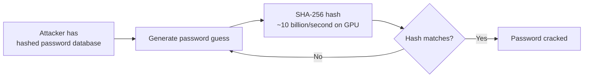
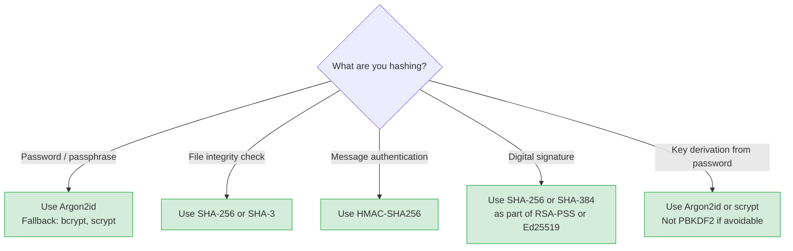

Storing passwords in plaintext is one of the most consequential security mistakes a developer can make. When a database is breached — and breaches happen constantly — every user's password is immediately exposed. Cryptographic hashing transforms passwords into fixed-size digests that cannot be reversed. Salting prevents attackers from precomputing the answers. Together, they turn a catastrophic breach into a recoverable incident.

## What Is a Hash Function?

A **cryptographic hash function** takes any input and produces a fixed-size output (the hash or digest). It has three essential properties:

1. **One-way (preimage resistance):** Given a hash, it is computationally infeasible to find the input that produced it
2. **Collision resistance:** It is computationally infeasible to find two different inputs that produce the same hash
3. **Deterministic:** The same input always produces the same hash
4. **Avalanche effect:** A tiny change in input produces a completely different hash

```python
import hashlib

h1 = hashlib.sha256(b"hello").hexdigest()
h2 = hashlib.sha256(b"hellp").hexdigest()  # One letter changed

print(h1)  # 2cf24dba5fb0a30e26e83b2ac5b9e29e1b161e5c1fa7425e73043362938b9824
print(h2)  # 40d9d20b54c7ccf8e0b9b14ca13af8ed7c5b5f0de2c74cc618f49f0ff7b74fad
           # Completely different — this is the avalanche effect
```

## Hash Algorithms

| Algorithm | Output size | Speed | Use today? |
|-----------|------------|-------|------------|
| MD5 | 128 bits (32 hex) | Very fast | Never — broken (collisions trivial) |
| SHA-1 | 160 bits (40 hex) | Fast | Never — broken (SHAttered collision) |
| SHA-256 | 256 bits (64 hex) | Fast | Yes — for integrity, signatures, HMACs |
| SHA-3 | 256/512 bits | Fast | Yes — alternative to SHA-2 |
| bcrypt | 184 bits | Slow (by design) | Yes — for passwords |
| scrypt | Variable | Very slow + memory-hard | Yes — for passwords |
| Argon2id | Variable | Slow + memory-hard | Best — for passwords |

**Critical distinction:** SHA-256 is excellent for data integrity and digital signatures, but **never use it directly for passwords**. It is too fast — a modern GPU can compute 10 billion SHA-256 hashes per second, making brute-force attacks trivially fast.

## Why Fast Hashing Fails for Passwords



An 8-character lowercase password has 26⁸ = 208 billion combinations. At 10 billion SHA-256 hashes per second, this takes **~21 seconds**. Including uppercase, digits, and symbols (95⁸ = 6.6 quadrillion combinations) takes about 7.7 days.

Password hashing algorithms are deliberately designed to be **slow** — they perform thousands or millions of iterations internally, making each guess take 100ms–1 second instead of 0.0000001 seconds.

## The Rainbow Table Problem

Even with a slow hash, a pre-computation attack is possible. A **rainbow table** is a precomputed table of hashes for common passwords:

```
Password → SHA-256 hash
"123456"   → 8d969eef6ecad3c29a3a629280e686cf0c3f5d5a86aff3ca12020c923adc6c92
"password" → 5e884898da28047151d0e56f8dc6292773603d0d6aabbdd62a11ef721d1542d8
"qwerty"   → 65e84be33532fb784c48129675f9eff3a682b27168c0ea744b2cf58ee02337c5
...
```

After a breach, attackers look up each hashed password in the rainbow table. If the password is common or short, the lookup takes milliseconds.

**Scale:** The CrackStation wordlist contains 1.5 billion words with MD5 and SHA-256 hashes precomputed. The table is 247 GB but instantly cracks most weak passwords.

## Salting: Defeating Precomputation

A **salt** is a random value added to the password before hashing. Each user gets a unique, randomly generated salt.

```
Without salt:
  password "hunter2" → always produces the same hash

With salt:
  salt = random 16 bytes (different for each user)
  "hunter2" + salt_alice → unique hash A
  "hunter2" + salt_bob   → unique hash B (completely different)
```

Salts completely defeat rainbow tables:
1. The attacker cannot precompute — they would need a separate rainbow table for every possible salt
2. Two users with the same password have different hashes — revealing one hash reveals nothing about others
3. The salt does not need to be secret — it is stored alongside the hash in the database

```mermaid
flowchart TD
    P[Password: "hunter2"] --> H1[Hash without salt\nSHA-256: abc123...]
    P --> S1[Salt: f3a9...]
    S1 --> C1[Concatenate: hunter2 + f3a9...]
    C1 --> H2[Hash with salt\nArgon2id: 9ef823...]
    H2 --> DB[Store: f3a9... + 9ef823...\nin database]
```

## Password Hashing Algorithms

### bcrypt

bcrypt was designed in 1999 specifically for password hashing. It includes a **work factor** (cost parameter) that controls how many iterations are performed — making it adaptable to faster hardware.

```python
import bcrypt

# Hash a password
password = b"mysecretpassword"
salt = bcrypt.gensalt(rounds=12)  # rounds=12 means 2^12 iterations
hashed = bcrypt.hashpw(password, salt)
print(hashed)
# b'$2b$12$EXRkfkdmXn2gzds2SSitu.MW9.1BiZFAeyk/cWZh.FJSZ2g/o4Vm6'

# Verify a password
def check_password(password: bytes, hashed: bytes) -> bool:
    return bcrypt.checkpw(password, hashed)

check_password(b"mysecretpassword", hashed)  # True
check_password(b"wrongpassword", hashed)     # False
```

**bcrypt limitations:**
- 72-byte maximum password length (passwords longer than 72 bytes are silently truncated)
- Not memory-hard (an ASIC can parallelize bcrypt better than a CPU)
- Still excellent and widely supported

### scrypt

scrypt (2009) adds **memory hardness** — it requires large amounts of memory in addition to CPU time. This makes it much more expensive to attack with specialized hardware (ASICs and FPGAs have limited memory bandwidth).

```python
import hashlib, os

def hash_password_scrypt(password: str) -> tuple[bytes, bytes]:
    salt = os.urandom(16)
    hashed = hashlib.scrypt(
        password.encode(),
        salt=salt,
        n=16384,   # CPU/memory cost (must be power of 2)
        r=8,       # Block size
        p=1,       # Parallelization factor
        dklen=32   # Output length in bytes
    )
    return salt, hashed

def verify_scrypt(password: str, salt: bytes, expected_hash: bytes) -> bool:
    computed = hashlib.scrypt(password.encode(), salt=salt, n=16384, r=8, p=1, dklen=32)
    return hmac.compare_digest(computed, expected_hash)
```

### Argon2id (Recommended)

Argon2 won the Password Hashing Competition in 2015 and is the current recommended algorithm. **Argon2id** combines the properties of Argon2i (resistant to side-channel attacks) and Argon2d (resistant to GPU cracking).

```python
import argon2

ph = argon2.PasswordHasher(
    time_cost=3,        # Number of iterations
    memory_cost=65536,  # 64 MiB of memory
    parallelism=4,      # Parallel threads
    hash_len=32,        # Output hash length in bytes
    salt_len=16,        # Random salt length in bytes
)

# Hash
hashed = ph.hash("mysecretpassword")
print(hashed)
# $argon2id$v=19$m=65536,t=3,p=4$c29tZXNhbHQ$RdescudvJCsgt3ub+b+dWRWJTmaaJObG

# Verify
try:
    ph.verify(hashed, "mysecretpassword")
    print("Password correct")
except argon2.exceptions.VerifyMismatchError:
    print("Password incorrect")

# Check if rehash needed (e.g., after upgrading parameters)
if ph.check_needs_rehash(hashed):
    hashed = ph.hash(password)
    # Store new hash in database
```

**Argon2id parameters:**
- `time_cost=3`: 3 iterations (increase if hash takes < 100ms on your hardware)
- `memory_cost=65536`: 64 MiB (increase for better resistance; more than GPU VRAM = attacker can't parallelize)
- `parallelism=4`: Use 4 CPU threads (match to server CPU cores)

The Argon2id hash string stores the algorithm, version, parameters, salt, and hash together — everything needed for verification is in one string.

## Secure Password Verification

Always use **constant-time comparison** when verifying hashes. Timing attacks measure how long comparison takes — if comparison stops at the first mismatched byte, an attacker can determine the hash byte-by-byte.

```python
import hmac

# ✗ Vulnerable to timing attack
if stored_hash == computed_hash:
    ...

# ✓ Constant-time comparison
if hmac.compare_digest(stored_hash, computed_hash):
    ...

# ✓ Password hashing libraries handle this automatically
ph.verify(stored_hash, user_supplied_password)  # argon2-cffi
bcrypt.checkpw(password, hashed)                # bcrypt
```

## Algorithm Selection Guide



## What to Never Do

| Mistake | Why it's bad | Fix |
|---------|-------------|-----|
| Store plaintext passwords | Breach exposes all passwords immediately | Use Argon2id |
| Hash without a salt | Rainbow tables crack common passwords instantly | Argon2id generates salt automatically |
| Use MD5 or SHA-1 | Cryptographically broken; MD5 collisions in seconds | Use SHA-256+ or Argon2id |
| Use SHA-256 directly for passwords | Too fast; GPU can try billions/second | Use Argon2id |
| Use the same salt for all users | Rainbow table for one salt works for all users | Generate a unique salt per user |
| Use a predictable salt | Attacker precomputes for predictable salts | Use `os.urandom(16)` or let Argon2id handle it |

## Upgrade Strategy

When upgrading from weak hashing (MD5, SHA-1) to a strong algorithm:

1. Add an `algorithm_version` field to the users table
2. On successful login, check if the stored hash uses the old algorithm
3. Re-hash the plaintext password (available at login) with the new algorithm
4. Store the new hash and update `algorithm_version`
5. After a migration period, force-reset passwords for users who haven't logged in

Never try to hash the existing hash — that doesn't improve security. You need the original plaintext, which is only available at login.
