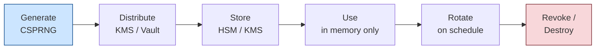
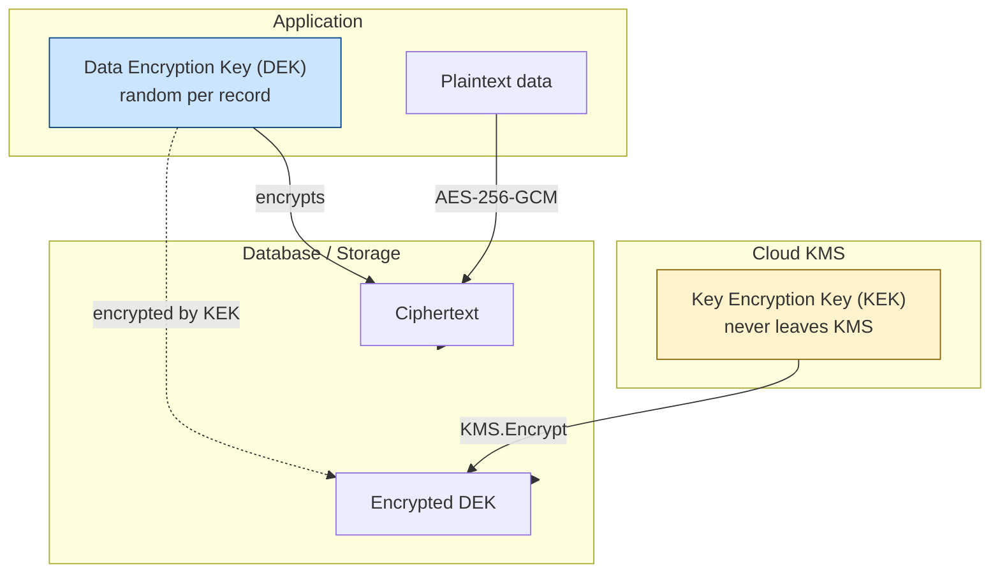

Cryptographic algorithms are only as secure as their key management. The most common cryptographic failures in real applications are not broken algorithms — they are mismanaged keys: hardcoded in source code, shared over email, never rotated, or impossible to revoke.

## Key Lifecycle



Every key should have defined answers to:
- How is it generated? (algorithm, length, CSPRNG)
- Who has access? (principle of least privilege)
- Where is it stored? (secrets manager, HSM, environment variable)
- How long is it valid? (rotation schedule)
- How is it revoked if compromised?

---

## Key Generation

Always use a CSPRNG with sufficient entropy:

```javascript
import { randomBytes } from 'crypto';

// AES-256 key
const aesKey = randomBytes(32);  // 256 bits

// HMAC-SHA256 key
const hmacKey = randomBytes(32);

// Export for storage
const hexKey = aesKey.toString('hex');  // 64 hex chars
```

**Minimum key lengths:**

| Algorithm | Minimum key size |
|---|---|
| AES | 256 bits (128 is technically safe but use 256) |
| HMAC-SHA256 | 256 bits |
| RSA | 2048 bits (4096 preferred) |
| ECC | 256 bits (P-256 / X25519) |

---

## Where to Store Keys

### ✓ Hardware Security Modules (HSMs)

HSMs are tamper-resistant hardware devices that store keys and perform cryptographic operations internally — the key never leaves the device in plaintext.

- **Use for:** Root CA keys, payment processing, high-value signing keys
- **Cloud options:** AWS CloudHSM, Azure Dedicated HSM, GCP Cloud HSM
- **Performance:** Operations go to the HSM over a network; throughput is limited

### ✓ Cloud Key Management Services (KMS)

Managed services that provide HSM-backed key storage without managing hardware:

| Provider | Service | Notes |
|---|---|---|
| AWS | AWS KMS | IAM integration; envelope encryption pattern |
| GCP | Cloud KMS | Cloud IAM; Cloud EKM for external key material |
| Azure | Azure Key Vault | RBAC; supports certificates + secrets |
| HashiCorp | Vault | Self-hosted or Vault Cloud; transit secrets engine |

```javascript
// AWS KMS — encrypt data key (envelope encryption)
import { KMSClient, GenerateDataKeyCommand, DecryptCommand } from '@aws-sdk/client-kms';

const kms = new KMSClient({ region: 'us-east-1' });

// Generate a data key (plaintext + encrypted versions)
const { Plaintext, CiphertextBlob } = await kms.send(new GenerateDataKeyCommand({
  KeyId: 'arn:aws:kms:us-east-1:123456789:key/abc...',
  KeySpec: 'AES_256',
}));

// Encrypt data with Plaintext key, store CiphertextBlob alongside data
// Clear Plaintext from memory immediately after use
const encrypted = encryptData(Plaintext, sensitiveData);
Plaintext.fill(0);  // zero out the plaintext key

// Later — to decrypt:
const { Plaintext: dataKey } = await kms.send(new DecryptCommand({ CiphertextBlob }));
const decrypted = decryptData(dataKey, encrypted);
dataKey.fill(0);
```

### ✓ Secrets Managers

For application secrets (API keys, connection strings, certificates):

| Tool | Best for |
|---|---|
| AWS Secrets Manager | AWS-native apps; automatic rotation |
| HashiCorp Vault | Multi-cloud; dynamic secrets; fine-grained policies |
| GCP Secret Manager | GCP-native apps |
| Azure Key Vault | Azure-native apps; unified secrets + keys + certs |
| Infisical | Open-source Vault alternative |

```bash
# Read a secret at runtime (never hardcode it)
export DB_PASSWORD=$(aws secretsmanager get-secret-value \
  --secret-id prod/db/password \
  --query SecretString --output text)
```

### ⚠ Environment Variables

Acceptable for non-production or when a secrets manager is unavailable, with caveats:
- Do not log environment variables (`printenv`, `env`, process dumps can leak them)
- Use `.env` files only for local dev; add `.env` to `.gitignore`
- Secrets must still be rotated and revoked

### ✗ What Not to Do

```javascript
// ✗ Hardcoded in source
const key = '4a5b6c7d8e9f0a1b2c3d4e5f6a7b8c9d';

// ✗ In a config file committed to git
// config.json: { "encryptionKey": "4a5b6c7d..." }

// ✗ In the database alongside the encrypted data
// SELECT key, encrypted_data FROM secrets WHERE id = ?

// ✗ Sent over Slack/email during deployment
```

---

## Envelope Encryption

A pattern for encrypting large amounts of data with a KMS:



```
Data Encryption Key (DEK) — random per-record, used to encrypt the data
Key Encryption Key (KEK)  — stored in KMS, used to encrypt the DEK

Storage:
  record.encrypted_data = AES-256-GCM(DEK, plaintext)
  record.encrypted_dek  = KMS.encrypt(KEK_id, DEK)

Decryption:
  DEK = KMS.decrypt(record.encrypted_dek)
  plaintext = AES-256-GCM.decrypt(DEK, record.encrypted_data)
```

**Why this pattern?**
- KMS never touches the actual data — only DEKs
- You can re-encrypt the DEK with a new KEK without touching the data
- Access to the KEK (in KMS) is controllable via IAM/ACLs
- DEKs are never stored in plaintext

---

## Key Rotation

Keys should be rotated on a schedule or after any security event:

**Rotation schedule guidelines:**
- Symmetric encryption keys: annually, or per compliance requirement
- HMAC/signing keys: 90 days – 1 year
- TLS certificates: before expiry (Let's Encrypt: 90 days; internal CA: 1–2 years)
- API keys: 90 days or less if used externally
- Long-term root CA keys: 5–20 years (HSM-stored, rarely used)

**Zero-downtime rotation strategy:**
1. Generate new key version alongside old one
2. New data encrypted with new key; old data still decryptable with old key
3. Background job re-encrypts old records with new key
4. Old key retired once no remaining data uses it

```javascript
// Version-aware decryption
const KEY_VERSIONS = {
  'v2': loadKey(process.env.KEY_V2),  // current
  'v1': loadKey(process.env.KEY_V1),  // legacy — kept until all data migrated
};

function decrypt(encryptedRecord) {
  const version = encryptedRecord.keyVersion;
  const key = KEY_VERSIONS[version];
  if (!key) throw new Error(`Unknown key version: ${version}`);
  return aesDecrypt(key, encryptedRecord.ciphertext);
}
```

---

## Key Compromise Response

If you suspect a key has been compromised:

1. **Rotate immediately** — generate a new key and update all systems to use it
2. **Revoke the old key** — in KMS, disable the compromised key so it cannot be used
3. **Re-encrypt all data** — data encrypted with the compromised key must be re-encrypted
4. **Audit usage** — check KMS logs for unauthorized decryption events
5. **Notify affected parties** — if a TLS key was compromised, notify certificate authority (revoke certificate)
6. **Post-mortem** — determine how the key was exposed and fix the root cause

---

## Key Management Policy Checklist

- [ ] All keys generated with a CSPRNG and appropriate length
- [ ] No keys stored in source code, configuration files, or databases
- [ ] Keys stored in a KMS, HSM, or secrets manager
- [ ] Access to keys logged and auditable (KMS CloudTrail)
- [ ] Rotation schedule defined and automated for all keys
- [ ] Revocation procedure documented and tested
- [ ] Separate keys per environment (dev, staging, prod)
- [ ] Separate keys per service/tenant where applicable
- [ ] Key material destroyed (zeroed) after use in memory
- [ ] Backup/recovery process for KMS in case of provider outage
