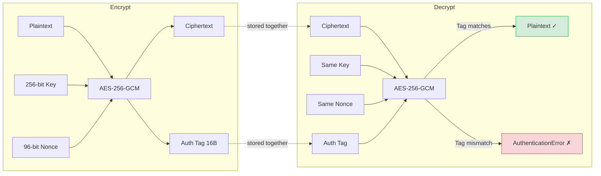

Symmetric encryption uses one shared key for both encryption and decryption. It is fast and suitable for encrypting large amounts of data. The challenge is key management — getting the key securely to both parties.

## AES-256-GCM: The Standard

**AES-256-GCM** is the correct choice for virtually all symmetric encryption needs:



- **AES (Advanced Encryption Standard):** Hardware-accelerated on modern CPUs (AES-NI instructions)
- **256-bit key:** 2^256 key space; immune to brute force for the foreseeable future
- **GCM (Galois/Counter Mode):** An AEAD (Authenticated Encryption with Associated Data) mode that simultaneously encrypts and authenticates


*Each AES round applies four operations. AES-256 runs 14 rounds total. GCM mode wraps this in a counter + authentication layer.*

The authentication tag in GCM means you get both confidentiality and integrity from a single operation. If any bit of the ciphertext or header is modified, decryption fails with an explicit error.

```
Encrypt(key, nonce, plaintext, aad?) → (ciphertext, tag)
Decrypt(key, nonce, ciphertext, tag, aad?) → plaintext  OR  AuthenticationError
```

`aad` (Additional Authenticated Data) is optional data that is authenticated but not encrypted — useful for metadata like record IDs or version numbers.

---

## Implementation

### Node.js

```javascript
import { createCipheriv, createDecipheriv, randomBytes } from 'crypto';

const ALGORITHM = 'aes-256-gcm';
const KEY_BYTES = 32;   // 256 bits
const NONCE_BYTES = 12; // 96 bits — GCM standard

function encrypt(key, plaintext, aad = null) {
  const nonce = randomBytes(NONCE_BYTES);
  const cipher = createCipheriv(ALGORITHM, key, nonce);

  if (aad) cipher.setAAD(Buffer.from(aad));

  const encrypted = Buffer.concat([cipher.update(plaintext, 'utf8'), cipher.final()]);
  const tag = cipher.getAuthTag();  // 16-byte authentication tag

  // Store nonce + tag + ciphertext together
  return Buffer.concat([nonce, tag, encrypted]);
}

function decrypt(key, data, aad = null) {
  const nonce = data.subarray(0, NONCE_BYTES);
  const tag = data.subarray(NONCE_BYTES, NONCE_BYTES + 16);
  const ciphertext = data.subarray(NONCE_BYTES + 16);

  const decipher = createDecipheriv(ALGORITHM, key, nonce);
  decipher.setAuthTag(tag);

  if (aad) decipher.setAAD(Buffer.from(aad));

  // Throws if authentication fails — do not catch silently
  return Buffer.concat([decipher.update(ciphertext), decipher.final()]).toString('utf8');
}
```

### Python

```python
from cryptography.hazmat.primitives.ciphers.aead import AESGCM
import os

def encrypt(key: bytes, plaintext: str, aad: bytes = None) -> bytes:
    nonce = os.urandom(12)  # 96-bit nonce
    aesgcm = AESGCM(key)
    ct = aesgcm.encrypt(nonce, plaintext.encode(), aad)
    return nonce + ct  # nonce prepended; tag is appended by the library

def decrypt(key: bytes, data: bytes, aad: bytes = None) -> str:
    nonce, ct = data[:12], data[12:]
    aesgcm = AESGCM(key)
    plaintext = aesgcm.decrypt(nonce, ct, aad)  # raises InvalidTag on failure
    return plaintext.decode()
```

### Go

```go
import (
    "crypto/aes"
    "crypto/cipher"
    "crypto/rand"
    "io"
)

func encrypt(key, plaintext []byte) ([]byte, error) {
    block, err := aes.NewCipher(key)
    if err != nil { return nil, err }

    gcm, err := cipher.NewGCM(block)
    if err != nil { return nil, err }

    nonce := make([]byte, gcm.NonceSize())
    if _, err = io.ReadFull(rand.Reader, nonce); err != nil { return nil, err }

    // Seal appends tag automatically
    ciphertext := gcm.Seal(nonce, nonce, plaintext, nil)
    return ciphertext, nil
}

func decrypt(key, data []byte) ([]byte, error) {
    block, _ := aes.NewCipher(key)
    gcm, _ := cipher.NewGCM(block)

    nonceSize := gcm.NonceSize()
    nonce, ciphertext := data[:nonceSize], data[nonceSize:]
    return gcm.Open(nil, nonce, ciphertext, nil) // error if auth fails
}
```

---

## Key Generation

Generate keys with a CSPRNG. Never derive keys from passwords directly — use Argon2id or another KDF first.

```javascript
// Generate a new random key (do this once, then store securely)
const key = randomBytes(32);  // 256-bit AES key

// Derive key from a password (for user-encrypted data)
import argon2 from 'argon2';

const derived = await argon2.hash(password, {
  type: argon2.argon2id,
  raw: true,          // returns raw bytes, not encoded string
  hashLength: 32,     // 256-bit output
  memoryCost: 65536,
  timeCost: 3,
});
```

---

## Storage Layout

Always store the nonce alongside the ciphertext — it is not secret but is required for decryption:

```
Database column (bytea / blob):
┌────────────┬──────────────────┬─────────────────┐
│ nonce (12B)│ auth tag (16B)   │ ciphertext (nB) │
└────────────┴──────────────────┴─────────────────┘

Or as a base64-encoded string:
"<base64(nonce + tag + ciphertext)>"
```

For database fields, consider including a version prefix to allow key rotation:

```
"v1:<base64(nonce + tag + ciphertext)>"
```

---

## Key Rotation

Keys should be rotated periodically or immediately after a suspected compromise. A versioned encryption scheme makes this possible without re-encrypting everything at once:

```javascript
const KEYS = {
  'v2': Buffer.from(process.env.ENCRYPTION_KEY_V2, 'hex'),  // current
  'v1': Buffer.from(process.env.ENCRYPTION_KEY_V1, 'hex'),  // legacy
};

function decryptVersioned(data) {
  const [version, payload] = data.split(':', 2);
  const key = KEYS[version];
  if (!key) throw new Error(`Unknown key version: ${version}`);
  return decrypt(key, Buffer.from(payload, 'base64'));
}

// Lazy re-encryption: when data is read, re-encrypt with current key if old
async function getField(record) {
  const value = decryptVersioned(record.encrypted_field);
  if (record.encrypted_field.startsWith('v1:')) {
    const reencrypted = encrypt(KEYS['v2'], value);
    await db.update(record.id, { encrypted_field: 'v2:' + reencrypted.toString('base64') });
  }
  return value;
}
```

---

## Common Mistakes

| Mistake | Consequence | Fix |
|---|---|---|
| Reusing nonce with same key | Full plaintext recovery (in GCM) | Always generate nonce with `randomBytes` per operation |
| Ignoring authentication tag errors | Silent data tampering | Let decryption throw; never catch and ignore |
| Hardcoding key in source | Key exposure via repo leak | Load from secrets manager or environment variable |
| Using ECB mode | Pattern leakage | Use GCM or another AEAD mode |
| Storing key next to ciphertext | Defeats encryption if storage is compromised | Store key separately (KMS, Vault) |
| Using MD5/SHA for "encryption" | Hashes are not encryption | Use AES-GCM |
