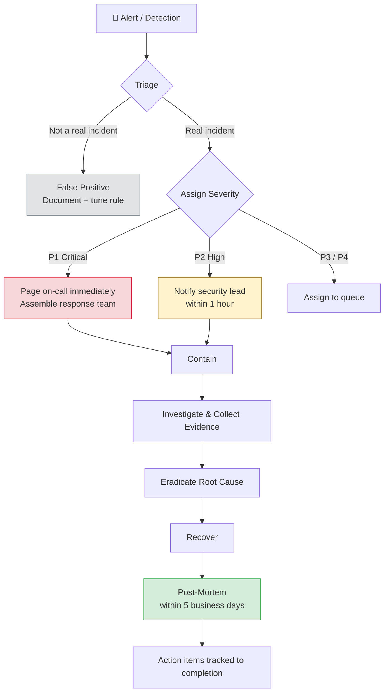

Incident response is most effective when it's practiced before an incident happens. These playbooks provide step-by-step guides for the most common security incidents. Adapt them to your environment and review them at least annually.

## Incident Response Lifecycle



## Incident Severity Levels

Define levels before incidents happen so responders don't debate severity during a crisis:

| Level | Definition | Response time | Example |
|---|---|---|---|
| **P1 — Critical** | Active breach, data exfiltration in progress, production down | Immediately | Active intrusion, ransomware, mass account takeover |
| **P2 — High** | Credible threat, sensitive data potentially exposed | < 1 hour | Leaked credentials with active use, vulnerability under active exploit |
| **P3 — Medium** | Security event with limited scope | < 4 hours | Single account compromised, vulnerability found internally |
| **P4 — Low** | Informational; no immediate risk | < 24 hours | Routine pen test finding, policy violation with no impact |

---

## Playbook 1: Credential Compromise

**Trigger:** Employee or service account credentials found in a breach database, phishing report, or suspicious login detected.

### Immediate Actions (0–1 hour)

```
□ Identify affected account(s) and what they have access to
□ Force-revoke all active sessions for the account
□ Rotate the compromised credential immediately
□ Disable the account if active compromise is confirmed
□ Review access logs for the past 30 days for the account
□ Look for: data access, config changes, new user creation, API calls
□ Notify the affected user
```

### Investigation (1–4 hours)

```
□ What data did the account have access to?
□ What actions were taken during the suspicious period?
□ Was the credential used from unexpected locations/IPs?
□ Were any new accounts created or permissions escalated?
□ Check for persistence mechanisms:
  - New SSH keys added
  - New API keys created
  - New users/service accounts created
  - Webhook or integration added
□ Check for data exfiltration indicators:
  - Unusual volume of records accessed
  - Export operations performed
  - Files downloaded from storage
```

### Containment & Recovery

```
□ Rotate any credentials that the compromised account could have accessed
□ Revoke any API keys or tokens created by the compromised account
□ Review and revert any configuration changes made
□ Re-enable account with new credential and MFA enforced
□ Notify security team and management of scope
□ Determine notification obligations (customers? DPA?)
```

---

## Playbook 2: Data Breach

**Trigger:** Personal data or confidential business data has been accessed, exfiltrated, or exposed without authorization.

### Immediate Actions (0–4 hours)

```
□ CONTAIN: Stop the bleeding first
  - Patch the vulnerability or take the system offline
  - Revoke credentials used in the breach
  - Block attacker's IP ranges if known
□ PRESERVE: Don't destroy evidence
  - Take memory dumps / disk snapshots before changes
  - Preserve logs before they rotate
  - Document everything with timestamps
□ ASSESS: What data? How many records? What risk?
  - Categories of data (PII, health, financial, credentials)
  - Estimated number of affected users/records
  - Is exfiltration confirmed or suspected?
```

### Notification Obligations

```
GDPR (EU users):
  - DPA notification: within 72 hours of becoming aware
  - User notification: without undue delay if high risk to rights
  - Document if you decide NOT to notify and why

Sector-specific (US):
  - HIPAA: notify HHS within 60 days; users within 60 days
  - CCPA: notify within 30 days; AG if >500 CA residents
  - State breach laws: vary by state (most require notification)

Document:
  □ Date/time breach discovered
  □ Date/time breach likely occurred (if determinable)
  □ Categories of data affected
  □ Approximate number of individuals affected
  □ Cause of breach
  □ Steps taken to contain
  □ Steps taken to prevent recurrence
```

### Evidence Collection

```
□ Export and preserve relevant logs (auth, access, network)
□ Capture database query logs for the breach window
□ Document cloud audit logs (CloudTrail, GCP Audit Logs)
□ Preserve application logs showing attacker activity
□ Screenshot or export relevant dashboards/alerts
□ Record chain of custody for forensic artifacts
□ Engage external forensics firm if breach scope is large
```

### Communication

```
Internal:
  □ Security team lead
  □ Legal / General Counsel
  □ C-Suite (CEO, CTO, CISO)
  □ PR / Communications (if public disclosure likely)

External:
  □ Regulatory bodies (per notification obligations above)
  □ Affected customers / users
  □ Cyber insurance provider
  □ Third-party sub-processors (notify them if their data was affected)
```

---

## Playbook 3: Ransomware

**Trigger:** Systems encrypted, ransom note found, files replaced with encrypted versions.

### Immediate Actions (do not delay)

```
□ ISOLATE: Disconnect affected systems from network immediately
  - Unplug network cables / disable network interfaces
  - Do NOT shut down (memory may contain encryption keys or IOCs)
  - Notify IT to isolate at network switch level too
□ IDENTIFY SCOPE: What systems are affected?
  - Scan network for other encrypted systems
  - Check backups — are they also encrypted?
□ PRESERVE: Before any recovery, take forensic snapshots
□ CONTACT: Engage incident response firm if you have one on retainer
```

### Do NOT Do

```
□ Do not reboot or shut down encrypted systems yet (may lose forensic data)
□ Do not pay the ransom without legal guidance (may violate sanctions)
□ Do not attempt to decrypt using "recovery tools" from unknown sources
□ Do not reconnect isolated systems until fully clean
□ Do not delete encrypted files (you may need them + the originals may be gone)
```

### Recovery

```
□ Determine entry point — patch it before restoring
□ Rebuild from known-clean backups or golden images
□ Restore in isolated environment and verify cleanliness
□ Reintroduce systems incrementally with monitoring
□ Force password reset for all accounts (attackers may have credentials)
□ Audit all privileged access since the breach window
```

---

## Playbook 4: Account Takeover

**Trigger:** Customer account compromised — attacker has access to a user's account.

### Detection Signals

```
- Login from unexpected country or IP
- Device fingerprint change
- Password change followed by email address change
- Unusual transaction or activity pattern
- Customer reports they're locked out
- Multiple failed 2FA attempts followed by success
```

### Response

```
□ Immediately lock the account pending investigation
□ Revoke all active sessions
□ Notify the account owner via a secondary channel (phone if critical, not just email — attacker may control the email)
□ Investigate the takeover method:
  - Phishing (check email logs)
  - Credential stuffing (check if email+pass appeared in breach list)
  - SIM swap (SMS 2FA bypassed)
  - Session hijacking (check for XSS or network compromise)
□ Determine what actions were taken:
  - Data accessed or downloaded
  - Email/shipping address changed
  - Payments initiated
  - Other accounts accessed (password reuse)
□ Restore account to owner with new credentials + enforced MFA
□ Reverse unauthorized transactions where possible
□ Document for pattern analysis (multiple ATO = systemic issue)
```

---

## Post-Incident: Blameless Post-Mortem

Run a post-mortem for every P1 and P2 incident. The goal is learning, not blame:

```markdown
## Incident Post-Mortem: [Incident Name]
**Date:** [Date]
**Duration:** [Start] – [End/Resolved]
**Severity:** P1 / P2 / P3
**Participants:** [Names and roles]

### What Happened
[Factual timeline of events]

### Impact
[What was affected, for how long, how many users]

### Root Cause
[The fundamental cause, not the proximate trigger]

### Contributing Factors
[What made the root cause possible or amplified the impact]

### What Went Well
[Detection speed, response coordination, communication]

### What Didn't Go Well
[Gaps in detection, slow escalation, missing runbooks]

### Action Items
| Action | Owner | Due date |
|---|---|---|
| [Specific fix] | [Name] | [Date] |
```

---

## Contacts & Escalation Template

Pre-fill this before an incident happens:

```
Security Lead: [Name, phone, email]
Engineering On-Call: [Rotation schedule or phone tree]
Legal Counsel: [Name, phone]
PR Contact: [Name, phone]
Cyber Insurance: [Policy #, claim number, 24hr line]
Incident Response Retainer: [Firm name, contact, retainer code]
Cloud Provider Emergency: [AWS/GCP/Azure abuse contact]
Regulatory Contact (GDPR): [DPA contact for your jurisdiction]
```
