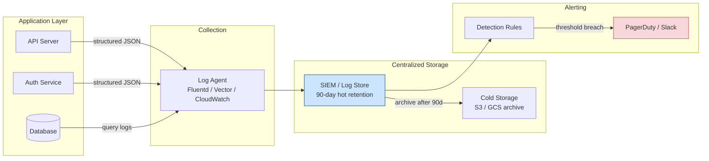

The average breach dwell time — the gap between compromise and detection — is over 200 days.


Effective logging and monitoring is what closes that gap. Without it, you're flying blind during and after an incident.

## What to Log

### Authentication Events (Always)

```javascript
// Log every auth event — these are critical for incident investigation
logger.info({
  event: 'auth.login.success',
  userId: user.id,
  email: user.email,  // consider pseudonymizing
  ip: req.ip,
  userAgent: req.headers['user-agent'],
  mfaMethod: 'totp',
  timestamp: new Date().toISOString(),
});

logger.warn({
  event: 'auth.login.failure',
  email: req.body.email,  // don't include attempted password
  ip: req.ip,
  reason: 'invalid_credentials',  // generic reason code, not "wrong password"
  timestamp: new Date().toISOString(),
});
```

**Auth events to log:**
- Login success / failure (with reason code)
- Logout
- Password change / reset request / reset used
- MFA enrollment / removal / failure
- Account lockout triggered
- Session creation / revocation
- Token issued / refreshed / revoked
- OAuth authorization granted / denied

### Authorization Events

```javascript
// Log access denials — repeated denials from same user/IP indicate probing
logger.warn({
  event: 'authz.denied',
  userId: req.user?.id,
  ip: req.ip,
  resource: req.path,
  method: req.method,
  reason: 'insufficient_permissions',
});
```

### Data Access Events (for sensitive data)

```javascript
// Log access to sensitive records
logger.info({
  event: 'data.access',
  userId: req.user.id,
  action: 'read',
  resourceType: 'health_record',
  resourceId: record.id,
  // Don't log the record content itself
});
```

### Administrative Actions

```javascript
// Any action that changes permissions, configuration, or user status
logger.info({
  event: 'admin.user.role_changed',
  actorId: req.user.id,
  targetUserId: targetUser.id,
  oldRole: oldRole,
  newRole: newRole,
  reason: req.body.reason,
});
```

### Errors and Exceptions

```javascript
// Structured error logging — correlate with request context
logger.error({
  event: 'error.unhandled',
  error: {
    message: err.message,
    type: err.constructor.name,
    stack: err.stack,         // server-side only, never send to client
  },
  requestId: req.id,
  userId: req.user?.id,
  path: req.path,
  method: req.method,
});
```

---

## What NOT to Log

Logging certain data creates its own security risk:

| Never log | Reason |
|---|---|
| Passwords (any form) | Logs are often less protected than databases |
| API keys / tokens | Full value enables impersonation |
| Credit card numbers | PCI DSS violation |
| SSNs / national IDs | PII; breach amplifier |
| Health data (full records) | HIPAA; GDPR special category |
| Private keys / secrets | Catastrophic if logs are compromised |
| Session tokens (full) | Can be used to hijack sessions |

```javascript
// ✗ Logging the Authorization header
logger.info({ headers: req.headers });  // logs Authorization: Bearer <token>

// ✓ Log only what's needed
logger.info({
  method: req.method,
  path: req.path,
  userAgent: req.headers['user-agent'],
  // authorization header omitted
});
```

---

## Structured Logging

Use structured (JSON) logs, not plain text strings. Structured logs are machine-parseable, enabling queries and dashboards.

```javascript
// ✗ Unstructured — hard to query
console.log(`User ${userId} logged in from ${ip} at ${timestamp}`);

// ✓ Structured — queryable by any field
logger.info({
  event: 'auth.login.success',
  userId,
  ip,
  timestamp: new Date().toISOString(),
  service: 'api',
  environment: process.env.NODE_ENV,
  version: process.env.APP_VERSION,
});
```

**Consistent fields across all log entries:**

```typescript
interface BaseLog {
  event: string;          // dot-notation category.action.outcome
  timestamp: string;      // ISO 8601
  service: string;        // which microservice
  environment: string;    // prod / staging / dev
  requestId?: string;     // trace logs for a single request
  userId?: string;        // who triggered it (null for anonymous)
  ip?: string;            // client IP (may be a load balancer IP)
  sessionId?: string;     // which session (hash or ID, not full token)
}
```

### Logging Libraries

| Language | Library |
|---|---|
| Node.js | `pino` (fastest), `winston` (flexible) |
| Python | `structlog`, `loguru` |
| Go | `zerolog`, `zap` |
| Java | `logback` with `logstash-logback-encoder` |

```javascript
// Pino — fast structured logger with HTTP request logging
import pino from 'pino';
import pinoHttp from 'pino-http';

const logger = pino({
  level: process.env.LOG_LEVEL || 'info',
  redact: ['req.headers.authorization', 'req.headers.cookie'],  // auto-redact sensitive headers
});

app.use(pinoHttp({ logger }));
```

---

## Log Shipping

Logs must be sent to a centralized, tamper-resistant store — not just the local filesystem of the server they came from. A compromised server can have its local logs deleted.

```
App → Log agent → Log store (separate system)
        (Filebeat, Fluentd, Vector, CloudWatch agent)
```

| Platform | Log store options |
|---|---|
| AWS | CloudWatch Logs → OpenSearch / S3 |
| GCP | Cloud Logging → BigQuery / Cloud Storage |
| Azure | Azure Monitor → Log Analytics Workspace |
| Self-hosted | Elastic Stack (ELK), Grafana Loki, Splunk |

**Retention:** Retain logs for at least 12 months in hot storage, longer in cold. Many compliance frameworks (SOC 2, ISO 27001) require 12 months.

---

## Security Monitoring & Alerting

Logs without alerts are just expensive storage.

### Key Alerts to Configure

```
HIGH PRIORITY (alert immediately):
├── Root/admin account login (unexpected)
├── Multiple failed logins followed by success (brute force success)
├── IAM policy changes
├── Security group / firewall rule changes
├── Secrets manager access from unexpected source
├── GuardDuty / cloud threat detection finding (HIGH)
└── Mass data access (unusual volume for a user)

MEDIUM PRIORITY (alert within minutes):
├── Login failure spike (>50 failures in 5 min from same IP)
├── Account lockout triggered
├── Password reset spike
├── 403 Forbidden spike on admin paths
├── Unexpected geographic access
└── New MFA device enrolled

LOW PRIORITY (daily digest or dashboard):
├── Failed auth attempts per user
├── API error rates
├── Dependency vulnerability scan results
└── Certificate expiry warnings
```

### Anomaly Detection Patterns

```javascript
// Example: alert on unusual volume — user normally reads 10 records/min, now 10,000
async function detectDataExfiltration(userId, resourceType) {
  const recentCount = await getAccessCount(userId, resourceType, '5m');
  const baseline = await getAverageAccessCount(userId, resourceType, '30d');

  if (recentCount > baseline * 50 && recentCount > 1000) {
    await alert({
      severity: 'HIGH',
      type: 'potential_data_exfiltration',
      userId,
      recentCount,
      baseline,
    });
  }
}
```

---

## Metrics Dashboard

Monitor these metrics for security awareness:

| Metric | Purpose |
|---|---|
| Auth success rate | Sudden drop may indicate credential stuffing |
| Failed logins per minute | Spike indicates attack in progress |
| 403 rate per endpoint | Probing or misconfiguration |
| New account registration rate | Sudden spike may indicate bot activity |
| API error rate by type | 5xx spike may indicate injection attack |
| Session duration distribution | Unusually long sessions may be hijacked |
| Geographic distribution | Unexpected countries may indicate compromise |

---

## Log Security

Logs themselves need protection:

- **Immutability:** Use write-once / append-only log stores (S3 Object Lock, CloudWatch)
- **Access control:** Restrict log access to security team and on-call; audit log access
- **Integrity verification:** Log signing or checksums to detect tampering
- **Separation:** Store logs on separate infrastructure from the application; don't give app servers write-delete on log store
- **Alerting on log disruption:** Alert if log volume drops unexpectedly (attacker may have cleared logs)
