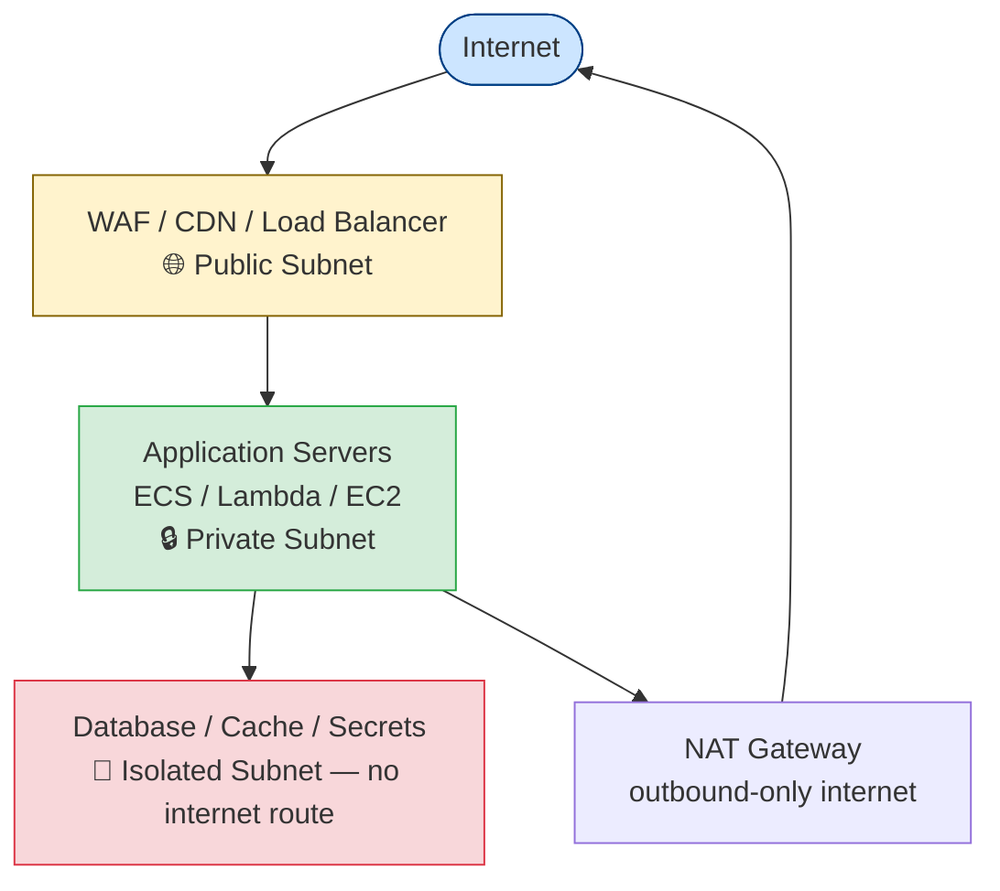

import \{ Tabs, TabItem \} from '@astrojs/starlight/components';
import \{ Aside, Card, CardGrid, Steps, Badge \} from '@astrojs/starlight/components';


Cloud security follows the **shared responsibility model**: the cloud provider secures the infrastructure; you are responsible for everything above it — IAM, network configuration, data encryption, and application security.

## IAM Hardening

Identity and Access Management misconfigurations are the leading cause of cloud breaches.

### Principle of Least Privilege

Grant the minimum permissions needed, for the minimum time needed.

```json
// ✗ Too broad — common mistake
{
  "Effect": "Allow",
  "Action": "*",
  "Resource": "*"
}

// ✓ Minimal — specific service, specific resource, specific actions
{
  "Effect": "Allow",
  "Action": ["s3:GetObject", "s3:PutObject"],
  "Resource": "arn:aws:s3:::my-bucket/uploads/*"
}
```

### Use Roles, Not Long-Term Keys

Long-lived access keys (AWS IAM access keys, GCP service account JSON files) are high-value targets. Prefer role-based authentication:

| Workload | Authentication method |
|---|---|
| EC2 / ECS / Lambda | Instance role / execution role (no keys needed) |
| GitHub Actions | OIDC federation → assume IAM role (no keys in secrets) |
| Local dev | IAM Identity Center (SSO) with temporary credentials |
| Cross-account access | IAM role assumption |

```yaml
# GitHub Actions OIDC — no AWS access keys needed
- name: Configure AWS credentials
  uses: aws-actions/configure-aws-credentials@v4
  with:
    role-to-assume: arn:aws:iam::123456789:role/github-actions-role
    aws-region: us-east-1
    # No access-key-id or secret-access-key
```

### MFA Everywhere

Require MFA for all human IAM users, especially for:
- Console access (IAM console MFA enforcement via SCP)
- Root account actions (root should be used only for account-level tasks)
- Privileged operations (IAM changes, key rotation)

```json
// SCP — deny all actions if MFA not present
{
  "Effect": "Deny",
  "NotAction": [
    "iam:CreateVirtualMFADevice",
    "iam:EnableMFADevice",
    "iam:GetUser",
    "sts:GetSessionToken"
  ],
  "Resource": "*",
  "Condition": {
    "BoolIfExists": {
      "aws:MultiFactorAuthPresent": "false"
    }
  }
}
```

### Audit IAM Regularly

```bash
# AWS — IAM Access Analyzer
aws accessanalyzer create-analyzer --analyzer-name my-analyzer --type ACCOUNT

# Find unused IAM credentials (AWS IAM Access Advisor)
aws iam generate-credential-report
aws iam get-credential-report --query Content --output text | base64 -d | csvlook

# GCP — list service accounts with excessive roles
gcloud projects get-iam-policy PROJECT_ID --format=json | jq '.bindings[] | select(.role == "roles/owner")'
```

---

## Network Architecture

### VPC Design



**Rules:**
- Public subnets: only load balancers, NAT gateways, bastion hosts
- Application servers in private subnets — they initiate outbound through NAT
- Databases in isolated subnets — no internet route at all; accessible only from app subnet
- Security groups as virtual firewalls: default deny; explicit allow per port/protocol/source

### Security Groups

```hcl
# Terraform — restrict database access to app security group only
resource "aws_security_group" "database" {
  name   = "database-sg"
  vpc_id = aws_vpc.main.id

  ingress {
    from_port       = 5432
    to_port         = 5432
    protocol        = "tcp"
    security_groups = [aws_security_group.app.id]  # only from app, not 0.0.0.0/0
  }

  egress {
    from_port   = 0
    to_port     = 0
    protocol    = "-1"
    cidr_blocks = ["0.0.0.0/0"]
  }
}
```

### Restrict Egress

Most applications should not initiate arbitrary outbound connections. Use a NAT gateway with an allowlist proxy, or VPC endpoints to stay within the cloud provider's network for AWS services.

```bash
# AWS VPC endpoint — S3 traffic stays within AWS network; never crosses internet
aws ec2 create-vpc-endpoint \
  --vpc-id vpc-abc123 \
  --service-name com.amazonaws.us-east-1.s3 \
  --route-table-ids rtb-abc123
```

---

## Storage Security

### S3 / Object Storage

```bash
# ✗ Never create public buckets
aws s3api put-public-access-block \
  --bucket my-bucket \
  --public-access-block-configuration "BlockPublicAcls=true,IgnorePublicAcls=true,BlockPublicPolicy=true,RestrictPublicBuckets=true"

# Enable server-side encryption (SSE-KMS)
aws s3api put-bucket-encryption \
  --bucket my-bucket \
  --server-side-encryption-configuration '{
    "Rules": [{
      "ApplyServerSideEncryptionByDefault": {
        "SSEAlgorithm": "aws:kms",
        "KMSMasterKeyID": "arn:aws:kms:us-east-1:123:key/abc"
      }
    }]
  }'

# Enable versioning + MFA delete for critical buckets
aws s3api put-bucket-versioning \
  --bucket my-bucket \
  --versioning-configuration Status=Enabled,MFADelete=Enabled \
  --mfa "arn:aws:iam::123:mfa/mydevice 123456"
```

### Database Encryption

- Enable encryption at rest using KMS-managed keys (not the provider's default key)
- Enable encryption in transit — require SSL connections; reject plaintext
- Enable automated backups and encrypt backup storage
- Keep databases in private subnets — no public endpoint

---

## Cloud Security Posture Management (CSPM)

CSPM tools continuously scan your cloud configuration for misconfigurations:

| Tool | Notes |
|---|---|
| AWS Security Hub | Aggregates findings from GuardDuty, Inspector, Config; CIS benchmark checks |
| AWS Config | Tracks configuration changes; custom compliance rules |
| Prowler | Open-source AWS/GCP/Azure security scanner; CIS benchmarks |
| Checkov | IaC scanning (Terraform, CloudFormation) before deployment |
| Trivy | Also scans IaC configs alongside container images |

```bash
# Run Prowler against your AWS account
prowler aws --compliance cis_level2_aws

# Scan Terraform before apply
checkov -d . --framework terraform
```

---

## Logging and Monitoring

```bash
# AWS — enable CloudTrail in all regions
aws cloudtrail create-trail \
  --name my-trail \
  --s3-bucket-name my-cloudtrail-bucket \
  --is-multi-region-trail \
  --enable-log-file-validation

# Enable GuardDuty (threat detection)
aws guardduty create-detector --enable

# Enable AWS Config (configuration tracking)
aws configservice put-configuration-recorder \
  --configuration-recorder name=default,roleARN=arn:aws:iam::123:role/config-role \
  --recording-group allSupported=true
```

**Key events to alert on:**
- Root account login
- IAM policy changes (any `iam:Put*`, `iam:Attach*`, `iam:Create*`)
- Security group changes
- CloudTrail disabled or deleted
- S3 public access block removed
- GuardDuty finding of HIGH or CRITICAL severity

---

## AWS Security Baseline (Quick Reference)

| Control | Service |
|---|---|
| MFA on root and all users | IAM |
| No long-term access keys for services | IAM roles / OIDC |
| CloudTrail enabled in all regions | CloudTrail |
| Threat detection | GuardDuty |
| Configuration compliance | Security Hub / Config |
| No public S3 buckets | S3 Block Public Access (account-level) |
| Encryption at rest | KMS (SSE-KMS) |
| Network isolation | VPC + Security Groups |
| Vulnerability scanning | Inspector |
| Secrets in Secrets Manager | Secrets Manager |
