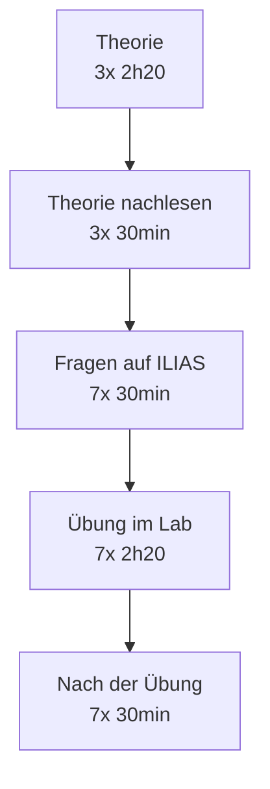
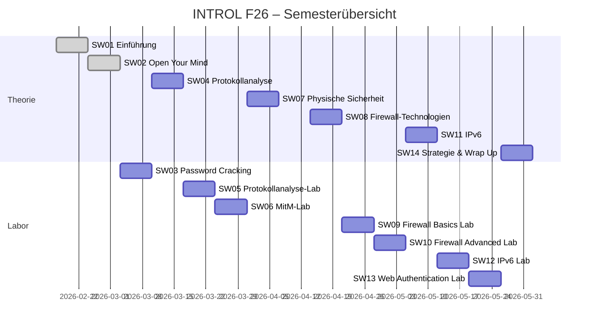
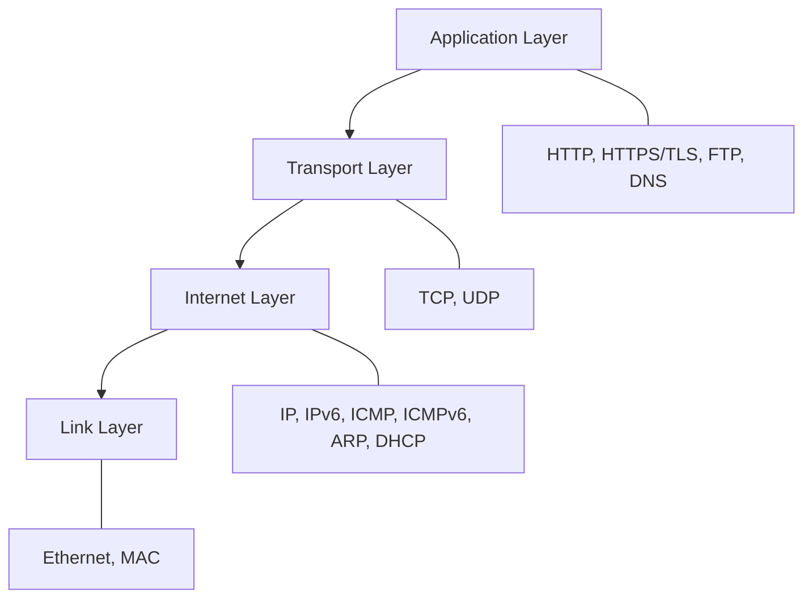

## Über das Modul

Das Modul **Einführendes Labor zu Informations- und Cyber-Sicherheit (INTROL)** an der Hochschule Luzern (HSLU) vermittelt einen praxisnahen Einstieg in die Welt der Cyber Security. Statt rein theoretischem Frontalunterricht steht das *aktive Erleben* und Verstehen von Sicherheitsmechanismen und -schwachstellen im Vordergrund – anhand realer Szenarien wie Protokollanalyse, Man-in-the-Middle-Angriffen, Firewall-Konfiguration und Web-Authentifizierung.

**Kursdetails:**
- Kurs-ID: `I.BA_INTROL.F26`
- ECTS-Punkte: 3
- Zeitraum: 17. Februar 2026 – 26. Mai 2026
- Modulverantwortlicher: Florian Wamser (`florian.wamser@hslu.ch`)
- Studiengangsleiter: Bernhard Egger (`bernhard.egger@hslu.ch`)

---

## Dozierende

### Florian Wamser
Florian Wamser studierte Informatik und Physik an der Universität Würzburg sowie der Helsinki University of Technology (Abschluss 2009 als Diplom-Informatiker). Von 2009–2015 promovierte er an der Universität Würzburg bei Prof. Dr.-Ing. P. TranGia, mit einem Zwischenaufenthalt bei Intel in Portland, USA (2013). Anschliessend war er Post-Doktorand und Gruppenleiter. Er verfügt über mehr als 50 Publikationen und 60 Vorträge sowie Erfahrungen aus EU-Projekten (H2020) und Industrieprojekten (u.a. mit Huawei und Nokia).

### Lothar Gramelspacher (CISA, CISSP, CISM, ISO 27001 LA)
Lothar Gramelspacher bringt einen aussergewöhnlich breiten Praxishintergrund mit: Er betrieb bereits 1994 einen eigenen ISP – und wurde dabei gehackt, was seinen Einstieg in die Security prägte. Er war Gründungsmitglied eines Auditorenteams (Backtrack → Kali Linux), arbeitete bei einer Big-Four-Wirtschaftsprüfungsgesellschaft, bei Big-Pharma als Deputy CISO und Product Security Director, sowie als CISO einer Startup-Bank. Zudem ist er in der Sicherheit kritischer Infrastrukturen (Stromnetz, Medizingeräte) tätig und doziert an Schweizer Hochschulen.

---

## Organisatorisches

### Unterrichtsform und Örtlichkeiten

Das Modul findet in Rotkreuz statt. Es gibt zwei Unterrichtsformen:

- **Theorieunterricht** im Raum `I.S1A_422` – wird per Zoom aufgezeichnet, sodass Inhalte nachgeschaut werden können.
- **Laborunterricht** in den Räumen `I.S1A_403` und `I.S1A_404` – zwingend vor Ort, da praktische Übungen nur physisch durchführbar sind.

> **Empfehlung:** Auch bei Theorieeinheiten wenn möglich vor Ort teilnehmen, da Whiteboard-Inhalte nicht immer per Stream sichtbar sind.

### Labor- vs. Theorieunterricht

Der Kurs wechselt systematisch zwischen Theorie und Praxis: Zuerst wird ein Thema theoretisch erarbeitet (z.B. Firewall-Konzepte), dann folgt das entsprechende Labor (z.B. Firewall konfigurieren). Dies stellt sicher, dass die Grundlagen vorhanden sind, bevor man hands-on arbeitet.

Gemeinsame Laborzeiten finden **montags** mit Betreuung statt – anstelle von Theorieunterricht. In jedem Raum gibt es nach ca. 1 Stunde eine **Zwischenbesprechung**, bei der folgende Fragen im Fokus stehen:
- Warum ist das aktuelle Lab wichtig für Security?
- Was wissen die Studierenden darüber hinaus?
- Was muss man sich merken?

Das Ziel ist **Verstehen**, nicht blosses Abarbeiten.

---

## Zeitaufwand

Das Modul hat 3 ECTS-Punkte, was einem Gesamtaufwand von **90 Stunden** entspricht:

| Kategorie | Stunden |
|---|---|
| Geführtes Studium (Vorlesungen, Labors) | 21 h |
| Begleitetes Selbststudium | 21 h |
| Individuelles Selbststudium inkl. Prüfungsvorbereitung | 48 h |

### Zeitaufwand pro Thema (Richtwerte)

```
Nach der Theorievlektion:    ~30 min Theorie nochmals lesen und verstehen
Vor der Übung:               ~30 min ILIAS-Fragen beantworten (eigene Recherche)
Während der Übung:           ~2h30 Übung im Lab + Übungs-PDF ausfüllen
Nach der Übung:              ~30 min Dokumentation fertigstellen und hochladen
```

Der Ablauf pro Thema sieht folgendermassen aus:



---

## Lernplattform: ILIAS

ILIAS ist die zentrale Lernplattform für das Modul. Hier werden sämtliche Materialien, Aufgaben und Abgaben verwaltet.

**Wichtige Hinweise zu ILIAS:**

1. **Wochenplan** – Versionen im Auge behalten, da sich Inhalte ändern können.
2. **Zoom-Link** – bleibt für das gesamte Semester gleich.
3. **Modulunterlagen** – nach Themen in 10 Ordnern organisiert (aber 14 Wochen – manche Themen wie IPv6 dauern 2 Wochen).
4. **Ankündigungsforum** – Glocke aktivieren für Benachrichtigungen!
5. **Laboraufgaben-Workflow:**
   - a) Vorbereitungsfragen beantworten
   - b) Team anlegen
   - c) Labordokument herunterladen (erst nach 90% richtig beantworteter Fragen möglich!)
   - d) Laborbericht abgeben
   - e) Musterlösung einsehen
6. Die Dozierenden verfolgen, wann und wie Labors bearbeitet wurden.
7. **Forum** für Fragen, Fehler und Tipps zu den Labors.

> Das Konzept «erst Fragen beantworten, dann Labordokument» erzwingt eine inhaltliche Vorbereitung. Wer 90% der Fragen nicht korrekt beantwortet hat, bekommt die Laboranleitung nicht. Dies sichert, dass Studierende vorbereitet ins Labor gehen und die Zeit effizient nutzen.

---

## Modulendprüfung

- **Form:** Elektronische Prüfung, 1,5 Stunden, via ILIAS während der Prüfungssession.
- **Zulassungsbedingung:** Vollständige Absolvierung **aller Labors** – ohne diese keine Zulassung zur Prüfung.
- Je nach Studierendenzahl kann die Prüfung auch mündlich durchgeführt werden (wird semesterbegleitend kommuniziert).

---

## Laborbedingungen

### Anforderungen (Bedingungen zum Bestehen)

Um das Modul zu bestehen, müssen drei Bedingungen erfüllt sein:

1. **Anwesenheit bei den Labors** – Labore sind Präsenzveranstaltungen.
2. **Vorbereitungsfragen im ILIAS** abarbeiten.
3. **7 Laborberichte** einreichen – Lückentexte im PDF während der Übung ausfüllen.
   - Fehlende oder nicht akzeptierte Berichte müssen **nachgeholt** werden.

### Gruppenarbeit

Die Labors können alleine oder in **2er-Gruppen** bearbeitet werden. Pro Gruppe wird ein gemeinsamer Laborbericht abgegeben. Der Dateiname des Berichts muss die Namen der Gruppenmitglieder enthalten.

Mindestens ein Dozent ist immer im Labor anwesend und steht für Fragen zur Verfügung.

---

## Laborausstattung

### Räume und Equipment

Die Labors sind mit folgendem Equipment ausgestattet:

- **PCs:** 2 Windows-11-PCs pro Gruppe (Hinweis: PC-Setup kann von Vorgruppen verstellt sein → immer zuerst kontrollieren!)
- **Schränke mit Netzwerkequipment:**
  - Cisco Router (C1941 oder C4221)
  - Cisco Switches (2960 / 3560v2)
  - Firewalls
  - diverses Material
- **Eigenes Notebook** mit Netzwerkschnittstelle (On-board oder USB-Dongle)
- Weiteres Equipment wird bei Bedarf ausgegeben und wieder eingesammelt.

### Kabel (Farbcodierung)

| Farbe | Typ | Verwendung |
|---|---|---|
| 🟡 Gelb | Gerades Kabel | Standard Ethernet / Patchkabel |
| 🔴 Rot | Gekreuztes Kabel | Direkte PC-zu-PC Verbindung |
| 🔵 Blau | Seriell | Router-Konsole (DCE/DTE beachten!) |
| Hellblau | Rollover | Konsolenkabel |
| – | USB-to-Serial | Für Laptops ohne Serial-Port |
| – | USB-to-Ethernet | Für Laptops ohne Ethernet-Port |

> **Warum verschiedene Kabeltypen?** Früher mussten gleichartige Geräte (z.B. PC zu PC) mit einem *gekreuzten* Kabel verbunden werden, weil Sende- und Empfangsleitungen vertauscht werden mussten. Moderne Switches/Router erkennen dies automatisch (Auto-MDI/MDI-X), aber in Labor-Szenarien mit altem Equipment ist die korrekte Kabelwahl noch relevant.

### Labor-PCs

Die Labor-PCs haben **zwei Netzwerk-Interfaces (NIC)**:
- **NIC1:** Normalerweise im grünen Netz (Labor-/Internet-Verbindung)
- **NIC2:** Für Versuche – PC mit Router oder Switch verbinden

> **Wichtig:** Immer nur **eine NIC** gleichzeitig aktiv haben, um Routing-Konflikte zu vermeiden!

**Account:** `cisco / cisco`

Da mehrere Gruppen dieselben PCs nutzen, können folgende Konfigurationen verstellt sein:
- IP-Adressen manuell gesetzt
- Netzwerkadapter deaktiviert
- IPv4 oder IPv6 deaktiviert
- Windows-Firewall aktiv

→ Vor jedem Lab: **Netzwerkkonfiguration prüfen und ggf. zurücksetzen.**

---

## Semesterübersicht (Wochenplan)



| Woche | Datum | Thema | Format |
|---|---|---|---|
| SW1 | 17.02. | Einführung und Organisatorisches | Theorie |
| SW2 | 24.02. | Open Your Mind (Lateral Thinking, SolarWinds-Hack) | Theorie |
| SW3 | 03.03. | Password Cracking (Salting, Hashing, VM-Passwort hacken) | **Labor** |
| SW4 | 10.03. | Protokollanalyse (TCP/IP, Wireshark) | Theorie |
| SW5 | 17.03. | Protokollanalyse-Lab (ARP, IP, TCP, DNS, HTTP/S, FTP) | **Labor** |
| SW6 | 24.03. | Man-in-the-Middle Lab (ARP Poisoning, DNS Spoofing) | **Labor** |
| SW7 | 31.03. | Physische Sicherheit / Lockpicking (Gastreferent) | Theorie |
| SW8 | 14.04. | Firewall-Technologien (Paketfilter, ALG, WAF) | Theorie |
| SW9 | 21.04. | Firewall Basics Lab | **Labor** |
| SW10 | 28.04. | Firewall Advanced Lab (NextGen, ALG) | **Labor** |
| SW11 | 05.05. | Internet Protocol Version 6 (IPv6) | Theorie |
| SW12 | 12.05. | IPv6 Lab | **Labor** |
| SW13 | 19.05. | Web Authentication Lab (Cookies, OAuth 2.0, WebAuthn) | **Labor** |
| SW14 | 26.05. | Strategie & Taktik / Wrap Up | Theorie |

> Kein Unterricht am **07.04.2026** (Osterpause).

---

## Fachliche Modulinhalte (Überblick)

Das Modul deckt acht Themenblöcke ab:

### 1. Open Your Mind – Laterales Denken
Die besten Security-Fachleute können eine Situation aus ungewöhnlichen Blickwinkeln betrachten. Geradliniges, konformes Denken führt bei Sicherheitsanalysen oft in die Irre. Ein anschauliches Beispiel ist das **Kommissar-Logikrätsel**: Ein Mann wird tot im Büro gefunden, ein Kassettenrekorder spielt eine Abschiedsnachricht ab. Warum ist es trotzdem Mord?

> *Lösung: Kassettenrekorder müssen vor dem Abspielen zurückgespult werden. Der Tote hätte nach dem Schuss nicht mehr auf Play drücken können – und der Schuss ist auf dem Band zu hören.*

Das zeigt: Wer nur das Offensichtliche sieht, übersieht den entscheidenden technischen Mechanismus.

### 2. Protokollanalyse: TCP/IP-Familie
Werkzeug: **Wireshark** – ein Netzwerk-Sniffer, der alle Pakete auf einem Interface mitschneidet und analysierbar macht. Untersucht werden:



### 3. IPv6
IPv4-Adressen sind erschöpft. IPv6 mit seinem 128-Bit-Adressraum (ca. 3,4 × 10³⁸ Adressen) ist die Lösung. Besonderheiten: Stateless Address Autoconfiguration (SLAAC), Neighbor Discovery Protocol (NDP) als Ersatz für ARP, neue Header-Struktur und Spezial-Adressen.

### 4. Web Authentication
Verschiedene Methoden der Webauthentifizierung werden verglichen:
- Klassische Cookie-basierte Sessions
- **OAuth 2.0** – Token-basiertes Delegationsprotokoll (z.B. «Login with Google»)
- **WebAuthn** – Passwortlos per Hardware-Key oder Biometrie

### 5. Man-in-the-Middle (MitM) – ARP Poisoning & DNS Spoofing
Ein Angreifer positioniert sich unbemerkt zwischen zwei kommunizierenden Parteien:

```mermaid
sequenceDiagram
    participant V as Victim
    participant H as Hacker (MitM)
    participant S as Server
    
    Note over V,H: ARP Poisoning: Hacker sendet gefälschte ARP-Replies
    V->>H: Paket (denkt, es geht an Server)
    H->>S: Paket weitergeleitet (evtl. manipuliert)
    S->>H: Antwort
    H->>V: Antwort weitergeleitet
    Note over V,H,S: Beide Seiten merken nichts!
```

### 6. Firewall Basics
Eine Firewall filtert Netzwerkverkehr anhand von Regelwerken. Themen: Paketfilter, Stateful Inspection, Zonenkonzept (LAN/WAN/DMZ), Regelreihenfolge und praktische Konfiguration.

### 7. Firewall Advanced
Next-Generation Firewalls (NGFW) gehen weit über reine Paketfilterung hinaus: Application Layer Gateways (ALG), SSL-Interception (Entschlüsselung von HTTPS), Antivirus-Scanning, HTTP-Filter und benutzerbasierte Regeln.

### 8. Password Cracking
Warum scheitern schwache Passwörter? Themen:
- **Hashing:** Einwegfunktionen (MD5, SHA-256, bcrypt) – gespeicherte Passwörter sind nie im Klartext
- **Salting:** Zufälliger Wert, der vor dem Hashing hinzugefügt wird, um Rainbow-Table-Angriffe zu verhindern
- **Cracking-Methoden:** Brute-Force, Dictionary-Angriffe, Rainbow Tables
- Praktisch: Windows-VM-Passwort cracken

---

## Lernziele des Moduls

Nach Abschluss des Moduls können Studierende:

- Netzwerkverkehr mit Wireshark analysieren und gängige Protokolle identifizieren
- Man-in-the-Middle-Angriffe praktisch durchführen und erkennen
- Firewall-Regelwerke verstehen, konfigurieren und testen
- IPv6-Netzwerke konfigurieren und IPv6-spezifische Protokolle verstehen
- Webauthentifizierungsmechanismen unterscheiden und deren Stärken/Schwächen benennen
- Passwörter sicher speichern (Hashing + Salting) und unsichere Passwörter cracken
- Lateral denken – Sicherheitsprobleme aus ungewöhnlichen Perspektiven betrachten

---

*Modul I.BA_INTROL.F26 – Hochschule Luzern, Departement Informatik, Frühjahrssemester 2026*
