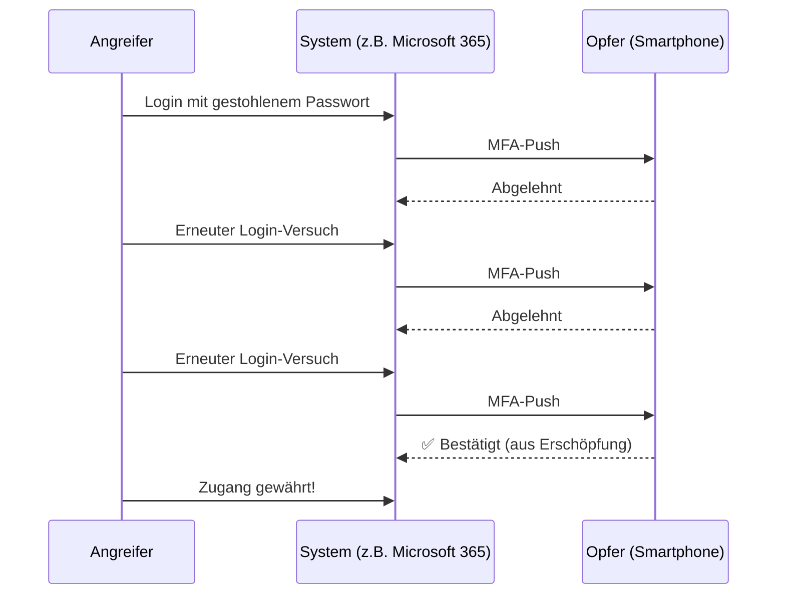
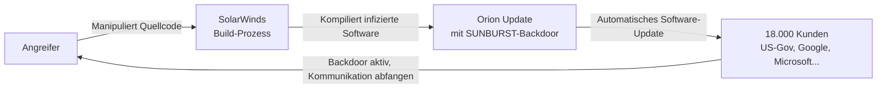
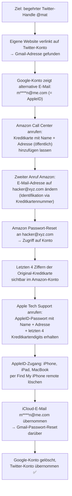
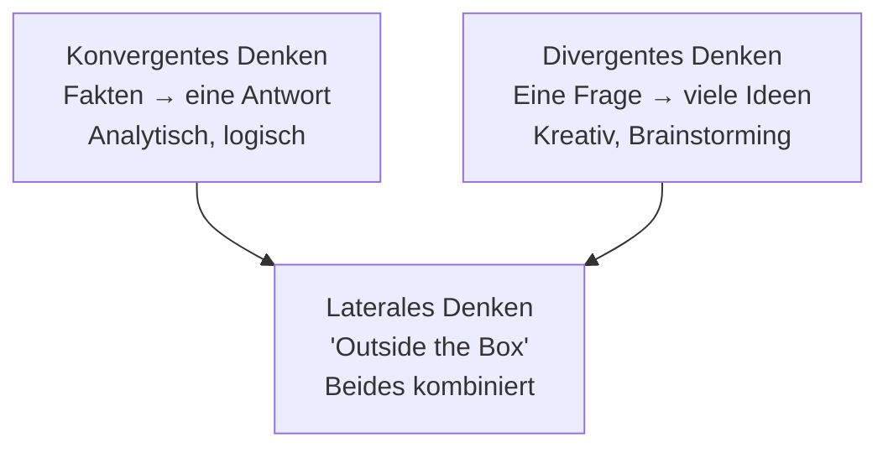
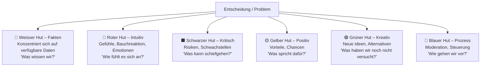
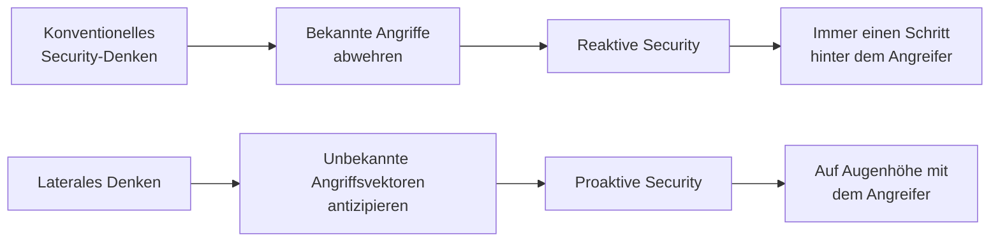

## Zielsetzung

Gute Security-Fachleute denken nicht nur linear. Sie können eine Situation aus ungewöhnlichen Blickwinkeln betrachten, unerwartete Zusammenhänge erkennen und Angriffsvektoren antizipieren, die anderen verborgen bleiben. Diese Lektion trainiert genau diese Denkweise – das sogenannte **Lateral Thinking** oder Querdenken.

**Lernziele:**
- Um-die-Ecke-Denken kennenlernen und trainieren
- Grundlagen des Lateral Thinking verstehen
- Techniken zur Förderung kreativen Denkens anwenden
- Das Gelernte an realen Sicherheitsfällen und Rätseln üben

---

## Motivation: Warum reicht konventionelles Denken nicht?

Bevor die Theorie beginnt, illustrieren zwei reale Beispiele, warum der intuitive Gedanke «Mein System ist sicher» gefährlich falsch sein kann.

### Beispiel 1: MFA-Fatigue – «2FA macht meinen Account sicher!»

Multi-Faktor-Authentifizierung (MFA/2FA) gilt als starke Sicherheitsmassnahme. Und doch: Angreifer haben einen psychologischen Weg gefunden, sie zu umgehen – ohne technische Lücke.

**Was ist MFA-Fatigue?** Der Angreifer kennt bereits Benutzername und Passwort (z.B. durch Phishing oder Datenleck). Er versucht sich wiederholt anzumelden und überflutet das Opfer mit MFA-Push-Benachrichtigungen. Das Opfer, genervt oder müde, drückt irgendwann auf «Bestätigen» – und öffnet damit dem Angreifer die Tür.

> **Lehre:** Eine Sicherheitsmassnahme kann durch menschliches Verhalten ausgehebelt werden – ohne eine einzige technische Schwachstelle auszunutzen. Der Angriffspunkt ist nicht die Technologie, sondern der Mensch.

**Bekannter Anwendungsfall:** Beim Uber-Hack 2022 verschaffte sich ein 18-jähriger Angreifer durch MFA-Bombing und anschliessende Social-Engineering-Kommunikation («Ich bin vom IT-Support, bitte bestätige») Zugang zum internen Netzwerk.

---

### Beispiel 2: Der SolarWinds-Hack (2020) – «Wir prüfen unser System immer gegen Eindringlinge!»

Der SolarWinds-Hack ist eines der bemerkenswertesten Beispiele dafür, dass die eigentliche Sicherheitsprüfung am falschen Ort ansetzte.

**Eckdaten:**

| Merkmal | Details |
|---|---|
| Typ | Supply Chain Attack |
| Art | Ausspähen / Spionage |
| Geschädigte | ~18.000 Firmen weltweit, inkl. Google, US-Regierung |
| Entdeckt | Dezember 2020 |
| Dauer (unentdeckt) | Januar–Dezember 2020 (8 Monate!) |

**Wie funktionierte der Angriff?**

Das Opfer (z.B. das US-Verteidigungsministerium) hatte seine eigenen Systeme sehr wohl gesichert. Der Angriff geschah jedoch *vor* der eigentlichen Zielorganisation – nämlich beim Softwarelieferanten **SolarWinds**, der weit verbreitete Netzwerkverwaltungssoftware *Orion* entwickelt.

**Technische Raffinesse:**
- Der Schadcode (Backdoor «SUNBURST») wurde nicht einfach hinzugefügt, sondern beim **Kompiliervorgang** in den Build-Prozess injiziert – eine Datei wurde umbenannt, kein neuer Prozess erzeugt. Herkömmliche Integritätsprüfungen schlugen nicht an.
- Vor dem Einsatz wurde die Malware de- und neu kompiliert, um Hinweise auf den Ursprung zu verwischen.
- Das Schadprogramm wartete zunächst bis zu zwei Wochen, bevor es aktiv wurde – um Sandboxes zu umgehen.

**Warum ist das ein Lateral-Thinking-Beispiel?** Der konventionelle Sicherheitsgedanke lautet: «Ich sichere mein Netzwerk.» Der Angreifer dachte quer: «Was, wenn ich nicht das Netz angreife, sondern das, was von innen hineingezogen wird?» Die Angriffsfläche war nicht das Opfer selbst, sondern seine Vertrauenskette.

---

### Beispiel 3: Der 90-Minuten-Hack (Mat Honan, 2012) – «Meine Systeme sind sicher!»

Dieses Beispiel zeigt, wie ein 19-jähriger Hacker durch geschicktes Verketten von öffentlichen Informationen und Social Engineering innerhalb von 90 Minuten alle Apple-Geräte eines Journalisten löschte und dessen Konten bei Amazon, Google, Apple und Twitter übernahm – ohne eine einzige technische Schwachstelle auszunutzen.

**Die Angriffskette Schritt für Schritt:**

**Erkenntnisse:**
- Kein einziger echter Einbruch in ein System – nur Social Engineering und das Verketten öffentlich verfügbarer Informationen
- Jedes einzelne Sicherheitssystem (Amazon, Apple) folgte seinen eigenen Regeln korrekt
- Der Angriff nutzte die **Vertrauensbeziehungen zwischen Systemen** aus
- Der beste Schutz wäre 2FA + regelmässige Backups gewesen
- Der Angreifer wollte nur den Twitter-Handle – hätte er mehr gewollt, wäre der Schaden enorm gewesen

---

## Was ist ein «Hack»? – Definition

Das Wort «Hack» wird oft missverstanden. Eine präzisere Definition:

> **Jordan und Taylor (2004):** «Hack» bedeutet «mit geschickten Programmiertricks»; Versuche, Technologie in origineller und erfinderischer Art zu nutzen.

> **BKA (2015):** «Methode von Tüftlern im Kontext einer verspielten selbstbezüglichen Hingabe im Umgang mit Technik» – «eine Art einfallsreiche Experimentierfreudigkeit mit einem besonderen Sinn für Kreativität und Originalität».

Cyberangriffe basieren auf der **Ausnutzung unbekannter Schwachstellen auf unkonventionelle Weise**. Wer nur linear denkt, kann nur bekannte Angriffswege abwehren. Um das Unbekannte zu antizipieren, braucht es **nicht-konformes Denken** – d.h. die Fähigkeit, die Perspektive zu wechseln und Aspekte zu sehen, die andere übersehen würden.

---

## Einführung: Laterales Denken

### Definition

**Laterales Denken** (Lateral Thinking) ist ein Begriff, der vom maltesischen Arzt und Autor **Edward de Bono** geprägt wurde. Es bezeichnet einen indirekten, kreativen Problemlösungsansatz, der bewusst von linearen Denkwegen abweicht.

> *Laterales Denken löst ein Problem durch einen indirekten und kreativen Ansatz, durch Argumentation, die nicht sofort offensichtlich ist, und durch Ideen, die möglicherweise nicht auffindbar sind, indem man nur traditionelle Schritt-für-Schritt-Logik verwendet.*

Kurz gesagt: **Bereits vorhandene Informationen anders nutzen.**

### Laterales vs. Vertikales Denken

| Merkmal | Laterales Denken | Vertikales/lineares Denken |
|---|---|---|
| Charakter | Generativ, provokativ | Selektiv, analytisch |
| Vorgehen | Sprunghaft, zufällig | Schrittweise, logisch aufbauend |
| Regelwerk | Keine festen Regeln | Definiertes System |
| Zufälle | Werden begrüsst | Werden ignoriert |
| Fokus | Unwahrscheinliches, Neues | Bekanntes, Effizientes |
| Denkart | Divergent (viele Ideen) | Konvergent (eine Antwort) |

Das bekannte Bild des **Labyrinths** veranschaulicht den Unterschied: Traditionelle Logik sucht mühsam den Weg durch das Labyrinth. Laterales Denken fragt: «Was, wenn ich einfach drumherum gehe?» – und ignoriert damit die *implizite* Annahme, dass man durch das Labyrinth müsse.

### Die drei Denkmodi

---

## Die vier Prinzipien nach de Bono

Edward de Bono formulierte vier Grundprinzipien für laterales Denken:

1. **Erkenne deine Denkmuster** – Wir navigieren automatisch auf vertrauten Pfaden. Der erste Schritt ist, diese Muster bewusst wahrzunehmen.
2. **Suche nach ungewohnten Blickwinkeln** – Betrachtung von Sachverhalten aus einer anderen Perspektive öffnet neue Lösungsräume.
3. **Überwinde Kontrollmechanismen** – Das vertikale Denken filtert Ideen nach «logisch/unlogisch». Diese Kontrolle muss zeitweise ausgeschaltet werden.
4. **Führe Zufälle bewusst herbei** – Zufällige Einflüsse von aussen können festgefahrene Denkstrukturen aufbrechen.

> *«Es ist beunruhigend, sich vorzustellen, wie viele Situationen nur unzureichend verstanden werden, weil der Versuch, sie zu erklären, sich in der Verwendung vertrauter Muster erschöpft.»* — Edward de Bono

### Umstrukturierung von Denkmustern

De Bono erkannte, dass Menschen dazu neigen, aus unbekannten Situationen vertraute Teilaspekte herauszulösen und sich daran zu orientieren. Um dies zu überwinden, helfen:

- **Blickpunktumkehrung** – Das Problem aus der Gegenrichtung betrachten
- **Visuelles Denken** – Sachverhalte bildlich vorstellen statt sprachlich
- **Zerlegung** – Problem in kleinere Bausteine aufteilen, dann neu zusammensetzen
- **Verändern der Relationen** – Beziehungen zwischen Elementen neu definieren
- **Analogienbildung** – Lösungen aus einem anderen Bereich übertragen
- **Aufmerksamkeit auf Nebensächliches** – Das Offensichtliche ignorieren, das Randständige beachten

---

## Kreativitätstechniken im Detail

### Die 7 Methoden, um innovativ zu sein

| # | Methode | Beschreibung |
|---|---|---|
| 1 | Klassentreffen | In anderen Branchen schauen, wie sie es machen |
| 2 | Kopfstand | Worst-Case-Szenarien durchdenken (Umkehrung) |
| 3 | Semantische Intuition | Zufällige Wortpaare zu einem Thema bilden |
| 4 | Brain-Writing Pool | Ideen auf Karten, im Kreis weitergeben und ergänzen |
| 5 | Spiel mit Veränderung | Eigenschaften des Produkts ändern (Farbe, Form, Grösse…) |
| 6 | Tempo 30 | 30 Wörter in 1 Minute zu einem themenfremden Wort |
| 7 | Reizbild-Technik | Zu einem themenfremden Bild assoziieren |

### 6 Denkende Hüte (Six Thinking Hats, de Bono)

Eine mächtige Technik, um Entscheidungen aus mehreren Perspektiven gleichzeitig zu beleuchten. Jeder «Hut» steht für einen anderen Denkstil:

> Der **schwarze Hut** ist besonders wertvoll in der Security: Er zwingt uns, systematisch nach dem zu suchen, was schiefgehen kann – bevor es passiert. Das ist der Kern jeder Threat-Modellierung.

### Kopfstandtechnik

Die Problemstellung wird **auf den Kopf gestellt**: Anstatt zu fragen «Wie können wir Erfolg haben?» fragt man «Was müssen wir tun, damit wir scheitern?» Da das Gehirn leichter negativ denkt, kommen so oft mehr und kreativere Ideen zusammen. Die Antworten werden dann ins Positive umgekehrt.

**Security-Beispiel:** Statt «Wie schützen wir unsere Webanwendung?» → «Wie würde ein Angreifer unsere Webanwendung kompromittieren?» Dies ist das Prinzip hinter Penetrationstests und Red Teaming.

### Crazy8

Eine zeitbasierte Brainstorming-Methode: Jedes Teammitglied entwickelt in **8 Minuten** auf einem in 8 Felder geteilten Blatt **8 Lösungsansätze**. Die Zeitbeschränkung erzwingt schnelles, unkritisches Denken und überwindet den inneren Zensor.

### Zufallstechnik

Zufällig gewählte Bilder oder Wörter (z.B. aus einem Lexikon) werden als Ausgangspunkt für Assoziationen genutzt. Diese scheinbar themenfremden Impulse können festgefahrene Denkmuster aufbrechen und überraschende Lösungsansätze liefern.

### Provokationstechnik

Die bekannte Realität wird bewusst in Frage gestellt, um neue Ideen zu erzwingen. Fünf Varianten:

| Technik | Beispiel |
|---|---|
| Verfälschung | «Das Basketballfeld ist schief» |
| Umkehrung | «Die Schüler lehren den Professor» |
| Idealfall | «Die Batterie ist nie leer» |
| Übertreibung | «Ein Tag hat 50 Stunden» |
| Aufhebung von Annahmen | «Das Handy braucht keinen Strom» |

In der Security bedeutet das: «Was wäre, wenn der Angreifer *keinen* Netzwerkzugang bräuchte?» → Physische Angriffe, Insider Threats usw.

### Weitere Problemlösungsstrategien

**Fractionalization (Divide and Conquer):** Ein grosses, komplexes Problem wird in kleinere, lösbarere Teilprobleme aufgeteilt. Dies entspricht dem Prinzip der Security-Domänen (Netzwerk, Applikation, Identität, Endpunkt etc.).

**Hypothesis Testing:** Eine mögliche Erklärung wird angenommen und dann zu beweisen (oder zu widerlegen) versucht. In der Incident Response: «Ich nehme an, der Angreifer ist lateral durch das Netzwerk bewegt.» → Überprüfung der Logs.

**Means-End Analysis (MEA):** Schrittweises Annähern ans Ziel durch Aktionen, die die Lücke zwischen aktuellem und gewünschtem Zustand verkleinern. Wird auch in KI-Planungssystemen verwendet.

---

## Übungen und Rätsel

Die Vorlesung enthält mehrere Rätsel, die zeigen, wie einschränkende Annahmen das Denken blockieren:

### Übung 1: Die 11 Eier
*11 Eier im Korb, 11 Personen nehmen je ein Ei – und doch ist noch eines übrig.*
**Lösung:** Die letzte Person nimmt das Ei **samt Korb** – niemand hat gesagt, der Korb müsse leer bleiben.
> **Lesson learned:** Wir machen implizite Annahmen, die in der Aufgabe gar nicht stehen.

### Übung 2: Die 9 Punkte
*9 Punkte in einem 3×3-Raster mit 4 Geraden verbinden, ohne Stift abzusetzen.*
**Lösung:** Die Linien müssen **über den Rand des Rasters hinausgehen** – wir nehmen automatisch an, wir dürften das nicht, obwohl niemand es verboten hat.
> Dies ist der Ursprung des Begriffs «Outside the Box Thinking».

### Übung 3: Die Schlucht
*40m breite, 80m tiefe Schlucht, 39m Leiter, unendlich langes Seil.*
**Lösung:** Man legt die **Leiter diagonal** in die Schlucht (Diagonale > 40m), überquert sie und zieht sie dann mit dem Seil hinter sich her.
> Der Trick: Die Leiter muss nicht als Leiter benutzt werden – sie kann als Brücke dienen.

### Quiz für IT-Führungskräfte (Kühlschrank)
Ein bekanntes Denkspiel, das zeigt, wie Erwachsene durch gewohnte Denkmuster scheitern, während Kinder die Logik des «Kontexts» noch nicht verinnerlicht haben:

1. «Wie bekommt man eine Giraffe in den Kühlschrank?» → Türe auf, Giraffe rein, Türe zu.
2. «Wie bekommt man einen Elefanten in den Kühlschrank?» → Türe auf, Giraffe **raus**, Elefant rein, Türe zu. *(Die meisten vergessen die Giraffe!)*
3. «Welches Tier fehlt bei der Tierkonferenz?» → Der Elefant *(ist ja im Kühlschrank)*.
4. «Wie überquert man einen Fluss mit Krokodilen?» → Einfach schwimmen – die Krokodile sind bei der Konferenz!

Die vier Fragen testen: Lösungskomplexität, Konsequenzbewusstsein, Gedächtnis und Lernfähigkeit.

### Übung 5: Das Rechenrätsel
*4 Polizisten, 5 Rasierklingen, 3 Harmonie-Suchende, 1 Zahnarzt, 1 Vegetarier – Ergebnis: einstellige nicht-negative Zahl.*

Lösung:
- 4 Polizisten geben gut acht → 4 × 8 = **32**
- 5 Rasierklingen abziehen → 32 − 5 = **27**
- 3 Harmonie-Suchende verteilen gleichmässig → 27 ÷ 3 = **9**
- Zahnarzt zieht die Wurzel → √9 = **3**
- Vegetarier isst die Wurzel → 3 − 3 = **0**

> Das Rätsel zeigt: Sprache kann als Codierung für mathematische Operationen dienen – ein Angreifer denkt genauso über Protokolle und APIs nach.

### Übung 6: Der Diamant (Kryptographie-Analogie)
*Herbert will Angelika einen Diamanten schicken. Beide haben Vorhängeschlösser, aber keine passenden Schlüssel füreinander. Der Kurier ist nicht vertrauenswürdig.*

**Lösung:** Angelika schickt ihr *offenes* Schloss (ohne Schlüssel) zu Herbert. Herbert legt den Diamanten in die Kiste, sperrt sie mit **Angelikas Schloss** und schickt sie zurück. Nur Angelika kann öffnen.

> Dies ist exakt das Prinzip der **asymmetrischen Kryptographie** (Public-Key-Verschlüsselung): Der öffentliche Schlüssel ist wie das offene Schloss – jeder kann damit verschlüsseln (zumachen), aber nur der Besitzer des privaten Schlüssels kann entschlüsseln (aufmachen).

---

## Laterales Denken und Cyber Security: Der Zusammenhang

Das Ziel dieses Moduls lässt sich in einem Satz zusammenfassen:

> **Cyberangriffe nutzen Schwachstellen auf unkonventionelle Weise – wer nur konventionell denkt, sieht sie erst, wenn es zu spät ist.**

Die besten Angriffe der Geschichte – SolarWinds, NotPetya, Stuxnet – zeichnen sich alle durch das gleiche Muster aus: Der Angreifer hat die impliziten Annahmen des Verteidigers genutzt. Er hat nicht das angegriffen, was erwartet wurde.

---

## Fallbeispiele aus der Vorlesung (Gruppenarbeit)

In der Vorlesung wurden neun reale Sicherheitsvorfälle in Gruppen analysiert:

1. Hacker in System: A1 Telekom Austria
2. Log4Shell – Zero-Day-Lücke
3. Stuxnet
4. Der Equifax Hack
5. RUAG-Hack
6. (weitere Fälle gemäss ILIAS-Etherpad)

Für jeden Fall wurde untersucht: Was ist passiert? Was war das Kreative/Unkonventionelle am Angriff?

---

## Fazit

Die Umstrukturierung von Denkmustern ist nach de Bono **notwendig**, um bereits vorhandene Informationen **anders** nutzen zu können. Das ist kein akademisches Konzept – es ist die Kernkompetenz eines Security-Analysten, eines Penetrationstesters und eines Incident Responders.

Wer lernt, implizite Annahmen zu hinterfragen, Perspektiven zu wechseln und Zusammenhänge zu erkennen, die andere nicht sehen, wird zu einem wesentlich effektiveren Verteidiger.

---

## Weiterführende Ressourcen

- **TEDx Talk:** Tina Seelig – «A crash course in creativity» (TEDxStanford): https://www.youtube.com/watch?v=gyM6rx69iqg
- **Video zu Lateral Thinking:** https://youtu.be/AUq_AL2LNEw (9 min)
- **Manager Magazin:** Sieben Methoden zum innovativen Denken
- **Adversarial Thinking in IT:** https://www.smokescreen.io/adversarial-thinking-improving-cybersecurity-with-ants-and-barcodes/
- **Buch:** «Quergedacht 2.0» von K. Völker (ISBN: 978-3-8423-5956-7)
- **Wikipedia:** Six Thinking Hats: https://en.wikipedia.org/wiki/Six_Thinking_Hats
- **Quelle SolarWinds / Mat Honan Hack:** https://www.wired.com/2012/08/apple-amazon-mat-honan-hacking/

---

*Modul I.BA_INTROL.F26 – Hochschule Luzern, Departement Informatik, Frühjahrssemester 2026*
