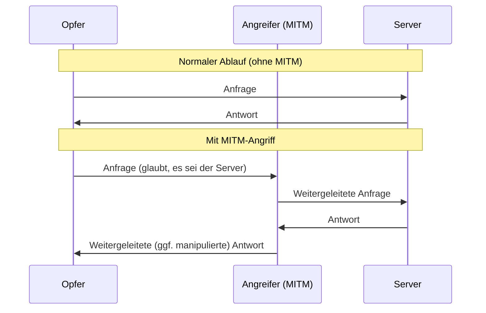
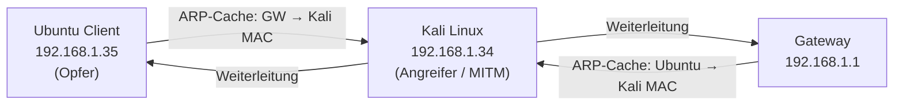
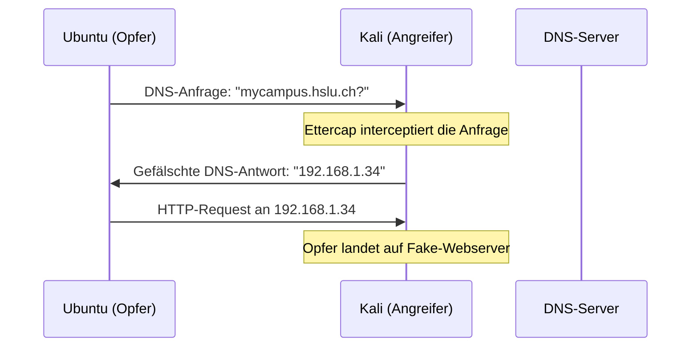
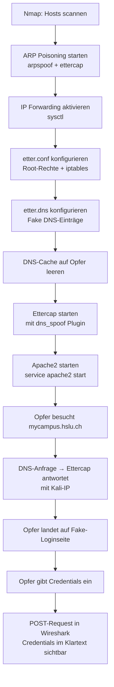

## Lernziele

- Verständnis des Man-in-the-Middle-Konzepts auf verschiedenen OSI-Schichten
- Durchführung einer ARP Request Poisoning-Attacke mit `arpspoof`
- Kennenlernen von Kali Linux als Penetration-Testing-Plattform
- Netzwerk-Scanning mit `nmap`
- Kombination von ARP Poisoning mit DNS Spoofing mittels `ettercap`
- Erkennen von Anzeichen einer gefälschten Website

---

## 1. Hintergrund: Was ist ein Man-in-the-Middle-Angriff?

Ein **Man-in-the-Middle (MITM)**-Angriff beschreibt eine Angriffskategorie, bei der ein Angreifer sich **physisch oder logisch zwischen zwei kommunizierende Parteien** einklinkt. Das Ziel ist es, den Datenverkehr abzufangen, auszuspähen, zu manipulieren und anschliessend weiterzuleiten – idealerweise ohne dass die Kommunikationspartner dies bemerken.

Der Angreifer hat dabei **vollständige Kontrolle** über den Datenverkehr zwischen den Opfern. MITM-Angriffe sind deshalb so gefährlich, weil sie für die Opfer völlig unsichtbar sein können, solange der Angreifer die Pakete korrekt weiterleitet.



### MITM auf verschiedenen OSI-Schichten

| OSI-Schicht | Angriffsmethode | Beispiel |
|---|---|---|
| **Layer 1 – Physical** | Rogue Access Point | Angreifer emuliert einen WLAN-Accesspoint |
| **Layer 2 – Ethernet** | ARP Request Poisoning | Angreifer gibt sich als Router aus |
| **Layer 7 – Application** | DNS Spoofing | Angreifer gibt sich als DNS-Server aus |

**Physical Layer (Layer 1):** Ein Angreifer richtet einen sogenannten *Rogue Access Point* ein, der denselben SSID wie ein legitimer WLAN-Accesspoint hat. Geräte, die sich verbinden, senden ihren gesamten Traffic durch den Angreifer.

**Ethernet Layer (Layer 2):** Durch wiederholtes Senden gefälschter ARP-Pakete (*ARP Request Poisoning*) bringt der Angreifer andere Netzwerkteilnehmer dazu, seine MAC-Adresse anstelle der MAC-Adresse des legitimen Gateways in ihrem ARP-Cache zu speichern. Alle Pakete, die eigentlich zum Router sollten, landen beim Angreifer.

**Anwendungsschicht (Layer 7):** Beim *DNS Spoofing* antwortet der Angreifer auf DNS-Anfragen des Opfers mit gefälschten IP-Adressen. So wird das Opfer statt auf `mycampus.hslu.ch` auf einen vom Angreifer kontrollierten Server umgeleitet.

### MITM auf SSL/HTTPS und SSH

Auch verschlüsselte Protokolle sind nicht automatisch sicher gegenüber MITM:

- **SSH-MITM:** Der Angreifer gibt sich als Ziel-SSH-Server aus. Das Opfer baut eine SSH-Verbindung mit dem Angreifer auf, der dann seinerseits eine reguläre SSH-Verbindung zum eigentlichen Ziel aufbaut. Der Angreifer erhält so das Passwort und kann alle SSH-Befehle mitlesen.
- **TLS/HTTPS:** Die meisten kryptografischen Protokolle enthalten Mechanismen zur Endpunkt-Authentifizierung (z.B. Zertifikate via CA), um MITM zu verhindern. SSH prüft beim Verbindungsaufbau den *Server-Fingerprint* und vergleicht ihn mit früheren Verbindungen.

> **Wichtig:** Ein MITM-Angriff kann nur erfolgreich sein, wenn der Angreifer jeden Endpunkt ausreichend gut imitiert, um die Erwartungen der Gegenseite zu erfüllen.

---

## 2. Grundlagen: ARP (Address Resolution Protocol)

### Was ist ARP und warum braucht man es?

Im lokalen Netzwerk (LAN) findet die eigentliche Kommunikation auf **Schicht 2 (Ethernet-Layer)** statt. Jedes Ethernet-Frame benötigt eine **MAC-Adresse** als Zieladresse. Das Problem: Anwendungen und das IP-Protokoll (Layer 3) kennen nur IP-Adressen, nicht MAC-Adressen.

**ARP löst dieses Problem**, indem es IP-Adressen auf MAC-Adressen abbildet:

```mermaid
sequenceDiagram
    participant ClientA
    participant Netzwerk (Broadcast)
    participant ClientB (IP: 192.168.1.35)

    ClientA->>Netzwerk (Broadcast): ARP Request: "Wer hat IP 192.168.1.35?"
    ClientB (IP: 192.168.1.35)->>ClientA: ARP Reply: "Ich! Meine MAC ist 08:00:27:f7:51:0f"
    Note over ClientA: Speichert Eintrag im ARP-Cache
```

1. Client A möchte ein Paket an IP `192.168.1.35` senden
2. Client A schickt einen **ARP Broadcast** ins gesamte Subnetz: *"Wer hat IP 192.168.1.35?"*
3. Der Besitzer dieser IP antwortet mit seinem **ARP Reply**: *"Ich! Meine MAC ist XY"*
4. Client A speichert die Zuordnung `IP → MAC` in seinem lokalen **ARP-Cache**

Der ARP-Cache kann mit `arp -a` angezeigt werden und enthält alle bekannten IP-MAC-Zuordnungen.

### Warum ist ARP angreifbar?

ARP wurde 1982 (RFC 826) standardisiert und besitzt **keine Authentifizierung**. Jeder im Netzwerk kann ARP-Replies senden, auch ohne eine vorherige ARP-Anfrage erhalten zu haben. Das ist die Grundlage für ARP Request Poisoning.

---

## 3. ARP Request Poisoning

### Konzept

Beim ARP Poisoning sendet der Angreifer **gefälschte ARP-Reply-Pakete** an die Opfer:

- **An das Opfer (Ubuntu Client):** "Die IP des Gateways (`192.168.1.1`) gehört zu meiner (Kali's) MAC-Adresse"
- **An das Gateway:** "Die IP des Opfers (`192.168.1.35`) gehört zu meiner (Kali's) MAC-Adresse"

Beide Seiten aktualisieren ihren ARP-Cache mit den gefälschten Einträgen. Ab diesem Moment läuft der gesamte Traffic zwischen Opfer und Gateway über den Angreifer.



Da der Angreifer die Pakete **weiterleiten** muss (sonst fällt der Internetausfall auf), muss auf dem Kali-System das **IP Forwarding** aktiviert werden:

```bash
sysctl -w net.ipv4.ip_forward=1
```

### Praxis: Nmap für Host-Discovery

Bevor der Angriff beginnt, verschafft sich der Angreifer einen Überblick über das Netzwerk. Das Tool **nmap** (*Network Mapper*) ist ein Portscanner zum Scannen und Auswerten von Hosts.

```bash
# SYN Stealth-Scan des gesamten Subnetzes (benötigt root)
sudo nmap -sS 192.168.1.0/24
```

Ein **SYN Stealth-Scan** sendet TCP SYN-Pakete an Ports, wartet auf SYN-ACK (Port offen) oder RST (Port geschlossen), antwortet aber nie mit ACK. Dadurch wird kein vollständiger TCP-Handshake durchgeführt, was die Unauffälligkeit erhöht.

Typische Ergebnisse erlauben die Identifikation der Hosts anhand offener Ports:
- **Gateway (ZyXEL-Router):** Ports wie ftp, ssh, dns, http, https offen
- **Windows-Client:** Ports wie msrpc, netbios, microsoft-ds offen
- **Ubuntu-Client:** Alle Ports geschlossen (typisch für Endbenutzer-VM)

Das lokale Gateway kann auch direkt ermittelt werden:
```bash
route -n
```

### Praxis: arpspoof

Das Tool `arpspoof` aus dem `dsniff`-Paket sendet kontinuierlich gefälschte ARP-Pakete.

```bash
# Dem Ubuntu Client vorspielen, dass Kali das Gateway ist:
sudo arpspoof -i eth0 -t 192.168.1.35 192.168.1.1

# Dem Gateway vorspielen, dass Kali der Ubuntu Client ist:
sudo arpspoof -i eth0 -t 192.168.1.1 192.168.1.35

# Oder beides gleichzeitig mit -r (recursive / bidirektional):
sudo arpspoof -i eth0 -t 192.168.1.1 -r 192.168.1.35
```

> **Warum kontinuierlich?** ARP-Caches haben eine begrenzte Lebensdauer (TTL). Wird das Spoofing gestoppt, erneuern die Hosts ihre korrekten Einträge. Der Angriff muss daher **dauerhaft aktiv** gehalten werden.

### Gegenmassnahmen von Routern: Dynamic ARP Inspection (DAI)

Fortgeschrittene Router wie der ZyXEL ZyWALL USG20 können ARP-Spoofing erkennen und dagegen vorgehen:

**Dynamic ARP Inspection (DAI)** vergleicht ARP-Pakete mit einer lokalen Datenbank valider IP-MAC-Zuordnungen (meist aus DHCP-Snooping gewonnen). Stimmt ein ARP-Paket nicht mit einem gültigen Eintrag überein, wird es verworfen.

Zusätzlich sendet der Router **ICMP Redirect**-Pakete, wenn er erkennt, dass Pakete einen Umweg nehmen. Der Ubuntu Client reagiert darauf und sendet Pakete wieder direkt an den echten Gateway – das Spoofing wird für diese Verbindungen umgangen.

**Resultat mit Router (DAI aktiv):** Nur der Uplink-Verkehr vom Opfer ist sichtbar, nicht der Downlink.  
**Resultat ohne Router:** Der gesamte Traffic (Up- und Downlink) ist im Klartext einsehbar.

---

## 4. Wireshark-Analyse

Mit **Wireshark** kann der abgefangene Traffic analysiert werden. Relevante Filter:

```
# HTTP-Traffic anzeigen
http

# ICMP-Redirects anzeigen
icmp

# HTTPS-Traffic zu einem bestimmten Server
tcp.port == 443 && ip.dst == 147.88.201.69
```

### HTTP vs. HTTPS im Vergleich

Bei unverschlüsselten HTTP-Verbindungen sind **alle Daten im Klartext** sichtbar, inklusive POST-Requests mit Credentials:

```
POST /login HTTP/1.1
...
username=admin&password=geheim123
```

Bei HTTPS-Verbindungen ist der Traffic mit **TLS (Transport Layer Security)** verschlüsselt. In Wireshark sieht man zwar den TCP-Handshake und TLS-Handshake (Client Hello, Server Hello, Zertifikataustausch), aber die eigentlichen Applikationsdaten (*Application Data*) sind verschlüsselt und nicht lesbar.

> **Fazit:** HTTPS allein schützt den Inhalt, aber nicht davor, den Traffic zu sehen oder durch DNS Spoofing auf eine Fake-Seite umzuleiten.

---

## 5. DNS Spoofing

### Konzept

DNS Spoofing (auch *DNS Cache Poisoning*) baut auf dem ARP Poisoning auf. Da der gesamte Traffic des Opfers über den Angreifer läuft, kann dieser auf **DNS-Anfragen des Opfers mit gefälschten Antworten** reagieren.



Ziel: Das Opfer besucht `mycampus.hslu.ch`, landet aber auf einem vom Angreifer kontrollierten Webserver mit einer geklonten Login-Seite.

### Tool: Ettercap

**Ettercap** ist eine freie Software für MITM-Angriffe, die mehrere Funktionen kombiniert:
- ARP Poisoning
- Sniffing von ARP- und IP-Paketen
- Echtzeitkontrolle über Verbindungen
- Inhaltsbasierte Filterung
- **DNS Spoofing via Plugin** `dns_spoof`

#### Konfiguration von Ettercap

**Datei `/etc/ettercap/etter.conf`:**
- `ec_uid` und `ec_gid` auf `0` setzen (Root-Rechte)
- `iptables`-Regeln aktivieren (Auskommentierung bei den `redir_command`-Zeilen unter `Linux` entfernen)

Die iptables-Regeln leiten eingehende Pakete auf bestimmten Ports an den lokalen Ettercap-Proxy-Port um:
```
# Aktivierung: Pakete auf Port %port → Ettercap auf Port %rport
iptables -t nat -A PREROUTING -i %iface -p tcp --dport %port -j REDIRECT --to-port %rport
```

**Datei `/etc/ettercap/etter.dns`:**
Hier werden die gefälschten DNS-Einträge definiert:

```
mycampus.hslu.ch        A    192.168.1.34
mycampus.hslu.ch        AAAA [IPv6-Link-Local-Adresse]
*.mycampus.hslu.ch      A    192.168.1.34
*.mycampus.hslu.ch      AAAA [IPv6-Link-Local-Adresse]
www.mycampus.hslu.ch    PTR  192.168.1.34
```

| Record-Typ | Bedeutung |
|---|---|
| **A** | Host-Eintrag für IPv4-Adresse |
| **AAAA** | Host-Eintrag für IPv6-Adresse |
| **PTR** | Pointer-Eintrag (Reverse DNS) |

> **Warum auch AAAA-Records?** Falls das Opfersystem IPv6 verwendet und einen AAAA-Record für `mycampus.hslu.ch` erhält, wird die Kommunikation über IPv6 laufen. Ein Spoofing nur mit A-Records (IPv4) wäre dann wirkungslos.

#### DNS-Cache leeren auf dem Opfer-System

Damit das Spoofing sofort wirkt (und nicht ein gecachter, echter Eintrag verwendet wird), muss der DNS-Cache geleert werden:

```bash
# Cache anzeigen
resolvectl statistics

# Cache leeren
sudo resolvectl flush-caches

# DNS-Dienst neu starten
sudo systemctl restart systemd-resolved
```

Im Firefox-Browser muss zusätzlich der Browser-Cache und der Browserverlauf für die betreffende Seite gelöscht werden (Standardmässige DNS-Cache-TTL in Firefox: 60 Sekunden, Chrome: 30 Sekunden).

### Tool: httrack (Website-Kopierer)

Um eine überzeugende Fake-Loginseite zu erstellen, wird die echte Seite mit **httrack** geklont:

```bash
# Syntax
httrack [URL] -O [Zielordner]

# Beispiel
httrack https://mycampus.hslu.ch -O /var/www/html/httrack_mycampus
```

httrack lädt alle verlinkten Dateien (HTML, CSS, JS, Bilder) herunter und erstellt so eine lokale Kopie der Website.

### Aufsetzen des malicious Webservers (Apache)

Kali Linux bringt einen **Apache2-Webserver** mit. Das Document-Root liegt unter `/var/www/html/`.

Ablauf:
1. Geklonte Website-Dateien nach `/var/www/html/` verschieben
2. Weiterleitungs-Dateien von httrack entfernen (verhindern ungewollte Redirect-Meldungen)
3. **Formular-`action`-Attribut** in `index.html` der geklonten Seite ändern:

```html
<!-- Original: sendet an echten MyCampus-Server -->
<form action="https://mycampus.hslu.ch/de-ch/login" ...>

<!-- Geändert: sendet an eigene Wartungsseite -->
<form action="http://mycampus.hslu.ch/de-ch/wartung.html" ...>
```

So werden die eingegebenen Credentials als HTTP POST-Request an den Angreifer-Server gesendet, der sie im Klartext in Wireshark sichtbar macht.

### Vollständiger Angriffsablauf



---

## 6. Erkennungsmerkmale einer gefälschten Website

Folgende Anzeichen können darauf hindeuten, dass eine Website gefälscht ist:

1. **Fehlende HTTPS-Verbindung / HTTP statt HTTPS:** Die Fake-Seite läuft über HTTP, da der Angreifer kein gültiges TLS-Zertifikat für `mycampus.hslu.ch` besitzt. Der Browser zeigt eine Zertifikatswarnung oder das Schloss-Symbol fehlt.

2. **Zertifikatswarnung:** Selbst wenn der Angreifer ein selbstsigniertes Zertifikat verwendet, warnt der Browser, da dieses nicht von einer vertrauenswürdigen CA ausgestellt wurde.

3. **Ungewöhnliche Weiterleitungen oder URLs:** Die URL wechselt auf eine unbekannte Seite (z.B. `wartung.html`).

4. **MFA (Multi-Faktor-Authentifizierung):** Moderne Systeme wie MyCampus verwenden MFA. Eine geklonte Loginseite kann zwar Benutzername und Passwort abfangen, aber der zweite Faktor (z.B. TOTP-Code) ist nur kurzzeitig gültig und schwerer abzufangen.

---

## 7. Wichtige Tools im Überblick

| Tool | Zweck |
|---|---|
| `nmap` | Netzwerk-Scanner, Host- und Port-Discovery |
| `arpspoof` | ARP Poisoning (aus dem `dsniff`-Paket) |
| `ettercap` | MITM-Framework mit ARP Poisoning, Sniffing und DNS Spoofing |
| `wireshark` | Traffic-Analyse und Paket-Inspektion |
| `httrack` | Website-Kopierer (klont eine ganze Website lokal) |
| `nslookup` | DNS-Auflösung testen (Nameserver Lookup) |
| `arp` | ARP-Cache anzeigen (`arp -a`) |
| `route` | Routing-Tabelle anzeigen (Gateway ermitteln) |
| `sysctl` | Kernel-Parameter lesen/schreiben (z.B. IP Forwarding) |

### Wichtige Befehle

```bash
# IP-Forwarding aktivieren
sysctl -w net.ipv4.ip_forward=1

# ARP-Cache anzeigen (auf Opfer)
arp -a

# Gateway anzeigen
route -n

# DNS-Auflösung testen
nslookup mycampus.hslu.ch
host mycampus.hslu.ch
dig mycampus.hslu.ch

# Ettercap (GUI)
sudo ettercap -G

# Apache starten
service apache2 start
```

---

## 8. Zusammenfassung

### ARP Request Poisoning

- ARP besitzt **keine Authentifizierung** → angreifbar durch gefälschte ARP-Replies
- Mit `arpspoof` werden kontinuierlich gefälschte ARP-Pakete gesendet
- Das Opfer aktualisiert seinen ARP-Cache mit der MAC-Adresse des Angreifers
- **IP Forwarding** muss aktiviert sein, damit der Angreifer die Pakete weiterleitet
- Router können mit **DAI (Dynamic ARP Inspection)** und **ICMP Redirects** dagegen vorgehen
- Ohne Schutzmassnahmen ist der gesamte Traffic im Klartext über Wireshark einsehbar

### DNS Spoofing

- Baut auf ARP Poisoning auf (Angreifer muss bereits MITM-Position haben)
- **Ettercap** mit Plugin `dns_spoof` antwortet auf DNS-Anfragen des Opfers mit gefälschten IPs
- Konfiguration: `etter.conf` (Rechte + iptables) und `etter.dns` (Fake-DNS-Einträge)
- **httrack** klont die Ziel-Website für eine überzeugende Fälschung
- Credentials werden als HTTP-POST abgefangen und sind in Wireshark im Klartext sichtbar
- Schutzmassnahmen: **HTTPS/TLS**, **MFA**, Browser-Zertifikatswarnungen beachten

> **Ethischer Hinweis:** Die hier beschriebenen Techniken dürfen ausschliesslich in kontrollierten Laborumgebungen und mit ausdrücklicher Genehmigung aller Beteiligten eingesetzt werden. Der Einsatz in produktiven Netzwerken ohne Erlaubnis ist illegal.
