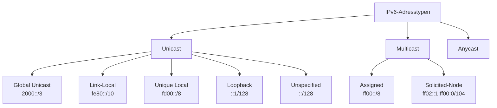
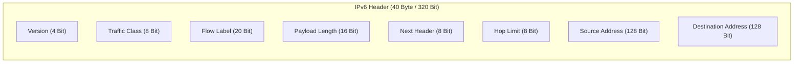
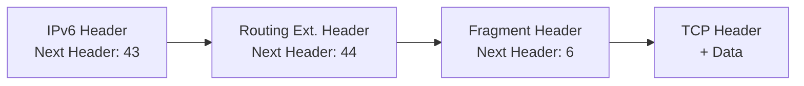
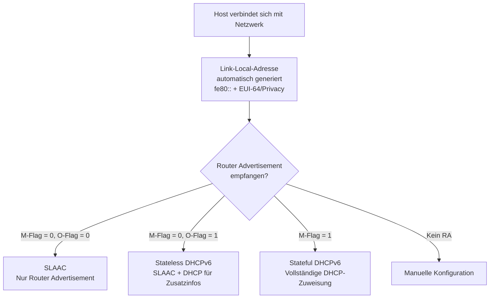
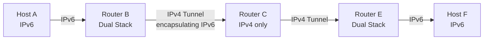
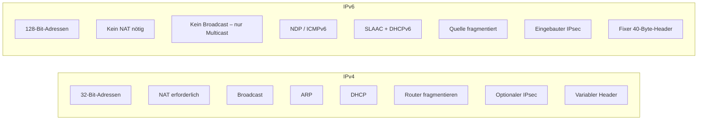

## Warum überhaupt IPv6?

IPv4 ist über 40 Jahre alt und wurde in einer Zeit entworfen, in der niemand ahnte, wie gross das Internet einmal werden würde. Das grundsätzliche Prinzip von IP funktioniert zwar nach wie vor – aber IPv4 stösst an fundamentale Grenzen:

- **Adressknappheit**: Der 32-Bit-Adressraum erlaubt theoretisch rund 4,3 Milliarden Adressen. Die 2¹⁴ Klasse-B-Netzwerke sind schon lange aufgebraucht. Klasse-C-Netzwerke sind für viele Firmen zu klein. Als Übergangslösung wurde NAT (Network Address Translation) eingeführt – aber NAT bricht das Ende-zu-Ende-Prinzip des Internets und schafft neue Probleme.
- **Skalierung**: Das Netz wuchs von einigen Forschungsrechnern auf Milliarden von Geräten (Smartphones, IoT, Wearables, …). Geschwindigkeiten stiegen von KBit/s auf GBit/s. IPv4 musste durch Workarounds am Leben erhalten werden.
- **Neue Anforderungen**: Multimedia (VoIP, Videostreaming), Quality of Service, Mobilität, Sicherheit – alles Bereiche, die IPv4 nur unzureichend unterstützt.

Die IETF (Internet Engineering Task Force) begann in den 1990er-Jahren, eine Nachfolgeversion zu entwickeln. Verschiedene Vorschläge wurden als *IPng* (Internet Protocol next Generation) bezeichnet. 1998 wurde der Gewinner im RFC 2460 standardisiert – und weil die Versionsnummer 5 schon vergeben war, hiess die neue Version **IPv6**. 2017 wurde RFC 2460 durch RFC 8200 ersetzt.

**Aktuelle Verbreitung (2026):** Laut Google-Statistiken nutzen inzwischen rund 50 % des erfassten Datenverkehrs IPv6 – Tendenz steigend, aber der Übergang kommt nach wie vor nur langsam voran.

---

## Was bringt IPv6? – Die wichtigsten Verbesserungen

| Aspekt | IPv4 | IPv6 |
|--------|------|-------|
| Adresslänge | 32 Bit (~4,3 Mrd. Adressen) | 128 Bit (~340 Sextillionen Adressen) |
| NAT | Notwendig | Nicht mehr nötig |
| Header-Grösse | Variabel (20–60 Byte) | Fix 40 Byte |
| Fragmentierung | Router fragmentieren | Nur Quelle fragmentiert |
| Autokonfiguration | DHCP (stateful) | SLAAC (stateless, ohne Server) |
| Broadcast | Ja | Nein – ersetzt durch Multicast |
| IPsec | Optional | Eingebaut |
| QoS / Flow Label | Begrenzt (ToS/DSCP) | Flow Label im Header |
| ARP | Ja | Nein – ersetzt durch NDP (Neighbor Discovery) |

**Warum 128 Bit?** 128 Bit ermöglichen 2¹²⁸ ≈ 3,4 × 10³⁸ Adressen. Das reicht, um jedem Sandkorn auf der Erde mehrere Netzwerke zuzuweisen. Der Adressraum ist so gross, dass NAT komplett überflüssig wird – jedes Gerät kann eine weltweit eindeutige, öffentliche IP-Adresse erhalten.

---

## IPv6-Adressierung

### Notation

Eine IPv6-Adresse besteht aus **128 Bit**, aufgeteilt in **8 Blöcke zu je 16 Bit**, hexadezimal notiert und durch Doppelpunkte getrennt:

```
2001:0db8:85a3:0000:0001:8a2e:0370:7334
```

**Kurzschreibweisen** (gemäss RFC 5952):
1. Führende Nullen innerhalb eines Blocks weglassen: `0db8` → `db8`
2. Eine (und nur eine!) zusammenhängende Folge von reinen Null-Blöcken durch `::` ersetzen: `0000:0000:0000` → `::`
3. Alle Buchstaben werden kleingeschrieben.

Beispiel: Die folgenden Schreibweisen bezeichnen alle die gleiche Adresse:
```
2001:0db8:0000:0000:0001:0000:0000:0001   (vollständig)
2001:db8:0:0:1:0:0:1                       (führende Nullen weg)
2001:db8::1:0:0:1                          (:: für längste Null-Sequenz)
```

> **Wichtig:** `::` darf nur **einmal** pro Adresse verwendet werden, da sonst unklar wäre, wie viele Null-Blöcke es repräsentiert.

### Adresstypen

IPv6 kennt **drei** Adresstypen (kein Broadcast mehr!):



- **Unicast**: Ein Paket geht an genau einen Empfänger. Das entspricht dem normalen IP-Betrieb.
- **Multicast**: Ein Paket geht an alle Mitglieder einer Gruppe. IPv6 ersetzt damit Broadcasts vollständig – es gibt in IPv6 **keine Broadcasts mehr**.
- **Anycast**: Die Adresse ist mehreren Hosts zugewiesen. Das Paket geht an den *topologisch nächsten* Host dieser Gruppe. Nützlich für Dienste mit mehreren Standorten (z. B. DNS, CDN).

**Unterschied Multicast vs. Anycast:**
- Multicast → Alle Gruppenmitglieder empfangen das Paket
- Anycast → Nur *einer* (der nächste) empfängt das Paket

### Wichtige IPv6-Adressen

| Adresse | Typ | Bedeutung |
|---------|-----|-----------|
| `::/128` | Nicht spezifiziert | Fehlen einer Adresse (wie `0.0.0.0` in IPv4) |
| `::1/128` | Loopback | Loopback-Interface (wie `127.0.0.1`) |
| `2000::/3` | Global Unicast | Normale, öffentlich routbare IPv6-Adressen |
| `fe80::/10` | Link-Local Unicast | Nur im lokalen Netzwerksegment gültig, wird nicht weitergerouted |
| `fd00::/8` | Unique Local Unicast | Private IPv6-Adressen (ähnlich RFC1918 in IPv4), intern routbar |
| `ff00::/8` | Multicast | Alle Multicast-Gruppen |
| `ff02::1` | Link-Local Multicast | Alle Knoten im lokalen Netz (ehemaliger Broadcast) |
| `ff02::2` | Link-Local Multicast | Alle Router im lokalen Netz |
| `ff02::1:2` | Link-Local Multicast | Alle DHCPv6-Server im lokalen Netz |

**Link-Local-Adressen** (fe80::) sind besonders wichtig: Sie werden automatisch von jedem IPv6-Interface generiert und ermöglichen die Kommunikation im lokalen Netz, auch ohne globale IPv6-Anbindung. Sie sind die Basis für SLAAC und Neighbor Discovery.

---

## Adressstruktur und Hierarchie

### Aufbau einer IPv6-Adresse

Jede IPv6-Adresse für Endsysteme ist in zwei gleichgrosse Hälften aufgeteilt:

```
|<----------- 64 Bit Prefix ----------->|<------- 64 Bit Interface ID ------->|
|  Global Routing Prefix (48 Bit)  | SLA (16 Bit) |     Interface Identifier    |
|   RIR (12)  |   ISP (20)  | Site (16) |  Subnet  |        (aus MAC-Adresse)    |
```

- **Global Routing Prefix (48 Bit)**: Vom Provider zugewiesen. Enthält RIR-Anteil, ISP-Anteil und Site-Anteil.
- **SLA (Subnet Level Aggregation, 16 Bit)**: Erlaubt der Firma, bis zu 65.536 Subnetze intern zu vergeben.
- **Interface ID (64 Bit)**: Identifiziert das konkrete Interface innerhalb des Subnetzes. Wird meist aus der MAC-Adresse (EUI-64-Verfahren) oder per Privacy Extensions generiert.

**Für die Praxis:**
- Firmen erhalten von ihrem Provider typischerweise ein `/48` (48-Bit-Prefix)
- Jedes LAN-Segment ist immer ein `/64`
- Das ergibt 2¹⁶ = 65.536 mögliche Subnetze pro Firma

---

## IPv6-Paketstruktur

### Der IPv6-Basisheader

Der IPv6-Header hat eine **feste Grösse von 40 Byte** (320 Bit) – im Gegensatz zu IPv4, dessen Header variabel ist. Das erleichtert die Verarbeitung in Routern erheblich.



**Felder im Detail:**

| Feld | Grösse | Bedeutung |
|------|--------|-----------|
| **Version** | 4 Bit | Immer `0110` (= 6 dezimal) |
| **Traffic Class** | 8 Bit | QoS-Priorität (ähnlich DSCP in IPv4) |
| **Flow Label** | 20 Bit | Identifiziert einen Datenfluss zwischen zwei Applikationen; Router können Pakete mit gleichem Flow Label gleich behandeln |
| **Payload Length** | 16 Bit | Länge der Nutzdaten in Bytes (ohne Header) |
| **Next Header** | 8 Bit | Gibt an, was nach dem IPv6-Header folgt (Extension Header oder Protokoll wie TCP/UDP) |
| **Hop Limit** | 8 Bit | Wie TTL in IPv4 – wird bei jedem Router um 1 dekrementiert; bei 0 wird Paket verworfen |
| **Source Address** | 128 Bit | IPv6-Quelladresse |
| **Destination Address** | 128 Bit | IPv6-Zieladresse |

**Was wurde gegenüber IPv4 entfernt?**
- **Checksum**: Entfernt! Fehlerkorrektur findet auf Layer 2 (Ethernet) und Layer 4 (TCP) statt. Das beschleunigt die Verarbeitung in Routern.
- **Fragmentierungsfelder**: Nicht mehr im Basisheader – Fragmentierung erfolgt nur noch an der Quelle, nicht mehr in Routern.
- **IHL (Header Length)**: Nicht mehr nötig, da der Header immer 40 Byte gross ist.
- **Options**: Ausgelagert in optionale Extension Headers.

### Extension Headers

IPv6 hat ein elegantes Erweiterungssystem: Statt alles in einen grossen, komplizierten Header zu quetschen, gibt es einen schlanken Basisheader und bei Bedarf **optionale Extension Headers**, die durch das `Next Header`-Feld verkettet werden.



**Wichtige Next-Header-Nummern:**

| Nummer | Bedeutung |
|--------|-----------|
| 0 | Hop-by-Hop Options |
| 43 | Routing Header |
| 44 | Fragment Header |
| 50 | Encapsulating Security Payload (ESP / IPsec) |
| 51 | Authentication Header (AH / IPsec) |
| 59 | No Next Header (letzter Header) |
| 1 | ICMPv6 |
| 6 | TCP |
| 17 | UDP |

**Vorteile dieses Ansatzes:**
- Effizienz: Header ist nur so gross wie nötig
- Flexibilität: Neue Features können durch neue Extension Header hinzugefügt werden, ohne den Basisheader zu ändern
- Kompatibilität: Router, die einen unbekannten Extension Header nicht verstehen, können ihn ignorieren

---

## Fragmentierung in IPv6

In IPv4 können Router Pakete unterwegs fragmentieren, wenn sie zu gross für das nächste Netzwerksegment sind. Das verursacht Aufwand und Komplexität.

**IPv6-Ansatz:** Fragmentierung ist ausschliesslich Aufgabe der **Quelle** (des sendenden Hosts). Router droppen Pakete, die grösser als ihre MTU sind, und senden eine ICMPv6-Fehlermeldung "Packet Too Big" zurück.

Der Quell-Host muss daher die **Path MTU Discovery** durchführen: Er sendet Pakete verschiedener Grösse, bis er die kleinste MTU entlang des gesamten Pfades ermittelt hat. Da sich Routen dynamisch ändern können, muss dies kontinuierlich überwacht werden.

---

## ICMPv6 und Neighbor Discovery Protocol (NDP)

ICMPv6 ist in IPv6 deutlich wichtiger als ICMP in IPv4. Es ersetzt nicht nur Ping/Traceroute, sondern übernimmt auch die Aufgaben von **ARP** (Address Resolution Protocol) aus IPv4.

Das **Neighbor Discovery Protocol (NDP)** läuft über ICMPv6 und nutzt Multicast-Adressen für folgende Aufgaben:

- **Router Discovery**: Clients finden ihren Router (Router Solicitation / Router Advertisement)
- **Neighbor Discovery / Address Resolution**: Wie ARP, aber effizienter (Neighbor Solicitation / Neighbor Advertisement)
- **Duplicate Address Detection (DAD)**: Prüft, ob eine Adresse bereits im lokalen Netz vergeben ist
- **Redirect**: Router teilen Hosts mit, wenn es einen besseren nächsten Hop gibt

---

## IPv6-Adresskonfiguration

Es gibt mehrere Verfahren, wie ein Host seine IPv6-Adresse erhält:



### SLAAC – Stateless Address Autoconfiguration

SLAAC ist das bevorzugte Verfahren in IPv6 und eines der elegantesten Features: Ein Host kann sich **ohne DHCP-Server** vollständig selbst konfigurieren.

**Ablauf (Schritt 1 – Link-Local-Adresse generieren):**
1. Der Host generiert eine Link-Local-Adresse: Prefix `fe80::` + Interface-ID (aus MAC-Adresse per EUI-64 oder per Privacy Extensions)
2. Der Host sendet eine **Neighbor Solicitation** (an die Solicited-Node Multicast-Adresse `ff02::1:ff<low 24bit>`), um zu prüfen, ob die Adresse schon vergeben ist (**Duplicate Address Detection, DAD**)
3. Erhält er keine Antwort → Adresse ist eindeutig und kann verwendet werden
4. Erhält er eine **Neighbor Advertisement** → Adresskonflikt, Autokonfiguration abbrechen

**Ablauf (Schritt 2 – Globale Adresse generieren):**
1. Host sendet **Router Solicitation** (RS) an `ff02::2` (alle Router)
2. Router antwortet mit **Router Advertisement** (RA), das den Netzwerk-Prefix enthält (z. B. `2001:620:0:49::/64`) sowie Flags für DHCPv6
3. Host kombiniert den Prefix mit seiner Interface-ID → globale IPv6-Adresse
4. Erneut DAD, um sicherzustellen, dass die globale Adresse eindeutig ist
5. Host konfiguriert sich mit Adresse und Default-Gateway (Link-Local-Adresse des Routers)

**Vorteile von SLAAC:**
- Kein DHCP-Server erforderlich → einfachere Netzwerkverwaltung
- Kein ARP nötig (MAC ist Teil der Adresse)
- Plug-and-Play für einfache Netzwerke

**Sicherheitsprobleme von SLAAC / NDP:**
- Neighbor Discovery kennt kein Verfahren zur Authentifizierung von Nachbarn
- Jeder Host kann sich als Router ausgeben und Traffic umleiten (→ Man-in-the-Middle)
- Spoofing von Router Advertisements möglich
- Keine Sicherheitsmechanismen wurden für die DHCP- und ARP-Äquivalente entwickelt

### Stateless DHCPv6

SLAAC kann nur IP-Adressen und (in neueren Implementierungen) DNS-Server zuweisen. Für weitere Netzwerkparameter (z. B. NTP-Server) ist ein DHCPv6-Server nötig.

**Stateless DHCPv6** kombiniert SLAAC mit einem DHCPv6-Server: Die IP-Adresse kommt weiterhin per SLAAC, der DHCPv6-Server liefert nur Zusatzinformationen. Der Router setzt das **O-Flag** (Other configuration flag) im Router Advertisement, um Clients darauf hinzuweisen.

### Stateful DHCPv6

Das klassische DHCP-Verfahren, analog zu DHCPv4: Der DHCPv6-Server weist IP-Adressen und alle Netzwerkparameter zu. Kein SLAAC. Der Router setzt das **M-Flag** (Managed address configuration flag).

Unterschied zu DHCPv4: DHCPv6 kommuniziert über UDP-Ports **546** (Client) und **547** (Server).

---

## Wichtige Multicast-Adressen in IPv6

Da IPv6 keinen Broadcast mehr kennt, werden Multicast-Adressen für Protokollfunktionen verwendet:

| Adresse | Bedeutung |
|---------|-----------|
| `ff02::1` | Alle Knoten im lokalen Netz (ehemaliger Broadcast) |
| `ff02::2` | Alle Router im lokalen Netz |
| `ff02::1:2` | Alle DHCPv6-Server im lokalen Netz |
| `ff02::1:ffXX:XXXX` | Solicited-Node Multicast (für DAD und NDP) |
| `ff05::1:3` | Alle DHCPv6-Server im ganzen Unternehmen (site-local) |

Das Multicast-Präfix ist immer `ff` (= binär `11111111`). Die zweite Stelle gibt den Scope an (z. B. `ff02` = link-local, `ff05` = site-local).

---

## Übergang von IPv4 zu IPv6

Da nicht alle Geräte und Netze gleichzeitig auf IPv6 umgestellt werden können, gibt es keinen "Flag Day". Stattdessen existieren Übergangsmechanismen:

### Dual Stack

Der Host oder Router unterstützt **gleichzeitig** IPv4 und IPv6. Dienste sind über beide Protokolle erreichbar. Wenn DNS einen AAAA-Record (IPv6) zurückgibt, wird IPv6 bevorzugt; andernfalls IPv4.

**Vorteil:** Einfach, kein Tunnel nötig  
**Nachteil:** Beide Protokollstacks müssen gepflegt werden; IPv4-Adressen werden weiterhin benötigt

### Tunneling

IPv6-Pakete werden in IPv4-Pakete eingepackt (encapsulated), um IPv4-only Netzwerksegmente zu überqueren.



**Vorteil:** IPv6-Kommunikation über bestehende IPv4-Infrastruktur möglich  
**Nachteil:** Zusätzliche Komplexität, Overhead durch doppelte Header

### Translation (NAT64/DNS64)

IPv6-only Hosts kommunizieren mit IPv4-only Servern durch eine Adressübersetzung (6:4). Komplexer und mit Einschränkungen verbunden.

---

## IPv6 in der Praxis – Beispiel

Ein Linux-Rechner zeigt typischerweise mehrere IPv6-Adressen:
1. Eine **Link-Local-Adresse** (`fe80::...`) – immer vorhanden, nur im LAN
2. Eventuell eine **Unique-Local-Adresse** (`fdxx::...`) – im internen Netz routbar
3. Eventuell eine **Global-Unicast-Adresse** (`2001:...`) – öffentlich erreichbar

Ein Heimrouter (z. B. FRITZ!Box) erhält vom Provider:
- Eine öffentliche IPv6-Adresse für das WAN-Interface
- Ein `/56` oder `/48` Prefix, aus dem er intern `/64`-Subnetze für LAN-Segmente und WLAN bildet

---

## Zusammenfassung: IPv4 vs. IPv6



IPv6 löst die fundamentalen Probleme von IPv4 (Adressknappheit, Komplexität durch NAT, fehlende QoS) und führt gleichzeitig sinnvolle Vereinfachungen ein (fixer Header, kein Broadcast, eingebaute Autokonfiguration). Der Übergang dauert Jahrzehnte – aber mit über 50 % IPv6-Anteil am globalen Internetverkehr ist das Protokoll definitiv angekommen.

---

## Weiterführende Links

- [test-ipv6.com](https://test-ipv6.com/) – IPv6-Konnektivität des eigenen Anschlusses testen
- [BSI IPv6-Leitfaden](https://www.bsi.bund.de/) – Leitfaden zur sicheren IPv6-Konfiguration
- RFC 8200 – IPv6-Spezifikation (Nachfolger von RFC 2460)
- RFC 5952 – Empfohlene Notationsregeln für IPv6-Adressen
- RFC 4862 – SLAAC (Stateless Address Autoconfiguration)
