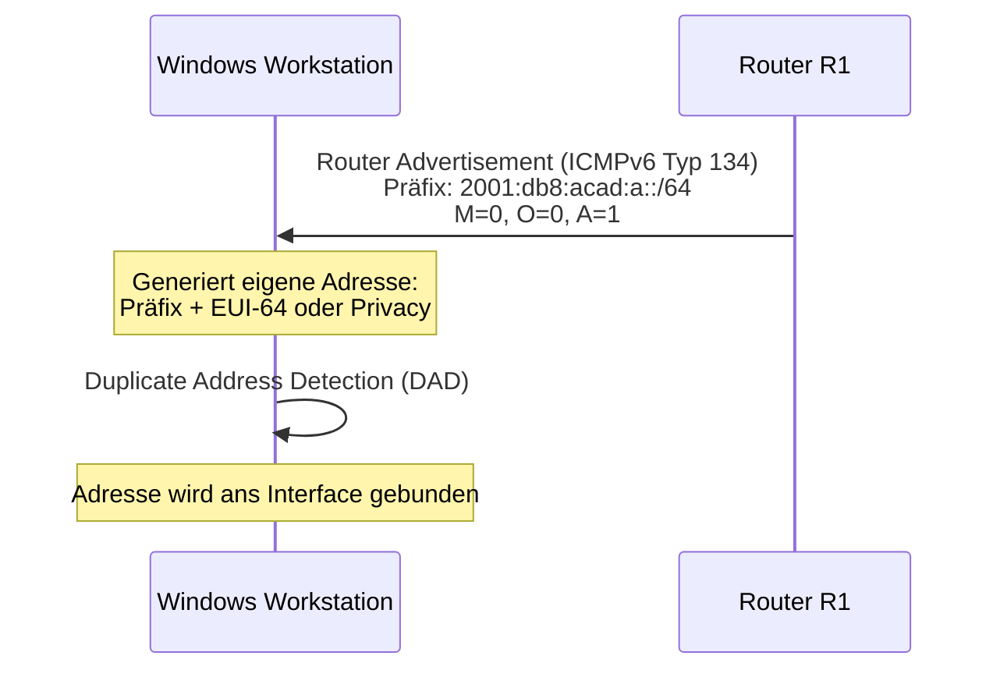
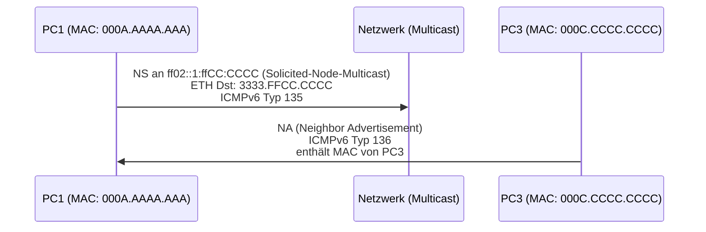
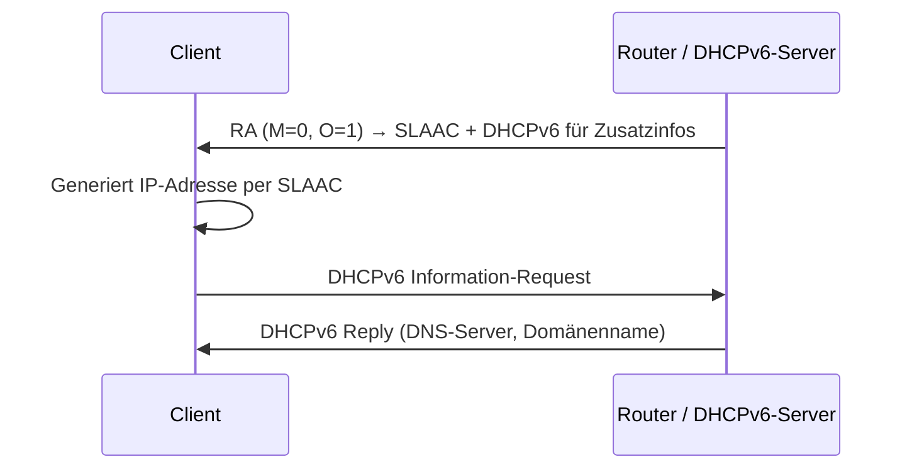
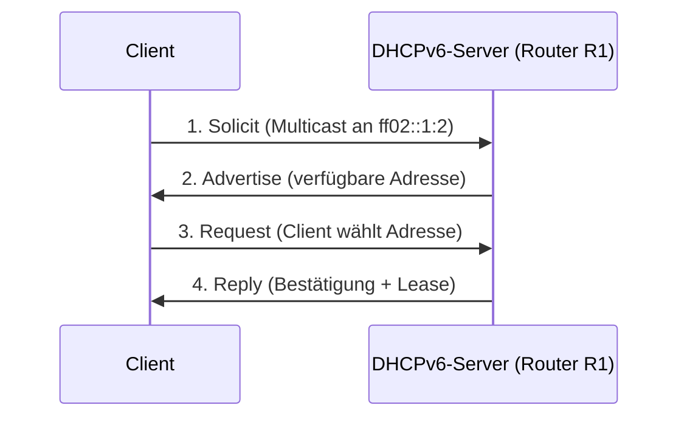
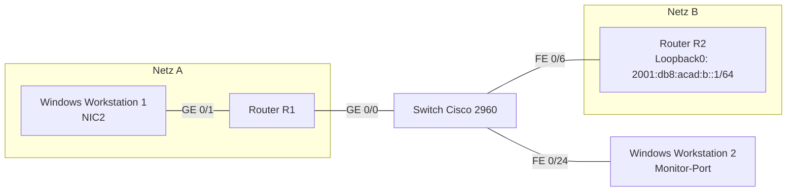
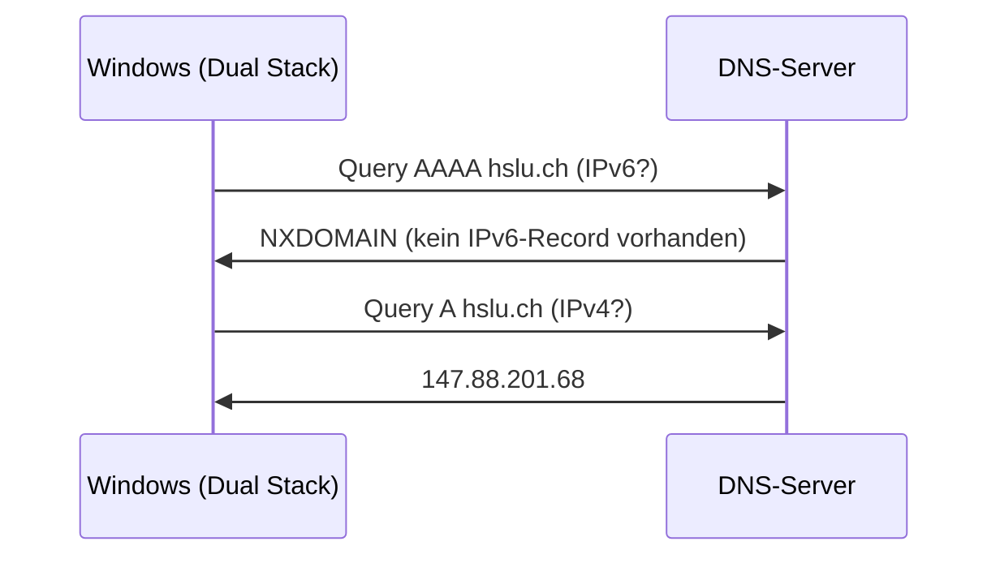
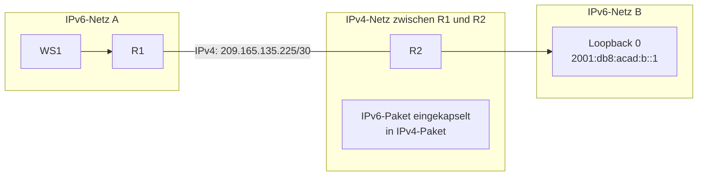
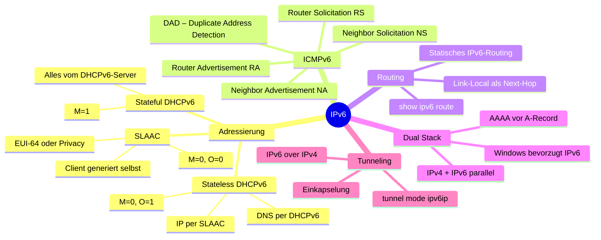

## Überblick

IPv6 (Internet Protocol Version 6) wurde von der IETF seit 1998 standardisiert und löst IPv4 schrittweise ab. Der wichtigste Treiber ist die Erschöpfung des IPv4-Adressraums. IPv6 verwendet 128-Bit-Adressen (statt 32 Bit bei IPv4), was einen schier unerschöpflichen Adressraum ergibt.

Dieses Dokument behandelt drei grosse Themenbereiche:

1. **Automatische IPv6-Adresskonfiguration** (SLAAC, Stateless DHCPv6, Stateful DHCPv6)
2. **IPv6-Routing** zwischen eigenständigen Netzen sowie Dual Stack
3. **IPv6-over-IPv4-Tunneling**

---

## Teil 1: IPv6-Adressierung – Automatische Konfiguration

### Warum automatische Adresskonfiguration?

In IPv4 war DHCP der Standard für die automatische Adressvergabe. IPv6 führt neue, elegantere Mechanismen ein. Hosts können sich in IPv6 selbstständig eine gültige globale Adresse konfigurieren – ohne zwingend einen DHCP-Server zu benötigen. Das ermöglicht eine sehr einfache Inbetriebnahme von Geräten in einem IPv6-Netzwerk.

Die Wahl des Konfigurationsverfahrens wird durch Flags in den sogenannten **Router Advertisement (RA)**-Nachrichten gesteuert, die der Router periodisch ins Netz sendet (Teil des ICMPv6-Protokolls).

---

### Die drei Verfahren im Vergleich

| Verfahren | M-Flag | O-Flag | IP-Adresse kommt von | Zusatzinfos (DNS etc.) kommen von |
|---|---|---|---|---|
| SLAAC | 0 | 0 | Client selbst (aus RA-Präfix) | – |
| Stateless DHCPv6 | 0 | 1 | Client selbst (SLAAC) | DHCPv6-Server |
| Stateful DHCPv6 | 1 | * | DHCPv6-Server | DHCPv6-Server |

---

### 1.1 SLAAC – Stateless Address Autoconfiguration

SLAAC ist der einfachste Mechanismus: Der Router sendet periodisch **Router Advertisement**-Nachrichten (ICMPv6 Typ 134), die den **Netzwerkpräfix** enthalten. Der Client konstruiert daraus seine vollständige IPv6-Adresse selbst, indem er den Präfix mit einem selbstgenerierten Interface-Identifier (z. B. aus der MAC-Adresse nach EUI-64 oder per Privacy Extensions zufällig) kombiniert.

**Ablauf:**



**Flags im RA für SLAAC:**
- `M = 0` → Managed Address Configuration: **nicht** gesetzt → kein DHCPv6 für die IP-Adresse
- `O = 0` → Other Configuration: **nicht** gesetzt → kein DHCPv6 für Zusatzinfos
- Im Prefix Information Option: `A = 1` → Autonomous address-configuration flag gesetzt → SLAAC aktiv

**Cisco-Konfiguration für SLAAC:**
```
R1(config)# ipv6 unicast-routing
R1(config)# interface gig0/1
R1(config-if)# ipv6 address 2001:db8:acad:a::1/64
R1(config-if)# ipv6 address fe80::1 link-local
R1(config-if)# no shutdown
```

---

### 1.2 Duplicate Address Detection (DAD)

Bevor ein Host eine per SLAAC generierte Adresse nutzen darf, muss er sicherstellen, dass diese Adresse im lokalen Netz noch nicht existiert. Dieses Verfahren heisst **Duplicate Address Detection (DAD)**.

**Ablauf:**
1. Der Host sendet eine **Neighbor Solicitation** (NS, ICMPv6 Typ 135) an die Solicited-Node-Multicast-Adresse der zu prüfenden Adresse.
2. Falls ein anderer Host diese Adresse bereits nutzt, antwortet er mit einem **Neighbor Advertisement** (NA, ICMPv6 Typ 136).
3. Kommt keine Antwort → Adresse ist eindeutig → wird ans Interface gebunden.

DAD ist also ein Sicherheitsmechanismus gegen Adresskollisionen bei der automatischen Adressgenerierung.

---

### 1.3 Neighbor Solicitation und Neighbor Discovery

IPv6 kennt **kein ARP** (Address Resolution Protocol). Die Auflösung von IPv6-Adressen auf MAC-Adressen erfolgt über **Neighbor Solicitation / Neighbor Advertisement** (Teil des Neighbor Discovery Protocol, NDP).

**Neighbor Solicitation (NS) – Ablauf:**



**Warum Multicast statt Broadcast?**  
In IPv4 sendet ARP an die Broadcast-Adresse (alle Hosts im Netz empfangen das Paket). IPv6 nutzt stattdessen gezielt eine **Solicited-Node-Multicast-Adresse** (`FF02::1:FF` + letzte 24 Bit der Zieladresse). Das reduziert den unnötigen Traffic erheblich, da nur Hosts mit passender Adresse das Paket verarbeiten müssen.

**Router Solicitation (RS):**  
Wenn ein Knoten am Netz angeschlossen wird, sendet er eine **Router Solicitation** (Typ 133) an `FF02::2` (alle Router). Damit fordert er Router auf, sofort ein Router Advertisement zu senden – statt auf den nächsten regulären Sendezeitpunkt zu warten (Cisco: standardmässig alle 200 Sekunden).

---

### 1.4 Stateless DHCPv6

Bei Stateless DHCPv6 konfiguriert der Client seine IP-Adresse weiterhin per SLAAC selbst. Zusätzlich bezieht er aber **Zusatzinformationen** (DNS-Server, Domänenname etc.) von einem DHCPv6-Server.

**Erkennungszeichen im Router Advertisement:**
- `M = 0` → IP-Adresse nicht vom DHCP-Server
- `O = 1` → Andere Konfigurationsinfos (DNS etc.) per DHCPv6

**Cisco-Konfiguration:**
```
R1(config)# ipv6 dhcp pool ipv6dhcppool
R1(config-dhcpv6)# domain-name introlab-statelessDHCPv6.ch
R1(config-dhcpv6)# dns-server 2001:4860:4860::8888
R1(config-dhcpv6)# exit

R1(config)# interface gig0/1
R1(config-if)# ipv6 dhcp server ipv6dhcppool
R1(config-if)# ipv6 nd other-config-flag
```

> **Hinweis:** `2001:4860:4860::8888` ist der Google Public DNS-Server (IPv6-Äquivalent zu `8.8.8.8`).

**Ablauf Stateless DHCPv6:**



---

### 1.5 Stateful DHCPv6

Bei Stateful DHCPv6 übernimmt der DHCPv6-Server die vollständige Kontrolle über die Adressvergabe – analog zu DHCP in IPv4. Der Server vergibt sowohl die IPv6-Adresse als auch alle Zusatzinformationen.

**Erkennungszeichen im RA:**
- `M = 1` → Managed Address Configuration: IP-Adresse vom DHCP-Server

**Cisco-Konfiguration:**
```
R1(config)# ipv6 dhcp pool ipv6dhcppool
R1(config-dhcpv6)# address prefix 2001:db8:acad:a::/64
R1(config-dhcpv6)# domain-name introlab-statefulDHCPv6.ch
R1(config-dhcpv6)# exit

R1(config)# interface gig0/1
R1(config-if)# ipv6 nd managed-config-flag
```

**DHCPv6-Ablauf (vier Schritte):**



**Verifikation auf dem Router:**
```
R1# show ipv6 dhcp pool
```

---

### 1.6 IPv6 Zone-IDs (%...)

Eine Besonderheit bei **Link-Local-Adressen** (`fe80::/10`): Sie sind nur innerhalb eines direkt angeschlossenen Netzsegments gültig und werden nie geroutet. Auf einem Gerät mit mehreren Netzwerkschnittstellen können mehrere Link-Local-Adressen existieren – alle mit dem gleichen Präfix `fe80::/64`.

Das Problem: Woher weiss das Betriebssystem, über welche Schnittstelle ein Paket an eine Link-Local-Adresse gesendet werden soll?

**Lösung: Zone-ID (Schnittstellen-Index)**  
Die Zone-ID wird als Suffix zur Link-Local-Adresse angehängt:
- Windows: `fe80::1%13` (13 = Interface-Index)
- Linux: `fe80::1%eth0` (Schnittstellenname)
- macOS: `fe80::1%en0`

Die Zone-ID hat **nur lokale Bedeutung** – sie wird nicht in den Netzwerkverkehr eingebettet und für andere Hosts nicht sichtbar.

**Nützliche Praxis:** Auf Cisco-Routern kann man `fe80::1` als Link-Local-Adresse auf **jeder** Schnittstelle konfigurieren. Da diese Adresse nie geroutet wird, ist sie in jedem Segment eindeutig und kann als einheitliches Default-Gateway für alle angeschlossenen LANs dienen – was die manuelle Konfiguration stark vereinfacht.

---

### 1.7 Prefix Information – L- und A-Flag

Im Router Advertisement enthält die **Prefix Information Option** zwei wichtige Flags:

- **A-Flag (Autonomous address-configuration):** Gibt an, ob der im RA enthaltene Präfix für SLAAC genutzt werden soll (`A=1`) oder nicht (`A=0`).
- **L-Flag (On-link flag):** Gibt an, ob Geräte mit diesem Präfix direkt erreichbar sind (im gleichen Segment) oder ob die Kommunikation stets über den Router laufen muss. Bei `L=0` (z. B. in WLAN-AP-Netzen oder aus Sicherheitsgründen) verhindert man, dass Clients versuchen, direkt per Link-Local miteinander zu kommunizieren.

---

## Teil 2: IPv6-Netzwerk – Routing, Dual Stack und Tunneling

### 2.1 Topologie

Im zweiten Teil wird die Topologie erweitert: Zwei Router (R1, R2) verbinden zwei eigenständige IPv6-Netzwerke. Ein Switch dient als Monitor-Port für die Wireshark-Analyse.



**Netzwerkadressen:**
- Netz A: `2001:db8:acad:a::/64` (zwischen WS1 und R1)
- Netz B: `2001:db8:acad:b::/64` (Loopback auf R2)
- Verbindung R1–R2: Link-Local `fe80::1` (R1) und `fe80::2` (R2)

---

### 2.2 Statisches IPv6-Routing

IPv6 unterstützt sowohl statisches als auch dynamisches Routing (OSPFv3, EIGRP for IPv6 etc.). In diesem Labor wird statisches Routing konfiguriert.

**Konfiguration R1:**
```
R1(config)# interface gig0/0
R1(config-if)# ipv6 address fe80::1 link-local
R1(config-if)# no shutdown

R1(config)# ipv6 route 2001:db8:acad:b::/64 gigabitethernet0/0 fe80::2
```

**Konfiguration R2:**
```
R2(config)# ipv6 unicast-routing
R2(config)# interface gig0/0
R2(config-if)# ipv6 address fe80::2 link-local
R2(config-if)# no shutdown

R2(config)# interface loopback 0
R2(config-if)# ipv6 address 2001:db8:acad:b::1/64

R2(config)# ipv6 route 2001:db8:acad:a::/64 gigabitethernet0/0 fe80::1
```

**Route auf der Windows-Workstation:**
```cmd
route add 2001:db8:acad:b::/64 2001:db8:acad:a::1
```

> **Hinweis:** Der Befehl `route add` muss als Administrator ausgeführt werden.

**Doppelte Link-Local-Adresse auf R1?**  
`fe80::1` ist auf beiden Interfaces von R1 konfiguriert. Das ist korrekt, weil Link-Local-Adressen **nie geroutet** werden und nur innerhalb des jeweiligen lokalen Segments gelten. Beide Interfaces befinden sich in verschiedenen Netzsegmenten, daher gibt es keinen Konflikt.

**Routen überprüfen:**
```
R1# show ipv6 route
R2# show ipv6 route
```

---

### 2.3 Dual Stack – Parallelbetrieb von IPv4 und IPv6

**Dual Stack** bezeichnet die gleichzeitige Nutzung von IPv4 und IPv6 auf denselben Netzwerkgeräten. Ein Gerät hat dabei sowohl eine IPv4- als auch eine IPv6-Adresse und kann mit beiden Protokollen kommunizieren.

**Windows bevorzugt IPv6:** Gemäss RFC 3484 fragen Dual-Stack-Implementierungen bei der DNS-Auflösung **zuerst nach dem AAAA-Record** (IPv6) und fallen bei Nichtexistenz auf den A-Record (IPv4) zurück.

**Beispiel – DNS-Anfrage für hslu.ch:**


**Beispiel – DNS-Anfrage für dns.google:**
- IPv4 (`A`): `8.8.8.8`, `8.8.4.4`
- IPv6 (`AAAA`): `2001:4860:4860::8888`, `2001:4860:4860::8844`

Da Google IPv6 unterstützt, liefert die AAAA-Anfrage eine Antwort. Windows würde dann standardmässig über IPv6 kommunizieren.

**Nützliche Befehle (Windows):**
```cmd
nslookup hslu.ch
nslookup -type=AAAA dns.google.
nslookup -type=A dns.google.
```

---

### 2.4 IPv6 over IPv4-Tunnel

**Problem:** Es gibt viele IPv4-only-Netzwerke (z. B. das «alte» Internet), die kein IPv6 können. Trotzdem sollen zwei IPv6-Standorte miteinander kommunizieren können.

**Lösung: Tunneling** – IPv6-Pakete werden in IPv4-Pakete eingekapselt (encapsulated) und so durch das IPv4-Netz transportiert.



**Tunnel-Konfiguration auf R1:**
```
R1(config)# interface gig0/0
R1(config-if)# ip address 209.165.135.225 255.255.255.252

R1(config)# interface tunnel 0
R1(config-if)# tunnel source gigabitEthernet0/0
R1(config-if)# tunnel destination 209.165.135.226
R1(config-if)# tunnel mode ipv6ip
R1(config-if)# ipv6 address 2001:db8:acad:c::1/64

R1(config)# ipv6 route 2001:db8:acad:b::/64 tunnel 0
```

**Tunnel-Konfiguration auf R2:**
```
R2(config)# interface gig0/0
R2(config-if)# ip address 209.165.135.226 255.255.255.252

R2(config)# interface tunnel 0
R2(config-if)# tunnel source gigabitEthernet0/0
R2(config-if)# tunnel destination 209.165.135.225
R2(config-if)# tunnel mode ipv6ip
R2(config-if)# ipv6 address 2001:db8:acad:c::2/64

R2(config)# ipv6 route 2001:db8:acad:a::/64 tunnel 0
```

**Was sieht man in Wireshark?**  
Die Pakete sind **verschachtelt**: Das äussere Paket ist ein normales IPv4-Paket (mit den Adressen `209.165.135.225` ↔ `209.165.135.226`). Darin eingekapselt befindet sich ein vollständiges IPv6-Paket mit dem eigentlichen ICMPv6-Ping. Das ist das Tunneling-Prinzip: Das IPv4-Netz «sieht» nur IPv4-Pakete und leitet sie wie gewohnt weiter.

---

### 2.5 Switch-Monitor-Port (SPAN)

Um den Netzwerkverkehr mit Wireshark analysieren zu können, ohne direkt an einem der Endpunkte zu sitzen, wird am Switch ein **Monitor-Port (SPAN = Switched Port Analyzer)** konfiguriert. Dieser kopiert den gesamten Traffic eines VLANs auf einen dedizierten Port.

```
Switch(config)# monitor session 1 source vlan 1 both
Switch(config)# monitor session 1 destination interface fastEthernet 0/24
```

Eine Workstation, die an `FE 0/24` angeschlossen ist, empfängt damit eine Kopie des gesamten Netzwerkverkehrs und kann diesen mit Wireshark analysieren – ohne aktiv in das Netz einzugreifen.

---

## Zusammenfassung



| Thema | Kernaussage |
|---|---|
| SLAAC | Client konfiguriert sich selbst aus RA-Präfix; kein DHCP nötig |
| Stateless DHCPv6 | IP per SLAAC, Zusatzinfos per DHCPv6 (O-Flag=1) |
| Stateful DHCPv6 | Vollständige Adressvergabe durch DHCPv6-Server (M-Flag=1) |
| NDP / Neighbor Solicitation | IPv6-Ersatz für ARP; nutzt Solicited-Node-Multicast |
| DAD | Prüft vor Nutzung einer Adresse auf Eindeutigkeit im Segment |
| Zone-ID | Disambiguiert Link-Local-Adressen bei mehreren Interfaces |
| Dual Stack | Parallelbetrieb IPv4/IPv6; Windows bevorzugt IPv6 |
| IPv6-over-IPv4-Tunnel | IPv6-Pakete in IPv4 eingekapselt für Transitnetze |
