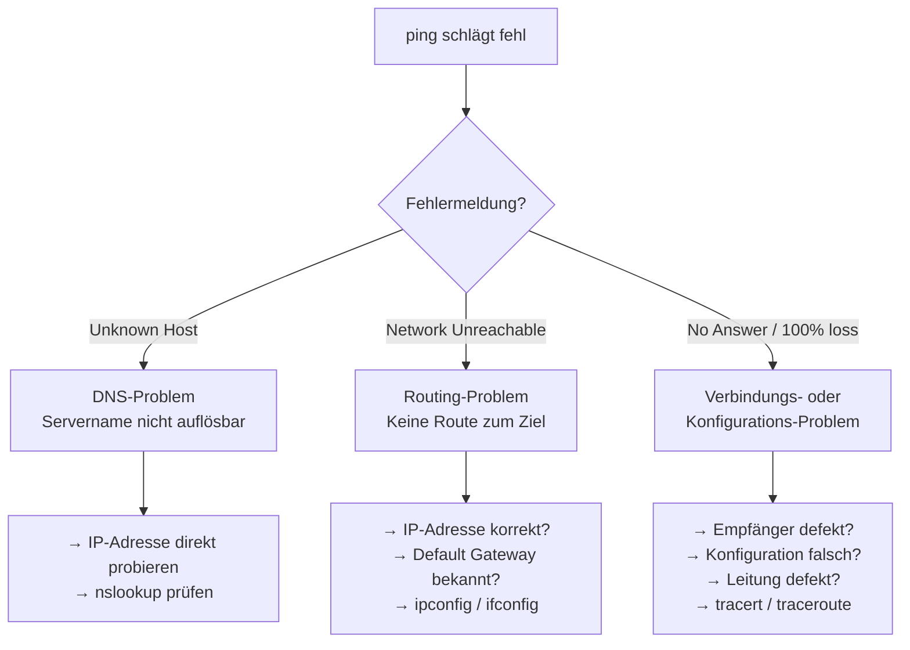
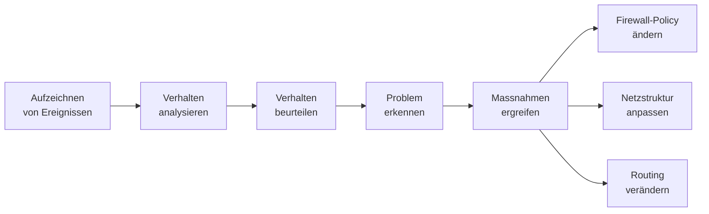
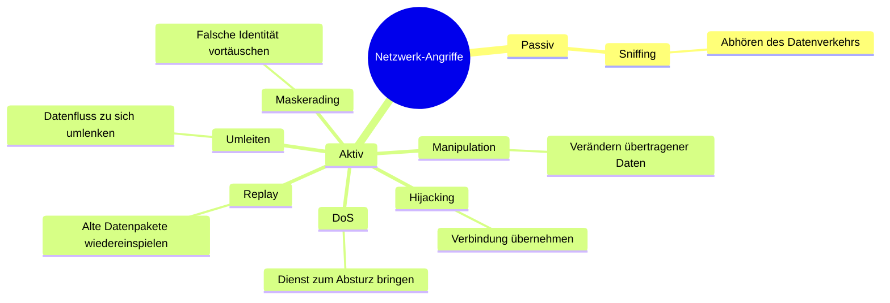
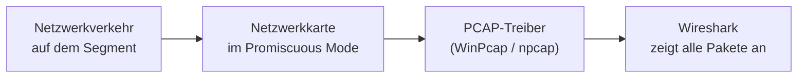
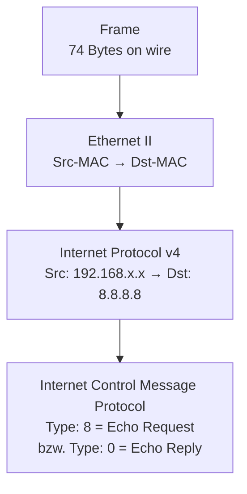
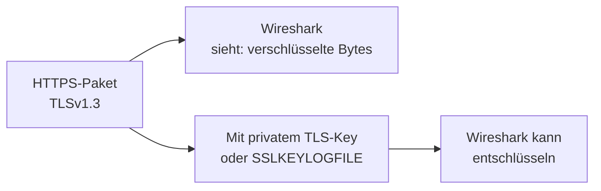
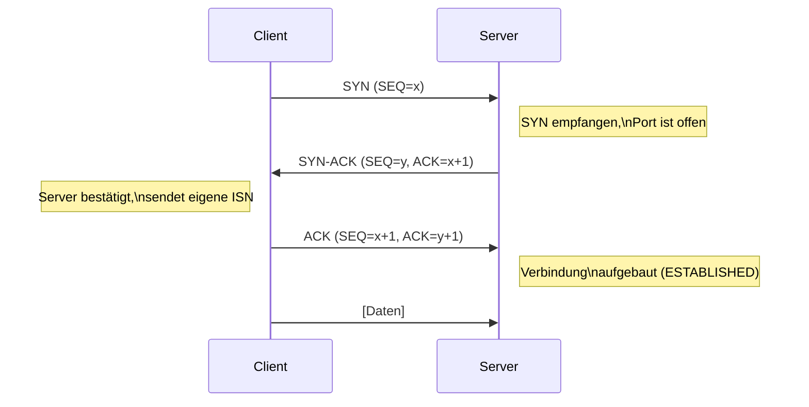
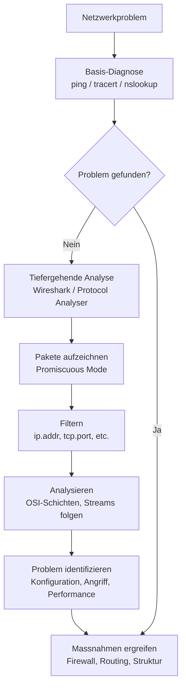

Bevor man professionelle Analyse-Tools einsetzt, ist `ping` das einfachste und wichtigste Diagnosewerkzeug. `ping` sendet eine **ICMP Echo Request**-Nachricht direkt über IP – also ohne TCP – an einen Zielhost und wartet auf eine Antwort (ICMP Echo Reply). Anhand der Rückmeldung lässt sich die Fehlerursache eingrenzen.

### Typische Fehlermeldungen und ihre Bedeutung



| Fehlermeldung | Bedeutung | Abhilfe |
|---|---|---|
| `Unknown Host` | DNS kann Hostname nicht auflösen | `nslookup` testen; direkte IP versuchen |
| `Network Unreachable` | Kein Routing-Pfad zum Ziel | Default Gateway mit `ipconfig`/`ifconfig` prüfen |
| `No Answer / 100% packet loss` | Ziel antwortet nicht | `tracert`/`traceroute` für Pfadanalyse nutzen |

> **Warum ICMP ohne TCP?** ICMP arbeitet direkt auf der IP-Schicht (Schicht 3). Das bedeutet: Wenn `ping` scheitert, liegt das Problem definitiv unterhalb der Transportschicht – also in der Netzwerk-, Sicherungs- oder physischen Schicht. TCP-basierte Probleme (z. B. Firewall blockiert Port) werden damit gezielt ausgeschlossen.

---

## 2. Netzwerk- und Protokollanalyse: Wozu braucht man das?

Netzwerkanalyse ist mehr als nur Fehlersuche. Sie umfasst einen systematischen Prozess:



Typische Anwendungsfälle der Protokollanalyse sind das Nachvollziehen von Fehlverhalten oder Angriffen, die Optimierung der Netzwerkperformance, die Überprüfung von Sicherheitsrichtlinien und die forensische Analyse nach einem Sicherheitsvorfall.

---

## 3. Angriffsflächen des Netzwerkes

Ein Netzwerk ist kein isoliertes System – es ist per Definition offen für Kommunikation, und genau das macht es angreifbar. Man unterscheidet mehrere Klassen von Angriffen:

### Passiv vs. Aktiv



### Erklärung der einzelnen Angriffe

**Sniffing** ist das passive Mithören des Netzwerkverkehrs. Da Netzwerkkarten im sogenannten *Promiscuous Mode* alle Pakete empfangen können – nicht nur die an sie adressierten – kann ein Angreifer mit Zugang zum physischen oder logischen Netzwerk den gesamten Traffic mitlesen. Unverschlüsselte Protokolle (HTTP, FTP, Telnet) sind besonders gefährdet.

**Manipulation** bedeutet das aktive Verändern von Datenpaketen auf dem Übertragungsweg, z. B. im Rahmen eines Man-in-the-Middle-Angriffs.

**Maskerading** bezeichnet das Vortäuschen einer falschen Identität – etwa durch IP-Spoofing (gefälschte Quell-IP) oder ARP-Spoofing (gefälschte MAC-Adresse).

**Replay-Angriff**: Aufgezeichnete legitime Pakete werden zu einem späteren Zeitpunkt nochmals eingespeist – z. B. um eine bereits authentifizierte Sitzung zu wiederholen.

**Umleiten**: Der Datenverkehr wird aktiv auf einen anderen Pfad gelenkt, damit er besser abgehört werden kann (z. B. durch ARP-Poisoning).

**Denial-of-Service (DoS)**: Ein System wird durch eine Flut von Anfragen überlastet, sodass es für legitime Benutzer nicht mehr erreichbar ist.

**Hijacking**: Eine bereits aufgebaute Verbindung wird durch den Angreifer übernommen – er schiebt sich in eine bestehende Session ein.

---

## 4. Protocol Analysers – Überblick der Tools

Für die Netzwerkanalyse gibt es eine breite Palette an Werkzeugen – von kostenlosen Open-Source-Lösungen bis hin zu teuren Profi-Hardware-Systemen.

### Software-Analyser (Auswahl)

| Tool | Besonderheit |
|---|---|
| **Wireshark** | Open Source, plattformübergreifend, Industriestandard |
| **Microsoft Netzwerk Monitor** | Windows-integriert |
| **Packetyzer** | Ethereal-Variante mit Paketgenerator |
| **WildPackets OmniPeek** | Professionell, früher EtherPeek + AiroPeek |
| **Netscout Sniffer Intelligence** | Enterprise-Klasse |
| **Colasoft CAPSA Suite** | Verschiedene Editionen (Enterprise, WiFi, Free) |
| **TamoSoft CommView** | Inkl. WiFi-Variante |
| **rumint** | Visuelle Analyse – Parameter auf 2 Achsen |

### Wireless-Analyser

Für WLAN-Analyse gibt es spezialisierte Tools wie **CommView WiFi**, das Kanalauslastung, Signalstärken, SSID-Übersichten und Paketstatistiken visualisiert. Ergänzt werden diese durch **PC-basierte Hardware** wie den Wi-Spy USB-Adapter (Metageek), der das Frequenzspektrum misst.

### Hardware-Analysatoren

Neben Software-Lösungen gibt es dedizierte Mess-Hardware:

- **Mobile Wireless-Analysatoren** (z. B. netAlly AirCheck G2): Für schnelle WLAN-Fehlersuche vor Ort
- **netAlly EtherScope nXG**: Android-basiertes Tablet für umfassende Netzwerkanalyse (Ping, iPerf, HTTP-Tests, AutoTest)
- **LanTEK IV-S**: Kabelmessgerät für Cu und Glasfaser – keine Paketaufzeichnung, aber Durchsatzmessung
- **Netscout OptiView XG**: Windows-basiertes Analyse-Tablet mit WLAN und mehreren LAN-Anschlüssen
- **Stationäre Analysatoren** (z. B. JDSU): Für dezentrale Erfassung, Last-Tests und Simulation in Rechenzentren

---

## 5. Wireshark im Detail

### Was ist Wireshark?

Wireshark ist der meistgenutzte Protocol Analyzer weltweit. Wichtige Eigenschaften:

- **Open Source**: kostenlos, privat und kommerziell einsetzbar
- **~1'000 Protokolle**: Wireshark kann nahezu alle bekannten Netzwerkprotokolle dekodieren
- **Plattformübergreifend**: Windows, Linux, macOS, Unix
- **Promiscuous Mode**: Die Netzwerkkarte nimmt alle Pakete an, nicht nur die eigenen (via PCAP-Treiber)
- **Download**: www.wireshark.org

### Wie funktioniert Sniffing via Promiscuous Mode?

Normalerweise verwirft eine Netzwerkkarte alle Pakete, die nicht an ihre MAC-Adresse adressiert sind. Im **Promiscuous Mode** werden alle Pakete entgegengenommen – auch die, die für andere Stationen bestimmt sind. Das ermöglicht das vollständige Aufzeichnen des gesamten Netzwerkverkehrs auf einem Segment.



### Benutzeroberfläche – drei Bereiche

Wireshark gliedert die Ansicht in drei Hauptbereiche:

1. **Paketliste** (oben): Jede Zeile ist ein aufgezeichnetes Paket mit Zeit, Quelle, Ziel, Protokoll und Info-Zusammenfassung
2. **Paketdetails** (Mitte): Baumstruktur aller Protokollschichten des ausgewählten Pakets (Ethernet → IP → TCP/UDP → Anwendungsprotokoll)
3. **Paket-Bytes** (unten): Rohdaten des Pakets in Hexadezimal und ASCII

---

## 6. OSI-Schichten in Wireshark verstehen

Wireshark dekodiert jedes Paket schichtweise. Am Beispiel eines `ping`-Befehls (`ping 8.8.8.8`):



Im Wireshark-Filter: `ip.addr == 8.8.8.8` zeigt nur Pakete an, die diese IP-Adresse als Quelle oder Ziel haben.

### Request und Reply unterscheiden

- **ICMP Type 8** = Echo Request (Ping gesendet)
- **ICMP Type 0** = Echo Reply (Pong empfangen)

Im Paketdetail sieht man beim Request: `Source: 192.168.x.x → Destination: 8.8.8.8`  
Beim Reply ist es umgekehrt: `Source: 8.8.8.8 → Destination: 192.168.x.x`

---

## 7. Praktische Wireshark-Funktionen

### 7.1 Filtern – das wichtigste Werkzeug

Filter sind in Wireshark entscheidend, da bei einer Live-Aufzeichnung schnell Tausende von Paketen anfallen. Es gibt zwei Filterarten:

- **Capture Filter**: Schränkt bereits beim Aufzeichnen ein (BPF-Syntax, z. B. `host 8.8.8.8`)
- **Display Filter**: Filtert die Anzeige nachträglich (Wireshark-eigene Syntax)

**Wichtige Display-Filter-Beispiele:**

```
ip.addr == 8.8.8.8              # Pakete von/zu 8.8.8.8
ip.addr == 192.0.2.1            # Spezifische IP
ip.addr != 192.0.2.1            # Alle ausser dieser IP
ip.dst == 192.0.2.1             # Nur Pakete an diese IP
tcp.port == 80                  # HTTP-Traffic
ip.addr == 192.0.2.1 and tcp.port not in {80, 25}   # Kombinierter Filter
tcp.stream eq 0                 # Erster TCP-Stream
```

Das logische `and` / `or` / `not` ermöglicht das Kombinieren mehrerer Bedingungen.

### 7.2 IP oder Namen anzeigen?

Wireshark kann IP-Adressen automatisch in Hostnamen auflösen. Das macht die Analyse lesbarer, verursacht aber DNS-Anfragen und kann die Aufzeichnung verfälschen. Einstellbar unter:  
**Einstellungen → Name Resolution → Resolve network (IP) addresses**

### 7.3 Stream folgen

Per Rechtsklick auf ein Paket → **Folgen → TCP Stream** (oder HTTP, TLS, etc.) zeigt den vollständigen Datenaustausch einer Verbindung im Klartext. Das ist besonders nützlich, um HTTP-Kommunikation zu lesen oder FTP-Übertragungen nachzuvollziehen.

### 7.4 Automatisches Zusammenfügen (Reassembly)

TCP überträgt grosse Datenmengen in mehreren Segmenten. Wireshark fügt diese automatisch zusammen (**Reassembly**) und zeigt z. B. eine vollständige HTTP-Antwort in einem Paket an, auch wenn sie physisch über mehrere Frames übertragen wurde.

Erkennbar im Paketdetail durch:  
`[2 Reassembled TCP Segments (1519 bytes): #120771(1300), #120772(219)]`

### 7.5 Automatisches Scrollen

Während einer Live-Aufzeichnung scrollt Wireshark standardmässig automatisch zur neuesten Zeile. Mit dem **Scroll-Button** in der Toolbar lässt sich dies ein- und ausschalten, um bereits erfasste Pakete zu untersuchen ohne abgelenkt zu werden.

### 7.6 Spalten anpassen

Unter **Einstellungen → Darstellung → Spalten** können eigene Spalten hinzugefügt werden, z. B. GeoIP-Informationen (`ip.geoip.dst_country`, `ip.geoip.dst_city`), die zeigen, aus welchem Land Pakete kommen.

---

## 8. Verschlüsselte Pakete in Wireshark

Ein wesentliche Einschränkung: **Verschlüsselter Traffic** (HTTPS/TLS, SSH, etc.) ist in Wireshark nur als unleserlicher Binärstrom sichtbar. Man kann zwar sehen, *dass* eine Verbindung besteht und wie viel Daten fliessen, aber nicht *was* übertragen wird.



> **Wichtig**: Das ist bewusst so – Verschlüsselung schützt die Nutzer auch vor Sniffing-Angriffen. Nur wenn man den privaten Schlüssel oder eine Key-Log-Datei besitzt, kann Wireshark TLS entschlüsseln.

---

## 9. TCP-Verbindungsaufbau (3-Way Handshake)

Im Labor wird auch der TCP-Verbindungsaufbau untersucht. Jede TCP-Verbindung beginnt mit einem **3-Way Handshake**:



| Schritt | Paket | Bedeutung |
|---|---|---|
| 1 | SYN | Client will Verbindung aufbauen |
| 2 | SYN-ACK | Server bestätigt und sendet eigene Sequenznummer |
| 3 | ACK | Client bestätigt – Verbindung ist aufgebaut |

**Warum zufällige Sequenznummern?** Die Initial Sequence Number (ISN) wird zufällig gewählt, um Sicherheitsrisiken zu minimieren. Ein Angreifer, der die ISN vorhersagen kann, könnte eine Verbindung kapern (Hijacking).

In Wireshark erkennbar als:
```
[SYN] Seq=0 Len=0 MSS=1460
[SYN, ACK] Seq=0 Ack=1 Win=5840
[ACK] Seq=1 Ack=1 Win=17520
```

---

## 10. Probleme beim Einsatz von Sniffern

### Windows ist «geschwätzig»

Windows-Systeme generieren selbst ohne Benutzeraktivität ständig Netzwerkverkehr: NetBIOS-Broadcasts, LLMNR-Anfragen, Windows Update-Checks, Telemetrie etc. Das erschwert die Analyse, weil dieser Hintergrund-Traffic die eigentlichen Messungen überlagert.

**Abhilfe**: IPv4/IPv6 auf dem Mess-System deaktivieren (über Netzwerkadapter-Eigenschaften). Die anderen Protokolle können ebenfalls ohne Konsequenzen für die Messung abgeschaltet werden.

### Platzierungsproblem bei Switches

Moderne Switches leiten Pakete nur an den Zielport weiter – ein angeschlossener Sniffer sieht damit nur seinen eigenen Traffic. Lösungen:

- **Port Mirroring / SPAN-Port**: Switch kopiert den Traffic eines oder mehrerer Ports auf einen dedizierten Monitoring-Port
- **Netzwerk-TAP**: Passives Hardware-Gerät, das den Datenfluss auf einer Leitung dupliziert

---

## 11. Weiterführende Ressourcen und Tipps

- **Captures von anderen analysieren**: www.packetlife.net/captures bietet vorgefertigte Capture-Dateien zum Üben
- **CloudShark**: Wireshark im Browser – praktisch, aber **niemals eigene Captures hochladen**, da diese Cloud-Daten öffentlich zugänglich sein können
- **Wireshark Filter Reference**: Vollständige Dokumentation aller Filtermöglichkeiten in der offiziellen Wireshark-Dokumentation

### Übungsaufgaben für das Labor

1. `ping 8.8.8.8` ausführen und in Wireshark mit `ip.addr == 8.8.8.8` verfolgen
2. HTTP-Aufruf `http://www.example.com` verfolgen – unverschlüsselte Inhalte lesen
3. HTTPS-Aufruf `https://www.example.com` verfolgen – Unterschied zu HTTP beobachten
4. Prüfen, ob das eigene System Meldungen an einen Wetterdienst schickt
5. Filter kombinieren: `ip.addr == X and tcp.port not in {80, 443}`
6. Nach Ziel-IP filtern: `ip.dst == X.X.X.X`

---

## Zusammenfassung



Netzwerkanalyse ist eine Kernkompetenz in der IT-Sicherheit und im Netzwerkbetrieb. Wireshark ist dabei das universelle Werkzeug, das sowohl für die alltägliche Fehlersuche als auch für die tiefgehende Sicherheitsanalyse eingesetzt werden kann. Entscheidend ist das Verständnis der **OSI-Schichten** – denn nur wer weiss, auf welcher Ebene ein Protokoll arbeitet, kann es auch korrekt interpretieren und gezielt filtern.

---

*Kursunterlagen: INTROL – Informatik, FS26, Hochschule Luzern*  
*10. März 2026*
