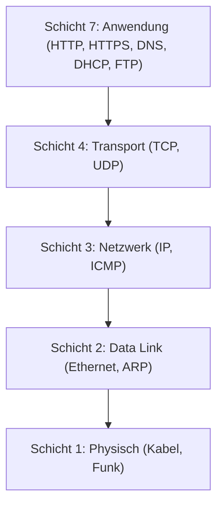
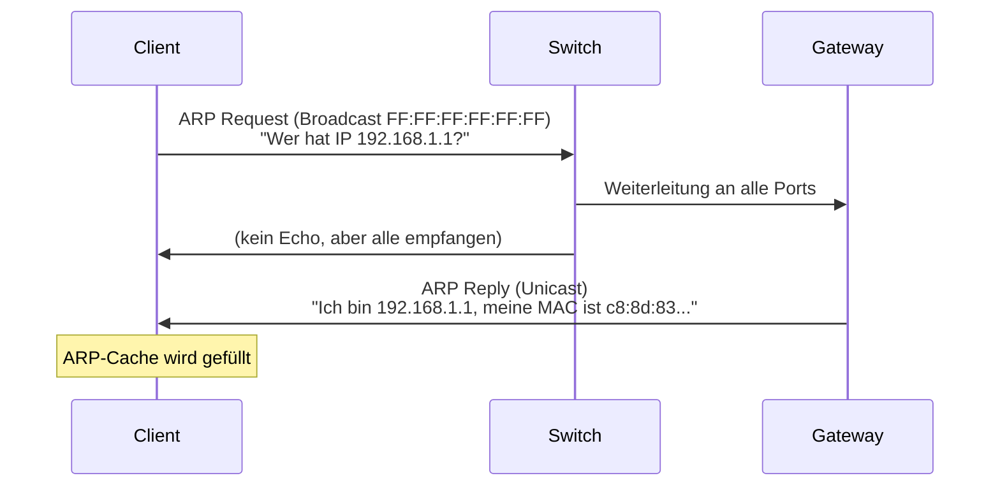
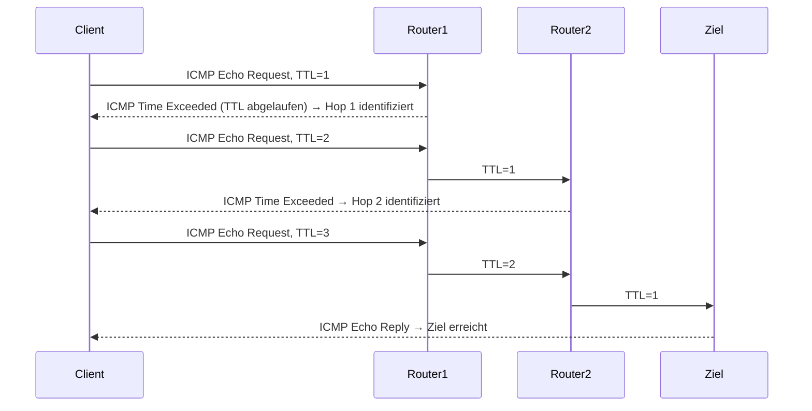
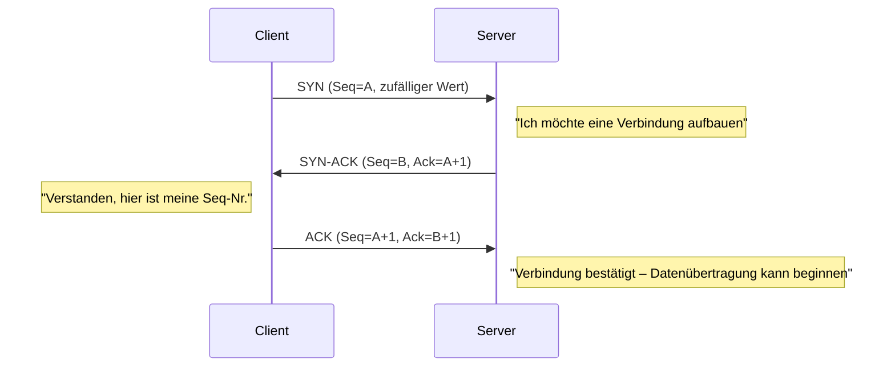
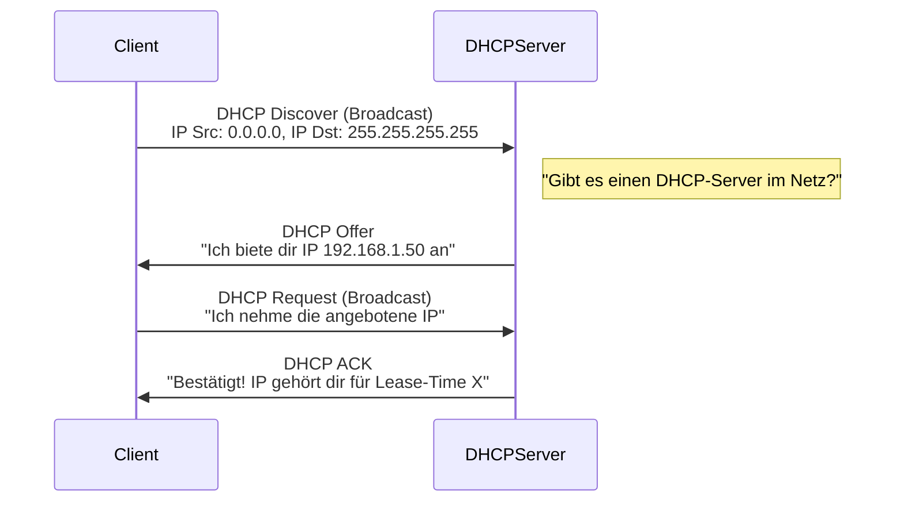
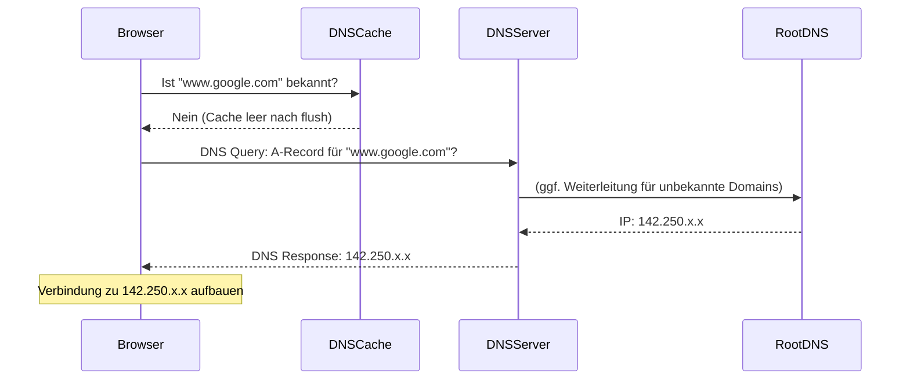
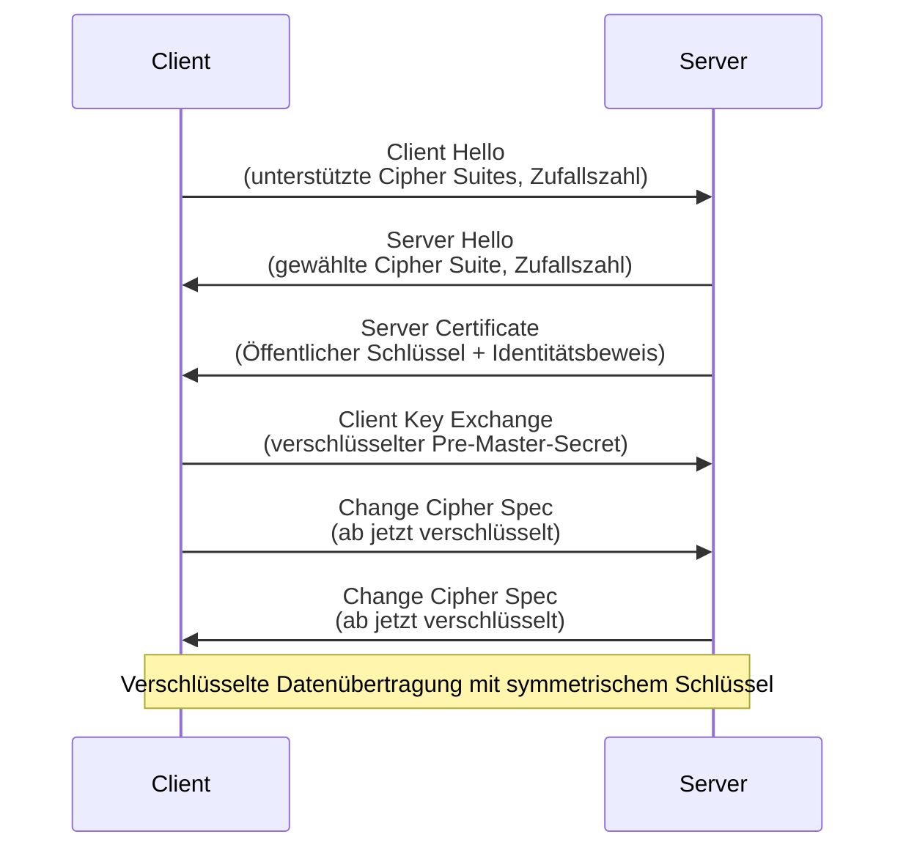
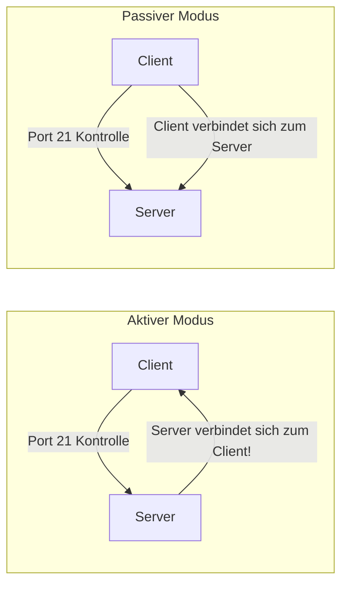
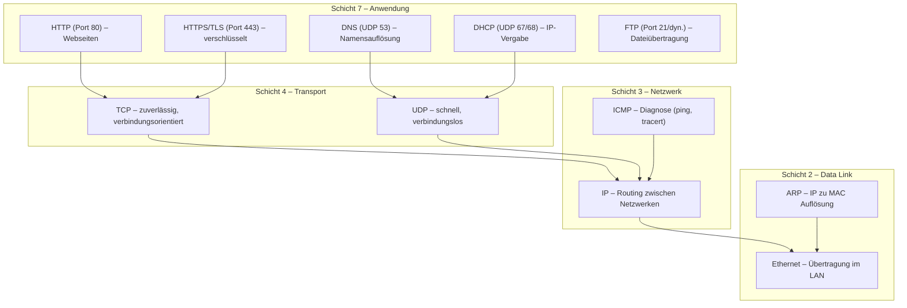

Dieses Dokument fasst die wesentlichen Inhalte des einführenden Sicherheitslabors (INTROL) zusammen. Im Fokus steht die praktische Analyse von Netzwerkprotokollen über alle relevanten OSI-Schichten hinweg – mit dem Tool **Wireshark** als zentralem Analysewerkzeug.

---

## OSI-Schichtenmodell – Überblick

Bevor wir in die einzelnen Protokolle einsteigen, ist es wichtig, das OSI-Schichtenmodell zu verstehen. Jedes Protokoll arbeitet auf einer bestimmten Schicht und nutzt die Dienste der darunterliegenden Schicht.



Jede Schicht kapselt die Daten der darüberliegenden Schicht ein (**Encapsulation**). Beim Empfang wird diese Kapselung Schritt für Schritt aufgelöst (**Decapsulation**). Das ist der Grund, warum man in Wireshark bei einem HTTP-Paket auch die TCP-, IP- und Ethernet-Header sieht.

---

## Schicht 2: Address Resolution Protocol (ARP)

### Was ist ARP und warum brauchen wir es?

Im lokalen Netzwerk (LAN) kommunizieren Geräte auf Ethernet-Ebene über **MAC-Adressen** (physische Adressen, 48 Bit, z.B. `c8:8d:83:95:02:a4`). Das Internet-Protokoll (IP) arbeitet jedoch mit **IP-Adressen**. Das Problem: Wenn ein PC ein IP-Paket an eine andere IP-Adresse im gleichen LAN senden will, muss er zuerst die zugehörige MAC-Adresse herausfinden. Genau das leistet **ARP (Address Resolution Protocol)**.

Ohne ARP wäre eine Kommunikation im lokalen Netzwerk nicht möglich – man kennt den Nachbarn zwar beim Namen (IP), aber nicht seine Hausnummer (MAC).

### Ablauf des ARP-Protokolls



**Schritt 1 – ARP Request (Broadcast):**
- Der sendende PC kennt die IP-Adresse des Ziels, aber nicht die MAC-Adresse.
- Er sendet einen **Broadcast** an `FF:FF:FF:FF:FF:FF` – das bedeutet, alle Geräte im LAN empfangen dieses Paket.
- Im ARP-Teil des Pakets steht die Ziel-MAC als `00:00:00:00:00:00` – ein Platzhalter, der anzeigt, dass diese Information gesucht wird.

**Schritt 2 – ARP Reply (Unicast):**
- Das Gerät, das die gesuchte IP besitzt, antwortet direkt (Unicast) mit seiner MAC-Adresse.
- Der anfragende PC speichert diese Information im **ARP-Cache** (Tabelle: IP ↔ MAC).

### Wichtige Konzepte

- **ARP-Cache**: Jeder PC hält eine lokale Tabelle, die IP-Adressen auf MAC-Adressen abbildet. Mit `arp -a` kann man diese einsehen. Der Cache hat eine begrenzte Lebensdauer (TTL), damit veraltete Einträge nicht für immer bleiben.
- **Broadcast-Domain**: ARP-Broadcasts bleiben im lokalen Subnetz – Router leiten sie nicht weiter. Das schützt andere Netze vor ARP-Fluten.
- **Sicherheitsrelevanz**: ARP ist ein vertrauensbasiertes Protokoll ohne Authentifizierung. Das ermöglicht **ARP-Spoofing**: Ein Angreifer kann falsche ARP-Replies senden und so den Datenverkehr umleiten (Man-in-the-Middle-Angriff).

---

## Schicht 3: ICMP – ping und tracert

### Was ist ICMP?

Das **Internet Control Message Protocol (ICMP)** ist ein Diagnose- und Steuerungsprotokoll auf Netzwerkschicht 3. Es ist direkt in das IP-Protokoll eingebettet (Protokollnummer 1 im IP-Header) und wird hauptsächlich für:
- Erreichbarkeitstests (`ping`)
- Routenverfolgung (`tracert`/`traceroute`)
- Fehlermeldungen (z.B. „Ziel nicht erreichbar")

### ping – Erreichbarkeit testen

`ping` sendet **ICMP Echo Requests (Type 8)** und erwartet **ICMP Echo Replies (Type 0)** zurück.

**Interessantes Detail – der Payload:**
Der Inhalt eines ICMP-Ping-Pakets hat keine funktionale Bedeutung, verrät aber das Betriebssystem:
- **Windows**: füllt den Payload mit dem Alphabet `abcdefghijklmnopqrstuvwabcdefghi` (32 Bytes)
- **Linux/macOS**: verwendet einen anderen Byte-String

IDS-Systeme (Intrusion Detection Systems) und Hacking-Tools nutzen diese Unterschiede, um **OS-Fingerprinting** zu betreiben.

**ICMP-Tunnel**: Da ICMP-Pakete oft durch Firewalls gelassen werden, können sie für verdeckte Kommunikationskanäle missbraucht werden (Daten im Ping-Payload verstecken).

### tracert/traceroute – Routenverfolgung

`tracert` nutzt einen cleveren Trick mit dem **TTL-Feld (Time to Live)** im IP-Header:



**Warum 3 Pakete pro Hop?** Um eine verlässlichere Messung der Antwortzeit zu erhalten, sendet `tracert` **3 ICMP-Pakete pro Hop** und gibt den Mittelwert (bzw. alle drei Zeiten) aus.

**TTL ist ein IP-Feld, kein ICMP-Feld!** Der TTL-Wert wird im IP-Header gesetzt, nicht im ICMP-Header. Jeder Router dekrementiert den TTL-Wert um 1. Bei TTL=0 wird das Paket verworfen und eine ICMP-Fehlermeldung zurückgeschickt. Ursprünglich war TTL als Zeitangabe (Sekunden) gedacht, heute wird es als Hop-Zähler verwendet.

---

## Schicht 4: TCP – Transmission Control Protocol

### Warum brauchen wir TCP?

IP (Schicht 3) kümmert sich um die Weiterleitung von Paketen zwischen Netzwerken. Es gibt aber keine Garantie, dass Pakete ankommen, in der richtigen Reihenfolge ankommen oder dass mehrere Anwendungen gleichzeitig kommunizieren können. Dafür ist **TCP (Transport Control Protocol)** zuständig.

TCP bietet:
1. **Port-Nummern** → Adressierung einzelner Anwendungen auf einem Host
2. **Sequenznummern** → Sicherstellung der richtigen Reihenfolge
3. **Bestätigungen (ACK)** → Zuverlässige Übertragung, Wiederholung verlorener Pakete
4. **Verbindungsaufbau/-abbau** → Geordnete Kommunikationssitzungen

### Der TCP Three-Way-Handshake

Bevor Daten übertragen werden, wird eine TCP-Verbindung mit einem **Three-Way-Handshake** aufgebaut:



**Warum Three-Way?** Ziel ist es, sicherzustellen, dass **beide Richtungen** der Verbindung funktionieren. Nach dem Handshake wissen beide Seiten, dass sie Pakete senden und empfangen können. (Interessant: Dies löst das verwandte Problem der „Zwei Armeen", allerdings nur in der Praxis – theoretisch ist es unlösbar.)

### Sequenz- und Acknowledgement-Nummern

- **Sequenznummer (Seq)**: Gibt an, bei welchem Byte in der Gesamtübertragung dieses Paket beginnt.
- **Bestätigungsnummer (Ack)**: Gibt an, welche Sequenznummer als nächstes erwartet wird (= alle vorherigen Bytes wurden empfangen).

Wireshark zeigt standardmässig **relative Sequenznummern** (beginnend bei 0) zur besseren Lesbarkeit. Die tatsächlichen Werte im Paket sind zufällig gewählt (Sicherheitsmassnahme gegen Angriffe).

### Port-Nummern

Port-Nummern (0–65535) adressieren Anwendungen auf einem Host:
- **Bekannte Ports (0–1023)**: Reserviert für Standard-Dienste (HTTP=80, HTTPS=443, FTP=21, DNS=53, SMTP=25)
- **Ephemere Ports (1024–65535)**: Temporäre Ports, die Clients für ausgehende Verbindungen nutzen

---

## Schicht 7: DHCP – Dynamic Host Configuration Protocol

### Wozu DHCP?

Jedes Gerät in einem IP-Netzwerk braucht eine IP-Adresse, eine Subnetzmaske, einen Default Gateway und einen DNS-Server. Diese manuell zuzuweisen wäre in grossen Netzwerken unpraktikabel. **DHCP** automatisiert diese Vergabe.

### Der DHCP-Ablauf (DORA)



**Warum Broadcast beim Discover?**
- Zu Beginn hat der Client noch keine IP-Adresse → IP-Quell-Adresse: `0.0.0.0` (Platzhalter)
- Der DHCP-Server ist nicht bekannt → IP-Ziel-Adresse: `255.255.255.255` (IP-Broadcast)
- Auf Ethernet-Ebene: MAC-Ziel: `FF:FF:FF:FF:FF:FF` (Ethernet-Broadcast)

**Unterschied zu ARP**: Bei ARP kennt man bereits die eigene IP und sucht eine MAC. Bei DHCP kennt man noch gar keine IP und sucht erst eine Zuweisung.

**DHCP überträgt viele Informationen:**
- Zugewiesene IP-Adresse
- Subnetzmaske
- Default Gateway (Router)
- DNS-Server
- Domain-Name
- Lease Time (wie lange die IP gültig ist)

**UDP-Ports**: DHCP-Server lauscht auf Port **67**, DHCP-Client nutzt Port **68**.

**BOOTP** ist der Vorläufer von DHCP und heute aus Rückwärtskompatibilitätsgründen noch im DHCP-Protokoll sichtbar. BOOTP hat eingeschränkten Funktionsumfang (statische Zuweisungen per MAC-Adresse, keine Lease-Times).

---

## Schicht 7: DNS – Domain Name System

### Das Telefonbuch des Internets

IP-Adressen sind schwer zu merken. DNS übersetzt menschenlesbare **Domain-Namen** (z.B. `www.hslu.ch`) in IP-Adressen (z.B. `147.88.10.20`). Ohne DNS müsste man alle IP-Adressen auswendig kennen.

DNS arbeitet zwar auf Schicht 7, ist aber eine Voraussetzung für Schicht-4-Kommunikation – ohne IP-Adresse können keine TCP/UDP-Verbindungen aufgebaut werden.

### DNS-Ablauf



**UDP-Port 53** ist für DNS reserviert. DNS nutzt standardmässig UDP (schnell, kein Verbindungsaufbau nötig für einfache Anfragen).

**PTR-Records (Reverse DNS):** Normalerweise sucht man eine IP zu einem Namen. Mit einem PTR-Record geht es umgekehrt: Man kennt eine IP und sucht den dazugehörigen Domain-Namen. Nützlich für Diagnose und Logging.

**DNS-Cache**: Um Anfragen zu reduzieren, speichert das Betriebssystem DNS-Antworten lokal. Mit `ipconfig /flushdns` kann dieser Cache geleert werden.

---

## Schicht 7: HTTP – Hypertext Transfer Protocol

### Das Protokoll des Web

HTTP ist ein zustandsloses, textbasiertes Protokoll auf Schicht 7. Es ist einfach und universell – der Grund, warum es die Grundlage des gesamten Web ist. HTTP baut auf einer TCP-Verbindung (Port 80) auf.

### HTTP GET-Request

Wenn man eine Webseite aufruft, sendet der Browser einen **GET-Request**:

```
GET / HTTP/1.1
Host: www.neverssl.com
Connection: keep-alive
User-Agent: Mozilla/5.0 ...
Accept: text/html,...
Accept-Encoding: gzip, deflate
Accept-Language: de-DE,...
```

Der Server antwortet mit einem **Status Code** und dem Inhalt:

```
HTTP/1.1 200 OK
Server: Apache/2.4.55
Content-Type: text/html
Content-Encoding: gzip
Last-Modified: ...

[HTML-Inhalt]
```

### Wichtige HTTP Status Codes

| Code | Bedeutung |
|------|-----------|
| 200 | OK – Anfrage erfolgreich |
| 301 | Moved Permanently – Ressource dauerhaft verschoben |
| 404 | Not Found – Ressource nicht gefunden |
| 500 | Internal Server Error |

### Sicherheitsproblem: HTTP ist unverschlüsselt!

Da HTTP Klartext überträgt, kann jeder Netzwerkteilnehmer (z.B. im gleichen WLAN) den gesamten Inhalt mitlesen – Passwörter, Formulardaten, Cookies. Deshalb wurde **HTTPS** eingeführt.

---

## Schicht 7: HTTPS / TLS – Verschlüsselte Übertragung

### TLS – Transport Layer Security

**HTTPS** ist HTTP über eine **TLS-Verbindung** (Transport Layer Security). TLS stellt sicher:
- **Vertraulichkeit**: Daten sind verschlüsselt
- **Integrität**: Daten wurden nicht manipuliert (MAC)
- **Authentizität**: Der Server ist wirklich der, für den er sich ausgibt (Zertifikate)

### Der TLS-Handshake



**Cipher Suites** definieren die verwendeten Algorithmen, z.B.:
- `TLS_AES_256_GCM_SHA384` (TLS 1.3)
- `TLS_ECDHE_RSA_WITH_AES_256_GCM_SHA384` (TLS 1.2)

Der Name einer Cipher Suite verrät:
1. **Schlüsselaustausch**: ECDHE (Elliptic Curve Diffie-Hellman Ephemeral) → Perfect Forward Secrecy
2. **Authentifizierung**: RSA
3. **Datenverschlüsselung**: AES-256-GCM
4. **Integrität**: SHA384

**In Wireshark ist HTTPS-Traffic verschlüsselt** – man sieht nur den TLS-Handshake, aber nicht den HTTP-Inhalt. Das ist genau der Punkt von HTTPS.

---

## Schicht 7: FTP – File Transfer Protocol

### Funktionsweise von FTP

FTP (RFC 959, 1985) ist ein Protokoll zur Dateiübertragung über IP-Netzwerke. Es ist unverschlüsselt (wie HTTP) – Benutzername, Passwort und Dateiinhalte werden im Klartext übertragen. Für sichere Übertragungen gibt es FTPS (FTP über TLS) oder SFTP (über SSH).

FTP nutzt **zwei separate TCP-Verbindungen**:
- **Kontrollverbindung** (Port 21): Steuerung, Befehle, Antwort-Codes
- **Datenverbindung** (dynamischer Port): Eigentliche Dateiübertragung

### Aktiver vs. Passiver Modus



**Aktiver Modus (PORT-Command):**
- Der Client teilt dem Server mit: „Verbinde dich auf meinem Port X für die Datenübertragung"
- Der Server baut die Datenverbindung **von aussen zum Client** auf
- **Problem**: Moderne Firewalls und NAT blockieren eingehende Verbindungen

**Passiver Modus (PASV-Command):**
- Der Server teilt dem Client mit: „Verbinde dich auf meinem Port Y für die Datenübertragung"
- Der Client baut die Verbindung **von innen nach aussen** auf
- **Lösung**: Firewalls erlauben ausgehende Verbindungen → funktioniert zuverlässiger

**Warum scheitert das Windows-FTP-Tool (`ftp.exe`)?**
Der eingebaute Windows-FTP-Client unterstützt den passiven Modus nicht. Er sendet einen PORT-Command (aktiver Modus), was der Server ablehnt (`500 Illegal PORT Command`). Zusätzlich würde eine aktive FTP-Verbindung durch die Firewall/NAT der HSLU blockiert. Lösung: Tools wie **WinSCP** verwenden, die den passiven Modus unterstützen.

### FTP-Antwort-Codes (Auswahl)

| Code | Bedeutung |
|------|-----------|
| 220 | Service bereit (Begrüssung) |
| 200 | Command OK |
| 331 | Benutzer OK, Passwort erforderlich |
| 230 | Login erfolgreich |
| 500 | Syntax-Fehler / Unbekannter Befehl |

---

## Wireshark – Wichtige Features

**Wireshark** ist das Standard-Tool für Netzwerkanalyse und Protokoll-Debugging.

### Nützliche Display-Filter

| Filter | Zweck |
|--------|-------|
| `arp` | Nur ARP-Traffic |
| `icmp` | Nur ICMP-Traffic |
| `tcp.port==80` | TCP-Traffic auf Port 80 (HTTP) |
| `http` | HTTP-Traffic |
| `tls` | TLS/HTTPS-Traffic |
| `dhcp` | DHCP-Traffic |
| `dns` | DNS-Traffic |
| `ftp` | FTP-Traffic |
| `tcp.flags.syn==1 && tcp.flags.ack==0` | Nur TCP SYN-Pakete |
| `frame.number in {20..23}` | Bestimmte Pakete nach Nummer |

### Statistics-Features

- **Flow Graph** (`Statistics → Flow Graph`): Visualisiert den Ablauf von TCP- oder ICMP-Verbindungen als Sequenzdiagramm – ideal zum Verstehen des Three-Way-Handshakes oder traceroute-Ablaufs.
- **I/O Graph**: Zeigt die Netzwerkauslastung (Pakete/s oder Mbit/s) über die Zeit.
- **Conversations**: Listet alle erkannten Verbindungen auf, sortiert nach Protokoll.
- **Expert Information** (`Analyze → Expert Information`): Hebt Auffälligkeiten hervor (farbkodiert von blau = normal bis rot = kritisch) – nützlich für schnelle Fehlerdiagnose.

### Kontextmenü-Tipp

Statt Filter manuell einzutippen: Rechtsklick auf ein Paketfeld → **„Als Filter anwenden → Ausgewählt"**. Wireshark generiert automatisch den korrekten Filter.

---

## Zusammenfassung: Protokoll-Übersicht



Jedes Protokoll löst ein spezifisches Problem in der Netzwerkkommunikation. Das Zusammenspiel aller Schichten ermöglicht erst das, was wir täglich als „das Internet" erleben: Man tippt `www.google.com` ein, DHCP hat die IP-Konfiguration geliefert, DNS löst den Namen auf, TCP baut eine Verbindung auf, TLS verschlüsselt sie, und HTTP überträgt den Inhalt – alles innerhalb von Millisekunden.
