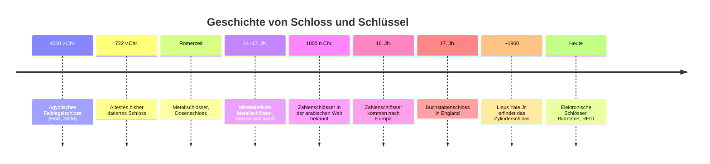
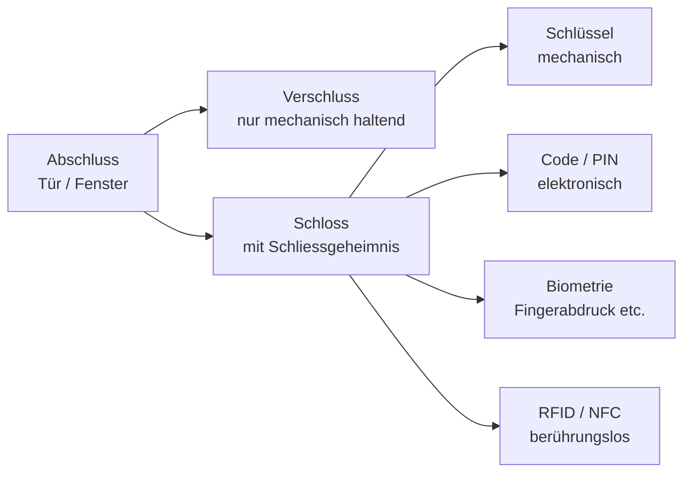
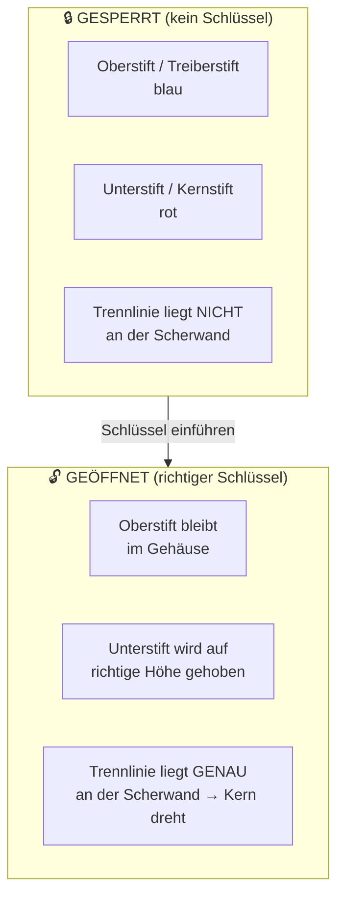
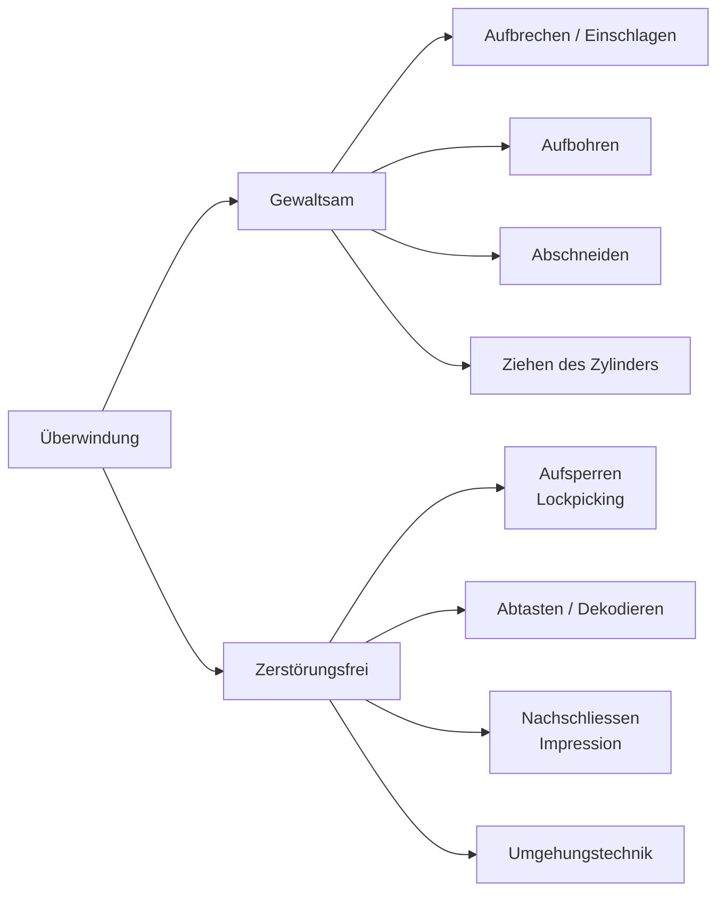
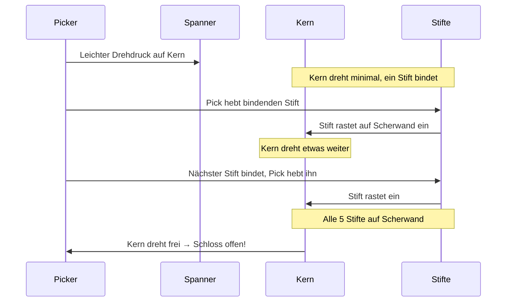
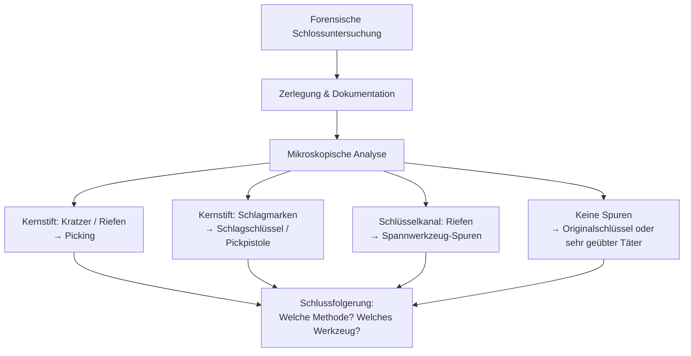
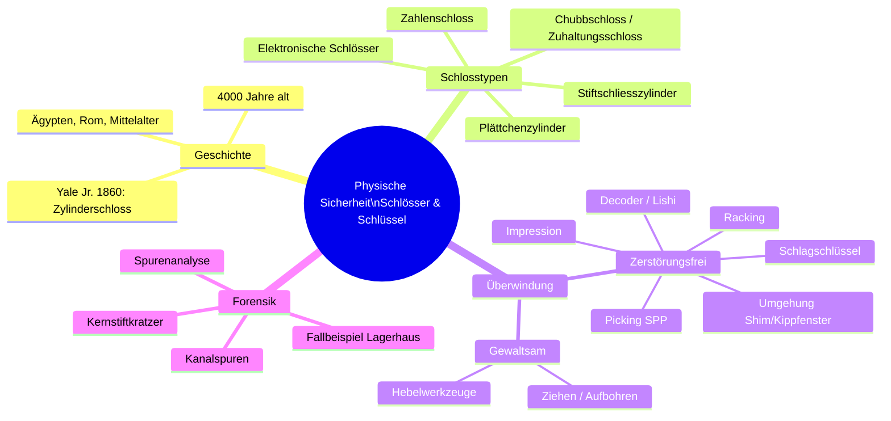

*Vortrag von Guido Enz, Forensisches Institut Zürich (FOR), gehalten an der Hochschule Luzern, 31.03.2026*

---

## 1. Das Forensische Institut Zürich (FOR)

Das FOR ist eine kantonale Fachbehörde, die forensische Dienstleistungen für Strafverfolgungsbehörden erbringt. Es gliedert sich in mehrere Fachbereiche:

- **Kriminaltechnik**: Daktyloskopie, Schusswaffen, Technische Formspuren, DNA-Triage, Mikro-/Biologische Spuren
- **Biometrie**: Erkennungsdienst, Sprache & Audio, Visuelle Personenidentifizierung, Handschriften, Dokumente, Bildforensik
- **Unfälle/Technik**: Unfallanalytik, Unfalluntersuchung, Elektrotechnik, Pyrotechnik
- **Zentrale Analytik**: Betäubungsmittel-/Brandanalytik, Explosivstoffanalytik
- **Wissenschaft**: Ausbildung, Zürcher Entschärfungsdienst

### Forensische Spurenarten (Beispiele aus der Praxis)

**Schuhspuren**: Der Vergleich einer am Tatort gesicherten Schuhspur mit einer Vergleichsspur vom Tatverdächtigen erlaubt Rückschlüsse auf den Schuhtyp und individuelle Abnutzungsmerkmale. Charakteristische Merkmale (z.B. Beschädigungen in der Sohle) werden markiert und gegenübergestellt.

**Werkzeugspuren**: Werkzeuge hinterlassen charakteristische Riefen und Kratzer. Unter dem Mikroskop lassen sich diese mit Vergleichsspuren eines sichergestellten Werkzeugs abgleichen – ähnlich einem Fingerabdruck für Werkzeuge. Das Bild zeigt mikroskopische Streifenspuren auf Metall bei 2000 µm Massstab.

**Reifenspuren / Messer**: Auch Schneidwerkzeuge hinterlassen typische Spuren. Das Beispiel zeigt, wie Spuren eines Messers mit Spuren auf einem Reifen verglichen werden können, um einen Zusammenhang herzustellen.

---

## 2. Geschichte von Schloss und Schlüssel

### 2.1 Die ältesten Schlösser

Das älteste bisher entdeckte Schloss wurde auf das Jahr **722 v. Chr.** datiert. Das **ägyptische Fallriegelschloss** ist jedoch noch älter – es wird auf ein Alter von ca. **4000 Jahren** geschätzt.

**Funktionsprinzip des ägyptischen Holzschlosses:**
- Ein grosser Holzschlüssel mit Stiften wird in das Schloss gesteckt
- Die Stifte des Schlüssels heben Fallstifte an, die einen Riegel blockiert haben
- Der Riegel lässt sich nun verschieben

Dieses Prinzip – Stifte in verschiedenen Höhen als Geheimnis – ist erstaunlicherweise noch heute in modernen Stiftschlössern erkennbar.

### 2.2 Das Römische Dosenschloss

Ein faszinierendes Exemplar ist das **Römische Dosenschloss** (*vicus Mamer, Luxemburg*). Es bestand aus einer zylindrischen Metallhülse mit einem komplexen Innenmechanismus. Computertomografische Scans (Fraunhofer-Institut) haben die Innenstruktur sichtbar gemacht, ohne das Objekt zu beschädigen – ein schönes Beispiel für die Anwendung moderner Technik auf historische Artefakte.

### 2.3 Mittelalter (14.–17. Jahrhundert)

Im Mittelalter wurden vorwiegend **metallene Schlösser** in vielen Formen und Varianten entwickelt. Die zugehörigen Schlüssel waren zumeist **gross und schwer** – und damit sehr unhandlich. Die Sicherheit lag damals weniger in der Komplexität des Mechanismus als in der physischen Robustheit.

### 2.4 Schlösser der Neuzeit – Linus Yale Junior

Vor ca. 160 Jahren revolutionierte **Linus Yale Junior** die Schlosstechnologie:

- Er konstruierte das erste **Zylinderschloss** auf Basis von Sperrstiften
- Dadurch gelang eine deutliche **Verkleinerung der Schlüssel**
- Diese Erfindung legte den Grundstein für das **moderne Zylinderschloss**, das heute weltweit dominiert

Der entscheidende Gedanke: Nicht mehr die Grösse des Schlüssels, sondern das **Muster der Stifte** (das «Schliessgeheimnis») bestimmt, ob ein Schloss geöffnet werden kann.

---

## 3. Schlüssellose Schlösser (Zahlenschlösser)

### 3.1 Geschichte

**Zahlenschlösser** (combination locks) sind seit etwa **1000 Jahren** in der arabischen Welt bekannt. Den Weg nach Europa fanden sie erst im **16. Jahrhundert**. In China existierten sie vermutlich noch früher. Das Kombinationsschloss erlebte im **17. Jahrhundert** in England als «Buchstabenschloss» eine Renaissance.

### 3.2 Mechanische Zahlenschlösser

Moderne mechanische Zahlenschlösser basieren auf **drehbaren Metallscheiben**, die je mit einer Einkerbung versehen sind. Das Prinzip:

1. Jede Scheibe kann durch Drehen in eine bestimmte Position gebracht werden
2. Sind alle Scheiben korrekt ausgerichtet, fluchten ihre Einkerbungen
3. Ein **Funktionsriegel** fällt in die ausgerichteten Kerben und entsperrt den Mechanismus

Typische Einsatzbereiche: Schulschränke, Fahrradschlösser, Tresore.

### 3.3 Nachteile klassischer Schlüssel

Obwohl mechanische Schlüssel weit verbreitet sind, haben sie erhebliche Sicherheitsprobleme:

| Problem | Erläuterung |
|---|---|
| **Schlüsselverlust** | Bei Verlust muss oft die gesamte Schliessanlage ausgewechselt werden |
| **Hohe Kosten** | Austausch einer ganzen Anlage ist teuer |
| **Weitergabe** | Schlüssel können unbemerkt weitergegeben werden |
| **Illegale Kopien** | Schlüssel lassen sich einfach kopieren – in Sekunden |
| **Kein Management** | Kein Überblick, wer wann Zugang hatte |

### 3.4 Elektronische Schlösser

Als Antwort auf diese Probleme wurden elektronische Schlösser entwickelt:

- **PIN-Code-Schlösser**: Zugangscode statt physischem Schlüssel
- **RFID**: Berührungslose Karten oder Chips
- **Smartphone-steuerbar**: Öffnung per App, auch aus der Ferne
- **Biometrische Schlösser**: Retina, Fingerabdruck, Stimmerkennung

**Vorteile elektronischer Schlösser:**
- Keine physischen Schlüssel (kein Verlustrisiko)
- Individualisierbar pro Benutzer
- Zutrittsprotokolle (wer, wann, wie oft)
- Zentrales Management bei vernetzten Systemen
- Verlorene «Schlüssel» können sofort gesperrt werden
- Teilweise fernsteuerbar

**Nachteile elektronischer Schlösser:**
- Benötigen Stromversorgung (Ausfall bei Batterieentleerung)
- Teurer als mechanische Schlösser
- Falls vernetzt: potenziell angreifbar (Cyberangriffe)

---

## 4. Mechanische Sicherungseinrichtungen – Grundlagen

### 4.1 Begriffsdefinitionen

Es ist wichtig, zwischen drei Begriffen zu unterscheiden:

**Verschluss**
> Ein Mechanismus, der zum Sperren einer Klappe, eines Deckels oder einer Tür gegen einen festen Rahmen dient. *Wichtig: Verschlüsse bieten **keine Sicherheit** gegen unbefugtes Öffnen!*

Beispiel: Eine einfache Schnappverriegelung ist ein Verschluss – sie hält die Tür zu, hindert aber niemanden am Öffnen.

**Schloss**
> Ein mechanisches System, in dem der Verschluss in Sperrlage gehalten wird und nur durch einen besonderen Mechanismus (Schliessmechanismus) betätigt werden kann. Zur Betätigung bedarf es eines **Trägers des Schliessgeheimnisses** – in der Regel eines Schlüssels.

Das Schlüsselwort ist «Schliessgeheimnis»: Das Schloss kennt nur *einen* gültigen Wert (Schlüsselprofil, Code, Fingerabdruck), der es öffnet.

### 4.2 Türschlösser – Das Einsteckschloss (Buntbartschloss)

Das klassische **Einsteckschloss** wird in die Türkante eingelassen. Es besteht aus:

- **Riegel**: Der ausfahrbare Bolzen, der die Tür in der Zarge hält
- **Zuhaltung**: Hält den Riegel in gesperrter Position; wird durch den Schlüssel angehoben
- **Haltefeder**: Drückt die Zuhaltung zurück in die Sperrposition

Beim Drehen des Schlüssels hebt der **Schlüsselbart** die Zuhaltungen an, bis sie freigegeben sind, und bewegt gleichzeitig den Riegel.

### 4.3 Das Chubbschloss / Zuhaltungsschloss

Das **Chubbschloss** (auch Detektionsschloss) ist eine Weiterentwicklung: Es hat mehrere Zuhaltungen und erkennt, wenn jemand versucht, es zu manipulieren – ein Sicherheitsstift blockiert das Schloss bei einem Öffnungsversuch mit falschem Schlüssel dauerhaft.

---

## 5. Der Schliesszylinder – Herzstück moderner Schlösser

### 5.1 Bauformen

| Typ | Beschreibung | Einsatz |
|---|---|---|
| **Rundzylinder-Doppelzylinder** | Schlüsselbetätigung von beiden Seiten | Aussentüren |
| **Rundzylinder-Halbzylinder** | Nur einseitig | Vorhängeschlösser |
| **Rundzylinder mit Drehknopf** | Eine Seite Knopf, andere Schlüssel | Wohnungstüren |
| **Profilzylinder-Doppelzylinder** | Standardformat für Türen | Wohnungen, Büros |

### 5.2 Funktionsprinzip des Stiftschliesszylinders

Das Stiftschliesszylinder-Prinzip ist eines der elegantesten mechanischen Konzepte:

**Detailliert:**
1. **Ohne Schlüssel**: Die Treiberstifte (blau) ragen in den Kern (innen) hinein und blockieren dessen Drehung
2. **Mit falschem Schlüssel**: Die Kernstifte werden auf die falsche Höhe gebracht – die Trennlinie liegt nicht auf der Scherwand
3. **Mit richtigem Schlüssel**: Jeder Kernstift wird exakt auf die richtige Höhe gehoben, sodass die Trennlinie zwischen Kern- und Treiberstift genau auf der **Scherwand** liegt → der Kern dreht sich

### 5.3 Schliesszylinder mit Plättchenzuhaltungen

Eine Alternative zum Stiftsystem sind **Plättchenzuhaltungen**:
- Anstelle von Stiften werden flache Metallplättchen verwendet
- Der Schlüssel dreht sich und bewegt die Plättchen so, dass ein seitlicher Steg freigegeben wird
- Häufig bei Möbelschlössern, Autoschaltschlössern und günstigen Vorhängeschlössern

**Nachteil**: Plättchenzylinder gelten als weniger sicher und sind mit entsprechenden Werkzeugen leichter zu öffnen.

---

## 6. Überwindungsmethoden

Für die Forensik ist es entscheidend, **wie** ein Schloss geöffnet wurde – denn unterschiedliche Methoden hinterlassen unterschiedliche Spuren (oder keine).

### 6.1 Gewaltsame Überwindung

Bei der **gewaltsamen Überwindung** wird die Sperrwirkung durch Zerstörung oder Verformung aufgehoben:

- Türen und Fenster werden durch Hebelwerkzeuge (Brecheisen) aufgebrochen – sichtbar an Hebelmarken am Rahmen und Türblatt
- Schliesszylinder werden **herausgezogen** (Ziehwerkzeug) oder **aufgebohrt**
- Vorhängeschlösser werden abgeschnitten oder mit Winkelschleifern geöffnet

Die Praxisbilder zeigen reale Fälle: aufgehebelte Fenstertüren, eingebrochene Lagertüren, sogar einen mit einem Fahrzeug herausgefahrenen Geldautomaten – dies ist die dramatischste Form der gewaltsamen Überwindung.

**Forensisch wichtig**: Gewaltsame Methoden hinterlassen immer Spuren (Kratz-, Riss-, Hebelspuren), die dem Experten verraten, welches Werkzeug eingesetzt wurde.

### 6.2 Zerstörungsfreie Überwindung

Die **zerstörungsfreie Überwindung** ist aus forensischer Sicht die interessantere und gefährlichere Kategorie: Das Schloss bleibt funktionsfähig. Ohne Fachwissen ist kaum erkennbar, dass das Schloss geöffnet wurde.

> **Definition Aufsperren**: Das gewaltlose, zerstörungsfreie Überwinden der Sperrorgane eines Schlosses/Schliesszylinders mit Hilfsmitteln *ohne* Kenntnis des dazugehörenden Schlüssels.

---

## 7. Lockpicking – Das Aufsperren im Detail

### 7.1 Grundprinzip (Single Pin Picking)

Beim **Single Pin Picking (SPP)** wird das Stiftschloss ein Stift nach dem anderen manuell auf die Scherwand gebracht:

1. **Spannung anlegen**: Mit einem *Spanner* (Spannwerkzeug) wird leichter Drehdruck auf den Kern ausgeübt
2. **Bindenden Stift finden**: Durch die leichte Verdrehung liegt zunächst *ein* Stift «bindend» an der Scherwand an
3. **Stift heben**: Mit einem *Pick* (Sperrhaken) wird dieser Stift nach oben gedrückt, bis er auf der Scherwand «einrastet»
4. **Nächsten Stift suchen**: Jetzt liegt ein anderer Stift bindend an – der Vorgang wiederholt sich
5. **Schloss öffnet**: Wenn alle Stifte auf der Scherwand sitzen, dreht der Kern

**Warum funktioniert das?** In der Realität sind Schlösser nie perfekt gefertigt. Der Kern liegt nicht 100% zentriert im Gehäuse. Durch den Drehdruck liegt immer *ein* Stift leicht mehr an der Scherwand an als die anderen – dieser ist der «bindende». Hochwertige Schlösser haben engere Toleranzen und erschweren so das Picking erheblich.

### 7.2 Racking

Beim **Racking** wird kein einzelner Stift manuell gesetzt. Stattdessen wird eine profilierte Nadel (*Rake* – z.B. Snake, Bogenschlüssel) schnell vor und zurück bewegt, während der Spanner Druck ausübt. Die Stifte werden chaotisch in Bewegung versetzt und landen dabei zufällig auf der Scherwand.

- **Vorteil**: Sehr schnell (Sekunden bis wenige Minuten)
- **Nachteil**: Funktioniert nur bei einfacheren Schlössern; hinterlässt mehr Spuren

### 7.3 Werkzeugkunde

**Spannwerkzeuge (Spanner)**:
- Erzeugen den nötigen Drehdruck auf den Kern
- Verschiedene Formen (L-förmig, S-förmig) für verschiedene Schlüsselkanalprofile
- Die Spannung muss dosiert sein: zu wenig → Stift rastet nicht ein; zu viel → alle Stifte binden gleichzeitig

**Picks (Sperrhaken)**:
- **Hook**: Klassischer gebogener Haken für Single Pin Picking
- **Diamond**: Spitz geformte Rakel, vielseitig einsetzbar
- **Snake / Bogenschlüssel**: Für Racking, multiple Wellen

**Weitere Spezialwerkzeuge**:
- **Hobbs'scher Öffnungshebel**: Für ältere Konstruktionen
- **Drehscheibenöffner**: Für Plättchenzylinder
- **Kreuzbartöffner**: Für Möbelschlösser
- **Lishi-Tool**: Kombiniert Pick und Decoder – kann gleichzeitig öffnen und den Schlüsselcode ablesen

**Elektromechanische Geräte**:
- **Pickpistole / Sperrpistole**: Mechanisch; ein Stift schlägt alle Kernstifte gleichzeitig nach oben (impulsartig), während der Spanner dreht. Ähnlich wie Racking, aber per Federmechanismus
- **Elektropick**: Motorgetriebene Variante der Pickpistole
- **Multi-Pick**: Professionelle Gerätschaft für Schlossernotdienste und Strafverfolgung

**Schlagschlüssel (Bump Key)**:
- Ein Schlüssel mit maximal abgefrästen Zähnen
- Wird in das Schloss gesteckt und mit einem stumpfen Gegenstand leicht angeschlagen
- Der Impuls überträgt sich auf die Kernstifte, die kurz nach oben springen
- In diesem Moment der Trennung wird Drehdruck ausgeübt → Schloss öffnet
- Hinterlässt charakteristische Schlagspuren am Schlüsselkanal

### 7.4 Sicherheitsstifte

Als Gegenmassnahme zum Picking gibt es **Sicherheitsstifte**:
- Kernstifte mit ungewöhnlicher Form (Pilz-, Serratierungsstifte)
- Wenn ein solcher Stift auf der Scherwand aufsetzt, «hängt» er sich fest und simuliert einen korrekt gesetzten Stift – der Picker merkt erst später, dass dieser Stift falsch gesetzt ist
- Erschwert Single Pin Picking erheblich; erhöht die nötige Übung

---

## 8. Abtasten (Dekodieren)

> **Definition**: Das Ermitteln der Öffnungsposition der eingesetzten Zuhaltungen mit Hilfsmitteln, um nach den festgestellten Werten einen **Nachschlüssel** anzufertigen.

Beim Dekodieren wird das Schliessgeheimnis nicht umgangen, sondern **ausgelesen**. Anschliessend kann ein passender Schlüssel hergestellt werden.

### 8.1 Sputnik-Decoder

Der **Sputnik** ist ein professionelles Gerät, das in den Schlüsselkanal eingeführt wird. Mehrere federbelastete Messstifte tasten die Positionen aller Kernstifte gleichzeitig ab und übertragen die Werte auf eine Skala – ohne das Schloss zu öffnen.

### 8.2 Lishi-Tool (2-in-1)

Das **Lishi-Tool** kombiniert Picker und Decoder in einem Gerät:
1. Öffnet das Schloss per Picking
2. Zeigt gleichzeitig auf einer Skala die Stifthöhen an
3. Daraus kann der Schlüsselcode abgeleitet werden

Besonders relevant für Automobilschlüssel, für die es spezifische Lishi-Tools gibt.

### 8.3 Folienschlüssel / Impressionsverfahren

Das **Impressionsverfahren** (Abdruckverfahren) ist subtil und effektiv:

1. Ein weicher Rohling (aus Aluminium oder speziellem Material) wird in das Schloss gesteckt
2. Durch Drehen und Wackeln hinterlassen die Kernstifte **Druckmarken** auf dem Rohling
3. Die Positionen und Tiefen der Marken werden analysiert
4. Der Rohling wird entsprechend abgefeilt
5. Schritt 1–4 wird wiederholt, bis der Rohling als Schlüssel funktioniert

Das fertige Ergebnis ist ein **funktionaler Schlüssel** – ohne je das Schliessgeheimnis direkt zu kennen.

---

## 9. Umgehungstechnik

Bei der Umgehungstechnik wird das Schloss selbst nicht angegriffen – stattdessen wird der **Schutzmechanismus umgangen**.

### 9.1 Kippfenster-Öffner

Gekippte Fenster können mit einfachen Hilfsmitteln (Draht, Rohr, Kugel) von aussen geöffnet werden:
1. Ein Werkzeug wird durch den Spalt des gekippten Fensters eingeführt
2. Der Fenstergriff wird von innen betätigt
3. Das Fenster öffnet – das Schloss wurde nie berührt

**Schutz**: Kippsicherungen oder Fenstergriffe mit Schloss.

### 9.2 Shim-Plättchen (für Vorhängeschlösser)

Bei günstigen Vorhängeschlössern (besonders solchen ohne doppelt gesperrten Bügel) kann ein dünnes **Shim-Plättchen** aus Aluminiumfolie eingesetzt werden:
- Das Plättchen wird neben den Bügel in den Schlossmechanismus eingeführt
- Es drückt den Federsperrmechanismus zur Seite
- Der Bügel öffnet sich – ohne Schlüssel, ohne Picking

**Schutz**: Schlösser mit doppelt gesperrtem Bügel (beide Bügelseiten werden von je einem Sperrmechanismus gehalten).

### 9.3 Kamm-Pick

Ein **Kamm-Pick** (comb pick) ist eine gezahnte Nadel, die bei bestimmten Vorhängeschlosstypen alle Stifte gleichzeitig auf der Scherwand hält. Durch geschicktes Positionieren öffnen solche Schlösser in Sekunden.

---

## 10. Forensische Spurenanalyse an Schlössern

Wenn ein Schloss als Beweisstück untersucht wird, geht es um die zentrale Frage: **Wurde dieses Schloss manipuliert? Wenn ja, wie?**

### 10.1 Vorgehensweise

Das Schloss wird vollständig zerlegt:
- Alle Bauteile werden dokumentiert und einzeln fotografiert
- Stifte, Federn, Plättchen werden nummeriert und in einem Sortiertablett abgelegt
- Jedes Bauteil wird unter dem Mikroskop untersucht

### 10.2 Typische Spuren

**Spuren am Kernstift (Unterstift)**:
- **Picking-Spuren**: Feine parallele Kratzer und Querriefen an der Spitze des Kernstifts, entstanden durch den Pick der Picknadel
- **Schlagschlüsselspuren**: Runde Einschlagmarken an der Stiftspitze
- **Impressionsspuren**: Charakteristische Druckmarken

**Spuren im Schlüsselkanal**:
- **Picking-Spuren**: Unkontrollierte Kratzer an den Kanalwänden, verursacht durch die Spannwerkzeuge und Picks
- **Pickpistolen-Spuren**: Gleichmässigere, in Serie angeordnete Schlagspuren
- **Werkzeugspuren**: Je nach verwendetem Werkzeug charakteristisch unterschiedlich

**Wichtige Erkenntnis**: Eine fehlende Spur ist keine Entlastung! Ein sehr geübter Täter mit hochwertigem Werkzeug kann minimale Spuren hinterlassen. Umgekehrt können Spuren auch durch normalen Gebrauch (Schlüssel lässt sich schwer drehen) entstehen.

---

## 11. Fallbeispiel: Einbruch im Lagerhaus

Das vorgestellte Fallbeispiel illustriert, wie die Theorie in der Praxis angewendet wird:

**Situation**: In einem Selbstlager-Facility wurden Lagereinheiten aufgebrochen, ohne dass äusserliche Gewaltspuren an den Schlössern erkennbar waren. Die Einheiten waren mit **Vorhängeschlössern** (Marke «MyPlace Self Storage») gesichert.

**Untersuchung**:
1. Das Vorhängeschloss wurde vollständig zerlegt (Bügel, Kern, Stifttablett mit Federn und Stiften)
2. Unter dem Mikroskop zeigten sich an den **Bügelenden** charakteristische Spuren: flache, halbmondförmige Druckmarken → typisch für **Shim-Angriff**
3. An den **Kernstiften** fanden sich keine Picking-Spuren

**Schlussfolgerung**: Der Täter verwendete Shim-Plättchen, um den Bügelfreigabemechanismus zu überlisten – eine schnelle, lautlose und spurenminimale Methode. Der Fund dieser Spuren ermöglichte die Eingrenzung der Tätergruppe (spezifisches Fachwissen erforderlich).

---

## 12. Zusammenfassung und Kernaussagen

**Die wichtigsten Lernpunkte:**

1. **Kein Schloss ist 100% sicher** – es geht immer darum, wie viel Zeit, Wissen und Werkzeug ein Angreifer benötigt
2. **Zerstörungsfreie Methoden sind gefährlicher** als gewaltsame, weil sie schwerer zu erkennen sind
3. **Forensische Untersuchung** kann selbst minimale Manipulationsspuren nachweisen
4. **Sicherheitstiefe** (Defence in Depth): Mechanische Schlösser sollten durch andere Massnahmen ergänzt werden (Alarmanlagen, Überwachungskameras, elektronische Zugangssysteme)
5. **Elektronische Schlösser** lösen viele Verwaltungsprobleme klassischer Schlüsselsysteme, haben aber eigene Angriffsvektoren (cyber, Stromausfall)

---

## Weiterführende Ressourcen

Für vertiefende Informationen zum Thema Lockpicking empfiehlt sich:

- **Lock Picking Lawyer** (YouTube): Grösster Kanal zum Thema Lockpicking – demonstriert Schwächen kommerzieller Schlösser
- **Deviant Ollam** (YouTube): Social Engineering und physische Sicherheit aus professioneller Perspektive
- **Bosnian Bill** (YouTube): Detaillierte Picking-Demonstrationen und Schlossanalysen
- **Art-of-Lockpicking.com**: Umfassende Lernressource mit animierten Erklärungen
- **TOOOL** (The Open Organization Of Lockpickers): Community für Lockpicking-Enthusiasten und Sicherheitsforscher

> *«The key of persistence opens all doors closed by resistance»*
