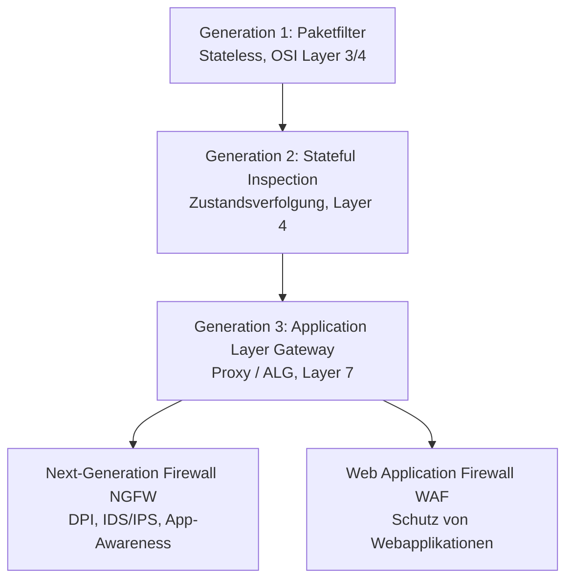
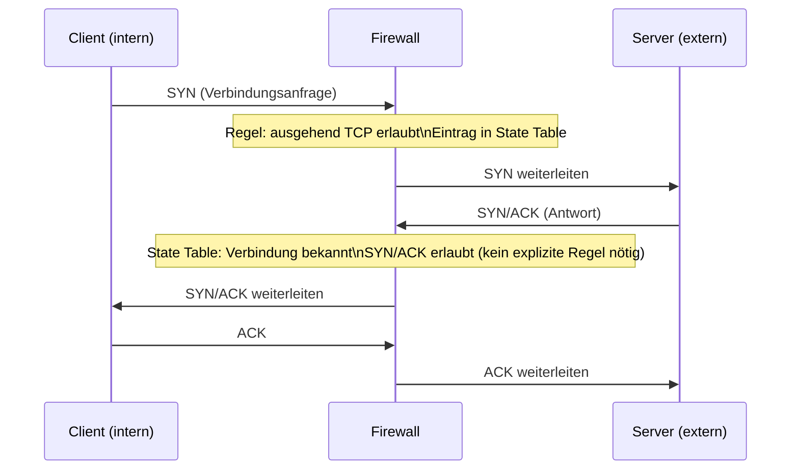
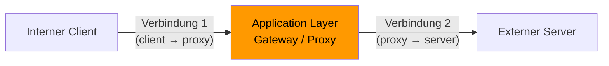
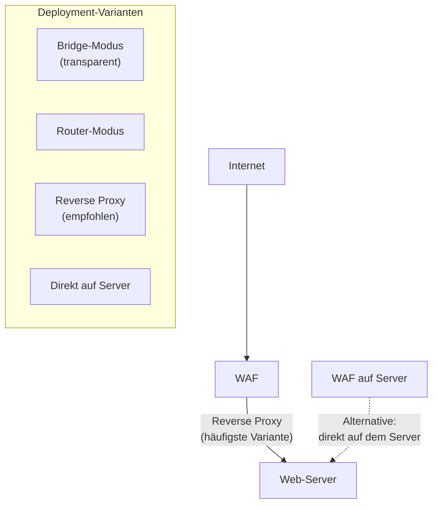
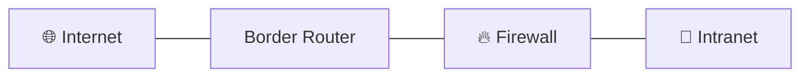
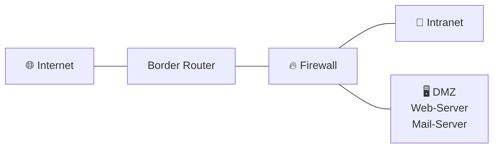
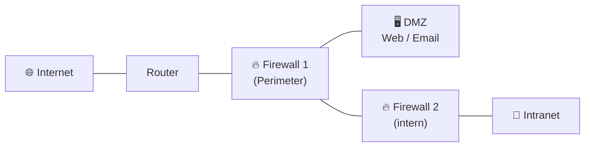
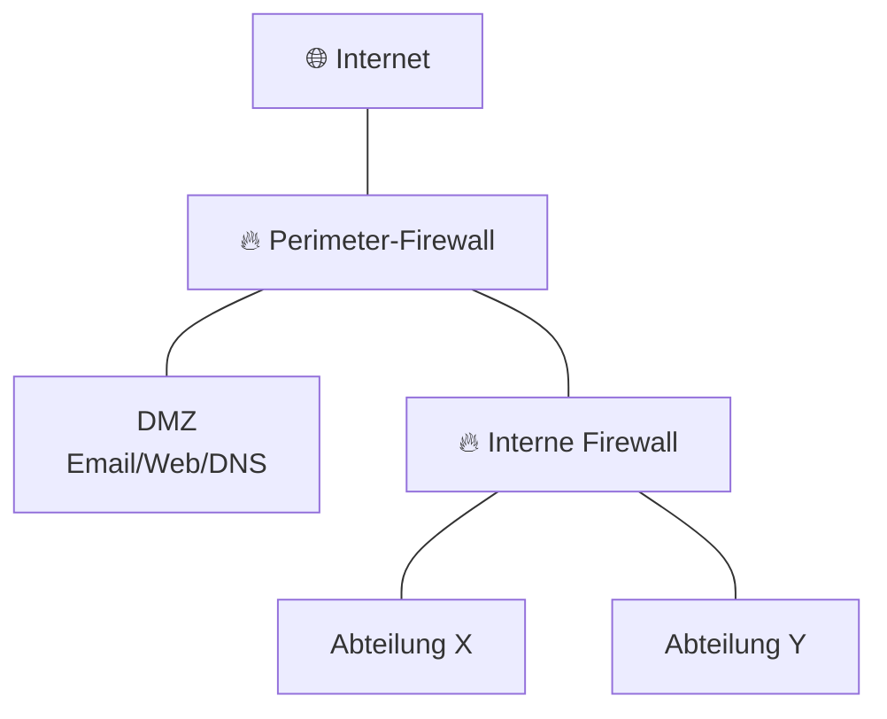
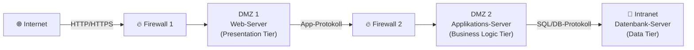
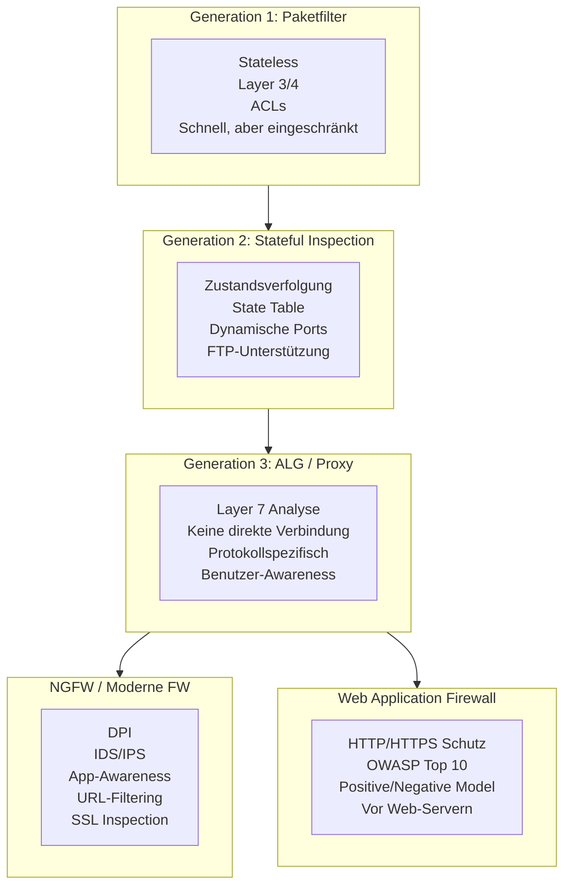

## 1. Was ist ein Perimeter – und warum braucht man mehr als nur einen Router?

Der **Perimeter** bezeichnet den Übergang zwischen dem internen Netzwerk (Intranet) einer Organisation und dem externen Netzwerk (Internet bzw. dem ISP). Rein funktional reicht für diesen Übergang ein einfacher Router aus – er leitet Pakete weiter und verbindet die zwei Netze.

Aber: Ein Router allein trifft keine Sicherheitsentscheidungen. Er unterscheidet nicht zwischen erwünschtem und unerwünschtem Traffic. Sobald eine Organisation sicherheitsrelevante Anforderungen hat – also praktisch immer –, werden deshalb **Paketfilter**, **Firewalls** oder **Application Layer Gateways (ALGs)** eingesetzt.

---

## 2. Was ist eine Firewall?

Eine Firewall ist ein Sicherungssystem, das ein Rechnernetz oder einen einzelnen Computer vor unerwünschten Netzwerkzugriffen schützt. Sie besteht aus mehreren Komponenten (Hardware und/oder Software) und wird zwischen zwei oder mehr Netzwerken positioniert.

### Kernprinzipien einer Firewall:

- **Autorisierungspflicht**: Sämtlicher Datenverkehr, der durch die Firewall läuft, muss durch Regeln (sogenannte *Firewall Rules* oder *Rulesets*) explizit erlaubt sein.
- **Protokollbeschränkung**: Protokolle, die die Firewall nicht versteht (z.B. alte Netzwerkprotokolle wie SPX/IPX oder AppleTalk), werden nicht weitergeleitet.
- **Eigensicherheit**: Die Firewall selbst muss möglichst resistent gegen Angriffe sein – sie ist ein kritischer Punkt im Netzwerk.

### Was kann eine Firewall **nicht**?

Es gibt wichtige Grenzen, die man kennen sollte:

1. **Nur Traffic, der durch sie läuft, wird kontrolliert** – Verbindungen, die an der Firewall vorbeigehen (z.B. via WLAN oder direktem Zugang), sind ungeschützt.
2. **Kein oder nur begrenzter Schutz vor bösartigen Insidern** – Mitarbeitende mit legitimen Zugriffsrechten können nicht vollständig überwacht werden.
3. **Kein automatischer Alarm bei Erfolgsangriffen** – Eine Firewall erkennt in der Regel nicht, ob ein erlaubter Zugriff bösartig ist.
4. **Kein Schutz vor Data-Leakage** – Wenn jemand vertrauliche Dokumente über erlaubte Kanäle nach aussen sendet, greift die Firewall nicht ein.

---

## 3. Firewall-Generationen im Überblick

Die Entwicklung der Firewall-Technologie lässt sich historisch in drei Generationen einteilen. Diese Kategorisierung ist eine vereinfachende Sichtweise – in der Praxis gibt es keine offiziellen Standards dafür –, sie hilft aber, die grundlegenden Konzepte zu verstehen.



---

## 4. Generation 1: Paketfilter (Stateless)

### Wie funktioniert ein Paketfilter?

Ein Paketfilter untersucht jedes Netzwerkpaket **einzeln und unabhängig** voneinander. Er trifft Entscheidungen basierend auf den Headerinformationen des Pakets – ohne den Kontext vorangegangener Pakete zu berücksichtigen. Deshalb nennt man ihn auch **stateless** (zustandslos).

Paketfilter waren ursprünglich integrierte Funktionen von Routern. Die Regeln werden in sogenannten **Access Control Lists (ACLs)** oder **Filtersätzen** organisiert, wobei jeder Filtersatz den Verkehr über eine bestimmte Netzwerkschnittstelle steuert.

### Entscheidungsgrundlagen:

| Kriterium | Beschreibung |
|---|---|
| Ursprungs-IP-Adresse | Woher kommt das Paket? |
| Ziel-IP-Adresse | Wohin soll das Paket? |
| Protokolltyp | TCP, UDP oder ICMP? |
| Quellportnummer | Absender-Port |
| Zielportnummer | Empfänger-Port (z.B. 80 für HTTP) |
| TCP-Flags | SYN, ACK, FIN, RST, ... |
| ICMP-Typ und -Code | Art der ICMP-Nachricht |

### Beispiel: ACL-Regeln für eine einfache Internetverbindung

**Ziel**: Internes Netz darf ins Internet, Internet darf nicht ins interne Netz.

**1. Versuch** (naiv):

| Source IP | Source Port | Destination IP | Destination Port | Protocol | Flags | Action |
|---|---|---|---|---|---|---|
| Internal IP | Any | Any | Any | Any | Any | Allow |
| Any | Any | Internal IP | Any | Any | Any | Deny |

**Problem**: Der erste Versuch blockiert auch Antwortpakete, da diese vom Internet kommen. Ein TCP-Verbindungsaufbau erfordert, dass der Zielrechner antwortet – diese Antwortpakete würden von der zweiten Regel blockiert. Ergebnis: **Out of Service** – kein funktionierendes Internet möglich.

**2. Versuch** (mit TCP-Flags):

| Source IP | Source Port | Destination IP | Destination Port | Protocol | Flags | Action |
|---|---|---|---|---|---|---|
| Internal IP | Any | Any | Any | TCP | SYN | Allow |
| Any | Any | Internal IP | Any | TCP | SYN/ACK | Allow |
| Any | Any | Any | Any | TCP | ACK | Allow |

**Verbesserung**: Nun werden TCP-Flags berücksichtigt. Nur ausgehende Verbindungsinitiierungen (SYN) und deren Antworten (SYN/ACK, ACK) sind erlaubt. **Noch offen**: Die Portnummern sind nicht eingeschränkt, was weitere Angriffsvektoren ermöglicht.

### Nachteile des Paketfilters:

1. **Schwierig zu konfigurieren** – erfordert tiefe TCP/IP-Kenntnisse
2. **Probleme mit bestimmten Protokollen** – z.B. FTP benötigt eine eingehende Verbindung für den Datenkanal
3. **Kein Verbindungskontext** – jedes Paket wird isoliert betrachtet
4. **Probleme mit dynamischen Ports** – viele moderne Protokolle verwenden wechselnde Portnummern
5. **Anfällig für bestimmte Angriffe**:
   - Pakete mit Source Port 20 (FTP) oder 53 (DNS) können legitim aussehen
   - IP-Spoofing (gefälschte Absenderadresse)
   - TCP-ACK ohne vorhergehendes SYN
6. **Paket-Inhalt (Nutzdaten) wird nicht kontrolliert**

---

## 5. Generation 2: Stateful Inspection Firewall

### Das Konzept: Zustandsverfolgung

Die Stateful Inspection Firewall ist im Wesentlichen ein **intelligenter Paketfilter**, der den Zustand von Verbindungen verfolgt. Sie führt eine **State Table** (Verbindungstabelle), die aktive Verbindungen dokumentiert.

**Stateless vs. Stateful** – der Kernunterschied:
- **Stateless (Gen 1)**: Jedes Paket wird isoliert beurteilt – die Firewall weiss nicht, ob ein eingehendes ACK-Paket zu einer vorher aufgebauten Verbindung gehört.
- **Stateful (Gen 2)**: Die Firewall weiss, welche Verbindungen aktiv sind und kann eingehende Pakete dem entsprechenden Verbindungskontext zuordnen.



### Vorteile der Stateful Inspection:

- **Dynamisches Öffnen/Schliessen von Ports**: Ports werden nur für die Dauer einer legitimen Verbindung geöffnet
- **Keine Probleme mehr mit FTP**: Der Daten-Port wird dynamisch für die Dauer der Verbindung freigegeben
- **Schutz vor bestimmten Angriffen**:
  - TCP-Pakete mit Source Port 20 ohne vorherigen Verbindungsaufbau werden erkannt
  - ACK-Pakete ohne vorheriges SYN werden abgelehnt
- **Unterstützung für Protokolle mit dynamischen Ports**

### Beispiel aus der Praxis: FortiGate Ruleset

Ein reales Firewall-Ruleset einer Stateful Firewall (z.B. FortiGate 100D) enthält Regeln wie:
- Quelle: `ebexchange` → Ziel: externe Mail-Server → Dienst: ALL → Aktion: ACCEPT
- Quelle: `Intranet_DHCP_Range` → Ziel: `Microsoft` → Dienst: HTTP/HTTPS → Aktion: ACCEPT

Wichtig dabei: Die letzte Regel ist typischerweise eine **Drop Rule** (Deny all), die allen nicht explizit erlaubten Verkehr blockiert – dies entspricht dem **Whitelisting-Prinzip**.

---

## 6. Generation 3: Application Layer Gateways (ALGs) und Proxies

### Konzept: Vollständige Protokollanalyse auf Schicht 7

ALGs – auch **Proxies** genannt (von lat. *procurator* = Stellvertreter) – gehen einen entscheidenden Schritt weiter als Stateful Firewalls. Sie terminieren die Verbindung vom Client, analysieren den Inhalt auf Applikationsebene (OSI-Schicht 7) und bauen dann eine neue Verbindung zum Zielserver auf.

Das bedeutet: Es gibt **keine direkte Netzwerkverbindung** mehr zwischen externem Internet und internem Netz. Der Proxy ist der einzige Kommunikationspartner für beide Seiten.



### Vorteile von ALGs:

- **Einfacher zu konfigurieren** als Paketfilter – keine tiefen TCP/IP-Kenntnisse nötig
- **Keine direkte Netzwerkverbindung** zwischen Internet und Intranet erhöht die Sicherheit erheblich
- **Keine Probleme mit Angriffsmethoden** wie TCP mit Source Port 20 oder ACK ohne SYN
- **Inhaltskontrolle möglich** – der Proxy sieht den vollständigen Anwendungsinhalt
- **Authentifizierung auf Benutzerebene** – moderne Proxies können nicht nur IP-Adressen, sondern auch Benutzer und Client-Software in Regeln einbeziehen

### Nachteile von ALGs:

- **Langsamer** als Paketfilter, da jedes Paket bis Layer 7 verarbeitet wird
- **Eingeschränkte Protokollunterstützung** – für jedes Protokoll (FTP, SMTP, HTTP...) muss ein spezifischer Proxy-Modul vorhanden sein. Neue oder exotische Protokolle erfordern neue Software.

---

## 7. ALG: Next-Generation Firewalls (NGFW)

### Was ist eine NGFW?

Eine **Next-Generation Firewall** ist – trotz des etwas überstrapazierten Marketingbegriffs, der schon seit über 15 Jahren existiert – eine moderne Firewall, die die Fähigkeiten einer klassischen Stateful Firewall mit erweiterten Sicherheitsfunktionen kombiniert.

Eine NGFW vereint drei Schlüsselfunktionen:
1. **Stateful Packet Inspection** (wie Gen 2)
2. **Intrusion Detection & Prevention (IDS/IPS)**
3. **Applikationskontrolle** via Deep Packet Inspection (DPI)

### Typische Funktionen einer NGFW:

| Funktion | Beschreibung |
|---|---|
| Paketfilterung | Klassische ACL-basierte Regeln |
| Network Address Translation (NAT) | IP-Adressübersetzung |
| URL-Blockierung | Sperren bestimmter Webseiten/Kategorien |
| Intrusion Detection/Prevention | Erkennung und Blockierung von Angriffsmustern |
| SSL/TLS Inspection | Entschlüsselung und Analyse von HTTPS-Traffic |
| SSH Inspection | Überwachung von SSH-Tunneln |
| Deep Packet Inspection (DPI) | Vollständige Analyse des Paketinhalts |
| Reputations-basierte Malware-Abwehr | Vergleich mit bekannten Bedrohungsdatenbanken |
| Application Awareness | Erkennung von über 2000+ Applikationen unabhängig von Port |

### Application Awareness im Detail

Ein zentrales Merkmal moderner NGFWs ist die Fähigkeit, Applikationen zu erkennen – unabhängig vom verwendeten Port. Früher galt: Port 80 = HTTP, Port 443 = HTTPS. Heute laufen viele Applikationen über standard Ports, um Firewalls zu umgehen. Eine NGFW mit Application Awareness kann erkennen:
- Ist das wirklich HTTP auf Port 80, oder ein P2P-Client, der Port 80 nutzt?
- Welche konkreten Anwendungen nutzen die Verbindung (YouTube, Facebook, Skype, etc.)?
- Ist die Anwendung als riskant oder malware-anfällig klassifiziert?

### URL Filtering und Content Awareness

Ergänzend zur Applikationserkennung können NGFWs:
- **URLs kategorisieren und filtern** (z.B. Social Media, Glücksspiel, Malware-Seiten blockieren)
- **Dateitypen kontrollieren** – z.B. keine `.exe`, `.bat` oder `.dll` Dateien aus dem Internet
- **Benutzeridentität einbeziehen** – durch Integration mit Active Directory

---

## 8. ALG: Web Application Firewalls (WAF)

### Was ist eine WAF und wofür wird sie eingesetzt?

Eine **Web Application Firewall** ist eine spezialisierte Firewall auf Applikationsebene, die speziell zum Schutz von **Webanwendungen** (Web-Servern und Applikations-Servern) eingesetzt wird. Sie schützt nicht vor netzwerkbasierten Angriffen, sondern vor **applikationsspezifischen Angriffen**.

Typische Angriffe, gegen die eine WAF schützt (vgl. **OWASP Top 10**):
- **SQL Injection** – Einschleusen von SQL-Befehlen in Datenbankabfragen
- **Cross-Site Scripting (XSS)** – Einbetten von Schadcode in Webseiten
- **Session Hijacking** – Übernahme aktiver Benutzersitzungen
- **CSRF (Cross-Site Request Forgery)** – Ausführen unerwünschter Aktionen im Namen eines eingeloggten Benutzers

### Wichtiger Hinweis: WAF ergänzt, ersetzt nicht!

Eine WAF wird **zusätzlich** zu einer normalen Netzwerk-Firewall eingesetzt. Sie ist kein Ersatz für eine Perimeter-Firewall, sondern schützt gezielt die Webapplikationsschicht.

### Deployment-Optionen:



### Sicherheitsmodelle:

- **Blacklist / Negative Security Model**: Bekannte Angriffsmuster werden blockiert. Alles andere ist erlaubt. Einfacher zu konfigurieren, aber neue Angriffe werden nicht erkannt.
- **Whitelist / Positive Security Model**: Nur explizit erlaubte Anfragen werden durchgelassen. Alles andere wird blockiert. Sehr sicher, aber aufwändig zu konfigurieren und zu warten.

### Herausforderungen der WAF:

- **Konfigurationsaufwand** – insbesondere das Erstellen einer Whitelist ist sehr aufwändig
- **Wartungsaufwand** – bei jedem neuen Application-Release muss die Konfiguration ggf. angepasst werden
- **Know-How-Transfer** – der WAF-Administrator muss die Applikation tiefgehend verstehen
- **False Positives** – legitime Anfragen werden blockiert
- **False Negatives** – neue, unbekannte Angriffe werden nicht erkannt

---

## 9. Firewall-Architekturen

### Grundprinzip: Die DMZ (Demilitarisierte Zone)

Die **DMZ** (Demilitarisierte Zone) ist eines der wichtigsten Konzepte im Zusammenhang mit Firewalls. Sie bezeichnet ein Netzwerksegment, das zwischen dem geschützten internen Netz (Inside) und dem externen Netz (Outside/Internet) liegt.

**Systeme, die vom Internet aus erreichbar sein müssen** (Web-Server, Mail-Server, DNS-Server), gehören in die DMZ – und **nicht** ins interne Netz. So wird sichergestellt, dass ein kompromittierter Server in der DMZ keinen direkten Zugriff auf das interne Netz hat.

### Einfache Architektur ohne DMZ:



**Problem**: Wenn ein interner Server vom Internet erreichbar sein muss, muss er direkt im Intranet stehen – was das gesamte interne Netz gefährdet, falls dieser Server kompromittiert wird.

### Einfache Architektur mit DMZ:



Die Firewall hat nun drei Netzwerkschnittstellen: Internet, Intranet und DMZ. Regeln:
- Internet → DMZ: Nur bestimmte Ports erlaubt (z.B. 80/443 für Webserver)
- DMZ → Intranet: Sehr restriktiv (nur notwendige Protokolle)
- Internet → Intranet: Komplett verboten

### Hoch-Sicherheits-Architektur (Dual Firewall):



Hier schützen **zwei separate Firewalls** (idealerweise von verschiedenen Herstellern) das interne Netz. Selbst wenn Firewall 1 kompromittiert wird, steht Firewall 2 als weitere Barriere bereit.

### Hoch-Verfügbarkeit (HA-Cluster):

In produktiven Umgebungen darf der Ausfall einer Firewall nicht zum Totalausfall führen. Deshalb werden Firewalls in **Clustern** betrieben:

- **Aktiv/Passiv**: Eine Firewall ist aktiv, die andere steht als Backup bereit. Bei Ausfall der aktiven Firewall übernimmt die passive automatisch – **ohne** dass bestehende Verbindungen unterbrochen werden (Stateful Failover).
- **Aktiv/Aktiv**: Beide Firewalls verarbeiten Traffic gleichzeitig (Lastverteilung).

### Mehrere externe Netzwerkverbindungen:

Grosse Organisationen haben oft Verbindungen zu mehreren externen Netzwerken:
- Internet (öffentlich)
- B2B-Partner X (privat/VPN)
- B2B-Partner Y (privat/VPN)

Diese können entweder über **eine zentrale Firewall** oder über **separate Firewalls** pro Verbindungstyp geführt werden. Die zweite Variante erhöht die Isolation zwischen den Netzwerken.

### Interne Segmentierung:

Firewalls werden nicht nur am Perimeter, sondern auch **intern** eingesetzt:



**Vorteile interner Segmentierung**:
- Bessere Zugriffskontrolle zwischen Abteilungen
- Unternehmens-Security-Policy kann erzwungen werden
- Lateral Movement nach einem Angriff wird erschwert (Zero-Trust-Ansatz)
- Mit Proxy: Zugangskontrolle auf Benutzerebene möglich

### Grundregeln für Firewall-Rulesets:

1. **Direkter Zugriff vom Internet ins interne Netz: verboten**
2. **Öffentlich zugängliche Server gehören in die DMZ**, nicht ins interne Netz
3. **Zugriff aus dem Internet begrenzen** auf bestimmte Server/Ports in der DMZ
4. **Zugriff vom internen Netz ins Internet** – klassisch: offen; **modern**: grundsätzlich eingeschränkt, nur bestimmte Dienste oder über Proxies erlaubt (verhindert "Phone Home"-Malware)
5. **Gefährliche Protokolle blockieren**: NetBIOS, NFS, TeamViewer, etc.

---

## 10. Beispiel: E-Commerce 3-Tier-Architektur

Eine typische E-Commerce-Applikation folgt einer **3-Tier-Architektur**:



- **DMZ 1** (Presentation Tier): Web-Server, öffentlich erreichbar über HTTP/HTTPS
- **DMZ 2** (Business Logic Tier): Applikations-Server, nur erreichbar vom Web-Server
- **Intranet** (Data Tier): Datenbank-Server, nur erreichbar vom Applikations-Server

Jede Schicht ist durch eine Firewall vom Rest des Netzes getrennt. Selbst wenn der Web-Server kompromittiert wird, kann der Angreifer nicht direkt auf die Datenbank zugreifen.

---

## 11. Personal Firewalls und Firewalls heute

### Firewalls heute – ein Überblick

- **Alle modernen Firewalls sind stateful** – pure Paketfilter ohne Zustandsverfolgung sind heute praktisch nicht mehr im Einsatz
- **Application Gateways (Proxies)** werden in spezifischen Szenarien eingesetzt (z.B. Web-Proxy in Unternehmen)
- **Firewalls als Appliance**: Hersteller wie Fortinet, Palo Alto, Check Point, Cisco liefern gehärtete Hardware+Software-Kombinationen
- **Virtuelle Firewalls** nehmen zu – insbesondere für Cloud- und Virtualisierungsumgebungen
- **SOHO/Heimnetz**: Bei DSL-Heimroutern wird oft **kein vollwertiger Firewall** eingesetzt; die Sicherheit basiert primär auf NAT (Network Address Translation), das eingehende Verbindungen implizit blockiert – kein Ersatz für echte Firewall-Regeln

### Personal Firewalls

Eine **Personal Firewall** ist eine Software-Anwendung, die direkt auf einem PC installiert wird und ihn vor unberechtigtem Zugriff schützt. Sie ergänzt die Netzwerk-Firewall auf der Endgeräte-Ebene.

**Typische Einsatzszenarien**:
- Schutz bei direktem Anschluss ans öffentliche Internet (Wireless in Hotels, Cafés)
- Schutz vor lateralen Angriffen im Unternehmensnetz

**Moderne Personal Firewalls schützen auch ausgehende Verbindungen** – nicht nur eingehende. Damit kann verhindert werden, dass Malware unbemerkt nach Hause telefoniert ("Phone Home").

**Bekannte Beispiele**:
- Windows Defender Firewall (Windows 10/11)
- Linux `iptables` / `nftables`

**Kritikpunkte**:
- Schwierig zu konfigurieren: Darf `services.exe` auf das Internet zugreifen? Und `winword.exe`?
- Oft falsch konfiguriert oder funktionieren nicht korrekt

### Windows 10/11 Firewall

Die Windows Defender Firewall ist eine vollwertige Stateful Packet Filtering Firewall mit folgenden Merkmalen:
- Konfiguration von **ausgehenden und eingehenden** Regeln
- Integration in **Active Directory** (domainweite Policies)
- **Mehrere Profile**: Public, Domain, Private – mit unterschiedlichen Regelsets
- Sehr granulare Regeln möglich (z.B. nur `telnet.exe` von bestimmten IPs blockieren)

**Achtung**: Standardmässig ist ausgehender Verkehr **weitgehend erlaubt** (um Warnmeldungen für normale Benutzer zu vermeiden). Das bedeutet, dass Malware theoretisch ungehindert nach aussen kommunizieren kann.

### Linux iptables / Netfilter

`iptables` ist das klassische Firewall-Framework unter Linux (heute zunehmend ersetzt durch `nftables`). Es organisiert Regeln in **Chains**:

- `INPUT` – Pakete, die an die Firewall/den Host selbst adressiert sind
- `OUTPUT` – Pakete, die vom Host erzeugt werden
- `FORWARD` – Pakete, die durch den Host weitergeleitet werden (relevant bei Linux als Router/Gateway)

**Beispiel**: Passive FTP-Übertragungen erlauben:
```bash
iptables -A INPUT -i eth0 -p tcp -s 0/0 --sport 1024:65535 \
  --dport 1024:65535 -m state --state ESTABLISHED,RELATED -j ACCEPT
```

### Open-Source Firewalls: pfSense und OPNsense

Wer eine professionelle Firewall ohne Lizenzkosten benötigt, kann auf Open-Source-Lösungen zurückgreifen:

**pfSense**:
- Basiert auf FreeBSD, primär für embedded Hardware (z.B. Netgate-Appliances)
- Unterstützt VPN, NAT, DHCP, DNS-Forwarding, Hochverfügbarkeit, Load Balancing
- Website: https://www.pfsense.org/

**OPNsense**:
- Fork von pfSense, ebenfalls Open Source
- Modernere Web-Oberfläche, regelmässigere Sicherheitsupdates
- Sowohl virtuell als auch als physische Appliance (self-made) einsetzbar
- Website: https://opnsense.org

---

## 12. Zusammenfassung: Firewall-Generationen im Vergleich



| Eigenschaft | Paketfilter | Stateful | ALG/Proxy | NGFW | WAF |
|---|:---:|:---:|:---:|:---:|:---:|
| OSI-Layer | 3/4 | 3/4 | 7 | 3–7 | 7 |
| Verbindungskontext | ❌ | ✅ | ✅ | ✅ | ✅ |
| Inhaltskontrolle | ❌ | ❌ | ✅ | ✅ | ✅ |
| App-Awareness | ❌ | ❌ | teilweise | ✅ | ✅ |
| Geschwindigkeit | 🟢 schnell | 🟡 mittel | 🔴 langsam | 🟡 mittel | 🟡 mittel |
| Konfigurationskomplexität | 🔴 hoch | 🟡 mittel | 🟢 geringer | 🟡 mittel | 🔴 hoch |
| Schutz vor Layer-7-Angriffen | ❌ | ❌ | teilweise | ✅ | ✅ |

---

> **Merksatz**: Eine Firewall ist kein Allheilmittel – sie ist eine Komponente in einem mehrschichtigen Sicherheitskonzept (Defense in Depth). Kein System, das hinter einer Firewall steht, sollte allein auf den Firewall-Schutz vertrauen. Patching, sichere Konfiguration, Monitoring und Benutzerschulung sind ebenso wichtig.
