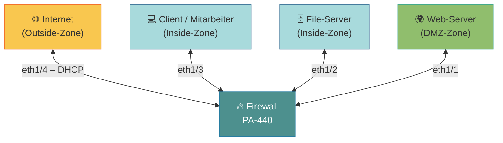
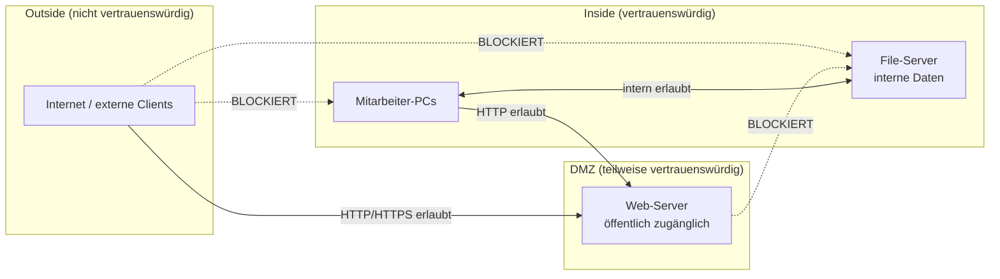
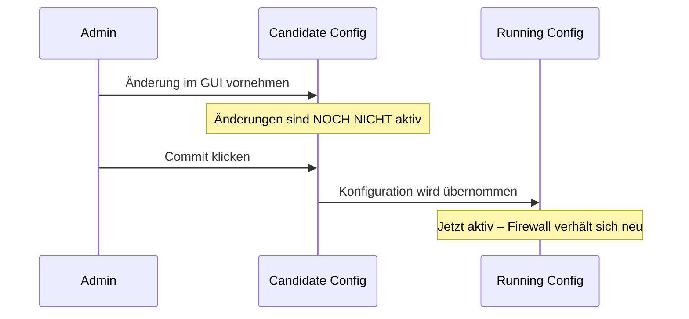
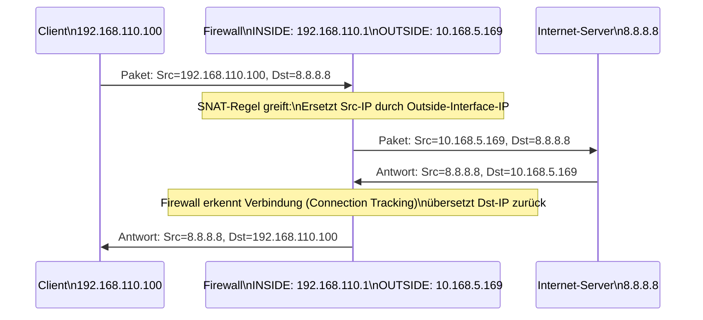
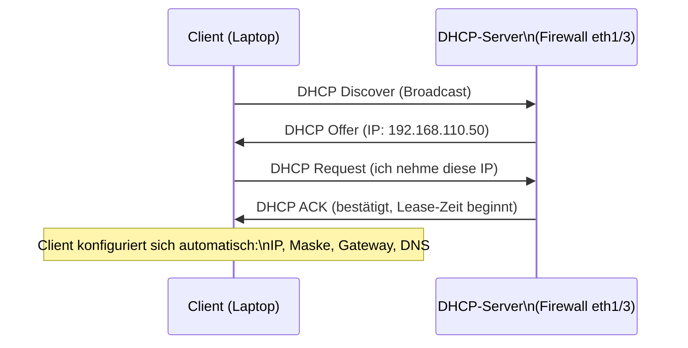
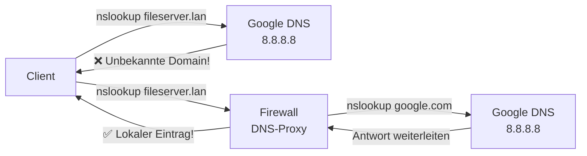
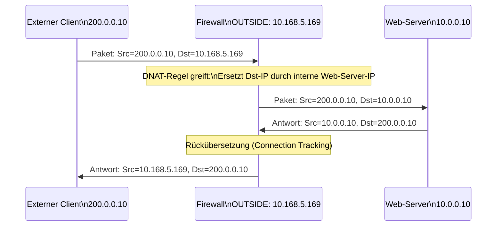
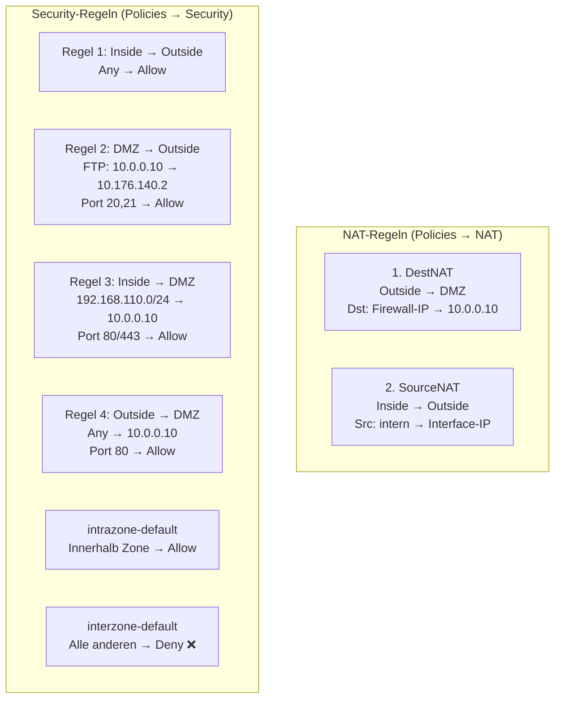
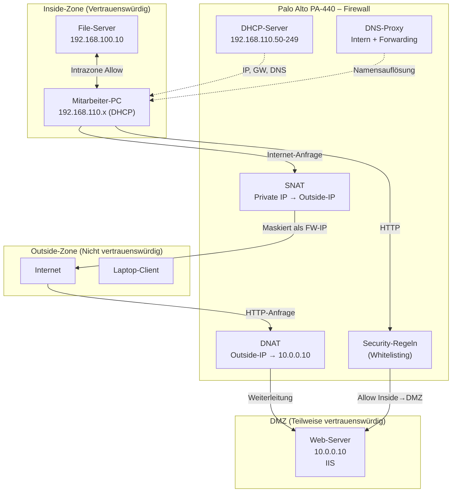

Dieses Dokument fasst die Inhalte des Einführungslabors zur Netzwerksicherheit zusammen.
Im Mittelpunkt steht die praktische Konfiguration einer professionellen **Next-Generation Firewall (NGFW)**
vom Typ Palo Alto PA-440. Die behandelten Konzepte sind jedoch universell auf andere Firewall-Plattformen übertragbar.

---

## 1. Lernziele

| Ziel | Beschreibung |
|------|-------------|
| Praktischer Umgang | Grundlegende Einstellungen einer professionellen Firewall konfigurieren |
| Webinterface | Palo Alto PA-440 Web-GUI bedienen und navigieren |
| Netzwerkzonierung | Firewall-Zonen entwerfen und konfigurieren |
| Firewall-Regeln | Whitelisting-Konzept anwenden, Regelreihenfolge verstehen |
| NAT (SNAT/DNAT) | Source- und Destination-NAT verstehen und einrichten |
| DHCP | Automatische IP-Adressvergabe aktivieren |
| DNS-Proxy | Namensauflösung über die Firewall konfigurieren |

---

## 2. Laboraufbau und Netzwerkarchitektur

### 2.1 Physischer Aufbau

Der Laborversuch verwendet folgende Hardware:
- 2 Labor-PCs (Web-Server und File-Server)
- 1× Palo Alto PA-440 mit Netzteil
- Diverse LAN-Kabel
- Studierendenlaptop als Client (Mitarbeiter-PC)

Die PA-440 ist eine **8-Port-NGFW** im Desktop-Format, geeignet für kleine und mittlere Unternehmen (KMU).

### 2.2 Logische Netzwerkarchitektur (Zonierung)

Das Netzwerk ist in **drei Sicherheitszonen** aufgeteilt:



### 2.3 IP-Adresstabelle

| Zone | Gerät | IP-Adresse |
|------|-------|-----------|
| **DMZ** | Subnetz | `10.0.0.0/24` |
| DMZ | Firewall-Interface (eth1/1) | `10.0.0.1` |
| DMZ | Web-Server | `10.0.0.10` |
| **INSIDE (Server)** | Subnetz | `192.168.100.0/24` |
| INSIDE (Server) | Firewall-Interface (eth1/2) | `192.168.100.1` |
| INSIDE (Server) | File-Server | `192.168.100.10` |
| **INSIDE (Staff)** | Subnetz | `192.168.110.0/24` |
| INSIDE (Staff) | Firewall-Interface (eth1/3) | `192.168.110.1` |
| INSIDE (Staff) | Mitarbeiter | `192.168.110.100` (später DHCP) |
| **OUTSIDE** | Firewall-Interface (eth1/4) | DHCP (vom Labor-Router) |
| OUTSIDE | Client | DHCP |

> **Warum zwei Subnetze in derselben Inside-Zone?**
> Zonen in einer Firewall sind **logische Gruppierungen** von Interfaces mit ähnlichem Sicherheitsniveau.
> File-Server und Mitarbeiter-PCs teilen dieselbe Vertrauensstufe (Inside), benötigen aber separate
> Subnetze für eine saubere IP-Adressverwaltung. Regeln werden auf Zonenebene definiert –
> das spart Verwaltungsaufwand gegenüber Interface-spezifischen Regeln.

---

## 3. Warum Netzwerkzonierung?

Zonierung ist eines der grundlegendsten Sicherheitsprinzipien in der Netzwerktechnik.
Die Idee dahinter ist **Defense in Depth** (Tiefenverteidigung):



**Vorteile:**
- Ein kompromittierter Web-Server (DMZ) kann nicht direkt auf interne Systeme zugreifen.
- Angriffe aus dem Internet treffen zuerst auf die am stärksten abgeschirmte Zone.
- Separate Sicherheitsregeln pro Zone ermöglichen granulare Kontrolle.

---

## 4. Inbetriebnahme der Palo Alto PA-440

### 4.1 Erstzugang über Management-Port

Die PA-440 wird im **Auslieferungszustand** ausschliesslich über den dedizierten
**Management-Port (MGMT)** konfiguriert:

- Management-IP: `192.168.1.1` (Subnetz `192.168.1.0/24`)
- Zugangsdaten: Benutzer `admin` / Passwort `Hslu1234`
- Webinterface: `https://192.168.1.1`

> **Warum ein separater Management-Port?**
> Der MGMT-Port ist physisch von den Daten-Interfaces getrennt. Dadurch ist die
> Konfigurationsoberfläche auch dann erreichbar, wenn das Datennetzwerk gestört ist.
> Ausserdem verhindert die Trennung, dass ein Angreifer, der ins Datennetz eindringt,
> direkt auf die Firewall-Konfiguration zugreifen kann (**Out-of-Band Management**).

### 4.2 GUI-Struktur der PA-440

Die Weboberfläche ist in zwei Ebenen gegliedert:

```
Tabs (oben):     DASHBOARD | ACC | MONITOR | POLICIES | OBJECTS | NETWORK | DEVICE
                                                                      ↑
Menü (links):    ← Unterkategorien des aktiven Tabs (z.B. Interfaces, Zones, DHCP ...)
```

| Tab | Zweck |
|-----|-------|
| `DASHBOARD` | Statusübersicht, Systemgesundheit |
| `MONITOR` | Traffic-Logs, Bedrohungsprotokoll |
| `POLICIES` | Firewall-Regeln, NAT-Regeln |
| `OBJECTS` | Adressobjekte, Service-Objekte, Application Groups |
| `NETWORK` | Interfaces, Zonen, Router, DHCP, DNS |
| `DEVICE` | Systemeinstellungen, Updates, Benutzer |

### 4.3 Commit-Workflow – Änderungen aktivieren

Ein kritisches Konzept bei Palo Alto ist der **zweistufige Konfigurationsprozess**:



**Wichtig:** Immer erst `Commit` durchführen, bevor man Konfigurationsänderungen testet!
Der Commit-Vorgang kann einige Minuten dauern.

---

## 5. Firewall-Interfaces und Zonentypen

### 5.1 Interface-Typen im Überblick

| Typ | Beschreibung | Anwendungsfall |
|-----|-------------|----------------|
| **Virtual Wire** | Verbindet zwei Interfaces transparent (Layer 2 Durchleitung) | Inline-Monitoring ohne IP-Änderung |
| **Layer 2** | Ethernet-Switch-Port, kein IP-Routing | VLAN-Switching innerhalb der FW |
| **Layer 3** | IP-fähiges Interface mit eigener Adresse | Standard für Routing zwischen Zonen |
| **Tap Mode** | Passiver Spiegel-Port zum Monitoring | Traffic-Analyse ohne Eingriff |

**Warum wir Layer 3 verwenden:**
Im Layer-3-Modus bekommt jedes Firewall-Interface eine eigene IP-Adresse und dient als
**Default-Gateway** für die angeschlossenen Hosts. Die Firewall trifft IP-basierte
Routing- und Sicherheitsentscheidungen. Virtual Wire (Layer 2) leitet Pakete lediglich
durch – es gibt keine IP-Kontrolle.

### 5.2 Adressobjekte vs. direkte IP-Vergabe

Statt IP-Adressen direkt in Regeln einzutragen, empfiehlt Palo Alto die Verwendung von **Adressobjekten** (Objects → Addresses):

```
Ohne Adressobjekt:        Mit Adressobjekt:
Regel 1: allow 10.0.0.10  Regel 1: allow DMZ_Webserver
Regel 2: deny  10.0.0.10  → Änderung der IP? Nur das Objekt anpassen!
Regel 3: log   10.0.0.10     Alle Regeln bleiben unverändert.
```

**Vorteile:**
- Wiederverwendbarkeit in mehreren Regeln
- Sprechende Namen statt kryptischer IP-Adressen
- Zentrale Änderung bei IP-Anpassungen

---

## 6. Source Network Address Translation (SNAT)

### 6.1 Das Problem: Private Adressen im Internet

Interne Hosts besitzen **private IP-Adressen** (RFC 1918: `10.x.x.x`, `192.168.x.x`, `172.16-31.x.x`).
Das Internet routet diese Adressen nicht – ein Server im Internet könnte auf eine Anfrage von
`192.168.110.100` nicht antworten, da er nicht weiss, wohin er das Paket schicken soll.

### 6.2 Wie SNAT funktioniert



**SNAT-Konfiguration in der PA-440:**
- Tab: `Policies` → `NAT`
- Original Packet: Destination Zone = `Outside`, Source = `any`
- Translated Packet: Translation Type = `Dynamic IP And Port`, Address Type = `Interface Address`, Interface = `ethernet1/4`

> `Dynamic IP And Port` (auch **PAT – Port Address Translation** oder **Masquerading** genannt)
> ermöglicht es, dass **viele interne Clients** dieselbe öffentliche IP teilen, indem
> unterschiedliche **Quellports** vergeben werden.

---

## 7. Firewall-Regeln und das Whitelisting-Prinzip

### 7.1 Top-Down-Prinzip

Firewall-Regeln werden **von oben nach unten** abgearbeitet. Die **erste zutreffende Regel** wird angewendet:

```mermaid
flowchart TD
    P[Eingehendes Paket] --> R1{Regel 1\npasst?}
    R1 -->|Ja| A1[Aktion von Regel 1]
    R1 -->|Nein| R2{Regel 2\npasst?}
    R2 -->|Ja| A2[Aktion von Regel 2]
    R2 -->|Nein| R3{...}
    R3 -->|Nein| RN{Default-Deny\n(letzte Regel)}
    RN --> DROP[Paket verworfen]
```

**Konsequenz:** Spezifische Regeln müssen **oben** stehen, allgemeine **unten**.
Eine spezifische Regel, die hinter einer allgemeinen steht, wird **nie erreicht** (sie liegt im „Schatten").

### 7.2 Whitelisting vs. Blacklisting

| Ansatz | Beschreibung | Sicherheitsniveau |
|--------|-------------|-------------------|
| **Whitelisting** | Nur explizit erlaubte Verbindungen passieren | ✅ Hoch (empfohlen) |
| **Blacklisting** | Alles erlaubt, bekannte Bedrohungen blockiert | ⚠️ Niedrig (reaktiv) |

Palo Alto verwendet standardmässig **Whitelisting** mit einer abschliessenden **implicit deny**-Regel
(interzone-default → Deny).

### 7.3 Vorinstallierte Regeln (nach Default Config)

| Nr. | Regelname | Source-Zone | Dest.-Zone | Aktion |
|-----|-----------|------------|-----------|--------|
| 1 | *(explizit)* | Inside | Outside | Allow |
| 2 | intrazone-default | any (gleiche Zone) | any (gleiche Zone) | Allow |
| 3 | interzone-default | any | any (andere Zone) | **Deny** |

**Erklärung der Auswirkungen:**
- Mitarbeiter → File-Server: ✅ (gleiche Inside-Zone → intrazone-default Allow)
- Mitarbeiter → Web-Server: ❌ (Inside → DMZ = andere Zone → interzone-default Deny)
- Mitarbeiter → Internet: ✅ (Regel 1: Inside → Outside Allow)
- Web-Server → Internet: ❌ (DMZ → Outside, keine Regel erlaubt dies)

### 7.4 Konfigurationsoptionen für eine Firewall-Regel

| Tab | Einstellung | Beschreibung |
|-----|------------|-------------|
| GENERAL | Rule Type | Interzone / Intrazone / Universal |
| SOURCE | Source Zone | Quell-Zone |
| SOURCE | Source Address | IP des anfragenden Geräts (Adressobjekt oder direkt) |
| DESTINATION | Destination Zone | Ziel-Zone |
| DESTINATION | Destination Address | IP des Empfängers |
| APPLICATION | Applications | Deep Packet Inspection auf Layer 7 (App-ID) |
| SERVICE | Service | Port-basierte Filterung (TCP/UDP-Port) |
| ACTIONS | Action | Allow / Deny / Drop / Reset |
| ACTIONS | Profile Setting | Antivirus, Anti-Spyware, URL-Filtering |
| ACTIONS | Log Setting | Logging-Optionen |

> **Wichtig:** Im Grundlabor arbeiten wir **service-basiert** (Ports), nicht application-basiert.
> Die vollständige **App-ID**-Funktionalität (Layer-7-Erkennung) wird im Folgelabor "Firewall Advanced" behandelt.

### 7.5 Beispiel: FTP-Regel für den Web-Server

Aufgabe: Web-Server soll Daten auf externen FTP-Server (`10.176.140.2`) ablegen.

```
Source Zone:       DMZ
Source Address:    10.0.0.10  (oder any)
Destination Zone:  Outside
Destination Address: 10.176.140.2
Service:           TCP/20,21  (Port 20 = Datenkanal, Port 21 = Kontrollkanal)
Action:            Allow
```

> **Warum Port 20 UND 21?**
> FTP verwendet **zwei separate TCP-Verbindungen**:
> - Port 21: Kontrollverbindung (Befehle wie `LIST`, `RETR`, `STOR`)
> - Port 20: Datenverbindung (eigentlicher Datentransfer im Active-FTP-Modus)

### 7.6 Beispiel: HTTP-Zugriff vom Mitarbeiter auf den Web-Server

```
Source Zone:        Inside
Source Address:     192.168.110.0/24
Destination Zone:   DMZ
Destination Address: 10.0.0.10
Service:            service-http / Port 80  (oder service-https / Port 443)
Action:             Allow
```

---

## 8. DHCP – Automatische Adressvergabe

### 8.1 Warum DHCP?

Ohne DHCP müsste jeder Client **manuell** mit einer statischen IP-Adresse, Subnetzmaske,
Gateway und DNS-Server konfiguriert werden. In grösseren Netzwerken ist das unpraktisch
und fehleranfällig.

DHCP (Dynamic Host Configuration Protocol) automatisiert diese Konfiguration:



### 8.2 Was DHCP alles übermitteln kann

| Option | Beschreibung |
|--------|-------------|
| IP-Adresse + Subnetzmaske | Pflicht |
| Default Gateway | IP des Routers / Firewall-Interface |
| DNS-Server | Adresse für Namensauflösung |
| Lease-Zeit | Gültigkeitsdauer der IP-Adresse |
| Domain-Name | Interne Domäne (z.B. `firma.lan`) |
| WINS-Server | Windows Internet Name Service |
| MTU | Maximum Transmission Unit |
| NTP-Server | Zeitserver für Zeitsynchronisation |
| PXE-Konfiguration | Netzwerkboot für Thin Clients |

### 8.3 Konfiguration auf der PA-440

- Tab: `Network` → `DHCP` → `DHCP Server`
- Interface: `ethernet1/3` (Mitarbeiter-Netzwerk)
- IP-Pool: `192.168.110.50 – 192.168.110.249`
- Gateway: `192.168.110.1`
- Primary DNS: `192.168.110.1` (Firewall selbst als DNS-Proxy)

> **Inheritance Source auf `None` setzen!**
> Wir könnten DHCP-Optionen vom externen Interface (`ethernet1/4`) erben (z.B. Google-DNS).
> Das Problem: Ein externer DNS kann **interne Hostnamen** (z.B. `fileserver.lan`) nicht auflösen.
> Deshalb nutzen wir die Firewall als eigenen DNS-Proxy.

---

## 9. DNS-Proxy auf der Firewall

### 9.1 Das Problem mit externen DNS-Servern



### 9.2 Funktionsweise des DNS-Proxys

Die Firewall fungiert als **DNS-Resolver** mit zwei Stufen:

1. **Lokale Auflösung:** Statische Einträge (z.B. `fileserver.lan → 192.168.100.10`) werden
   direkt von der Firewall beantwortet.
2. **Forwarding:** Unbekannte Namen werden an den externen DNS weitergeleitet
   (via `ethernet1/4` geerbter DNS-Server).
3. **Caching:** Bereits aufgelöste Namen werden zwischengespeichert für schnellere
   Folge-Anfragen.

### 9.3 Konfiguration auf der PA-440

- Tab: `Network` → `DNS Proxy`
- Interfaces hinzufügen: `ethernet1/1`, `ethernet1/2`, `ethernet1/3`
- Inheritance Source: `ethernet1/4`
- Primary / Secondary: `inherited`

**Statischer Eintrag für den File-Server:**

| Name | FQDN | Adresse |
|------|------|---------|
| Fileserver | `fileserver.lan` | `192.168.100.10` |

**Überprüfung auf dem Client:**
```cmd
ipconfig           → Zeigt zugewiesene IP (DHCP)
nslookup fileserver.lan   → Löst internen Namen auf
nslookup google.com       → Löst externen Namen auf (Forwarding)
```

---

## 10. Destination Network Address Translation (DNAT)

### 10.1 Das Problem: Interne Server von aussen erreichbar machen

SNAT löst das Problem, dass interne Hosts das Internet erreichen können.
Das **umgekehrte Problem**: Ein Nutzer im Internet möchte **unseren Web-Server** aufrufen –
er kennt aber nur die öffentliche IP der Firewall, nicht `10.0.0.10`.

### 10.2 Wie DNAT funktioniert



### 10.3 DNAT-Konfiguration auf der PA-440

**Original Packet:**
```
Source Zone:           any
Source Address:        any
Destination Zone:      Outside
Destination Interface: any
Destination Address:   10.168.5.169  (aktuelle Outside-IP der Firewall)
Service:               any
```

**Translated Packet:**
```
Destination Address Translation:
  Translation Type:    Static IP
  Translated Address:  DMZ_Webserver  (= 10.0.0.10)
```

### 10.4 Wichtige Besonderheit: Palo Alto NAT-Regelreihenfolge

NAT-Regeln verhalten sich (wie Firewall-Regeln) nach dem **Top-Down-Prinzip**.

**Problem:** Wenn die SNAT-Regel (Source Zone = `any`) vor der DNAT-Regel steht,
greift sie auch auf eingehende Pakete aus `Outside` → DNAT wird nie erreicht!

```
FALSCH:        RICHTIG:
1. SourceNAT   1. DestNAT     ← DNAT zuerst!
2. DestNAT     2. SourceNAT
```

**Bessere Lösung:** Die SNAT-Regel auf `Source Zone = Inside` einschränken,
dann betrifft sie nicht eingehende Pakete aus `Outside`.

### 10.5 Palo Alto-Spezialregeln für DNAT-Firewall-Regeln

Bei DNAT auf Palo Alto gelten besondere Regeln für die **zugehörige Security Policy**:

| Kriterium | Wert | Erklärung |
|-----------|------|-----------|
| Source Zone | `Outside` | Eingehende Richtung |
| Destination Zone | `DMZ` | Zone **nach** der NAT-Übersetzung |
| Destination Address | `10.0.0.10` | IP **vor** der NAT-Übersetzung (Original-Paket!) |
| Service | `http / Port 80` | Erlaubter Dienst |

> **Merke:** Bei Palo Alto bezieht sich die Destination-Adresse in der Security Policy auf die
> **Pre-NAT-Adresse** (die öffentliche IP), aber die Destination-Zone auf die
> **Post-NAT-Zone** (die interne Zone des Servers).

---

## 11. Zusammenfassung: Vollständige Regelübersicht



---

## 12. Wichtige Befehle zur Überprüfung (Windows-Client)

| Befehl | Zweck |
|--------|-------|
| `ipconfig` | Zeigt aktuelle IP-Konfiguration (inkl. DHCP-zugewiesene IP) |
| `ipconfig /renew` | Fordert neue IP-Adresse vom DHCP-Server an |
| `ping 192.168.100.10` | Verbindungstest zum File-Server |
| `ping 8.8.8.8` | Verbindungstest ins Internet (ohne DNS) |
| `nslookup fileserver.lan` | DNS-Auflösung eines internen Namens |
| `nslookup google.com` | DNS-Auflösung eines externen Namens |
| `tracert 8.8.8.8` | Traceroute ins Internet |

---

## 13. Häufige Fehlerquellen

| Problem | Ursache | Lösung |
|---------|---------|--------|
| Konfiguration hat keine Wirkung | Vergessen zu commiten | Commit-Button klicken |
| Client bekommt keine IP per DHCP | DHCP-Server auf falschem Interface | Interface auf `ethernet1/3` prüfen |
| Web-Server nicht von aussen erreichbar | DNAT-Regel nach SNAT-Regel | Reihenfolge der NAT-Regeln prüfen |
| Ping von DMZ ins Internet schlägt fehl | Keine Regel für DMZ → Outside | Security-Regel hinzufügen |
| DNS-Auflösung interner Namen scheitert | DNS-Proxy nicht aktiviert oder falsch konfiguriert | Interfaces im DNS-Proxy überprüfen |
| Virtual Wire nicht gelöscht | Blockiert den Commit | Virtual Wires Menü → löschen |
| Proxy im Browser aktiv | Veraltete Einstellung | Firefox: No proxy / Windows: Proxy deaktivieren |

---

## 14. Konzeptuelles Gesamtbild



---

*Kursmaterial INTROL FS26 – Hochschule Luzern*
*Autoren: Florian Wamser & Lothar Gramelspacher*
