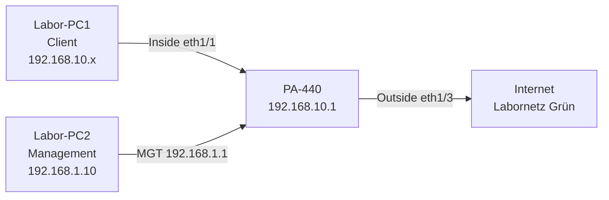
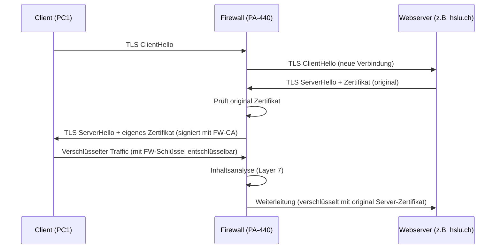
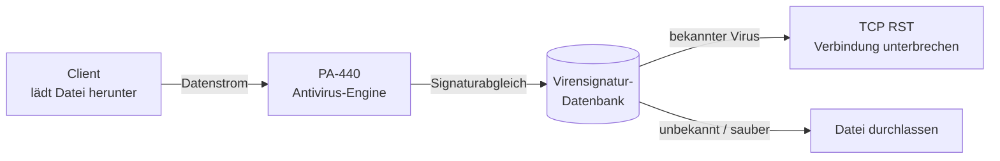
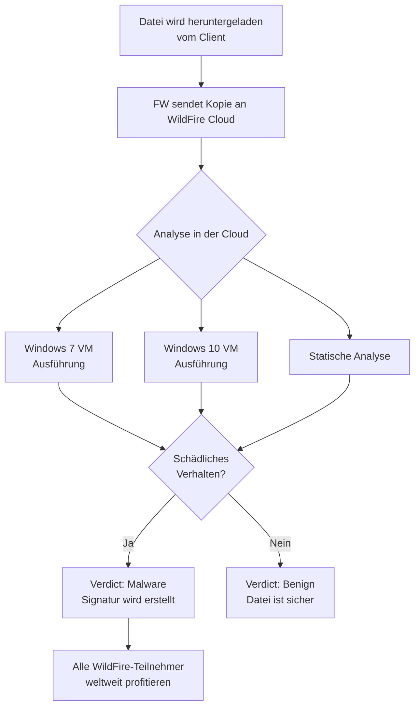
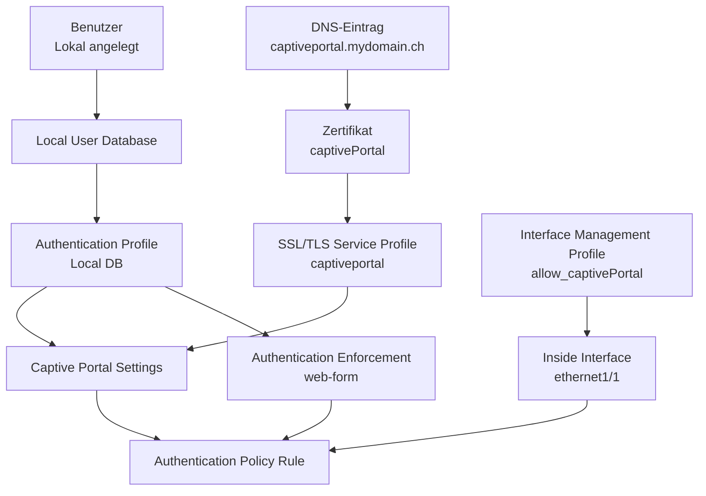
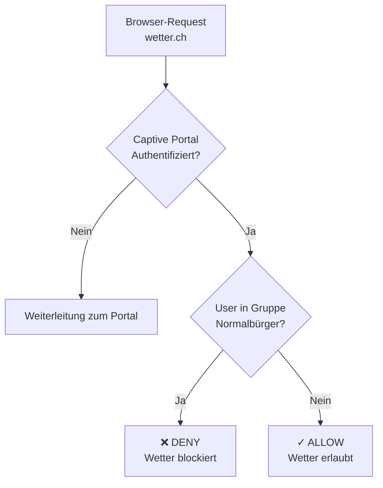
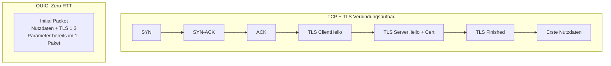
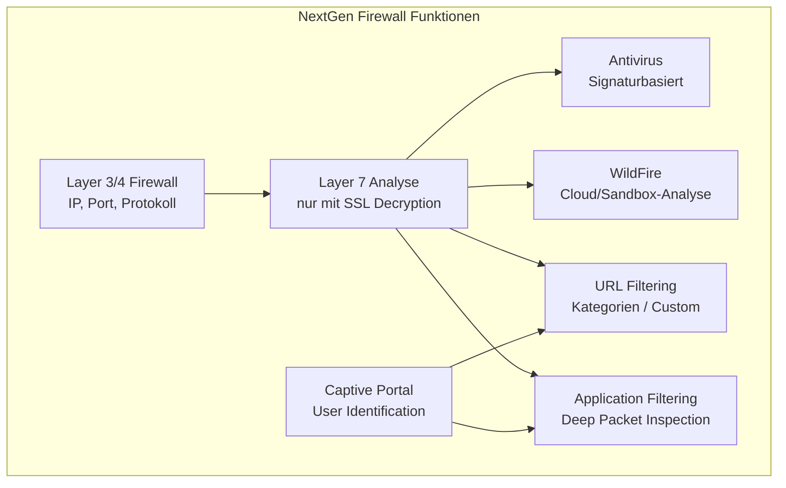

## Überblick und Lernziele

Dieses Labor baut auf der Basiskonfiguration einer Palo Alto PA-440 auf und vertieft die erweiterten Funktionen einer **Next Generation Firewall (NGFW)**. Der zentrale Unterschied zu einer klassischen Firewall liegt darin, dass eine NGFW den Netzwerkverkehr nicht nur auf Layer 3/4 (IP-Adressen, Ports) analysiert, sondern bis auf **OSI-Layer 7** (Anwendungsschicht) prüfen kann. Dies ermöglicht feingranulare Kontrolle über Inhalte, Applikationen und Nutzerverhalten.

**Lernziele:**
- Firewalling mit vollständiger Layer 7-Prüfung konfigurieren (SSL Decryption)
- Malware-Schutz durch Antivirus-Profile und WildFire-Cloud-Analyse einrichten
- Authentifizierung via Captive Portal implementieren
- URL-Blocking und nutzerbasierte Zugriffssteuerung konfigurieren
- Application-Filtering (z. B. YouTube-Streaming vs. YouTube allgemein) verstehen
- Social Media Tracking mit Firewall-Regeln unterbinden

---

## 1. Netzwerkinfrastruktur des Labors

### Physische Topologie

Das Labor besteht aus zwei PCs und einer Palo Alto PA-440 Firewall:

- **Labor-PC1 (Client-PC):** Simuliert einen internen Client in der *Inside-Zone*
- **Labor-PC2 (Management-PC):** Verwaltet die Firewall über die Management-Schnittstelle
- **PA-440:** Die NGFW trennt Inside-Zone vom Internet (Outside-Zone)

### Logische Netzwerkadressen

| Segment | Netzwerk | Schnittstelle | Konfiguration |
|---|---|---|---|
| Management | 192.168.1.0/24 | MGT | Statisch (.1 = FW, .10 = PC2) |
| Inside | 192.168.10.0/24 | eth1/1 | DHCP-Server auf FW (Range .100–.200) |
| Outside | — | eth1/3 | DHCP-Client (Labornetz Grün) |



### Wichtige Voraussetzung: Proxy-Einstellungen zurücksetzen

Bevor das Labor beginnen kann, müssen eventuell vorhandene **Proxy-Einstellungen** unter Windows und in Firefox deaktiviert werden. Diese wurden möglicherweise in früheren Übungen gesetzt und würden die Funktionalität der Firewall-Regeln verzerren oder umgehen.

---

## 2. Firewalling mit vollständiger Layer 7-Prüfung (SSL Decryption)

### Warum ist SSL Decryption notwendig?

Die meisten modernen Webverbindungen sind über **HTTPS/TLS verschlüsselt**. Eine klassische Firewall sieht bei verschlüsseltem Traffic nur:
- Quell- und Ziel-IP-Adresse
- Port (443 für HTTPS)
- Paketgröße und Zeitstempel

Der **Inhalt** (welche URL, welche Datei, welches Protokoll auf Applikationsebene) bleibt verborgen. Ohne Entschlüsselung sind Funktionen wie Antivirus-Scanning, URL-Filtering oder Application-Identification **nicht möglich**.

### Wie funktioniert SSL Forward Proxy?

Die Firewall agiert als **Man-in-the-Middle** – allerdings ein autorisierter, kontrollierter. Das Prinzip:



Der Client baut eine TLS-Verbindung **zur Firewall** auf (nicht zum echten Server). Die Firewall baut parallel eine Verbindung **zum echten Server** auf. Dazwischen kann die Firewall den Klartext analysieren und dann neu verschlüsseln.

### Konfigurationsschritte

#### Schritt 1: CA-Zertifikat erstellen

Ein **Stammzertifikat (Root CA)** muss auf der Firewall erstellt werden. Dieses wird verwendet, um für jede abgefangene HTTPS-Verbindung dynamisch ein neues Serverzertifikat zu generieren.

**Einstellungen für das CA-Zertifikat (`myCACert`):**

| Parameter | Wert | Begründung |
|---|---|---|
| Certificate Type | Local | Lokal auf der FW gespeichert |
| Certificate Name | myCACert | Beliebiger Name |
| Common Name | fw01.mydomain.ch | Identität der FW-CA |
| Signed By | *(leer)* | Self-signed CA |
| Certificate Authority | ✓ aktiviert | Definiert als CA |
| Algorithm | RSA | Verbreiteter asymmetrischer Algorithmus |
| Number of Bits | **4096** | Hohe Sicherheit – von Browsern gefordert |
| Digest | **SHA-512** | Starker Hash-Algorithmus |

> **Warum 4096 Bit und SHA-512?** Moderne Browser (Chrome, Firefox) lehnen Zertifikate ab, die mit schwachen kryptografischen Parametern erstellt wurden. SHA-1 ist seit Jahren kompromittiert; 2048-Bit-RSA gilt noch als akzeptabel, aber 4096 Bit erhöht die Sicherheit deutlich.

Nach der Erstellung müssen drei Checkboxen aktiviert werden:
- **Forward Trust Certificate** – verwendet für vertrauenswürdige Seiten
- **Forward Untrust Certificate** – für nicht vertrauenswürdige Seiten (zeigt Warnung)
- **Trusted Root CA** – markiert die FW als vertrauenswürdige CA

#### Schritt 2: Decryption Policy erstellen

Unter `Policies → Decryption` wird eine Regel angelegt:

| Parameter | Wert |
|---|---|
| Source Zone | Any |
| Destination Zone | Outside |
| Action | **Decrypt** |
| Type | **ssl-forward-proxy** |

#### Schritt 3: CA-Zertifikat auf dem Client-PC installieren

Da das FW-CA-Zertifikat **selbstsigniert** ist und keiner öffentlich anerkannten CA angehört, zeigt der Browser eine Sicherheitswarnung. Der Client kennt den Aussteller nicht und vertraut ihm nicht.

**Lösung:** Das CA-Zertifikat muss im Windows-Zertifikatsspeicher als **vertrauenswürdige Stammzertifizierungsstelle** eingetragen werden.

```
Ablauf:
1. Firefox → Advanced → View Certificate → fw01.mydomain.ch → PEM (cert) herunterladen
2. Datei umbenennen: .cer Endung vergeben
3. Doppelklick → Certificate Import Wizard
4. Store: "Trusted Root Certification Authorities"
5. Firefox neu starten
```

Nach erfolgreicher Installation zeigt Firefox zwar noch einen Hinweis ("Mozilla erkennt diesen Aussteller nicht"), aber **keine Fehlermeldung** mehr – die Verbindung wird als sicher akzeptiert.

> **Wichtig:** Ohne funktionierende SSL-Decryption sind **alle nachfolgenden Laborfunktionen** (Antivirus, URL-Filtering, Application-Filtering) **nicht vollständig funktionsfähig**, da sie den entschlüsselten Traffic benötigen.

---

## 3. Malware Threat Analysis

### 3.1 Antivirus Threat Analysis

#### Konzept und Funktionsprinzip

Die **Antivirus-Funktion** der Palo Alto Firewall funktioniert ähnlich wie klassische Antivirensoftware auf Endgeräten – aber mit einem entscheidenden Unterschied: **Der Scan findet am Netzwerkperimeter statt**, während Dateien über das Netzwerk übertragen werden ("inline scanning").



Die Firewall vergleicht den Datenstrom mit einer **Datenbank bekannter Viren-Signaturen**. Diese Datenbank muss regelmäßig aktualisiert werden – analog zu Antivirensoftware auf dem PC.

#### EICAR-Testdatei

Das **European Institute for Computer Antivirus Research (EICAR)** hat eine spezielle Testdatei definiert. Die Datei enthält folgende harmlose Zeichenkette, die jedoch von allen Antivirenprogrammen als "Virus" erkannt wird:

```
X5O!P%@AP[4\PZX54(P^)7CC)7}$EICAR-STDARD-ANTIVIRUS-TEST-FILE!$H+H*
```

**Vor Aktivierung des Antivirus-Profils:** Die Datei wird heruntergeladen; Windows Defender erkennt und löscht sie lokal.

**Nach Aktivierung des Antivirus-Profils:** Die Firewall blockiert den Download **bevor die Datei den Client erreicht**. Der `wget`-Befehl gibt eine Fehlermeldung zurück.

#### Konfiguration

1. `Policies → Security` → bestehende Inside→Outside Regel bearbeiten
2. Im `Actions`-Tab: **Profile Type → Profiles** auswählen
3. **Antivirus: default** auswählen
4. Commit

#### Welcher Traffic sollte gescannt werden?

| Richtung | Scannen? | Begründung |
|---|---|---|
| Inside → Outside | ✓ Ja | Verhindert Upload von Malware nach außen; Inside-Clients könnten infiziert sein |
| Outside → DMZ | ✓ Ja | Externe Angreifer könnten Malware in die DMZ einschleusen |
| DMZ → Outside | ✓ Ja | Kompromittierte DMZ-Server könnten Malware versenden |
| Outside → Inside | ⚠️ Bedingt | Bei stateful Firewall: Rückverkehr bereits erlaubter Sessions wird implizit behandelt |

> **Grundsatz:** Generell sollte **jeder Verkehr gescannt** werden. Das einzige Gegenargument sind mögliche Leistungseinbußen durch die erhöhte Verarbeitungszeit.

#### Technischer Hintergrund: TCP RST als Abwehrmechanismus

Wenn die Firewall Malware im Datenstrom erkennt, sendet sie ein **TCP Reset (RST) Paket** an beide Verbindungspartner. Dies unterbricht die TCP-Verbindung sofort, sodass keine weiteren Daten übertragen werden. Die `Action: reset-server` bedeutet konkret:

- Die Firewall sendet ein TCP RST-Paket an den **Server** (Quelle der Malware)
- Die laufende TCP-Verbindung wird beidseitig beendet
- Die Malware kann nicht vollständig übertragen werden

### 3.2 WildFire Cloud Solution

#### Was ist WildFire?

**WildFire** ist Palo Altos cloudbasierter Malware-Analyse-Dienst. Er geht über die klassische Signaturerkennung hinaus und verwendet:

- **Dynamische Analyse:** Ausführung verdächtiger Dateien in virtuellen Maschinen (Sandbox)
- **Statische Analyse:** Analyse von Dateistruktur und Code ohne Ausführung
- **Machine Learning:** Muster-Erkennung für unbekannte Bedrohungen
- **Bare Metal Analysis:** Ausführung auf echter Hardware (umgeht VM-Erkennung durch Malware)



#### Kollektiver Schutz

Der entscheidende Vorteil von WildFire ist die **globale Wissensbasis**: Wenn ein Nutzer weltweit eine neue Malware entdeckt und WildFire sie als solche klassifiziert, erhalten **alle WildFire-Teilnehmer automatisch** einen neuen Schutz. Das System lernt kundenübergreifend.

#### Limitation: Zeitverzögerung

WildFire hat eine wichtige Einschränkung: Die Analyse dauert einige Minuten. In dieser Zeit **kann die Datei bereits heruntergeladen worden sein**. WildFire blockiert nicht sofort (wie Antivirus), sondern:

1. Datei wird heruntergeladen (nicht blockiert)
2. Kopie wird an die Cloud gesendet
3. Cloud analysiert und erstellt ggf. eine Signatur
4. Zukünftige Downloads derselben Datei werden blockiert

Dies ist ein **reaktiver Schutzmechanismus** für Zero-Day-Malware (noch unbekannte Viren), während Antivirus ein **proaktiver Schutzmechanismus** für bekannte Signaturen ist.

#### WildFire Analyse-Report

Der Analysis Report zeigt:
- Herkunftsdaten und Download-Uhrzeit
- Welche VMs zur Analyse verwendet wurden
- Konkrete schädliche Aktionen (z.B. Dateisystemänderungen, Registry-Einträge)
- Finale Bewertung: **Malware** oder **Benign**

> **Beispielbefund:** Eine Testdatei wurde auf Windows 7 und Windows 10 ausgeführt. Auf Windows 7 wurden Dateien verändert und Registry-Einträge gesetzt → als Malware klassifiziert. Auf Windows 10 blieb das Verhalten unkritisch.

---

## 4. Authentication – Captive Portal

### Konzept: Authentifizierung vs. Autorisierung

| Begriff | Bedeutung | Beispiel |
|---|---|---|
| **Authentifizierung** | Wer bist du? | Username + Passwort eingeben |
| **Autorisierung** | Was darfst du? | Wetter-Websites nur für Admins |

In der Praxis werden beide oft kombiniert. Ein **Captive Portal** erzwingt die Authentifizierung beim Netzwerkzugang – bekannt aus Hotels, Flughäfen oder Konferenzzentren.

### Konfigurationsarchitektur

Das Captive Portal besteht aus vielen verknüpften Komponenten. Das Zusammenspiel ist wichtig zu verstehen:



### Schritt-für-Schritt Konfiguration

#### 1. Benutzer anlegen

Unter `Device → Local User Database → Users` wird ein lokaler Benutzer mit Passwort angelegt. Die Groß-/Kleinschreibung des Benutzernamens ist relevant.

> **Warum lokale Benutzerverwaltung suboptimal ist:** In einem Unternehmen mit 200 Mitarbeitern wäre es unpraktikabel, jeden Nutzer manuell auf der Firewall zu verwalten. Besser: Integration mit **Active Directory (AD)** oder einem **LDAP-Verzeichnisserver**. So werden Konten zentral verwaltet und Änderungen (Mitarbeiter tritt aus) greifen sofort.

#### 2. DNS-Eintrag

Das Captive Portal braucht einen DNS-Namen, damit Browser darauf umgeleitet werden können:

| Feld | Wert |
|---|---|
| Name | captiveportal |
| FQDN | captiveportal.mydomain.ch |
| IP-Adresse | 192.168.10.1 (Inside-Interface der FW) |

> **Was ist ein FQDN?** Ein **Fully Qualified Domain Name** ist der vollständige Domainname eines Hosts innerhalb des DNS. Er identifiziert ein Gerät eindeutig im Netzwerk, z.B. `captiveportal.mydomain.ch` (Hostname + Domain + TLD).

#### 3. Zertifikat für Captive Portal

Da das Portal über HTTPS erreichbar sein muss, braucht es ein gültiges TLS-Zertifikat. Dieses wird von der zuvor erstellten CA (`myCACert`) signiert:

| Parameter | Wert |
|---|---|
| Certificate Name | captivePortal |
| Common Name | captiveportal.mydomain.ch |
| Signed By | myCACert |
| Algorithm | RSA 2048 Bit, SHA-256 |
| SAN (Subject Alternative Name) | captiveportal.mydomain.ch |

> **Warum ist der SAN-Eintrag wichtig?** Moderne Browser prüfen nicht nur den Common Name, sondern den **Subject Alternative Name (SAN)** für die Hostnamensvalidierung. Fehlt der SAN-Eintrag, zeigt der Browser trotz korrektem Common Name eine Zertifikatswarnung.

#### 4. SSL/TLS Service Profile

Definiert die TLS-Mindestversion für die Captive-Portal-Verbindung:
- **Min Version: TLSv1.2** (TLS 1.0 und 1.1 sind seit 2020 als veraltet erklärt und von Browsern nicht mehr unterstützt)
- **Max Version: Max** (aktuellste verfügbare Version)

#### 5. Authentication Profile

Verknüpft die Benutzer-Datenquelle:
- **Type: Local Database** – prüft Zugangsdaten gegen die lokale FW-Datenbank
- **Allow List: all** – alle Benutzer aus der DB dürfen sich authentifizieren

#### 6. Captive Portal Settings

Im `Device → User Identification → Authentication Portal`:
- SSL/TLS Service Profile: `captiveportal`
- Authentication Profile: `local database authentication`
- Redirect Host: `captiveportal.mydomain.ch`
- Mode: **Redirect** (Browser wird auf Portal-URL umgeleitet)

#### 7. Authentication Enforcement

Verknüpft die Authentifizierungsmethode (`web-form`) mit dem Authentication Profile.

#### 8. Authentication Policy Rule

Bestimmt **wer sich wann authentifizieren muss**:

| Feld | Wert |
|---|---|
| Source Zone | inside |
| User | any |
| Destination | any |
| Service | service-https, service-http |
| Action | captivePortal (Authentication Enforcement) |

#### 9. User Identification aktivieren

In `Network → Zones → Inside`: **Enable User Identification** aktivieren – nur so kann die Firewall den authentifizierten Nutzer den Traffic-Flüssen zuordnen.

#### 10. Interface Management Profile

Das Captive Portal muss über das Inside-Interface erreichbar sein. Das erfordert ein Interface Management Profile `allow_captivePortal` mit:
- **Ping:** aktiviert
- **Response Pages (Captive Portal):** aktiviert
- **Permitted IP Addresses:** 192.168.10.0/24

---

## 5. Layer 7 Web-Filtering

### 5.1 URL-Blocking

#### Konzept

URL-Blocking ermöglicht es, ganze **Websites oder URL-Kategorien** zu sperren. Im Labor wird eine Custom URL Category `block weather` erstellt, die Wetter-Websites blockiert.

Mit **Wildcards (`*`)** können Domains flexibel definiert werden:

| URL-Muster | Beispiele die zutreffen |
|---|---|
| `*.meteo.ch` | www.meteo.ch, m.meteo.ch, aber NICHT meteo.ch selbst |
| `meteo.ch` | Nur genau meteo.ch |
| `*.srf.ch/meteo` | Alle Subdomains von srf.ch mit Pfad /meteo |

**Testfragen – welche Domains werden blockiert (bei den Einträgen `*.meteo.ch`, `meteo.ch`, `*.srf.ch/meteo`):**

| Domain | Blockiert? | Warum |
|---|---|---|
| meteo.ch | ✓ Ja | Exakter Eintrag `meteo.ch` |
| m.meteo.ch | ✓ Ja | Passt auf `*.meteo.ch` |
| meteo.com | ✗ Nein | Andere TLD, kein passender Eintrag |
| www.srf.ch/meteo | ✓ Ja | Passt auf `*.srf.ch/meteo` |
| wetter.ch | ✗ Nein | Kein passender Eintrag |

#### Security Policy Konfiguration

Eine neue Regel **oberhalb** der `inside-outside-allow`-Regel:

| Feld | Wert |
|---|---|
| Source | inside |
| Destination | outside |
| URL Category | block weather |
| Action | **Deny** |

> **Warum oberhalb der Allow-Regel?** Firewall-Regeln werden **von oben nach unten** abgearbeitet. Die erste passende Regel gewinnt ("first match wins"). Die Block-Regel muss deshalb vor der Allow-Regel stehen, sonst würde Traffic zuerst durch die Allow-Regel erlaubt, bevor die Block-Regel geprüft wird.

**Was erscheint bei blockierten Seiten?** Nicht der typische Browser-Fehlerscreen, sondern eine **eigene Blockierungsseite der Palo Alto Firewall** – möglich dank SSL Decryption und Layer 7-Fähigkeit.

### 5.2 URL-Blocking auf Nutzer-Basis

Durch die Captive Portal Authentifizierung kann die Firewall identifizieren, **welcher Benutzer** hinter einer IP-Adresse steckt. Dies ermöglicht **nutzerbasierte Regeln**.

**Szenario:** Ein Meteorologe aus dem Verwaltungsrat braucht Zugriff auf Wetter-Websites. Normale Mitarbeiter sollen weiterhin blockiert bleiben.

**Lösung:**
1. Zweiten Benutzer (z.B. `c-level_Guy`) anlegen
2. Eine Gruppe `Normalbürger` erstellen und den ersten Benutzer hinzufügen
3. Block-Regel anpassen: Source User → Gruppe `Normalbürger`



Da die Deny-Regel **nur für Mitglieder der Gruppe** gilt, haben alle anderen Nutzer (inkl. `c-level_Guy`) automatisch Zugriff – ohne explizite Allow-Regel.

**Captive Portal Sessions zurücksetzen** (für Tests):
```bash
debug user-id reset captive-portal ip-address 192.168.10.100
```
Dies erzwingt eine erneute Anmeldung beim nächsten Seitenaufruf.

### 5.3 Application Filtering und das QUIC-Problem

#### Das Problem mit QUIC

**QUIC (Quick UDP Internet Connections)** ist ein von Google entwickeltes Transportprotokoll (standardisiert durch IETF im Mai 2021), das auf UDP basiert und TCP für Webanwendungen ersetzen soll.



**Vorteile von QUIC:**
- Kein mehrstufiger Verbindungsaufbau (0-RTT für bekannte Server)
- TLS 1.3 ist fest integriert
- Schnellere Verbindungswiederherstellung bei Paketverlust

**Sicherheitsprobleme von QUIC für Firewalls:**

| Problem | Erklärung |
|---|---|
| Keine Layer 7-Erkennung | Firewalls behandeln QUIC wie generischen UDP-Traffic |
| Kein SSL Decryption | QUIC-Traffic kann nicht entschlüsselt und analysiert werden |
| Web-Filtering umgangen | URL-Filtering, App-Filtering wirken nicht auf QUIC-Traffic |
| Malware-Scan unmöglich | Antivirus kann Dateien im QUIC-Stream nicht scannen |
| Kein Reporting | Logging-Funktionen für Web-Traffic greifen nicht |

> **Reales Problem:** Wenn QUIC blockiert wird, switcht YouTube (und andere Google-Dienste) automatisch auf TCP+TLS zurück. Die Applikation funktioniert weiterhin – aber die Sicherheitsfunktionen der Firewall greifen wieder.

#### Lösung: QUIC blockieren

```
Security Policy:
- Source: any
- Destination: outside  
- Application: quic
- Service: any (wichtig! QUIC läuft auf UDP)
- Action: Deny
```

#### YouTube-Streaming blockieren

Nach dem Blockieren von QUIC weicht YouTube auf TCP aus – Videos spielen weiterhin. Um das eigentliche Streaming zu blockieren, braucht es eine **Application-basierte Regel**:

```
Security Policy:
- Source: any
- Destination: outside
- Application: youtube-streaming
- Service: any
- Action: Deny
```

Die Palo Alto Firewall kann durch Deep Packet Inspection erkennen, ob TCP-Traffic das `youtube-streaming` Applikations-Muster zeigt – **unabhängig von URL oder Port**.

**Wichtige Erkenntnis:** Mit Application Filtering kann man feingranular entscheiden:
- YouTube-Videos streamen: **blockiert** (`youtube-streaming`)
- YouTube-Kommentare lesen/schreiben: **erlaubt** (andere App-Signatur)

Dies ist mit reinem URL-Blocking **nicht möglich**, da beides über dieselbe Domain `youtube.com` läuft.

---

## 6. Social Media Tracking

### Facebook Tracking-Methoden

Facebook (Meta) nutzt verschiedene Technologien um Nutzerverhalten auch **außerhalb** der Facebook-Plattform zu verfolgen:

| Technologie | Funktionsprinzip |
|---|---|
| **Like-Button** | JavaScript-Code sendet Besuchsdaten an Facebook wenn der Button auf einer Website sichtbar ist |
| **Facebook Pixel** | Unsichtbarer 1×1 Pixel-Code auf Websites; verfolgt Seitenbesuche, Käufe, Warenkorbaktionen |
| **Location Tracking** | GPS-Daten über die App |
| **3rd Party Data Correlation** | Verknüpfung mit externen Datensätzen |

### Datenschutzrechtliche Entwicklung (DSGVO)

Seit der DSGVO-Einführung in der EU ist Facebook verpflichtet, für das Tracking eine explizite Einwilligung einzuholen. Die sozialen Plugins (Like- und Kommentieren-Button) sind für EU-Nutzer nur aktiv, wenn:
1. Der Nutzer bei Facebook eingeloggt ist **und**
2. Cookies für Apps und Websites genehmigt wurden

### Blocking mit Layer 7 Application Filtering

Die NGFW kann gezielt **nur das Tracking** blockieren, ohne Facebook als Ganzes zu sperren:

```
Security Policy:
- Source: inside
- Destination: outside
- Application: facebook-social-plugin
- Service: any
- Action: Deny
```

Dies ist der Kernvorteil von Application-Based Filtering gegenüber URL-Blocking: Es können **Teilfunktionen** einer Website blockiert werden.

---

## 7. Aufräumen und Best Practices

### Warum Aufräumen wichtig ist

In einem Labor-Umfeld teilen sich mehrere Teams dieselbe Hardware. Nicht bereingte Konfigurationen können für Nachfolger zu Problemen führen, insbesondere:
- **SSL-Zertifikate im Windows-Speicher:** Alte CA-Zertifikate können `SEC_ERROR_BAD_SIGNATURE` Fehler verursachen
- **Firewall-Konfiguration:** Custom Rules und Policies können Tests verfälschen

### Bereinigungsschritte

1. Zertifikat `fw01.mydomain.ch` aus Windows-Zertifikatsspeicher entfernen (sowohl `Current User` als auch `Local Computer`, Speicher: `Trusted Root Certification Authorities`)
2. Firewall-Konfiguration auf `default_config.xml` zurücksetzen
3. Commit auf der Firewall
4. Netzwerk-Adapter-Reset-Script auf beiden Labor-PCs ausführen

---

## Zusammenfassung: Architektur einer NextGen Firewall



| Funktion | Ohne SSL Decryption | Mit SSL Decryption |
|---|---|---|
| Layer 3/4 Filtering | ✓ Funktioniert | ✓ Funktioniert |
| Antivirus Scan | ✗ Nur unverschlüsselter Traffic | ✓ Vollständig |
| WildFire Analyse | ✗ Eingeschränkt | ✓ Vollständig |
| URL Blocking | ⚠️ Nur Hostname (SNI) | ✓ Vollständige URL |
| Application Filtering | ⚠️ Eingeschränkt | ✓ Vollständig |
| Captive Portal | ✓ Unabhängig | ✓ Unabhängig |

---

## Weiterführende Ressourcen

- [Palo Alto WildFire Datasheet](https://www.paloaltonetworks.com/resources/datasheets/wildfire)
- [Palo Alto Security Profiles Actions](https://docs.paloaltonetworks.com/pan-os/9-1/pan-os-web-interface-help/objects/objects-security-profiles/actions-in-security-profiles)
- [How QUIC Impacts Network Security (FastVue)](https://www.fastvue.co/fastvue/blog/googles-quic-protocols-security-and-reporting-implications/)
- [Chromium Blog: QUIC Update](https://blog.chromium.org/2015/04/a-quic-update-on-googles-experimental.html)
