import Callout from '../../../../components/Callout.astro';

<Callout type="green"> 
## 1. Die drei Säulen der Informationssicherheit
</Callout>
Bevor wir uns dem Menschen widmen, ist es wichtig zu verstehen, dass Informationssicherheit nie aus einer einzigen Perspektive betrachtet werden kann. Sie basiert auf **drei gleichwertigen Säulen**:

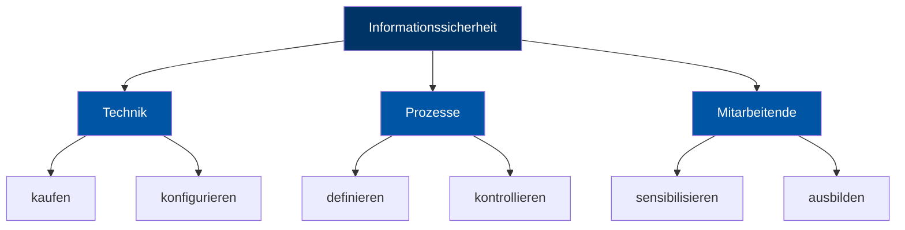

**Warum alle drei Säulen?**  
Technische Massnahmen allein reichen nicht aus – ein Virenschutzprogramm schützt nicht vor einem Mitarbeitenden, der leichtfertig sein Passwort weitergibt. Prozesse ohne Technik sind wirkungslos, und Technik ohne geschulte Menschen ebenfalls. Nur das Zusammenspiel aller drei Bereiche ergibt eine robuste Sicherheitsarchitektur.

---
<Callout type="green"> 
## 2. Was ist «Awareness»?
</Callout>
Das englische Wort **«awareness»** bedeutet auf Deutsch **Bewusstsein** – im Sinne von: sich einer Sache bewusst sein, informiert sein.

> *"Awareness = Bewusstsein: sich einer Sache bewusst sein, wissen, dass etwas existiert oder passiert."*

Im Kontext der Informationssicherheit bedeutet Awareness:
- Wissen, **welche Risiken** im digitalen Alltag lauern
- Verstehen, **warum** bestimmte Verhaltensweisen gefährlich sind
- Die Fähigkeit, **sicher zu handeln** – auch ohne ständige Anleitung

Awareness ist kein einmaliges Ereignis, sondern ein **kontinuierlicher Prozess** der Sensibilisierung und Schulung.

---
<Callout type="green"> 
## 3. Der Faktor Mensch
</Callout>

### Daten – Informationen – Wissen

Um zu verstehen, warum Informationssicherheit wichtig ist, hilft folgendes Pyramidenmodell:

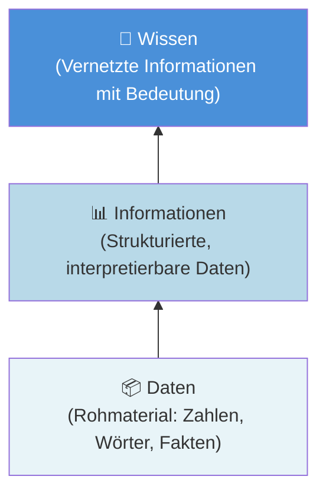

**Information** ist die Verknüpfung von Daten zu interpretierbaren Zusammenhängen. **Wissen** entsteht durch die Vernetzung von Informationen – und ist zunächst personenbezogen.

> *«Wissen ist Macht» – Francis Bacon (1561–1621)*

Wissen ist im 21. Jahrhundert der wichtigste Rohstoff moderner Ökonomien. Deshalb: **Informationen müssen vor Missbrauch geschützt werden!**

---

<Callout type="green"> 
## 3. Der Faktor Mensch
</Callout>

### Der Mensch: Grösstes Risiko UND grösster Schutz

Ein oft zitierter Satz in der IT-Sicherheit lautet:

> **Das grösste Sicherheitsrisiko sitzt zwischen Bildschirm und Tastatur – der Benutzer.**

Doch das ist nur die halbe Wahrheit. Dieselbe Person, die eine Sicherheitslücke aufreisst, kann – richtig sensibilisiert – auch der beste Schutzwall sein.

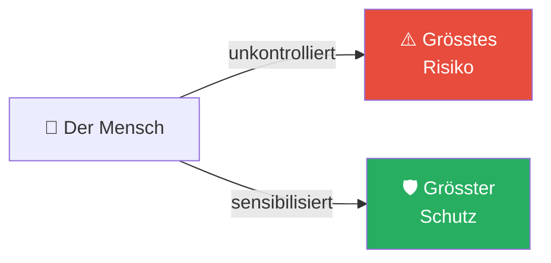

### Warum ist der Mensch ein Sicherheitsrisiko?

Die Vorlesung nennt acht typische menschliche Verhaltensweisen, die Sicherheitsrisiken erzeugen:

| Verhalten | Erklärung |
|---|---|
| **Wissen alles** | Überschätzung des eigenen Wissens führt zu Nachlässigkeit |
| **Neigen zur Bequemlichkeit** | Einfache Passwörter, kein Backup, keine Updates |
| **Können nicht alles überblicken** | Komplexe Systeme überfordern normale Benutzer |
| **Können/Wollen nicht alles verstehen** | Technische Details werden ignoriert |
| **Hassen Regelungen** | Sicherheitsrichtlinien werden als lästig empfunden |
| **Wollen immer das Neuste** | Neue, ungetestete Software installieren |
| **Lernen durch Leiden** | Erst nach einem Schaden werden Massnahmen ergriffen |
| **Sind Opfer der Technik** | Werden durch irreführende Oberflächen getäuscht |

**Fazit:** Das Potenzial der Mitarbeitenden muss aktiv eingebunden werden – sowohl um Risiken zu minimieren als auch um Schutz zu maximieren.

---
<Callout type="green"> 
## 4. Malware-Typen
</Callout>
Malware (von englisch *malicious software*) bezeichnet **Computerprogramme mit schädlichen Funktionen**. Es gibt vier Hauptkategorien:

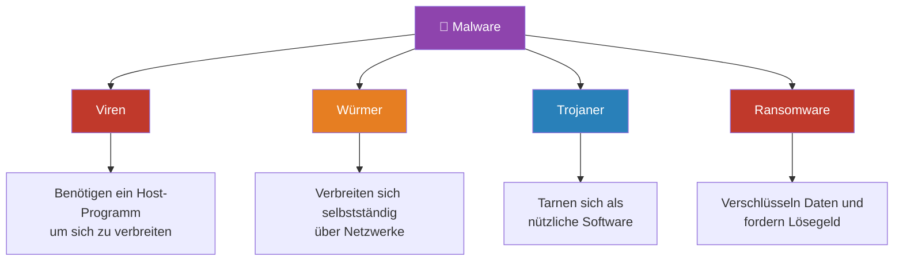

### Viren und Würmer

- **Viren** benötigen eine Host-Software, um sich zu verbreiten – sie hängen sich an bestehende Programme
- **Würmer** verbreiten sich selbstständig über Netzwerke, ohne Host-Programm
- Beide können Dateien löschen, Systeme lahmlegen und weltweite Netzwerke beeinträchtigen
- Häufige Infektionswege: **E-Mail-Anhänge**, infizierte Datenträger, unsichere Downloads

**Warum ist das wichtig zu unterscheiden?**  
Würmer sind gefährlicher für Netzwerke, weil sie sich exponentiell ausbreiten können. Ein einziger infizierter Computer kann in Minuten Tausende weitere infizieren.

---

### Trojaner (Trojanische Pferde)

Ein Trojaner ist ein **Schadprogramm, das als harmlose Anwendung getarnt** ist. Der Name stammt aus dem griechischen Mythos des Trojanischen Pferdes – es sieht von aussen harmlos oder nützlich aus, birgt aber im Inneren eine Bedrohung.

**Was tun Trojaner im Hintergrund?**
- Aufzeichnen von Passwörtern (Keylogger)
- Daten verändern oder löschen
- Mikrofon oder Webcam aktivieren (Abhören)
- Fernzugriff für Angreifer ermöglichen (RAT – Remote Access Trojan)

**Warum fallen Menschen darauf herein?**  
Trojaner werden oft als nützliche Gratissoftware, Spielmodifikationen oder vermeintliche System-Updates verbreitet. Die Benutzer installieren sie freiwillig, weil sie den Schaden nicht erkennen.

---

### Ransomware

Ransomware (von englisch *ransom* = Lösegeld) ist aktuell **eine der grössten Cyberbedrohungen** weltweit.

**Funktionsweise:**
1. Ransomware gelangt auf das System (meist via Phishing-Mail oder Drive-by-Infektion)
2. Sie verschlüsselt Daten oder ganze Systeme mit einem starken Schlüssel
3. Ein Lösegeld wird gefordert – meist in Kryptowährung
4. Der Schlüssel wird *vielleicht* nach Zahlung herausgegeben

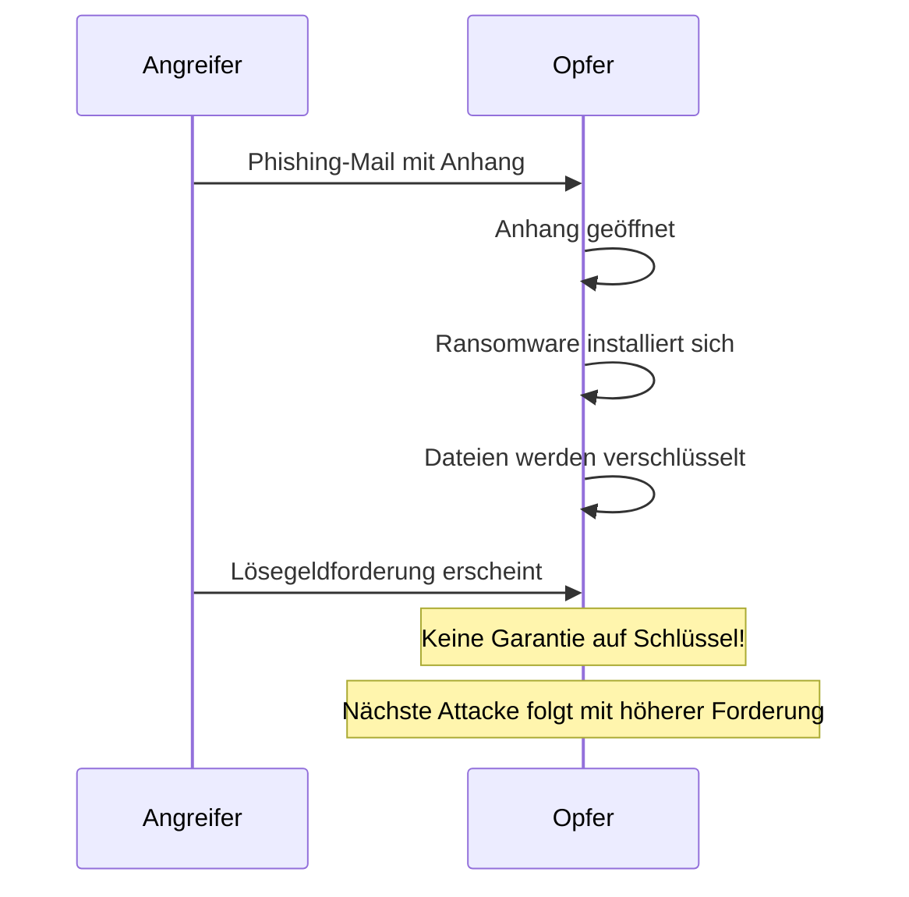

**Statistik (NTT Security Global Threat Intelligence Report 2017):**
- 77% der Ransomware in nur vier Branchen entdeckt
- 73% aller Angriffe begannen mit Phishing-Mails
- Am meisten angegriffen: Gesundheitswesen, Finanzwesen, Industrie

---

### Drive-by-Infektion

Eine besonders heimtückische Methode: **Infizierung allein durch das Besuchen einer Webseite** – ohne dass der Benutzer aktiv etwas herunterlädt.

**Wie funktioniert das?**
1. Angreifer kompromittiert eine legitime Webseite
2. Über aktive Elemente (JavaScript, Flash, etc.) wird Malware eingeschleust
3. Sicherheitslücken im Browser oder Plugins werden ausgenutzt
4. Malware installiert sich im Hintergrund

**Wichtig:** Auch offizielle Websites bekannter Organisationen können betroffen sein. Ein bekanntes Beispiel: Der E-Banking-Trojaner «Gozi» wurde über die Nachrichtenwebseite «20 Minuten» verbreitet.

---

<Callout type="green"> 
## 5. Die 5 Schritte der Informationssicherheit
</Callout>
Dies sind die fünf konkreten Massnahmen, die jeder Benutzer umsetzen sollte:

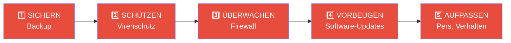

---
<Callout type="yellow"> 
### Schritt 1: Sichern (Backup)
</Callout>
> *«Mit Sicherheitsgurt beim Crash gerettet! Mit Datensicherung vor Datenverlust bewahrt!»*

Studien zeigen, dass ein Grossteil der Menschen erst **nach einem Datenverlust** mit der Datensicherung beginnt. Das ist wie erst nach dem Unfall den Sicherheitsgurt anzulegen.

**Was kann verloren gehen?**  
Fotos, Urlaubserinnerungen, Steuererklärungen, Rechnungen, Arbeitsdokumente, E-Mails, Manuskripte, Notizen – **alles**.

**Warum gehen Daten verloren?**
- Festplatten können (und werden!) kaputt gehen – sie haben eine begrenzte Lebensdauer
- Malware kann Dateien verschlüsseln oder löschen
- Ransomware macht Daten unzugänglich

**Die optimale Backup-Strategie: 3-2-1-Methode**

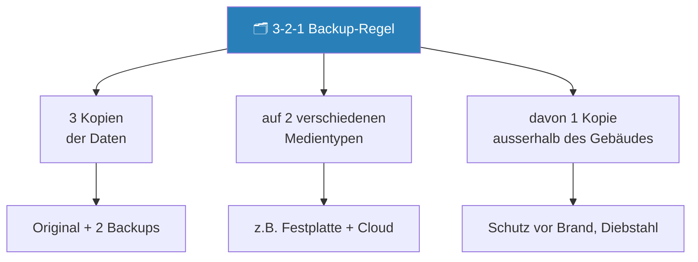

**Wichtige Hinweise:**
- **Welche Daten?** Alle persönlichen und sensiblen Dokumente
- **Welche Medien?** Externe Festplatte, Cloud (Datenschutz beachten!), DVD
- **Wie oft?** Regelmässig, abhängig von der Häufigkeit der Datenänderung
- **Achtung:** Backup-Medium nach dem Backup **vom Computer trennen** und sicher aufbewahren! (Schutz vor Ransomware, die auch angeschlossene Laufwerke verschlüsselt)

---
<Callout type="yellow"> 
### Schritt 2: Schützen (Virenschutz)
</Callout>
Ein Antivirenprogramm (AV) schützt vor Viren, Würmern, Trojanern und Ransomware, indem es:
- Dateien auf bekannte Schadsoftware-Signaturen prüft
- Internet-Kommunikation und E-Mails analysiert
- Verdächtiges Verhalten von Programmen erkennt (Heuristik)

**Entscheidend:** Antivirensoftware muss **automatisch und regelmässig aktualisiert** werden. Eine veraltete AV-Software ist nahezu wertlos, da täglich neue Malware-Varianten erscheinen.

| Plattform | Kostenlose Lösungen | Kostenpflichtige Lösungen |
|---|---|---|
| **Windows 10/11** | Windows Defender (integriert, empfohlen) | Kaspersky, Norton, McAfee |
| **Windows (älter)** | AVAST, AVG, AVIRA | Kaspersky, Panda |
| **macOS** | AVAST, AVIRA, ClamXAV | Sophos, Bitdefender |
| **Android** | AVAST, AVIRA | Kaspersky, Norton |
| **iOS (iPhone)** | Herstellerseitig gesichert | – |

**Empfehlung für Windows 10/11:** Der integrierte **Windows Defender** ist eine zuverlässige, wartungsarme Lösung, die für die meisten Benutzer ausreicht.

---
<Callout type="yellow"> 
### Schritt 3: Überwachen (Firewall)
</Callout>
Eine Firewall ist eine Softwareschicht, die den **ein- und ausgehenden Datenverkehr** kontrolliert und filtert.

**Was macht eine Firewall?**
- Überprüft, welche Verbindungen erlaubt sind und welche blockiert werden
- Verbirgt persönliche Daten gegenüber dem Internet
- Kontrolliert, welche Programme auf das Internet zugreifen dürfen

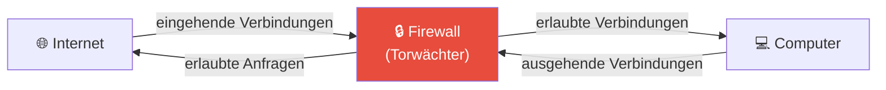

**Aktivierung:**
- **Windows** (7/8/10/11): Firewall ist **standardmässig aktiviert** – nicht deaktivieren!
- **macOS**: Muss **manuell aktiviert** werden unter: *Systemeinstellungen → Sicherheit → Firewall*

---
<Callout type="yellow"> 
### Schritt 4: Vorbeugen (Software-Updates)
</Callout>
Jeden Tag werden neue Sicherheitslücken in weit verbreiteten Programmen entdeckt. Kriminelle suchen gezielt nach diesen Lücken, um sie auszunutzen – bevor sie gepatcht werden.

> **Zero-Day-Exploit:** Eine Sicherheitslücke, die ausgenutzt wird, bevor der Hersteller einen Patch veröffentlicht hat – der Hersteller hat «null Tage» Vorsprung.

**Was muss aktualisiert werden?**
- Betriebssystem (Windows Update, macOS-Updates)
- Browser (Chrome, Firefox, Safari) und alle installierten Plugins
- Adobe-Produkte (Reader, Flash – letzteres inzwischen abgekündigt)
- Office-Software (Microsoft Office, LibreOffice)
- **Alle** anderen installierten Anwendungen

**Wichtig:** Alte, nicht mehr unterstützte Windows-Versionen (XP, Vista, 7, 8.1) erhalten keine Sicherheits-Updates mehr und sind dauerhaft angreifbar. **Upgrades sind keine Option, sondern eine Pflicht.**

---
<Callout type="yellow"> 
### Schritt 5: Aufpassen (Persönliches Verhalten)
</Callout>

Das persönliche Verhalten ist das **wichtigste Sicherheitselement** – und gleichzeitig das schwächste Glied in der Kette. Alle technischen Massnahmen können durch unvorsichtiges Verhalten umgangen werden.

**Kernprinzipien:**
- Eigenverantwortung wahrnehmen
- Den «gesunden Menschenverstand» nutzen
- Sich mit dem Internet und seinen Risiken vertraut machen

---
<Callout type="green"> 
## 6. Passwörter – Das schwächste Glied
</Callout>
Benutzername und Passwort sind nach wie vor die **gängigsten Schlüssel zur digitalen Identität** – und gleichzeitig einer der grössten Schwachpunkte.

**Warum sind Passwörter problematisch?**
- Menschen sind schlecht darin, echte Zufälligkeit zu erzeugen
- Wir neigen zu vorhersehbaren Mustern (Geburtstage, Namen, Tastaturfolgen)
- Gute Passwörter sind schwer zu merken
- Wir verwenden dasselbe Passwort für viele Dienste – **ein kompromittierter Dienst kompromittiert alle anderen**

**Die 50 häufigsten Passwörter weltweit:** `123456`, `password`, `qwerty`, `123123`, `abc123` – solche Passwörter werden **in Minuten geknackt**.

### Passwortqualität – Mathematik dahinter

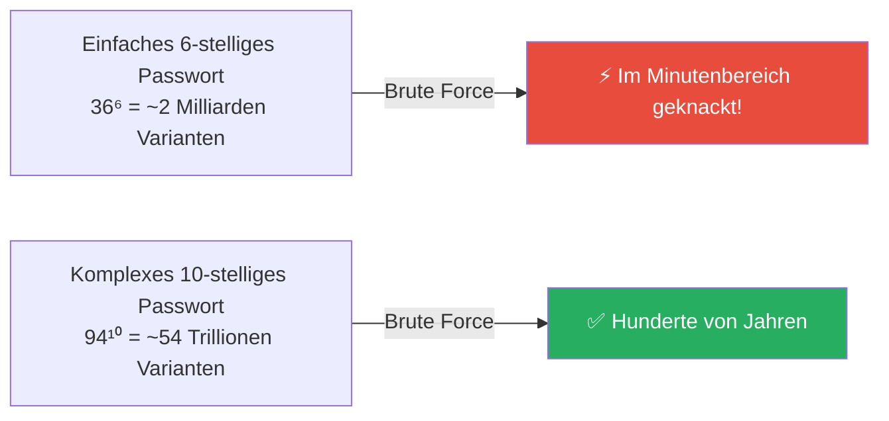

### Die 7 Regeln für sichere Passwörter

1. **Mindestens 12 Zeichen** (je länger, desto besser)
2. **Kombination** aus Ziffern, Gross- und Kleinbuchstaben sowie Sonderzeichen
3. **Keine Tastaturfolgen** (z.B. «asdfgh», «45678», «qwertz»)
4. **Kein Wort** einer bekannten Sprache – das Passwort soll keinen Sinn ergeben
5. **Nie dasselbe Passwort** für mehrere Dienste verwenden
6. Passwort **nicht unverschlüsselt speichern** (kein Post-it am Monitor!)
7. **Sofort ändern** bei Verdacht auf Kompromittierung

### Passwort-Manager (Tresore)

Da es unmöglich ist, für jeden Dienst ein einzigartiges, komplexes Passwort zu merken, empfiehlt sich ein **Passwort-Manager**:

| Tool | URL | Besonderheit |
|---|---|---|
| **1Password** | 1password.com | API zu «Have I Been Pwned» |
| **KeePass** | keepass.info | Open Source, lokal |
| **SafeInCloud** | safe-in-cloud.com | Multi-Plattform |
| **SecureSafe** | securesafe.com | Schweizer Anbieter |
| **Password Safe** | passwordsafe.de | Einfach und sicher |

### Datenschutzverletzungen prüfen: «Have I Been Pwned?»

Der Dienst [haveibeenpwned.com](https://haveibeenpwned.com) sammelt Daten aus bekannten Datenschutzverletzungen und ermöglicht dir zu prüfen, **ob deine E-Mail-Adresse in einem Datenleck auftaucht**. Wenn ja: Passwort sofort ändern!

---

### Multi-Faktor-Authentisierung (MFA)

Selbst ein starkes Passwort kann kompromittiert werden (z.B. durch Phishing, Datenleck, Keylogger). Die Lösung: **Multi-Faktor-Authentisierung (MFA)**, auch «Zwei-Faktor-Authentisierung (2FA)» genannt.

**Prinzip:** Der Benutzer muss sich durch **zwei oder mehr unabhängige Faktoren** identifizieren:

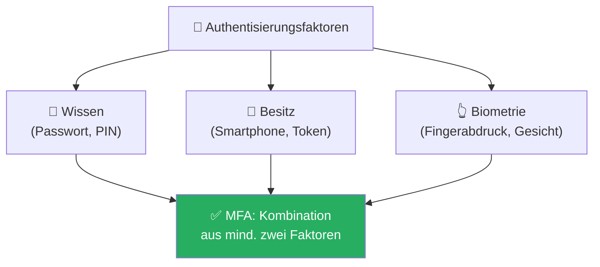

**MFA-Methoden:**
- **Authenticator-App** (Google Authenticator, Microsoft Authenticator): Generiert zeitbasierte Einmalpasswörter (TOTP)
- **SMS-TAN / Foto-TAN**: Code wird per SMS gesendet (weniger sicher als App)
- **Spezifische Banking-App**: Eigener gesicherter Kanal

**Warum ist MFA sicher?**  
Die Sicherheit kommt aus zwei Prinzipien:
1. **Unabhängiger Kanal**: Angreifer müsste Passwort UND physisches Gerät kompromittieren
2. **Einmalige Verwendung**: Jedes OTP (One Time Password) ist nur einmal und nur kurz gültig

---
<Callout type="green"> 
## 7. Phishing
</Callout>
**Phishing** ist ein Kunstwort aus «password» und «fishing» – wörtlich: nach Passwörtern fischen.

### Klassisches Phishing (E-Mail)

**Ablauf eines typischen Phishing-Angriffs:**

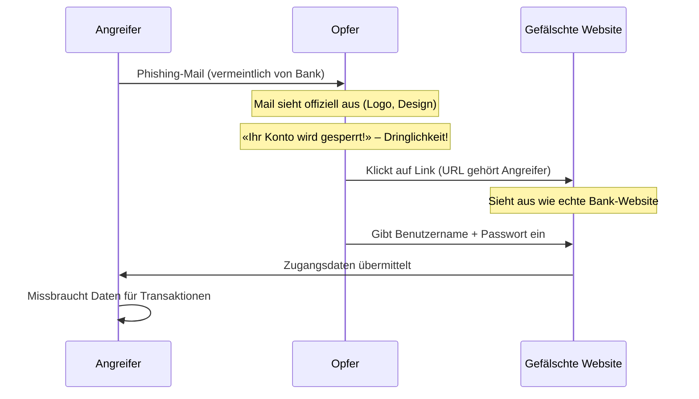

**Erkennungsmerkmale von Phishing-Mails:**
- Absender-E-Mail-Adresse passt nicht zur angeblichen Organisation
- Unpersönliche Anrede («Sehr geehrter Kunde»)
- Künstliche Dringlichkeit («Ihr Konto wird in 24h gesperrt!»)
- Link führt zu einer anderen Domain als der Unternehmenswebseite
- Grammatik- oder Rechtschreibfehler

### Phishing-Varianten

| Variante | Kanal | Beschreibung |
|---|---|---|
| **Klassisches Phishing** | E-Mail | Massenweise versendete gefälschte Mails |
| **Spear Phishing** | E-Mail | Gezielt auf eine Person/Organisation zugeschnitten |
| **Vishing (Voice Phishing)** | Telefon | Anrufer gibt sich als Support, Bank etc. aus |
| **Smishing** | SMS | Phishing via SMS/Messenger |

### Sicherer Umgang mit Online-Diensten

**Beim Einloggen:**
- Adresse des Online-Dienstes **manuell eintippen** oder Lesezeichen verwenden – niemals Links aus E-Mails!
- Beim Login **keine anderen Tabs** öffnen
- **HTTPS und korrekten Domainnamen** im Browser prüfen

**Beim Ausloggen:**
- Dienst über die offizielle **«Abmelden»-Schaltfläche** beenden
- Browser-**Cache** nach jedem Login leeren

---
<Callout type="green"> 
## 8. Schutz vor Ransomware
</Callout>
### Prävention

- Aktuelles Antivirenprogramm und aktive Firewall
- Alle Software aktuell halten (OS, Browser, Plugins)
- **Korrekter Umgang mit E-Mails**: Keine unbekannten Anhänge öffnen
- Office-Makros deaktivieren: *Datei → Optionen → Trust Center → «Alle Makros deaktivieren»*
- **Backup, Backup, Backup** – und das Medium nach dem Backup trennen!

### Im Schadensfall

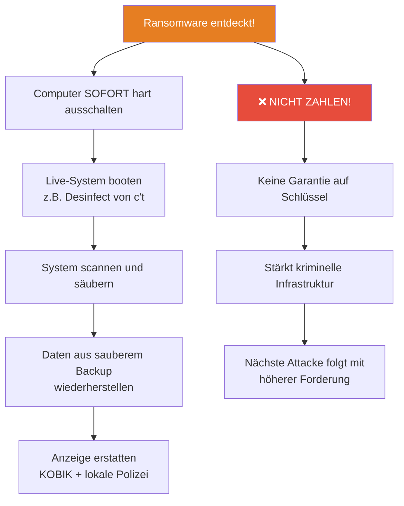

---
<Callout type="green"> 
## 9. Aktuelle Themen
</Callout>
### Smartphones

Smartphones sind vollwertige Computer – mit allen damit verbundenen Risiken. Zusätzlich sind sie:
- Leicht **stehlbar** (physischer Diebstahl + Datenverlust)
- Häufig **schlechter geschützt** als PCs (schwache PINs, keine Verschlüsselung)
- Anfällig für **Malware** (besonders Android)
- Oft mit Apps ausgestattet, die **zu viele Berechtigungen** fordern

**Vorsichtsmassnahmen:**
- Nie **unbeaufsichtigt** lassen
- **Starkes Passwort** oder Fingerabdruckscanner verwenden
- **SIM-PIN** aktivieren, bei Verlust sofort beim Provider sperren lassen
- Nur **notwendige Apps** aus offiziellen Stores installieren
- **Berechtigungen** jeder App prüfen – im Zweifel nicht installieren
- **Niemals** Gesundheits- oder Patientendaten auf dem Smartphone speichern!
- Regelmässige **Backups** der persönlichen Daten
- Alte Geräte vor der Entsorgung **Factory Reset** durchführen

---

### Soziale Medien

Soziale Medien haben vielfältige Auswirkungen auf die Informationssicherheit:

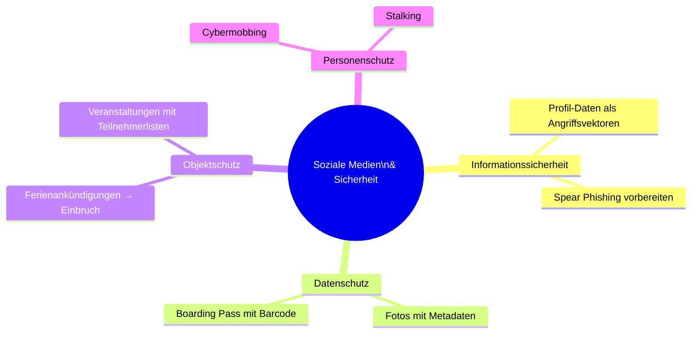

**Wichtige Erkenntnisse:**
- Jede im Internet eingegebene Information wird – **meist dauerhaft** – gespeichert
- Die meisten Social-Media-Anbieter befinden sich **ausserhalb Europas** und unterliegen anderen Datenschutzgesetzen
- Durch Zustimmung zu AGBs können Datenschutzrechte aufgeweicht werden
- **Nichts eingeben**, was irgendwann verfänglich sein könnte (Reisedaten, politische Meinungen, etc.)
- **Privatsphäre-Einstellungen** regelmässig prüfen und aktualisieren

---

### Cloud-Speicher

Cloud-Dienste bieten Komfort, bergen aber auch Risiken:

| | Vorteile | Nachteile |
|---|---|---|
| **Cloud allgemein** | Überall verfügbar, automatisches Backup, einfaches Teilen | Meist im Ausland, Datenschutzfragen, AGBs |
| **Dropbox / OneDrive** | ✅ Verschlüsselte Übertragung | ❌ Keine Speicherung in der Schweiz, keine Verschlüsselung at-rest |
| **iCloud** | ✅ Verschlüsselte Übertragung und Speicherung | ❌ Keine Speicherung in der Schweiz |
| **SecureSafe / HIN Filebox / Speicherbox** | ✅ Schweizer Anbieter, verschlüsselte Übertragung UND Speicherung | Meist kostenpflichtig |

**Für Gesundheits- und Patientendaten:** Nur **Schweizer Cloud-Anbieter** mit verschlüsselter Speicherung verwenden! Dienste wie Dropbox, OneDrive oder iCloud sind **streng verboten** für medizinische Daten.

---
<Callout type="green"> 
## 10. Sichere Datenübertragung
</Callout>
Für den sicheren Versand sensibler Daten per E-Mail:

| Methode | Beschreibung |
|---|---|
| **S/MIME** | Zertifikatbasierte E-Mail-Verschlüsselung, in Outlook integrierbar |
| **PGP / GPG** | Open-Source E-Mail-Verschlüsselung, hohe Sicherheit |
| **7-Zip (AES-256)** | Datei vor dem Versand verschlüsseln, Passwort über anderen Kanal übermitteln |

**Wichtige Regel:** Das Passwort für eine verschlüsselte Datei **immer über einen anderen Kanal** übermitteln (Telefon, SMS, persönlich) – nie in derselben E-Mail!

---
<Callout type="green"> 
## 11. Awareness: Das Konzept
</Callout>
### Was Awareness erreichen soll

Awareness-Massnahmen verfolgen drei Ziele:

1. **Wichtigkeit verstehen**: Mitarbeitende müssen verstehen, warum Sicherheit relevant ist – für das Unternehmen UND für sie persönlich
2. **Prozesse kennen**: Wie läuft eine Awareness-Kampagne ab? Wie wird Erfolg gemessen?
3. **Erfolgsfaktoren anwenden**: Welche Massnahmen funktionieren wirklich, und wie werden sie umgesetzt?

### Der Unterschied zwischen Wissen und Verhalten

Awareness ist mehr als Wissen. Das Ziel ist eine **dauerhafte Verhaltensänderung**:

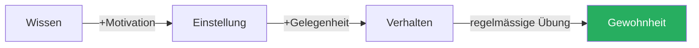

Nur wenn Wissen in Einstellungen übergeht und sich dann im konkreten Verhalten niederschlägt, ist Awareness erfolgreich.

---

<Callout type="green"> 
## 12. Hilfreiche Ressourcen und Meldestellen
</Callout>

### «eBanking – aber sicher!» (EBAS)
- **Website:** [www.ebas.ch](https://www.ebas.ch) / [www.ebankingabersicher.ch](https://www.ebankingabersicher.ch)
- Plattform der HSLU Informatik für persönliche Informationssicherheit
- Enthält Infosheets, Checklisten (z.B. Facebook-Einstellungen), Kurse und einen **Phishing-Test** unter [www.ebas.ch/phishingtest](http://www.ebas.ch/phishingtest)

### Swiss Internet Security Alliance (SISA)
- **Website:** [www.ibarry.ch](https://www.ibarry.ch)
- Hilft bei der Erkennung und Entfernung von Malware-Infektionen
- Bietet einen **Security Check** für deinen PC

### Nationale Meldestellen
| Institution | Zweck | URL |
|---|---|---|
| **NCSC** | Nationales Zentrum für Cybersicherheit | [ncsc.admin.ch](https://www.ncsc.admin.ch) |
| **Anti-Phishing** | Phishing-Mails und -Seiten melden | [antiphishing.ch](https://www.antiphishing.ch) |
| **KOBIK** | Koordinationsstelle zur Bekämpfung der Internetkriminalität | via NCSC |

---
<Callout type="danger"> 
## Zusammenfassung
</Callout>

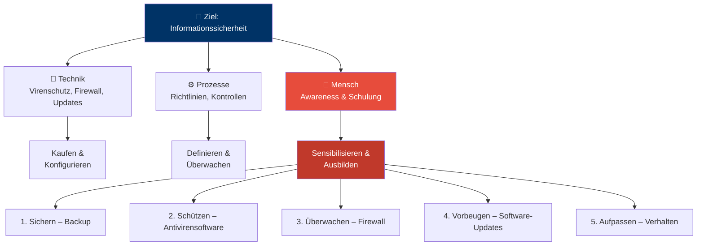

**Der Mensch ist gleichzeitig das grösste Risiko und der grösste Schutzfaktor in der Informationssicherheit.**  
Technische Massnahmen sind notwendig, aber nicht ausreichend. Nur durch kontinuierliche Sensibilisierung, Schulung und das Einbinden des menschlichen Potenzials kann ein wirksamer Schutz aufgebaut werden.

> *«Zwei Dinge sind unendlich: das Universum und die menschliche Dummheit. Aber bei dem Universum bin ich mir noch nicht ganz sicher.»*  
> — Albert Einstein
