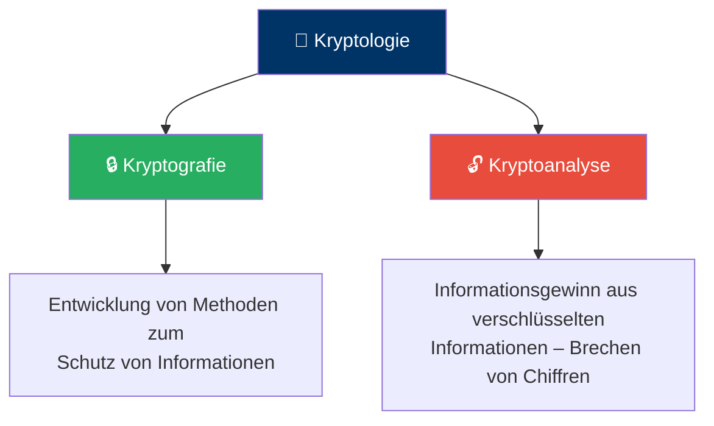
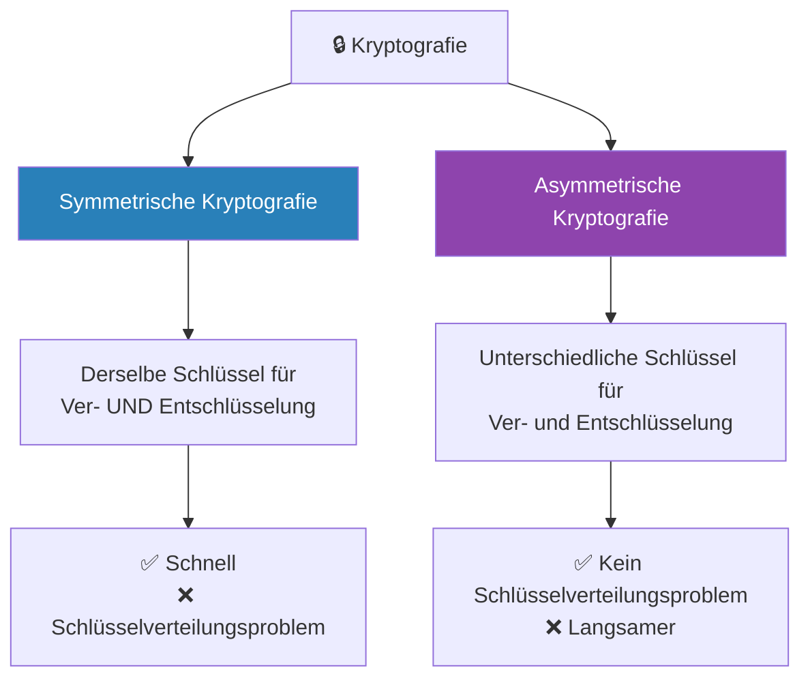
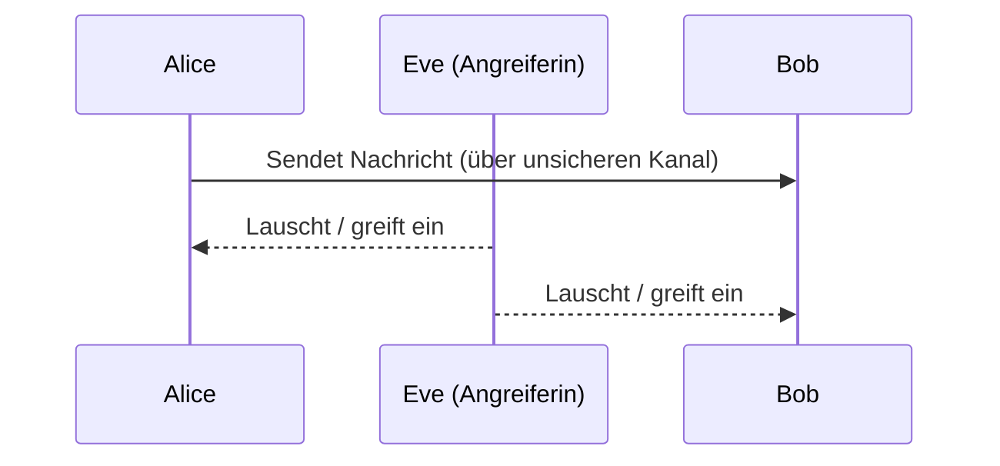
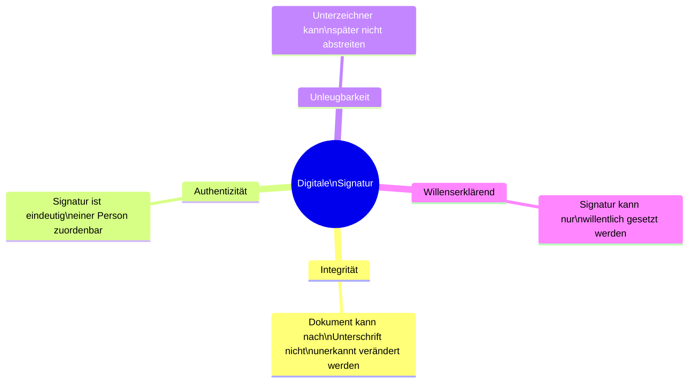
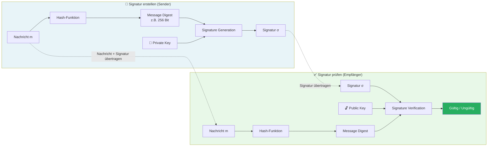
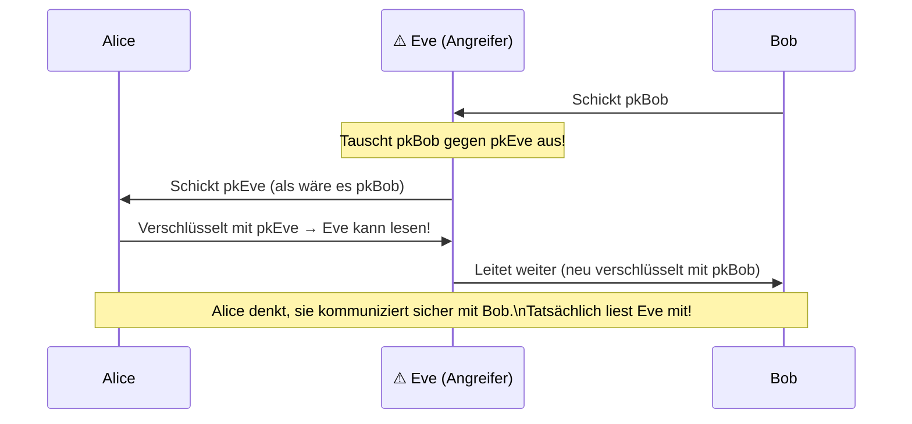
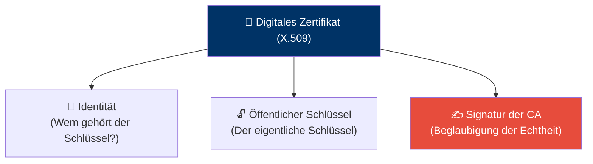
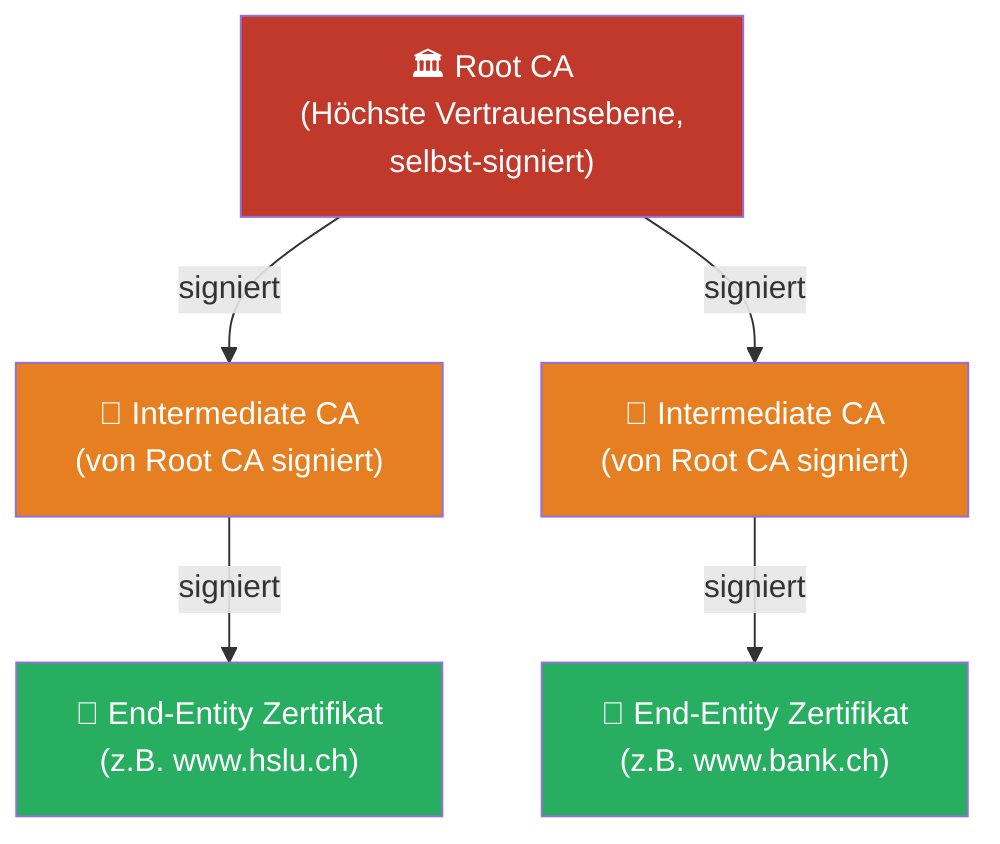
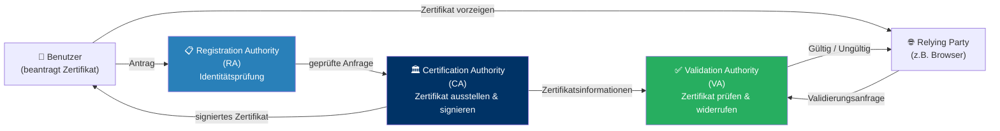
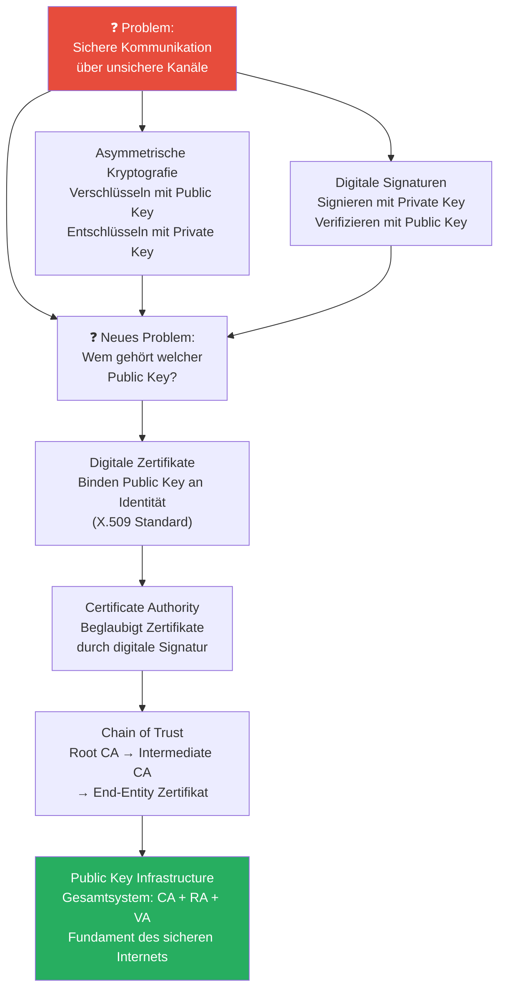

import Callout from '../../../../components/Callout.astro';

<Callout type="green">
## 1. Was ist Kryptologie?
</Callout>

Kryptologie ist die Wissenschaft der **sicheren Kommunikation** und des **Schutzes von Informationen**. Der Begriff kommt aus dem Griechischen: *kryptós* (verborgen) und *lógos* (Lehre). Sie ist das Fundament moderner Informationssicherheit – ohne sie wäre sicheres Online-Banking, HTTPS oder die sichere Speicherung von Passwörtern undenkbar.

Die Kryptologie teilt sich in zwei grosse Teilgebiete:



**Kryptografie** ist die «konstruktive» Seite – sie entwickelt Algorithmen und Verfahren, um Informationen zu verschlüsseln, zu signieren und zu schützen. **Kryptoanalyse** ist die «analytische» Seite – sie versucht, diese Schutzmechanismen zu überwinden, also Verschlüsselungen zu brechen oder Schwachstellen zu finden.

Beide Disziplinen bedingen einander: Ohne Kryptoanalyse wüsste man nicht, ob eine Verschlüsselung wirklich sicher ist. Ein Algorithmus, der noch nie ernsthaft angegriffen wurde, ist nicht notwendigerweise sicher – er wurde vielleicht einfach noch nicht genug untersucht.

Die Kryptografie teilt sich ihrerseits in zwei grundlegende Ansätze:



Der Unterschied zwischen diesen beiden Ansätzen ist fundamental und wird in späteren Kapiteln vertieft. Die wichtigste Intuition: Symmetrische Kryptografie ist schnell und effizient, hat aber ein «Henne-Ei-Problem» beim Schlüsselaustausch. Asymmetrische Kryptografie löst genau dieses Problem – aber zum Preis von mehr Rechenaufwand.

---

<Callout type="green">
## 2. Kerckhoffs-Prinzip & Angreifermodelle
</Callout>

### Kerckhoffs-Prinzip

Das Kerckhoffs-Prinzip ist eine der wichtigsten Designregeln der modernen Kryptografie, formuliert von Auguste Kerckhoffs im Jahr 1883:

> **Der Angreifer kennt den Algorithmus und alle Details des Systems. Nur der Schlüssel ist geheim.**

Das klingt zunächst kontraintuitiv – warum sollte man dem Angreifer alles verraten? Der Grund ist pragmatisch und entscheidend:

Ein Algorithmus, der nur dann sicher ist, wenn er geheim bleibt (*Security through Obscurity*), ist grundsätzlich unsicher. Denn Algorithmen werden früher oder später bekannt – durch Leaks, Reverse Engineering oder abtrünnige Mitarbeiter. Offene Algorithmen hingegen können von der weltweiten Forschungsgemeinschaft analysiert und auf Schwachstellen geprüft werden. Nur der Schlüssel kann wirklich geheim gehalten werden und bei Kompromittierung einfach ausgetauscht werden.

**Beispiel:** AES, der heute am weitesten verbreitete Verschlüsselungsstandard, ist vollständig öffentlich dokumentiert – und genau deshalb vertrauen ihm Millionen von Systemen. Er wurde von der Community über Jahrzehnte analysiert und hat sich als sicher erwiesen.

### Das klassische Angreifermodell: Alice, Bob und Eve

In der Kryptografie wird typischerweise mit drei Rollen gearbeitet:



- **Alice** möchte eine Nachricht sicher an **Bob** übermitteln.
- **Eve** ist die Angreiferin, die versucht, die Kommunikation zu kompromittieren.

Wichtig: Eve beschränkt sich *nicht* nur auf passives Mithören. Mögliche Angriffe umfassen:

| Angriffstyp | Beschreibung | Bedrohtes Schutzziel |
|---|---|---|
| **Abhören** | Eve liest die Nachricht mit | Vertraulichkeit |
| **Verändern** | Eve modifiziert die Nachricht | Integrität |
| **Erfinden** | Eve spielt erfundene Nachrichten ein | Authentizität |
| **Replay-Angriff** | Eve spielt eine abgefangene Nachricht später nochmals ein | Frische / Aktualität |
| **Man-in-the-Middle** | Eve gibt sich gegenüber Alice als Bob aus und umgekehrt | Authentizität |
| **Löschen** | Eve verwirft Nachrichten | Verfügbarkeit |

### Angriffsarten in der Kryptoanalyse

Je nachdem, welche Informationen ein Angreifer besitzt, unterscheidet man folgende Angriffsarten – geordnet nach steigender Stärke des Angreifers:

| Angriffsart | Englisch | Was der Angreifer kennt |
|---|---|---|
| Angriff mit bekanntem Chiffretext | Ciphertext Only Attack | Nur den verschlüsselten Text |
| Angriff mit bekanntem Klartext | Known Plaintext Attack | Klartext-Chiffretext-Paare |
| Angriff mit gewähltem Klartext | Chosen Plaintext Attack | Kann beliebige Klartexte verschlüsseln lassen |
| Angriff mit gewähltem Chiffretext | Chosen Ciphertext Attack | Kann beliebige Chiffretexte entschlüsseln lassen |

Ein Kryptosystem gilt als sicher, wenn es selbst dem stärksten realistischen Angriff standhält. In der modernen Kryptografie entwirft man Systeme, die gegen *Chosen Ciphertext Attacks* resistent sind – damit ist automatisch Sicherheit gegen schwächere Angriffsarten gewährleistet.

### Side-Channel-Angriffe

Side-Channel-Angriffe sind eine besonders heimtückische Klasse von Angriffen, weil sie die **mathematische Stärke eines Algorithmus vollständig umgehen**. Stattdessen nutzen sie physikalische Eigenschaften der Implementierung aus – Stromverbrauch, Laufzeit, elektromagnetische Abstrahlung oder sogar akustische Geräusche.

**Beispiel – Simple Power Analysis (SPA) gegen RSA:**

RSA-Entschlüsselung basiert intern auf Potenzierungen, die als Folge von Multiplikationen und Quadraturen durchgeführt werden:
- Bei einer `0` im Schlüsselbit: nur Quadratur
- Bei einer `1` im Schlüsselbit: Quadratur und Multiplikation

Diese beiden Operationen verbrauchen unterschiedlich viel elektrische Leistung. Durch Messen des Stromverbrauchs kann ein Angreifer den geheimen Schlüssel Bit für Bit rekonstruieren – *ohne den Algorithmus mathematisch zu brechen*.

```
Stromkurve-Analyse:
S  SM  SM  S  SM  S  S  SM  SM  SM  S  SM
0   1   1  0   1  0  0   1   1   1  0   1
↑ Privater Schlüssel Bit für Bit lesbar!
```

Ein weiteres Beispiel: Israelische Forscher konnten durch Analyse der **akustischen Geräusche** eines Computers einen 4096-Bit-RSA-Schlüssel in unter einer Stunde extrahieren. Das zeigt: Selbst ein mathematisch perfekter Algorithmus kann durch eine schlechte Implementierung vollständig angreifbar sein.

---

<Callout type="green">
## 3. Zufallszahlengeneratoren
</Callout>

Zufallszahlen sind das Fundament der Kryptografie – sie werden für die Generierung von Schlüsseln, Initialisierungsvektoren, Nonces und vieles mehr benötigt. Nicht jeder Zufallszahlengenerator ist jedoch für kryptografische Zwecke geeignet.

### Normaler PRNG vs. kryptografisch sicherer PRNG

| Eigenschaft | Normaler PRNG | Kryptografisch sicherer PRNG (CSPRNG) |
|---|---|---|
| Gleichmässige Verteilung | ✅ | ✅ |
| Hohe Geschwindigkeit | ✅ | Etwas langsamer |
| Nicht vorhersagbar | ❌ | ✅ |
| Beispiel (Java) | `java.util.Random` | `java.security.SecureRandom` |

**Warum ist Nicht-Vorhersagbarkeit so kritisch?**

Ein normaler PRNG wie `java.util.Random` ist deterministisch: Wer den Seed kennt, kann alle zukünftigen Zufallswerte exakt berechnen. In kryptografischen Kontexten bedeutet das: Ein Angreifer, der den Seed oder vergangene Ausgaben kennt, kann Geheimschlüssel rekonstruieren, Sitzungstoken erraten und kryptografische Protokolle brechen.

CSPRNGs beziehen ihre Entropie aus echten physikalischen Quellen – Mausbewegungen, Tastatureingaben, Hardware-Rauschen, Netzwerkaktivität – und sind daher nicht vorhersagbar.

> **Merke:** Die meisten kryptografischen Verfahren sind nur dann sicher, wenn wirklich zufällige Zahlen verwendet werden. Ein schwacher Zufallsgenerator unterminiert selbst den stärksten Verschlüsselungsalgorithmus – und dieser Fehler ist in der Praxis überraschend häufig.

---

<Callout type="green">
## 4. Digitale Signaturen
</Callout>

Eine digitale Signatur ist das elektronische Äquivalent einer handschriftlichen Unterschrift – aber mit deutlich stärkeren Sicherheitseigenschaften. Während eine handschriftliche Unterschrift nur bezeugt, dass eine Person ein Dokument unterzeichnet hat, bezeugt eine digitale Signatur **sowohl die Identität des Unterzeichners als auch, dass der Inhalt danach nicht verändert wurde**.

### Die vier Eigenschaften einer digitalen Signatur



### Das Hash-then-Sign-Verfahren

Das direkte Signieren grosser Dokumente mit asymmetrischen Algorithmen wäre sehr rechenaufwändig. Deshalb verwendet man in der Praxis das **Hash-then-Sign-Verfahren**: Zuerst wird ein kompakter «Fingerabdruck» der Nachricht berechnet, und nur dieser kurze Hashwert wird dann signiert.



**Schritt für Schritt:**

1. **Hashing (Sender):** Die Nachricht wird durch eine Hash-Funktion verarbeitet → ergibt einen kompakten «Fingerabdruck» der Nachricht (Message Digest)
2. **Signieren (Sender):** Der Message Digest wird mit dem **privaten Schlüssel** des Senders signiert → ergibt die Signatur σ
3. **Übertragung:** Nachricht + Signatur werden gemeinsam übertragen
4. **Hashing (Empfänger):** Der Empfänger berechnet denselben Hash-Wert aus der empfangenen Nachricht
5. **Verifikation (Empfänger):** Die Signatur wird mit dem **öffentlichen Schlüssel** des Senders entschlüsselt und mit dem berechneten Hash verglichen
6. **Ergebnis:** Stimmen die Hashes überein → Signatur gültig. Abweichung → Nachricht wurde verändert oder Signatur ist gefälscht

**Warum erst hashen, dann signieren?**
Hash-Funktionen erzeugen immer einen gleich langen Output (z.B. 256 Bit bei SHA-256) – unabhängig davon, ob die Eingabe 1 Byte oder 1 GB gross ist. Asymmetrische Signaturalgorithmen arbeiten effizient nur auf kleinen Datenmengen. Der Hash ist also ein cleverer «Stellvertreter» der gesamten Nachricht.

### Schlüsselverwendung: Signatur vs. Verschlüsselung

Bei Signaturen ist die Reihenfolge der Schlüsselverwendung **umgekehrt** gegenüber der Verschlüsselung:

| Operation | Verschlüsselung | Signatur |
|---|---|---|
| Erstellen | Mit **öffentlichem** Schlüssel verschlüsseln | Mit **privatem** Schlüssel signieren |
| Prüfen/Entschlüsseln | Mit **privatem** Schlüssel entschlüsseln | Mit **öffentlichem** Schlüssel verifizieren |

> ⚠️ **Wichtig:** Es sollte **nie dasselbe Schlüsselpaar** für die Verschlüsselung und für das Signieren verwendet werden! Getrennte Schlüsselpaare für getrennte Zwecke sind Best Practice.

---

<Callout type="green">
## 5. Digitale Zertifikate & PKI
</Callout>

### Das Kernproblem: Wem gehört welcher Schlüssel?

Die asymmetrische Kryptografie löst das Schlüsselverteilungsproblem – schafft aber ein neues: Woher weiss Alice, dass ein empfangener öffentlicher Schlüssel **wirklich** von Bob stammt und nicht von einem Angreifer? Dieses Problem ist als **Man-in-the-Middle-Angriff** bekannt:



Die Lösung: Digitale Zertifikate **binden** einen öffentlichen Schlüssel an eine verifizierte Identität – beglaubigt von einer vertrauenswürdigen dritten Partei.

### Digitales Zertifikat (X.509)

Ein digitales Zertifikat beantwortet die Frage: **«Zu wem gehört dieser öffentliche Schlüssel?»** Es enthält drei Kernelemente:



**Aufbau eines X.509-Zertifikats:**

| Feld | Inhalt | Bedeutung |
|---|---|---|
| `version` | 3 | X.509 Version 3 |
| `serialNumber` | 32:30:32:... | Eindeutige Seriennummer |
| `signature` | sha256WithRSAEncryption | Verwendeter Signaturalgorithmus |
| `issuer` | CN=ISF-CA, O=HSLU | Wer hat das Zertifikat ausgestellt? |
| `validity` | notBefore / notAfter | Gültigkeitszeitraum |
| `subject` | CN=www.hslu.ch | **Zu wem gehört der Schlüssel?** |
| `subjectPublicKeyInfo` | Algorithmus + Schlüsselwert | **Der öffentliche Schlüssel selbst** |
| `signatureAlgorithm` + Wert | sha256WithRSAEncryption + Bytes | **Digitale Signatur der CA** |

Der **Fingerabdruck** eines Zertifikats ist der Hash-Wert des gesamten Zertifikats (z.B. SHA-256). Er dient als kompakte Prüfgrösse für die direkte Verifikation ohne den vollständigen Inhalt vergleichen zu müssen.

### Certificate Authority (CA) und Chain of Trust

Zertifikate werden von einer **Certificate Authority (CA)** ausgestellt und signiert – einer vertrauenswürdigen Organisation, die die Identität von Antragstellern prüft. Damit Alice und Bob gegenseitig Zertifikate prüfen können, müssen sie denselben CAs vertrauen – dem sogenannten **Trust Anchor**.

Da eine einzige Root CA nicht alle Zertifikate der Welt ausstellen kann, gibt es eine Hierarchie:



**Wie funktioniert die Verifikation?**
Um dem Zertifikat von `www.hslu.ch` zu vertrauen, prüft der Browser:
1. Ist das End-Entity-Zertifikat von einer bekannten Intermediate CA signiert? → Ja ✅
2. Ist die Intermediate CA von einer bekannten Root CA signiert? → Ja ✅
3. Ist die Root CA im Betriebssystem/Browser als vertrauenswürdig hinterlegt? → Ja ✅
4. **Ergebnis:** Dem Zertifikat wird vertraut → 🔒 grünes Schloss im Browser

Root CAs sind die «Urvertrauen»-Anker des Systems. Ihr Zertifikat ist **selbst-signiert** – das Vertrauen in sie ist direkt im Betriebssystem oder Browser vorinstalliert (sogenannter «Trust Store»). Die Installation eines neuen Root-CA-Zertifikats ist deswegen sehr heikel: Damit vertraut man automatisch *allen* von dieser CA ausgestellten Zertifikaten – potenziell Millionen davon.

### Es gibt drei Vertrauensmodelle

**Direct Trust:** Alice vertraut Bobs öffentlichem Schlüssel, weil sie ihn direkt und persönlich überprüft hat – z.B. durch persönlichen Austausch oder weil er in der Software vorinstalliert ist. Skaliert nicht für das Internet.

**Web-of-Trust (WOT):** Kein zentrales Vertrauen, sondern ein Netz gegenseitiger Empfehlungen. Alice vertraut Dave, weil Bob Charlys Schlüssel signiert hat, Charlie Daves Schlüssel signiert hat, und Alice Bob vertraut. Wird bei PGP/GPG für E-Mail-Verschlüsselung eingesetzt. Funktioniert gut in kleinen Communities, skaliert aber schlecht.

**Hierarchical Trust (PKI):** Das dominante Modell im Internet – eine Hierarchie von CAs wie oben beschrieben.

### Public Key Infrastructure (PKI)

PKI ist das **Gesamtsystem**, das digitale Zertifikate ausstellen, verteilen, verwalten und prüfen kann. Es besteht aus drei Hauptkomponenten:



| Komponente | Rolle | Aufgabe |
|---|---|---|
| **CA** (Certification Authority) | Zertifizierungsstelle | Stellt Zertifikate aus und signiert sie |
| **RA** (Registration Authority) | Registrierungsstelle | Prüft die Identität von Antragstellern (im Auftrag der CA) |
| **VA** (Validation Authority) | Validierungsstelle | Beantwortet Anfragen, ob ein Zertifikat noch gültig ist |

### Ungültigkeitserklärung (Revokation)

Zertifikate können vor Ablauf widerrufen werden – z.B. wenn der zugehörige private Schlüssel kompromittiert wurde oder der Zertifikatsbesitzer das Unternehmen verlässt. Dafür gibt es zwei Mechanismen:

- **CRL (Certificate Revocation List):** Eine periodisch publizierte Liste aller gesperrten Zertifikate nach Seriennummer.
- **OCSP (Online Certificate Status Protocol):** Eine Echtzeitabfrage beim OCSP-Responder – effizienter als CRL, weil man nur ein einzelnes Zertifikat abfragt.

> Ein Revokationsantrag muss genauso sorgfältig geprüft werden wie ein Zertifikatsantrag – sonst könnte ein Angreifer das Zertifikat seines Opfers sperren, um einen Denial-of-Service zu erzwingen.

---
<Callout type="danger">
## Zusammenfassung
</Callout>
<div style={{ overflowX: 'auto', width: '50%'}}>

</div>

| Konzept | Wofür? | Schlüssel |
|---|---|---|
| **Verschlüsseln** | Vertraulichkeit | Public Key des Empfängers |
| **Entschlüsseln** | Vertraulichkeit | Eigener Private Key |
| **Signieren** | Authentizität + Integrität | Eigener Private Key |
| **Signatur prüfen** | Authentizität + Integrität | Public Key des Senders |
| **Zertifikat** | Vertrauen in Public Key | Signatur der CA |
| **PKI** | Infrastruktur für Zertifikate | Trust Anchors (Root CAs) |

---

### Weiterführende Quellen

- NIST Digital Signature Standard (DSS): [nvlpubs.nist.gov](https://nvlpubs.nist.gov/nistpubs/FIPS/NIST.FIPS.186-5.pdf)
- ITU-T X.509 Standard (Zertifikate): [itu.int](https://www.itu.int/rec/T-REC-X.509-201910-I/en)
- Wikipedia: Public-Key-Infrastruktur: [de.wikipedia.org](https://de.wikipedia.org/wiki/Public-Key-Infrastruktur)
