import Callout from '../../../../components/Callout.astro';

<Callout type="green">
## 1. Symmetrische Kryptografie
</Callout>

Bei der symmetrischen Kryptografie verwenden Sender und Empfänger **denselben geheimen Schlüssel** (`sk`) für Ver- und Entschlüsselung. Das macht sie sehr schnell und effizient – hat aber ein fundamentales Problem: Der gemeinsame Schlüssel muss *vorher* sicher ausgetauscht worden sein.

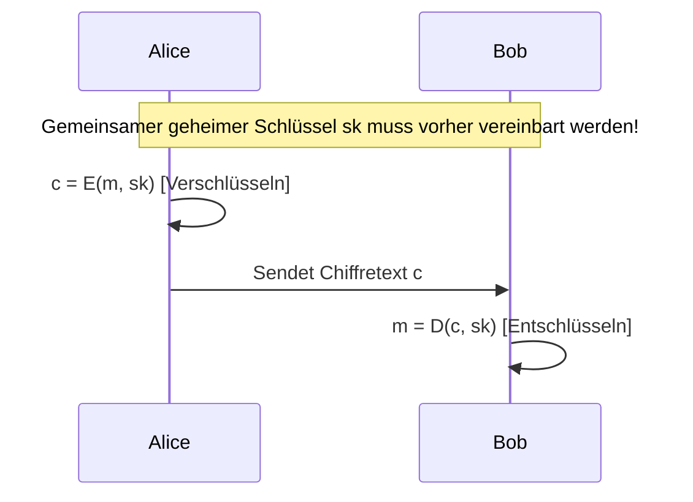

Wie schafft man es, diesen Schlüssel sicher zu übertragen, wenn es noch keinen sicheren Kanal gibt? Dieses «Henne-Ei-Problem» – das **Schlüsselverteilungsproblem** – ist der zentrale Schwachpunkt der symmetrischen Kryptografie und wird durch asymmetrische Verfahren gelöst (siehe Abschnitt 4).

Symmetrische Kryptografie lässt sich in zwei grundlegende Typen unterteilen:

- **Stromchiffre:** Jedes einzelne Bit der Nachricht wird einzeln verschlüsselt. Der Schlüssel ist gleich lang wie die Nachricht, die Verschlüsselung erfolgt typischerweise per XOR-Verknüpfung. Vorteil: einfach und schnell. Nachteil: Schlüsselmanagement bei langen Nachrichten aufwändig.
- **Blockchiffre:** Die Nachricht wird in Blöcke fester Länge aufgeteilt und blockweise verschlüsselt. Das ist der heute dominante Ansatz.

### Advanced Encryption Standard (AES)

AES ist die weltweit meistgenutzte symmetrische Blockchiffre und seit 2001 der offizielle US-Standard. Er wurde aus dem öffentlichen AES-Wettbewerb des NIST hervorgegangen – ein Paradebeispiel für das Kerckhoffs-Prinzip: Der Algorithmus ist vollständig öffentlich, nur der Schlüssel ist geheim.

| Parameter | Wert |
|---|---|
| Typ | Symmetrische Blockchiffre |
| Blockgrösse | 128 Bit |
| Schlüssellänge | 128, 192 oder 256 Bit |
| Sicherheit | Längerer Schlüssel = höhere Sicherheit |

**AES verschlüsselt in mehreren Runden** (10, 12 oder 14 je nach Schlüssellänge), wobei jede Runde vier Operationen durchführt:

1. **SubBytes:** Jedes Byte wird anhand einer vordefinierten Substitutionsbox (S-Box) durch ein anderes ersetzt. Dies sorgt für *Konfusion* – der statistische Zusammenhang zwischen Klartext und Chiffretext wird verschleiert.

2. **ShiftRows:** Die Bytes in den Zeilen der internen 4×4-Matrix werden zyklisch verschoben. Dies sorgt für *Diffusion* – Veränderungen breiten sich auf andere Teile des Blocks aus.

3. **MixColumns:** Die Spalten der Matrix werden durch eine lineare Transformation gemischt. Verstärkt die Diffusion weiter, sodass ein einzelnes geändertes Byte alle Bytes einer Spalte beeinflusst.

4. **AddRoundKey:** Der Rundenschlüssel (aus dem Hauptschlüssel abgeleitet) wird per XOR auf die Daten angewendet. Dies vermischt Schlüssel und Daten direkt miteinander.

Diese Kombination aus Konfusion und Diffusion macht AES extrem widerstandsfähig gegen Kryptoanalyse. Bis heute ist kein praktischer Angriff auf AES bekannt.

### Betriebsmodi von Blockchiffren

Eine Blockchiffre allein definiert nur, wie ein **einzelner Block** verschlüsselt wird. Um längere Nachrichten zu verarbeiten, braucht man einen **Betriebsmodus**, der festlegt, wie die Blöcke miteinander verknüpft werden.

> **Wichtig:** Zu einer Blockchiffre muss immer ein Betriebsmodus angegeben werden!

#### Electronic Code Book (ECB)

Im ECB-Modus wird jeder Block **unabhängig** mit demselben Schlüssel verschlüsselt – als ob man jeden Block einzeln durch eine «Codebuch-Tabelle» schlägt.

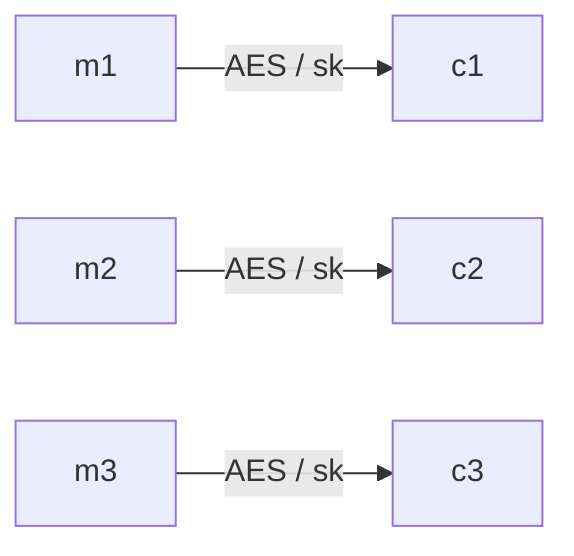

Vorteile: Blöcke können parallel ver- und entschlüsselt werden (hohe Performance), und Teilverschlüsselung einzelner Blöcke ist möglich.

Nachteile (schwerwiegend!): **Gleiche Klartextblöcke erzeugen identische Chiffratblöcke.** Das ist ein fundamentales Sicherheitsproblem: Muster im Klartext bleiben im Chiffretext erkennbar. Das berühmte Beispiel ist das ECB-verschlüsselte Linux-Tux-Bild – obwohl verschlüsselt, ist der Pinguin klar erkennbar, weil identische Bildblöcke identische Chiffratblöcke ergeben. Zusätzlich können Chiffratblöcke unbemerkt vertauscht oder gelöscht werden.

> ECB wird aufgrund dieser Schwächen in der Praxis **nicht empfohlen**.

#### Cipher Block Chaining (CBC)

CBC behebt die Schwächen von ECB, indem jeder Klartextblock **vor** der Verschlüsselung mit dem vorherigen Chiffratblock XOR-verknüpft wird. Für den ersten Block wird ein zufälliger **Initialisierungsvektor (IV)** verwendet.

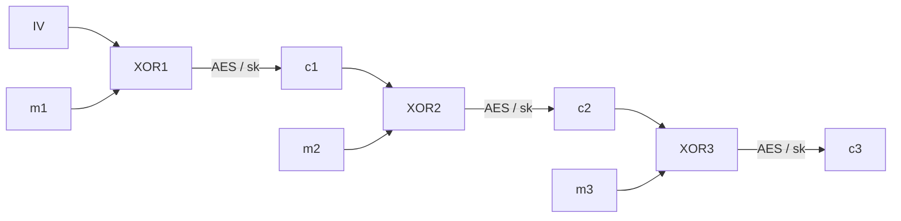

**Warum ein IV?** Der IV macht den Ablauf auch für den allerersten Block konsistent und stellt sicher, dass gleiche Nachrichten mit unterschiedlichem IV völlig unterschiedliche Chiffretexte ergeben. Dadurch kann ein Angreifer keine Muster erkennen. Der IV muss **nicht** geheim sein, aber **zufällig und einmalig** (Nonce).

Vorteile: Gleiche Klartextblöcke ergeben unterschiedliche Chiffratblöcke, deutlich sicherer als ECB.

Nachteile: Keine Parallelisierung der *Verschlüsselung* möglich (jeder Block hängt vom vorherigen ab), und ein Fehler in einem Block überträgt sich auf den nächsten Block.

#### Weitere Betriebsmodi

Es existieren weitere Modi wie **CTR (Counter Mode)** und **GCM (Galois/Counter Mode)**, die je nach Anwendungsfall bevorzugt werden. GCM bietet zusätzlich zur Verschlüsselung auch Authentizität (AEAD – Authenticated Encryption with Associated Data) und wird in TLS 1.3 eingesetzt.

### Schlüsselmanagement bei symmetrischer Kryptografie

Ein weiteres grosses Problem der symmetrischen Kryptografie ist die **Skalierung**: Für jedes Paar von Kommunikationspartnern wird ein eigener Schlüssel benötigt:

$$\text{Anzahl Schlüssel} = \frac{n \cdot (n-1)}{2}$$

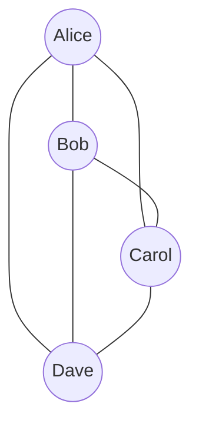

Bei 4 Partnern: 6 Schlüssel. Bei 1000 Partnern: 499'500 Schlüssel. Das ist in der Praxis kaum handhabbar – ein weiterer Grund, warum asymmetrische Kryptografie für den Schlüsselaustausch eingesetzt wird.

---

<Callout type="green">
## 2. Hashfunktionen
</Callout>

Eine Hashfunktion bildet eine **beliebig lange Eingabe** auf einen **Hashwert fixer Länge** ab – einen kompakten «digitalen Fingerabdruck» der Eingabe.

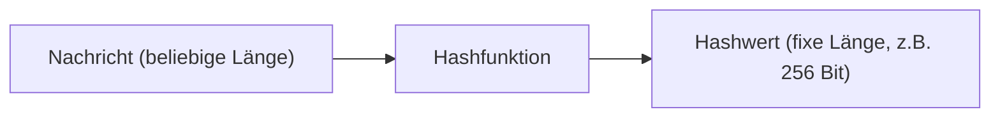

Die Funktion ist **deterministisch** – dieselbe Eingabe ergibt immer denselben Hashwert. Aber sie ist *keine* Verschlüsselung: Es gibt keinen Schlüssel und keine effiziente Umkehrfunktion.

### Drei Sicherheitseigenschaften

Kryptografische Hashfunktionen müssen drei zentrale Sicherheitseigenschaften erfüllen:

**Preimage Resistance (Einwegfunktion):** Zu einem gegebenen Hashwert `h` ist es praktisch unmöglich, eine Nachricht `m` zu finden, sodass `H(m) = h`. Das verhindert, dass aus einem gestohlenen Hashwert das ursprüngliche Passwort rekonstruiert werden kann.

**Second Preimage Resistance:** Zu einer gegebenen Nachricht `m1` ist es praktisch unmöglich, eine zweite Nachricht `m2 ≠ m1` zu finden, sodass `H(m1) = H(m2)`. Das verhindert, dass ein Angreifer ein Dokument durch ein anderes mit demselben Hash ersetzt.

**Collision Resistance:** Es ist praktisch unmöglich, irgendein Paar `(m1, m2)` mit `m1 ≠ m2` zu finden, sodass `H(m1) = H(m2)`. Das ist die stärkste Eigenschaft – und schwieriger zu erfüllen als man denkt: Nach dem **Geburtstagsparadoxon** genügen bereits etwa $\sqrt{2^n}$ Versuche, um mit 50% Wahrscheinlichkeit eine Kollision zu finden.

### Gängige Hashalgorithmen

| Name | Outputlänge | Status |
|---|---|---|
| MD5 | 128 Bit | **Gebrochen** – nicht mehr verwenden! |
| SHA-1 | 160 Bit | **Gebrochen** – nicht mehr verwenden! |
| SHA-256 | 256 Bit | Sicher, weit verbreitet |
| SHA-384 | 384 Bit | Sicher |
| SHA-512 | 512 Bit | Sicher |
| SHA3-256 | 256 Bit | Sicher, andere Architektur (Keccak) |
| SHA3-512 | 512 Bit | Sicher |

SHA-2 (SHA-256, SHA-512) und SHA-3 gelten heute als sicher. MD5 und SHA-1 haben bekannte Kollisionsangriffe und dürfen für sicherheitskritische Anwendungen nicht mehr eingesetzt werden.

### Anwendung: Sichere Passwortspeicherung

**Problem:** Passwörter müssen serverseitig gespeichert werden – aber wie?

Klartext zu speichern ist offensichtlich gefährlich: Bei einem Datenbankeinbruch sind sofort alle Passwörter kompromittiert. Symmetrische Verschlüsselung ist besser, aber der Schlüssel muss irgendwo gespeichert werden und ist bei einem Einbruch oft erreichbar.

**Gute Lösung:** Den **Hashwert** des Passworts speichern. Wenn die Datenbank gestohlen wird, sind die Originalpasswörter nicht direkt lesbar. Bei der Anmeldung wird das eingegebene Passwort gehasht und mit dem gespeicherten Hash verglichen.

### Rainbow Tables – und warum einfaches Hashen nicht reicht

**Problem:** Gleiche Passwörter ergeben gleiche Hashwerte. Ein Angreifer kann eine **Rainbow Table** erstellen – eine riesige vorberechnete Tabelle mit Passwort-Hash-Paaren:

```
"password"  → 5f4dcc3b5aa765d61d8327deb882cf99
"123456"    → e10adc3949ba59abbe56e057f20f883e
"qwerty"    → d8578edf8458ce06fbc5bb76a58c5ca4
```

Mit einer solchen Tabelle kann ein Angreifer zu einem gefundenen Hashwert sofort das Passwort nachschlagen – ohne die Hashfunktion zu «brechen».

### Salt & Pepper

**Salt:** Ein zufällig generierter Wert, der *vor* dem Hashen an das Passwort angehängt wird und im Klartext in der Datenbank gespeichert wird. Jeder Benutzer erhält einen eigenen Salt.

**Pepper:** Ähnlich wie Salt, aber *nicht* in der Datenbank gespeichert – er gilt für alle Benutzer gleich und wird separat (z.B. in einer Konfigurationsdatei oder einem Hardware-Sicherheitsmodul) abgelegt.

<div style={{ overflowX: 'auto', width: '40%'}}>
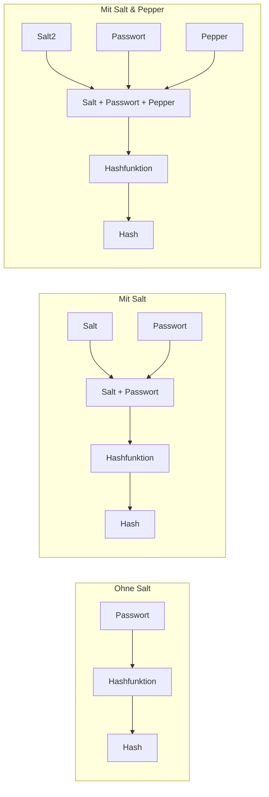
</div>
**Warum funktioniert Salt gegen Rainbow Tables?** Da jeder Benutzer einen anderen Salt hat, müsste ein Angreifer für jeden Salt eine eigene Rainbow Table erstellen – das macht vorberechnete Angriffe praktisch unbrauchbar.

Salt zu verwenden ist das absolute **Minimum**. Pepper ist seltener im Einsatz, da die Implementierung aufwändiger ist.

### Argon2 – Moderne Passwort-Hashing-Funktion

Normale Hashfunktionen wie SHA-256 sind für Passwörter eigentlich *zu schnell* – ein Angreifer kann Milliarden von Hashes pro Sekunde berechnen. **Argon2** (insbesondere **Argon2id**) ist eine speziell für Passwörter entwickelte Funktion, die bewusst viele Ressourcen verbraucht:

| Parameter | Bedeutung |
|---|---|
| **m** – Memory Size | Mindestgrösse des genutzten Arbeitsspeichers |
| **t** – Iterations | Mindestanzahl der Berechnungsschritte |
| **p** – Parallelism | Parallelisierungsgrad |

Diese Parameter definieren zusammen den **Work Factor**. Für einen legitimen Login ist der Rechenaufwand kaum spürbar (z.B. 0.5 Sekunden). Für einen Angreifer, der Millionen Passwörter ausprobiert, wird es prohibitiv teuer. Argon2 fügt ausserdem automatisch einen Salt hinzu.

> Argon2 gewann 2015 den Password Hashing Competition (PHC) und ist heute die empfohlene Funktion gemäss OWASP.

---

<Callout type="green">
## 3. Message Authentication Codes (MAC)
</Callout>

Ein **Message Authentication Code (MAC)** ist ein kurzer Code, der an eine Nachricht angehängt wird und zwei Schutzziele gleichzeitig erfüllt: **Datenintegrität** (die Nachricht wurde nicht verändert) und **Authentizität** (die Nachricht stammt tatsächlich vom erwarteten Absender).

### Ablauf

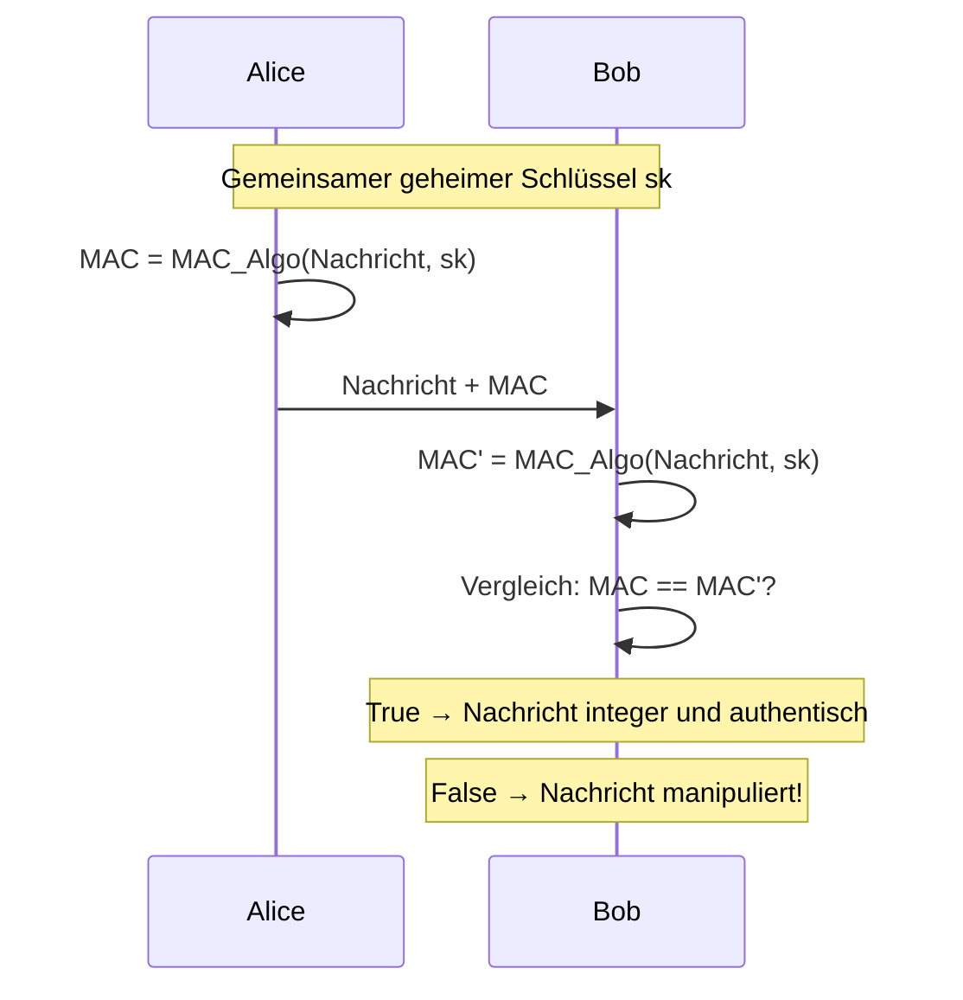

**Warum reicht eine normale Hashfunktion nicht aus?** Ein einfacher Hash ohne Schlüssel schützt nicht vor Manipulation: Ein Angreifer könnte eine Nachricht verändern *und* den Hash neu berechnen – niemand würde den Unterschied merken. Erst der geheime Schlüssel im MAC stellt sicher, dass nur Personen mit Schlüsselkenntnis gültige MACs erzeugen können.

### HMAC (Hash-based Message Authentication Code)

**HMAC** ist ein auf kryptografischen Hashfunktionen basierender MAC-Standard. HMAC kombiniert die Nachricht mit einem geheimen Schlüssel auf eine kryptografisch sichere Weise – nicht durch einfache Verkettung, sondern durch eine normierte Konstruktion mit zwei Hash-Durchläufen. Das verhindert bestimmte Angriffe, die bei naiver Verkettung möglich wären.

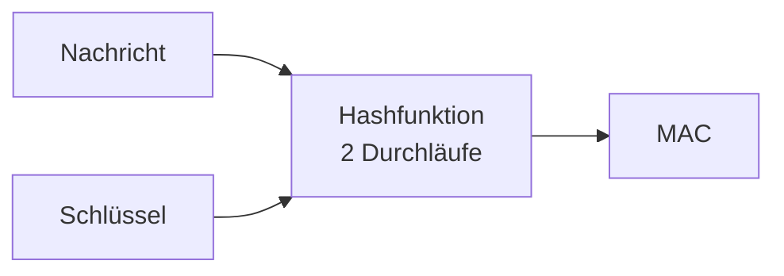

**Typische Verwendung:** HMAC-SHA256 ist z.B. in TLS, JWT (JSON Web Tokens) und vielen API-Authentifizierungsschemas der Standard.

| Konzept | Schutzziel | Schlüssel nötig? |
|---|---|---|
| Symmetrische Verschlüsselung (AES) | Vertraulichkeit | ✅ Ja (shared secret) |
| Hashfunktion (SHA-256) | Integrität (ohne Authentizität) | ❌ Nein |
| MAC / HMAC | Integrität + Authentizität | ✅ Ja (shared secret) |

---

<Callout type="green">
## 4. Asymmetrische Kryptografie
</Callout>

Asymmetrische Kryptografie löst das fundamentale Schlüsselverteilungsproblem der symmetrischen Kryptografie. Das Grundprinzip: Es gibt **zwei mathematisch zusammenhängende Schlüssel**:

- **Public Key (öffentlicher Schlüssel):** Darf öffentlich bekannt sein. Wird zur Verschlüsselung verwendet.
- **Private Key (privater Schlüssel):** Muss absolut geheim bleiben. Wird zur Entschlüsselung verwendet.

Was mit dem einen Schlüssel verschlüsselt wird, kann **nur** mit dem anderen entschlüsselt werden – nicht einmal mit dem Schlüssel, der zum Verschlüsseln verwendet wurde.

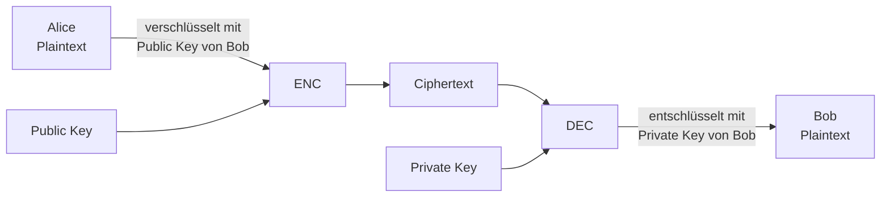

### Mathematische Grundlage: Einwegfunktionen

Die mathematische Basis ist eine **Einwegfunktion (One-Way Function)**:
- In eine Richtung einfach zu berechnen (Verschlüsselung)
- In die andere Richtung praktisch unmöglich ohne den Schlüssel (Entschlüsselung)

**Beispiel Faktorisierung:**
- Multiplikation: $31 \times 67 = 2077$ → trivial, Millisekunden
- Faktorisierung: $2077 = ?$ → aufwändig, bei grossen Zahlen praktisch nicht lösbar

| Algorithmus | Zugrundeliegendes «schwieriges» Problem |
|---|---|
| RSA | Integer-Faktorisierung |
| Diffie-Hellman (DH) | Diskreter Logarithmus |
| Elliptische Kurven (ECDH/ECDSA) | Diskreter Logarithmus auf elliptischen Kurven |

### Exkurs: Komplexitätstheorie

Kryptografie basiert nicht nur darauf, dass ein Problem *theoretisch* unlösbar ist – sondern dass es mit vertretbarem Aufwand in der Praxis **nicht lösbar** ist. Die Komplexitätstheorie analysiert, wie der Ressourcenaufwand mit der Eingabegrösse wächst.

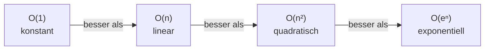

Für kryptografische Sicherheit wollen wir, dass Angriffe **exponentiellen** Aufwand erfordern – dann wird es selbst bei moderner Hardware in vernünftiger Zeit unpraktikabel.

Das führt zum offensten Problem der Informatik: **P vs. NP**. Gilt P = NP (alle verifizierbaren Probleme sind auch effizient lösbar), bräche die moderne Kryptografie zusammen. Die Frage ist ungelöst und eines der sieben Millennium-Probleme des Clay Mathematics Institute (Preisgeld: 1 Million USD).

### Diffie-Hellman Schlüsselvereinbarung

Diffie-Hellman (DH) ist kein Verschlüsselungsverfahren, sondern ein **Schlüsselvereinbarungsprotokoll** – es ermöglicht zwei Parteien, über einen unsicheren Kanal einen gemeinsamen geheimen Schlüssel zu etablieren, ohne ihn je direkt zu übertragen.

Das Verfahren basiert auf dem **diskreten Logarithmus-Problem**: Aus $A = z^a \mod p$ den Exponenten $a$ zu berechnen, wenn $z$, $p$ und $A$ bekannt sind, ist für grosse $p$ praktisch unmöglich.

**Farbanalogie (intuitives Verständnis):**

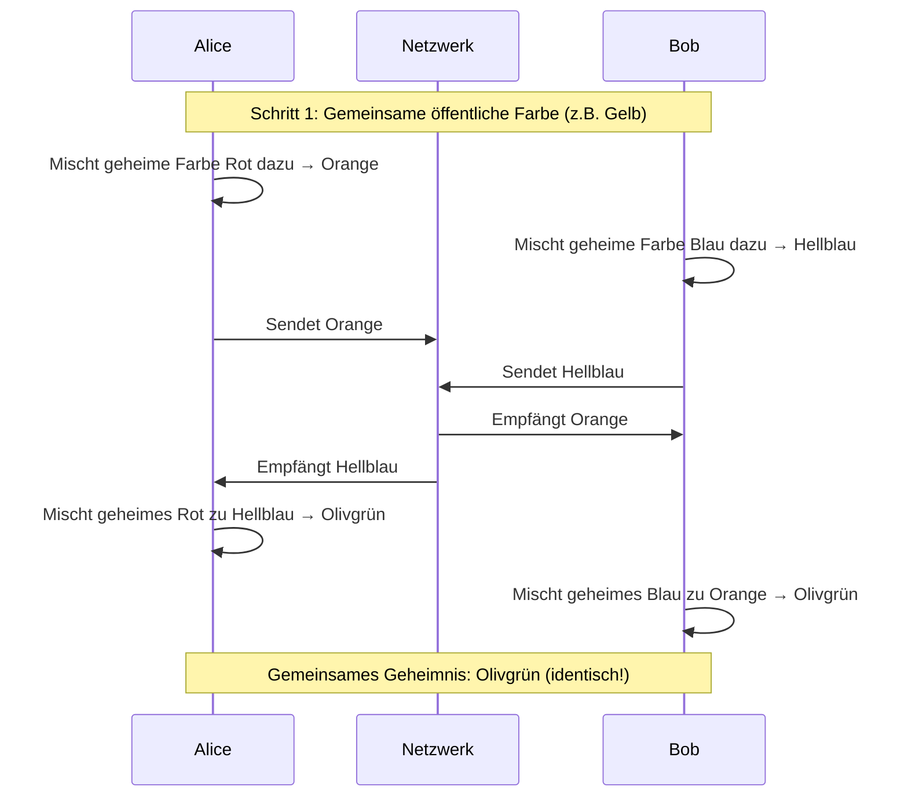

Der Angreifer sieht Gelb, Orange und Hellblau – kann aber daraus das Olivgrün nicht rekonstruieren, weil das «Entmischen» von Farben praktisch unmöglich ist.

**Mathematisches Protokoll:**

| Schritt | Alice | Bob |
|---|---|---|
| 1 | Wählt geheimes $a$ | Wählt geheimes $b$ |
| 2 | Berechnet $A = z^a \mod p$ | Berechnet $B = z^b \mod p$ |
| 3 | Sendet $A$ an Bob | Sendet $B$ an Alice |
| 4 | Berechnet $k = B^a \mod p$ | Berechnet $k = A^b \mod p$ |

Warum ergibt das denselben Schlüssel?
$$B^a \mod p = (z^b)^a \mod p = z^{ab} \mod p = (z^a)^b \mod p = A^b \mod p$$

**Man-in-the-Middle-Schwäche:** DH ist nicht inhärent authentifiziert. Ein Angreifer kann sich zwischen Alice und Bob schalten, jeweils eigene Schlüssel austauschen und so beide Verbindungen kontrollieren – ohne dass Alice oder Bob es merken. Die Lösung sind **digitale Zertifikate** zur Authentifizierung der öffentlichen Schlüssel.

### RSA

RSA (Rivest, Shamir, Adleman – 1977) ist das bekannteste asymmetrische Verfahren. Die Einwegfunktion: **Multiplikation zweier Primzahlen** ist trivial, die Umkehrung (Faktorisierung des Produkts) ist für grosse Zahlen praktisch unmöglich.

**Schlüsselerzeugung (konzeptuell):**
1. Wähle zwei grosse Primzahlen $p$ und $q$
2. Berechne $n = p \cdot q$ (der **Modulus**)
3. Berechne $\phi(n) = (p-1)(q-1)$ (Eulersche Phi-Funktion)
4. Wähle $e$ mit $\gcd(e, \phi(n)) = 1$ (oft $e = 65537$)
5. Berechne $d = e^{-1} \mod \phi(n)$ (modulare Inverse)

**Öffentlicher Schlüssel:** $(n, e)$ – darf veröffentlicht werden
**Privater Schlüssel:** $(n, d)$ – $p$ und $q$ werden nach der Schlüsselerzeugung vernichtet

**Ver- und Entschlüsselung:**
$$\text{Verschlüsseln: } C = M^e \mod n$$
$$\text{Entschlüsseln: } M = C^d \mod n$$

Das funktioniert, weil gilt: $(M^e)^d \equiv M \pmod{n}$ – eine Konsequenz des Satzes von Euler.

**Praktische Umsetzung mit OpenSSL:**

```bash
# Privaten 4096-Bit RSA-Schlüssel erzeugen (verschlüsselt mit AES-256)
openssl genrsa -aes256 -out private.pem 4096

# Öffentlichen Schlüssel extrahieren
openssl rsa -in private.pem -outform PEM -pubout -out public.pem
```

Die Schlüssel werden im **PEM-Format** (Privacy Enhanced Mail) gespeichert – Base64-kodierte Daten mit Header/Footer. Ein 4096-Bit RSA-Schlüssel enthält den Modulus $n$, die Exponenten $e$ und $d$, die Primzahlen $p$ und $q$, sowie vorberechnete Exponenten für schnellere Entschlüsselung via Chinesischer Restsatz.

**Angriffe auf RSA:**

Es gibt drei Klassen von Angriffen auf RSA. Erstens **mathematische Faktorisierungsangriffe** – wer $n$ faktorisieren kann, erhält den privaten Schlüssel. Der aktuelle Rekord liegt bei ~830 Bit. Standardempfehlung heute: **mindestens 3072 Bit** (BSI 2023–2026). Zweitens **Protokollangriffe** durch unsichere Nutzung, z.B. gleiche Nachrichten an mehrere Empfänger mit kleinem $e$ ohne Padding. Drittens **Seitenkanal-Angriffe** auf die physische Implementierung – z.B. durch Analyse des Stromverbrauchs oder sogar akustischer Geräusche des Computers.

### ECC – Elliptic Curve Cryptography

Als Alternative zu RSA bietet **Elliptische Kurven Kryptografie (ECC)** gleiche Sicherheit bei deutlich kürzeren Schlüsseln. Das zugrundeliegende mathematische Problem – der diskrete Logarithmus auf elliptischen Kurven – ist schwieriger als das Faktorisierungsproblem bei RSA.

| Sicherheitsniveau (Bit) | RSA/DH | ECC (ECDH/ECDSA) | Symmetrisch |
|---|---|---|---|
| 80 | 1024 Bit | 160 Bit | 80 Bit |
| 128 | 3072 Bit | 256 Bit | 128 Bit |
| 192 | 7680 Bit | 384 Bit | 192 Bit |
| 256 | 15360 Bit | 512 Bit | 256 Bit |

Für mobile Geräte und ressourcenbeschränkte Systeme ist ECC daher oft die bessere Wahl – kürzere Schlüssel bedeuten weniger Rechenaufwand, weniger Speicher und schnellere Übertragung.

---

<Callout type="green">
## 5. Hybride Verschlüsselung
</Callout>

Asymmetrische Verschlüsselung löst das Schlüsselverteilungsproblem – aber sie ist **viel langsamer** als symmetrische Verschlüsselung und kann nur kurze Nachrichten direkt verarbeiten. Die elegante Lösung ist die **hybride Verschlüsselung**: Man kombiniert beide Verfahren und nutzt das Beste aus beiden Welten.

| Eigenschaft | Symmetrisch | Asymmetrisch |
|---|---|---|
| Geschwindigkeit | Schnell | Langsam |
| Anzahl Schlüssel | $n(n-1)/2$ | $n$ |
| Schlüssellänge | Kurz | Lang |
| Hauptverwendung | Datenverschlüsselung | Schlüsselaustausch, Signaturen |

Das Prinzip: Die eigentlichen Daten werden symmetrisch mit einem **zufälligen Session Key** verschlüsselt. Dieser kurze Session Key wird dann asymmetrisch verschlüsselt und sicher übertragen. Der Empfänger entschlüsselt zuerst den Session Key und dann damit die eigentlichen Daten.

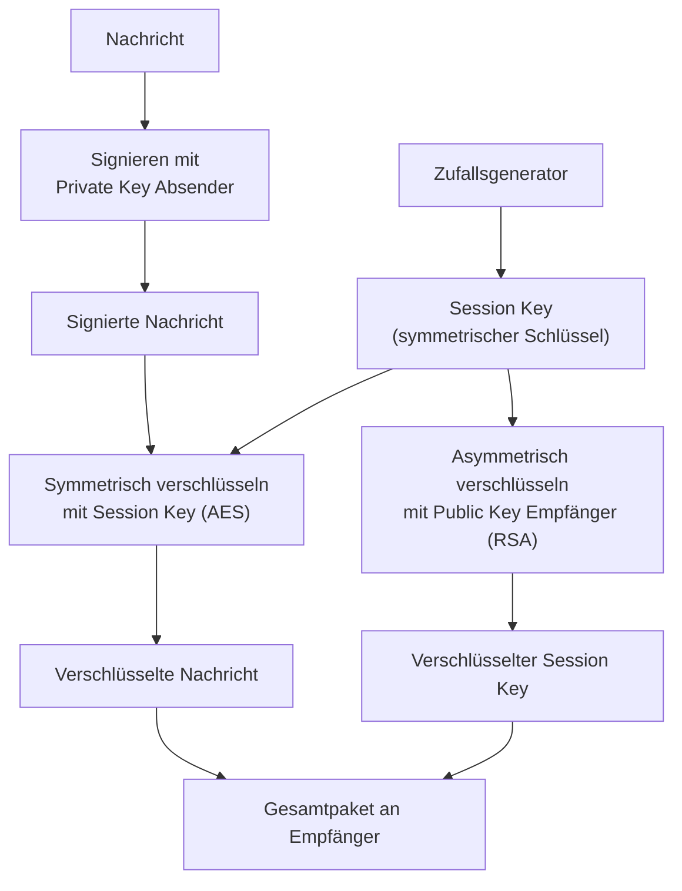

**Beim Senden:**
1. Nachricht signieren (Private Key des Absenders)
2. Zufälligen Session Key generieren
3. Nachricht symmetrisch mit Session Key verschlüsseln
4. Session Key asymmetrisch mit Public Key des Empfängers verschlüsseln
5. Beides zusammen senden

**Beim Empfangen:**
1. Session Key asymmetrisch entschlüsseln (Private Key des Empfängers)
2. Nachricht symmetrisch entschlüsseln (mit Session Key)
3. Signatur verifizieren (Public Key des Absenders)

> **Wichtige Reihenfolge:** Zuerst signieren, dann verschlüsseln. Die Signatur soll die Authentizität des *Klartextes* belegen – wenn man erst verschlüsselt und dann signiert, bezeugt die Signatur nur die verschlüsselte Version.

Die hybride Verschlüsselung ist das Fundament von HTTPS, S/MIME, PGP und fast allen modernen Sicherheitsprotokollen.

---
<Callout type="danger">
## Zusammenfassung
</Callout>
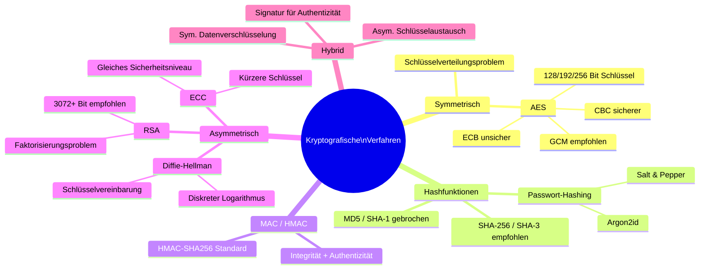

---

### Weiterführende Ressourcen

- [OWASP Password Storage Cheat Sheet](https://cheatsheetseries.owasp.org/cheatsheets/Password_Storage_Cheat_Sheet.html)
- BSI – Kryptographische Verfahren, Empfehlungen und Schlüssellängen: [bsi.bund.de](https://www.bsi.bund.de/SharedDocs/Downloads/DE/BSI/Publikationen/TechnischeRichtlinien/TR02102/BSI-TR-02102.pdf)
- Buch: Kryptografie in Theorie und Praxis – [Springer](https://link.springer.com/book/10.1007/978-3-8348-9631-5)
