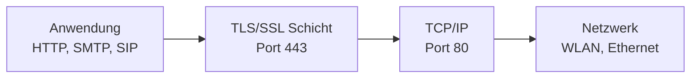
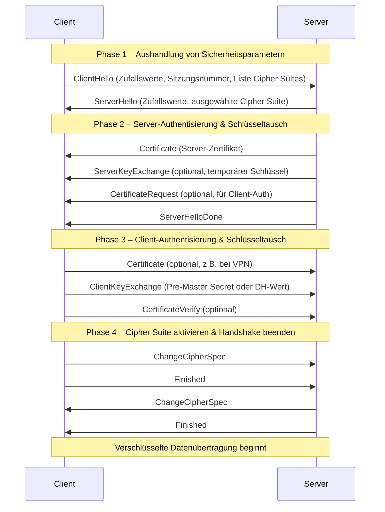
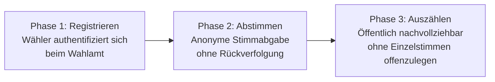
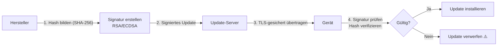
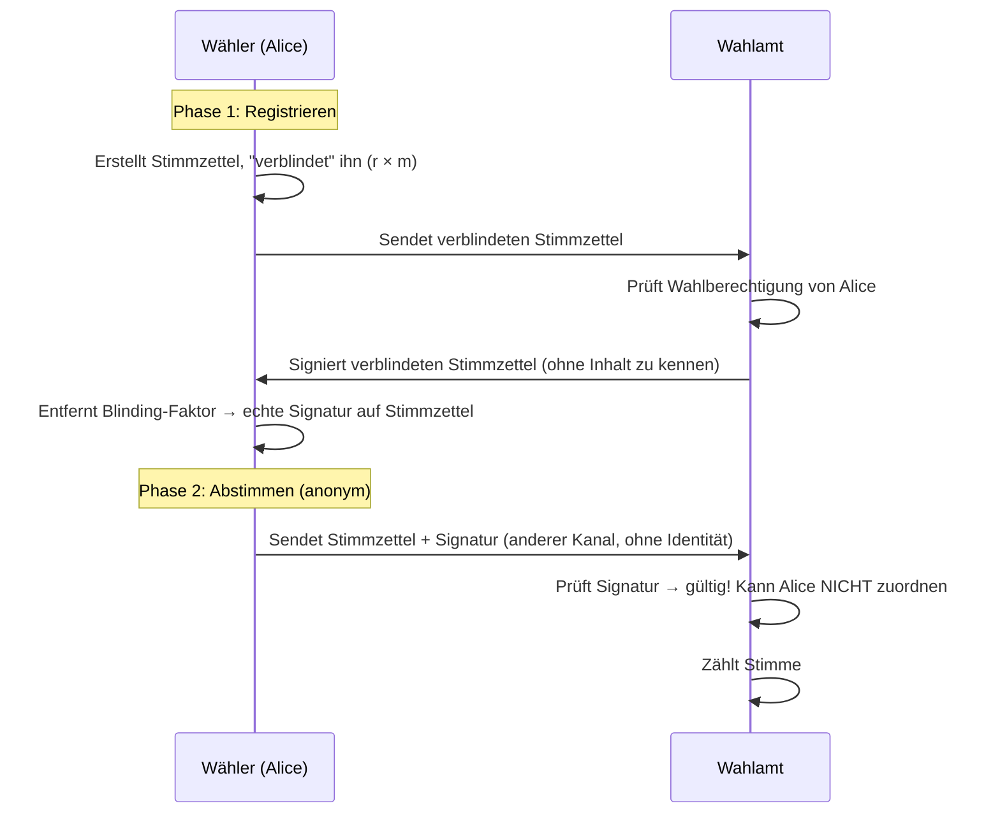
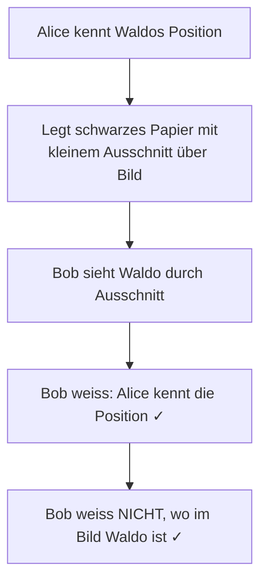
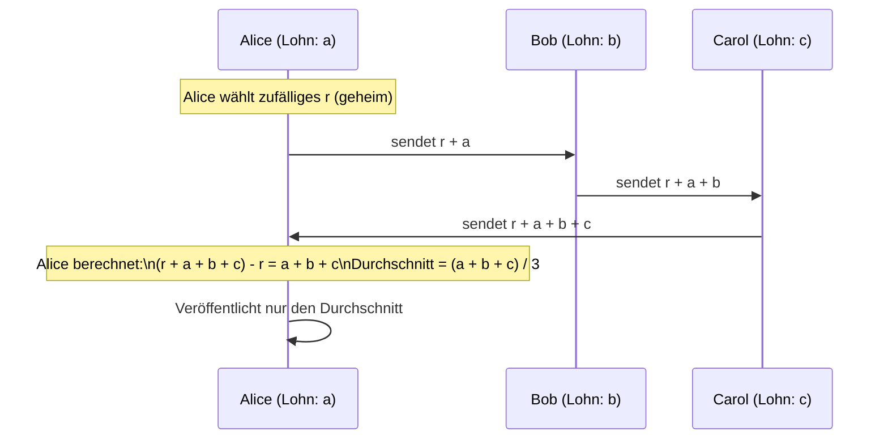
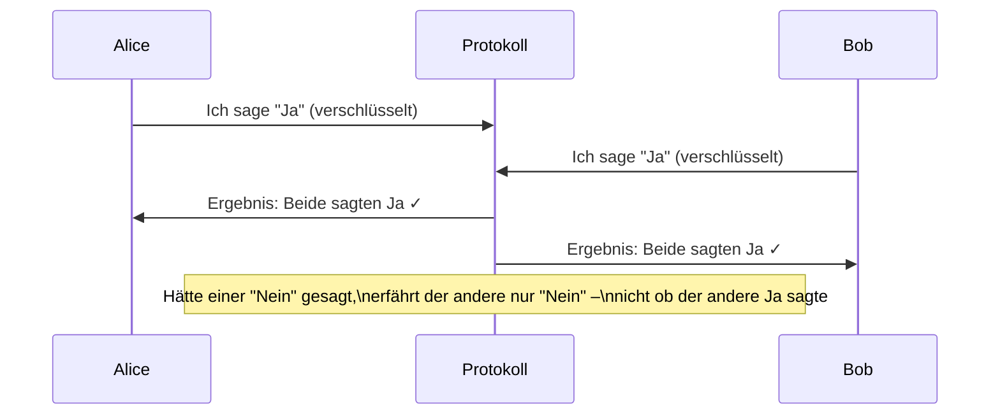
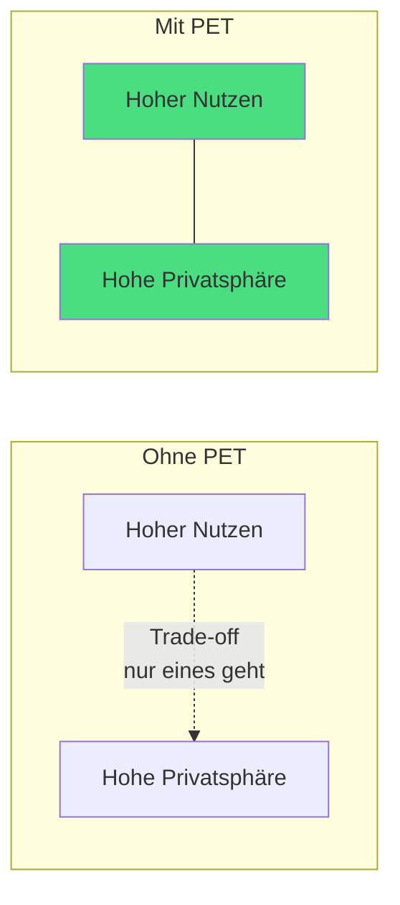
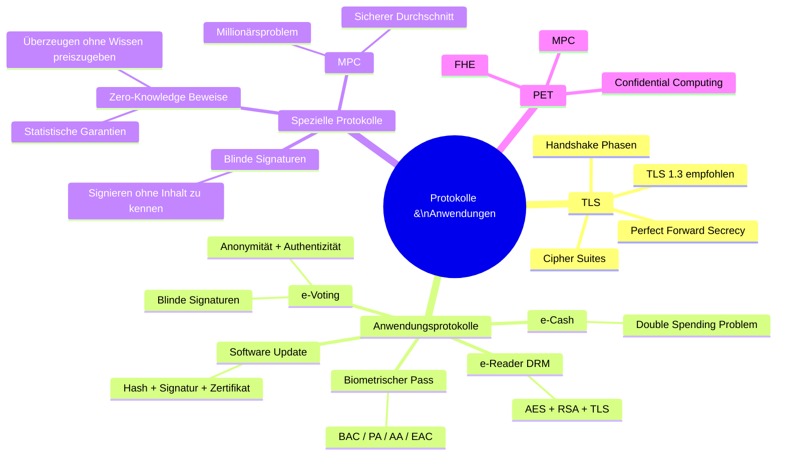

import Callout from '../../../../components/Callout.astro';

<Callout type="green">
## 1. Algorithmus vs. Protokoll
</Callout>

In der Kryptografie ist der Unterschied zwischen einem **Algorithmus** und einem **Protokoll** fundamental – und wird in der Praxis oft verwechselt.

| Begriff | Definition | Beispiele |
|---|---|---|
| **Algorithmus** | Eine endliche, wohldefinierte Abfolge von Schritten, die ein bestimmtes Problem löst oder eine Aufgabe ausführt | SHA-256, AES, RSA |
| **Protokoll** | Eine Regelmenge für die Kommunikation zwischen mehreren Teilnehmern, die festlegt, welche Nachrichten in welcher Reihenfolge ausgetauscht werden und welche Algorithmen dabei verwendet werden | TLS, HTTPS, e-Voting |

**Analogie:** Ein Algorithmus ist wie ein Rezept – die genaue Schritt-für-Schritt-Anleitung für ein Gericht. Ein Protokoll ist wie die Regeln eines formellen Abendessens: wer spricht wann, was wird in welcher Reihenfolge gereicht, und welche Rezepte (Algorithmen) dabei eingesetzt werden.

Dieser Unterschied ist wichtig, weil selbst **korrekte Algorithmen in einem fehlerhaften Protokoll unsicher sein können**. Ein sicheres Protokoll kombiniert mehrere Algorithmen auf eine ganz bestimmte Art und Weise – und diese Kombination muss ebenfalls kryptografisch analysiert und bewiesen werden.

Die wichtigsten Kategorien kryptografischer Algorithmen, auf denen Protokolle aufbauen:

| Kategorie | Typischer Algorithmus | Zweck |
|---|---|---|
| Kryptografische Hash-Funktionen | SHA-256 | Integritätsprüfung, Fingerabdrücke |
| Symmetrische Verschlüsselung | AES | Schnelle Verschlüsselung grosser Datenmengen |
| Schlüsselvereinbarung | Diffie-Hellman | Sicherer Schlüsselaustausch über unsicheren Kanal |
| Asymmetrische Verschlüsselung | RSA, ECC | Verschlüsselung mit Public/Private-Key-Paar |
| Digitale Signatur | RSA, DSA, ECDSA | Authentizität und Nicht-Abstreitbarkeit |

Beim Analysieren von Protokollen stellt man immer drei Schlüsselfragen:
1. **Welche Phasen gibt es?** (z.B. Registrieren + Abstimmen beim e-Voting)
2. **Welche Algorithmen werden eingesetzt?** (z.B. AES für Verschlüsselung, RSA für Signaturen)
3. **Fehlen noch Algorithmen oder Konzepte?** (z.B. braucht e-Voting «Blinde Signaturen»)

---

<Callout type="green">
## 2. TLS – Transport Layer Security
</Callout>

**TLS (Transport Layer Security)** ist das wichtigste kryptografische Protokoll im Internet. Es schützt die Verbindung zwischen Browser und Webserver – erkennbar am 🔒-Symbol und «https://» in der Adressleiste. Der Vorgänger hiess SSL; TLS ist die sichere, modernisierte Nachfolgeversion.

Das Internet wurde ursprünglich *ohne* Sicherheitsmechanismen entworfen (TCP/IP). TLS wurde nachträglich als Schicht zwischen der Anwendungsschicht und der Transportschicht eingefügt:



TLS besteht intern aus mehreren Protokollen: dem **Handshake Protocol** (Verbindungsaufbau), dem **Record Layer Protocol** (verschlüsselte Datenübertragung), dem **Alert Protocol** (Fehlermeldungen) und weiteren Teilprotokollen.

### TLS-Handshake

Der Handshake ist der Prozess, bei dem Client und Server sich «kennenlernen», Sicherheitsparameter aushandeln und einen gemeinsamen Sitzungsschlüssel etablieren – bevor ein einziges Byte Nutzdaten übertragen wird.



**Warum so komplex?** Jede Phase hat einen spezifischen Zweck:
- **Phase 1:** Welche Algorithmen werden unterstützt? Beide Seiten tauschen Zufallswerte aus – das verhindert Replay-Angriffe, bei denen ein Angreifer einen abgehörten Handshake später nochmals einspielt.
- **Phase 2:** Der Server beweist seine Identität via Zertifikat. Ohne diesen Schritt wäre ein Man-in-the-Middle-Angriff trivial möglich.
- **Phase 3:** Optional kann auch der Client seine Identität beweisen (z.B. bei Unternehmens-VPNs oder Online-Banking).
- **Phase 4:** Ab jetzt läuft alles verschlüsselt und integritätsgeschützt mit dem ausgehandelten Schlüssel.

Nach dem Handshake leiten beide Seiten aus dem ausgetauschten Material (Pre-Master Secret + Zufallswerte) **Sitzungsschlüssel** ab – je einen für Verschlüsselung und Integritätsprüfung in beiden Richtungen.

### Cipher Suites

Eine **Cipher Suite** ist eine Kombination von kryptografischen Algorithmen, auf die sich Client und Server einigen müssen. Sie definiert alle Algorithmen für eine TLS-Verbindung:

```
TLS_ECDHE_RSA_WITH_AES_128_GCM_SHA256
 │     │     │        │           │
 │     │     │        │           └── Hash-Funktion für HMAC: SHA-256
 │     │     │        └────────────── Verschlüsselungsalgorithmus: AES-128-GCM
 │     │     └─────────────────────── Authentifizierung: RSA
 │     └───────────────────────────── Schlüsseltausch: ECDHE (Ephemeral)
 └─────────────────────────────────── Protokoll: TLS
```

| Komponente | Mögliche Algorithmen | Zweck |
|---|---|---|
| Schlüsseltauschverfahren | RSA, DH, ECDH, PSK | Gemeinsamen Sitzungsschlüssel etablieren |
| Authentifizierung | RSA, DSA, ECDSA | Identität des Servers beweisen |
| Verschlüsselung | RC4 ❌, DES ❌, AES ✅, ChaCha20 ✅ | Nutzdaten verschlüsseln |
| Hash/MAC | MD5 ❌, SHA-1 ❌, SHA-256 ✅ | Integrität sicherstellen |

> **Warum «ECDHE» statt «ECDH»?** Das «E» steht für *Ephemeral* – der Schlüssel wird nur für diese eine Sitzung erzeugt und danach weggeworfen. Das ermöglicht **Perfect Forward Secrecy (PFS)**: Selbst wenn der private Schlüssel des Servers später kompromittiert wird, können vergangene Sitzungen nicht entschlüsselt werden, weil für jede Sitzung ein neuer, einmaliger Schlüssel verwendet wurde.

### TLS 1.3 – Die aktuelle Version

TLS 1.3 ist eine grundlegende Überarbeitung mit deutlichen Sicherheitsverbesserungen gegenüber TLS 1.2:

- Nur noch **DHE oder ECDHE** für den Schlüsseltausch → Perfect Forward Secrecy ist jetzt zwingend
- Alle veralteten und unsicheren Algorithmen entfernt (RC4, DES, SHA-1 usw.)
- Nur noch 5 erlaubte Cipher Suites – deutlich weniger Angriffsfläche durch Fehlkonfiguration
- Schnellerer Handshake (1-RTT statt 2-RTT, optional 0-RTT für Wiederverbindungen)

**Unterstützte Cipher Suites in TLS 1.3:**
```
TLS_AES_128_GCM_SHA256
TLS_AES_256_GCM_SHA384
TLS_CHACHA20_POLY1305_SHA256
TLS_AES_128_CCM_SHA256
TLS_AES_128_CCM_8_SHA256
```

---

<Callout type="green">
## 3. Kryptografische Anwendungsprotokolle
</Callout>

Die folgenden Systeme zeigen, wie kryptografische Grundbausteine zu vollständigen, sicheren Protokollen zusammengebaut werden. Beim Analysieren hilft es, immer zuerst die **Phasen** des Systems zu identifizieren, dann die Anforderungen je Phase, und schliesslich die passenden Algorithmen.

### e-Voting

Ein sicheres elektronisches Wahlsystem muss fünf zentrale Sicherheitsziele **gleichzeitig** erfüllen – was technisch sehr anspruchsvoll ist, da sich manche Ziele widersprechen:

| Ziel | Beschreibung | Warum schwierig? |
|---|---|---|
| **Authentifizierung** | Nur berechtigte Wähler dürfen abstimmen | Identifikation ist nötig |
| **Vertraulichkeit (Anonymität)** | Niemand darf sehen, wie jemand gewählt hat | Widerspricht der Authentifizierung |
| **Integrität** | Stimmen dürfen nicht verändert oder gelöscht werden | Manipulation muss nachweisbar verhindert sein |
| **Nachvollziehbarkeit** | Jeder kann das Ergebnis prüfen | Öffentliche Prüfung vs. Geheimhaltung |
| **Unwiederholbarkeit** | Jede Person darf nur einmal abstimmen | Technisch und rechtlich komplex |

Das Grundproblem: Wenn ich weiss, dass du gewählt hast (Authentifizierung), wie kann ich dann sicherstellen, dass niemand weiss, wie du gewählt hast (Anonymität)? Die Lösung sind **Blinde Signaturen** (siehe Abschnitt 4).



### Biometrischer Pass (E-Pass)

Der biometrische Schweizer Pass enthält im **RFID-Chip** (kontaktlos auslesbar) Personendaten, ein digitales Passfoto, optional Fingerabdrücke und Irisdaten sowie eine digitale Signatur zur Echtheitsprüfung.

Ohne Schutz könnte jeder mit einem RFID-Lesegerät in einem Café unbemerkt Passdaten auslesen. Deshalb werden mehrere Protokollebenen eingesetzt:

| Protokoll | Ziel | Verfahren |
|---|---|---|
| **BAC** (Basic Access Control) | Zugriffsschutz – verhindert unbefugtes Auslesen | Symmetrische Kryptografie (3DES / AES) |
| **PA** (Passive Authentication) | Echtheit der Chipdaten überprüfen | Asymmetrische Kryptografie (RSA/ECDSA) |
| **AA** (Active Authentication) | Klonen des Chips verhindern | Asymmetrische Challenge-Response |
| **EAC** (Extended Access Control) | Schutz biometrischer Daten (Finger, Iris) | PKI + asymmetrische Sitzungsschlüssel |

**BAC** stellt sicher, dass der Pass nur ausgelesen werden kann, wenn er physisch vorgezeigt und der aufgedruckte maschinenlesbare Code (MRZ – Machine Readable Zone) eingelesen wurde. Das verhindert das unbemerkte Auslesen aus der Tasche.

### e-Cash

Digitales Bargeld muss die Eigenschaften von physischem Bargeld nachbilden – inklusive Anonymität. Banknoten haben keine «Spur»; e-Cash sollte das ebenfalls ermöglichen. Das **Double-Spending-Problem** (eine digitale Münze könnte beliebig kopiert und mehrfach ausgegeben werden) ist die zentrale Herausforderung.

| Ziel | Kryptografisches Verfahren | Algorithmus |
|---|---|---|
| Anonymität & Blindung | Blind Signature Schema | RSA mit Blindung |
| Integrität & Echtheit der Coins | Digitale Signaturen | RSA, ECDSA |
| Fälschungsschutz (Double Spending) | Identifikationsprotokolle | Zero-Knowledge Proofs |
| Transaktionsschutz | Symmetrische Verschlüsselung | AES-128/256 |
| Schlüsselaustausch | Asymmetrische Kryptografie | Diffie-Hellman, ECDH |

> Das Double-Spending-Problem ohne Anonymität zu verletzen ist eine der grössten Herausforderungen in der Kryptografie. Bitcoin löst es durch die Blockchain – eine öffentliche, unveränderliche Transaktionsliste –, opfert dabei aber die Anonymität.

### Buch auf e-Reader (DRM)

E-Books sind urheberrechtlich geschützt. Das System muss sicherstellen, dass nur berechtigte Nutzer lesen können – ohne die Privatsphäre der Nutzer zu verletzen.

| Bereich | Algorithmus | Zweck |
|---|---|---|
| Datenverschlüsselung (E-Book) | AES-128/256 | Verschlüsselung des E-Book-Inhalts (DRM) |
| Schlüsselaustausch | RSA-2048 / ECDH | Sicherer Austausch des AES-Schlüssels |
| Digitale Signaturen | RSA / ECDSA | Signieren von Inhalten oder Geräten |
| Hashfunktionen | SHA-256 | Integritätsprüfung von Dateien |
| Kommunikationssicherheit | TLS (HTTPS) | Schützt den Datenaustausch mit dem Server |
| Firmware-Verifikation | RSA / ECDSA + SHA-256 | Nur signierte Software läuft auf dem Gerät |

### Software-Update

Software-Updates haben direkten Zugriff auf das System. Ein manipuliertes Update wäre ein katastrophaler Angriff – deshalb müssen sie besonders sorgfältig abgesichert werden.

| Zweck | Algorithmus | Beschreibung |
|---|---|---|
| Integrität | SHA-256 / SHA-384 | Hash über die gesamte Firmware |
| Authentizität | RSA-2048 / ECDSA-P256 | Hersteller signiert das Update |
| Vertrauensnachweis | X.509-Zertifikat | Authentifiziert den Hersteller via PKI |
| Transportschutz | TLS 1.2/1.3 | Schutz beim Download |
| Gerätebindung (optional) | HMAC-SHA256 | Update an Seriennummer gebunden |



---

<Callout type="green">
## 4. Blinde Signaturen
</Callout>

Die **Blinde Signatur** ist ein kryptografisches Verfahren, bei dem jemand ein Dokument unterschreibt, **ohne dessen Inhalt zu sehen**.

**Analogie:** Man legt ein Dokument in einen Umschlag mit Kohlepapier. Der Unterzeichner unterschreibt den Umschlag – die Unterschrift überträgt sich durch das Kohlepapier auf das Dokument im Innern, ohne dass der Unterzeichner es gelesen hat.

**Warum ist das nützlich?**
- **Beim e-Voting:** Das Wahlamt bestätigt, dass eine Stimme gültig ist – ohne zu wissen, welche Stimme es ist.
- **Bei e-Cash:** Die Bank signiert eine Münze als echt – ohne zu wissen, welche Münze es ist (Anonymität des Nutzers bleibt gewahrt).



**Wichtige Eigenschaft:** Das Wahlamt hat den Stimmzettel signiert, kann aber die Signatur nicht mit dem spezifischen Wähler verknüpfen – die Anonymität ist mathematisch garantiert. Das löst den scheinbaren Widerspruch zwischen Authentifizierung (nur berechtigte Wähler) und Anonymität (niemand weiss, wie jemand gewählt hat).

---

<Callout type="green">
## 5. Zero-Knowledge-Beweise
</Callout>

Ein **Zero-Knowledge-Beweis (ZK-Beweis)** ist ein Protokoll, bei dem eine Partei (der **Prover**) eine andere Partei (den **Verifier**) davon überzeugt, dass sie ein Geheimnis kennt – **ohne das Geheimnis selbst preiszugeben**.

> **Entscheidende Unterscheidung:** ZK-Beweise *überzeugen* – sie *beweisen* nicht im mathematischen Sinne. Sie liefern statistische Garantien: Je mehr Runden, desto sicherer – aber nie 100%.

Drei Eigenschaften müssen erfüllt sein:

1. **Vollständigkeit (Completeness):** Wenn die Aussage wahr ist, kann ein ehrlicher Prover den Verifier überzeugen.
2. **Solidität (Soundness):** Ein unehrlicher Prover kann den Verifier nur mit sehr geringer Wahrscheinlichkeit täuschen.
3. **Zero-Knowledge:** Der Verifier lernt nichts ausser der Tatsache, dass die Aussage wahr ist – keinerlei weitere Information über das Geheimnis.

### Beispiel 1: «Wo ist Waldo?»

Alice weiss, wo Waldo in einem Wimmelbild versteckt ist. Bob glaubt ihr nicht. Alice will beweisen, dass sie es weiss – ohne Bobs Entdeckung zu spoilern.

**Lösung:** Alice schneidet ein grosses schwarzes Papier mit einem kleinen Ausschnitt zurecht und hält es über das Bild. Durch den Ausschnitt sieht man nur Waldo – aber nicht, wo er im Gesamtbild ist.



Bob ist überzeugt, dass Alice die Position kennt – aber hat keinerlei Information darüber, wo Waldo ist.

### Beispiel 2: Interaktiver ZK-Beweis (Farbenblindheit)

Bob behauptet, er kann Farben sehen. Alice ist farbenblind und glaubt ihm nicht. Wie kann Bob beweisen, dass er Farben unterscheiden kann, ohne zu erklären, wie er das macht?

**Protokoll:**
1. Alice hält je einen roten und blauen Ball in den Händen – Bob sieht sie.
2. Alice legt die Hände hinter den Rücken und tauscht die Bälle *entweder* oder *nicht*.
3. Alice zeigt die Bälle wieder. Bob sagt, ob sie getauscht wurden.

**Analyse:**
- Ohne Farbsehen: Bob rät mit 50% Wahrscheinlichkeit richtig.
- Mit Farbsehen: Bob liegt immer richtig.

Nach 20 Runden beträgt die Wahrscheinlichkeit, dass Bob ohne Farbsehen immer richtig rät: $(1/2)^{20} \approx 0{,}0001\%$.

Alice ist statistisch überzeugt, dass Bob Farben sehen kann – aber hat keinerlei Information darüber gewonnen, *wie* Bob Farben unterscheidet.

**Wichtige Erkenntnis:** ZK-Beweissysteme liefern nur statistische Garantien. Je mehr Runden, desto sicherer – aber nie absolute Gewissheit.

---

<Callout type="green">
## 6. Secure Multi-Party Computation & Millionärsproblem
</Callout>

Das **Millionärsproblem** ist ein klassisches Gedankenexperiment aus der Kryptografie, formuliert von Andrew Yao (1982):

> Zwei Millionäre wollen herausfinden, wer reicher ist – ohne dem anderen ihren genauen Reichtum zu verraten.

Das Dilemma: Wer seine Zahl zuerst nennt, gibt dem anderen einen Informationsvorteil. In einem normalen Gespräch gibt es keine faire Lösung ohne eine vertrauenswürdige dritte Partei.

**Die kryptografische Lösung:** **Secure Multi-Party Computation (MPC)** – zwei oder mehr Parteien berechnen gemeinsam eine Funktion über ihre privaten Eingaben, ohne dass eine Partei die Eingabe der anderen erfährt. Das Ergebnis (wer ist reicher?) darf bekannt werden – aber nicht die konkreten Zahlen.

### Konkretes Beispiel: Sicherer Durchschnitt

Alice, Bob und Carol arbeiten im selben Unternehmen. Sie wollen den Durchschnittslohn berechnen – ohne dass jemand den Lohn der anderen erfährt.

**Protokoll mit zufälligem Rauschen:**



**Sicherheitsanalyse:**
- Bob kennt `r + a`, weiss aber nicht, was `r` und was `a` ist.
- Carol kennt `r + a + b` – ebenfalls nicht auflösbar ohne weiteres Wissen.
- Nur Alice kennt `r` und kann das Endergebnis berechnen.

**Schwachstellen des einfachen Protokolls:**
- Wenn Alice und Bob zusammenarbeiten, kennen sie `r` und `r+a` → sie können `a` (Bobs Lohn) berechnen.
- Wenn jemand lügt, verfälscht er das Ergebnis.

In der Praxis werden robustere MPC-Protokolle eingesetzt, die auch bei teilweise unehrlichen Teilnehmern korrekte Ergebnisse liefern.

### Das Datingproblem

Ein verwandtes Problem:

> Alice überlegt, ob sie Bob ins Kino einladen soll – aber sie will sich nicht blamieren, falls er Nein sagt. Bob hat dasselbe Problem. Beide wären gerne zusammen im Kino, aber niemand macht den ersten Schritt.

Die optimale Lösung: Beide geben an, ob sie «Ja» oder «Nein» sagen würden – aber das Ergebnis wird nur dann enthüllt, wenn **beide** Ja gesagt haben. Das ist ein **Privacy-Preserving Matchmaking Protokoll**.



---

<Callout type="green">
## 7. Privacy-Enhancing Technologies (PET)
</Callout>

Zero-Knowledge-Beweise, Blinde Signaturen und MPC gehören zur Kategorie der **Privacy-Enhancing Technologies (PET)**. Diese verschieben den fundamentalen Trade-off zwischen gesellschaftlichem Nutzen und Datenschutz:



Ohne PET gilt: Je nützlicher ein System (z.B. eine zentrale Gesundheitsdatenbank), desto mehr Privatsphäre muss man aufgeben. PET **verschiebt diese Effizienzgrenze** – sie ermöglichen Systeme, die sowohl nützlich als auch datenschutzkonform sind.

| Ansatz | Technologie | Anwendung |
|---|---|---|
| **Kryptografisch** | Blinde Signaturen | e-Voting, e-Cash |
| **Kryptografisch** | Zero-Knowledge Proofs | Identitätsnachweis ohne Datenweitergabe |
| **Kryptografisch** | Secure Multi-Party Computation (MPC) | Gemeinsame Berechnungen ohne Datenaustausch |
| **Kryptografisch** | Fully Homomorphic Encryption (FHE) | Berechnungen auf verschlüsselten Daten |
| **Hardware-basiert** | Confidential Computing (CC) | Trusted Execution Environments (TEE), TPM |

**Fully Homomorphic Encryption (FHE)** verdient besondere Erwähnung: Es ermöglicht, Berechnungen direkt auf **verschlüsselten** Daten durchzuführen – das Ergebnis ist ebenfalls verschlüsselt und kann nur vom Besitzer des Schlüssels entschlüsselt werden. Ein Cloud-Anbieter könnte so medizinische Daten auswerten, ohne sie je im Klartext zu sehen. Technisch noch sehr rechenintensiv, aber ein hochaktives Forschungsfeld mit schnell wachsender Praxisrelevanz.

---

<Callout type="danger">
## Zusammenfassung
</Callout>


---

### Weiterführende Quellen

- NIST – TLS 1.3 Guidelines: [nvlpubs.nist.gov](https://nvlpubs.nist.gov/nistpubs/SpecialPublications/NIST.SP.800-52r2.pdf)
- Yao, Andrew C. (1982): Protocols for Secure Computations – Originalpaper zum Millionärsproblem
- Wikipedia: Zero-Knowledge Proof: [en.wikipedia.org](https://en.wikipedia.org/wiki/Zero-knowledge_proof)
- Wikipedia: Blinde Signatur: [de.wikipedia.org](https://de.wikipedia.org/wiki/Blinde_Signatur)
