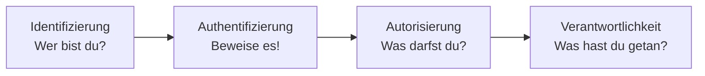
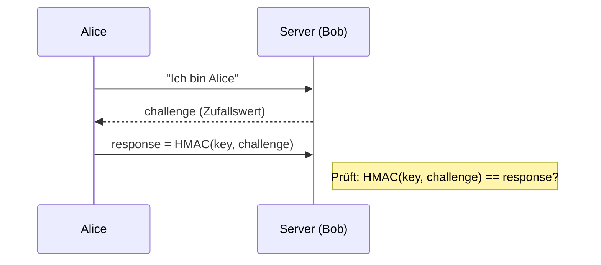
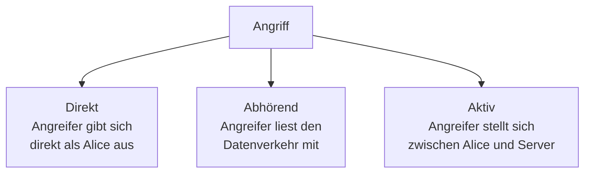
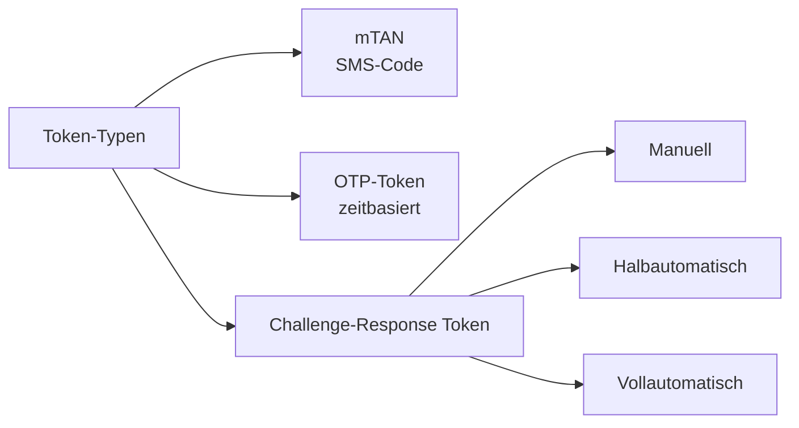
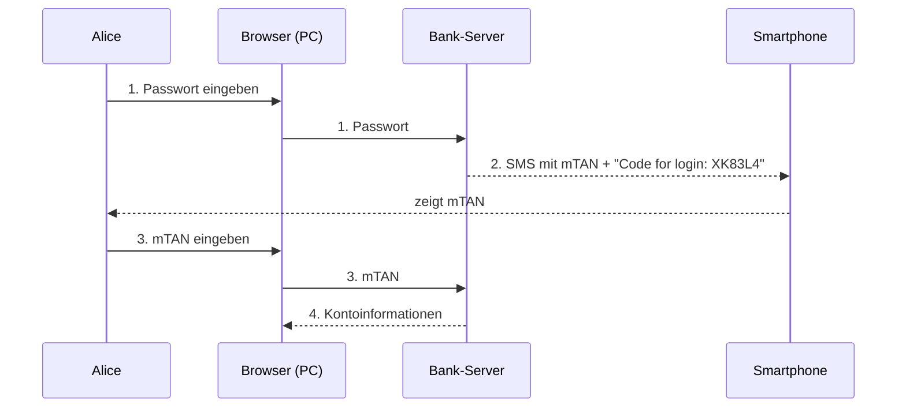
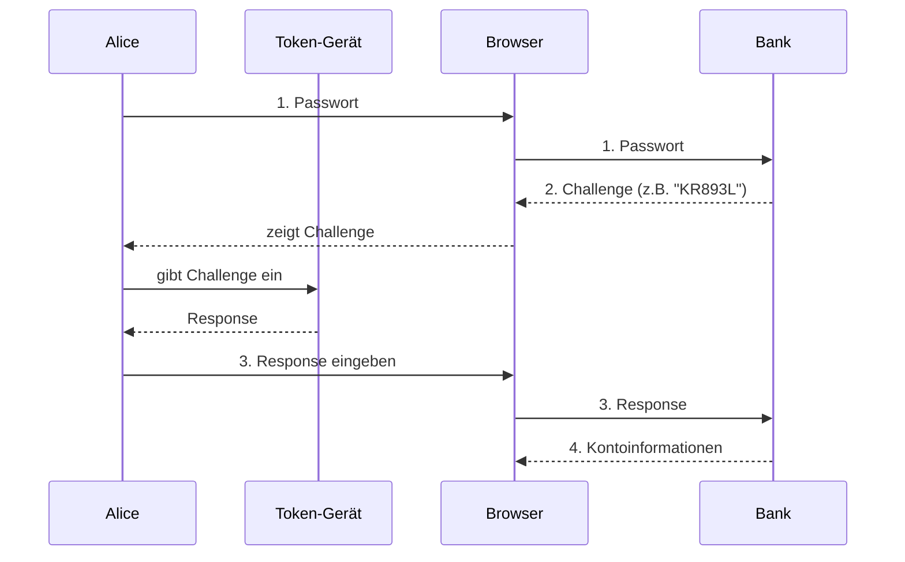
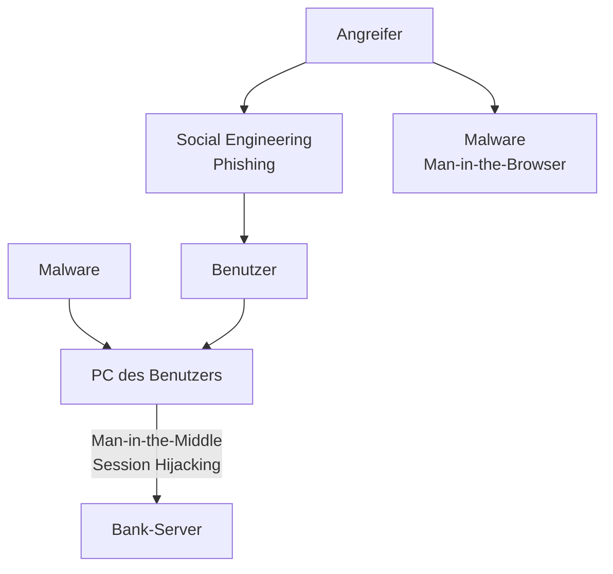
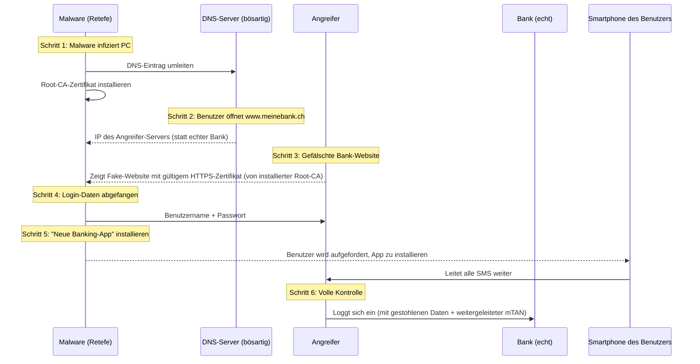
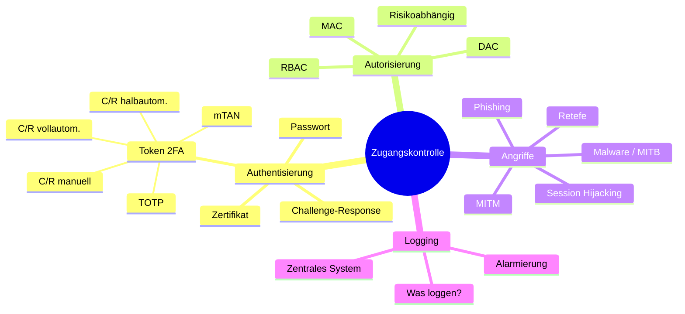

import Callout from '../../../../components/Callout.astro';

<Callout type="green">
## 1. Grundprinzipien der Zugangskontrolle
</Callout>
Zugangskontrolle (engl. *Access Control*) ist eines der zentralsten Konzepte in der IT-Sicherheit. Sie beantwortet die Frage: **Wer darf was tun?** Das übergeordnete Grundprinzip lautet **Least Privilege** (auch: *Need-to-know*): Ein Benutzer erhält nur genau die Rechte, die er für seine Aufgabe benötigt – nicht mehr.

### Die vier Säulen der Zugangskontrolle



| Schritt | Frage | Beispiel |
|---|---|---|
| **Identifizierung** | Welcher Benutzer? | Benutzername |
| **Authentifizierung** | Ist der Benutzer wirklich der richtige? | Passwort, Token |
| **Autorisierung** | Welche Rechte hat er? | Access Control Matrix |
| **Verantwortlichkeit** | Was hat er getan? | Log-Dateien |

### Defense-in-depth

Ein weiteres Grundprinzip ist **Defense-in-depth** (Schichtensicherheit): Sicherheitsmassnahmen werden kombiniert und gestaffelt eingesetzt – ähnlich einer mittelalterlichen Burg mit Burggraben, hohen Mauern, Wachtürmen und bewachten Eingangstoren. Kein einzelnes Sicherheitssystem ist unfehlbar; die Kombination mehrerer Schichten macht einen Angriff deutlich schwieriger.

---

<Callout type="green">
## 2. Login-Protokolle
</Callout>

Ein Login-Protokoll besteht immer aus zwei Phasen:
1. **Setup**: Gemeinsames Einrichten der Credentials (z. B. Passwort wählen, Schlüsselpaar erstellen)
2. **Login**: Der eigentliche Anmeldevorgang

### Passwort-Login

Das einfachste Verfahren: Alice sendet ihren Benutzernamen und ihr Passwort an den Server. Der Server vergleicht das empfangene Passwort mit dem gespeicherten Hash.

**Wichtig:** Das Passwort wird niemals im Klartext gespeichert, sondern als kryptographischer Hash (`Hash(password)`). So kann ein Angreifer, der die Datenbank stiehlt, die Passwörter nicht direkt lesen.

**Problem:** Das Passwort wird im Klartext über das Netz übertragen (nur durch TLS geschützt). Wird die Verbindung abgehört, ist das Passwort kompromittiert.

### Challenge-Response mit symmetrischer Kryptographie

Hier wird das Passwort/der Schlüssel **nie** übertragen. Stattdessen:



Der **HMAC** (Hash-based Message Authentication Code) berechnet einen Authentisierungscode aus dem gemeinsamen Schlüssel und der Challenge. Nur wer den Schlüssel kennt, kann die korrekte Response berechnen.

**Warum eine Challenge?** Die Challenge muss zufällig und einmalig sein (*Nonce*). So kann ein Angreifer, der eine frühere Response aufgezeichnet hat (*Replay-Angriff*), diese nicht erneut verwenden – die nächste Challenge ist eine andere.

### Challenge-Response mit asymmetrischer Kryptographie

Zwei Varianten:

**Variante 1 – Digitale Signatur:**
Alice signiert die Challenge mit ihrem privaten Schlüssel. Der Server verifiziert mit Alices öffentlichem Schlüssel.

```
response = SIGN(privateKey, challenge)
Server prüft: VERIFY(publicKey, response, challenge)
```

**Variante 2 – Verschlüsselung:**
Der Server verschlüsselt eine Zufallszahl R mit Alices öffentlichem Schlüssel. Alice entschlüsselt mit ihrem privaten Schlüssel und sendet R zurück.

```
challenge = ENC(publicKey, R)
response  = DEC(privateKey, challenge) → R
```

**Vorteil beider Varianten:** Der private Schlüssel verlässt nie Alices Gerät. Selbst wenn der Server kompromittiert wird (er kennt nur den öffentlichen Schlüssel), kann sich ein Angreifer nicht als Alice ausgeben.

### Authentisierung mit Zertifikat

Erweiterung der asymmetrischen Variante: Alice übermittelt zusätzlich ihr **Zertifikat** (ausgestellt von einer vertrauenswürdigen CA). Der Server prüft zuerst das Zertifikat und danach die Signatur. So wird sichergestellt, dass der öffentliche Schlüssel wirklich zu Alice gehört.

### Maschine vs. Person

| | Maschine | Person |
|---|---|---|
| Speicher | Grosses Memory | Stark eingeschränkt |
| Rechenfähigkeit | Sehr gut (kryptographische Funktionen) | Schlecht |
| Lösung | Asymmetrische Kryptographie | Passwort + Token |

Kombination: Alice entsperrt ein Schlüsselfile auf ihrem Computer durch ein Passwort – die Maschine übernimmt dann die kryptographischen Berechnungen.

---
<Callout type="green">
## 3. Angriffe auf Login-Protokolle
</Callout>
### Angriffsarten



- **Direkter Angriff (Impersonation):** Eve versucht sich direkt als Alice anzumelden, z. B. durch Erraten des Passworts (Brute Force).
- **Abhörender Angriff (Eavesdropping):** Eve liest die Kommunikation zwischen Alice und Bob mit. Bei einfachen Passwörtern kann sie das Passwort direkt stehlen; bei Challenge-Response ist eine einzelne aufgezeichnete Session wertlos (dank Nonce).
- **Aktiver Angriff (Man-in-the-Middle):** Eve schaltet sich zwischen Alice und Bob und gibt sich gegenüber beiden als die andere Partei aus. Sie kann so den Datenverkehr manipulieren.

---

<Callout type="green">
## 4. Authentisierungsfaktoren
</Callout>

### Die vier Faktoren

| Faktor | Typ | Beispiele |
|---|---|---|
| **Wissen** | Etwas, das ich weiss | Passwort, PIN, Geheimfrage |
| **Besitz** | Etwas, das ich habe | Hardware-Token, Smartphone, Smartcard |
| **Eigenschaft** | Etwas, das ich bin | Fingerabdruck, Gesichtserkennung, Irisscan |
| **Fähigkeit** | Etwas, das ich kann | Unterschrift, Stimmerkennung |

### Starke Authentisierung (2FA / MFA)

Es existieren verschiedene Definitionen:
- **Fermilab:** Kein Passwort wird über das Netz übertragen
- **Handbook of Applied Cryptography:** Challenge-Response-Identifikation
- **BSI:** Zwei verschiedene Authentisierungsmethoden
- **ENISA:** Mindestens 2 Faktoren aus verschiedenen Kategorien

**Wichtig für Banken:** Häufig wird zusätzlich gefordert, dass die Authentisierung auf **zwei getrennten Geräten** stattfindet (nicht nur 2 Faktoren auf demselben Gerät). Warum? Wenn Malware das Gerät infiziert, sind alle Faktoren auf diesem Gerät kompromittiert.

---
<Callout type="green">
## 5. Token für 2FA
</Callout>
Token sind physische oder softwarebasierte Geräte, die einen zweiten Authentisierungsfaktor liefern.

### Übersicht der Token-Typen



| Token | Funktionsprinzip | Sicherheitsbasis |
|---|---|---|
| **mTAN** | Bank sendet SMS-Code | Zugang zum Kommunikationskanal (SIM-Karte) |
| **OTP (TOTP)** | Gerät zeigt zeitbasierten Code | Einmalpasswort = f(Schlüssel, Zeit) |
| **C/R manuell** | Benutzer gibt Challenge manuell ein, liest Response ab | Einmalpasswort = f(Schlüssel, Challenge) |
| **C/R halbautom.** | Challenge wird automatisch eingelesen (QR-Code/NFC), Antwort manuell eingegeben | Einmalpasswort = f(Schlüssel, Challenge) |
| **C/R vollautom.** | Challenge und Response vollständig automatisch | Einmalpasswort = f(Schlüssel, Challenge) |

### Login mit mTAN (SMS)



**Was schützt das?** Ein Angreifer, der nur das Passwort kennt, kann sich nicht einloggen – er bräuchte auch die SIM-Karte/das Smartphone.

### Login mit TOTP (zeitbasierter OTP)

Das Token-Gerät (z. B. RSA SecurID) berechnet alle 30–60 Sekunden einen neuen Code: `OTP = f(Schlüssel, aktuelle Zeit)`. Server und Gerät sind zeitsynchronisiert und kennen denselben geheimen Schlüssel.

**Vorteil:** Keine Netzwerkverbindung nötig. **Nachteil:** Anfällig für Phishing-Live-Angriffe, da der Code in einem kurzen Zeitfenster abgefangen und sofort verwendet werden kann.

### Login mit Challenge-Response (manuell)



### Login mit Challenge-Response (vollautomatisch)

Beim automatischen Verfahren kommuniziert die Banking-App direkt mit dem Token (via QR-Code, NFC o. ä.). Der Benutzer muss nur bestätigen.

**Kritischer Punkt:** Das automatische C/R-Login hat **keine Bindung an die Session**! Das Token bestätigt nur "Login ja/nein", aber nicht *welche* Session gerade bestätigt wird. Dies ist ein wichtiger Angriffspunkt.

---
<Callout type="green">
## 6. Angriffe auf e-Banking
</Callout>
### Überblick der Angriffsarten



| Angriff | Beschreibung | Wo greift er an? |
|---|---|---|
| **Social Engineering** | Benutzer wird manipuliert, Credentials preiszugeben | Beim Benutzer |
| **Phishing** | Gefälschte Bank-Website | Beim Benutzer |
| **Malware** | Schadsoftware auf dem PC des Benutzers | Auf dem Gerät |
| **Man-in-the-Browser** | Malware im Browser manipuliert Transaktionen | Im Browser |
| **Man-in-the-Middle** | Angreifer schaltet sich zwischen PC und Bank | Im Netzwerk |
| **Session Hijacking** | Gestohlenes Session-Cookie wird verwendet | Im Netzwerk |

### Retefe – Ein reales Angriffsszenario

Retefe ist eine in der Schweiz verbreitete Malware, die gezielt auf e-Banking abzielt. Die Funktionsweise ist besonders raffiniert:



**Warum funktioniert das?** Das installierte Root-CA-Zertifikat sorgt dafür, dass der Browser keine HTTPS-Warnung anzeigt – der Benutzer sieht ein gültiges Schloss. Der Angreifer verwendet zudem oft einen geographisch nahen kompromittierten Computer als Proxy, um geografische Sicherheitsprüfungen der Bank zu umgehen.

### Vorsicht: Credential-Verteilung

**Problem:** Wenn Bank, Passwort und Token im selben Brief verschickt werden, genügt ein einziger Postdiebstahl.

**Lösung:** Passwort und Token in **zwei separaten Briefen mit zeitlichem Abstand** verschicken.

### Vorsicht: Credential Recovery

Credentials, die per Telefon zurückgesetzt werden können, sind **phishbar**: Ein Angreifer ruft die Bank an, gibt sich als der Kunde aus, beantwortet Sicherheitsfragen (die er über Social Engineering kennt) und erhält neue Credentials.

**Lösung:** Der Telefonanruf sollte nur den Recovery-Prozess *initiieren* – das eigentliche neue Credential muss über einen sicheren Kanal (z. B. Brief an registrierte Adresse) zugestellt werden.

---
<Callout type="green">
## 7. Vergleich der Token: Authentisierung vs. Autorisierung
</Callout>
### Authentisierung (Login) vs. Autorisierung (Transaktion)

- **Authentisierung** schützt die *Vertraulichkeit* der Bankkundendaten (Confidentiality): Nur der echte Kunde darf seine Kontodaten sehen.
- **Autorisierung** (Transaktionsbestätigung) schützt die *Integrität* der Transaktion (Integrity): Die Zahlung geht wirklich an den richtigen Empfänger.

### Schwachstelle: mTAN-Login – keine Transaktionsbindung

Beim mTAN-Login sendet die Bank einen Code mit dem Kontext "Code for login: XK83L4". Der Code ist **nur für das Login** – er enthält keine Information über die Transaktion.

Beim vollautomatischen C/R-Login gibt es sogar eine **Schwachstelle**: Das Token hat **keine Bindung an die Session**. Das bedeutet: Ein Angreifer könnte eine parallele Session öffnen und den Benutzer dazu bringen, versehentlich diese fremde Session zu autorisieren.

### Transaktionssignierung: mTAN (richtig)

Beim Bezahlen sollte die SMS die **Transaktionsdetails** enthalten:
```
Payment: CHF 555 to account nr 1-896665-2
Code: XK83L4
```
Der Benutzer kann so prüfen, ob die Zahlung korrekt ist, bevor er den Code eingibt.

### Transaktionssignierung: C/R manuell – Blind Signing

**Kritisches Problem:** Beim manuellen C/R-Token gibt der Benutzer nur die Challenge ein – er sieht **nicht**, welche Transaktion er bestätigt. Der Angreifer (z. B. ein Man-in-the-Browser) könnte die angezeigte Transaktion von "CHF 100 an Freund" zu "CHF 10'000 an Angreifer" umschreiben – der Token-Code wäre dennoch gültig.

### Vergleichsmatrix: Schutz gegen Angriffsarten

| Angriff | Streichliste | mTAN | TOTP | C/R manuell | C/R halbautom. | C/R vollautom. |
|---|:---:|:---:|:---:|:---:|:---:|:---:|
| | Login / Zahlung | Login / Zahlung | Login / Zahlung | Login / Zahlung | Login / Zahlung | Login / Zahlung |
| Phishing offline | ✗ / ✗ | ✓ / ✓ | ✓ / ✗ | ✓ / ✗ | ✓ / ✓ | ✓ / ✓ |
| Phishing live | ✗ / ✗ | ✗ / ✗ | ✗ / ✗ | ✗ / ✗ | ✗ / ✗ | ✓ / ✓ |
| Session hijacking | ✗ / ✗ | ✗ / ✗ | ✗ / ✗ | ✗ / ✗ | ✗ / ✗ | ✗ / ✗ |
| Man-in-the-Middle | ✗ / ✗ | ✗ / ✗ | ✗ / ✗ | ✗ / ✗ | ✗ / ✗ | ✓ / ✓ |
| Man-in-the-Browser | ✗ / ✗ | ✗ / ✗ | ✗ / ✗ | ✗ / ✗ | ✗ / ✓ | ✗ / ✓ |

> **Legende:** ✓ = Token schützt, ✗ = Token schützt nicht. Phishing offline = Angreifer sammelt Credentials ohne aktive Verbindung. Phishing live = Angreifer leitet Credentials in Echtzeit weiter.

**Kernaussage:** Session Hijacking lässt sich durch Token allein nicht verhindern – dafür braucht es sicheres Session-Management. Man-in-the-Browser ist nur durch vollautomatische C/R-Token abwehrbar, die die Transaktionsdetails direkt anzeigen (z. B. auf dem Smartphone).

---
<Callout type="green">
## 8. Autorisierungskonzepte
</Callout>
### Autorisierungsmodelle

**Discretionary Access Control (DAC):**
Jede Ressource hat einen Besitzer, der Zugriffsrechte selbst vergeben kann.
- Beispiel: UNIX-Dateisystem (`chmod`, `chown`)
- Flexibel, aber schwer zentral zu verwalten

**Mandatory Access Control (MAC):**
Zugriffsrechte werden zentral durch eine Sicherheitspolitik vergeben, der einzelne Benutzer kann sie nicht ändern.
- Beispiel: Mitarbeiter-Badges, Sicherheitszertifikate
- Starrer, aber sicherer

### Rollenbasierte Autorisierung (RBAC)

Rechte werden an **Rollen** vergeben, nicht direkt an Benutzer:

| | Statische Rollen | Dynamische Rollen |
|---|---|---|
| **Wann?** | Fix bei Kontoerstellung | Situationsabhängig erworben |
| **Beispiel** | Administrator hat mehr Rechte als normaler Benutzer | Stark authentisierter Benutzer darf mehr als schwach authentisierter |
| **Anwendung** | Berechtigungsverwaltung | Risikoabhängige Authentisierung im e-Banking |

### Risikoabhängige Autorisierung im e-Banking

Nicht jede Aktion benötigt das gleiche Sicherheitsniveau. Das Risiko bestimmt die Anforderungen:

```
↑ Höheres Risiko = stärkere Authentisierung/Autorisierung erforderlich
│
│  E-Banking vom PC:
│   → Vorregistrierte Zahlungen auslösen
│   → Beliebige Zahlungen ausführen
│   → Kundendaten ändern
│
│  Smartphone mit Access Card:
│   → E-Bills, "problemlose" Zahlungen
│
│  Smartphone mit Passwort:
│   → Konto lesen, Aktienhandel
│
↓  Smartphone ohne Passwort:
    → Allgemeine Informationen
```

**Für Zahlungen:** Zahlungen an bekannte Empfänger oder unter einem definierten Betrag (Allow-Liste) benötigen keine explizite 2FA-Bestätigung. Unbekannte oder hohe Zahlungen lösen immer eine Token-Bestätigung aus.

**Psychologischer Effekt:** Benutzer überprüfen seltene Transaktionsbestätigungen sorgfältiger – daher ist es klug, Routinebestätigungen zu reduzieren.

---
<Callout type="green">
## 9. Fehlerhafte Authentisierung (OWASP A2)
</Callout>
### Was ist das?

- Login ungenügend gegen **Brute-Force** geschützt
- **Schwache Passwörter** nicht verhindert
- Fehlende oder fehlerhafte **2-Faktor-Authentisierung**
- Unsicherer **Passwort-Recovery**-Prozess (z. B. Geheimfragen)
- Passwörter werden im **Klartext** oder mit schwachen Hashfunktionen gespeichert
- Fehlerhaftes **Session-Management**

### Was kann man dagegen tun?

- **Passwortpolicy** einführen (Mindestlänge, Komplexität, Vergleich mit kompromittierten Passwort-Listen)
- **Alle Login-Wege** (Registrierung, Recovery) mit gleichem Sicherheitsniveau absichern
- **Multi-Faktor-Authentisierung** implementieren
- **Login-Versuche limitieren** oder verzögern (Account Lockout, CAPTCHA)
- **Credentials sicher speichern** (bcrypt, Argon2 – keine MD5/SHA1!)

---
<Callout type="green">
## 10. Fehlerhafte Autorisierung (OWASP A5)
</Callout>
### Was ist das?

- Eingeschränkte Ressourcen durch direktes Aufrufen der **URL** erreichbar (Insecure Direct Object Reference)
- Daten anderer Benutzer durch **Manipulation eines Parameters** (z. B. `?userId=123`) einsehbar
- Eingeschränkte Funktionen werden nur **client-seitig** ausgeblendet (JavaScript), aber nicht server-seitig geprüft

**Beispiel:** Eine Banking-App blendet den "Administrator"-Button im Frontend aus – ein Angreifer ruft die Admin-URL direkt auf und hat vollen Zugriff.

### Was kann man dagegen tun?

- Zugriffsrechte **immer server-seitig** prüfen – niemals nur im Browser
- **Zentrales Berechtigungssystem** – kein verteiltes Rechtemanagement
- **Deny by default**: Zugriff verbieten, ausser explizit erlaubt
- **Least Privilege / Need-to-know** konsequent umsetzen
- **Indirekte Objektreferenzen** verwenden (z. B. UUID statt fortlaufende ID)
- Zugriffsrechte in **jedem Schritt eines Workflows** prüfen

---
<Callout type="green">
## 11. Logging und Monitoring (OWASP A10)
</Callout>
### Warum ist Logging wichtig?

Ein Angriff, der nicht erkannt wird, kann unbemerkt monatelang andauern. Real-Beispiel: Der Ruag-Hack (Schweizer Rüstungsunternehmen) begann im Dezember 2014 und wurde erst im Januar 2016 entdeckt – über **13 Monate** unbemerkte Präsenz. Ähnliche Zahlen zeigt der M-Trends-Bericht: 2011 betrug die durchschnittliche Verweildauer von Angreifern 416 Tage, bis 2019 sank sie auf 56 Tage – immer noch enorm lang.

### Was ist ungenügendes Logging?

- Wichtige Events (**Login, fehlgeschlagene Logins, Transaktionen, Credential-Änderungen**) werden nicht geloggt
- Fehler erzeugen keine oder unklare Log-Nachrichten
- Kein **zentrales Log-System** (SIEM)
- Logs sind **ungenügend geschützt** und können manipuliert werden
- Logs werden nicht überwacht oder analysiert
- Keine **automatischen Alarme** bei Anomalien

### Was kann man dagegen tun?

- Alle **kritischen Events** vollständig und nachvollziehbar loggen
- **Zentrales Log-System** (z. B. SIEM wie Splunk, ELK) einrichten
- **Automatisches Alarmsystem** bei auffälligen Vorkommnissen (z. B. 100 fehlgeschlagene Logins in 1 Minute)
- Logs **regelmässig analysieren** und überwachen
- Logs **schreibgeschützt** und integer aufbewahren (Tamper-evident Logging)

---
<Callout type="danger">
## Zusammenfassung
</Callout>


### Kernaussagen

1. **Starke Authentisierung** = mindestens 2 Faktoren aus verschiedenen Kategorien, idealerweise auf 2 getrennten Geräten.
2. **Token schützen nicht gegen alles** – Session Hijacking erfordert sicheres Session-Management; Man-in-the-Browser erfordert vollautomatische Token mit Transaktionsanzeige.
3. **Transaktionssignierung** ist wichtiger als Login-Schutz: Wer die Transaktion manipulieren kann (MITB), umgeht den Login-Schutz komplett.
4. **Autorisierung immer server-seitig** – client-seitiger Schutz ist kein echter Schutz.
5. **Logging ist keine optionale Massnahme** – ohne Logs ist ein Angriff nicht erkennbar und nicht nachvollziehbar.
