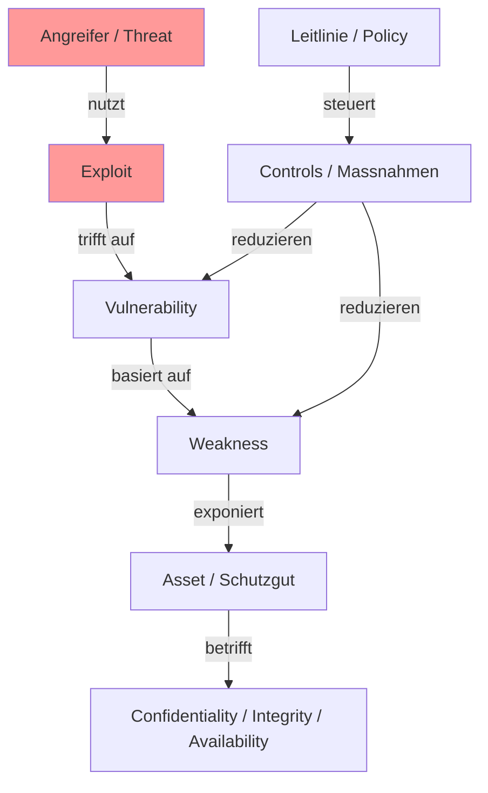
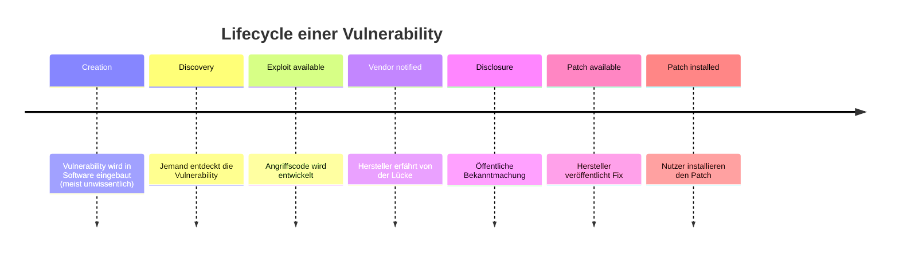
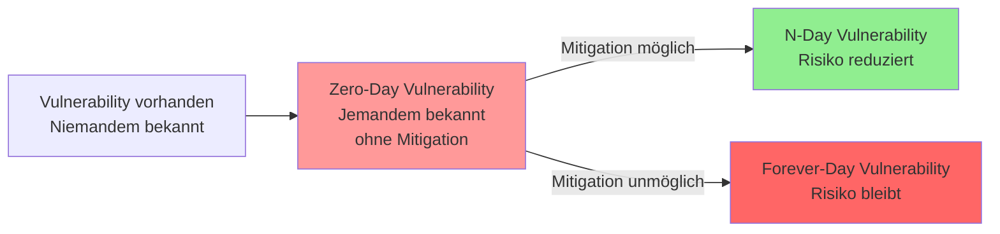
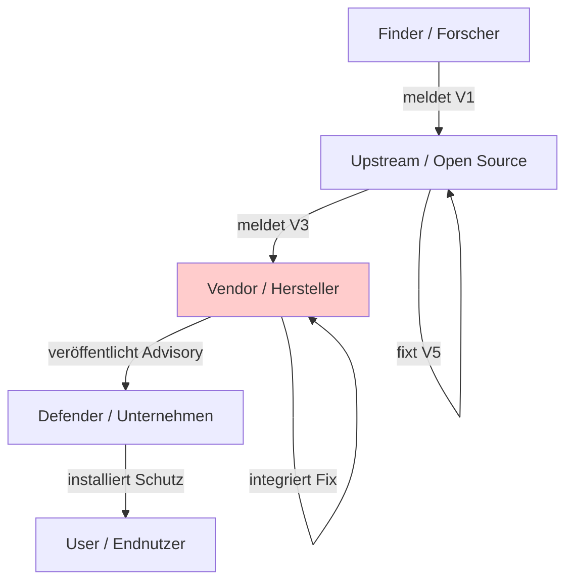
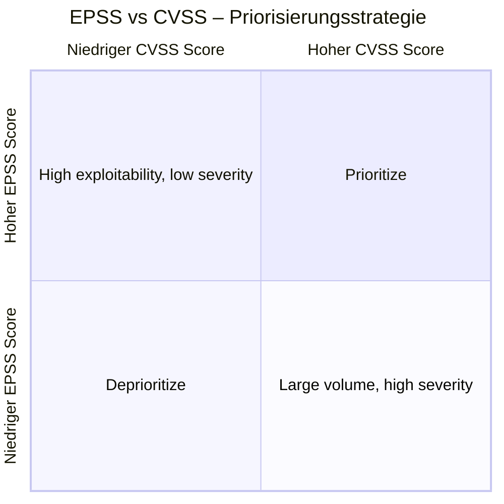
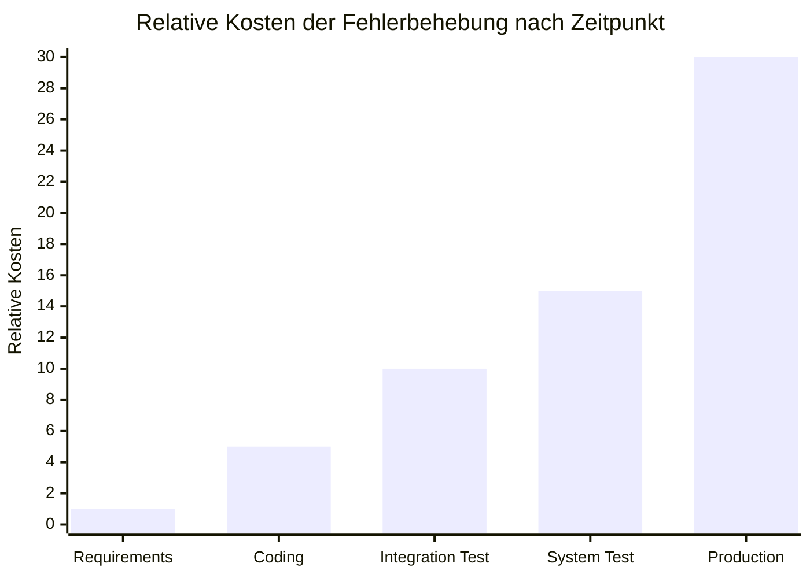
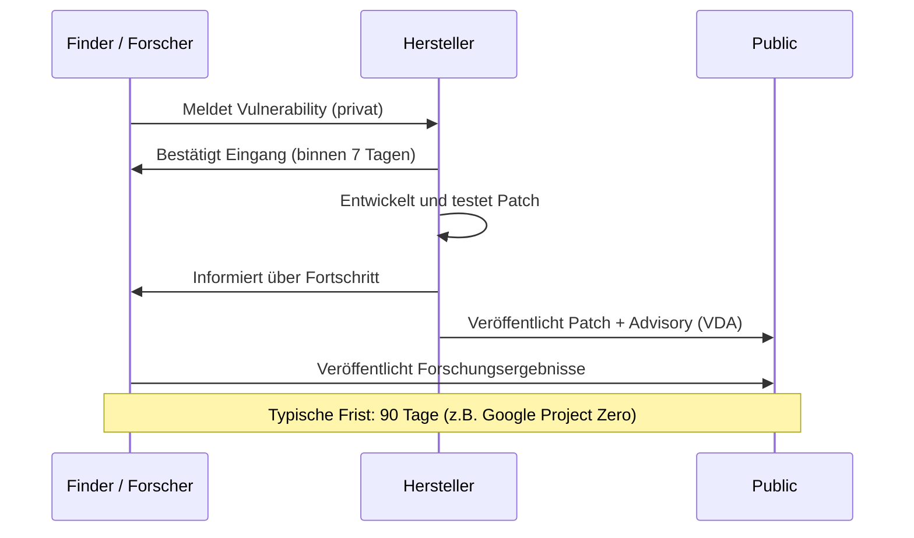
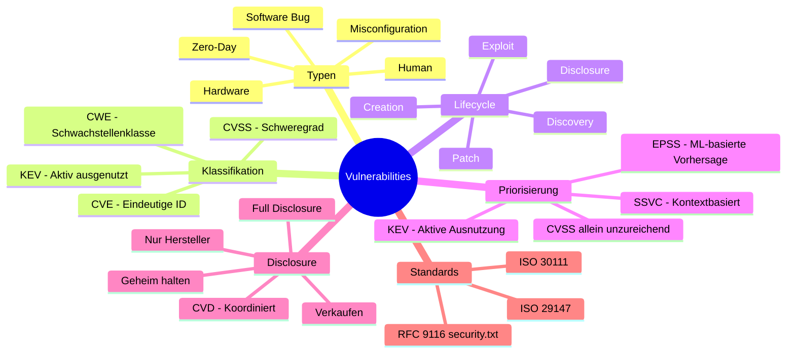

## Lernziele

Nach dieser Vorlesung kannst du:
- beschreiben, was **Vulnerabilities** sind und wie sie mit Risiken für ein Unternehmen verknüpft sind
- die Bedeutung des **Disclosure-Prozesses** einer Vulnerability verstehen
- Methoden zur **Priorisierung** von Vulnerabilities anwenden

---

## Teil 1: Was sind Vulnerabilities?

### Warum das Thema wichtig ist

Die wirtschaftlichen Schäden durch Cybervorfälle sind enorm. In Deutschland wurden 2024 Gesamtschäden von **266,6 Milliarden Euro** durch Cyberkriminalität verursacht (Quelle: Bitkom). Die grössten Einzelposten sind dabei:
- Funktionsausfall von IT-Systemen (54,5 Mrd. €)
- Kosten für Rechtsstreitigkeiten (53,1 Mrd. €)
- Umsatzverluste durch kopierte Produkte (39,2 Mrd. €)

Viele dieser Vorfälle werden durch Schwachstellen in Software oder Systemen überhaupt erst ermöglicht. Das macht das Verständnis von Vulnerabilities zu einer Kernkompetenz in der Informationssicherheit.

---

### Typen von Vulnerabilities

Es gibt viele Arten von Schwachstellen in IT-Systemen. Eine Übersicht:

| Typ | Beschreibung |
|-----|-------------|
| Veraltete / ungepatchte Software | Software mit bekannten, aber nicht behobenen Lücken |
| Hardware Vulnerability | Fehler in der Hardware selbst (z. B. Spectre, Meltdown) |
| Zero-Day Vulnerability | Unbekannte Lücke, für die noch kein Patch existiert |
| Network Vulnerability | Schwachstellen in Netzwerkprotokollen oder -konfigurationen |
| Human Vulnerability | Social Engineering, Phishing, Insider-Bedrohungen |
| Misconfiguration | Fehlkonfigurierte Systeme oder Dienste |
| Unsecured API | APIs ohne ausreichende Authentifizierung / Autorisierung |
| Weak / stolen credentials | Schwache oder gestohlene Anmeldedaten |
| Access Control / Unauthorized Access | Fehlende oder fehlerhafte Zugriffskontrollen |

In dieser Vorlesung liegt der Fokus auf **Software-Vulnerabilities**.

---

### Typen von Software-Vulnerabilities

Die häufigsten Kategorien von Software-Schwachstellen sind:

- **Overflow** (z. B. Buffer Overflow): Zu viele Daten überschreiben Speicherbereiche
- **Memory Corruption**: Fehlerhafte Speicherverwaltung (Use-After-Free, Double-Free)
- **SQL-Injection**: Einschleusen von SQL-Code über Benutzereingaben
- **XSS (Cross-Site Scripting)**: Einschleusen von Skripten in Webseiten
- **Directory Traversal**: Zugriff auf nicht autorisierte Verzeichnisse via `../`-Pfade

---

### Bug vs. Vulnerability – ein wichtiger Unterschied

Diese beiden Begriffe werden oft verwechselt, bezeichnen aber verschiedene Dinge:

> **Bug** = Ein Fehler in der Software, der dazu führt, dass sich das System nicht so verhält, wie es soll.

> **Vulnerability** = Ein oder mehrere Fehler (Bugs) in der Software, die einem Angreifer die Gelegenheit geben, die Software zu **missbrauchen**, um Sicherheitsziele (Vertraulichkeit, Integrität, Verfügbarkeit) zu verletzen. Ohne Exploit kein Fehler-Verhalten.

Der entscheidende Unterschied: Nicht jeder Bug ist eine Vulnerability, aber jede Vulnerability basiert auf einem oder mehreren Bugs. Eine Vulnerability wird erst dann sicherheitsrelevant, wenn sie durch einen Exploit ausgenutzt werden kann.

**Beispiel**: Ein Tippfehler in der UI ist ein Bug. Ein Buffer Overflow, der Remote Code Execution ermöglicht, ist eine Vulnerability.

---

### Typen von Software-Fehlern (Bugs)

Bugs lassen sich nach dem Zeitpunkt ihrer Entdeckung einteilen:

**1. Fehler, die der Compiler entdeckt (Syntax-Fehler)**
- Die Anweisung entspricht *nicht* der Syntax der Programmiersprache
- Werden bereits beim Kompilieren erkannt
- Beispiel: `printf("Hello world!")` ← fehlendes Semikolon in C

**2. Fehler, die erst zur Laufzeit entdeckt werden (semantische/logische Fehler)**
- Die Anweisung entspricht syntaktisch der Sprache, aber ist inhaltlich falsch
- Werden **nicht** vom Compiler erkannt
- Sicherheitskritische Bugs sind meist in dieser Kategorie
- Beispiel: `printf("Hello wolrd!");` ← falsches Ergebnis, aber kein Compilierfehler

---

### Wie viele Bugs hat Software?

Typische Richtwerte aus der Softwareentwicklung:
- **Entwicklung**: ~30 Fehler pro 1.000 Zeilen Code
- **Produktion**: weniger als 1 Fehler pro 1.000 Zeilen Code

Da Betriebssysteme wie Windows, Linux oder macOS **mehrere Millionen Zeilen Code** enthalten, ist klar: Es ist schlicht unmöglich, eine komplexe Software vollständig fehlerfrei zu machen.

**Interessante Beispiele aus der Praxis:**
- **Nummernschild „NULL"**: Ein Sicherheitsforscher liess sich das Kennzeichen „NULL" ausstellen – das System interpretierte dies als leeren Wert und wies ihm *alle* Tickets ohne Kennzeichen zu.
- **Ariane 5**: Ein Konvertierungsfehler (64-Bit-Float zu 16-Bit-Integer) führte 1996 zur Selbstzerstörung der Rakete – Schaden: ca. 500 Millionen Euro.

---

### Die Programmiersprache C und Vulnerabilities

Fast **die Hälfte aller bekannten Vulnerabilities** steckt in C-Code. Das liegt an den Eigenschaften der Sprache:
- Direkte Speicherverwaltung (kein automatisches Memory Management)
- Keine Bounds-Checking bei Arrays
- C erlaubt sehr hardwarenahe Operationen

Niklaus Wirth (Erfinder von Pascal) kommentierte dies pointiert:
- *„C ist verdeckter Assembler."*
- *„C++ ist eine Beleidigung für das menschliche Gehirn."*

Dies erklärt, warum moderne speichersichere Sprachen wie **Rust** zunehmend an Bedeutung gewinnen – sogar die US-Regierung (NSA, CISA) empfiehlt inzwischen den Wechsel weg von C/C++.

---

## Das Vulnerability-Ökosystem: CVE, CVSS, CWE, KEV

Diese vier Abkürzungen sind das Grundvokabular der Vulnerability-Verwaltung:

### CVE – Common Vulnerabilities and Exposures
- Öffentliches Verzeichnis einzelner Sicherheitslücken
- Jede Lücke erhält eine eindeutige **CVE-Nummer** (z. B. CVE-2017-5754)
- Ermöglicht einheitliche Kommunikation über Schwachstellen weltweit
- Verwaltet von MITRE, gefördert von der US-Regierung

### CVSS – Common Vulnerability Scoring System
- Standardisiertes Bewertungssystem mit Scores von **0–10**
- Beschreibt die *Schwere* einer Sicherheitslücke
- Berücksichtigt Angriffsmethode, Komplexität, benötigte Rechte und Impact

### CWE – Common Weakness Enumeration
- Klassifikation von typischen Software-Schwachstellenklassen
- Beispiel: CWE-20 (Improper Input Validation), CWE-22 (Path Traversal)
- Hilft Entwicklern, Schwachstellenklassen zu verstehen und zu vermeiden

### KEV – Known Exploited Vulnerabilities Catalog
- Geführt von der US-Behörde CISA
- Enthält Vulnerabilities, von denen **bekannt ist**, dass sie aktiv von Angreifern ausgenutzt werden
- US-Bundesbehörden sind verpflichtet, KEV-Einträge innerhalb bestimmter Fristen zu patchen

---

### CWE-Beispiele im Detail

**CWE-20: Improper Input Validation**

Wenn ein Programm Benutzereingaben nicht korrekt validiert, können Angreifer unerwartete Werte einschleusen:

```java
// Verwundbar: quantity kommt direkt vom Benutzer, ohne Validierung
int quantity = currentUser.getAttribute("quantity");
double total = price * quantity;
chargeUser(total); // Was wenn quantity = -1000 ist?
```

Der Angreifer könnte eine negative Menge eingeben und Geld zurückerhalten.

**CWE-22: Path Traversal**

Ein Programm verwendet Benutzereingaben, um Dateipfade zu konstruieren, ohne sicherzustellen, dass der Pfad im erlaubten Verzeichnis bleibt:

```java
// Verwundbar
String path = getInputPath();
if (path.startsWith("/safe_dir/")) {
    File f = new File(path);
    f.delete(); // Angreifer gibt ein: /safe_dir/../important.dat
}
```

Mit `../` kann ein Angreifer aus dem erlaubten Verzeichnis ausbrechen und beliebige Dateien löschen.

**CWE-1204: Weak Initialization Vector (WEP)**

Das WEP-Protokoll für WLAN verwendete einen zu schwachen Initialisierungsvektor (IV) für die Verschlüsselung. Da nur 24 Bit für den IV zur Verfügung standen und dieser sich nach ca. 5.000 Paketen wiederholte, konnten Angreifer den Schlüssel durch statistische Analyse ermitteln.

---

### Top 25 CWE (2024)

Die gefährlichsten Schwachstellenklassen laut MITRE (2024):

| Rang | CWE | Name |
|------|-----|------|
| 1 | CWE-79 | Cross-Site Scripting (XSS) |
| 2 | CWE-787 | Out-of-bounds Write |
| 3 | CWE-89 | SQL Injection |
| 4 | CWE-352 | Cross-Site Request Forgery (CSRF) |
| 5 | CWE-22 | Path Traversal |
| 6 | CWE-125 | Out-of-bounds Read |
| 7 | CWE-78 | OS Command Injection |
| 8 | CWE-416 | Use After Free |
| 9 | CWE-862 | Missing Authorization |
| 10 | CWE-434 | Unrestricted File Upload |

---

## Cybersecurity Risiko-Management

Eine Vulnerability entsteht nicht im Vakuum – sie ist eingebettet in ein Risikomodell:



**Erklärung der Elemente:**
- **Threat (Angreifer)**: Eine Person, Gruppe oder ein Prozess, der ein System angreifen könnte
- **Exploit**: Der konkrete Angriffscode oder die Methode, die eine Vulnerability ausnutzt
- **Vulnerability**: Das ausnutzbare Zusammenspiel aus Weakness und Exposition
- **Weakness**: Der eigentliche Fehler im System (Architektur, Design, Code, Konfiguration)
- **Asset**: Das Schutzziel (Daten, Systeme, Dienste)
- **Risk**: Das Produkt aus Wahrscheinlichkeit und Schadensausmass

> **Wichtig**: Eine Weakness alleine ist noch kein Risiko. Erst wenn ein Angreifer mit einem Exploit die Weakness durch die Exposition des Assets ausnutzt, entsteht ein reales Risiko.

---

## Lifecycle einer Vulnerability

Vulnerabilities durchlaufen einen charakteristischen Lebenszyklus:



### Phasen im Detail:

**Pre-disclosure Phase** (vor der Veröffentlichung):
- Die Vulnerability existiert, aber nur wenige wissen davon
- Zero-Day-Angriffe sind möglich (Angreifer hat Exploit, Hersteller weiss von nichts)
- Höchste Gefahr: kein Patch verfügbar, keine Signaturen in Antivirenprogrammen

**Post-disclosure Phase** (nach der Veröffentlichung):
- Hersteller hat die Lücke bestätigt und arbeitet an einem Fix
- Follow-on Attacks möglich: Mehr Angreifer wissen nun von der Lücke
- Wettlauf zwischen Patch-Entwicklung und Ausnutzung

**Post-patch Phase** (nach dem Patch):
- Patch ist verfügbar, aber noch nicht überall installiert
- Systeme ohne Patch bleiben verwundbar

### Evolution einer Vulnerability



- **Zero-Day**: Lücke ist bekannt, aber kein Patch existiert → maximales Risiko
- **N-Day**: Patch existiert; Risiko hängt davon ab, wie schnell er installiert wird (N = Anzahl Tage seit Veröffentlichung)
- **Forever-Day**: Keine Mitigation möglich (z. B. End-of-Life-Software ohne Support)

---

### Google Project Zero (GPZ) – Statistik

Google Project Zero ist ein Team von Sicherheitsforschern, das Zero-Day-Vulnerabilities in weit verbreiteter Software sucht und verantwortungsvoll meldet.

**Ergebnis (2019–2021):**
- Von der Meldung an den Hersteller bis zum öffentlichen Patch vergehen im Durchschnitt **61 Tage**
- 84% der gemeldeten Bugs wurden innerhalb von 90 Tagen gefixt
- Oracle ist mit durchschnittlich 109 Tagen der langsamste grosse Hersteller
- Google selbst ist mit 44 Tagen einer der schnellsten

Das Ziel von GPZ ist es, Hersteller unter Druck zu setzen, Patches schneller zu liefern – durch die Ankündigung, eine Vulnerability nach 90 Tagen öffentlich zu machen (Coordinated Disclosure).

---

## Vulnerabilities in Lieferketten

Moderne Software besteht aus vielen Komponenten von verschiedenen Anbietern. Das schafft ein komplexes Kommunikationsproblem:



**Das Problem:** Die Sichtbarkeit in Lieferketten ist gering. Wenn eine Vulnerability in einer Open-Source-Bibliothek (upstream) entdeckt wird, müssen alle Zwischenstufen (Hersteller, die die Bibliothek verwenden, Unternehmen, die die Software einsetzen) informiert werden und reagieren. Dieser Prozess braucht Zeit – und in dieser Zeit ist das System exponiert.

> **Cybersecurity ist auch Kommunikation!**

---

## Teil 2: Welche Vulnerabilities sind relevant?

### Das Priorisierungsproblem

Mit täglich Dutzenden neuer CVEs ist es unmöglich, alle Vulnerabilities sofort zu beheben. Untersuchungen zeigen:
- Unternehmen können monatlich nur **5–20%** ihrer bekannten Schwachstellen beheben
- Nur **2–7%** aller veröffentlichten CVEs werden jemals aktiv ausgenutzt

Daher ist eine sinnvolle Priorisierung entscheidend.

---

### CVSS – Common Vulnerability Scoring System

CVSS bewertet Vulnerabilities auf einer Skala von 0–10 anhand zweier Hauptdimensionen:

**Exploitability (Ausnutzbarkeit):**

| Metrik | Kürzel | Optionen |
|--------|--------|----------|
| Attack Vector | AV | Network (N), Adjacent (A), Local (L), Physical (P) |
| Attack Complexity | AC | Low (L), High (H) |
| Privileges Required | PR | None (N), Low (L), High (H) |
| User Interaction | UI | None (N), Required (R) |

**Impact (Auswirkung):**

| Metrik | Kürzel | Optionen |
|--------|--------|----------|
| Scope | S | Changed (C), Unchanged (U) |
| Confidentiality | C | None (N), Low (L), High (H) |
| Integrity | I | None (N), Low (L), High (H) |
| Availability | A | None (N), Low (L), High (H) |

**CVSS Severity Scale:**

| Severity | Score |
|----------|-------|
| None | 0.0 |
| Low | 0.1 – 3.9 |
| Medium | 4.0 – 6.9 |
| High | 7.0 – 8.9 |
| Critical | 9.0 – 10.0 |

**Beispiel CVE-2017-13077 (KRACK – WPA/WPA2):**
- Attack Vector: **Adjacent** (A) – Angreifer muss in Funkreichweite sein
- Attack Complexity: **High** (H) – Angriff ist komplex
- Privileges Required: **None** (N)
- User Interaction: **None** (N)
- Confidentiality: **High** (H)
- Integrity: **High** (H)
- Availability: **None** (N)
- **CVSS Score: 6.8 Medium**

> **Wichtige Einschränkung von CVSS**: CVSS beschreibt die *theoretische Schwere* einer Lücke, sagt aber nichts darüber aus, ob die Lücke tatsächlich ausgenutzt wird. Ein CVSS-Score von 9.8 bedeutet nicht, dass ein Exploit existiert oder aktiv eingesetzt wird.

---

### Das Problem mit CVSS als alleinigem Kriterium

Wenn man alle CVEs mit CVSS ≥ 7.0 priorisiert (Oktober 2023):
- **3.166 (2,3%)** davon wurden tatsächlich ausgenutzt → True Positives
- **76.858 (55,1%)** wurden *nicht* ausgenutzt, aber trotzdem priorisiert → False Positives (verschwendete Ressourcen)
- **686 (0,5%)** ausgenutzte CVEs hatten CVSS < 7.0 → False Negatives (übersehen!)

Das zeigt: **CVSS allein ist kein gutes Priorisierungswerkzeug** für die Frage „Was muss ich zuerst patchen?"

---

### EPSS – Exploit Prediction Scoring System

EPSS ist ein datengetriebenes Modell, das mit Hilfe von KI vorhersagt, wie wahrscheinlich eine Vulnerability innerhalb der **nächsten 30 Tage aktiv ausgenutzt** wird.

**Inputdaten für das Modell:**
- CVE-Metadaten (Alter, CWE, CVSS)
- Informationen aus Exploit-Datenbanken (Metasploit, Exploit-DB)
- Threat Intelligence Feeds
- Öffentliche Proof-of-Concept-Exploits

**Output:** Ein Score zwischen 0 und 1 (Wahrscheinlichkeit der Ausnutzung in den nächsten 30 Tagen)



**Interpretation:**
- **Oben rechts (Prioritize):** Hoher CVSS + hoher EPSS → sofort patchen
- **Oben links:** Hohes Exploit-Risiko trotz niedrigem CVSS → nicht ignorieren!
- **Unten links (Deprioritize):** Geringes CVSS + geringes EPSS → kann warten
- **Unten rechts:** Viele Vulnerabilities mit hohem CVSS aber niedrigem EPSS → oft overestimated

> **AI hilft Cybersecurity!** EPSS ist ein Paradebeispiel dafür, wie Machine Learning die Sicherheitsarbeit effizienter macht.

---

### SSVC – Stakeholder-Specific Vulnerability Categorization

SSVC ist ein pragmatischer Entscheidungsbaum-Ansatz, der die Priorisierung auf die **spezifische Situation des Unternehmens** abstimmt.

Entscheidungsdimensionen:
1. **Exploitation**: Gibt es bereits aktive Ausnutzung? (none / PoC / active)
2. **Automatable**: Kann der Angriff automatisiert werden? (yes / no)
3. **Technical Impact**: Was ist der technische Schaden? (partial / total)
4. **Mission & Well-being**: Wie kritisch ist das betroffene System für die Unternehmensmission?

**Empfohlene Aktionen:**
- **Track**: Beobachten, kein sofortiger Handlungsbedarf
- **Track\***: Erhöhte Aufmerksamkeit
- **Attend**: Aktiv um Lösung kümmern (innerhalb von Wochen)
- **Act**: Sofortiger Handlungsbedarf (innerhalb von Tagen)

---

### Wie findet man Vulnerabilities?

Es gibt verschiedene Methoden zur Entdeckung von Schwachstellen:

| Methode | Beschreibung | Tools |
|---------|-------------|-------|
| **SAST** (Static Application Security Testing) | Analyse von Quellcode ohne Ausführung | Semgrep, SonarQube, CodeQL |
| **DAST** (Dynamic Application Security Testing) | Automatisierte Angriffe auf laufende Anwendungen | OWASP ZAP, Burp Suite |
| **SCA** (Software Composition Analysis) | Erkennen von Schwachstellen in Libraries & Dependencies | Snyk, Dependabot, Trivy |
| **Fuzzing** | Zufällige Eingaben, um Abstürze zu provozieren | AFL++, libFuzzer |
| **Penetration Testing** | Manuelle Analyse durch Sicherheitsexperten | Metasploit, Burp Suite |
| **Vulnerability Scanner** | System- und Netzwerkscans auf bekannte CVEs | Nessus, OpenVAS, Qualys |
| **Code Review / Threat Modelling** | Manuelle Prüfung von Code und Architektur | STRIDE, PASTA |

**Kosten eines Bugs – je später entdeckt, desto teurer:**



Ein Bug, der in der Produktionsumgebung gefunden wird, kostet im Durchschnitt **30x mehr** als ein Bug, der bereits in der Requirements-Phase entdeckt wird. Das ist ein starkes Argument für **Security-by-Design** und frühzeitiges Security Testing.

---

### Microsoft Patch Tuesday

Microsoft veröffentlicht jeden zweiten Dienstag im Monat (Patch Tuesday) gesammelt Sicherheitsupdates für alle seine Produkte. Im März 2025 wurden beispielsweise **57 CVEs** in einem einzigen Update behoben.

Das zeigt die schiere Menge an Schwachstellen, mit denen IT-Abteilungen jeden Monat konfrontiert sind – und warum Priorisierung so wichtig ist.

---

## Teil 3: Kommunikation von Vulnerabilities

### Disclosure-Optionen

Wenn man eine Vulnerability entdeckt, gibt es grundsätzlich vier Möglichkeiten:

```mermaid
quadrantChart
    title Disclosure-Optionen und ihre Konsequenzen
    x-axis "Niedrige öffentliche Wirkung" --> "Hohe öffentliche Wirkung"
    y-axis "Wenig koordiniert" --> "Stark koordiniert"
    quadrant-1 Responsible Disclosure (CVD)
    quadrant-2 Full Disclosure
    quadrant-3 Geheim halten
    quadrant-4 An Meistbietenden verkaufen
```

1. **Geheim halten**: Vulnerability bleibt ungefixt; andere können sie ebenfalls entdecken
2. **Nur dem Hersteller mitteilen**: Effektiv, aber abhängig von der Kooperationsbereitschaft des Herstellers
3. **An den Meistbietenden verkaufen**: Lukrativ, aber ethisch und rechtlich problematisch; Exploits landen oft bei staatlichen Akteuren oder Kriminellen
4. **Allen mitteilen (Full Disclosure)**: Maximaler Druck auf den Hersteller, aber auch sofortige Exposition aller Nutzer

### Praxisbeispiel: VW vs. Garcia (2012/2013)

Forscher entdeckten eine kritische Schwachstelle im Remote-Keyless-Entry-System (RKE) der meisten VW-Fahrzeuge: Alle Fahrzeuge verwendeten nur wenige globale kryptografische Schlüssel, die seit fast 20 Jahren unverändert blieben. Durch Abhören eines einzigen Funksignals konnte ein Angreifer jeden betroffenen VW öffnen.

2013 erwirkte VW einen Gerichtsbeschluss, der die Veröffentlichung der Forschungsergebnisse für drei Jahre untersagte. Dies ist ein Beispiel dafür, dass **Hersteller nicht immer kooperieren** und warum klare rechtliche Rahmenwerke für Disclosure notwendig sind.

---

### CVD – Coordinated Vulnerability Disclosure

> **CVD** (früher: Responsible Disclosure) ist ein Modell zur Offenlegung von Schwachstellen, bei dem eine Vulnerability erst dann öffentlich gemacht wird, wenn den verantwortlichen Parteien **ausreichend Zeit** zum Patchen gegeben wurde.

**Ablauf:**



**Was wenn der Hersteller nicht reagiert oder den Fix verzögert?**
- Nach einer vereinbarten Frist (meist 90 Tage) wird die Vulnerability trotzdem veröffentlicht
- Dies setzt Hersteller unter Druck, Patches schnell zu liefern
- Google Project Zero ist das bekannteste Beispiel für diese Praxis

---

### ISO-Normen für Vulnerability Disclosure

Zwei ISO-Normen regeln den formalen Prozess:

**ISO/IEC 29147 – Vulnerability Disclosure:**
Regelt die externe Sicht: Wie ein Hersteller Meldungen entgegennimmt und darauf reagiert.

**ISO/IEC 30111 – Vulnerability Handling Processes:**
Regelt die interne Sicht: Wie ein Hersteller intern mit gemeldeten Vulnerabilities umgeht.

**Die vier Kernelemente des Prozesses:**

| Element | Beschreibung |
|---------|-------------|
| **VDP** (Vulnerability Disclosure Policy) | Öffentliche Policy des Herstellers: Wie können Vulnerabilities gemeldet werden? |
| **CVR** (Vulnerability Report) | Der Bericht des Finders an den Hersteller |
| Interner Prozess | Verifizierung, Entwicklung, Testing des Patches |
| **VDA** (Vulnerability Advisory) | Öffentliche Bekanntmachung nach Verfügbarkeit des Patches |

---

### Security.txt – RFC 9116

Security.txt ist ein einfacher, maschinenlesbarer Standard (RFC 9116, April 2022), der es Sicherheitsforschern erleichtert, den richtigen Ansprechpartner für Vulnerability-Meldungen zu finden.

**Konzept:** Eine Datei `security.txt` wird unter `/.well-known/security.txt` einer Website hinterlegt und enthält Kontaktinformationen für Security-Reports.

**Schweizer Beispiele:**
- `https://www.sbb.ch/.well-known/security.txt`
- `https://www.post.ch/.well-known/security.txt`
- `https://threema.ch/.well-known/security.txt`

**Was in einem VDR (Vulnerability Disclosure Report) enthalten sein muss:**
1. Bevorzugter Kontakt-Mechanismus
2. Möglichkeiten der sicheren Kommunikation (Vertraulichkeit und Authentizität)
3. Bestätigung des Eingangs innerhalb von 7 Kalendertagen

**Was in einem VDA (Vulnerability Disclosure Advisory) enthalten sein muss:**
1. Eindeutiger Identifier des Advisory
2. Eindeutiger Identifier für die Vulnerability (CVE-Nummer)
3. Datum der ersten Publikation (Revision History)
4. Ausreichende Informationen, damit Nutzer prüfen können, ob sie betroffen sind
5. Überprüfbare Authentizität des Advisory
6. Falls Massnahmen nötig: überprüfbare Authentizität dieser Massnahmen

---

### Ethische Betrachtung

Der Umgang mit Vulnerabilities wirft komplexe ethische Fragen auf:

1. **Verantwortung bei Entdeckung**: Habe ich als Finder eine Pflicht zur Meldung?
2. **Privatsphäre und Sicherheit**: Wie kommuniziere ich sensible Details, ohne anderen zu schaden?
3. **Kommerzielle Interessen vs. öffentliche Sicherheit**: Darf ich eine Vulnerability verkaufen? An wen?
4. **Ausbeutung durch Angreifer**: Was passiert, wenn ich nichts tue?
5. **Technologische Verantwortung**: Hersteller haben eine Pflicht, Sicherheitslücken zu beheben
6. **Zero-Day-Schwachstellen**: Sollen Regierungen Zero-Days horten oder melden?

> **Vulnerabilities can have significant economic, privacy and national security implications when exploited.** *(US Vulnerability Equities Process Charter)*

Das Horten von Zero-Days durch Geheimdienste (NSA, BND) ist ein kontroverses Thema: Diese Exploits können gestohlen werden (z. B. ShadowBrokers/EternalBlue → WannaCry) und verursachen dann massiven globalen Schaden.

---

## Zusammenfassung



**Die wichtigsten Erkenntnisse:**

1. **Bugs sind unvermeidlich** – moderne Software hat Millionen von Zeilen Code und selbst die beste Qualitätssicherung eliminiert nicht alle Fehler.

2. **Nicht jeder Bug ist eine Vulnerability** – erst das Ausnutzungspotenzial macht einen Bug sicherheitskritisch.

3. **Priorisierung ist entscheidend** – da man nicht alles sofort patchen kann, braucht man Methoden wie EPSS und SSVC, um das grösste Risiko zuerst zu adressieren.

4. **CVSS allein reicht nicht** – ein hoher CVSS-Score bedeutet nicht, dass eine Vulnerability aktiv ausgenutzt wird.

5. **Coordinated Disclosure schützt alle** – es ist der verantwortungsvolle Mittelweg zwischen geheim halten und sofortiger Veröffentlichung.

6. **Kommunikation ist Teil der Sicherheit** – Vulnerability-Management ist nicht nur ein technisches Problem, sondern auch ein Kommunikationsproblem entlang der gesamten Lieferkette.
