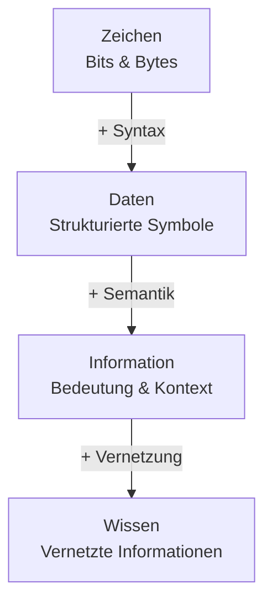
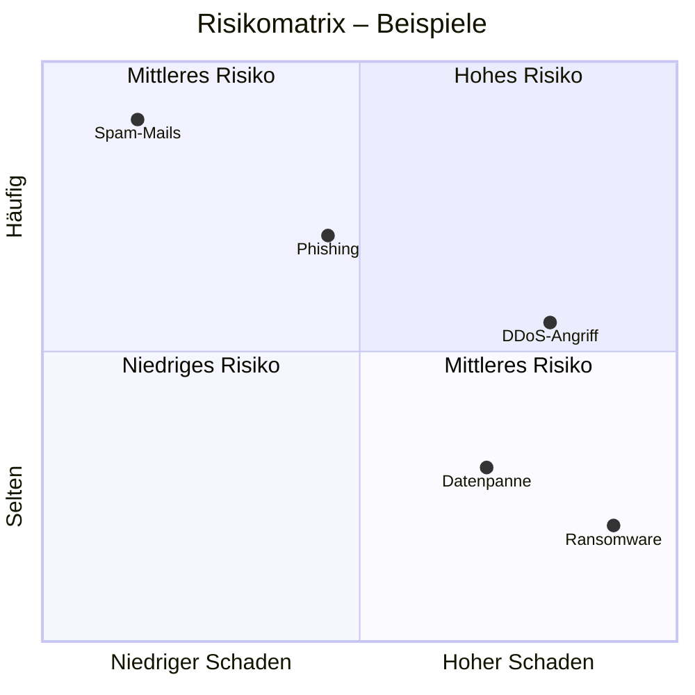
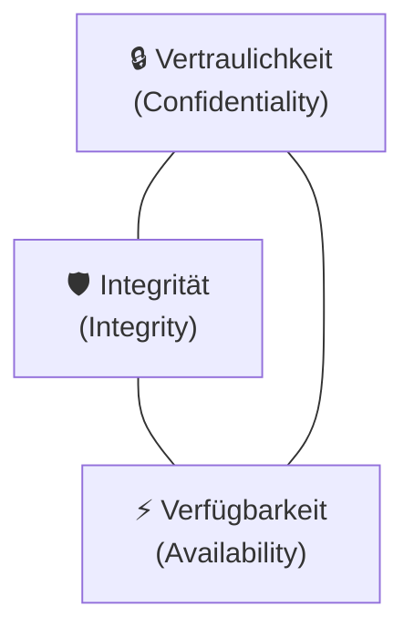

**Informationssicherheit – Grundlagen**
*Hochschule Luzern | 15. September 2025*

---

## Lernziele

Nach dieser Lektion solltest du folgendes können:

- Die Bedeutung von Daten für Informationen erklären
- Die Grundbegriffe **Sicherheit** und **Risiko** definieren und unterscheiden
- Die Begriffe IT-Sicherheit, Datensicherheit, Cyber-Sicherheit, Informationssicherheit und integrale Sicherheit gegeneinander abgrenzen
- Die drei Grundschutzziele (CIA) benennen und erläutern
- Weitere Schutzziele kennen und anhand von Beispielen erklären

---

## 1. Einführung: Das Zeitalter des Zettabyte

Wir leben in einer Zeit der explodierenden Datenmenge. Laut IDC Global DataSphere wird die jährlich erzeugte, erfasste und replizierte Datenmenge bis 2025 auf **175 Zettabyte** angewachsen sein – ein nahezu unvorstellbares Volumen.

### Datengrössen im Überblick

| Einheit | Abkürzung | Grösse |
|---------|-----------|-------|
| Bit | – | 1 oder 0 |
| Byte | B | 8 Bits |
| Kilobyte | KB | 1.000 Bytes |
| Megabyte | MB | 1.000² Bytes |
| Gigabyte | GB | 1.000³ Bytes |
| Terabyte | TB | 1.000⁴ Bytes |
| Petabyte | PB | 1.000⁵ Bytes |
| Exabyte | EB | 1.000⁶ Bytes |
| **Zettabyte** | **ZB** | **1.000⁷ Bytes** |
| Yottabyte | YB | 1.000⁸ Bytes |
| Ronnabyte | RB | 1.000⁹ Bytes |
| Quettabyte | QB | 1.000¹⁰ Bytes |

> **Warum ist das relevant?** Je mehr Daten erzeugt und gespeichert werden, desto grösser wird die Angriffsfläche für Missbrauch, Diebstahl und Manipulation. Informationssicherheit ist deshalb kein nischiges IT-Thema, sondern eine gesellschaftliche Grundfrage.

---

## 2. Daten, Information und Wissen

Um zu verstehen, *was* wir schützen wollen, müssen wir zunächst verstehen, was Daten eigentlich sind – und wie sie zu Information und Wissen werden.

### Die Hierarchie: Zeichen → Daten → Information → Wissen



**Zeichen** sind rohe Bits und Bytes – bedeutungslose Symbole wie `!,E,R,B,N,N,E,S, ,T`.

**Daten** entstehen, wenn Zeichen durch **Syntax** strukturiert werden – also nach einer Regel angeordnet. Aus den oben genannten Zeichen wird: `ES BRENNT!`

**Information** entsteht erst durch **Semantik** – also durch Bedeutung und Kontext. Jetzt wissen wir: *Es ist heiss. Ein Feuer ist ausgebrochen.*

**Wissen** entsteht durch die **Vernetzung** von Informationen. Wir verknüpfen das Feuer mit Gefahren, Fluchtwegen, dem Verhalten in Notsituationen: *Das Leben ist in Gefahr.*

> **Kernaussage (nach Informationssicherheitshandbuch für die Praxis):** „Information ist die Verknüpfung von Daten in Form von Zahlen, Worten und Fakten zu interpretierbaren Zusammenhängen. Durch die Vernetzung von Informationen entsteht Wissen, das zunächst personenbezogen ist."

### Warum müssen Informationen geschützt werden?

Francis Bacon sagte bereits im 16. Jahrhundert: **„Wissen ist Macht."** Heute gilt: Wissen ist zur entscheidenden Produktivkraft moderner Ökonomien geworden – es ist der *Rohstoff des 21. Jahrhunderts* (Ralf Fücks). Wer Informationen kontrolliert, hat Macht. Wer Informationen stiehlt oder manipuliert, kann enormen Schaden anrichten.

---

## 3. Bedrohungen für Daten und Informationen

Bedrohungen lassen sich in vier Kategorien einteilen:

### 3.1 Menschliches Fehlverhalten
Nicht jeder Schaden entsteht durch böse Absicht. Häufige Ursachen:
- **Fahrlässigkeit** – z.B. ungesicherte Dokumente in der Öffentlichkeit (Beispiel: Bob Quick, ex Scotland Yard, der geheime Unterlagen unverdeckt vor Kameras trug)
- **Gleichgültigkeit** – Sicherheitsregeln werden als lästig empfunden und ignoriert
- **Unwissenheit** – Mitarbeitende kennen Risiken nicht
- **Leichtgläubigkeit** – Opfer von Social Engineering (Phishing etc.)

### 3.2 Organisatorische Schwachstellen
Auch gut ausgebildete Menschen können nicht sicher handeln, wenn die Organisation es nicht ermöglicht:
- Fehlendes Sicherheitsverständnis des Managements
- Unklare Verantwortlichkeiten
- Fehlende oder ungenaue Prozesse und Abläufe
- Mangelhafte Richtlinien und fehlende Kontrollen
- Unzureichende Awareness-Schulungen

### 3.3 Technisches Versagen
Technik ist nicht unfehlbar:
- Ungenügende Wartung von Systemen
- Nicht funktionierende Überwachungssysteme (z.B. IDS)
- Falsch dimensionierte oder fehlerhaft konfigurierte Systeme
- Fehler in Applikationen, Betriebssystemen, Firmware oder Treibern

### 3.4 Höhere Gewalt
Manche Bedrohungen sind nicht vom Menschen verursacht:
- Unwetter, Erdbeben, Überschwemmungen, Vulkanausbrüche
- Feuer, Wasserschäden
- Ausschreitungen, Geiselnahme, Krieg

### 3.5 Willentliche, vorsätzliche Angriffe (Internet)
- Unerlaubter Zugriff auf Systeme (Hacking)
- Abhören und Modifizieren von Daten (Man-in-the-Middle)
- DDoS-Angriffe (Distributed Denial of Service)
- Viren, Würmer, Trojanische Pferde
- Drive-by-Infections (allein durch Webseitenbesuch)

### Top-7 Bedrohungen laut ENISA (2024)

1. **Ransomware** – Erpresser-Software verschlüsselt Daten und fordert Lösegeld
2. **Malware** – Oberbegriff für schädliche Software
3. **Social Engineering** – Manipulation von Menschen (z.B. Phishing)
4. **Data Breach** – Datendiebstahl / unbefugter Zugriff auf Daten
5. **Denial of Service** – Angriff auf die Verfügbarkeit
6. **Information Manipulation** – gezielte Desinformation
7. **Supply-Chain Attacks** – Angriff über Lieferketten (z.B. Software-Updates)

### Motivation der Angreifer

Die Motivationen sind vielfältig, aber laut ENISA-Daten dominiert **Financial Gain** (ca. 26%) deutlich, gefolgt von **Ideology** (ca. 41% – insbesondere durch staatliche Akteure). Weitere Motivationen sind Spionage und Sabotage.

---

## 4. Die drei Säulen der Informationssicherheit

Informationen schützen bedeutet nicht nur, Firewalls zu kaufen. Drei Bereiche müssen gleichzeitig adressiert werden:

| Säule | Was bedeutet das? |
|-------|-------------------|
| **Technik** | Sicherheitstechnologien kaufen und konfigurieren (Firewalls, Verschlüsselung, IDS/IPS...) |
| **Prozesse** | Sicherheitsprozesse definieren und deren Einhaltung kontrollieren |
| **Mitarbeitende** | Menschen sensibilisieren und ausbilden |

> **Warum alle drei?** Selbst die beste Technik schützt nicht, wenn Mitarbeitende auf Phishing hereinfallen. Und selbst gut ausgebildete Menschen handeln unsicher, wenn es keine klaren Prozesse gibt. Alle drei Säulen müssen ineinandergreifen.

---

## 5. Grundbegriff: Sicherheit

### Definition

> **Duden:** „Zustand des Sicherseins, Geschütztseins vor Gefahr oder Schaden; höchstmögliches Freisein von Gefährdungen."

> **Wikipedia:** „Sicherheit bezeichnet einen Zustand, der frei von *unvertretbaren* Risiken der Beeinträchtigung ist oder als gefahrenfrei *angesehen wird*."

Wichtig: **Absolute Sicherheit ist nicht erreichbar und nicht bezahlbar.** Es geht immer darum, Risiken auf ein *akzeptables Niveau* zu reduzieren – Sicherheit ist deshalb immer auch eine **Kosten-Nutzen-Betrachtung**.

### Safety vs. Security

Im Deutschen gibt es nur das Wort „Sicherheit" – im Englischen wird unterschieden:

| | **Safety** | **Security** |
|---|---|---|
| **Schutz vor...** | zufälligen, ungewollten Ereignissen | willentlich ausgeführten Angriffen |
| **Beispiele** | Unglücke, Naturereignisse | gezielte Hacker-Angriffe |
| **Umfeld** | passt sich nicht an | Angreifer passt sich Schutzmassnahmen an |
| **Wissenschaft** | Naturwissenschaften, definierte Experimente | Soziale Wissenschaften, Chaos, Komplexität |
| **Standard** | ISO 61508 (Funktionale Sicherheit) | ISO 27001 (Informationssicherheit) |

> **Warum ist diese Unterscheidung wichtig?** Bei Safety-Problemen kannst du ein System einmal absichern und es bleibt sicher – die Schwerkraft ändert ihre Regeln nicht. Bei Security-Problemen passt sich der Angreifer aktiv an neue Schutzmassnahmen an. Sicherheit ist ein kontinuierlicher Prozess, kein einmaliger Zustand.

---

## 6. Arten von Sicherheit: Abgrenzung der Begriffe

### Informations-Sicherheit vs. IT-Sicherheit vs. Cyber-Sicherheit

Diese Begriffe werden im Alltag oft verwechselt, haben aber unterschiedliche Reichweiten:

```
┌─────────────────────────────────────────────────────────┐
│               Informationssicherheit                    │
│  (Schutz ALLER Informationen, unabhängig vom Medium)   │
│                                                         │
│    ┌──────────────────────────────────────────────┐    │
│    │           IT-Sicherheit                      │    │
│    │  (Schutz von IKT-Systemen)                   │    │
│    │                                              │    │
│    └──────────────────────────────────────────────┘    │
│                                ┌─────────────────────┐  │
│                                │  Cyber-Sicherheit   │  │
│                                │  Internet & davon   │  │
│                                │  erreichbare Systeme│  │
│                                └─────────────────────┘  │
└─────────────────────────────────────────────────────────┘
```

**Informationssicherheit** ist der weiteste Begriff. Sie schützt Informationen unabhängig vom Medium – ob auf elektronischen Datenträgern, auf Papier oder im Kopf von Mitarbeitenden. Geregelt durch ISO/IEC 27001.

**IT-Sicherheit** befasst sich mit dem Schutz von IKT-Systemen (Informations- und Kommunikationssysteme) gegen eine Vielzahl von Gefahren und Angriffen.

**Cyber-Sicherheit** schützt Internet-basierte Systeme und alles, was über das Internet erreichbar ist – also auch physische Systeme wie Smart Grids oder Fahrzeuge, die nicht direkt Informationen speichern.

### Informationssicherheit vs. Datenschutz

Beide Begriffe werden häufig vermischt, verfolgen aber unterschiedliche Zwecke:

| | **Informationssicherheit** | **Datenschutz** |
|---|---|---|
| **Zweck** | Schutz *aller* Daten und Informationen | Schutz *personenbezogener* Daten |
| **Rechtsgrundlage** | ISO/IEC 27001, branchenspezifische Standards | Schweizer DSG, DSGVO |
| **Fokus** | Technische & organisatorische Massnahmen | Recht auf informationelle Selbstbestimmung |

> **Merksatz:** Datenschutz ist ein *Teilgebiet*, das in der Informationssicherheit mitgedacht werden muss, aber er ist breiter – er geht über die technische Absicherung hinaus und umfasst auch Rechte, Einwilligungen und Transparenz.

### Integrale Sicherheit

Integrale Sicherheit ist die **umfassende Betrachtung aller Sicherheitsaspekte einer Organisation** – nicht nur der Informationssicherheit. Dazu gehören:

- Logische Sicherheit, Physische Sicherheit
- Informationsschutz, Datenschutz, Personenschutz
- Arbeitssicherheit, Qualitätssicherung
- Umweltschutz, Versicherungsschutz, Notfallplanung

---

## 7. Grundbegriff: Risiko

### Definition

> **Duden:** „Möglicher negativer Ausgang bei einer Unternehmung, mit dem Nachteile, Verlust, Schäden verbunden sind."

Im engeren Sinne ist Risiko = **Gefahr**: ein zukünftiges Ereignis mit negativem Einfluss auf eine Organisation, bewertet nach Eintrittswahrscheinlichkeit und Auswirkung.

### Die Risikoformel

**Risiko = Wahrscheinlichkeit × Schadensausmass**

Da exakte Wahrscheinlichkeiten in der Praxis kaum berechenbar sind, wird in der Informationssicherheit oft mit **Eintretenshäufigkeit** (geschätzte Häufigkeit pro Zeitraum) gearbeitet:

**Risiko = Eintretenshäufigkeit × Schadensausmass**

### Risikomatrix

Risiken werden typischerweise in einer 2×2-Matrix visualisiert:

|  | **Niedriger Schaden** | **Hoher Schaden** |
|---|---|---|
| **Häufig** | Mittleres Risiko (blau) | Hohes Risiko (rot) |
| **Selten** | Niedriges Risiko (grün) | Mittleres Risiko (orange) |



> **Intuition:** Ein Ereignis mit hoher Wahrscheinlichkeit und kleinem Schaden (z.B. Spam-Mails) ist anders zu bewerten als ein seltenes Ereignis mit katastrophalen Folgen (z.B. vollständiger Datenverlust durch Ransomware). Beide können das gleiche rechnerische Risiko haben – aber die Strategie zum Umgang damit ist völlig unterschiedlich.

### Sicherheit vs. Risiko

Sicherheit und Risiko sind **zwei Seiten derselben Medaille**: Mehr Sicherheit bedeutet weniger Risiko, und umgekehrt. Da absolute Sicherheit nie erreichbar ist, geht es immer darum, ein **akzeptables Restrisiko** zu definieren.

---

## 8. Grundschutzziele der Informationssicherheit (CIA-Triad)

Das Fundament jeder Sicherheitsbetrachtung sind die drei **Grundschutzziele**, abgekürzt **C-I-A**:



### C – Confidentiality (Vertraulichkeit)

> Vertraulichkeit ist gegeben, wenn sichergestellt werden kann, dass Informationen **nicht durch unautorisierte Personen, Instanzen oder Prozesse eingesehen werden** können.

**Beispiele für Verletzungen:** gestohlene Kundendaten, abgehörte Kommunikation, ungeschützter Zugriff auf interne Dokumente.

**Typische Massnahmen:** Verschlüsselung, Zugriffskontrollen, Need-to-know-Prinzip.

**Wann wird es entdeckt?** Oft *spät oder nie* – wer Daten liest, hinterlässt nicht zwingend Spuren. Dies macht Vertraulichkeitsverletzungen besonders gefährlich.

### I – Integrity (Integrität)

> Integrität ist gewährleistet, wenn Daten oder Systeme **nicht unautorisiert oder zufällig manipuliert oder verändert** werden können.

**Beispiele für Verletzungen:** manipulierte Finanzdaten, gefälschte E-Mails, veränderte Softwareupdate-Pakete (Supply-Chain-Angriff).

**Typische Massnahmen:** Prüfsummen, Hash-Werte, digitale Signaturen.

**Wann wird es entdeckt?** In der Regel *bald* – wenn jemand mit veränderten Daten arbeitet, fallen Inkonsistenzen auf.

#### Mechanismen zur Sicherstellung der Integrität

| Mechanismus | Fehler-Detektion | Integrität | Authentizität | Nicht-Abstreitbarkeit |
|---|---|---|---|---|
| Einfache Prüfsumme | ✓ | – | – | – |
| Hash-Wert | ✓ | ✓ | – | – |
| Message Authentication Code | ✓ | ✓ | ✓ | – |
| Digitale Signatur | ✓ | ✓ | ✓ | ✓ |

**Prüfsummen** erkennen einfache Übertragungsfehler (z.B. ISBN-13-Prüfziffer), schützen aber nicht vor gezielter Manipulation.

**Hash-Werte** (z.B. SHA-256) sind kryptografisch stark – eine winzige Änderung der Eingabe ändert den Hash komplett. Sie erkennen auch absichtliche Manipulation, liefern aber keinen Beweis *wer* den Inhalt erstellt hat.

**Message Authentication Codes (MAC)** binden den Hash an einen geheimen Schlüssel – damit kann die Authentizität des Absenders geprüft werden.

**Digitale Signaturen** (asymmetrische Kryptografie) ermöglichen zusätzlich **Nicht-Abstreitbarkeit**: Der Absender kann nicht leugnen, eine Nachricht gesendet zu haben.

### A – Availability (Verfügbarkeit)

> Verfügbarkeit ist gewährleistet, wenn in der vom Benutzer gewünschten Zeit auf **Dienste oder Informationen zugegriffen werden** kann.

**Beispiele für Verletzungen:** DDoS-Angriff auf eine Webseite, Ransomware verschlüsselt Daten, Ausfall eines Rechenzentrums.

**Typische Massnahmen:** Redundanz, Backups, DDoS-Schutz, Business Continuity Planning.

**Wann wird es entdeckt?** *Unmittelbar* – wenn ein System nicht mehr verfügbar ist, fällt das sofort auf.

---

## 9. Entdeckungszeitraum der Schutzziele

Ein wichtiges Konzept: Nicht alle Sicherheitsverletzungen werden gleich schnell bemerkt:

```
unmittelbar ←────────────────────────────────────→ spät oder nie

Verfügbarkeit   Verbindlichkeit   Authentizität   Vertraulichkeit
                Integrität
```

> **Implikation:** Eine Verletzung der Vertraulichkeit kann jahrelang unentdeckt bleiben. Unternehmen merken oft erst Monate nach einem Einbruch, dass Daten gestohlen wurden. Dies erfordert proaktive Überwachung (z.B. SIEM-Systeme, Threat Intelligence).

---

## 10. „Harvest now, decrypt later" – Y2Q

Ein Sonderfall, der die Zeitdimension in der Sicherheit illustriert: Staatliche Akteure sammeln heute **bereits verschlüsselte Daten**, die sie erst dann entschlüsseln wollen, wenn **Quantencomputer** leistungsfähig genug sind (Year-to-Quantum = Y2Q).

Das bedeutet: Daten, die heute als sicher verschlüsselt gelten, könnten in 10–20 Jahren lesbar werden. Dies ist ein Argument für **Post-Quantum-Kryptografie**, an der NIST bereits standardisiert.

---

## 11. Erweiterte Schutzziele

Über die CIA-Triade hinaus gibt es weitere wichtige Schutzziele:

### Privatsphäre (Privacy)

Privatsphäre bezeichnet den nicht-öffentlichen Bereich, in dem ein Mensch sein Recht auf freie Entfaltung seiner Persönlichkeit wahrnimmt. Im digitalen Kontext bedeutet dies: **Einwilligungsmanagement, Transparenz, das Recht auf Auskunft und Löschung**.

Der Unterschied zur Informationssicherheit:
- Informationssicherheit schützt *alle* Daten vor Angreifern
- Datenschutz/Privacy schützt *personenbezogene* Daten auch vor der eigenen Organisation (z.B. unerlaubte Weiterverwendung)

### Anonymität (Anonymity)

Definition: **Geheimhaltung der Identität** mindestens eines Teilnehmers an einer aktiven Handlung.

Anonymität kann auf drei Wegen erreicht werden:
1. **Nicht bekannt sein** – andere wissen die Identität nicht (z.B. Tor-Browser)
2. **Nicht genannt sein** – die Identität tritt nicht in Erscheinung
3. **Namenlosigkeit** – Handlung ohne erkennbaren Namen

**Beispiele:** Bargeld-Einkauf, Tor-Netzwerk, anonyme Hinweisgebersysteme.

### Anonymisierung vs. Pseudonymisierung

| | **Pseudonymisierung** | **Anonymisierung** |
|---|---|---|
| **Definition** | Ersatz der Identität durch ein Pseudonym (Zuordnungstabelle existiert) | Vollständige Entfernung des Personenbezugs |
| **Beispiel** | „Reto Meier" → „Patient 13267" | „Ein Patient hat Blutdruck 132/85" |
| **Rückführbar?** | Ja (mit Zusatzinformation) | Nein (oder nur mit unverhältnismässigem Aufwand) |
| **Schutzgrad** | Mittel | Hoch |

> **Merke:** Anonymität > Pseudonymität. Pseudonymisierte Daten gelten nach DSGVO immer noch als personenbezogen.

### Zutrittskontrolle, Zugangskontrolle, Zugriffskontrolle

Diese drei Begriffe beschreiben verschiedene Schutzschichten:

```
┌───────────────────────────────────────────┐
│            Zutrittskontrolle              │
│   (physischer Raum, z.B. Serverraum)      │
│   ┌───────────────────────────────────┐   │
│   │        Zugangskontrolle           │   │
│   │   (logisches System, z.B. OS)     │   │
│   │   ┌───────────────────────────┐   │   │
│   │   │    Zugriffskontrolle      │   │   │
│   │   │  (Daten: Read/Write/      │   │   │
│   │   │   Execute/Delete)         │   │   │
│   │   └───────────────────────────┘   │   │
│   └───────────────────────────────────┘   │
└───────────────────────────────────────────┘
```

Die **Zugriffskontrolle** umfasst:
- **Authentisierung** – Identitätsnachweis (Wer bist du?)
- **Autorisierung** – Berechtigungsprüfung (Was darfst du tun?)
- **Accountability** – Verantwortlichkeit/Protokollierung (Was hast du getan?)

> **Hinweis Terminologie:** Es gibt einen feinen Unterschied zwischen *Authentisierung* (aktiver Vorgang: der Nutzer beweist seine Identität) und *Authentifizierung* (passiver Vorgang: das System überprüft die Identität). In der Praxis werden die Begriffe oft synonym verwendet.

### Weitere Schutzziele im Überblick

| Schutzziel | Englisch | Kurzbeschreibung |
|---|---|---|
| **Authentizität** | Authenticity | Echtheit, Überprüfbarkeit, Vertrauenswürdigkeit |
| **Autorisierung** | Authorization | Berechtigungszuweisung nach erfolgreicher Authentisierung |
| **Verbindlichkeit** | Non-repudiation | Sender kann das Senden nicht abstreiten |
| **Vollständigkeit** | Completeness | Teilaspekt der Integrität |
| **Unbeobachtbarkeit** | Non-observability | Verdeckung eines Kommunikationsvorgangs |
| **Zuverlässigkeit** | Reliability | System funktioniert unter definierten Bedingungen erwartungsgemäss |
| **Zugreifbarkeit** | Accessibility | Fähigkeit zum Zugriff (z.B. Barrierefreiheit) |
| **Kopierschutz** | Copy protection | Nur autorisierte Nutzer können Inhalte kopieren (z.B. Wasserzeichen) |
| **Wirksamkeit** | Effectiveness | Fähigkeit, ein gewünschtes Ergebnis zu erzielen |

---

## 12. Konflikte zwischen Schutzzielen

Sicherheitsanforderungen können sich **widersprechen** oder sogar **ausschliessen**:

### Authentifikation vs. Anonymität

Wenn du mit einer Kreditkarte bezahlst, bist du authentifiziert – aber damit nicht mehr anonym. **Anonymität und Identitätsnachweis schliessen sich grundsätzlich aus.**

### Anonymität vs. Verbindlichkeit

Verbindliche (rechtlich durchsetzbare) Handlungen erfordern zwingend einen Identitätsnachweis. Ein anonymer Online-Kauf ist deshalb rechtlich nicht vollständig durchsetzbar.

### Sicherheitsanforderungen in offenen Netzen

Für die sichere Internet-Nutzung braucht es gleichzeitig:
- Unveränderliche Identität des Senders (Authentizität)
- Unverfälschtheit der Daten (Integrität)
- Vertraulichkeit der Daten
- Verbindlichkeit des Austauschs (Non-repudiation)

> **Praxisbeispiel Kryptowährungen:** Bitcoin kombiniert Anonymität (keine Klarnamen) mit Verbindlichkeit (Transaktionen sind unveränderlich auf der Blockchain). Dies ist möglich durch kryptografische Identitäten (Adressen), die keine Person direkt identifizieren – aber Transaktionen eindeutig zuordnen. Ein elegantes, aber nicht vollständiges Kompromiss zwischen den beiden Zielen.

---

## 13. Glossar wichtiger Begriffe

| Begriff | Definition |
|---|---|
| **Malware** | Oberbegriff für schädliche Software (Viren, Würmer, Trojaner, Ransomware, Spyware...) |
| **Ransomware** | Erpresser-Malware: verschlüsselt Daten und fordert Lösegeld |
| **Phishing** | Täuschung von Nutzern zur Preisgabe vertraulicher Daten (Password + Fishing) |
| **DDoS** | Distributed Denial of Service – koordinierter Angriff auf die Verfügbarkeit |
| **Drive-by-Infektion** | Infektion durch blossen Besuch einer kompromittierten Webseite |
| **Trojaner** | Getarntes Schadprogramm, das sich als nützliche Software ausgibt |
| **Wurm** | Selbst-replizierendes Programm, das Netzwerke ausnutzt (kein Wirt nötig) |
| **Botnetz** | Netzwerk infizierter Computer, ferngesteuert für Angriffe |
| **Patch** | Software-Update zur Behebung von Sicherheitslücken (Bug Fix) |
| **Firewall** | Netzwerkkomponente, die Zugriffe auf/vom geschützten Netz kontrolliert |
| **Backup** | Datensicherungskopie auf externem Medium, regelmässig durchgeführt |
| **Cookies** | Textdateien im Browser, die Nutzungsverhalten speichern |
| **Spyware** | Spionageprogramme, die Nutzerverhalten ohne Wissen übermitteln |
| **Man-in-the-Middle** | Angreifer schaltet sich unbemerkt zwischen zwei Kommunikationspartner |
| **Jailbreak** | Nicht-autorisiertes Entfernen von Nutzungsbeschränkungen (z.B. bei Smartphones) |

---

## Zusammenfassung

```
Daten → Informationen → Wissen
         ↓ muss geschützt werden durch:

┌──────────────────────────────────────────────────┐
│              3 Säulen                            │
│   Technik | Prozesse | Mitarbeitende            │
└──────────────────────────────────────────────────┘

              ↓ gegen Bedrohungen aus:

  - Menschlichem Fehlverhalten
  - Organisatorischen Schwachstellen  
  - Technischem Versagen
  - Höherer Gewalt
  - Vorsätzlichen Angriffen

              ↓ anhand der Schutzziele:

  CIA-Triad: Confidentiality · Integrity · Availability
  Erweitert: Authentizität · Non-repudiation · Privacy · ...

              ↓ unter Berücksichtigung von:

  Risiko = Eintretenshäufigkeit × Schadensausmass
  → Absolute Sicherheit ist weder erreichbar noch bezahlbar
  → Ziel: akzeptables Restrisiko
```

---

*Nächste Woche: **Awareness** – bitte den Foliensatz vollständig lesen (gehört vollständig zum Prüfungsstoff!)*
