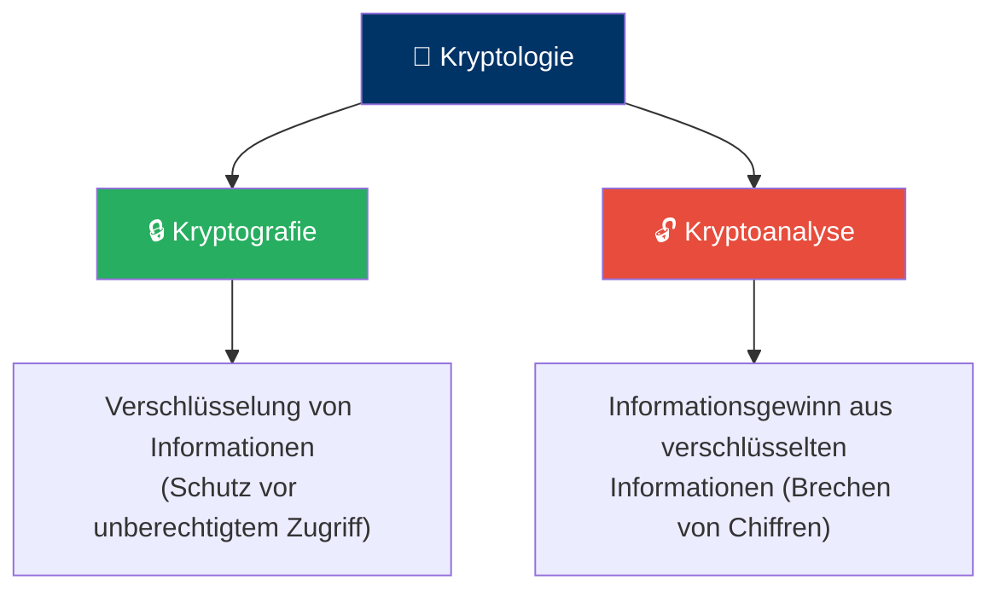
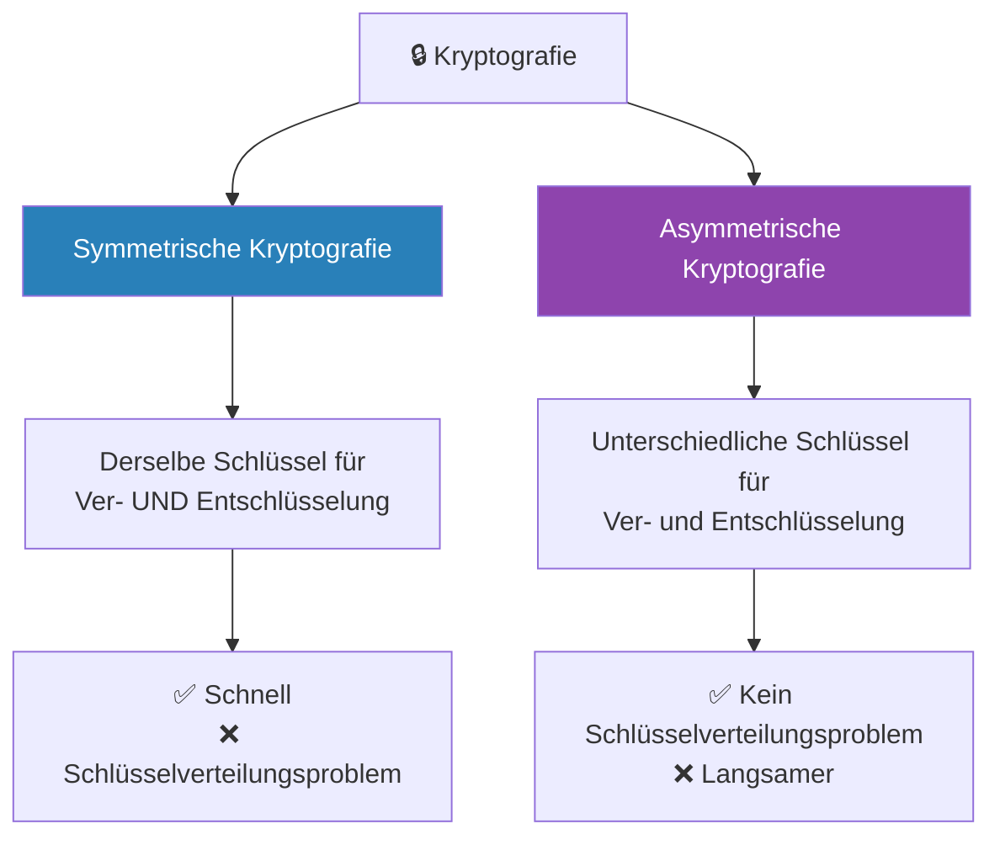
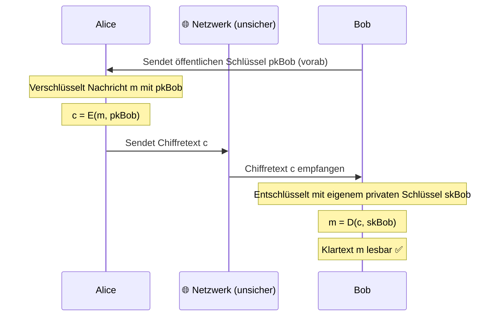
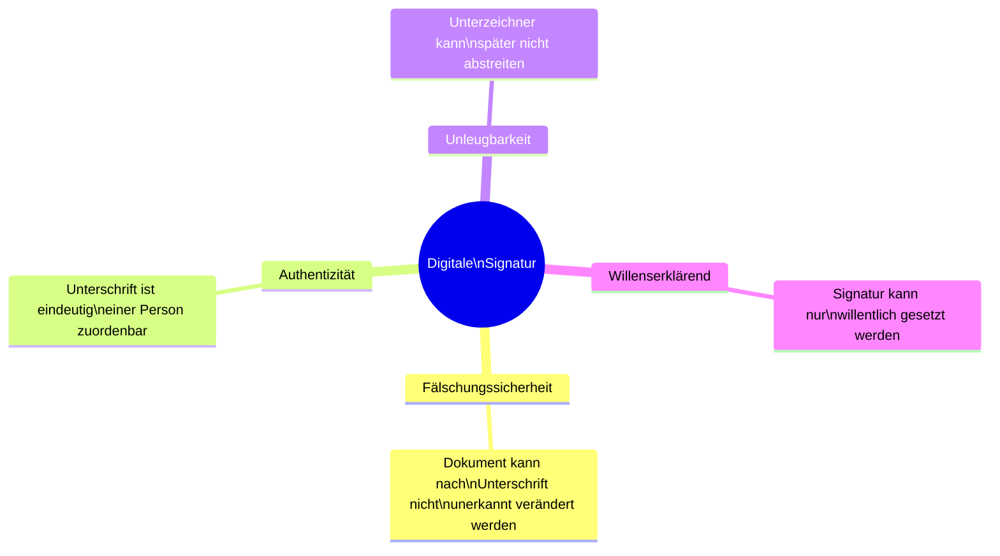
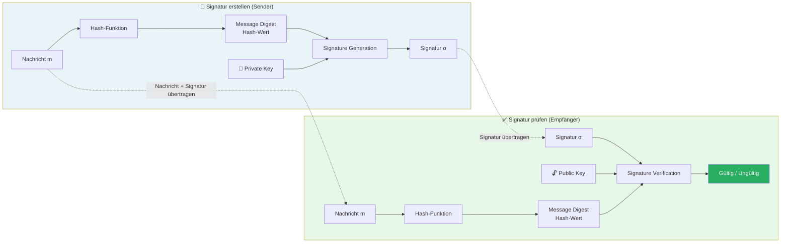
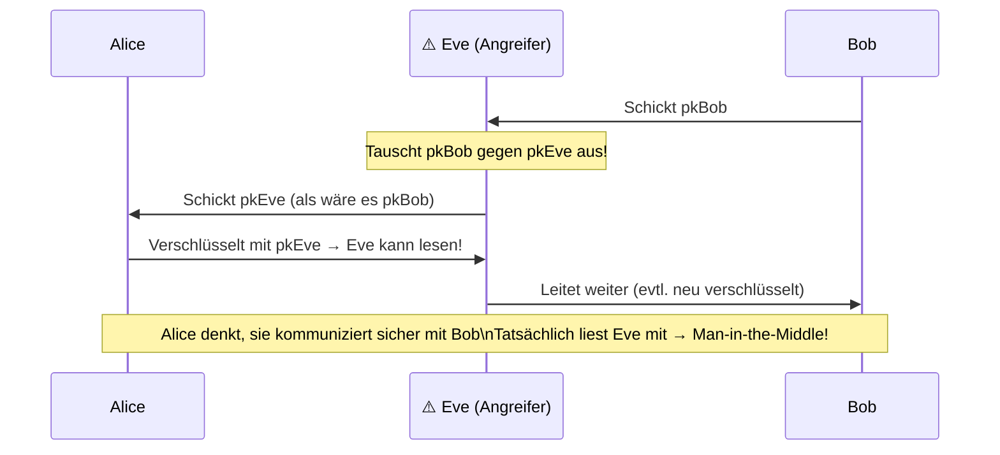
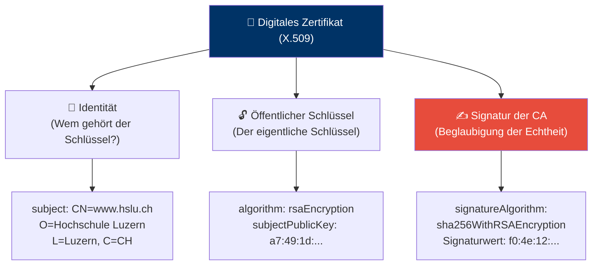
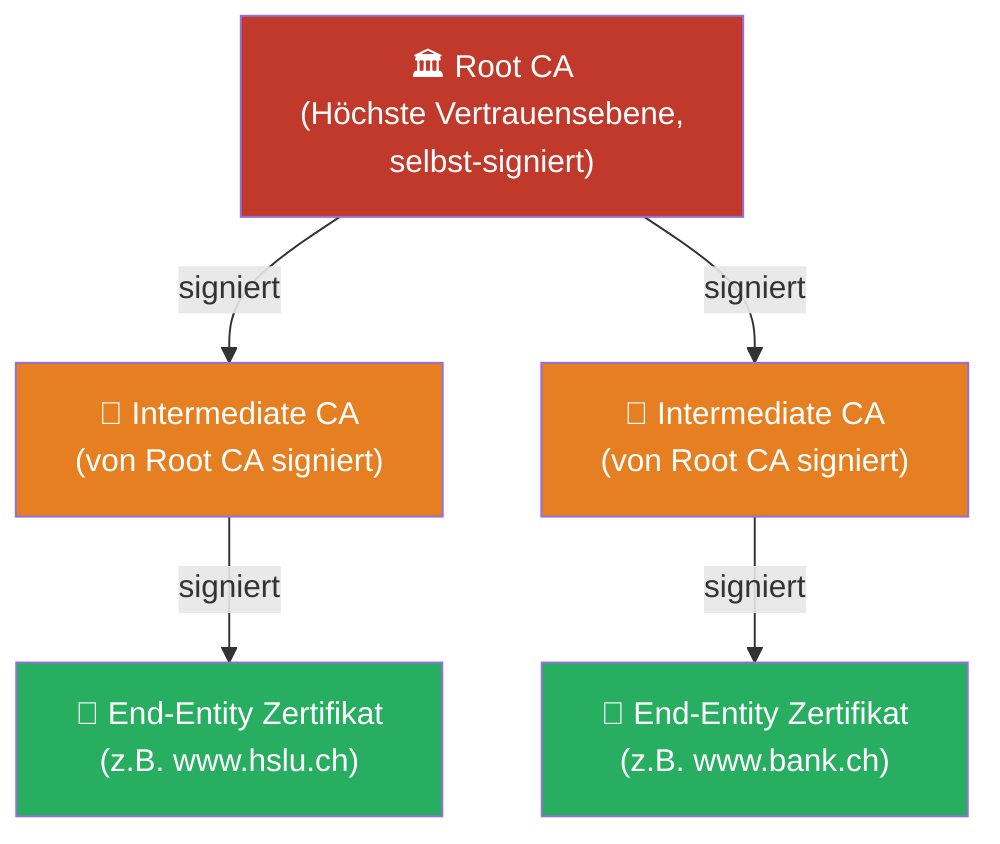
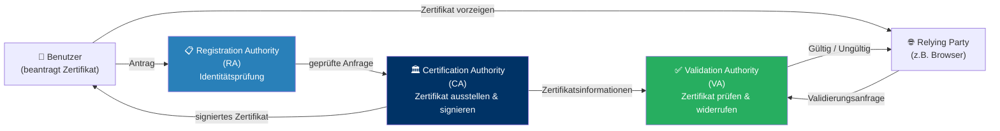
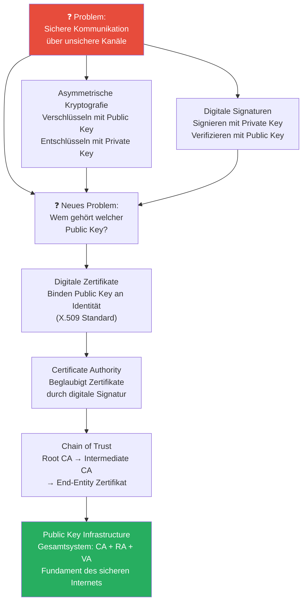

> **Vorlesung: Zusätzliche Infos – Intercepten | ISF, HSLU Informatik**  
> Autor: Joshua Drexel

> **Disclaimer:** Diese Folien sind nicht direkt prüfungsrelevant – gewisse Inhalte sind jedoch Teil anderer Vorlesungen, die prüfungsrelevant sind.

---

## Überblick: Was ist Kryptologie?

Kryptologie ist die Wissenschaft, die sich mit der **sicheren Kommunikation** und dem **Schutz von Informationen** befasst. Sie teilt sich in zwei Bereiche:

**Kryptografie** ist dabei die «offensive» Seite – sie entwickelt Methoden, um Informationen zu schützen. **Kryptoanalyse** ist die «analytische» Seite – sie versucht, diese Schutzmechanismen zu überwinden. Beide Disziplinen bedingen einander: Ohne Kryptoanalyse wüsste man nicht, ob eine Verschlüsselung wirklich sicher ist.

---

## Symmetrische vs. Asymmetrische Kryptografie

Innerhalb der Kryptografie gibt es zwei grundlegend verschiedene Ansätze:

**Warum zwei verschiedene Ansätze?**  
Die symmetrische Kryptografie hat ein fundamentales Problem: Wenn Alice und Bob denselben Schlüssel verwenden, müssen sie diesen zuerst sicher austauschen – aber wie, wenn noch kein sicherer Kanal existiert? Dieses «Henne-Ei-Problem» löst die asymmetrische Kryptografie elegantly.

### Analogie: Das Vorhängeschloss

Stell dir vor, Bob möchte Alice eine sichere Box schicken:

- **Symmetrisch:** Beide haben denselben Schlüssel – aber wie kommt Alice an den Schlüssel, ohne dass ihn jemand abfängt?
- **Asymmetrisch:** Bob schickt Alice ein **offenes Schloss** (= öffentlicher Schlüssel). Alice legt ihre Nachricht in die Box und schliesst sie mit Bobs Schloss. Nur Bob kann sie mit seinem **privaten Schlüssel** öffnen.

---

## Asymmetrische Kryptografie (Public-Key-Kryptografie)

### Das Schlüsselpaar

Bei der asymmetrischen Kryptografie hat jede Partei ein **Schlüsselpaar** bestehend aus:

| Schlüssel | Bezeichnung | Verwendung | Verteilung |
|---|---|---|---|
| **Privater Schlüssel** | secret key (sk) / private key | Entschlüsselung | Geheim halten! |
| **Öffentlicher Schlüssel** | public key (pk) | Verschlüsselung | Öffentlich zugänglich |

**Grundregel:**
- Zum **Verschlüsseln** verwendet man den **öffentlichen Schlüssel** des Empfängers
- Zum **Entschlüsseln** verwendet man den **eigenen privaten Schlüssel**

### Ablauf eines verschlüsselten Nachrichtenaustauschs

**Was passiert, wenn jemand den Chiffretext c abfängt?**  
Ohne Bobs privaten Schlüssel ist der Chiffretext wertlos – selbst der öffentliche Schlüssel, der zur Verschlüsselung verwendet wurde, kann die Nachricht nicht entschlüsseln. Das ist der mathematische Kern der asymmetrischen Kryptografie.

**Wichtiger Schritt:** Bob muss seinen öffentlichen Schlüssel **vorab** an Alice senden. Aber hier entsteht ein neues Problem: Woher weiss Alice, dass der empfangene öffentliche Schlüssel wirklich von Bob stammt und nicht von einem Angreifer? → Lösung: **Digitale Zertifikate** (siehe unten).

---

## Digitale Signaturen

### Was ist eine digitale Signatur?

Eine digitale Signatur ist das elektronische Äquivalent einer handschriftlichen Unterschrift – aber mit deutlich stärkeren Sicherheitseigenschaften.

### Die vier Eigenschaften einer (guten) Signatur

### Wie funktioniert das technisch? Das Hash-then-Sign-Verfahren

Das direkte Signieren grosser Dokumente mit asymmetrischen Algorithmen wäre sehr rechenaufwändig. Deshalb verwendet man das **Hash-then-Sign-Verfahren**:

**Schritt für Schritt:**

1. **Hashing (Sender):** Die Nachricht wird durch eine Hash-Funktion gejagt → ergibt einen kompakten «Fingerabdruck» der Nachricht (Message Digest)
2. **Signieren (Sender):** Der Message Digest wird mit dem **privaten Schlüssel** des Senders signiert → ergibt die Signatur σ
3. **Übertragung:** Nachricht + Signatur werden gemeinsam übertragen
4. **Hashing (Empfänger):** Der Empfänger berechnet denselben Hash-Wert aus der empfangenen Nachricht
5. **Verifikation (Empfänger):** Die Signatur wird mit dem **öffentlichen Schlüssel** des Senders verifiziert und mit dem berechneten Hash verglichen
6. **Ergebnis:** Stimmen die Hashes überein → Signatur gültig. Abweichung → Nachricht wurde verändert oder Signatur ist gefälscht.

**Warum erst hashen, dann signieren?**  
Hash-Funktionen erzeugen immer einen gleich langen Output (z.B. 256 Bit bei SHA-256) – unabhängig davon, ob die Eingabe 1 Byte oder 1 GB gross ist. Asymmetrische Signaturalgorithmen können nur auf kleinen Datenmengen effizient arbeiten. Der Hash ist also ein cleverer «Stellvertreter» der gesamten Nachricht.

### Algorithmen für Digitale Signaturen

Digitale Signaturen verwenden ähnliche oder identische Algorithmen wie die asymmetrische Verschlüsselung (z.B. **RSA**). Der Unterschied: Bei Signaturen werden die Operationen «umgekehrt»:

| Operation | Verschlüsselung | Signatur |
|---|---|---|
| Erstellen | Mit **öffentlichem** Schlüssel verschlüsseln | Mit **privatem** Schlüssel signieren |
| Prüfen/Entschlüsseln | Mit **privatem** Schlüssel entschlüsseln | Mit **öffentlichem** Schlüssel verifizieren |

> ⚠️ **Wichtig:** Es sollte **nie dasselbe Schlüsselpaar** für die Verschlüsselung und für das Signieren verwendet werden! Getrennte Schlüsselpaare für getrennte Zwecke sind Best Practice.

---

## Digitale Zertifikate und PKI

### Das Kernproblem: Wie vertraut man einem öffentlichen Schlüssel?

Die asymmetrische Kryptografie löst das Schlüsselverteilungsproblem – schafft aber ein neues: Woher weiss Alice, dass ein empfangener öffentlicher Schlüssel **wirklich** von Bob stammt und nicht von einem Angreifer (Man-in-the-Middle)?

**Lösung:** Digitale Zertifikate binden einen öffentlichen Schlüssel an eine verifizierte Identität – beglaubigt von einer vertrauenswürdigen dritten Partei.

---

### Digitales Zertifikat

Ein digitales Zertifikat beantwortet die Frage: **«Zu wem gehört dieser öffentliche Schlüssel?»**

Es enthält drei Kernelemente:

**Aufbau eines X.509-Zertifikats** (weitverbreiteter Standard):

| Feld | Inhalt | Bedeutung |
|---|---|---|
| `version` | 3 | X.509 Version 3 |
| `serialNumber` | 32:30:32:... | Eindeutige Seriennummer |
| `signature` | sha256WithRSAEncryption | Verwendeter Signaturalgorithmus |
| `issuer` | CN=ISF-CA, O=HSLU | Wer hat das Zertifikat ausgestellt? |
| `validity` | notBefore / notAfter | Gültigkeitszeitraum |
| `subject` | CN=www.hslu.ch | **Zu wem gehört der Schlüssel?** |
| `subjectPublicKeyInfo` | Algorithmus + Schlüsselwert | **Der öffentliche Schlüssel selbst** |
| `signatureAlgorithm` + Wert | sha256WithRSAEncryption + Bytes | **Digitale Signatur der CA** |

**Die entscheidende Frage:** Wer signiert das Zertifikat, und warum kann man dieser Signatur vertrauen?

---

### Certificate Authority (CA) und Chain of Trust

Zertifikate werden von einer **Certificate Authority (CA)** ausgestellt und signiert – einer vertrauenswürdigen Organisation, die die Identität von Antragstellern prüft.

**Damit Alice und Bob gegenseitig Zertifikate prüfen können, müssen sie denselben CAs vertrauen – dem sogenannten «Trust Anchor».**

#### Die Hierarchie: Chain of Trust

**Wie funktioniert die Verifikation?**  
Um dem Zertifikat von `www.hslu.ch` zu vertrauen, prüft der Browser:
1. Ist das End-Entity-Zertifikat von einer bekannten Intermediate CA signiert? → Ja ✅
2. Ist die Intermediate CA von einer bekannten Root CA signiert? → Ja ✅
3. Ist die Root CA im Betriebssystem/Browser als vertrauenswürdig hinterlegt? → Ja ✅
4. **Ergebnis:** Dem Zertifikat wird vertraut → 🔒 grünes Schloss im Browser

**Root CAs** sind die «Urvertrauen»-Anker des Systems. Ihr Zertifikat ist **selbst-signiert** – das Vertrauen in sie kommt nicht aus einem weiteren Zertifikat, sondern ist direkt im Betriebssystem oder Browser vorinstalliert (sogenannter «Trust Store»).

---

### Public Key Infrastructure (PKI)

PKI ist das **Gesamtsystem**, das digitale Zertifikate ausstellen, verteilen, verwalten und prüfen kann. Es besteht aus drei Hauptkomponenten:

**Die drei Rollen im Detail:**

| Komponente | Rolle | Aufgabe |
|---|---|---|
| **CA** (Certification Authority) | Zertifizierungsstelle | Stellt Zertifikate aus und signiert sie |
| **RA** (Registration Authority) | Registrierungsstelle | Prüft die Identität von Antragstellern (im Auftrag der CA) |
| **VA** (Validation Authority) | Validierungsstelle | Beantwortet Anfragen, ob ein Zertifikat noch gültig ist (z.B. via OCSP oder CRL) |

**Warum ist PKI wichtig?**  
Ohne PKI müsste jeder jedem öffentlichen Schlüssel blind vertrauen. PKI schafft eine skalierbare Infrastruktur, die es Millionen von Geräten und Benutzern ermöglicht, sicher miteinander zu kommunizieren – das Fundament von HTTPS, S/MIME, TLS und vielen anderen Sicherheitsprotokollen.

---

## Zusammenfassung: Das grosse Bild

### Kurze Merkhilfe

| Konzept | Wofür? | Schlüssel |
|---|---|---|
| **Verschlüsseln** | Vertraulichkeit | Public Key des Empfängers |
| **Entschlüsseln** | Vertraulichkeit | Eigener Private Key |
| **Signieren** | Authentizität + Integrität | Eigener Private Key |
| **Signatur prüfen** | Authentizität + Integrität | Public Key des Senders |
| **Zertifikat** | Vertrauen in Public Key | Signatur der CA |
| **PKI** | Infrastruktur für Zertifikate | Trust Anchors (Root CAs) |

---

## Weiterführende Quellen

- NIST Digital Signature Standard (DSS): [nvlpubs.nist.gov](https://nvlpubs.nist.gov/nistpubs/FIPS/NIST.FIPS.186-5.pdf)
- ITU-T X.509 Standard (Zertifikate): [itu.int](https://www.itu.int/rec/T-REC-X.509-201910-I/en)
- Wikipedia: Public-Key-Infrastruktur: [de.wikipedia.org](https://de.wikipedia.org/wiki/Public-Key-Infrastruktur)

---

*Zusammenfassung basierend auf den Vorlesungsfolien ISF SW03 «Zusätzliche Infos: Intercepten», HSLU Informatik, Joshua Drexel.*
