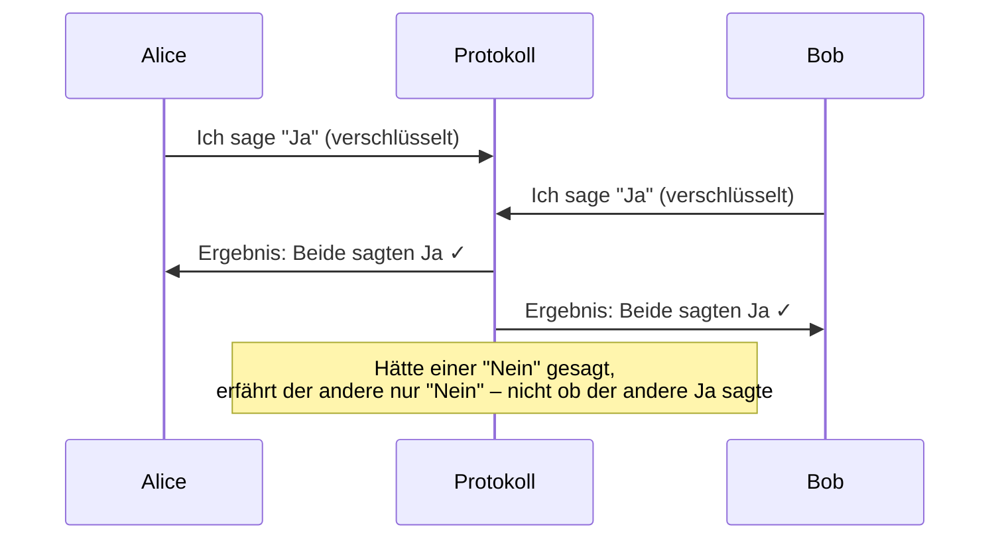
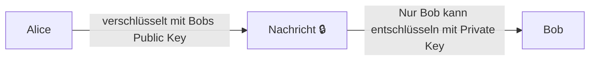

# SW03 – Anforderungen an kryptographische Protokolle & Intro Kryptographie

## Warum kryptographische Protokolle?

Kryptographie ist nicht nur eine Sammlung von Algorithmen – sie ist die Grundlage für Protokolle, die es mehreren Parteien ermöglichen, sicher miteinander zu kommunizieren oder gemeinsam Berechnungen durchzuführen, **ohne sich gegenseitig vollständig vertrauen zu müssen**.

Ein zentrales Designprinzip lautet: *Überlege zuerst, wie sich das System verhalten soll – nicht wie es implementiert wird.* Das ist der Unterschied zwischen **Anforderungsanalyse** und **Implementierung**.

---

## Das Millionärsproblem

Das Millionärsproblem ist ein klassisches Gedankenexperiment aus der Kryptographie, formuliert von Andrew Yao (1982):

> Zwei Millionäre wollen herausfinden, wer reicher ist – ohne dem anderen ihren genauen Reichtum zu verraten.

### Das Dilemma

- Person A behauptet: «Ich bin reicher!»
- Person B antwortet: «Nein, ich!»
- A fragt: «Wieviel Geld hast du?»
- B: «Sag's du zuerst!»

Das Problem: Wer zuerst seine Zahl nennt, gibt dem anderen einen Informationsvorteil. In einem normalen Gespräch gibt es keine faire Lösung ohne eine vertrauenswürdige dritte Partei.

### Die kryptographische Lösung

Kryptographische Protokolle lösen dieses Problem durch **Secure Multi-Party Computation (MPC)**. Dabei können zwei oder mehr Parteien gemeinsam eine Funktion über ihre privaten Eingaben berechnen, ohne dass eine Partei die Eingabe der anderen erfährt – ausser dem Ergebnis selbst.

**Wichtig:** Das Ergebnis («wer ist reicher?») darf bekannt werden – aber nicht die konkreten Zahlen.

---

## Das Datingproblem

Ein verwandtes Problem im Alltag:

> Alice überlegt, ob sie Bob ins Kino einladen soll – aber sie will sich nicht blamieren, falls er Nein sagt. Bob hat dasselbe Problem.

Beide wären gerne zusammen im Kino, aber niemand macht den ersten Schritt, weil eine Absage peinlich wäre. Die optimale Lösung wäre: Beide geben an, ob sie «Ja» oder «Nein» sagen würden – aber das Ergebnis wird nur dann enthüllt, wenn **beide** Ja gesagt haben.

Dies ist ein Beispiel für ein **Oblivious Transfer Protokoll** oder ein **Privacy-Preserving Matchmaking Protokoll**.

---

## Kryptographische Protokolle: Auktionen

Auktionen sind ein weiteres Praxisbeispiel für den Bedarf an kryptographischen Protokollen.

### Auktionstypen

- **Dutch Auction (Holländische Auktion):** Der Preis fällt, bis jemand kauft. Transparent, aber strategisch anfällig.
- **Vickrey Auction (Sealed-Bid Second-Price Auction):** Alle geben verdeckt ihr Gebot ab. Der Höchstbietende gewinnt, zahlt aber den zweitniedrigsten Preis. Fördert ehrliches Bieten.

### Phasen eines Auktionsprotokolls

Ein sicheres Auktionsprotokoll läuft in mehreren Phasen ab:

1. **Bieten** – Alle Teilnehmer geben ihre Gebote ab (idealerweise verdeckt)
2. **Auflösen** – Die Gebote werden geöffnet und ausgewertet

### Anforderungen

**Funktionsgarantien (für ehrliche Mitspieler):**
- Der höchste Bieter erhält das Produkt
- Das Ergebnis ist korrekt berechnet

**Sicherheitsgarantien (gegen unehrliche Mitspieler):**
- Ein unehrlicher Spieler erfährt nichts über die Gebote der anderen Spieler *(bis das Ergebnis feststeht)*
- Ein unehrlicher Spieler kann das Gebot eines anderen Spielers nicht verändern
- Niemand kann im Nachhinein leugnen, ein bestimmtes Gebot gemacht zu haben (Nicht-Abstreitbarkeit)

> **Hinweis:** Die Garantie «Unehrlicher Spieler erfährt nichts» gilt nur eingeschränkt: Nach Auflösung der Auktion kennt der Gewinner mindestens den Preis, den er bezahlen muss – und kann daraus indirekt Rückschlüsse ziehen.

---

## Anforderungen an kryptographische Protokolle – Übungsaufgaben

In der Übung werden folgende Systeme analysiert:

| System | Kernfrage |
|---|---|
| **e-Voting** | Wie stimmt man anonym ab, ohne dass Stimmen gefälscht werden? |
| **Biometrischer Pass** | Wie wird Identität sicher nachgewiesen ohne Datenmissbrauch? |
| **e-Cash** | Wie funktioniert digitales Geld ohne Bankgeheimnis zu verletzen? |
| **Buch auf e-Reader** | Wie schützt man Urheberrechte ohne Nutzer zu überwachen? |
| **Software Update** | Wie stellt man sicher, dass nur echte Updates eingespielt werden? |

### Methodik: Anforderungen vor Implementierung

Das wichtigste Prinzip:

> **Überlege nicht, wie du etwas implementierst. Überlege, wie sich das System verhalten soll.**

Dies ist der Grundsatz des **Security-by-Design**: Sicherheitsanforderungen müssen von Anfang an definiert werden, bevor die technische Umsetzung beginnt.

Viele Systeme laufen in **mehreren Phasen** ab, die unterschiedliche Anforderungen haben:
- Beim e-Voting: Phase «Abstimmen» vs. Phase «Ergebnis veröffentlichen»
- Beim Biometrischen Pass: Phase «Ausstellen» vs. Phase «Verwenden»

---

## Intro Kryptographie: Schlüsselkonzept

### Symmetrische vs. Asymmetrische Kryptographie – Die Analogie

Eine gute Analogie für das Verständnis:

**Symmetrische Kryptographie (z.B. AES):**
- Sender und Empfänger haben denselben Schlüssel (wie ein Hausschlüssel)
- Schnell und effizient
- Problem: Wie übergibt man den Schlüssel sicher?

**Asymmetrische Kryptographie (z.B. RSA):**
- Zwei verschiedene Schlüssel: öffentlicher Schlüssel (Public Key) + privater Schlüssel (Private Key)
- Analogie: Ein offenes Vorhängeschloss (Public Key) kann jeder zuschnappen lassen – aber nur der Besitzer des Schlüssels (Private Key) kann es öffnen.
- Löst das Schlüsselverteilungsproblem

---

## Lernziele dieser Woche

- Verständnis dafür, dass kryptographische Protokolle mehr sind als Algorithmen
- Fähigkeit, Anforderungen an ein sicheres System zu formulieren (funktional und sicherheitstechnisch)
- Grundverständnis für das Spannungsfeld zwischen **Privatsphäre** und **Sicherheit**
- Vorbereitung auf die nächste Woche: Symmetrische Verschlüsselung und Hash-Funktionen

---

## Vorschau: Nächste Woche (SW04)

- Videos zu Kryptographie ansehen (auf ILIAS)
- ILIAS-Übung SW04 (und SW08 optional bereits lösen)
- Symmetrische Verschlüsselung (AES) und Hash-Funktionen (SHA-256) werden eingeführt
- Fragestunde zur Kryptographie: offene Fragen ins Forum schreiben
