# Grundlagen der Kryptologie

## Überblick: Was ist Kryptologie?

**Kryptologie** ist der Oberbegriff für die Wissenschaft der geheimen Kommunikation. Sie teilt sich in zwei grosse Teilgebiete:

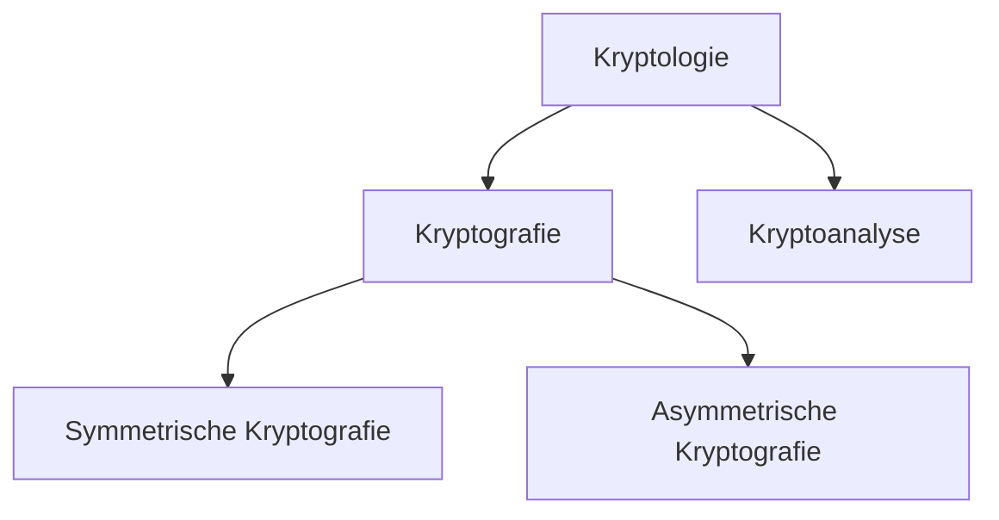

- **Kryptografie** beschäftigt sich damit, *wie* man Nachrichten verschlüsselt und schützt.
- **Kryptoanalyse** beschäftigt sich damit, *wie* man verschlüsselte Nachrichten ohne Kenntnis des Schlüssels entschlüsselt – also dem „Brechen" von Verschlüsselungen.

Die Kryptologie ist die Grundlage moderner Informationssicherheit. Ohne sie wäre sicheres Online-Banking, HTTPS oder sichere Passwörter undenkbar.

---

## Kryptoanalyse

### Kerckhoffs' Prinzip

Das Kerckhoffs'sche Prinzip ist eine fundamentale Designregel der modernen Kryptografie:

> **Der Angreifer kennt den Algorithmus und alle Details des Systems. Nur der Schlüssel ist geheim.**

Das klingt zunächst kontraintuitiv – warum sollte man dem Angreifer alles verraten? Der Grund ist pragmatisch: Ein Algorithmus, der nur dann sicher ist, wenn er geheim bleibt (*Security through Obscurity*), ist grundsätzlich unsicher. Denn:
- Algorithmen werden früher oder später bekannt (Leaks, Reverse Engineering, Mitarbeiter).
- Offene Algorithmen können von der weltweiten Forschungsgemeinschaft analysiert und auf Schwächen geprüft werden.
- Nur der Schlüssel kann wirklich geheim gehalten werden und bei Kompromittierung einfach ausgetauscht werden.

**Beispiel:** AES, der heute am weitesten verbreitete Verschlüsselungsstandard, ist vollständig öffentlich dokumentiert – und genau deshalb vertrauen ihm Millionen Systeme.

---

### Das klassische Angreifermodell: Alice, Bob und Eve

In der Kryptografie wird typischerweise mit drei Rollen gearbeitet:

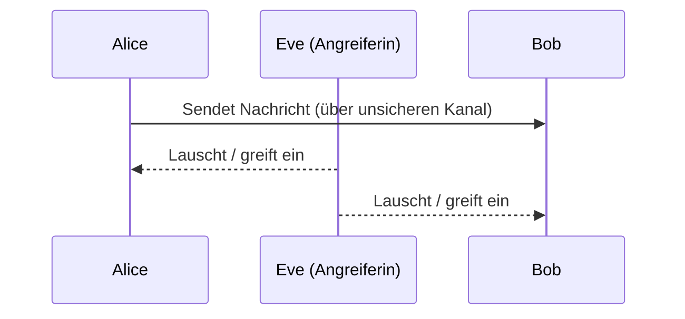

- **Alice** möchte eine Nachricht sicher an **Bob** übermitteln.
- **Eve** ist die Angreiferin, die versucht, die Kommunikation zu kompromittieren.

Wichtig: Eve beschränkt sich *nicht* nur auf das passive Mithören. Mögliche Angriffe umfassen:
- **Abhören** der Nachricht (Vertraulichkeit gefährdet)
- **Verändern** der Nachricht (Integrität gefährdet)
- **Erfundene Nachrichten einspielen** (Authentizität gefährdet)
- **Replay-Angriff:** Eine abgefangene Nachricht zu einem späteren Zeitpunkt erneut einspielen
- **Nachrichten löschen**
- **Identitätsfälschung:** Sich für Alice oder Bob ausgeben (Man-in-the-Middle)

---

### Angriffsarten in der Kryptoanalyse

Je nachdem, welche Informationen ein Angreifer hat, unterscheidet man folgende Angriffsarten (geordnet nach steigender Stärke des Angreifers):

| Angriffsart | Englisch | Was der Angreifer kennt |
|---|---|---|
| Angriff mit bekanntem Chiffretext | Ciphertext Only Attack | Nur den verschlüsselten Text |
| Angriff mit bekanntem Klartext | Known Plaintext Attack | Klartext-Chiffretext-Paare |
| Angriff mit gewähltem Klartext | Chosen Plaintext Attack | Kann beliebige Klartexte verschlüsseln lassen |
| Angriff mit gewähltem Chiffretext | Chosen Ciphertext Attack | Kann beliebige Chiffretexte entschlüsseln lassen |

Ein Kryptosystem gilt als sicher, wenn es selbst dem stärksten realistischen Angriff standhält.

---

### Exkurs: Side-Channel-Angriffe

Side-Channel-Angriffe umgehen die mathematische Stärke eines Algorithmus und nutzen stattdessen physikalische Eigenschaften der Implementierung aus.

**Beispiel – Simple Power Analysis (SPA) gegen RSA:**

RSA basiert auf Potenzierungen, die intern als Folge von Multiplikationen und Quadraturen durchgeführt werden:
- Bei einer `0` im Schlüsselbit: Quadratur
- Bei einer `1` im Schlüsselbit: Multiplikation und Quadratur

Diese beiden Operationen verbrauchen unterschiedlich viel elektrische Leistung. Durch Messen des Stromverbrauchs kann ein Angreifer ohne Gegenmassnahmen den geheimen Schlüssel rekonstruieren – *ohne den Algorithmus mathematisch zu brechen*.

Das zeigt: Selbst ein mathematisch perfekter Algorithmus kann durch schlechte Implementierung angreifbar sein.

---

## Zufallszahlengeneratoren

Zufallszahlen sind das Fundament der Kryptografie – und nicht jeder Zufallszahlengenerator ist für kryptografische Zwecke geeignet.

### Normaler vs. kryptografisch sicherer PRNG

| Eigenschaft | Normaler PRNG | Kryptografisch sicherer PRNG (CSPRNG) |
|---|---|---|
| Gleichmässige Verteilung | ✅ | ✅ |
| Hohe Geschwindigkeit | ✅ | Oft langsamer |
| Nicht vorhersagbar | ❌ | ✅ |
| Beispiel (Java) | `java.util.Random` | `java.security.SecureRandom` |

**Warum ist Nicht-Vorhersagbarkeit so wichtig?**

Wenn ein Angreifer die nächste „zufällige" Zahl vorhersagen kann, kann er:
- Geheimschlüssel rekonstruieren
- Sitzungstoken erraten
- Kryptografische Protokolle brechen

Ein normaler PRNG wie `java.util.Random` ist deterministisch – wer den Seed kennt, kann alle zukünftigen Werte berechnen. CSPRNGs beziehen ihre Entropie aus echten physikalischen Quellen (Mausbewegungen, Hardware-Rauschen, etc.) und sind daher nicht vorhersagbar.

> **Merke:** Die meisten kryptografischen Verfahren sind nur dann sicher, wenn wirklich zufällige Zahlen verwendet werden. Ein schwacher Zufallsgenerator unterminiert selbst den stärksten Verschlüsselungsalgorithmus.

---

## Symmetrische Kryptografie (Secret-Key Kryptografie)

Bei der symmetrischen Kryptografie verwenden Sender und Empfänger **denselben geheimen Schlüssel** (`sk`) für Ver- und Entschlüsselung.

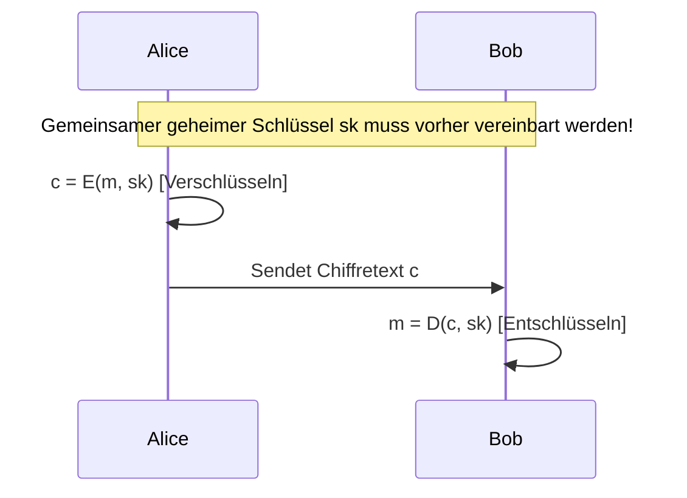

**Kernproblem:** Der gemeinsame Schlüssel muss *vorher* sicher ausgetauscht werden. Wie das geschieht, ohne dass Eve ihn abfängt, ist das zentrale Problem des **Schlüsselmanagements**.

### Strom- und Blockchiffren

Symmetrische Kryptografie wird in zwei grundlegende Typen unterteilt:

- **Stromchiffre:** Jedes einzelne Bit der Nachricht wird einzeln verschlüsselt. Der Schlüssel ist gleich lang wie die Nachricht. Die Verschlüsselung erfolgt häufig mittels XOR-Verknüpfung. *Vorteil:* Einfach und schnell; *Nachteil:* Schlüsselmanagement bei langen Nachrichten komplex.

- **Blockchiffre:** Die Nachricht wird in Blöcke fester Länge aufgeteilt und blockweise verschlüsselt. Das ist der heute dominante Ansatz.

---

### Advanced Encryption Standard (AES)

AES ist die heute weltweit meistgenutzte symmetrische Blockchiffre und seit 2001 der offizielle US-Standard.

| Parameter | Wert |
|---|---|
| Typ | Symmetrische Blockchiffre |
| Blockgrösse | 128 Bit |
| Schlüssellänge | 128, 192 oder 256 Bit |
| Sicherheit | Längerer Schlüssel = höhere Sicherheit |

**AES verschlüsselt in mehreren Runden**, wobei jede Runde vier Operationen durchführt:

1. **SubBytes:** Jedes Byte wird anhand einer vordefinierten Substitutionsbox (S-Box) durch ein anderes ersetzt. Dies sorgt für *Konfusion* – der Zusammenhang zwischen Klartext und Chiffretext wird verschleiert.

2. **ShiftRows:** Die Bytes in den Zeilen der 4×4-Matrix werden zyklisch verschoben. Dies sorgt für *Diffusion* – Veränderungen in einem Teil des Blocks breiten sich auf andere Teile aus.

3. **MixColumns:** Die Spalten der Matrix werden durch eine lineare Transformation gemischt. Verstärkt die Diffusion weiter, sodass ein einzelnes geändertes Byte alle Bytes einer Spalte beeinflusst.

4. **AddRoundKey:** Der Rundenschlüssel (aus dem Hauptschlüssel abgeleitet) wird per XOR auf die Daten angewendet. Dies vermischt Schlüssel und Daten direkt miteinander.

Diese Kombination aus Konfusion und Diffusion macht AES extrem widerstandsfähig gegen Kryptoanalyse.

---

### Betriebsmodi von Blockchiffren

Eine Blockchiffre allein definiert nur, wie ein einzelner Block verschlüsselt wird. Um längere Nachrichten zu verarbeiten, braucht man einen **Betriebsmodus**, der festlegt, wie die Blöcke miteinander verknüpft werden.

> **Wichtig:** Zu einer Blockchiffre muss immer ein Betriebsmodus angegeben werden!

#### Electronic Code Book (ECB)

Im ECB-Modus wird jeder Block **unabhängig** mit demselben Schlüssel verschlüsselt.

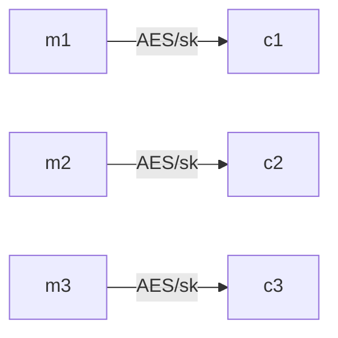

**Vorteile:**
- Blöcke können parallel ver- und entschlüsselt werden (hohe Performance)
- Teilverschlüsselung einzelner Blöcke möglich

**Nachteile (schwerwiegend!):**
- **Gleiche Klartextblöcke → gleiche Chiffratblöcke.** Dies ist ein fundamentales Sicherheitsproblem: Muster im Klartext bleiben im Chiffretext erkennbar.
- Chiffratblöcke können unbemerkt vertauscht werden → der entschlüsselte Klartext ist ebenfalls vertauscht.
- Chiffratblöcke können ohne Fehlermeldung gelöscht werden.

Das berühmte Beispiel ist das **ECB-verschlüsselte Linux-Tux-Bild**: Obwohl verschlüsselt, ist der Pinguin klar erkennbar, weil identische Bildblöcke identische Chiffratblöcke ergeben.

> ECB wird aufgrund dieser Schwächen in der Praxis **nicht empfohlen**.

---

#### Cipher Block Chaining (CBC)

CBC behebt die Nachteile von ECB, indem jeder Klartextblock **vor** der Verschlüsselung mit dem vorherigen Chiffratblock XOR-verknüpft wird. Für den ersten Block wird ein zufälliger **Initialisierungsvektor (IV)** verwendet.

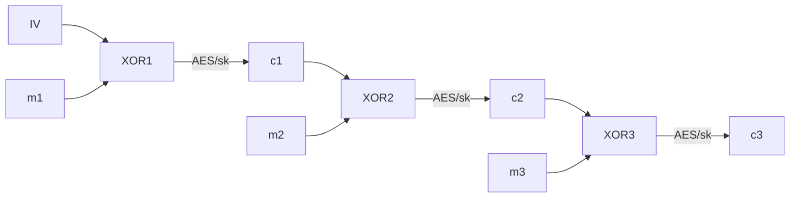

**Warum ein IV?**
- Der IV macht den Ablauf auch für den allerersten Block konsistent.
- Gleiche Nachrichten mit unterschiedlichem IV ergeben völlig unterschiedliche Chiffretexte → Angreifer kann keine Muster erkennen.
- Der IV muss **nicht** geheim sein, aber **zufällig und einmalig** (Nonce).

**Vorteile:**
- Gleiche Klartextblöcke ergeben unterschiedliche Chiffratblöcke
- Sicherer als ECB

**Nachteile:**
- **Keine Parallelisierung der Verschlüsselung** möglich (jeder Block hängt vom vorherigen ab)
- Teilverschlüsselung nicht möglich (z. B. bei Festplattenverschlüsselung unpraktisch)
- Ein Fehler in einem Block überträgt sich auf den nächsten Block

---

#### Weitere Betriebsmodi

Es existieren noch weitere Modi wie **CTR (Counter Mode)**, **GCM (Galois/Counter Mode)** etc., die je nach Anwendungsfall bevorzugt werden. GCM beispielsweise bietet zusätzlich Authentizität und wird in TLS 1.3 eingesetzt.

---

### Schlüsselmanagement bei symmetrischer Kryptografie

Ein grosses Problem der symmetrischen Kryptografie ist die **Skalierung des Schlüsselmanagements**:

Für jedes Paar von Kommunikationspartnern wird ein eigener Schlüssel benötigt:

$$\text{Anzahl Schlüssel} = \frac{n \cdot (n-1)}{2}$$

**Beispiel:** Bei 4 Partnern: $\frac{4 \cdot 3}{2} = 6$ Schlüssel. Bei 1000 Partnern: 499'500 Schlüssel!

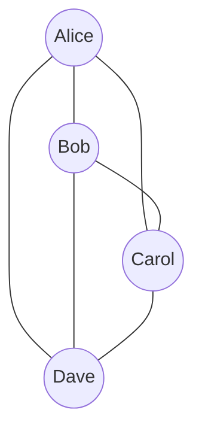

Zudem stellt sich die Frage: **Wie tauscht man den Schlüssel sicher aus?** Man braucht einen sicheren Kanal, um den Schlüssel zu übertragen – den man eigentlich erst durch Kryptografie schaffen möchte. Dieses Henne-Ei-Problem löst die **asymmetrische Kryptografie** (Thema einer späteren Vorlesung).

---

## Hashfunktionen

### Was ist eine Hashfunktion?

Eine Hashfunktion bildet eine beliebig lange Eingabe (Nachricht) auf einen **Hashwert fixer Länge** (auch *Fingerprint* genannt) ab.

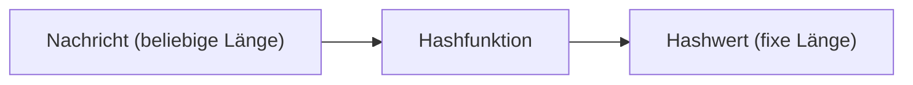

**Wichtige Eigenschaft:** Die Funktion ist **deterministisch** – dieselbe Eingabe ergibt immer denselben Hashwert. Aber sie ist *keine* Verschlüsselung: Es gibt keinen Schlüssel und keine Umkehrfunktion (zumindest keine effiziente).

---

### Eigenschaften kryptografischer Hashfunktionen

Kryptografische Hashfunktionen müssen drei zentrale Sicherheitseigenschaften erfüllen:

1. **Preimage Resistance (Einwegfunktion):**
   Zu einem gegebenen Hashwert `h` ist es praktisch unmöglich, eine Nachricht `m` zu finden, sodass `H(m) = h`.
   *Wozu:* Verhindert, dass aus einem gestohlenen Hashwert das Passwort rekonstruiert wird.

2. **Second Preimage Resistance:**
   Zu einer gegebenen Nachricht `m1` und ihrem Hashwert ist es praktisch unmöglich, eine zweite Nachricht `m2 ≠ m1` zu finden, sodass `H(m1) = H(m2)`.
   *Wozu:* Verhindert, dass ein Angreifer ein Dokument durch ein anderes mit demselben Hash ersetzt.

3. **Collision Resistance:**
   Es ist praktisch unmöglich, irgendein Paar `(m1, m2)` mit `m1 ≠ m2` zu finden, sodass `H(m1) = H(m2)`.
   *Wozu:* Stärkste Eigenschaft – verhindert, dass ein Angreifer zwei verschiedene Nachrichten mit gleichem Hash konstruiert.

> Kollisionsresistenz ist schwächer als man denkt: Nach dem **Geburtstagsparadoxon** genügen bereits etwa $\sqrt{2^n}$ Versuche, um mit 50% Wahrscheinlichkeit eine Kollision zu finden (bei $n$-Bit-Hashwert).

---

### Übersicht gängiger Hashalgorithmen

| Name | Blockgrösse | Outputlänge | Status |
|---|---|---|---|
| MD5 | 512 Bit | 128 Bit | **Gebrochen** – nicht mehr verwenden! |
| SHA-1 | 512 Bit | 160 Bit | **Gebrochen** – nicht mehr verwenden! |
| SHA-256 | 512 Bit | 256 Bit | Sicher, weit verbreitet |
| SHA-384 | 1024 Bit | 384 Bit | Sicher |
| SHA-512 | 1024 Bit | 512 Bit | Sicher |
| SHA3-256 | 1088 Bit | 256 Bit | Sicher, andere Architektur (Keccak) |
| SHA3-384 | 832 Bit | 384 Bit | Sicher |
| SHA3-512 | 576 Bit | 512 Bit | Sicher |

SHA-2 (SHA-256, SHA-512) und SHA-3 gelten heute als sicher. MD5 und SHA-1 haben bekannte Kollisionsangriffe und dürfen für sicherheitskritische Anwendungen nicht mehr eingesetzt werden.

---

### Anwendung: Speichern von Passwörtern

**Problem:** Passwörter müssen serverseitig gespeichert werden, aber wie?

**Schlechte Lösungen:**
- **Klartext:** Wenn die Datenbank gehackt wird, sind alle Passwörter sofort kompromittiert.
- **Symmetrische Verschlüsselung (z. B. AES):** Besser, aber der Schlüssel muss irgendwo gespeichert werden – bei einem Datenbankeinbruch oft erreichbar.

**Gute Lösung:** Hashwerte der Passwörter speichern.
Wenn die Datenbank gestohlen wird, sind die Originalpasswörter nicht direkt lesbar.

---

### Rainbow Tables – und warum einfaches Hashen nicht reicht

**Problem:** Gleiche Passwörter → gleiche Hashwerte (per Definition). Ein Angreifer kann eine **Rainbow Table** erstellen: eine riesige vorberechnete Tabelle mit Passwort-Hash-Paaren.

```
"password"  → 5f4dcc3b5aa765d61d8327deb882cf99
"123456"    → e10adc3949ba59abbe56e057f20f883e
"qwerty"    → d8578edf8458ce06fbc5bb76a58c5ca4
...
```

Mit einer solchen Tabelle kann ein Angreifer zu einem gefundenen Hashwert sofort das Passwort nachschlagen – ohne die Hashfunktion zu „brechen".

---

### Salt & Pepper – die Lösung gegen Rainbow Tables

**Salt:** Ein zufällig generierter Wert, der *vor* dem Hashen an das Passwort angehängt wird und im Klartext in der Datenbank gespeichert wird. Jeder Benutzer erhält einen eigenen Salt.

**Pepper:** Ähnlich wie Salt, aber *nicht* in der Datenbank gespeichert und für alle Benutzer gleich. Wird separat (z. B. in einer Konfigurationsdatei oder einem Hardware-Sicherheitsmodul) abgelegt.

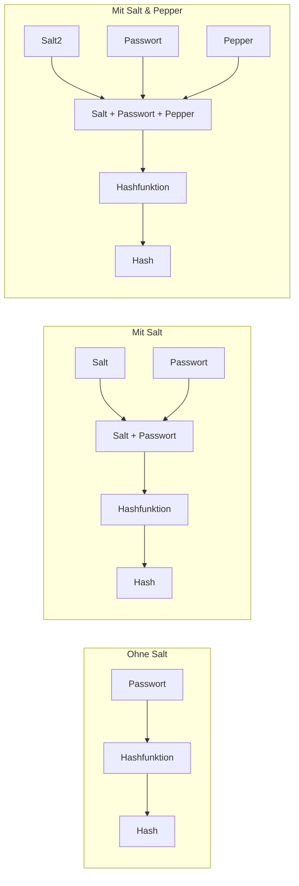

**Warum funktioniert Salt gegen Rainbow Tables?**
Da jeder Benutzer einen anderen Salt hat, müsste ein Angreifer für jeden Salt eine eigene Rainbow Table erstellen – das macht vorberechnete Angriffe praktisch unbrauchbar.

**Praxisregel:**
- Salt zu verwenden ist das absolute **Minimum**.
- Pepper ist seltener im Einsatz, da die Implementierung aufwändiger ist (z. B. Schlüsselrotation beim *Pepper Rollover*).

---

### Argon2 – moderne Passwort-Hashing-Funktion

Normale Hashfunktionen wie SHA-256 sind für Passwörter eigentlich *zu schnell* – ein Angreifer kann Milliarden von Hashes pro Sekunde berechnen.

**Argon2** (insbesondere **Argon2id**) ist eine speziell für Passwörter entwickelte Funktion, die bewusst viele Ressourcen verbraucht:

| Parameter | Bedeutung |
|---|---|
| **m** – Minimal Memory Size | Mindestgrösse des genutzten Arbeitsspeichers |
| **t** – Minimum Iterations | Mindestanzahl der Berechnungsschritte |
| **p** – Degree of Parallelism | Parallelisierungsgrad |

Diese Parameter definieren zusammen den **Work Factor**: Wie teuer eine einzelne Passwort-Verifikation ist. Für einen legitimen Login ist das kaum spürbar (z. B. 0.5 Sekunden). Für einen Angreifer, der Millionen Passwörter ausprobiert, wird es prohibitiv teuer.

Argon2 fügt ausserdem automatisch einen Salt hinzu.

> Argon2 gewann 2015 den Password Hashing Competition (PHC) und ist heute die empfohlene Funktion für Passwort-Hashing gemäss OWASP.

---

## Message Authentication Codes (MAC)

### Was ist ein MAC?

Ein **Message Authentication Code (MAC)** ist ein kurzer Code, der an eine Nachricht angehängt wird und zwei Schutzziele gleichzeitig erfüllt:

1. **Datenintegrität:** Die Nachricht wurde nicht verändert.
2. **Benutzerauthentizität:** Die Nachricht stammt tatsächlich vom erwarteten Absender (der den Schlüssel kennt).

MACs basieren entweder auf **Blockchiffren** oder auf **kryptografischen Hashfunktionen**.

---

### Ablauf MAC

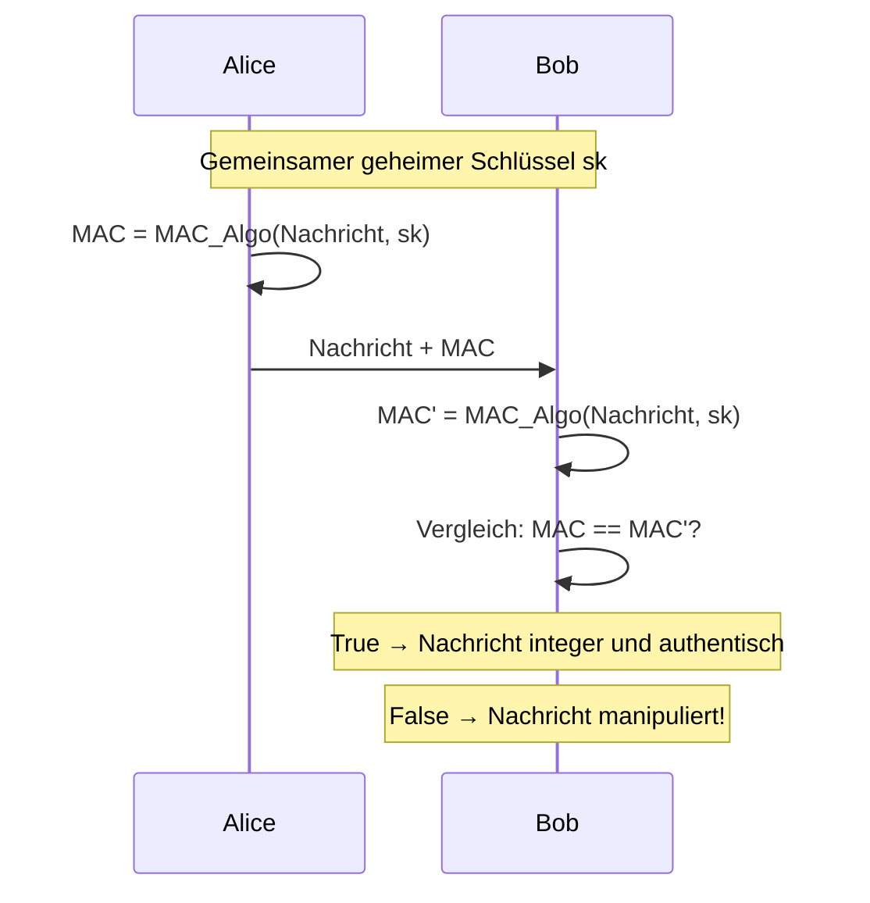

**Warum reicht eine normale Hashfunktion nicht aus?**
Ein einfacher Hash ohne Schlüssel schützt nicht vor Manipulation: Ein Angreifer könnte eine Nachricht verändern *und* den Hash neu berechnen. Erst der geheime Schlüssel im MAC stellt sicher, dass nur Personen mit Schlüsselkenntnis gültige MACs erzeugen können.

---

### HMAC (Hash-based Message Authentication Code)

**HMAC** (auch *Keyed-Hash* genannt) ist ein auf kryptografischen Hashfunktionen basierender MAC-Standard.

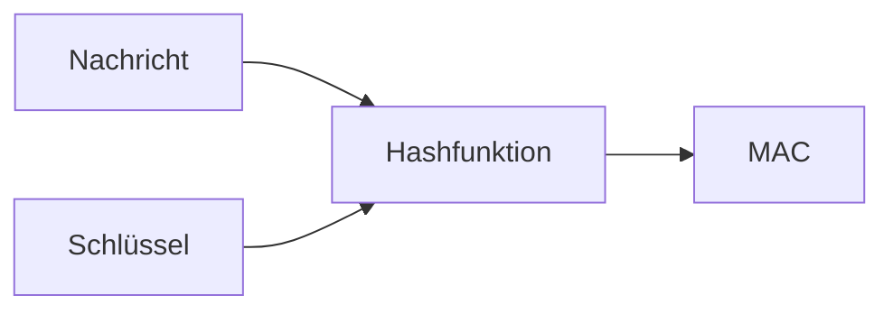

HMAC kombiniert die Nachricht mit einem geheimen Schlüssel auf eine kryptografisch sichere Weise (nicht einfach Verkettung, sondern eine normierte Konstruktion mit zwei Hash-Durchläufen), um einen MAC zu erzeugen.

**Typische Verwendung:** HMAC-SHA256 ist z. B. in TLS, JWT (JSON Web Tokens) und vielen API-Authentifizierungsschemas Standard.

---

## Zusammenfassung

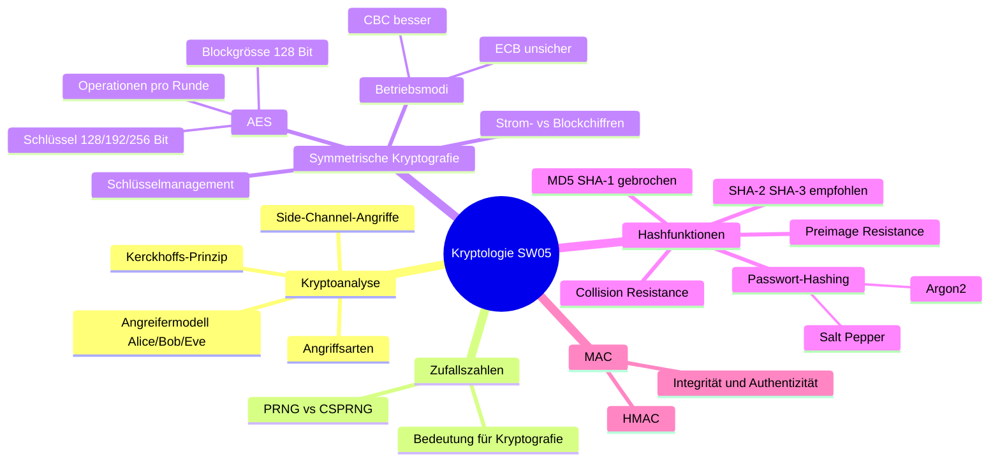

| Konzept | Schutzziel | Schlüssel nötig? |
|---|---|---|
| Symmetrische Verschlüsselung (AES) | Vertraulichkeit | ✅ Ja (shared secret) |
| Hashfunktion (SHA-256) | Integrität (ohne Authentizität) | ❌ Nein |
| MAC / HMAC | Integrität + Authentizität | ✅ Ja (shared secret) |

---

## Weiterführende Ressourcen

- [OWASP Password Storage Cheat Sheet](https://cheatsheetseries.owasp.org/cheatsheets/Password_Storage_Cheat_Sheet.html)
- Buch: Kryptografie in Theorie und Praxis – [Springer (HSLU-Zugang)](https://link.springer.com/book/10.1007/978-3-8348-9631-5)
- Buch: Einführung in die Theoretische Informatik – [Springer (HSLU-Zugang)](https://link.springer.com/book/10.1007/978-3-662-65142-1)
