# Asymmetrische Kryptologie

## 1. Das Problem der symmetrischen Schlüsselverteilung

Bevor man asymmetrische Verfahren versteht, muss man das Problem kennen, das sie lösen. Bei der **symmetrischen Kryptographie** teilen sich Sender und Empfänger denselben geheimen Schlüssel. Das klingt einfach – wird aber in der Praxis schnell zum Problem:

In einem Netzwerk mit $n$ Teilnehmern braucht jedes Paar einen eigenen Schlüssel. Das ergibt:

$$\frac{n \cdot (n-1)}{2} \text{ Schlüssel}$$

Bei 1000 Teilnehmern sind das fast **500'000 Schlüssel**. Jeder Teilnehmer muss $(n-1)$ Schlüssel sicher speichern. Und jedes Mal, wenn ein neuer Teilnehmer dazukommt, muss er auf sicherem Weg Schlüssel mit allen bestehenden Teilnehmern austauschen – was ohne bestehenden sicheren Kanal ein Henne-Ei-Problem ist.

**Asymmetrische Kryptographie** löst dieses Problem elegant: Jeder Teilnehmer braucht nur **ein einziges Schlüsselpaar** (öffentlich + privat), egal wie gross das Netzwerk ist.

---

## 2. Prinzip der Public-Key-Verschlüsselung

Das Grundprinzip: Es gibt **zwei mathematisch zusammenhängende Schlüssel**:

- **Public Key (öffentlicher Schlüssel):** Darf öffentlich bekannt sein. Wird zur Verschlüsselung verwendet.
- **Private Key (privater Schlüssel):** Muss geheim bleiben. Wird zur Entschlüsselung verwendet.

Was mit dem einen Schlüssel verschlüsselt wird, kann nur mit dem anderen entschlüsselt werden.

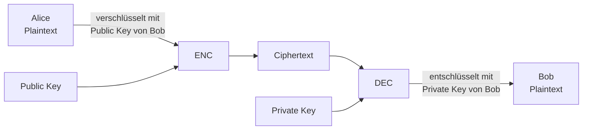

Die mathematische Grundlage ist eine sogenannte **Einwegfunktion (One-Way-Function)**:
- In eine Richtung einfach zu berechnen (Verschlüsselung)
- In die andere Richtung praktisch unmöglich (Entschlüsselung ohne Schlüssel)

**Beispiel Faktorisierung:**
- Multiplikation: $31 \times 67 = 2077$ → trivial
- Faktorisierung: $2077 = ?$ → aufwändig

Die bekanntesten Public-Key-Algorithmen und ihre mathematischen Grundprobleme:

| Algorithmus | Zugrundeliegendes "schwieriges" Problem |
|---|---|
| RSA | Integer-Faktorisierung |
| Diffie-Hellman (DH) | Diskreter Logarithmus |
| Elliptische Kurven DH (ECDH) | Diskreter Logarithmus auf elliptischen Kurven |

---

## 3. Komplexitätstheorie

### Warum Komplexität wichtig ist

Kryptographie basiert nicht nur darauf, dass ein Problem *theoretisch* unlösbar ist – sondern dass es mit vertretbarem Aufwand in der Praxis **nicht lösbar** ist. Hier kommt die **Komplexitätstheorie** ins Spiel: Sie analysiert, wie stark der Ressourcenaufwand (Zeit, Speicher) mit der Eingabegrösse wächst.

Wichtig: Die Messgrösse muss **hardware- und implementierungsunabhängig** sein. Man misst daher die **Anzahl der nötigen Operationen** als Funktion der Eingabegrösse $n$ (typisch: Anzahl der Ziffern / Bits).

### Komplexitätsklassen (Big-O-Notation)

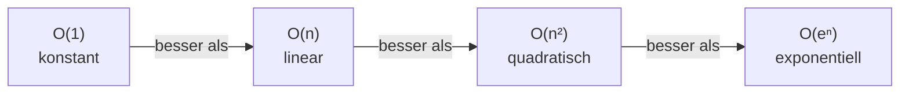

- **O(1):** Konstanter Aufwand, unabhängig von der Eingabe. Ideal.
- **O(n):** Aufwand wächst linear. Gut (Addition zweier n-stelliger Zahlen: ~n Operationen).
- **O(n²):** Quadratisch. Akzeptabel für kleine n (Multiplikation zweier n-stelliger Zahlen: ~n² Operationen).
- **O(eⁿ):** Exponentiell. Für grosse n praktisch nicht berechenbar – genau das, was wir für kryptographische Sicherheit wollen.

### Konkrete Beispiele

**Addition:** Bei 3-stelligen Zahlen → 4 Additionen (n+1 Operationen) → O(n)

**Multiplikation:** Bei 2-stelligen Zahlen → 4 Multiplikationen + 4 Additionen → O(n²)

### Die Klassen P und NP

Dies führt zu einem der wichtigsten offenen Probleme der Informatik:

- **Klasse P:** Probleme, die in **polynomieller Zeit** lösbar und verifizierbar sind (z. B. Eulerkreis – jede Kante einmal besuchen).
- **Klasse NP:** Probleme, bei denen eine gegebene Lösung schnell **verifizierbar** ist, aber das Finden der Lösung schwer sein kann (z. B. Hamiltonkreis – jeden Knoten einmal besuchen).

**P vs. NP:** Gilt P = NP? Wenn ja, wären alle NP-Probleme effizient lösbar – und die meiste Kryptographie würde zusammenbrechen. Die Frage ist ungelöst und eines der sieben Millennium-Probleme des Clay Mathematics Institute (Preisgeld: 1 Million USD).

> **Für die Kryptographie:** Man nutzt Probleme, die (vermutlich) nicht in P liegen – also für die kein effizienter Algorithmus bekannt ist. "Vermutlich" ist dabei wichtig: Es ist nicht bewiesen, dass z. B. Faktorisierung wirklich schwer ist.

---

## 4. Diffie-Hellman Schlüsselvereinbarung

### Geschichte

Das DH-Protokoll wurde entwickelt von:
- **Clifford Cocks** (1973, geheim, für den britischen Geheimdienst)
- **Ralph Merkle** (1974, öffentlich)
- **Whitfield Diffie & Martin Hellman** (1976, erste öffentliche Publikation)

Grundlage: Das **diskrete Logarithmus-Problem** – also die Schwierigkeit, aus $A = z^a \mod p$ den Exponenten $a$ zu berechnen, wenn $z$, $p$ und $A$ bekannt sind.

### Farbanalogie (intuitives Verständnis)

Das DH-Protokoll lässt sich schön mit Farben erklären:

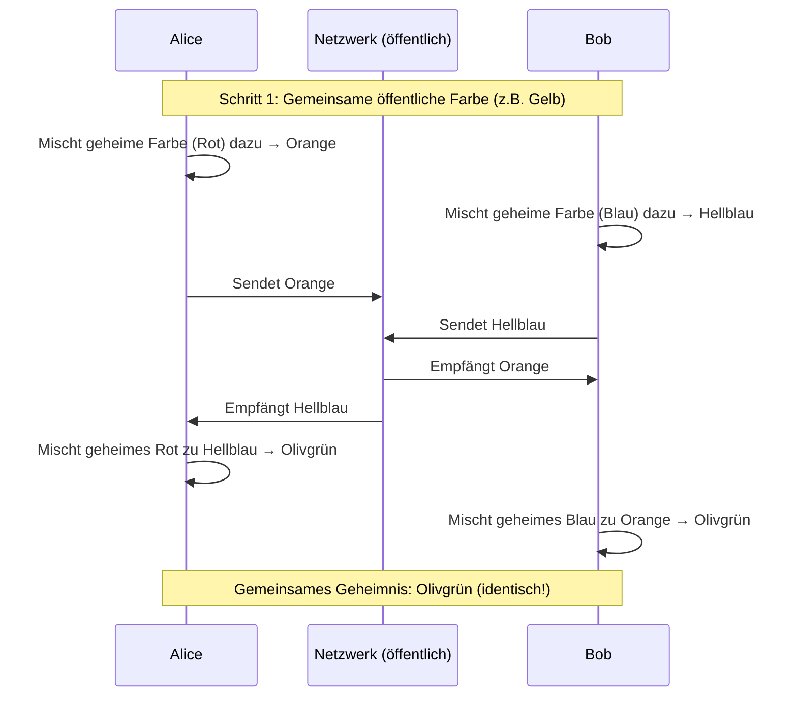

Der Angreifer sieht Gelb, Orange und Hellblau – kann aber daraus das Olivgrün nicht (effizient) rekonstruieren, weil das "Entmischen" von Farben praktisch unmöglich ist.

### Mathematisches Protokoll

**Vorbereitung (öffentlich bekannt):**
1. Wähle eine grosse Primzahl $p$
2. Wähle eine ganze Zahl $z \in \{2, 3, \ldots, p-2\}$
3. Veröffentliche $p$ und $z$

**Schlüsselvereinbarung:**

| Schritt | Alice | Bob |
|---|---|---|
| 1 | Wählt geheimes $a \in \{2,\ldots,p-2\}$ | Wählt geheimes $b \in \{2,\ldots,p-2\}$ |
| 2 | Berechnet $A = z^a \mod p$ | Berechnet $B = z^b \mod p$ |
| 3 | Sendet $A$ an Bob | Sendet $B$ an Alice |
| 4 | Berechnet $k = B^a \mod p$ | Berechnet $k = A^b \mod p$ |

**Warum ergibt das denselben Schlüssel?**

$$B^a \mod p = (z^b)^a \mod p = z^{ab} \mod p = (z^a)^b \mod p = A^b \mod p$$

**Öffentliche Schlüssel:** $A$ und $B$  
**Private Schlüssel:** $a$ und $b$  
**Gemeinsamer Schlüssel:** $k = z^{ab} \mod p$

### Konkretes Zahlenbeispiel ($p = 29$, $z = 2$)

- Alice wählt $a = 5$, berechnet $A = 2^5 \mod 29 = 3$
- Bob wählt $b = 4$, berechnet $B = 2^4 \mod 29 = 16$
- Alice: $k = 16^5 \mod 29 = 23$
- Bob: $k = 3^4 \mod 29 = 23$ ✓

### Man-in-the-Middle-Angriff

DH ist **nicht inhärent authentifiziert**. Ein Angreifer (Mallory) kann sich zwischen Alice und Bob schalten:

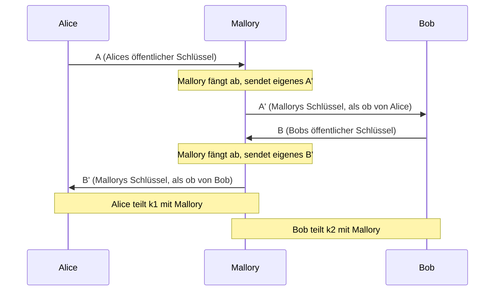

**Gegenmassnahme:** Authentifizierung der öffentlichen Schlüssel – z. B. durch **digitale Zertifikate** (→ Abschnitt 7).

---

## 5. RSA

### Geschichte

RSA wurde 1977 von **Ron Rivest**, **Adi Shamir** und **Leonard Adleman** am MIT veröffentlicht. Die Einwegfunktion: **Multiplikation zweier Primzahlen** ist einfach; die Umkehrung (Faktorisierung) ist schwer.

### Schlüsselerzeugung (konzeptuell)

1. Wähle zwei grosse Primzahlen $p$ und $q$
2. Berechne $n = p \cdot q$ (der **Modulus**)
3. Berechne $\phi(n) = (p-1)(q-1)$ (Eulersche Phi-Funktion)
4. Wähle $e$ mit $\gcd(e, \phi(n)) = 1$ (oft $e = 65537$)
5. Berechne $d = e^{-1} \mod \phi(n)$ (modulare Inverse)

**Öffentlicher Schlüssel:** $(n, e)$  
**Privater Schlüssel:** $(n, d)$ (und $p$, $q$ werden vernichtet)

### Ver- und Entschlüsselung

$$\text{Verschlüsseln: } C = M^e \mod n$$
$$\text{Entschlüsseln: } M = C^d \mod n$$

Das funktioniert, weil gilt: $(M^e)^d \equiv M \pmod{n}$ – eine Konsequenz des Satzes von Euler.

### Praktische Umsetzung mit OpenSSL

In der Praxis erstellt man Schlüssel mit Tools wie OpenSSL:

```bash
# Privaten 4096-Bit RSA-Schlüssel erzeugen (verschlüsselt mit AES-256)
openssl genrsa -aes256 -out private.pem 4096

# Öffentlichen Schlüssel extrahieren
openssl rsa -in private.pem -outform PEM -pubout -out public.pem
```

Die Schlüssel werden im **PEM-Format** (Privacy Enhanced Mail) gespeichert – Base64-kodierte Daten mit Header/Footer:
```
-----BEGIN PUBLIC KEY-----
<Base64-kodierte Daten>
-----END PUBLIC KEY-----
```

Ein 4096-Bit RSA-Schlüssel enthält:
- **n** (Modulus, ~4096 Bit)
- **e** (öffentlicher Exponent, typisch 65537 = 0x10001)
- **d** (privater Exponent, ~4096 Bit)
- **p** und **q** (die Primzahlen, ~2048 Bit je)
- **dp, dq** (vorberechnete Exponenten für schnellere Entschlüsselung via Chinesischer Restsatz)

### Angriffe auf RSA

RSA ist anfällig auf drei Klassen von Angriffen:

**1. Mathematische Angriffe (Faktorisierungsangriffe)**

Wenn man $n$ faktorisieren kann, erhält man $p$ und $q$ und damit den privaten Schlüssel. Der aktuelle Rekord liegt bei ~250-stelligen Dezimalzahlen (RSA-250 mit 829 Bit, geknackt 2020). Standardempfehlung heute: **mindestens 3072 Bit** (BSI 2023–2026).

**2. Protokollangriffe**

Unsichere Nutzung des Algorithmus – z. B. gleiche Nachrichten an mehrere Empfänger mit kleinem $e$, ohne Padding.

**3. Seitenkanal-Angriffe (Side-Channel Attacks)**

Angriffe, die nicht die Mathematik, sondern die **physische Implementation** ausnutzen:

- Michigan-Forscher: Durch Manipulation der Stromversorgung einen 1024-Bit-Privatschlüssel extrahiert
- Israelische Forscher: Durch Analyse der **akustischen Geräusche** eines Computers einen 4096-Bit-Privatschlüssel in unter einer Stunde extrahiert

```
Stromkurve-Analyse:
S  SM  SM  S  SM  S  S  SM  SM  SM  S  SM
0   1   1  0   1  0  0   1   1   1  0   1
↑ Privater Schlüssel Bit für Bit lesbar!
```

S = "Square" (Quadrierung), SM = "Square and Multiply" → verrät die Bits des privaten Schlüssels.

### ECC – Elliptic Curve Cryptography

Als Alternative zu RSA gibt es **Elliptische Kurven Kryptographie (ECC)**. Die zugrundeliegende Mathematik ist anspruchsvoller, bietet aber einen entscheidenden Vorteil:

**Gleiche Sicherheit bei viel kürzeren Schlüsseln!**

| Sicherheitsniveau (Bit) | RSA/DH | ECC (ECDH/ECDSA) | Symmetrisch |
|---|---|---|---|
| 80 | 1024 | 160 | 80 |
| 128 | 3072 | 256 | 128 |
| 192 | 7680 | 384 | 192 |
| 256 | 15360 | 512 | 256 |

Für mobile Geräte und ressourcenbeschränkte Systeme ist ECC daher oft die bessere Wahl.

---

## 6. Hybride Verschlüsselung

### Das Dilemma

Asymmetrische Verschlüsselung löst das Schlüsselverteilungsproblem – aber sie ist **viel langsamer** als symmetrische Verschlüsselung und kann nur kurze Nachrichten direkt verarbeiten.

**Vergleich:**

| Eigenschaft | Symmetrisch | Asymmetrisch |
|---|---|---|
| Geschwindigkeit | Schnell | Langsam |
| Anzahl Schlüssel | $n(n-1)/2$ | $n$ |
| Schlüssellänge | Kurz | Lang |
| Hauptverwendung | Datenverschlüsselung | Schlüsselaustausch, Signaturen |

### Die Lösung: Hybride Verschlüsselung

Man kombiniert beide Verfahren – das Beste aus beiden Welten:

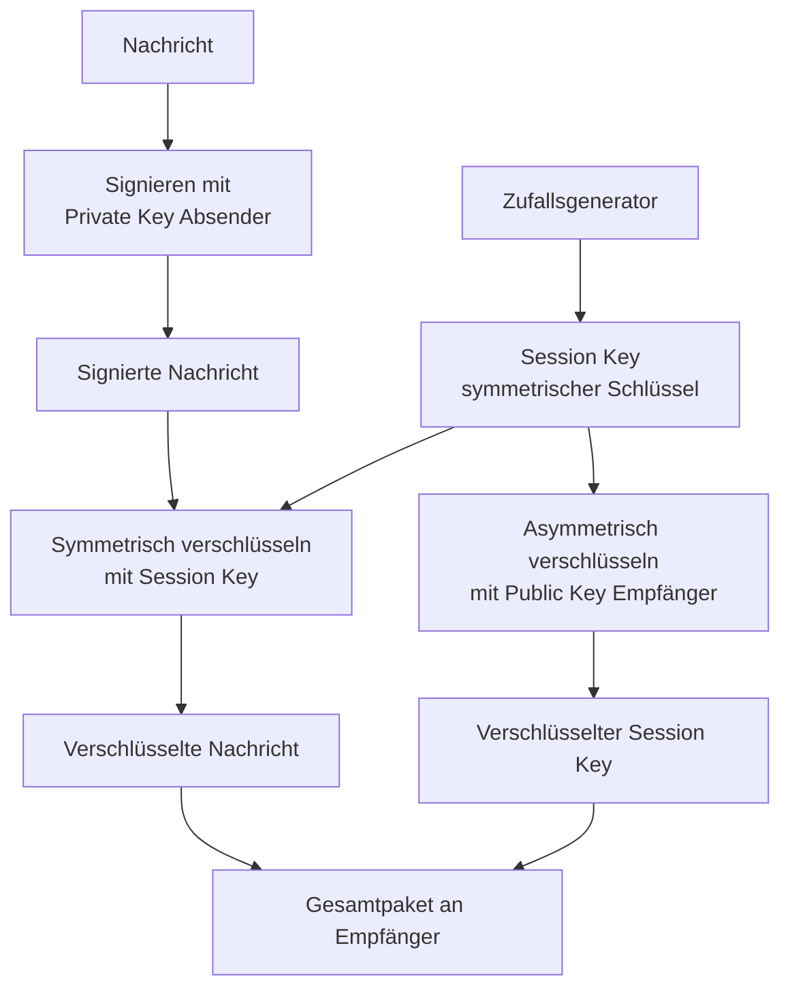

**Beim Senden:**
1. Nachricht signieren (Private Key des Absenders)
2. Zufälligen Session Key generieren
3. Nachricht symmetrisch mit Session Key verschlüsseln
4. Session Key asymmetrisch mit Public Key des Empfängers verschlüsseln
5. Beides zusammen senden

**Beim Empfangen:**
1. Session Key asymmetrisch entschlüsseln (Private Key des Empfängers)
2. Nachricht symmetrisch entschlüsseln (mit Session Key)
3. Signatur verifizieren (Public Key des Absenders)

> **Wichtige Reihenfolge:** Zuerst signieren, dann verschlüsseln. Die Signatur soll die Authentizität des Klartextes belegen – wenn man erst verschlüsselt, könnte die Signatur nur die verschlüsselte Version bezeugen.

---

## 7. Digitale Signaturen

### Was eine Signatur leisten muss

Eine analoge Unterschrift hat (idealisiert) vier Eigenschaften – und eine digitale Signatur muss diese ebenfalls erfüllen:

1. **Integrität:** Nach dem Unterschreiben kann das Dokument nicht unerkannt verändert werden.
2. **Authentizität:** Die Signatur kann zweifelsfrei einer bestimmten Person zugeordnet werden.
3. **Nicht-Abstreitbarkeit:** Der Unterzeichner kann nicht abstreiten, das Dokument signiert zu haben.
4. **Willenserklärend:** Die Signatur kann nur bewusst gesetzt worden sein.

> **Wichtiger Unterschied zur eigenhändigen Unterschrift:** Eine eigenhändige Unterschrift bezeugt, dass eine Person ein Dokument unterzeichnet hat – aber nicht, dass der Inhalt unverändert ist. Eine digitale Signatur bezeugt **beides**: Wer unterschrieben hat UND dass der Inhalt danach nicht verändert wurde.

### Funktionsprinzip

Beim Signieren ist die Reihenfolge von Schlüsseln umgekehrt wie bei der Verschlüsselung:

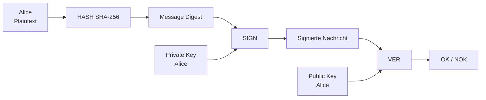

### Hash-then-Sign

Da das direkte Signieren grosser Dokumente mit asymmetrischen Algorithmen langsam wäre, wird in der Praxis **Hash-then-Sign** verwendet:

1. Dokument hashen (z. B. SHA-256) → ergibt einen 256-Bit Message Digest
2. Nur den (kurzen) Hash-Wert signieren

Das ist genauso sicher: Da keine zwei Dokumente denselben Hash haben (Kollisionsresistenz), bezeugt die Signatur des Hashes indirekt auch das Dokument.

### Signatur-Algorithmen

| Algorithmus | Zugrundeliegendes Problem |
|---|---|
| RSA | Integer-Faktorisierung |
| DSA (Digital Signature Algorithm) | Diskreter Logarithmus |
| ECDSA (Elliptischer DSA) | Diskreter Logarithmus (ECC) |

---

## 8. Digitale Zertifikate

### Das Problem: Authentizität des öffentlichen Schlüssels

Public-Key-Kryptographie setzt voraus, dass man weiss, welcher öffentliche Schlüssel wirklich zu einer bestimmten Person gehört. Ohne diese Garantie sind Man-in-the-Middle-Angriffe möglich. Hier kommen **digitale Zertifikate** ins Spiel.

### Was ist ein digitales Zertifikat?

Ein digitales Zertifikat bindet einen öffentlichen Schlüssel an eine Identität (Person, Organisation, Server) und wird von einer **Certification Authority (CA)** mit ihrer Signatur beglaubigt.

### Ausstellen eines Zertifikats


**Inhalt eines Zertifikats** (gemäss ITU X.509-Standard):
- Version
- Seriennummer
- Signaturalgorithmus
- Aussteller (Issuer = CA)
- Gültigkeitszeitraum (Not Before / Not After)
- Inhaber (Subject)
- Öffentlicher Schlüssel des Inhabers
- Erweiterungen (Extensions)
- Zertifikatssignatur (von der CA)

Der **Fingerabdruck** eines Zertifikats ist der Hash-Wert des gesamten Zertifikats (z. B. SHA-256). Er dient als kompakte Prüfgrösse für direkte Verifikation.

### Validierungsstufen für TLS-Zertifikate

| Stufe | Abkürzung | Prüfung | Geeignet für |
|---|---|---|---|
| Domain Validated | DV | Nur Domain-Kontrolle | Blogs, einfache Webseiten |
| Organization Validated | OV | + Organisationsprüfung | Webshops, Unternehmensseiten |
| Extended Validation | EV | + Umfangreiche rechtliche Prüfung | Banken, grosse Webshops |

### Ungültigkeitserklärung (Revokation)

Zertifikate können vor Ablauf **revoziert** werden, wenn:
- Der zugehörige private Schlüssel kompromittiert wurde
- Der Zertifikatsbesitzer das Unternehmen verlässt
- Personendaten sich geändert haben

Mechanismen:
- **CRL (Certificate Revocation List):** Liste aller gesperrten Zertifikate (nach Seriennummer), periodisch publiziert
- **OCSP (Online Certificate Status Protocol):** Echtzeitabfrage beim OCSP-Responder

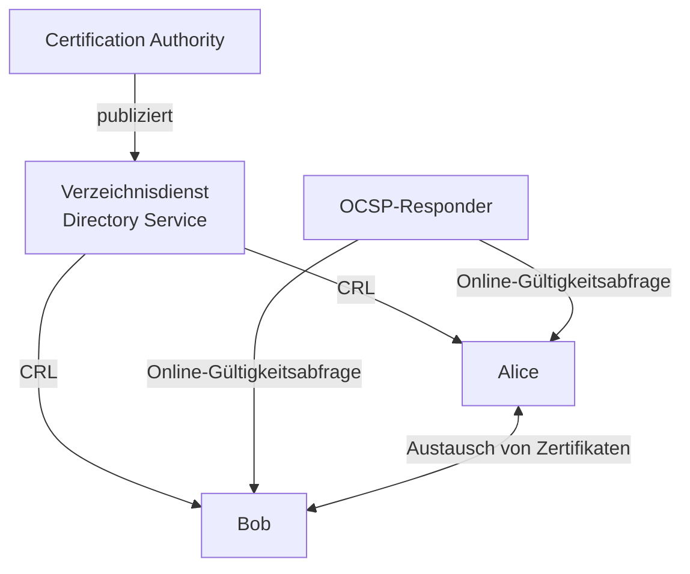

> **Warum muss ein Revokationsantrag genauso sorgfältig geprüft werden wie ein Zertifikatsantrag?** Weil ein Angreifer sonst das Zertifikat seines Opfers sperren könnte, um einen Denial-of-Service zu erzwingen oder um Verwirrung zu stiften. Die Revokationsliste muss ausserdem so kurz wie möglich gültig sein, damit gesperrte Zertifikate schnell als ungültig erkannt werden.

---

## 9. Vertrauensmodelle

Es gibt drei fundamentale Ansätze, wie Vertrauen in öffentliche Schlüssel aufgebaut werden kann:

### Direct Trust

Alice vertraut Bobs öffentlichem Schlüssel, weil sie ihn **direkt und persönlich** überprüft hat – z. B. durch persönlichen Austausch, Vergleich des Fingerabdrucks, oder weil er in der Software vorinstalliert ist.

**Beispiele:** Vorinstallierte SSH-Host-Keys, hardcodierte öffentliche Schlüssel in Apps.

**Problem:** Skaliert nicht – man kann nicht mit allen möglichen Kommunikationspartnern persönlich Schlüssel austauschen.

### Web-of-Trust (WOT)

Kein zentrales Vertrauen, sondern ein Netz gegenseitiger Empfehlungen:

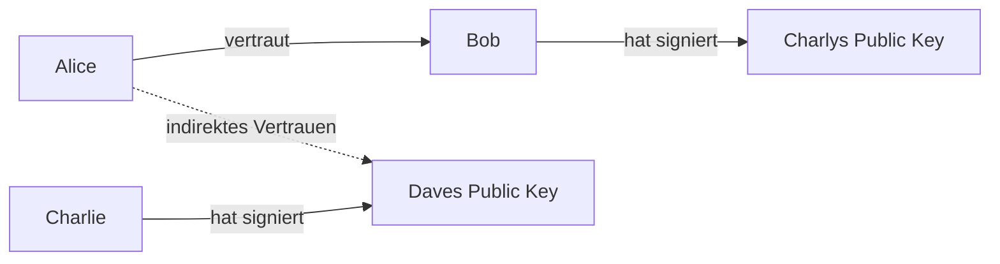

Alice vertraut Dave, weil Bob Charlys Schlüssel signiert hat, und Charlie Daves Schlüssel signiert hat, und Alice Bob vertraut.

**Verwendung:** PGP/GPG für E-Mail-Verschlüsselung.

**Problem:** Funktioniert gut in kleinen Communities, skaliert aber schlecht für das grosse Internet.

### Hierarchical Trust (PKI)

Das dominante Modell im Internet: Eine **Hierarchie von Certification Authorities (CAs)**:

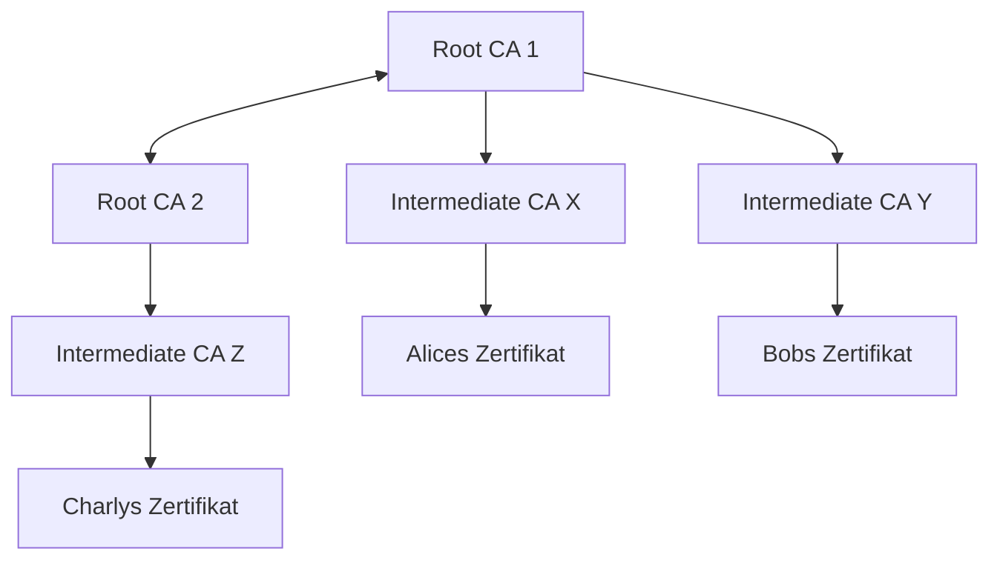

- **Root CA:** Selbstsigniertes Wurzelzertifikat, oberste Vertrauensankerpunkt
- **Intermediate CA:** Von der Root CA zertifiziert, stellt Endbenutzerzertifikate aus
- **Endbenutzerzertifikat:** Von einer Intermediate CA ausgestellt

Betriebssysteme und Browser liefern **vorinstallierte Root-CA-Zertifikate** mit. Diese sind der **Trust Anchor** – der Ausgangspunkt der gesamten Vertrauenskette.

---

## 10. Public-Key-Infrastruktur (PKI)

Eine PKI ist ein **System**, das digitale Zertifikate ausstellen, verteilen und prüfen kann. Sie besteht aus mehreren Bausteinen:

| Komponente | Aufgabe |
|---|---|
| **Registration Authority (RA)** | Identitätsprüfung der Antragsteller |
| **Certification Authority (CA)** | Ausstellen und Signieren von Zertifikaten |
| **Personal Security Environment (PSE)** | Sicherer Speicher für private Schlüssel |
| **Directory Service (DIR) / VA** | Veröffentlichung von Zertifikaten und CRLs |
| **Sicherheitsapplikation** | Nutzt die Zertifikate in der eigentlichen Anwendung |

### Personal Security Environment (PSE)

Das PSE ist das Ablagemedium für geheime Schlüssel. Ausprägungen nach steigender Sicherheit:

- **Soft-Token:** Passwort-geschützte Datei (z. B. private.pem)
- **Smart Card / Crypto Card:** Plastikkarte mit Krypto-Prozessor
- **USB-Token:** USB-Stick mit Krypto-Prozessor
- **Hardware Security Module (HSM):** Server-Erweiterungskarte mit Krypto-Prozessor; höchste Sicherheit

### Zertifikatskette (Chain of Trust)

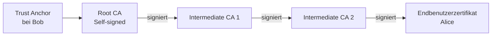

Wenn Bob eine signierte E-Mail von Alice erhält, überprüft er die Zertifikatskette rückwärts bis zu einem Root-CA-Zertifikat, dem er vertraut. Die Verifikation erfolgt durch Prüfung der digitalen Signaturen an jedem Glied der Kette.

### Was beim Prüfen eines Zertifikats geprüft wird

- Identität des Inhabers (stimmt Subject mit erwartetem Partner überein?)
- Zeitliche Gültigkeit (Not Before / Not After)
- Nicht auf der CRL (Revokationsliste)
- Gültigkeit der ausstellenden CA
- Gültigkeit der Signatur
- Verwendungszweck (Key Usage / Extended Key Usage)

> **Warum ist die Installation eines neuen Root-CA-Zertifikats heikel?** Weil damit automatisch allen von dieser CA ausgestellten Zertifikaten vertraut wird – also potenziell Millionen von Zertifikaten. Ein gefälschtes oder kompromittiertes Root-Zertifikat kann für umfassende Man-in-the-Middle-Angriffe missbraucht werden.

---

## 11. Transport Layer Security (TLS)

### Motivation

Das Internet wurde ursprünglich **ohne Sicherheitsmechanismen** entworfen (TCP/IP). TLS/SSL wurde nachträglich als Schicht zwischen der Anwendungsschicht und der Transportschicht eingefügt – ein anwendungsunabhängiges Sicherheitsprotokoll.

### Einordnung im Schichtenmodell

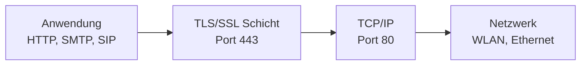

TLS besteht intern aus mehreren Protokollen:
- **Handshake Protocol:** Verbindungsaufbau, Aushandlung
- **Record Layer Protocol:** Eigentliche verschlüsselte Datenübertragung
- **Alert Protocol:** Fehlermeldungen
- **Change Cipher Spec Protocol:** Aktivierung der ausgehandelten Parameter
- **Application Data Protocol:** Anwendungsdaten

### TLS-Handshake (Verbindungsaufbau)

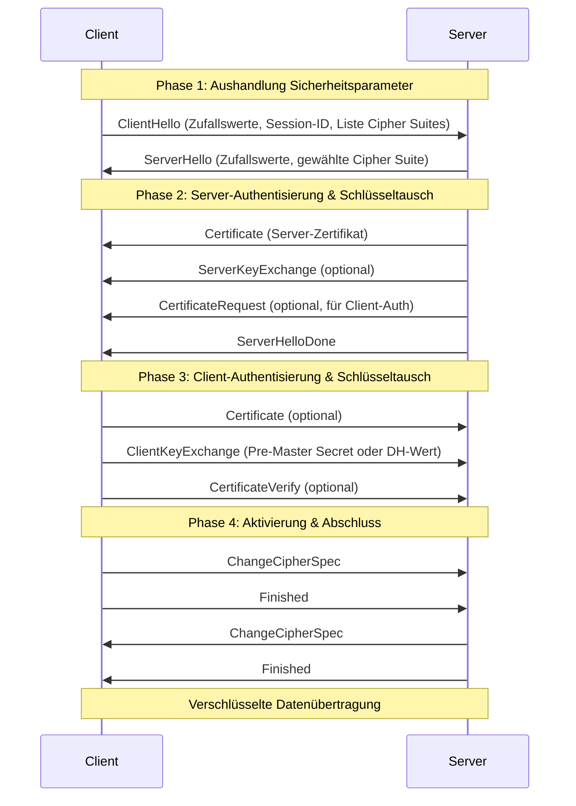

Nach dem Handshake leiten beide Seiten aus dem ausgetauschten Material (Pre-Master Secret + Zufallswerte) **Sitzungsschlüssel** ab – für Verschlüsselung und Integritätsprüfung in beiden Richtungen.

### Cipher Suites

Eine Cipher Suite definiert die komplette Kombination von Algorithmen für eine TLS-Verbindung:

```
TLS_ECDHE_RSA_WITH_AES_128_GCM_SHA256
 │    │     │        │          │
 │    │     │        │          └─ Hash-Funktion für MAC
 │    │     │        └─ Verschlüsselungsalgorithmus
 │    │     └─ Authentifizierungsalgorithmus
 │    └─ Schlüsseltauschverfahren
 └─ Protokoll
```

- **Schlüsseltausch:** RSA, DH (Diffie-Hellman), ECDH (Elliptisch), PSK
- **Authentifizierung:** RSA, DSA, ECDSA, PSK
- **Verschlüsselung:** RC4 (veraltet!), DES/3DES (veraltet!), AES, ChaCha20
- **Hash/MAC:** MD5 (veraltet!), SHA-1 (veraltet!), SHA-256, SHA-384

### TLS 1.3 – Die aktuelle Version

TLS 1.3 ist eine grundlegende Überarbeitung mit deutlichen Sicherheitsverbesserungen:

**Wichtigste Änderungen:**
- Nur noch **DHE oder ECDHE** für den Schlüsseltausch → erzwingt **Perfect Forward Secrecy**
- Veraltete und unsichere Cipher Suites entfernt (RC4, DES, SHA-1, etc.)
- Nur noch 5 unterstützte Cipher Suites (Verschlüsselung + Hash, kein Schlüsseltausch mehr in der Suite selbst)
- Schnellerer Handshake (1-RTT statt 2-RTT, optional 0-RTT)

**Unterstützte Cipher Suites in TLS 1.3:**
```
TLS_AES_128_GCM_SHA256
TLS_AES_256_GCM_SHA384
TLS_CHACHA20_POLY1305_SHA256
TLS_AES_128_CCM_SHA256
TLS_AES_128_CCM_8_SHA256
```

**Perfect Forward Secrecy (PFS):** Für jede Verbindung wird ein neuer, ephemerer Schlüssel ausgehandelt. Selbst wenn der langfristige private Schlüssel des Servers später kompromittiert wird, können vergangene Verbindungen nicht entschlüsselt werden.

---

## Zusammenfassung: Das grosse Bild

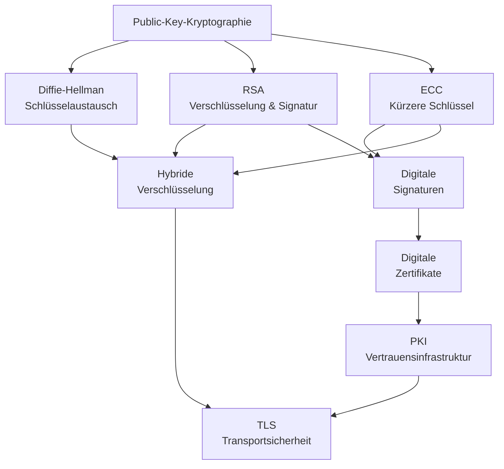

Die asymmetrische Kryptographie ist das Fundament der modernen Internetsicherheit. Ohne sie wären HTTPS, E-Mail-Verschlüsselung, digitale Signaturen und sichere Software-Updates nicht möglich. Die Algorithmen lösen das fundamentale Problem der Schlüsselverteilung – aber sie müssen richtig kombiniert und in einer vertrauenswürdigen Infrastruktur (PKI) eingebettet werden, um echte Sicherheit zu bieten.
