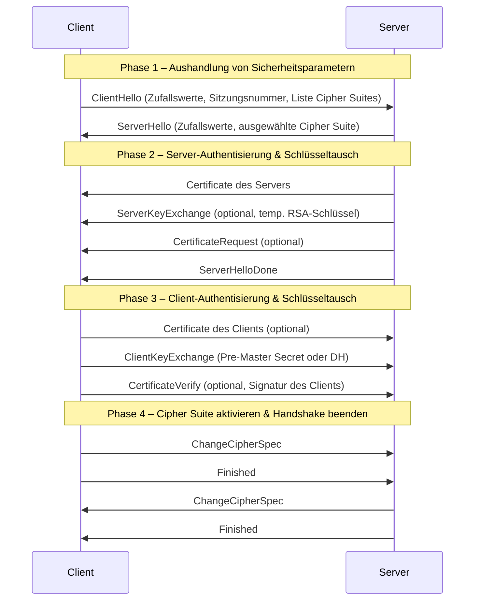
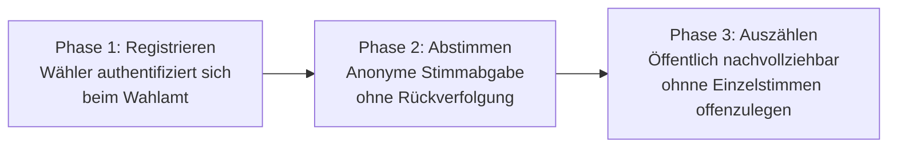
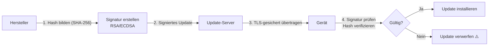
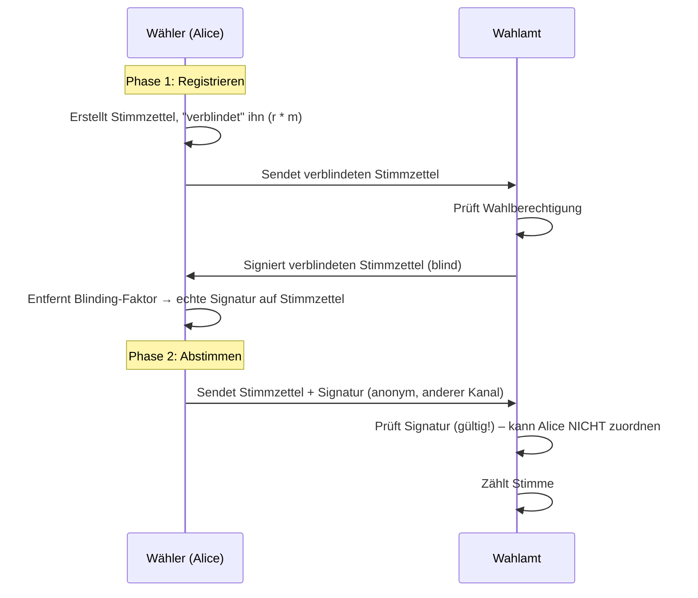
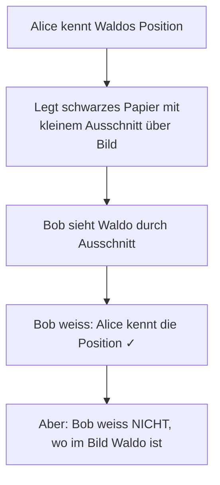
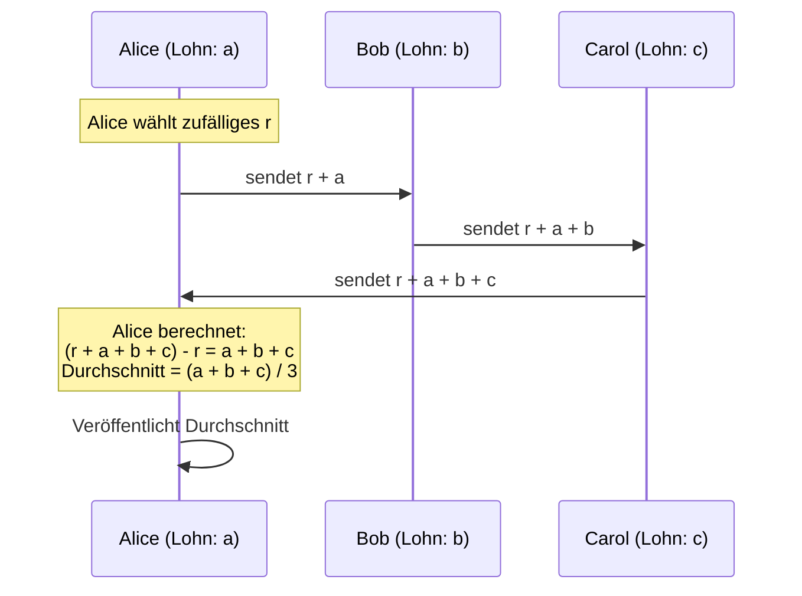
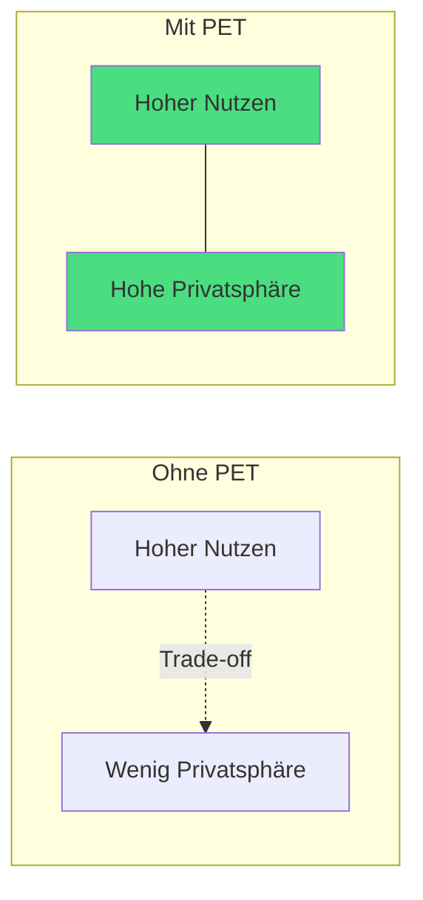

## Teil 1: Protokolle

### Algorithmus vs. Protokoll – ein wichtiger Unterschied

In der Kryptographie wird häufig zwischen **Algorithmus** und **Protokoll** unterschieden. Der Unterschied ist fundamental:

| Begriff | Definition | Beispiele |
|---|---|---|
| **Algorithmus** | Eine endliche, wohldefinierte Abfolge von Schritten, die ein bestimmtes Problem löst oder eine Aufgabe ausführt | SHA-256, AES, RSA |
| **Protokoll** | Eine Regelmenge für die Kommunikation zwischen mehreren Teilnehmern (z.B. Computern), die festlegt, welche Nachrichten in welcher Reihenfolge ausgetauscht werden und welche Algorithmen dabei angewendet werden | TLS, HTTPS |

**Analogie:** Ein Algorithmus ist wie ein Rezept (die genaue Schritt-für-Schritt-Anleitung für ein Gericht). Ein Protokoll ist wie die Regeln eines Abendessens – wer spricht wann, was wird in welcher Reihenfolge gereicht, und welche Rezepte (Algorithmen) dabei eingesetzt werden.

> Der Unterschied ist wichtig, weil selbst korrekte Algorithmen in einem fehlerhaften Protokoll unsicher sein können. Ein sicheres Protokoll kombiniert mehrere Algorithmen auf eine bestimmte Art und Weise – und diese Kombination muss ebenfalls kryptographisch sicher sein.

---

### Kryptographische Algorithmen – Übersicht

Die wichtigsten Kategorien kryptographischer Algorithmen:

| Kategorie | Typischer Algorithmus | Zweck |
|---|---|---|
| Kryptographische Hash-Funktionen | SHA-256 | Integritätsprüfung, digitale Fingerabdrücke |
| Symmetrische Verschlüsselung | AES | Schnelle Verschlüsselung grosser Datenmengen |
| Schlüsselvereinbarung | Diffie-Hellman | Sicherer Schlüsselaustausch über unsicheren Kanal |
| Asymmetrische Verschlüsselung | RSA, ECC | Verschlüsselung mit Public/Private-Key-Paar |
| Digitale Signatur | RSA, DSA | Authentizität und Nicht-Abstreitbarkeit |

---

### TLS: Das Protokoll hinter HTTPS

**TLS (Transport Layer Security)** ist das wichtigste kryptographische Protokoll im Internet. Es schützt die Verbindung zwischen Browser und Webserver. Früher hiess es SSL.

#### TLS Handshake – Phasen

Der TLS-Handshake ist der Prozess, bei dem Client und Server sich «vorstellen», Sicherheitsparameter aushandeln und einen gemeinsamen Sitzungsschlüssel etablieren:



**Warum so komplex?** Jede Phase hat einen spezifischen Zweck:
- **Phase 1:** Welche Algorithmen werden unterstützt? Beide Seiten tauschen Zufallswerte aus (verhindert Replay-Angriffe).
- **Phase 2:** Server beweist seine Identität via Zertifikat. Schlüssel werden vorbereitet.
- **Phase 3:** Optional: auch der Client beweist seine Identität (z.B. bei Unternehmens-VPNs).
- **Phase 4:** Ab jetzt läuft alles verschlüsselt mit dem ausgehandelten Schlüssel.

---

### TLS Cipher Suites

Eine **Cipher Suite** ist eine Kombination von kryptographischen Algorithmen, die für eine TLS-Verbindung verwendet werden. Client und Server müssen sich auf eine Suite einigen.

**Aufbau einer Cipher Suite:**

```
TLS_ECDHE_RSA_WITH_AES_128_GCM_SHA256
 │     │     │        │           │
 │     │     │        │           └── Hash-Funktion für HMAC: SHA-256
 │     │     │        └────────────── Verschlüsselungsalgorithmus: AES-128-GCM
 │     │     └─────────────────────── Authentifizierung: RSA
 │     └───────────────────────────── Schlüsseltausch: ECDHE (Elliptic Curve DH, Ephemeral)
 └─────────────────────────────────── Protokoll: TLS
```

**Komponenten:**

| Komponente | Mögliche Algorithmen | Zweck |
|---|---|---|
| Schlüsseltauschverfahren | RSA, DH, ECDH, PSK | Gemeinsamen Sitzungsschlüssel etablieren |
| Authentifizierung | RSA, DSA, ECDSA, PSK | Identität des Servers (und Clients) beweisen |
| Verschlüsselungsalgorithmus | RC4, DES, 3DES, AES | Nutzdaten verschlüsseln |
| Hash-Funktion für HMAC | MD5, SHA | Integrität der Nachrichten sicherstellen |

> **Warum «ECDHE» statt «ECDH»?** Das «E» steht für *Ephemeral* – der Schlüssel wird nur für diese eine Sitzung erzeugt und danach weggeworfen. Das ermöglicht **Perfect Forward Secrecy (PFS)**: Selbst wenn der private Schlüssel des Servers später kompromittiert wird, können vergangene Sitzungen nicht entschlüsselt werden.

---

### Kryptographische Anwendungen / Protokolle

Beim Analysieren von Protokollen stellt man drei Schlüsselfragen:

1. **Welche Phasen gibt es?** (z.B. Registrieren + Abstimmen beim e-Voting)
2. **Welche Algorithmen sind Teil des Protokolls?** (z.B. AES für Verschlüsselung, RSA für Signaturen)
3. **Fehlen uns noch Algorithmen?** (z.B. braucht e-Voting «Blinde Signaturen», die man erst noch verstehen muss)

---

#### E-Voting

Ein sicheres elektronisches Wahlsystem muss fünf zentrale Sicherheitsziele gleichzeitig erfüllen – was technisch sehr anspruchsvoll ist, da sich manche Ziele widersprechen:

| Ziel | Beschreibung | Warum schwierig? |
|---|---|---|
| **Authentifizierung** | Nur berechtigte Wähler dürfen abstimmen | Identifikation nötig |
| **Vertraulichkeit (Anonymität)** | Niemand darf sehen, wie jemand gewählt hat | Widerspricht der Authentifizierung |
| **Integrität** | Stimmen dürfen nicht verändert oder gelöscht werden | Manipulation muss nachweisbar verhindert sein |
| **Nachvollziehbarkeit (Verifizierbarkeit)** | Jeder kann das Ergebnis prüfen, ohne das Wahlgeheimnis zu brechen | Öffentliche Prüfung vs. Geheimhaltung |
| **Unwiederholbarkeit** | Jede Person darf nur einmal abstimmen | Technisch und rechtlich komplex |

**Das Grundproblem:** Authentifizierung und Anonymität widersprechen sich. Wenn ich weiss, dass du gewählt hast (Authentifizierung), wie kann ich dann sicherstellen, dass niemand weiss, wie du gewählt hast (Anonymität)?

Die Lösung: **Blinde Signaturen** (siehe Teil 2).

**Phasen des e-Voting:**



---

#### Biometrischer Pass (E-Pass)

Der biometrische Schweizer Pass enthält im **RFID-Chip** (kontaktlos auslesbar) folgende Informationen:
- Personendaten: Name, Geburtsdatum, Staatsangehörigkeit
- Digitales Passfoto
- Optional: Fingerabdrücke, Irisdaten
- Digitale Signatur zur Echtheitsprüfung

**Phasen:** Pass ausstellen → Pass verwenden

Zum Schutz der Daten werden verschiedene Protokolle eingesetzt:

| Protokoll | Ziel | Verfahren |
|---|---|---|
| **BAC** (Basic Access Control) | Zugriffsschutz – verhindert unbefugtes Auslesen | Symmetrische Kryptografie (3DES / AES) |
| **PA** (Passive Authentication) | Echtheit der Chipdaten überprüfen | Asymmetrische Kryptografie (RSA/ECDSA) |
| **AA** (Active Authentication) | Klonen des Chips verhindern | Asymmetrische Challenge-Response |
| **EAC** (Extended Access Control) | Schutz biometrischer Daten (Finger, Iris) | PKI + asymmetrische Sitzungsschlüssel |

> **Warum BAC?** Ohne BAC könnte jeder mit einem RFID-Lesegerät in einem Café unbemerkt Passdaten auslesen. BAC stellt sicher, dass der Pass nur ausgelesen werden kann, wenn er physisch vorgezeigt und der aufgedruckte Code (MRZ) eingelesen wurde.

---

#### e-Cash

Digitales Bargeld muss die Eigenschaften von physischem Bargeld nachbilden – inklusive Anonymität. Banknoten haben keine «Spur», e-Cash sollte das auch ermöglichen.

| Ziel | Kryptographisches Verfahren | Typischer Algorithmus |
|---|---|---|
| Anonymität & Blindung | Blind Signature Schema | RSA (mit Blindung) |
| Integrität & Echtheit der Coins | Digitale Signaturen | RSA, DSA, ECDSA |
| Fälschungsschutz (Double Spending) | Identifikationsprotokolle | Zero-Knowledge Proofs |
| Konto- oder Münzbindung | Hashfunktionen | SHA-256, SHA-3 |
| Transaktionsschutz & Authentifizierung | Symmetrische Verschlüsselung | AES-128 / AES-256 |
| Sitzungssicherheit / Schlüsselaustausch | Asymmetrische Kryptografie | Diffie-Hellman, ECDH |

> **Double Spending Problem:** Bei digitalem Geld könnte man dieselbe «Münze» (Datei) beliebig oft kopieren und zweimal ausgeben. Dieses Problem zu verhindern, ohne die Anonymität des Nutzers zu verletzen, ist eine der grössten Herausforderungen in der Kryptographie und ist auch das Kernproblem, das Bitcoin durch die Blockchain löst.

---

#### Buch auf e-Reader (DRM)

E-Books sind urheberrechtlich geschützte Inhalte. Das System muss sicherstellen, dass nur berechtigte Nutzer lesen können – ohne die Privatsphäre der Nutzer zu verletzen.

| Bereich | Algorithmus | Typ | Zweck |
|---|---|---|---|
| Datenverschlüsselung (E-Book) | AES-128/256 | Symmetrisch | Verschlüsselung des E-Books (DRM) |
| Schlüsselaustausch | RSA-2048 / ECDH (P-256) | Asymmetrisch | Sicherer Austausch des AES-Schlüssels |
| Digitale Signaturen | RSA-2048 / ECDSA-P256 | Asymmetrisch | Signieren von Inhalten oder Geräten |
| Hashfunktionen | SHA-256 | Einwegfunktion | Integritätsprüfung von Dateien |
| Zufallszahlengenerator | CTR-DRBG (AES-basiert) | – | Erzeugung kryptografischer Schlüssel |
| Kommunikationssicherheit | TLS (HTTPS) | Protokoll | Schützt Datenaustausch mit Server |
| Firmware-Verifikation | RSA / ECDSA + SHA-256 | Asymmetrisch | Nur signierte Software läuft |

---

#### Software Update

Software-Updates müssen besonders sorgfältig abgesichert werden – sie haben direkten Zugriff auf das System. Ein manipuliertes Update wäre ein katastrophaler Angriff.

| Zweck | Algorithmus | Beschreibung |
|---|---|---|
| Hashing (Integrität) | SHA-256 / SHA-384 | Prüfsumme über Firmware |
| Digitale Signatur | RSA-2048 / ECDSA-P256 | Hersteller signiert Update |
| Public-Key-Zertifikat | X.509 | Authentifiziert Hersteller |
| Transportverschlüsselung | TLS 1.2/1.3 (AES-GCM, ECDHE) | Schutz beim Download |
| Gerätebindung (optional) | HMAC-SHA256 | Update an Seriennummer gebunden |



---

## Teil 2: Blinde Signatur & Zero-Knowledge-Protokoll

### Die Blinde Signatur

Die **Blinde Signatur** ist ein kryptographisches Verfahren, bei dem jemand ein Dokument unterschreibt, **ohne dessen Inhalt zu sehen**.

**Analogie:** Man stellt ein Dokument in einen Umschlag mit Kohlepapier. Der Unterzeichner unterschreibt den Umschlag – die Unterschrift überträgt sich durch das Kohlepapier auf das Dokument, ohne dass der Unterzeichner es gelesen hat.

**Warum ist das nützlich?**
- Beim e-Voting: Das Wahlamt bestätigt, dass eine Stimme gültig ist – ohne zu wissen, welche Stimme es ist.
- Bei e-Cash: Die Bank signiert eine Münze als echt – ohne zu wissen, welche Münze es ist (Anonymität).



**Wichtige Eigenschaft:** Das Wahlamt hat den Stimmzettel signiert, kann aber die Signatur nicht mit dem spezifischen Wähler verknüpfen – Anonymität ist gewahrt.

---

### Zero-Knowledge Proof (ZK-Beweis)

Ein **Zero-Knowledge Beweis** (auch: kenntnisfreier Beweis) ist ein Protokoll, bei dem eine Partei (der **Prover**) eine andere Partei (den **Verifier**) davon überzeugt, dass sie ein Geheimnis kennt – **ohne das Geheimnis selbst preiszugeben**.

> **Entscheidende Unterscheidung:** Zero-Knowledge Beweise *überzeugen* – sie *beweisen* nicht im mathematischen Sinne. Sie geben statistische Garantien.

**Drei Eigenschaften eines ZK-Beweises:**

1. **Vollständigkeit (Completeness):** Wenn die Aussage wahr ist, kann ein ehrlicher Prover den Verifier überzeugen.
2. **Solidität (Soundness):** Ein unehrlicher Prover kann den Verifier nur mit sehr geringer Wahrscheinlichkeit täuschen.
3. **Zero-Knowledge:** Der Verifier lernt nichts ausser der Tatsache, dass die Aussage wahr ist.

---

### Beispiel 1: «Wo ist Waldo?»

**Situation:** Alice weiss, wo Waldo in einem Wimmelbild versteckt ist. Bob glaubt ihr nicht. Alice will beweisen, dass sie es weiss – ohne Bobs Bild zu spoilern.

**Lösung:** Alice schneidet ein grosses schwarzes Papier mit einem kleinen Ausschnitt zurecht und hält es über das Bild. Durch den Ausschnitt sieht man nur Waldo – aber nicht, wo er im Gesamtbild ist. Bob sieht, dass Alice Waldo gefunden hat, ohne den genauen Ort zu erfahren.



---

### Beispiel 2: Interaktiver ZK-Beweis (Farbenblindheit)

**Situation:** Bob behauptet, er kann Farben sehen. Alice ist farbenblind und glaubt ihm nicht.

**Protokoll:**
1. Alice hält je einen roten und blauen Ball in den Händen – Bob sieht sie.
2. Alice legt die Hände hinter den Rücken und tauscht die Bälle entweder oder nicht.
3. Alice zeigt die Bälle wieder. Bob sagt, ob sie getauscht wurden.

**Analyse:**
- Ohne Farbsehen: Bob rät mit 50% Wahrscheinlichkeit richtig.
- Mit Farbsehen: Bob liegt immer richtig.

**Nach 20 Runden:** Die Wahrscheinlichkeit, dass Bob ohne Farbsehen immer richtig rät, beträgt (1/2)^20 = 1/1.048.576 ≈ 0,0001%.

Alice ist mit hoher statistischer Sicherheit überzeugt. Bob hat sein Wissen bewiesen, ohne je zu erklären, wie er Farben unterscheidet.

> **Wichtige Erkenntnis:** ZK-Beweissysteme liefern nur **statistische Garantien**. Je mehr Runden, desto sicherer – aber nie 100% sicher.

---

## Teil 3: Millionärsproblem (Vertiefung)

### Sicherer Durchschnitt berechnen

Ein konkretes Beispiel für **Secure Multi-Party Computation (MPC):**

> Alice, Bob und Carol arbeiten im selben Unternehmen. Sie wollen den Durchschnittslohn berechnen – ohne dass jemand den Lohn der anderen erfährt.

**Protokoll mit zufälligem Rauschen:**

Alice wählt eine geheime Zufallszahl **r**. Dann läuft folgendes ab:



**Sicherheitsanalyse:**
- Bob kennt `r + a`, weiss aber nicht was `r` und was `a` ist – er kennt maximal 3 von 4 Unbekannten.
- Carol kennt `r + a + b` – ebenfalls nicht auflösbar ohne weiteres Wissen.
- Nur Alice kennt `r` und kann das Ergebnis berechnen.

**Schwachstellen des einfachen Protokolls:**
- **Alle müssen ehrlich sein:** Wer lügt, verfälscht das Ergebnis.
- **Keine zwei dürfen zusammenspannen:** Wenn Alice und Bob kooperieren, kennen sie `r`, `r+a` → sie können `a` berechnen und damit auch `c` aus dem Endergebnis ableiten.

**In der Praxis** werden robustere MPC-Protokolle eingesetzt, die auch bei teilweise unehrlichen Teilnehmern funktionieren.

---

### Privacy-Enhancing Technologies (PET)

Kryptographische Protokolle wie Zero-Knowledge Proofs und MPC gehören zur Kategorie der **Privacy-Enhancing Technologies (PET)**. Diese verschieben den Trade-off zwischen gesellschaftlichem Nutzen und Datenschutz:



Ohne PET: Je nützlicher ein System (z.B. zentrale Gesundheitsdatenbank), desto mehr Privatsphäre muss man aufgeben.

**PET verschiebt die Effizienzgrenze** – sie ermöglichen Systeme, die sowohl nützlich als auch datenschutzkonform sind.

**Wichtige PET-Kategorien:**

| Ansatz | Technologie | Beispiele |
|---|---|---|
| **Kryptographisch** | Fully Homomorphic Encryption (FHE) | Berechnungen auf verschlüsselten Daten |
| **Kryptographisch** | Secure Multi-Party Computation (MPC) | Gemeinsame Berechnungen ohne Datenaustausch |
| **Hardware-basiert** | Confidential Computing (CC) | Trusted Execution Environments (TEE), TPM |

> **Fully Homomorphic Encryption (FHE):** Ermöglicht es, Berechnungen direkt auf verschlüsselten Daten durchzuführen – das Ergebnis ist ebenfalls verschlüsselt und kann nur vom Besitzer des Schlüssels entschlüsselt werden. Ein Cloud-Anbieter könnte so Daten verarbeiten, ohne sie je zu sehen. Technisch noch sehr rechenintensiv, aber ein aktives Forschungsfeld.
