# ISF – SW08: Informations-Sicherheits-Management-Systeme (ISMS) & Standards

---

## 1. Was ist ein Management-System?

Ein **Management-System** ist ein systematisches, gezieltes und geplantes Vorgehen zur Umsetzung der Unternehmenspolitik und von Unternehmenszielen. Es steuert betriebliche Prozesse, initiiert eine Prozessstrukturierung und optimiert bestehende Abläufe.

Gemäss **DIN EN ISO/IEC 27000:2017-10, Kap. 3.2.5** umfasst ein Managementsystem:
- Organisationsstrukturen
- Richtlinien
- Planungstätigkeiten
- Verantwortlichkeiten
- Methoden, Verfahren, Prozesse und Ressourcen

Ein Management-System ist also kein Selbstzweck, sondern ein **Rahmenwerk**, das Ressourcen koordiniert, um die Ziele einer Organisation zu erreichen. Entscheidend ist, dass alle Elemente miteinander verbunden, aufeinander abgestimmt und zusammenhängend gestaltet sind.

### Der PDCA-Zyklus

Moderne Management-Systeme beinhalten immer einen **Rückkopplungsprozess** – den sogenannten **PDCA-Zyklus** (Plan-Do-Check-Act), auch als ständiger Verbesserungsprozess bezeichnet. Dieser sorgt dafür, dass ein System nicht statisch bleibt, sondern sich kontinuierlich weiterentwickelt und verbessert.

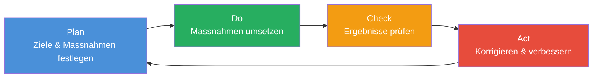

Der PDCA-Zyklus ist der Kern jedes modernen Management-Systems – egal ob ISO 9001 (Qualität), ISO 14001 (Umwelt) oder ISO 27001 (Informationssicherheit). Er verhindert, dass Sicherheitsmassnahmen einmalig eingeführt und dann vergessen werden.

---

## 2. Was ist Informationssicherheit?

Die **Kernziele der Informationssicherheit** sind:

| Ziel | Beschreibung |
|------|-------------|
| **Vertraulichkeit** | Informationen nur für Befugte zugänglich |
| **Verfügbarkeit** | Informationen und Systeme stehen bei Bedarf zur Verfügung |
| **Integrität** | Informationen sind vollständig und unverändert |

Diese drei Schutzziele werden auch als **CIA-Triade** (Confidentiality, Integrity, Availability) bezeichnet und sind in **ISO/IEC 27000:2018, Kap. 3.28** normiert.

**Nebenziele** können je nach Kontext sein: Nicht-Abstreitbarkeit, Privatsphäre, Authentizität, Anonymität.

> **Wichtige Abgrenzung:**
> - „**Informationssicherheit**" bezieht sich auf alle Informationen einer Organisation (gespeichert, verarbeitet, übertragen).
> - „**Datensicherheit**" hat meist einen Bezug zu personenbezogenen Daten, insbesondere Kundendaten.

---

## 3. Das Information Security Management System (ISMS)

Ein **ISMS** ist kein einmaliges Projekt, sondern ein lebendiger, dauerhafter Prozess. Es beschreibt das systematische Vorgehen einer Organisation zum Schutz ihrer Informationen.

### Vorgehensmodell

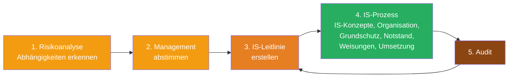

**Warum ist Management-Support unverzichtbar?**

Ohne die Unterstützung des Managements gibt es:
- **Keine Ressourcen** (Zeit und Geld)
- **Keine Kompetenzen** (Befehls- und Umsetzungsgewalt)
- **Keine Priorität**

Das Management trägt letztlich die Risiken und entscheidet über die eingesetzten Ressourcen. Ein ISMS-Verantwortlicher ohne Mandat von oben kann keine wirksamen Massnahmen durchsetzen – das ist in der Praxis einer der häufigsten Gründe für das Scheitern von ISMS-Projekten.

---

## 4. Verschiedene ISMS-Typen im Überblick

Es gibt keine „eine richtige" Lösung. Je nach Grösse, Branche und Anforderungsprofil einer Organisation eignen sich unterschiedliche Frameworks.

### 4.1 ISIS12 – Informations-Sicherheitsmanagement in 12 Schritten

ISIS12 ist ein **pragmatisches, schrittweises ISMS** für kleine und mittlere Organisationen, insbesondere kommunale Verwaltungen. Es reduziert die Komplexität auf 12 klar definierte Schritte:

1. **Leitlinie erstellen** – Sicherheitsziele und Sicherheitsniveau definieren
2. **Mitarbeiter sensibilisieren** – Einbindung aller in den IS-Prozess
3. **IS-Team aufbauen** – ISB, DSB, IT-Mitarbeiter, Anwendervertreter
4. **IT-Dokumentation erstellen** – Rahmen-, Betriebs-, Notfalldokumentation
5. **ITSM einführen** – Basisprozesse: Wartung, Änderung, Störungsbeseitigung
6. **Kritische Anwendungen identifizieren** – CIA-Bewertung, MTA, SLA
7. **IT-Struktur analysieren** – Systeme und Infrastruktur zuordnen, Schutzbedarf vererben
8. **Sicherheitsmassnahmen modellieren** – Bausteine aus ISIS12-Katalog
9. **Ist-Soll-Vergleich** – Umsetzungsprüfung, erste Reifegradmessung
10. **Umsetzung planen** – Kostenermittlung, Priorisierung
11. **Umsetzen** – Verantwortliche, Termine, Ressourcen
12. **Revision** – Revisionsplan, stetige Optimierung, evtl. Zertifizierung

> **Schutzbedarf** beschreibt, welcher Schutz für die Geschäftsprozesse, die dabei verarbeiteten Informationen und die eingesetzte IT ausreichend und angemessen ist (BSI Grundschutz Kompendium).

### 4.2 VDS 10000 – ISMS für KMU

VDS 10000 ist ein Regelwerk des VdS (Verband der Sachversicherer), einer renommierten Institution für Unternehmenssicherheit. Es definiert **Mindestanforderungen an die Informationssicherheit** für kleine und mittlere Unternehmen und deckt folgende Bereiche ab:

- Organisation der IS, IS-Leitlinie, IS-Richtlinien
- Mitarbeiter, Wissen, Prozesse, IT-Systeme
- Netzwerke, Mobile Datenträger, Umgebung
- IT-Outsourcing und Cloud Computing
- Zugänge, Datensicherung, Risikoanalyse
- Störungen, Ausfälle, Sicherheitsvorfälle

### 4.3 BSI 200-1 – ISMS nach IT-Grundschutz

Das **Bundesamt für Sicherheit in der Informationstechnik (BSI)** entwickelte mit dem Standard **BSI 200-1** ein ISMS-Framework, das sich besonders für deutsche Behörden eignet, aber auch für andere Organisationen verwendbar ist.

**Besonderheit des IT-Grundschutzes:** Der initiale Verzicht auf eine detaillierte Risikoanalyse. Es wird von **pauschalen Gefährdungen** ausgegangen und auf die differenzierte Einteilung nach Schadenshöhe und Eintrittswahrscheinlichkeit verzichtet – zumindest im Standardfall.

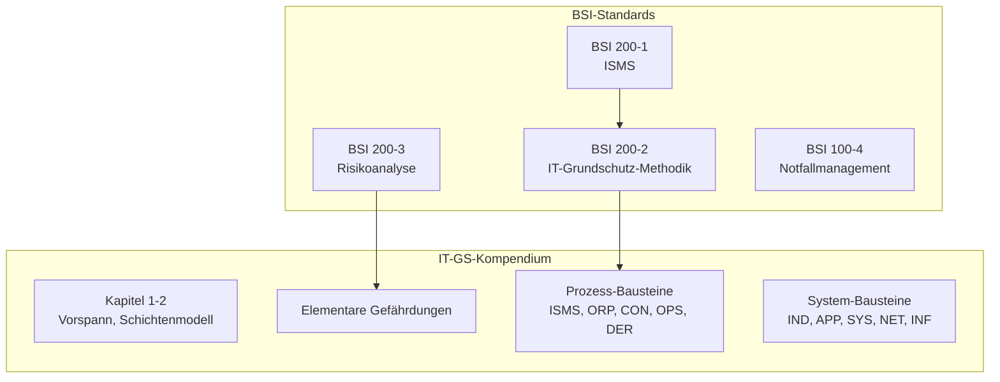

Das ISMS nach BSI 200-1 umfasst die Bereiche: Sicherheitsprozess, Ressourcen, Mitarbeiter und Managementprinzipien – visualisiert als Rad, in dessen Mitte das ISMS steht.

### 4.4 ISO/IEC 27001 – Das internationale ISMS

**ISO 27001** ist der weltweit anerkannte Standard für ISMS. Die Vorgehensweise lässt sich vereinfacht so beschreiben:

- Nur was **dokumentiert** ist, ist wirklich passiert.
- Sichere die volle **Unterstützung der Führung** (Mandat + Ressourcen).
- Erkenne dein **Umfeld** und setze IS-Ziele.
- **Identifiziere** deine Situation und bewerte sie.
- **Ändere**, wo nötig, und prüfe den Fortschritt.
- **Unterrichte** die Führung und beginne den Zyklus von vorne.

Der ISMS-Prozess nach ISO 27001 folgt dem PDCA-Prinzip:

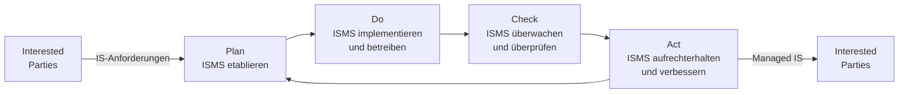

---

## 5. ISMS im Vergleich

| ISMS | Pro | Contra |
|------|-----|--------|
| **ISIS12** | Einfach, sehr konkret | Gegen Gebühr, nicht international anerkannt, skaliert nicht gut |
| **VDS 10000** | Einfach, sehr konkret | Gegen Gebühr, nicht international anerkannt, skaliert nicht gut |
| **BSI 200-1** | Umfassend, skaliert gut, frei zugänglich | ~1000 Seiten Normtexte, für Behörden „de facto" Pflicht |
| **ISO/IEC 27001** | Umfassend, skaliert gut, Zertifizierung möglich | Gegen Gebühr, erfordert ISMS-Fachwissen |

**Wahl des richtigen ISMS:** Für eine Schweizer KMU ohne internationale Geschäftsbeziehungen kann ISIS12 oder VDS 10000 ausreichen. Für international tätige Unternehmen oder solche mit hohem Sicherheitsbedarf ist ISO 27001 die richtige Wahl. Schweizer Bundesstellen orientieren sich zunehmend am IKT-Minimalstandard (siehe Abschnitt 9).

---

## 6. Standards und Normen – Grundlagen

### Was ist der Unterschied zwischen Norm, Standard und Framework?

| Begriff | Beschreibung |
|---------|-------------|
| **Norm** | Formal verabschiedetes Regelwerk (z.B. durch ISO, DIN, BSI) |
| **Standard** | Als „Best Practice" akzeptierte, spezifische Vorgabe |
| **Framework** | Allgemeiner Rahmen mit Praktiken, die allgemein angewendet werden; weniger spezifisch |

Normen stehen in der Hierarchie unterhalb von Gesetzen und Verordnungen, aber oberhalb von blossen Empfehlungen. Wichtig: Normen sind **freiwillig**, können aber **rechtlich bindend** werden, wenn sie Vertragsbestandteil sind (Kauf- und Werkvertragsrecht) oder als Massstab für „Best Practices" z.B. bei Produkthaftung gelten.

**Kritik an Normen:**
- Oft von Einzelinteressen geprägt
- Qualitative Schwankungen
- Viele Normen sind nicht frei zugänglich

### Policy-Hierarchie in der Praxis

Im englischsprachigen Raum wird zwischen verschiedenen Dokumenttypen unterschieden, die im Deutschen oft verwechselt werden:

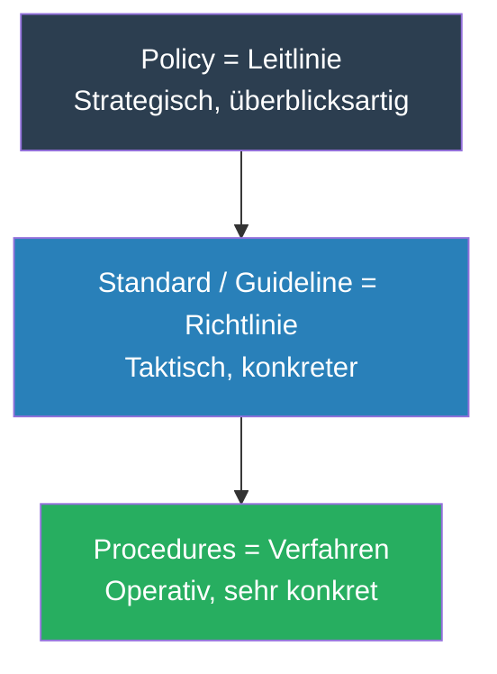

---

## 7. ISO – Die internationale Normungsorganisation

Die **International Organization for Standardization (ISO)** ist die weltweit wichtigste Normungsorganisation:

- Gegründet **1947**, Sitz in **Genf**
- **167 Länder** sind Mitglied (Schweiz ist Gründungsmitglied)
- Drei Typen von Standards:
  - **Technische Standards** (z.B. MP3-Format)
  - **Klassifikatorische Standards** (z.B. Ländercodes DE, NL, JP)
  - **Verfahrensstandards** (z.B. Qualitätsmanagement ISO 9000)

### ISO-Normungsprozess

Ein ISO-Standard durchläuft folgende Phasen, bevor er veröffentlicht wird:

| Stufe | Name | Akronym |
|-------|------|---------|
| 00 | Vorläufiges Projekt | PWI |
| 10 | Normenantrag | NWIP |
| 20 | Arbeitspapier | WD |
| 30 | Komiteeentwurf | CD |
| 40 | Entwurf | DIS |
| 50 | Schlussentwurf | FDIS |
| 60 | Internationale Norm | IS |
| 90 | Überprüfung | Review |
| 95 | Rückzug | Withdrawal |

**Warum ist dieser Prozess wichtig?** Der lange Entwicklungsprozess erklärt, warum ISO-Normen selten sind und viel Konsens erfordern. Er gibt aber auch Sicherheit: Eine veröffentlichte Norm hat breite internationale Akzeptanz.

### IEC und gemeinsame Normen

Die **International Electrotechnical Commission (IEC)** normiert im Bereich Elektrotechnik und Elektronik. Wird eine Norm gemeinsam von ISO und IEC entwickelt, erhält sie den Doppelnamen **ISO/IEC** (z.B. ISO/IEC 27001). In Deutschland wird diese dann als **DIN EN ISO/IEC** bezeichnet – „Deutsche Norm auf Grundlage einer Europäischen Norm, die auf einer Internationalen Norm der ISO/IEC beruht."

---

## 8. Die ISO 27000-Familie

Die ISO 27000-Reihe ist eine umfangreiche Familie von Standards speziell für Informationssicherheit. An ihrer Spitze steht **ISO/IEC 27000** als Begriffsdefinitionsstandard.

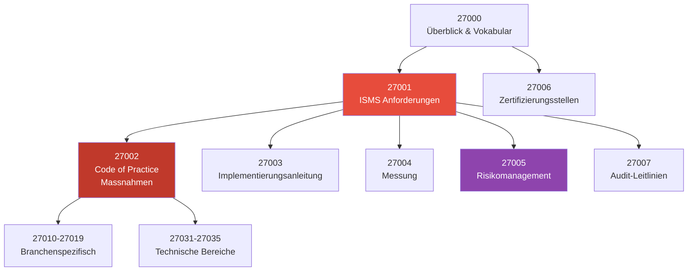

### ISO/IEC 27001 – ISMS Anforderungen

- Entwickelt aus dem britischen Standard **BS 7799-2:2002**, als ISO-Norm **2005** veröffentlicht, aktuelle Version **2022**
- Definiert Einführung, Betrieb, Überwachung, Wartung und Verbesserung eines dokumentierten ISMS
- Folgt dem PDCA-Prozessansatz
- **Scope** und **Statement of Applicability (SoA)** definieren den Umfang der Zertifizierung
- Eine Firma kann sich nach ISO 27001 **zertifizieren** lassen

### ISO/IEC 27002 – Code of Practice

- Standardwerk zur Informationssicherheit (oft kurz „CoP")
- Definiert **93 Steuerungsmassnahmen** (Controls) in **4 Domänen**
- Zu jeder Massnahme gibt es Umsetzungsanleitungen (mit wenig Detailgrad)
- **Keine Zertifizierung möglich** (nur „sollte"-Formulierungen, keine harten Anforderungen)
- Sehr gut zur Umsetzung eines **Grundschutzes** geeignet

**Struktur einer Control in ISO 27002 (Beispiel):**

```
Domäne: Technological Controls (Kap. 8)
  Massnahme 8.1: User Endpoint Devices
    Control: Information on user endpoint devices should be protected.
    Purpose: To protect information against risks from user endpoint devices.
    Guidance: The organization should establish a topic-specific policy...
```

### ISO/IEC 27005 – Risikomanagement

- Anleitung für Information Security Risk Management **ohne** Vorgabe einer bestimmten Methode
- Beliebige Risikomanagement-Methoden anwendbar
- Basiert auf ISO 27001 und 27002
- Spezifiziert den gesamten Risikomanagementprozess von der Analyse bis zum Behandlungsplan

### ISO/IEC 27035 – Incident Management

Leitfaden für die Umsetzung eines Managementsystems zur Erkennung und Behandlung von Sicherheitsvorfällen, umfasst:
- Erkennung, Reporting und Bewertung von IS-Vorfällen
- Behandlung und Bearbeitung von Vorfällen
- Kontinuierliche Verbesserung

---

## 9. BSI-Standards und IT-Grundschutz-Kompendium

Das **Bundesamt für Sicherheit in der Informationstechnik (BSI)** ist die nationale Behörde für IT-Sicherheit in Deutschland (gegründet 1991, Sitz Bonn, >600 Mitarbeiter).

### Die BSI-Standardreihe

| Standard | Inhalt |
|----------|--------|
| **BSI 200-1** | Managementsysteme für Informationssicherheit (ISMS) |
| **BSI 200-2** | IT-Grundschutz-Methodik (Vorgehensweise) |
| **BSI 200-3** | Risikoanalyse auf Basis von IT-Grundschutz |
| **BSI 100-4** | Notfallmanagement (entspricht ISO 27031 Business Continuity) |

### Das IT-Grundschutz-Kompendium

Das Kompendium enthält konkrete **Bausteine, Gefährdungen und Umsetzungshinweise** (keine vorgegebenen Massnahmen mehr):
- 8 Domänen, über 80 Bausteine
- **816 Seiten** (statt früher über 4000)

**Prozessbausteine:** ISMS, ORP (Organisation & Personal), CON (Konzepte), OPS (Betrieb), DER (Detektion & Reaktion)

**Systembausteine:** IND (Industrielle IT), APP (Anwendungen), SYS (IT-Systeme), NET (Netze), INF (Infrastruktur)

### Die drei Absicherungsvarianten

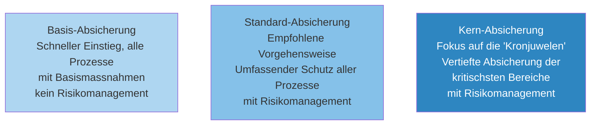

### Vergleich ISO 27001 vs. IT-Grundschutz

Der IT-Grundschutz ist **konkreter** als ISO 27001: Wo ISO 27001 im Anhang A sagt „Sicherheitsbereiche müssen durch angemessene Zugangskontrollen geschützt werden", listet der Grundschutz-Baustein INF.1 (Allgemeines Gebäude) über 7 konkrete Anforderungen auf – mit MUSS, SOLL und KANN Formulierungen.

**Verhältnis der Anforderungen (Beispiel Datensicherung):**
- **ISO 27001**: 1 Anforderung (A.12.3.1)
- **IT-Grundschutz CON.3**: 13 Anforderungen (ganzer Baustein)

Die IT-Grundschutz-Anforderungen entsprechen aber weitgehend den Umsetzungshinweisen der ISO 27002.

---

## 10. NIST Cybersecurity Framework (NIST-CSF)

### Was ist NIST?

Das **National Institute of Standards and Technology (NIST)** ist ein US-amerikanisches physikalisches Wissenschaftslabor und eine Bundesbehörde. Ursprünglich für Gewichte und Masse zuständig, entwickelt es heute Standards und technische Empfehlungen zur Förderung von Innovation und industrieller Wettbewerbsfähigkeit.

### Entstehung des NIST-CSF

2013 unterzeichnete Präsident Obama **Executive Order #13636** „Improving Critical Infrastructure Cybersecurity". NIST wurde beauftragt, ein Framework zum Schutz kritischer Infrastrukturen zu entwickeln – gemeinsam mit Regierungsbehörden und der Privatindustrie.

- **2014:** CSF v1.0 veröffentlicht
- **2023:** CSF v2.0 – mit neuer Funktion „Govern"

### Die drei Komponenten des NIST-CSF

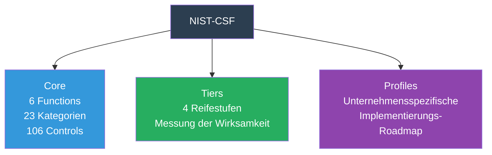

### Die sechs Functions des NIST-CSF v2.0

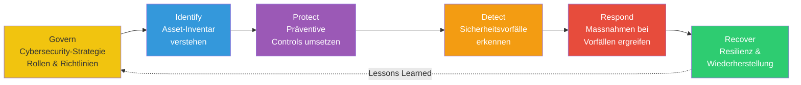

**Govern** ist neu in Version 2.0 und unterstreicht die Bedeutung von Governance: Cybersicherheit muss als strategisches Thema auf Führungsebene verankert sein.

### NIST-CSF Tiers (Reifestufen)

Die vier Tiers messen, wie gut eine Organisation das Framework umsetzt:

| Tier | Bezeichnung | Charakteristik |
|------|-------------|----------------|
| 1 | Partial | Unsystematisch, reaktiv |
| 2 | Risk Informed | Risikobewusstsein vorhanden, aber nicht formal |
| 3 | Repeatable | Formale Prozesse, regelmässige Überprüfung |
| 4 | Adaptive | Kontinuierliche Verbesserung, proaktiv |

Organisationen sollten die **gewünschte Stufe** realistisch festlegen und sicherstellen, dass das Cybersicherheitsrisiko auf ein akzeptables Niveau reduziert wird.

### NIST-CSF Profiles

Profile richten die Core-Funktionen an den **Geschäftsanforderungen, der Risikotoleranz und den Ressourcen** der Organisation aus. Sie ermöglichen:
1. Aktuellen Status aufzunehmen (Ist-Profil)
2. Idealen Reifezustand zu identifizieren (Soll-Profil)
3. Eine Roadmap zur Zielerreichung zu entwickeln

Es gibt branchenspezifische Profile (z.B. für Elektrofahrzeug-Ladeinfrastruktur, Wahlen, Smart Grid etc.).

---

## 11. Weitere relevante Standards

### ITIL (Information Technology Infrastructure Library)
Framework für **Organisation und Prozesse des IT Service Managements**. Fokus auf die Bereitstellung von IT-Services, nicht primär auf Sicherheit.

### CoBIT (Control Objects for Information and Related Technology)
**GRC-Framework** (Governance, Risk and Compliance) von ISACA. Anspruch: Bindeglied zwischen unternehmensweiten Steuerungs-Frameworks und IT-spezifischen Modellen (ITIL, ISO 27001 etc.).

### PCI DSS (Payment Card Industry Data Security Standard)
Branchenstandard zur Sicherung von **Karteninhaberdaten** bei Zahlungskartentransaktionen. Umfasst 12 Hauptanforderungen in 6 Kategorien.

### FIPS (Federal Information Processing Standards)
Öffentlich bekanntgegebene US-Standards. Wichtig: **FIPS 140** für Kryptographiemodule mit 4 Sicherheitsstufen:
- Level 1: Bestätigter Algorithmus
- Level 2: Tamper-Detection
- Level 3: Schutz kritischer Sicherheitsparameter
- Level 4: Für physisch ungeschützte Umgebungen

### Common Criteria (CC / ISO/IEC 15408)
Internationaler Standard zur **Prüfung und Bewertung der Sicherheitseigenschaften von IT-Produkten**. Ermöglicht die Zertifizierung von Hardware und Software auf definierten Evaluationsstufen (EAL 1-7).

---

## 12. IKT-Minimalstandard (Schweiz)

Der **IKT-Minimalstandard** ist das Schweizer Pendant zum NIST-CSF, entwickelt vom Bundesamt für wirtschaftliche Landesversorgung (BWL).

### Ziel und Zweck

Der Standard gilt für **Betreiber kritischer Infrastrukturen** in der Schweiz (Energie, Wasser, Kommunikation, Finanzen etc.). Die grundsätzliche Verantwortung liegt bei den Unternehmen selbst, aber wo das Funktionieren kritischer Infrastrukturen betroffen ist, besteht eine **staatliche Verantwortung** basierend auf der Bundesverfassung und dem Landesversorgungsgesetz.

### Aufbau

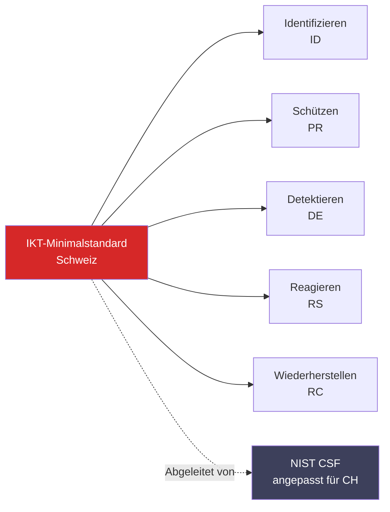

- Vom **NIST-CSF** abgeleitet und auf die Schweiz angepasst
- **106 Massnahmen** total (gleiche Anzahl wie NIST-CSF v2.0)
- Referenziert COBIT 5, ISA 62443, ISO 27001:2022 und NIST SP 800-53
- Kostenlos als **Excel-Assessment-Tool** verfügbar

Das Assessment-Tool ermöglicht eine Selbstbewertung des aktuellen Reifegrades (Present State) und die Definition eines Zielzustands (Target State) – visualisiert als Spinnendiagramm über die fünf Funktionsbereiche.

---

## 13. Managementsystem-Overkill?

Eine häufig gestellte Frage: Wie verhält sich ISO 27001 zu ISO 9000, 14001, 20000 etc.? Gibt es Überschneidungen?

**Antwort: Ja, und das ist gewollt.** Die ISO-Normen sind nach dem **High Level Structure (HLS)**-Prinzip aufgebaut, d.h. sie teilen eine gemeinsame Kapitelstruktur (Kapitel 4-10). Das erleichtert die **integrierte Einführung** mehrerer Management-Systeme erheblich.

| ISO-Norm | Bereich |
|---------|---------|
| ISO 9000 | Qualitäts-Management-System |
| ISO 14001 | Umwelt-Management-System |
| ISO 20000 | IT-Service-Management-System |
| ISO 27001 | Informationssicherheits-Management-System |
| ISO 31000 | Risiko-Management |
| ISO 27005 | IS-Risiko-Management (spezifischer als 31000) |

Für die Risikoanalyse im IS-Kontext gilt: ISO 27005 > ISO 31000, weil sie IS-spezifisch ist. In der Praxis implementieren viele grössere Organisationen ein **integriertes Management-System**, das mehrere ISO-Normen gleichzeitig erfüllt.

---

## Zusammenfassung

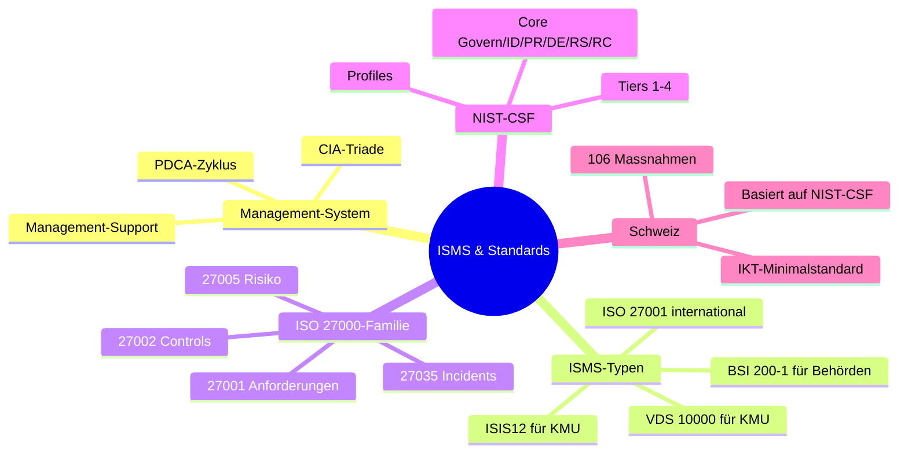

**Die wichtigste Erkenntnis:** Ein ISMS ist kein einmaliges Projekt, sondern ein **dauerhafter Prozess**. Die Wahl des richtigen Frameworks hängt von Grösse, Branche, internationalem Auftreten und regulatorischen Anforderungen ab. Entscheidend für den Erfolg ist immer: **Management-Support, Dokumentation und der kontinuierliche Verbesserungsprozess.**
