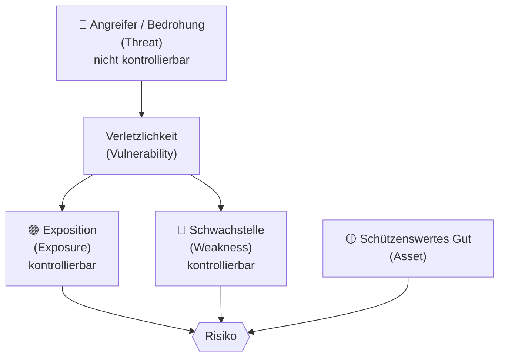
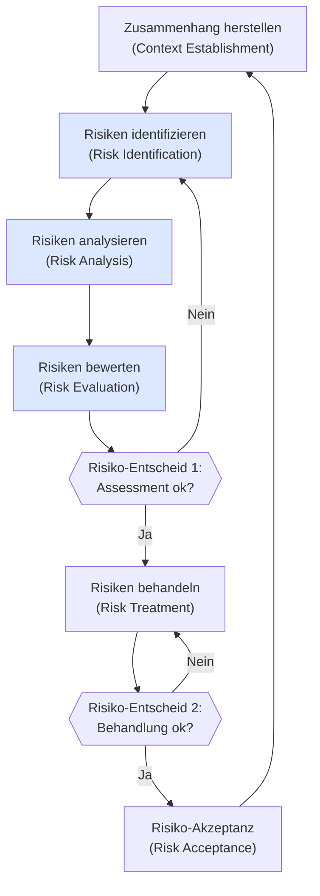
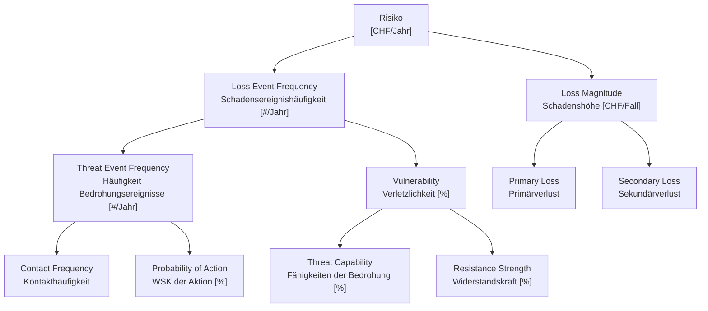
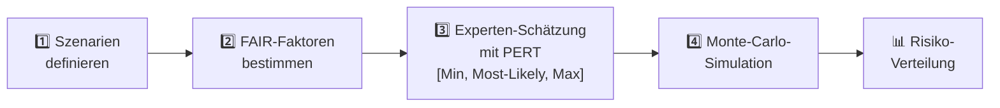
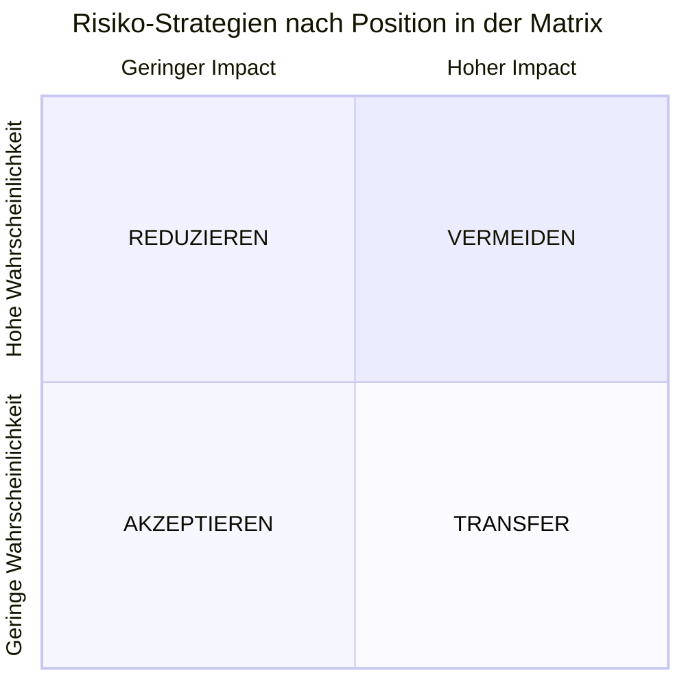
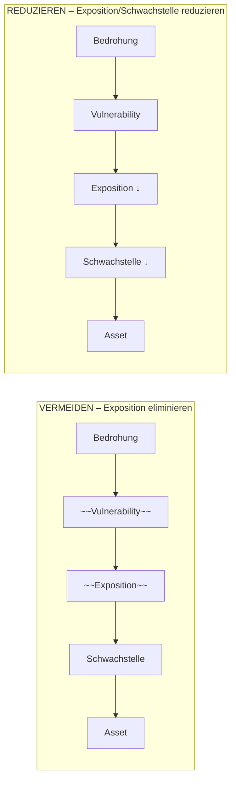
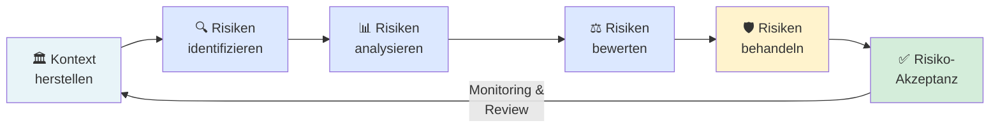

## Lernziele

Nach dieser Einheit kannst du:
- die Begriffe **Risiko**, **Bedrohung**, **Schwachstelle** und **Exposition** im Cyberraum korrekt anwenden und voneinander abgrenzen
- das Vorgehen zur **Identifikation und Bewertung** von Risiken systematisch anwenden
- Risiken **quantitativ berechnen** (z. B. mit dem FAIR-Modell)
- passende **Strategien zur Risikominimierung** auswählen und begründen

---

## 1. Risiko – Kontext und Wissensdimensionen

Bevor man Risiken managen kann, muss man verstehen, *was* man überhaupt weiss – und was nicht. Das folgende 2×2-Schema (bekannt aus dem Rumsfeld-Zitat) hilft dabei:

|                | **Wissen**                                                                 | **Unwissen**                                                                 |
|----------------|----------------------------------------------------------------------------|------------------------------------------------------------------------------|
| **Bekannt**    | Ursache-Wirkung bekannt, Täglicher Umgang → **Risiko-Management**          | Bekannte Wissenslücke, Dunkelziffer → Wird durch Forschung kleiner           |
| **Unbekannt**  | Für grosse Anzahl relativ genau, für Einzelfälle ungenau → **Wissensvermittlung** | Mit wissenschaftlichen Methoden nicht fassbar → **Resilienz, Agilität** |

> *"There are known knowns … there are known unknowns … but there are also unknown unknowns – there are things we do not know we don't know."* – Donald Rumsfeld

**Warum ist das wichtig?** Risiko-Management als Disziplin funktioniert nur im Bereich des **bekannten Wissens**: Wir kennen die Ursache-Wirkung-Beziehungen und können daraus Massnahmen ableiten. Für das Feld der *unknown unknowns* – also die schwarzen Schwäne (Nassim Taleb) – braucht es stattdessen **Resilienz und Agilität**, also die Fähigkeit, mit überraschenden Ereignissen umzugehen, ohne sie vorher vollständig antizipiert zu haben.

---

## 2. Risiko-Management vs. Resilienz

Oft werden Risiko-Management und Resilienz verwechselt oder gleichgesetzt. Sie sind aber komplementär, nicht identisch:

| Dimension            | **Risiko-Management**                                          | **Resilienz**                                                   |
|----------------------|----------------------------------------------------------------|------------------------------------------------------------------|
| **Ziel**             | Kurzfristig Verluste vermeiden                                 | Langfristiges Überleben sicherstellen                           |
| **Ansatz**           | Management-Ansatz zu bestehendem System, jährlicher Audit-Zyklus | Kontinuierlich, evolutionär, systemischer Ansatz              |
| **Massnahmen**       | Reaktiv, delegiert                                             | Antizipieren und Zukunft gestalten                              |
| **Fokus**            | Schadensbegrenzung bekannter Risiken                          | Vorbereitung auf jeden unbekannten Unterbruch, anpassen und lernen |
| **Verantwortlichkeit** | Zugeteilte Risiko-Manager mit dedizierten Risk-Ownern        | In die Organisation eingebettet, Teil der Kultur               |

**Fazit:** Risiko-Management ist ein strukturiertes, periodisches Verfahren für bekannte Risiken. Resilienz ist eine organisationale Eigenschaft, die auch mit dem Unbekannten umgehen kann. Beide Ansätze ergänzen sich.

---

## 3. Kernbegriffe: Bedrohung, Schwachstelle, Exposition, Asset, Risiko

Bevor man Risiken identifizieren kann, müssen die Begriffe klar sein:

| Begriff | Bedeutung | Kontrollierbarkeit |
|---|---|---|
| **Bedrohung / Threat** | Ein Angreifer oder ein Ereignis, das Schaden anrichten kann (z. B. ein neuer Exploit gegen Windows 10) | ❌ Nicht kontrollierbar |
| **Verletzlichkeit / Vulnerability** | Laut NIST: „A weakness in an information system, system security procedures, internal controls or implementation that could be exploited by a threat source." | Bedingt |
| **Exposition / Exposure** | Das Ausmass, in dem ein Asset einer Bedrohung ausgesetzt ist (z. B. W10-Rechner sind überall in der Firma) | ✅ Kontrollierbar |
| **Schwachstelle / Weakness** | Eine konkrete Schwäche, die ausgenutzt werden kann (z. B. W10-Rechner nicht gepatcht) | ✅ Kontrollierbar |
| **Asset** | Das schützenswerte Gut – Daten, IT-Systeme, Einrichtungen, Mitarbeiter | – |
| **Risiko** | Entsteht, wenn Bedrohung, Exposition und Schwachstelle gleichzeitig vorhanden sind | Teilweise |

**Das Venn-Diagramm des Risikos:** Risiko existiert genau dort, wo sich Bedrohung, Schwachstelle *und* Exposition überschneiden. Fehlt eine der drei Komponenten, ist das Risiko erheblich geringer oder gar nicht vorhanden. Das zeigt auch: Exposition und Schwachstelle sind die steuerbaren Hebel.

---

## 4. Cybersecurity Risiko-Management: Das Gesamtbild

Im Cybersecurity-Kontext kommen weitere Elemente hinzu:

- **CIA-Triade**: Assets haben Schutzziele bezüglich **Confidentiality (C)**, **Integrity (I)** und **Availability (A)**
- **Controls / Massnahmen**: Technische und organisatorische Gegenmassnahmen (z. B. Firewall, ISMS, NIST-Controls)
- **Leitlinie / Policy**: Übergeordnete Richtlinien, die den Rahmen für alle Massnahmen setzen

Alle diese Elemente kosten Ressourcen (CHF), weshalb Risiko-Management immer auch eine wirtschaftliche Abwägung ist.

---

## 5. Der Risiko-Management-Prozess (ISO 27005 / ISO 31000)

Risiko-Management ist kein einmaliges Projekt, sondern ein **zyklischer, iterativer Prozess**. Der internationale Standard ISO/IEC 27005:2022 definiert ihn für die Informationssicherheit:

Flankiert wird dieser Prozess durchgehend von:
- **Kommunikation und Consulting** (links): Alle Stakeholder müssen informiert und einbezogen werden
- **Monitoring und Review** (rechts): Risiken und Massnahmen werden laufend überwacht

**Warum iterativ?** Eine auf die Firma zugeschnittene Lösung braucht mehrere Durchläufe und muss aktuell gehalten werden – sowohl wegen interner Veränderungen (Geschäftsgang ändert sich) als auch externer (neue Bedrohungen entstehen laufend).

---

## 6. Schritt 1: Risiken identifizieren

Der erste Schritt ist die Identifikation aller relevanten **Assets** und **Bedrohungen/Angreifer**.

### 6.1 Asset-Kategorien

Assets lassen sich in vier Hauptkategorien einteilen:

| Kategorie | Beispiele |
|---|---|
| **Daten** | Kundendaten, Geschäftsgeheimnisse, Passwörter, Backups |
| **IT-Systeme** | Server, Laptops, Netzwerkgeräte, Cloud-Dienste |
| **Einrichtungen** | Rechenzentren, Bürogebäude, Produktionsanlagen |
| **Mitarbeiter** | Know-how, Zugriffsrechte, Schlüsselpersonen |

### 6.2 Angreifer-Kategorien

Angreifer unterscheiden sich stark in Motivation, Ressourcen und Vorgehen:

| Angreifer | Motivation | Ressourcen | Vorgehen | Gegenmassnahme |
|---|---|---|---|---|
| **Staatliche Organisationen** | Spionage, Sabotage, geopolitische Ziele | Sehr hoch (nation-state level) | APT (Advanced Persistent Threat), Supply-Chain-Angriffe | Defense-in-depth, Threat Intelligence |
| **Terroristen** | Destabilisierung, Propaganda | Mittel | Gezielte Angriffe auf kritische Infrastruktur | Kooperation mit Behörden, Redundanz |
| **Organisierte Kriminalität** | Finanzieller Gewinn | Hoch | Ransomware, Phishing, BEC | MFA, Backups, Security Awareness |
| **Hacker/Cracker** | Ruhm, Ideologie, Neugier | Mittel | Exploitation bekannter Schwachstellen | Patch-Management, Vulnerability Scanning |
| **Script Kiddies** | Neugier, Spass | Gering | Automatisierte Tools, bekannte Exploits | Grundlegende Härtung, Firewalls |

Die Unterscheidung zwischen **zufälligen** (opportunistischen) und **zielgerichteten** Angriffen ist wichtig: Zufällige Angriffe (Script Kiddies, automatisierte Scans) lassen sich durch grundlegende Härtung abwehren. Zielgerichtete Angriffe (staatliche Akteure, organisierte Kriminalität) erfordern tiefgreifendere Massnahmen.

---

## 7. Schritt 2: Risiken analysieren

### 7.1 Quantitative vs. qualitative Analyse

| | **Quantitative Analyse** | **Qualitative Analyse** |
|---|---|---|
| **Ansatz** | Numerisch exakte Berechnung aller Grössen | Einschätzung anhand mehrstufiger Skalen |
| **Voraussetzung** | Monetärer Wert der Assets muss bekannt sein; Eintrittswahrscheinlichkeit muss berechnet werden können | Experten schätzen Schadensausmass und Wahrscheinlichkeit ein |
| **Vorteil** | Präzise, vergleichbar, direkt entscheidungsrelevant | Schnell, wenig Daten nötig, gut kommunizierbar |
| **Nachteil** | Aufwändig, Datenbasis oft unsicher; für neue Bedrohungen kaum Erfahrungswerte | Subjektiv, schwer reproduzierbar, Tendenz zu „alles gelb" |

**Grundformel (formal):**

$$\text{Risiko} = \text{Eintrittshäufigkeit} \times \text{Schadensausmass}$$

- **Eintrittshäufigkeit**: [#/Jahr]
- **Schadensausmass**: [CHF], Wert der exponierten Assets
- **Risiko**: [CHF/Jahr]

### 7.2 Das FAIR-Modell (Factor Analysis of Information Risk)

FAIR ist das führende quantitative Rahmenwerk für Cyber-Risiken. Es zerlegt das Risiko in messbare Einzelfaktoren:

**Erklärung der Schlüsselgrössen:**

- **Threat Event Frequency (TEF)** = Kontakthäufigkeit × Wahrscheinlichkeit der Aktion – Wie oft versucht ein Angreifer überhaupt, das Ziel anzugreifen?
- **Vulnerability** = Threat Capability / Resistance Strength – Wie gross ist die Wahrscheinlichkeit, dass ein Angriffsversuch auch gelingt?
- **Loss Event Frequency (LEF)** = TEF × Vulnerability – Wie oft pro Jahr tritt tatsächlich ein Schadensfall ein?
- **Primary Loss**: Direkte Schäden (Datenverlust, Betriebsunterbruch, Cyber-Erpressung, …)
- **Secondary Loss**: Indirekte Schäden (Reputationsschaden, Regulatorische Strafen, Medien-Haftung, …)

**Praxisbeispiel – Threat Event Frequency:**

| | Verlust eines Laptops | Bösartiger Insider |
|---|---|---|
| Jährliches Vorkommen [#/Jahr] | 10 | 0.1 |
| Vulnerability (WSK Incident) [%] | 1% | 25% |
| Loss Event Frequency [#/Jahr] | **0.1** | **0.025** |

Obwohl Laptops viel häufiger verloren gehen, ist die Vulnerability gering (Festplattenverschlüsselung, Passwortschutz). Der Insider tritt seltener auf, hat aber eine viel höhere Erfolgswahrscheinlichkeit.

### 7.3 Wie kommt man zu einem guten Risikowert?

Der FAIR-Prozess läuft in vier Schritten:

**PERT** (Program Evaluation and Review Technique): Experten schätzen für jeden Faktor einen Minimal-, Wahrscheinlichkeitswert und Maximalwert. Dadurch wird die Unsicherheit explizit modelliert.

**Monte-Carlo-Simulation**: Aus den PERT-Verteilungen werden tausende zufällige Szenarien berechnet. Das Ergebnis ist keine einzelne Zahl, sondern eine **Risiko-Verteilung** – z. B. „Mit 90% Wahrscheinlichkeit liegt das jährliche Risiko unter CHF 550'000". Das ist weit aussagekräftiger als ein einzelner Punktwert.

**Swisscom-Fallbeispiel:** Swisscom hat FAIR eingesetzt, um das Risiko eines Datenlecks auf dem Customer Portal zu quantifizieren. Ergebnis: Most-Likely CHF 195'081 pro Ereignis, Maximum CHF 904'734. Eine IT-Investition von CHF 120'000 reduzierte das durchschnittliche Risiko um CHF 480'000 – ein klarer Business Case.

### 7.4 Qualitative Risikoanalyse

Wenn keine genauen Daten verfügbar sind, arbeitet man mit Skalen:

**Schadensausmass (5-stufig):**

| Stufe | Bezeichnung | Beschreibung |
|---|---|---|
| 1 | Vernachlässigbar / Insignificant | Im normalen Betrieb leicht handhabbar, keine Zusatzkosten |
| 2 | Marginal / Minor | Geringe Störung, minimale Kosten |
| 3 | Mittel / Moderate | Sofortige Ressourcen-Umverteilung nötig, moderate Kosten |
| 4 | Kritisch / Major | Schwere Betriebsstörung, Risiko von Teilausfällen |
| 5 | Katastrophal / Critical | Existenzbedrohung des Unternehmens |

**Eintrittshäufigkeit (5-stufig):**

| Stufe | Bezeichnung | Wahrscheinlichkeit |
|---|---|---|
| 1 | Sehr selten / Remote | WSK < 10% |
| 2 | Selten / Unlikely | 10% ≤ WSK < 35% |
| 3 | Möglich / Possible | 36% ≤ WSK < 64% |
| 4 | Oft / Likely | 65% ≤ WSK < 90% |
| 5 | Sehr oft / Certain | WSK > 90% |

**Risikomatrix (Heat Map):**

Die Kombination aus Schadensausmass (x-Achse) und Eintrittshäufigkeit (y-Achse) ergibt die Risikokategorie:

|  | Insignificant | Minor | Moderate | Major | Critical |
|---|---|---|---|---|---|
| **Certain** | Low-Med | Medium | Med-Hi | **High** | **High** |
| **Likely** | Low | Low-Med | Medium | Med-Hi | **High** |
| **Possible** | Low | Low-Med | Medium | Med-Hi | Med-Hi |
| **Unlikely** | Low | Low-Med | Low-Med | Medium | Med-Hi |
| **Remote** | Low | Low | Low-Med | Medium | Medium |

**Vorteile der qualitativen Analyse:**
- Übersichtlich, schnell durchführbar
- Gut für erste Einschätzungen und Kommunikation mit dem Management
- Geringer Datenbedarf
- Hilft bei der Priorisierung von Massnahmen

**Nachteile:**
- Tendenz zu „Alles Gelb" (mittleres Risiko für alles)
- Tendenz zu Best-Practices statt kritischem Denken
- Ergebnisse stark abhängig von Erfahrung der Bewerter
- Keine quantitativen Aussagen, schwer reproduzierbar

**Kritik an der klassischen Risikoanalyse:** Die konventionelle Risikoanalyse gilt als kostspielig und wenig effektiv, weil sie mit Gefährdungen und Attacken zu tun hat, die zum Zeitpunkt der Analyse noch gar nicht existieren. Ausserdem ist der Aufwand durch die individuelle Betrachtung einzelner Assets sehr hoch.

---

## 8. Schritt 3: Risiken bewerten (Risiko-Evaluation)

Die Bewertung entscheidet, welche Risiken akzeptabel sind und welche behandelt werden müssen. Dazu dienen:

### 8.1 Schutzziel und Akzeptanzlinie

**Definition Schutzziel:** Das Schutzziel beschreibt den angestrebten Sicherheitszustand und definiert die Grenze zwischen akzeptierbaren und nicht akzeptierbaren Risiken.

In der Risikomatrix wird diese Grenze als **Akzeptanzlinie** eingezeichnet. Risiken rechts/oberhalb dieser Linie müssen behandelt werden, Risiken links/unterhalb können (vorläufig) akzeptiert werden.

### 8.2 Risiko-Portfolio und Risk-Map

- **Risiko-Portfolio**: Die Gesamtheit aller im Rahmen einer Risikoanalyse identifizierten Risiken, oft pro Geschäftsfeld
- **Risiko-Landkarte / Risk-Map**: Alle Einzelrisiken des Portfolios werden in einer Risikomatrix eingezeichnet – so entsteht ein visuelles Gesamtbild der Risikolandschaft

Das Risiko-Portfolio enthält typischerweise für jedes Risiko:
- Titel und Beschreibung
- Verantwortlicher (Risk-Owner)
- Kategorie
- Indikatoren für das Eintreten (Warnsignale)
- Wahrscheinlichkeit und Impact (Brutto-Risiko)
- Präventive und korrektive Massnahmen
- Restrisiko nach Massnahmen

---

## 9. Schritt 4: Risiken behandeln – Strategien

Nach dem Assessment stehen vier grundlegende Strategien zur Verfügung:

| Strategie | Beschreibung | Beispiele |
|---|---|---|
| **VERMEIDEN** | Risiken eliminieren, die man nicht versteht oder die zu gross sind | Projekt stoppen, nicht in einem Markt aktiv sein, Technologie nicht einsetzen |
| **REDUZIEREN** | Wahrscheinlichkeit oder Impact senken | Firewall, Sicherheitsarchitektur, ISMS / ISO 27001, Security Awareness Training |
| **VERSCHIEBEN / TRANSFER** | Finanzielle Konsequenzen auf Dritte übertragen | Cyber-Versicherung kaufen, Outsourcing |
| **AKZEPTIEREN** | Risiko bewusst tragen, wenn die Chancen grösser sind | Restrisiko nach Massnahmen, wenn Kosten der Massnahmen höher als erwarteter Schaden |

> **Achtung – Accountability vs. Responsibility:** Beim Transfer (z. B. Outsourcing) wird die *Responsibility* (operative Verantwortung) verschoben, die *Accountability* (Haftbarkeit gegenüber Stakeholdern) bleibt aber beim Unternehmen!

### 9.1 Wirkung der Strategien auf die Risikobaussteine

### 9.2 Massnahmen-Kategorien (ISO 27002)

Die Massnahmen lassen sich in einer Matrix aus **Wirkungstyp** und **Massnahmentyp** einordnen:

|  | **Physisch** | **Prozedural** | **Technisch** | **Legal** |
|---|---|---|---|---|
| **Präventiv** | Türen, Schlösser | ISMS, Richtlinien | Firewall, MFA | DSGVO, Verträge |
| **Detektiv** | Kamera | Alarm, Reporting | Logging, SIEM | Audits |
| **Korrektiv** | Backups einspielen | BCM-Playbooks | Redundante Backups | Versicherung |

### 9.3 Das Restrisiko

Nach der Anwendung aller Massnahmen verbleibt immer ein **Restrisiko (Residual Risk)**. Dieses:
- ist das unvermeidliche Restrisiko, das nach AVOID → REDUCE → TRANSFER übrig bleibt
- **muss nicht** akzeptiert werden, wenn es noch zu gross ist – dann muss der Zyklus erneut durchlaufen werden
- wird bewusst durch den Risk-Owner **akzeptiert** (Risk Acceptance nach ISO 27005)

---

## 10. Cyber-Versicherung als Transfer-Strategie

Cyber-Risiken haben spezifische Eigenschaften, die ihre Versicherbarkeit erschweren:

**Kriterien für Versicherbarkeit:**

| # | Kriterium | Bemerkung |
|---|---|---|
| 1 | Grosse Anzahl ähnlicher Ereignisse | Gesetz der grossen Zahlen |
| 2 | Bestimmbarer Verlust | Ort, Zeit, Ursache bekannt, gerichtsfest |
| 3 | Zufälliger Verlust | Auslöser nicht kontrollierbar |
| 4 | Grosser Verlust | Economy-of-scale für den Versicherer |
| 5 | Bezahlbare Prämie | Setzt tiefe Eintrittshäufigkeit voraus |
| 6 | Quantifizierbarer Verlust | Verlust muss monetär bezifferbar sein |
| 7 | Stark begrenztes Risiko katastrophaler Schäden | Unabhängige Ereignisse (kein Systemrisiko) |

**Problem bei Cyber-Risiken:** NotPetya (2017) zeigte, dass Cyber-Angriffe **systemische Risiken** erzeugen können. Der Angriff (ursprünglich gegen die Ukraine gerichtet) verursachte weltweit ~10 Mrd. USD Schaden bei 2'000 Unternehmen in 65 Ländern. Mondelez Int. scheiterte mit der Versicherungsforderung, weil die Versicherung eine **Kriegsausschlussklausel** geltend machte (der Angriff kam aus Russland). Das zeigt: Versicherung allein reicht nicht.

### Cyber-Risiko-Szenarien nach FAIR

FAIR strukturiert Szenarien nach dem Muster:
> *„[Threat] impacts [asset] via [method], causing [effect(s)]."*

Beispiel: „Cyber Criminals impact Sensitive Personal Data via Ransomware with Data Exfiltration, causing Information Privacy Loss and Reputational Damage."

---

## 11. Praktische Übung: HochTief AG

**Situation:** HochTief AG ist eine Baufirma (CHF 10 Mio. Umsatz) mit eigener Betonproduktion. Es gibt zwei Risiken:

- **Ransomware-Attacke**: 4× in 5 Jahren = 0.8/Jahr; Schaden CHF 20'000/Fall
- **Produktionsausfall via Fernwartung**: 1× in 10 Jahren = 0.1/Jahr; Schaden CHF 15 Mio./Fall

**A. Gesamtrisiko pro Jahr:**

$$R_1 = 0{,}8 \times 20{,}000 = CHF\ 16{,}000/Jahr$$
$$R_2 = 0{,}1 \times 15{,}000{,}000 = CHF\ 1{,}500{,}000/Jahr$$
$$R_{gesamt} = R_1 + R_2 = CHF\ 1{,}516{,}000/Jahr$$

Das Gesamtrisiko ist dominant durch das seltene, aber katastrophale Produktionsausfall-Szenario bestimmt.

**B. Empfehlung zur Risikoreduzierung:**
- Für Ransomware: Security Awareness Training, regelmässige Backups, Netzwerksegmentierung (REDUZIEREN)
- Für Fernwartung: Netzwerksegmentierung OT/IT, starke Authentifizierung für Fernwartungszugänge, Air-Gap-Konzept (REDUZIEREN oder VERMEIDEN)
- Cyber-Versicherung für den Restschaden (TRANSFER)

**C. Strategie beim Abstossen der Betonproduktion:**
Die Entscheidung, die Betonproduktion an einen Lieferanten auszulagern, eliminiert das Risiko des Produktionsausfalls vollständig. Das ist eine **VERMEIDEN**-Strategie – der Angriffspfad existiert nicht mehr.

**D. Wirkung von Schulung und wöchentlichem Backup:**
- **Security Awareness Training** reduziert die Vulnerability (Wahrscheinlichkeit, dass eine Phishing-Mail zum Incident führt) → senkt die Eintrittshäufigkeit
- **Wöchentliches Backup** reduziert das Schadensausmass (statt alles zu verlieren, verliert man maximal 7 Tage Daten) → senkt den Impact
- Beide Massnahmen zusammen sind **REDUZIEREN**-Strategien, die sowohl Frequenz als auch Schadenshöhe senken

---

## 12. Essenz des Risiko-Managements

Risiko-Management zielt **nicht** darauf ab, alle Risiken zu eliminieren – das wäre unmöglich und wirtschaftlich unsinnig. Es geht vielmehr darum:

1. Risiken **transparent zu bestimmen und zu bewerten**
2. Das Risikoniveau auf ein **akzeptables Mass** zu reduzieren
3. Die Bereiche zu **maximieren**, in denen man Kontrolle über das Ergebnis hat
4. Die Bereiche zu **minimieren**, in denen man absolut keine Kontrolle hat

> *"Das Ziel des Risikomanagements ist es nicht, Risiken zu vermeiden, sondern ein Risikobewusstsein sowie Möglichkeiten zur Risikominimierung zu schaffen."*

> *"It is better to take risks you understand than to try to understand risks you are taking."* – Nassim N. Taleb

> *"More people are killed every year by pigs than by sharks, which shows you how good we are at evaluating risk."* – Bruce Schneier

Diese Zitate illustrieren ein fundamentales Problem: Menschen sind von Natur aus schlechte Risikobewerter. Wir überschätzen dramatische, seltene Ereignisse (Haiangriffe, Flugzeugabstürze) und unterschätzen alltägliche, häufige Risiken (Herzerkrankungen, Autounfälle). Strukturiertes Risiko-Management ist der Versuch, diese kognitiven Verzerrungen durch systematische Methoden zu überwinden.

---

## Zusammenfassung: Der Risiko-Management-Kreislauf

Der Kreislauf läuft kontinuierlich, weil sich sowohl die **internen Gegebenheiten** (neue Systeme, neue Geschäftsprozesse) als auch die **externe Bedrohungslandschaft** (neue Angriffsvektoren, neue Regulierungen) laufend verändern. Ein einmal erstelltes Risiko-Assessment ist schnell veraltet – daher ist Risiko-Management immer ein **lebendiger Prozess**, kein einmaliges Dokument.
