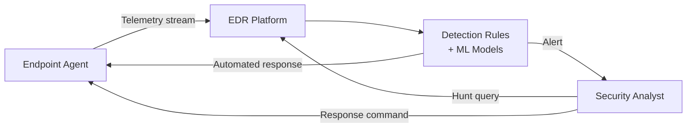

No single control stops all malware. Effective defense uses **layers** — each layer catches what the previous one misses. This is defense-in-depth: assume each layer will eventually fail and ensure the next one compensates.

## Detection Approaches

### Signature-Based Detection

The oldest antivirus approach: maintain a database of known malware signatures (byte patterns, hashes, or file characteristics) and flag any file that matches.

**How it works:**
- Each malware sample has a unique byte sequence or hash
- AV vendors analyze malware and extract identifying signatures
- The AV engine scans files and compares against the signature database
- Match → quarantine/delete

**Strengths:** Fast, reliable for known malware, low false positives on common threats

**Weaknesses:**
- Completely blind to new ("zero-day") malware with no known signature
- Polymorphic and metamorphic malware mutate to avoid signature matches
- Fileless malware writes nothing to disk — nothing to scan
- Requires constant signature database updates

### Heuristic / Behavioral Detection

Instead of matching known signatures, heuristic engines analyze **what code does** — looking for suspicious behaviors regardless of the specific bytes.

**Static heuristics** analyze the file without running it:
- Unusual entropy (high entropy suggests encrypted/compressed payload)
- Known suspicious API calls (CreateRemoteThread, WriteProcessMemory)
- Abnormal PE (Portable Executable) header structure
- Code obfuscation patterns

**Dynamic / behavioral detection** actually runs the code (in a sandbox or on the endpoint) and monitors behavior:
- Attempts to disable Windows Defender or modify AV registry keys
- Suspicious process injection patterns
- Unexpected network connections to uncategorized domains
- File system traversal and bulk encryption (ransomware behavior)
- Attempts to disable shadow copies

### Machine Learning Detection

Modern security platforms train ML models on millions of malware samples to detect malicious patterns without explicit signatures.

**Features fed to models:**
- File attributes (size, entropy, imports, sections)
- Behavioral sequences (API call chains, network patterns)
- Code graph representations

ML detection can identify previously unseen malware variants that share structural properties with known malware. False positive rates are higher than signature detection but coverage is much broader.

---

## Antivirus vs EDR

| Feature | Traditional Antivirus | EDR (Endpoint Detection & Response) |
|---------|----------------------|-------------------------------------|
| Detection method | Primarily signature | Behavioral + ML + signatures |
| Scope | Individual files | System-wide activity monitoring |
| Visibility | File scan results | Complete process tree, network, file, registry telemetry |
| Response | Quarantine/delete | Automated kill + isolation + forensic capture |
| Threat hunting | No | Yes — proactive search through historical data |
| Alert detail | Low | High — full attack chain reconstruction |
| Examples | Windows Defender (basic), Avast | CrowdStrike Falcon, SentinelOne, Microsoft Defender for Endpoint, Carbon Black |

### How EDR Works

EDR agents run at the kernel level on every endpoint, capturing a continuous telemetry stream:

```
Every process created:     Who spawned it, command line, hash
Every file written:        Path, hash, writing process
Every network connection:  Destination IP/domain, process, bytes
Every registry modification: Key, value, modifying process
Every DLL loaded:          Hash, signing status, loading process
```

This telemetry is sent to a central platform where:
1. Rules and ML models flag suspicious patterns in real-time
2. Security analysts can query historical data across all endpoints
3. When a threat is confirmed, the agent can automatically kill processes and isolate the machine from the network



---

## Sandboxing

A **sandbox** is an isolated environment where suspicious files or URLs are detonated (executed) safely. The sandbox monitors all behavior and reports on what the sample did.

### What Sandboxes Capture

- **Process activity:** Every process created, killed, or injected into
- **File system:** Every file created, modified, or deleted
- **Registry:** Every registry key created or modified
- **Network:** Every DNS lookup, HTTP request, TCP connection
- **API calls:** Every Windows API called and its arguments
- **Screenshots:** Captures what the user would see

### Anti-Sandbox Techniques

Sophisticated malware detects sandboxes and changes behavior (or does nothing) when it thinks it's being analyzed:

| Technique | Detection method |
|-----------|-----------------|
| **Time delay** | Sleep for 5+ minutes before executing (sandbox timeout is often 2–3 min) |
| **User interaction check** | Does the mouse move? Are there recent user actions? (sandboxes are often automated) |
| **VM detection** | Check for VMware/VirtualBox registry keys, suspicious process names (vboxservice.exe), low core count |
| **Network check** | Is there real internet connectivity? (some sandboxes are air-gapped) |
| **Filename check** | Some sandboxes rename samples to `sample.exe` — check for this |
| **Low resource count** | Real machines have many processes; sandboxes are often minimal |
| **CPUID check** | CPU instruction reveals if running in a hypervisor |

Modern sandboxes respond by mimicking real user behavior (mouse movements, open applications), running bare-metal (not virtualized), and using longer detonation times.

### Cloud Sandbox Services

| Service | Operator |
|---------|----------|
| Any.run | Independent |
| Joe Sandbox | Joe Security |
| Cuckoo Sandbox | Open source (self-hosted) |
| VirusTotal | Google (aggregates 70+ AV engines + sandboxes) |
| Hybrid Analysis | CrowdStrike |

---

## Indicators of Compromise (IOCs)

**IOCs** are forensic artifacts that indicate a system has been compromised. Once a malware campaign is analyzed, its IOCs are shared across the security community so defenders can search for the same artifacts in their environments.

### Types of IOCs

| Type | Example | Limitation |
|------|---------|------------|
| **File hash** | SHA256 of malware executable | Changes with any modification (polymorphic malware) |
| **IP address** | C2 server IP | Attackers rotate IPs frequently |
| **Domain** | `evil-c2.net` | Domains change; DGA (Domain Generation Algorithms) generate new domains daily |
| **URL** | `http://evil.com/payload.exe` | Highly specific; changes constantly |
| **Mutex name** | `Global\{malware-mutex}` | Malware-specific; relatively stable |
| **Registry key** | Specific persistence key | More stable than network indicators |
| **Behavioral pattern** | Specific API call sequence | Most stable; hardest to change |

**The Pyramid of Pain** (David Bianco, 2013) ranks IOCs by how painful it is for attackers when defenders block them:

```
Most painful for attacker to change:
  ↑  TTPs (Tactics, Techniques, Procedures)
  |  Tools (specific malware families)
  |  Network/host artifacts (mutex, registry keys)
  |  Domain names
  |  IP addresses
  ↓  File hashes
Least painful for attacker to change
```

### IOC Sharing Formats and Platforms

**STIX (Structured Threat Information Expression):** A standardized language for describing threat information — who, what, how, why.

**TAXII (Trusted Automated Exchange of Intelligence Information):** A transport protocol for sharing STIX data between organizations.

**Platforms:**
- **MISP (Malware Information Sharing Platform):** Open source threat intelligence sharing
- **AlienVault OTX:** Free community threat intelligence feeds
- **VirusTotal:** Hash and IOC lookups
- **Shodan:** Search engine for internet-connected devices (useful for finding exposed assets)

---

## Network-Level Defense

### Firewalls

- **Stateful firewall:** Tracks connection state; blocks packets that don't belong to established connections
- **NGFW (Next-Generation Firewall):** Inspects application layer; can block specific applications, enforce SSL inspection, and integrate with threat feeds
- **Web Application Firewall (WAF):** HTTP-specific; blocks SQLi, XSS, and other web attack patterns

### IDS / IPS

**IDS (Intrusion Detection System):** Monitors traffic and alerts on suspicious patterns. Passive — does not block.

**IPS (Intrusion Prevention System):** Sits inline in the traffic path and can actively block malicious traffic. Higher risk of false positives causing legitimate traffic disruption.

Both use:
- **Signature rules** (Snort/Suricata rules) — match known attack patterns
- **Anomaly detection** — flag deviations from baseline traffic patterns

### DNS Security

DNS is a rich source of security signal:

- **DNS sinkholes:** Block known malicious domains by redirecting queries to a controlled IP (no connection to C2)
- **RPZ (Response Policy Zones):** Customizable DNS blocking based on threat feeds
- **DNSBL (DNS Blocklists):** Publicly maintained lists of known malicious domains and IPs
- **DNS over HTTPS (DoH):** Encrypts DNS queries — prevents DNS monitoring (creates tension between privacy and enterprise security monitoring)

**DNS is widely used for C2 communication.** Malware uses DNS queries to exfiltrate data (encoding data in subdomains) and receive C2 commands (encoding instructions in TXT records). DNS monitoring is an essential component of malware detection.

---

## Endpoint Hardening

### Application Whitelisting / Allowlisting

Only allow explicitly approved applications to execute. Any attempt to run an unapproved executable is blocked — even if it's a zero-day with no signature.

- **Windows:** AppLocker, Windows Defender Application Control (WDAC)
- **macOS:** Gatekeeper, MDM-managed allowlists
- **Linux:** AppArmor, SELinux policies

This is one of the most effective defenses against commodity malware but requires maintenance — new legitimate software must be explicitly approved.

### Patch Management

The vast majority of exploits target **known vulnerabilities** for which patches already exist. Patch management is boring but effective:

- **Equifax breach (2017):** A known Apache Struts vulnerability (CVE-2017-5638), for which a patch had been available for 2 months, exposed 147 million people's personal data.
- **WannaCry:** Exploited EternalBlue, which Microsoft had patched 2 months earlier (MS17-010). Unpatched machines were the only ones affected.

Patch windows: Critical vulnerabilities in internet-facing systems should be patched within 24–48 hours of disclosure. Internal systems within the next patch cycle (typically monthly).

### Least Privilege

Users and processes should have the minimum permissions required for their function. This limits what malware can do if it executes in a user's context:

- Standard user accounts (not local admin) — malware cannot install services or modify system files
- Application sandboxing — browser, PDF reader isolated from the rest of the system
- No service accounts with domain admin rights

### Disable Unnecessary Attack Surface

```
Disable PowerShell v2         → Can bypass AMSI (Antimalware Scan Interface)
Disable WScript/CScript       → Used to run VBScript/JScript malware
Restrict Office macros        → No macro execution or only signed macros
Disable AutoRun/AutoPlay      → Prevents USB drop attacks
Disable SMBv1                 → Removes EternalBlue attack surface
Block LLMNR/NBT-NS            → Prevents credential capture attacks
```

---

## Email Security

Since 90% of attacks start with email, email is the highest-priority defense layer:

| Control | Purpose |
|---------|---------|
| **SPF** | Specifies which mail servers are authorized to send email for a domain |
| **DKIM** | Cryptographically signs outgoing email; receivers can verify authenticity |
| **DMARC** | Policy specifying what to do with SPF/DKIM failures (reject, quarantine, none) |
| **Anti-spam / anti-phishing** | ML-based filtering of phishing emails before delivery |
| **Sandboxed attachment scanning** | Detonate attachments in a sandbox before delivering to users |
| **URL rewriting** | Rewrite links in emails; check destination at click time |
| **Anti-spoofing** | Block emails that appear to be from internal addresses but arrive externally |

### DMARC Enforcement

A domain without a DMARC policy (or with `p=none`) can be spoofed with high success rates. `p=reject` means any email failing SPF+DKIM alignment is rejected at the receiving server.

---

## User Training and Awareness

Technology controls are necessary but not sufficient. Social engineering and phishing target humans. Effective training includes:

- **Simulated phishing:** Internal phishing campaigns that send employees realistic phishing emails and measure click rates. Employees who click receive immediate training.
- **Reporting culture:** Make it easy (and rewarding, not punishing) to report suspicious emails. A missed phishing email that gets reported is still a win.
- **Regular training updates:** Threat landscape changes — annual training is insufficient. Short, frequent updates are more effective.

The goal is not to create suspicious paranoia — it is to build a low-effort default behavior: **when in doubt, verify through a different channel** (call the person who supposedly sent the email, use an existing contact number, not a number in the email).

---

## Defense-in-Depth Summary

No layer is perfect. Defense-in-depth means that when one layer fails, the next one catches it:

| Layer | What it stops |
|-------|--------------|
| Email filtering | Phishing emails before they reach users |
| User awareness | Phishing emails that bypass filters |
| Web proxy / URL filtering | Malicious downloads and C2 communication |
| Endpoint AV + EDR | Malware execution and suspicious behavior |
| Application allowlisting | Unapproved executables |
| Least privilege | Privilege escalation and spread |
| Network segmentation | Lateral movement between segments |
| Backup and recovery | Ransomware impact |
| Patch management | Exploitation of known vulnerabilities |
| Threat intelligence | Known IOCs and TTPs |
| Incident response plan | Minimize damage when something does get through |
