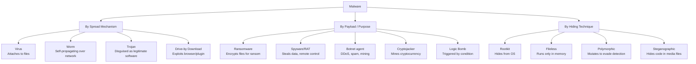
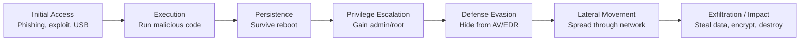

**Malware** (malicious software) is any program designed to disrupt, damage, or gain unauthorized access to a computer system. It is the primary weapon of cybercriminals, nation-state actors, and hacktivists — and understanding it is foundational to defending against it.

## The Scale of the Problem

The malware ecosystem is a multi-billion dollar criminal industry:
- Over **450,000 new malware samples** are detected every day (AV-TEST Institute)
- Ransomware alone caused estimated damages of **$20 billion in 2021**
- The average cost of a malware-related data breach is **$4.35 million** (IBM, 2022)
- 90% of successful cyberattacks begin with a **phishing email**

## How Malware Is Classified

Malware is classified by how it **spreads**, what it **does**, and how it **hides**. Many real-world samples combine multiple types.

## The Malware Lifecycle

Most malware attacks follow the same general pattern, regardless of the specific type:

This sequence matches the **MITRE ATT&CK** framework — a globally recognized knowledge base of adversary tactics and techniques that defenders use to categorize and understand attacks.

## Who Creates Malware

| Actor | Motivation | Typical malware |
|-------|------------|----------------|
| **Cybercriminals** | Financial gain | Ransomware, banking trojans, botnets |
| **Nation-state actors** | Espionage, disruption, sabotage | APTs, Stuxnet, wiper malware |
| **Hacktivists** | Political/ideological goals | DDoS tools, website defacement |
| **Insider threats** | Revenge, financial incentive | Logic bombs, data exfiltration |
| **Script kiddies** | Notoriety, curiosity | Off-the-shelf RATs, botnets |

## Topics in This Section

| Topic | What you'll learn |
|-------|------------------|
| [Malware Types](./malware-types) | Deep dive into every malware category — how each works, notable examples, and technical mechanisms |
| [Attack Techniques](./attack-techniques) | How malware reaches victims — phishing, supply chain attacks, exploit kits, and more |
| [Detection & Defense](./detection-and-defense) | How malware is detected and stopped — AV engines, EDR, sandboxing, IOCs, and endpoint hardening |
