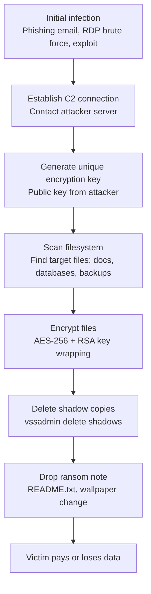
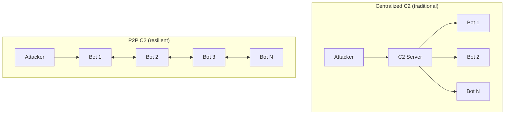
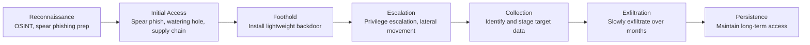

Malware is not a single thing. Each category has a distinct mechanism, a distinct purpose, and distinct indicators that help defenders detect it. Understanding the mechanics of each type is the foundation of effective defense.

---

## Viruses

A **virus** is malicious code that **attaches itself to legitimate files** and spreads when those infected files are executed or shared. Unlike worms, viruses require human action to propagate — opening an infected attachment, sharing a USB drive, or copying a file.

### How Viruses Work

1. The virus code is inserted into a host file (executable, document, boot sector)
2. When the host file runs, the virus code executes first
3. The virus searches for other files to infect (the **replication phase**)
4. The virus then runs the original host code (to avoid detection)
5. At some trigger condition, the virus executes its **payload** (destruction, data theft, etc.)

### Types of Viruses

| Type | Infection target | Mechanism |
|------|-----------------|-----------|
| **File infector** | `.exe`, `.com`, `.dll` files | Prepends or appends code to executables |
| **Boot sector virus** | MBR (Master Boot Record) | Replaces or modifies the first sector of a disk |
| **Macro virus** | Office documents (Word, Excel) | Embeds malicious macros that run on document open |
| **Multipartite** | Both boot sector and files | Hybrid — harder to fully remove |
| **Polymorphic** | Any file type | Mutates its own code on each replication to evade signature detection |
| **Metamorphic** | Any file type | Completely rewrites itself while preserving function — no stable signature |

### Notable Examples

**ILOVEYOU (2000):** A Visual Basic Script arriving as a love letter email attachment. When opened, it overwrote files and emailed itself to everyone in the victim's Outlook contacts. Infected 10% of internet-connected computers worldwide in 10 days; caused an estimated $10 billion in damage.

**Melissa (1999):** A macro virus embedded in a Word document. On opening, it emailed itself to the first 50 contacts, overwhelming mail servers at NASA, Intel, and Microsoft.

**CIH / Chernobyl (1998):** Triggered on April 26 (Chernobyl anniversary), it overwrote the first megabyte of the hard drive and attempted to overwrite the Flash BIOS — the first virus capable of physically damaging hardware. ~60 million PCs affected.

---

## Worms

A **worm** is self-replicating malware that spreads **automatically over networks** without any user action. Where a virus needs a human to copy a file, a worm exploits network protocols, open services, or vulnerabilities to spread on its own.

### How Worms Work

1. The worm executes on an initial host (via a vulnerability exploit, phishing, etc.)
2. It scans the network for other vulnerable targets
3. It exploits the vulnerability on each target to copy itself
4. It then executes on the new host and repeats

This exponential spread means a worm can infect millions of machines in hours.

### Notable Examples

**Morris Worm (1988):** The first major internet worm. Robert Morris, a Cornell graduate student, released it to measure the size of the internet. Due to a bug, it re-infected machines repeatedly, crashing them. It infected ~6,000 machines (10% of the internet at the time). Morris was the first person convicted under the Computer Fraud and Abuse Act.

**SQL Slammer (2003):** A 376-byte worm that exploited a buffer overflow in Microsoft SQL Server. It doubled in size every 8.5 seconds, infecting 75,000 machines in 10 minutes. It caused network outages worldwide, took down 911 call centers in Seattle, and disrupted ATMs across the US.

**Conficker (2008):** Exploited a Windows vulnerability to create a botnet of 9–15 million machines. It was so sophisticated it used P2P communication for C2, encrypted its communications, and blocked infected machines from accessing antivirus update sites. The Conficker Working Group — a coalition of security companies and governments — spent years trying to neutralize it.

**WannaCry (2017):** Used the EternalBlue exploit (stolen from the NSA) to spread over SMB (port 445). Infected 230,000 computers in 150 countries in one day. Encrypted files and demanded ransom. Caused $4–8 billion in damage. NHS hospitals in the UK had to cancel surgeries and turn away patients. Attributed to North Korea's Lazarus Group.

---

## Trojans

A **Trojan** (Trojan horse) is malware that **disguises itself as legitimate software** to trick users into installing it. Unlike viruses, Trojans do not self-replicate — they rely on social engineering to spread.

### How Trojans Work

A Trojan presents a believable surface (a game, a utility, a document, a fake update) while running malicious code in the background. The malicious payload can be anything: a backdoor, a downloader for other malware, a data stealer.

### Types of Trojans

| Type | Purpose |
|------|---------|
| **Backdoor Trojan** | Opens a persistent remote access channel to the attacker |
| **Downloader/Dropper** | Downloads and installs additional malware stages |
| **Banking Trojan** | Intercepts banking credentials, injects fake login pages |
| **Infostealer** | Exfiltrates passwords, cookies, credit card numbers, system info |
| **Proxy Trojan** | Converts victim machine into a proxy server for attacker traffic |
| **Rootkit Trojan** | Installs a rootkit to maintain persistent, hidden access |

### Notable Examples

**Zeus / Zbot (2007):** A banking trojan that stole banking credentials using keylogging and man-in-the-browser attacks (injecting fake form fields into real banking websites). Used to steal over $100 million from US businesses. Its source code leaked in 2011, spawning dozens of variants including GameOver Zeus.

**Emotet (2014–2021):** Initially a banking trojan, it evolved into the world's most dangerous malware delivery platform. Emotet sent millions of spam emails, infected machines, and then sold access to other criminal groups to install ransomware. Europol and law enforcement agencies in 8 countries took it down in January 2021, but it re-emerged in late 2021.

**TrickBot (2016):** A modular banking trojan with a plugin architecture allowing attackers to add capabilities (credential theft, lateral movement, Ryuk ransomware delivery). One of the most persistent botnets in history.

---

## Ransomware

**Ransomware** encrypts the victim's files and demands payment (usually cryptocurrency) for the decryption key. It is the dominant financially-motivated cyberattack and has disrupted hospitals, pipelines, schools, and governments worldwide.

### How Ransomware Works

**The encryption model:**
- Ransomware generates a random symmetric key (AES-256) to encrypt files
- That symmetric key is encrypted with the attacker's RSA public key
- The attacker's RSA private key — needed to recover the AES key — is only released upon payment
- This design means there is no mathematical shortcut: without the private key, decryption is impossible

### Types of Ransomware

| Type | Behavior |
|------|----------|
| **Crypto-ransomware** | Encrypts files; most common |
| **Locker ransomware** | Locks the operating system, not just files |
| **Double-extortion** | Encrypts AND exfiltrates data; threatens to publish if not paid |
| **Triple-extortion** | Adds DDoS attacks against the victim as additional pressure |
| **Ransomware-as-a-Service (RaaS)** | Criminal organizations sell ransomware kits + infrastructure to affiliates |

### Notable Examples

**WannaCry (2017):** Combined a worm (EternalBlue SMB exploit) with ransomware. Demanded $300 in Bitcoin, with little payment infrastructure — it was more cyberweapon than criminal enterprise. Marcus Hutchins accidentally stopped it by registering a kill-switch domain embedded in the code.

**NotPetya (2017):** Initially disguised as ransomware, NotPetya was actually a **wiper** — it destroyed data with no intention of providing a decryption key. Spread via a Ukrainian accounting software update (supply chain attack). Caused $10+ billion in damage globally; affected Maersk (the world's largest shipping company), Merck, FedEx, and Mondelez. Attributed to Russian military intelligence (GRU).

**Colonial Pipeline (2021):** DarkSide ransomware attacked the largest fuel pipeline in the US (covering 45% of East Coast fuel). Colonial paid $4.4 million in Bitcoin. The attack caused fuel shortages across the Southeast US and a state of emergency in multiple states. The US government later recovered $2.3 million of the ransom.

**REvil / Kaseya (2021):** REvil ransomware-as-a-service attacked Kaseya VSA (IT management software used by Managed Service Providers). By compromising one software supplier, they reached 1,500 companies worldwide simultaneously. Demanded $70 million — the largest ransomware demand ever.

---

## Spyware

**Spyware** secretly monitors user activity and transmits information to a third party — without the user's knowledge or consent. It is used for corporate espionage, stalkerware (domestic abuse), and state surveillance.

### What Spyware Collects

- **Keystrokes** — every key pressed, capturing passwords, messages, documents
- **Screenshots** — periodic or event-triggered screen captures
- **Browser activity** — visited URLs, search history, saved passwords, form data
- **System information** — installed software, hardware, network configuration
- **File access** — documents opened or created
- **Microphone/camera** — audio and video recording
- **Location data** — GPS coordinates (on mobile)

### Notable Examples

**Pegasus (NSO Group):** Military-grade spyware sold only to governments. Can silently infect iOS and Android devices with zero-click exploits (no user action required). Once installed, provides complete access to all data, communications, camera, and microphone. Used against journalists, activists, lawyers, and heads of state. The Pegasus Project (2021) revealed it was used to spy on 50,000+ targets across 50 countries.

**FinFisher / FinSpy:** Commercial spyware marketed to law enforcement agencies. Has been used by authoritarian governments against dissidents and journalists. Capable of intercepting Skype calls, activating webcams, and recording keystrokes.

---

## Adware

**Adware** displays unwanted advertisements, usually by hijacking the browser. Often bundled with free software ("PUPs" — Potentially Unwanted Programs). While less dangerous than ransomware, adware degrades performance, redirects traffic, and can download additional malware.

### Behaviors

- Injects ads into websites (even legitimate HTTPS sites)
- Replaces legitimate ads with attacker-controlled ads (ad replacement)
- Redirects search engine queries
- Installs browser extensions without consent
- Modifies browser homepage and default search engine

---

## Rootkits

A **rootkit** is malware that **hides itself and other malware** from the operating system, security software, and users. The name comes from "root" (the highest privilege level on Unix systems) and "kit" (a set of tools). Rootkits are among the hardest malware to detect and remove.

### Types by Privilege Level

| Type | Location | What it hides from | Detection difficulty |
|------|----------|--------------------|---------------------|
| **User-mode rootkit** | User space (Ring 3) | Other user-space processes, Task Manager | Moderate — kernel can still see it |
| **Kernel-mode rootkit** | Kernel (Ring 0) | The entire OS including security software | Very high — it controls the kernel |
| **Bootkit** | Master Boot Record / UEFI | Pre-OS; loads before the OS | Extremely high |
| **Hypervisor rootkit** | Below the OS (Ring -1) | The entire operating system | Theoretical; extremely difficult to detect |
| **Firmware rootkit** | Hardware firmware (NIC, HDD) | Survives OS reinstallation | Near impossible to remove |

### How Kernel Rootkits Work

A kernel rootkit modifies kernel data structures to hide files, processes, and network connections:

- **DKOM (Direct Kernel Object Manipulation):** Unlinks a process entry from the kernel's process list — tools like Task Manager show processes by walking this list, so unlinked processes become invisible
- **System call hooking:** Intercepts OS calls from applications to filter results (e.g., when `ls` is called, the rootkit removes its own files from the returned list)
- **SSDT hooking (Windows):** Modifies the System Service Descriptor Table to redirect system calls to malicious handlers

### Notable Examples

**Sony BMG Rootkit (2005):** Sony BMG secretly installed a rootkit on Windows PCs via music CDs to enforce copy protection. The rootkit hid any process or file starting with `$sys$` — which hackers quickly exploited to hide their own malware. Sony was forced to recall millions of CDs and faced massive lawsuits.

**Stuxnet (2010):** The most sophisticated piece of malware ever discovered. A US/Israeli cyberweapon targeting Iranian nuclear centrifuges. Its rootkit component hid modified PLC code from Siemens control software, showing operators normal readings while the centrifuges were being physically destroyed. Discovered when it accidentally escaped the target environment.

**ZeroAccess:** A kernel-mode rootkit and botnet used for click fraud and Bitcoin mining. At its peak, infected 9 million computers.

---

## Botnets

A **botnet** is a network of compromised computers ("bots" or "zombies") controlled remotely by an attacker through Command and Control (C2) infrastructure. Infected machines carry out the attacker's instructions without the owners' knowledge.

### C2 Architectures

Centralized C2 is easy to take down (remove the server, the botnet goes dark). P2P botnets are much more resilient — there's no single point of failure.

### What Botnets Are Used For

| Use | Description |
|-----|-------------|
| **DDoS attacks** | Flood a target with traffic from millions of bots simultaneously |
| **Spam campaigns** | Send billions of phishing or spam emails |
| **Credential stuffing** | Test stolen username/password pairs against thousands of sites |
| **Cryptomining** | Mine cryptocurrency using victims' CPU/GPU power |
| **Click fraud** | Generate fake ad clicks to steal revenue from advertisers |
| **Ransomware delivery** | Sell access to established botnets to ransomware operators |
| **Proxy services** | Rent out bot IP addresses as anonymous proxies |

### Notable Botnets

**Mirai (2016):** Targeted IoT devices (routers, IP cameras, DVRs) with default credentials. At its peak: 600,000 bots. Used to launch the largest DDoS attack in history against Dyn DNS (a DNS provider), taking down Twitter, Netflix, Reddit, CNN, and GitHub for most of a day. Caused estimated $110 million in damages. The source code was released publicly, spawning dozens of variants.

**GameOver Zeus:** A P2P variant of Zeus banking trojan, controlling 1 million infected machines. Also used to deliver CryptoLocker ransomware. Taken down in Operation Tovar (2014) — a coordinated international law enforcement operation.

---

## RATs (Remote Access Trojans)

A **RAT** gives an attacker **complete remote control** of an infected machine — similar to legitimate remote desktop tools, but installed without consent. RATs are used for long-term espionage, data theft, and surveillance.

### RAT Capabilities

- **Shell access:** Execute arbitrary commands on the victim machine
- **File system access:** Browse, upload, download, and delete files
- **Keylogging:** Record all keystrokes
- **Screen capture:** Take screenshots or stream the screen in real-time
- **Webcam/microphone access:** Activate and record without notification
- **Password extraction:** Dump browser-stored passwords, system credentials
- **Lateral movement:** Use the compromised machine to attack others on the same network
- **Persistence:** Ensure the RAT restarts after reboot

### Notable Examples

**DarkComet:** A widely-used RAT originally marketed as a legitimate remote administration tool. Heavily used by Syrian government intelligence to spy on opposition activists during the Syrian civil war. The developer ceased development after this discovery.

**Gh0st RAT:** A Chinese RAT used extensively in APT operations (including the GhostNet campaign that compromised computers in 103 countries, including offices of the Dalai Lama and multiple foreign embassies).

**njRAT:** Simple but effective RAT popular with Middle Eastern cybercriminals. Easy to configure, making it popular with script kiddies. Used in thousands of campaigns globally.

---

## Fileless Malware

**Fileless malware** runs entirely in memory, leaving no files on disk. This makes it extremely difficult for traditional antivirus (which scans files) to detect.

### How It Works

Instead of writing a `.exe` to disk, fileless malware:
1. Exploits a vulnerability or uses a legitimate tool (PowerShell, WMI, mshta.exe, regsvr32)
2. Injects shellcode directly into a running process's memory
3. The malicious code executes from memory — there is nothing to scan on disk
4. Can establish persistence via registry keys, scheduled tasks, or WMI subscriptions (without file-based payloads)

### Living Off the Land (LotL)

Modern fileless attacks use **LOLBins** (Living Off the Land Binaries) — legitimate Windows tools that are commonly whitelisted:

| Tool | Abuse potential |
|------|----------------|
| `PowerShell` | Download and execute arbitrary code from the internet |
| `certutil.exe` | Download files, decode base64 payloads |
| `mshta.exe` | Execute HTA (HTML Application) files containing malicious scripts |
| `regsvr32.exe` | Register COM objects — can be used to run remote code |
| `wmic.exe` | Execute scripts via Windows Management Instrumentation |
| `rundll32.exe` | Execute DLL code without a traditional executable |

---

## Cryptojackers

**Cryptojackers** secretly use the victim's CPU or GPU to mine cryptocurrency for the attacker's benefit. The victim sees degraded performance and higher electricity bills; the attacker earns cryptocurrency.

### Types

**Browser-based (JavaScript):** A JavaScript mining script embedded in a website runs in the visitor's browser while they're on the page. No installation required — leaves when the tab closes. Coinhive (shut down in 2019) was the most widely used browser mining service; it was embedded in thousands of websites (sometimes without the site owner's knowledge).

**Installed malware:** A traditional malware installer that runs a mining process on the victim's machine 24/7. More profitable than browser-based; often delivered via Trojans or worms.

**WannaMine:** A fileless cryptojacker that used EternalBlue (the same NSA exploit as WannaCry) to spread and then mine Monero using Windows Management Instrumentation.

---

## Logic Bombs

A **logic bomb** is malicious code that lies dormant until a specific trigger condition is met — a date, time, user action, or system state. Unlike most malware, logic bombs are usually planted by **insiders** with legitimate access.

### Trigger Types

- **Time-based:** Executes on a specific date/time (e.g., a disgruntled employee sets a script to delete databases 30 days after their termination)
- **Event-based:** Executes when a specific event occurs (a particular user logs in, a file is opened, a process is killed)
- **Absence trigger:** Executes when something **stops** happening (a "dead man's switch" — if the employee's account isn't active, the bomb triggers)

### Notable Cases

**Tim Lloyd (Omega Engineering, 1996):** A network engineer at a defense contractor planted a logic bomb that deleted all software programs on the company's manufacturing systems. Cost the company $10 million in damages and 80 jobs. Lloyd was convicted and sentenced to 41 months in prison.

**Roger Duronio (UBS PaineWebber, 2002):** A systems administrator planted a logic bomb triggered to run on March 4, 2002. The bomb deleted files on 1,000+ servers, causing $3 million in damages. Duronio had also shorted the company's stock, expecting the attack to tank the share price. He was convicted and sentenced to 8 years.

---

## Advanced Persistent Threats (APTs)

An **APT** is not a specific malware type but a **category of attacker** — typically nation-states or state-sponsored groups — that conducts long-term, targeted operations against specific high-value targets (governments, defense contractors, critical infrastructure, political organizations).

### Characteristics

- **Persistence:** Maintain access for months or years without detection
- **Stealth:** Blend into normal network traffic; use legitimate admin tools
- **Targeted:** Specific objectives (intellectual property theft, political intelligence, sabotage)
- **Well-resourced:** Zero-day exploits, custom malware, large teams

### The APT Lifecycle

### Notable APT Groups

| Group | Attribution | Known operations |
|-------|-------------|-----------------|
| **APT28 (Fancy Bear)** | Russian GRU | DNC hack (2016), WADA, Bundestag |
| **APT29 (Cozy Bear)** | Russian SVR | SolarWinds supply chain (2020), COVID vaccine research theft |
| **Lazarus Group** | North Korean DPRK | Bangladesh Bank heist ($81M), WannaCry, Sony Pictures hack |
| **APT41** | Chinese MSS | Dual espionage + financially-motivated; healthcare, gaming, telecoms |
| **Equation Group** | US NSA | Stuxnet (with Unit 8200), sophisticated firmware implants |

### SolarWinds (2020) — APT in Detail

The SolarWinds attack by APT29 is the most significant supply chain attack in history:

1. **Compromise:** Attackers infiltrated SolarWinds' build pipeline and inserted a backdoor ("Sunburst") into the Orion IT monitoring software
2. **Distribution:** SolarWinds pushed the backdoored software as a legitimate update to 18,000 customers including US Treasury, Commerce, Homeland Security, and Fortune 500 companies
3. **Dormancy:** The backdoor waited 2 weeks before activating — to avoid sandboxed detonation detection
4. **Operation:** Connected to C2 via DNS requests disguised as legitimate Orion traffic. Gave attackers access to email, internal systems, and sensitive data
5. **Discovery:** Detected 9 months after initial compromise by FireEye, when attackers stole FireEye's own red team tools
6. **Impact:** An unknown number of US government networks were fully compromised. Full damage assessment was classified.
