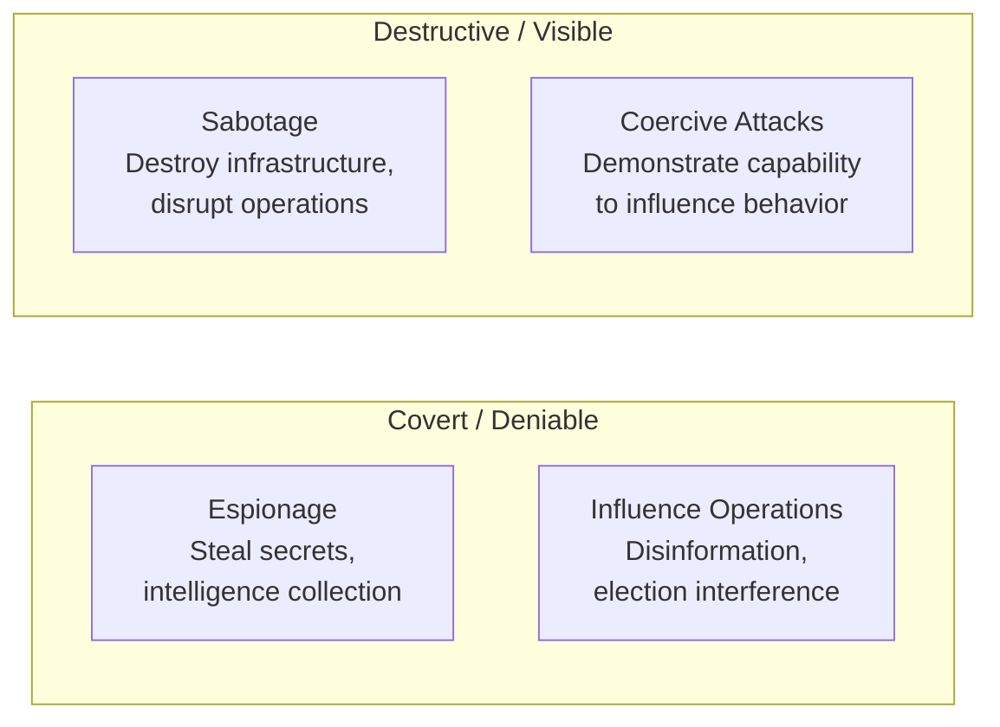

Cyber warfare is the use of digital attacks by nation-states (or state-sponsored actors) to disrupt, damage, or destroy another nation's infrastructure, steal strategic information, or influence populations. It is now a permanent feature of geopolitical competition — every major military power has dedicated offensive cyber units, and cyberattacks regularly accompany or precede conventional military operations.

## The Spectrum of State Cyber Operations

Nation-state cyber operations span a wide range of objectives and intensity:

Unlike conventional military operations, cyber operations are:
- **Deniable** — attribution is difficult; countries routinely deny involvement
- **Asymmetric** — a small, skilled team can inflict damage disproportionate to its size
- **Global** — geography provides no protection; distance is irrelevant
- **Persistent** — APTs often maintain access for months or years undetected

## Key Nation-State Actors

| Country | Key cyber units | Known focus areas |
|---------|----------------|-------------------|
| **Russia** | GRU (APT28/Fancy Bear), SVR (APT29/Cozy Bear), FSB | Election interference, NATO member networks, critical infrastructure |
| **China** | MSS, PLA Unit 61398 (APT1), APT41 | Intellectual property theft, political dissidents, military technology |
| **USA** | NSA/TAO, Cyber Command, CIA CCD | Global signals intelligence, counterterrorism, offensive capability development |
| **North Korea** | Lazarus Group, Bureau 121 | Financial crime (funding regime), espionage, disruption |
| **Iran** | APT33, APT34, MOIS | Saudi Arabia, Israel, US targets; destructive wiper malware |
| **Israel** | Unit 8200, Shin Bet | Cyber espionage, targeted operations against adversaries |

## Landmark Incidents

### Stuxnet (2010) — The First Known Cyberweapon

**What happened:** A highly sophisticated worm (attributed to the US and Israel, known as "Olympic Games") targeted the Siemens programmable logic controllers (PLCs) that controlled Iran's uranium enrichment centrifuges at Natanz. 

**How it worked:**
1. Spread via infected USB drives (air-gapped networks cannot be reached over the internet)
2. Scanned for Siemens STEP 7 software
3. Reprogrammed centrifuge controllers to spin at destructive speeds, then spin too slowly — while reporting normal values to operators
4. Destroyed approximately 1,000 centrifuges (20% of Iran's enrichment capacity) without any visible cause

**Why it matters:** Stuxnet was the first documented case of a cyberattack causing **physical destruction of industrial equipment**. It demonstrated that cyber operations could achieve strategic military objectives without firing a shot — and that critical infrastructure worldwide is vulnerable to similar attacks.

**Discovery:** Stuxnet accidentally spread outside Natanz (a bug in the worm's propagation logic) and was discovered by Belarusian security firm VirusBlokAda in 2010. Analysis took months; its full sophistication (four zero-day exploits, two stolen digital certificates, rootkit capabilities) shocked the security community.

---

### Estonia DDoS (2007) — The First Nation-State Cyber Campaign

**Context:** After Estonia moved a Soviet war memorial statue, Russia and Russian nationalists launched a campaign of DDoS attacks lasting three weeks.

**Targets:** Estonian parliament, banks (Hansabank, SEB), newspapers, TV stations, government ministries, emergency services.

**Impact:**
- Online banking down for days (Estonia at the time was one of the most internet-dependent societies in the world)
- Government communications disrupted
- Emergency services call centers overloaded

**Significance:** First time a sustained cyber campaign was used as a geopolitical instrument against a nation. NATO's designation of Estonia as a cyber defense hub and the creation of the NATO Cooperative Cyber Defence Centre of Excellence (CCDCOE) in Tallinn directly resulted from this attack.

---

### Georgia Cyberattacks (2008)

Two days before Russian military forces entered Georgian territory during the 2008 South Ossetia War, cyberattacks began against Georgian government websites, news sites, and communications infrastructure — the first documented case of cyberattacks coordinated with conventional military operations.

Georgian government websites were defaced with images comparing the Georgian president to Hitler. Communications disruption coincided with the physical invasion, reducing the Georgian government's ability to coordinate response and communicate internationally.

---

### Sony Pictures Hack (2014)

**Actor:** Lazarus Group (North Korea)

**Why:** In response to the film "The Interview" — a comedy about a CIA plot to assassinate Kim Jong-un.

**What happened:** North Korean hackers ("Guardians of Peace") breached Sony Pictures' network, exfiltrated 100 terabytes of data, and deployed a wiper malware called WhiskeyAlfa that overwrote the Master Boot Record of every machine on the network, rendering them inoperable.

**Leaked:** Unreleased films, employee Social Security numbers and salaries, executive email conversations (embarrassing), celebrity private data, passwords.

**Impact:** Estimated $35 million in IT remediation costs. Paralyzed the company for weeks. Demonstrated that destructive malware could cripple a major corporation as a retaliatory measure.

---

### Ukraine Power Grid Attacks (2015, 2016)

**Actor:** Sandworm (Russian GRU)

In December 2015, malware (BlackEnergy) infected Ukrainian power distribution companies, allowing attackers to remotely operate circuit breakers and cut power to 230,000 customers in western Ukraine for several hours — the first confirmed cyberattack to cause a power outage.

In December 2016, a more sophisticated attack (Industroyer/Crashoverride) was used against Kyiv's transmission substation. Industroyer was specifically designed to communicate with industrial control systems — the first ICS-specific malware after Stuxnet.

These attacks were a preview of the broader cyber operations that accompanied Russia's 2022 full-scale invasion of Ukraine.

---

### SolarWinds (2020) — The Gold Standard of Supply Chain Attacks

**Actor:** APT29 (Russian SVR)

See detailed breakdown in [Malware Types — APTs](../malware/malware-types#advanced-persistent-threats-apts).

**Key strategic significance:** Rather than attacking US government agencies directly (heavily defended), the SVR compromised a software supplier trusted by all of them. This approach turned the software supply chain into an attack vector affecting 18,000 organizations simultaneously.

---

### Colonial Pipeline (2021)

**Actor:** DarkSide (Russian-speaking ransomware-as-a-service group)

The Colonial Pipeline attack was technically a ransomware attack by a criminal group — not a state-sponsored operation — but it demonstrated the national security implications of attacks on critical infrastructure.

**Impact:**
- 5,500-mile pipeline supplying 45% of East Coast fuel shut down for 6 days
- Fuel shortages and panic buying across the US Southeast
- State of emergency declared in multiple states
- Colonial paid $4.4 million in Bitcoin; the US government later seized $2.3 million

The US government characterized it as a national security threat and began treating ransomware attacks on critical infrastructure as a matter of national security policy.

---

### Russia's Cyber Operations in Ukraine (2022–)

Russia's full-scale invasion of Ukraine in February 2022 was preceded by and accompanied by extensive cyber operations:

- **Wiper attacks:** Multiple wiper malware families (HermeticWiper, IsaacWiper, CaddyWiper) deployed against Ukrainian organizations in the hours before the invasion
- **Satellite disruption:** Viasat KA-SAT network attacked, knocking out communications for Ukrainian military and civilians across Europe
- **Sustained infrastructure attacks:** Power grid, water treatment, telecoms targeted throughout the conflict
- **Psychological operations:** Disinformation campaigns, website defacements

Notably, Ukrainian cyber defenses — supported by NATO partners and commercial security companies — proved more resilient than Russia anticipated. Microsoft, among others, shared threat intelligence in real-time with Ukrainian defenders.

---

## International Law and Cyber Conflict

Cyber warfare exists in a contested legal landscape:

**The Tallinn Manual** (2013, 2017): A non-binding academic document produced by NATO cybersecurity experts that attempts to apply existing international law (law of armed conflict, sovereignty, etc.) to cyber operations. Key questions it addresses:
- When does a cyberattack constitute a use of force under UN Charter Article 2(4)?
- What is the threshold for a cyberattack to constitute an "armed attack" triggering the right to self-defense?
- What is a legitimate military cyber target?

**Current challenges:**
- **Attribution is legally contested** — states can plausibly deny operations they conducted
- **No binding international cyber treaty** — efforts to negotiate one (UN, ITU) have repeatedly stalled
- **Dual-use infrastructure** — civilian internet infrastructure and military communications are not separated
- **Proportionality rules** are hard to apply when the effects of a cyberattack are difficult to predict

---

## Implications for Defenders

Understanding cyber warfare matters even for non-government organizations:

1. **Critical infrastructure is a target:** Power, water, healthcare, finance are explicitly targeted by nation-state actors
2. **Supply chain is an attack vector:** Any organization connected to a strategic target may be compromised as an intermediate step
3. **Nation-state tools eventually leak:** EternalBlue (NSA), Pegasus (NSO Group), and other nation-state tools regularly end up in criminal hands and general circulation
4. **Threat intelligence matters:** Nation-state TTPs are documented in sources like MITRE ATT&CK. Organizations can use these to prioritize defenses against real-world techniques.
