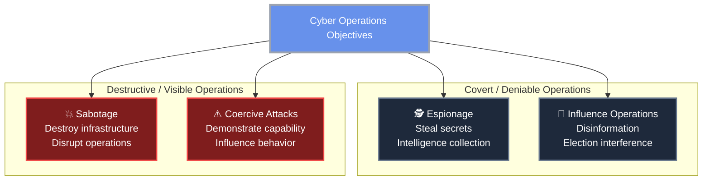

import { Card, CardGrid } from '@astrojs/starlight/components';
import { Aside } from '@astrojs/starlight/components';

Cyber warfare is the use of digital attacks by nation-states (or state-sponsored actors) to disrupt, damage, or destroy another nation's infrastructure, steal strategic information, or influence populations. It is now a permanent feature of geopolitical competition — every major military power has dedicated offensive cyber units, and cyberattacks regularly accompany or precede conventional military operations.

## The Spectrum of State Cyber Operations

Nation-state cyber operations span a wide range of objectives and intensity:

Unlike conventional military operations, cyber operations are:
- **Deniable** — attribution is difficult; countries routinely deny involvement
- **Asymmetric** — a small, skilled team can inflict damage disproportionate to its size
- **Global** — geography provides no protection; distance is irrelevant
- **Persistent** — APTs often maintain access for months or years undetected

## Key Nation-State Actors

| Country | Key cyber units | Known focus areas |
|---------|----------------|-------------------|
| **Russia** | GRU (APT28/Fancy Bear), SVR (APT29/Cozy Bear), FSB | Election interference, NATO member networks, critical infrastructure |
| **China** | MSS, PLA Unit 61398 (APT1), APT41 | Intellectual property theft, political dissidents, military technology |
| **USA** | NSA/TAO, Cyber Command, CIA CCD | Global signals intelligence, counterterrorism, offensive capability development |
| **North Korea** | Lazarus Group, Bureau 121 | Financial crime (funding regime), espionage, disruption |
| **Iran** | APT33, APT34, MOIS | Saudi Arabia, Israel, US targets; destructive wiper malware |
| **Israel** | Unit 8200, Shin Bet | Cyber espionage, targeted operations against adversaries |

# Landmark Incidents

> A timeline of the most influential cyberattacks in modern history — from early nation-state DDoS campaigns to ransomware attacks against critical infrastructure.

<CardGrid stagger>
  <Card title="Estonia DDoS (2007)" icon="seti:cloud">
    First nation-scale cyber campaign targeting government, banking, and media infrastructure.
  </Card>

  <Card title="Stuxnet (2010)" icon="seti:shield">
    The first known cyberweapon capable of physical destruction.
  </Card>

  <Card title="Sony Pictures (2014)" icon="seti:terminal">
    A destructive retaliatory cyberattack linked to North Korea.
  </Card>

  <Card title="SolarWinds (2020)" icon="seti:package">
    One of the most sophisticated supply-chain compromises ever discovered.
  </Card>

  <Card title="Colonial Pipeline (2021)" icon="seti:database">
    Ransomware attack demonstrating the national security impact of cybercrime.
  </Card>

  <Card title="Russia–Ukraine Cyberwar (2022–)" icon="seti:globe">
    Cyber operations integrated into modern conventional warfare.
  </Card>
</CardGrid>

---

## Estonia DDoS (2007)

<Aside type="caution" title="First Nation-State Cyber Campaign">
The Estonia attacks are widely considered the first large-scale cyber campaign used as a geopolitical weapon against a nation.
</Aside>

After Estonia moved a Soviet war memorial statue, Russia and Russian nationalist groups launched coordinated DDoS attacks lasting nearly three weeks.

**Targets**
- Estonian parliament
- Banks (Hansabank, SEB)
- Newspapers and broadcasters
- Government ministries
- Emergency services

**Impact**
- Online banking unavailable for days
- Government communications disrupted
- Emergency call systems overloaded

**Why It Matters:** The incident transformed NATO’s approach to cybersecurity and directly led to the creation of the NATO Cooperative Cyber Defence Centre of Excellence (CCDCOE) in Tallinn.

---

## Georgia Cyberattacks (2008)

<Aside type="tip" title="Cyber + Kinetic Warfare">
This was the first documented case of cyberattacks coordinated alongside conventional military operations.
</Aside>

Two days before Russian military forces entered Georgian territory during the South Ossetia War, cyberattacks began against Georgian government systems and media infrastructure.

**What Happened**
- Government websites defaced
- Communications infrastructure disrupted
- News and media sites targeted
- Psychological operations amplified online

**Significance:** The attacks demonstrated how cyber operations could support physical military invasion by disrupting communications and international coordination.

---

## Stuxnet (2010)

<Aside type="danger" title="The First Known Cyberweapon">
Stuxnet proved malware could cause real-world physical destruction.
</Aside>

A highly sophisticated worm — attributed to the United States and Israel under *Operation Olympic Games* — targeted Siemens PLC controllers inside Iran’s Natanz uranium enrichment facility.

**How It Worked**
1. Spread through infected USB drives
2. Identified Siemens STEP 7 systems
3. Manipulated centrifuge speeds while displaying fake normal readings
4. Physically damaged roughly 1,000 centrifuges

**Why It Matters:** Stuxnet fundamentally changed cybersecurity strategy worldwide by proving that industrial systems and critical infrastructure were vulnerable to cyber sabotage.

**Discovery:** The worm accidentally escaped Natanz due to a propagation bug and was discovered in 2010 by Belarusian security firm VirusBlokAda.

---

## Sony Pictures Hack (2014)

<Aside type="note" title="Destructive Retaliation">
The attack demonstrated how cyberattacks could be used as retaliation for media and political messaging.
</Aside>

Hackers infiltrated Sony Pictures, exfiltrated massive amounts of data, and deployed destructive wiper malware called **WhiskeyAlfa**.

**Actor:** Lazarus Group (North Korea)

**Motivation:** Retaliation against *The Interview*, a comedy depicting the assassination of Kim Jong-un.

**Leaked Data**
- Unreleased films
- Executive emails
- Employee salaries and SSNs
- Passwords and private celebrity information

**Impact**
- Estimated $35 million in damages
- Corporate operations disrupted for weeks
- Public exposure of embarrassing internal communications

---

## Ukraine Power Grid Attacks (2015–2016)

<Aside type="danger" title="First Confirmed Cyber-Induced Blackout">
These attacks marked the first confirmed cyberattacks to successfully disrupt an electrical grid.
</Aside>

**Actor:** Sandworm (Russian GRU)

**2015 Attack:** Attackers used BlackEnergy malware to remotely operate circuit breakers and disconnect power for approximately 230,000 Ukrainians.

**2016 Attack:** A more advanced malware framework called **Industroyer/Crashoverride** specifically targeted industrial control protocols.

**Why It Matters:** These attacks previewed the cyber tactics later used during Russia’s broader military campaigns against Ukraine.

---

## SolarWinds Supply Chain Attack (2020)

<Aside type="caution" title="Supply Chain Compromise">
Instead of attacking targets directly, attackers compromised trusted software updates.
</Aside>

Attackers inserted malicious code into SolarWinds Orion software updates, distributing backdoors to approximately 18,000 customers.

**Actor:** APT29 / Cozy Bear (Russian SVR)

**Targets**

- US federal agencies
- Fortune 500 companies
- Critical infrastructure providers

**Strategic Importance:** The attack demonstrated that software supply chains had become one of the most dangerous attack vectors in cybersecurity.

---

## Colonial Pipeline (2021)

<Aside type="danger" title="Critical Infrastructure Disruption">
A criminal ransomware attack triggered national fuel shortages across the United States.
</Aside>

**Actor:** DarkSide ransomware group

**Impact**

- 5,500-mile fuel pipeline shut down
- Fuel shortages across the Southeast US
- Panic buying and emergency declarations
- $4.4 million ransom payment

**Why It Matters:** The attack pushed ransomware into the realm of national security policy and critical infrastructure defense.

---

## Microsoft Exchange Server Hacks (2021)

<Aside type="note" title="Mass Exploitation of Zero-Days">
Thousands of organizations were compromised within days of vulnerability disclosure.
</Aside>

Attackers exploited multiple Exchange Server zero-days to install web shells and maintain persistent access.

**Actor:** Hafnium (China-linked state-sponsored group)     

**Impact**
- Tens of thousands of organizations compromised
- Governments, universities, hospitals affected
- Massive emergency patching effort worldwide

---

## Russia's Cyber Operations in Ukraine (2022–)

<Aside type="tip" title="Modern Integrated Cyber Warfare">
Cyber operations became deeply integrated into conventional military conflict.
</Aside>

**Key Operations**
- Wiper malware deployments
- Satellite communications disruption
- Infrastructure attacks
- Disinformation campaigns

**Notable Event:** The Viasat KA-SAT attack disrupted communications across Europe shortly before the invasion began.

**Strategic Outcome:** Despite expectations, Ukrainian cyber defenses — supported by NATO and private-sector partners — proved resilient.

---

## MGM Resorts Ransomware Attack (2023)

<Aside type="caution" title="Social Engineering Still Works">
The breach began with help desk social engineering rather than advanced technical exploits.
</Aside>

Attackers manipulated MGM IT support staff into granting privileged access.

**Actor:** Scattered Spider + ALPHV/BlackCat

**Impact**
- Casino systems disrupted
- Hotel check-ins affected
- Slot machines and digital keys disabled
- Estimated losses exceeded $100 million

---

## Change Healthcare Ransomware Attack (2024)

<Aside type="danger" title="Healthcare at National Scale">
One of the largest healthcare cyber incidents in US history.
</Aside>

Attackers compromised Change Healthcare systems and encrypted critical payment and pharmacy infrastructure.

**Actor:** ALPHV/BlackCat ransomware group

**Impact**
- Prescription delays nationwide
- Hospital payment disruptions
- Sensitive healthcare records exposed
- Multi-billion-dollar recovery costs

## International Law and Cyber Conflict

Cyber warfare exists in a contested legal landscape:

**The Tallinn Manual** (2013, 2017): A non-binding academic document produced by NATO cybersecurity experts that attempts to apply existing international law (law of armed conflict, sovereignty, etc.) to cyber operations. Key questions it addresses:
- When does a cyberattack constitute a use of force under UN Charter Article 2(4)?
- What is the threshold for a cyberattack to constitute an "armed attack" triggering the right to self-defense?
- What is a legitimate military cyber target?

**Current challenges:**
- **Attribution is legally contested** — states can plausibly deny operations they conducted
- **No binding international cyber treaty** — efforts to negotiate one (UN, ITU) have repeatedly stalled
- **Dual-use infrastructure** — civilian internet infrastructure and military communications are not separated
- **Proportionality rules** are hard to apply when the effects of a cyberattack are difficult to predict

---

## Implications for Defenders

Understanding cyber warfare matters even for non-government organizations:

1. **Critical infrastructure is a target:** Power, water, healthcare, finance are explicitly targeted by nation-state actors
2. **Supply chain is an attack vector:** Any organization connected to a strategic target may be compromised as an intermediate step
3. **Nation-state tools eventually leak:** EternalBlue (NSA), Pegasus (NSO Group), and other nation-state tools regularly end up in criminal hands and general circulation
4. **Threat intelligence matters:** Nation-state TTPs are documented in sources like MITRE ATT&CK. Organizations can use these to prioritize defenses against real-world techniques.
