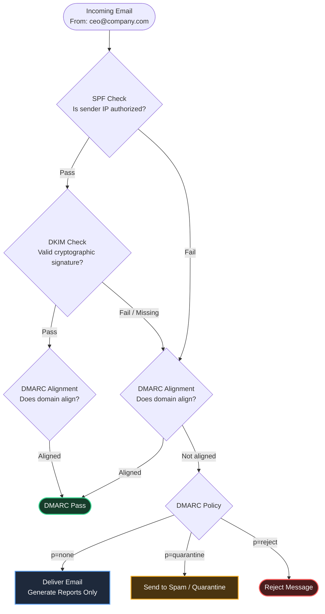

import Callout from '../../../../components/Callout.astro';


Email is the single most exploited attack vector in cybersecurity — **over 90% of cyberattacks begin with a phishing email**. Understanding email security means understanding both the technical authentication protocols that prevent spoofing and the human factors that make phishing effective despite those controls.

### Why Email Is Inherently Insecure

SMTP (Simple Mail Transfer Protocol), the protocol email runs on, was designed in 1982 for a small, trusted academic network. It has no built-in authentication — anyone can claim to be anyone. Sending an email that appears to come from `ceo@yourcompany.com` requires no special access.

Modern email security is a set of **optional** authentication mechanisms layered on top of SMTP to partially address this — but they only work when correctly configured.

## Email Authentication Protocols
<Callout type="tip"> 
### **SPF** (Sender Policy Framework)
</Callout>
SPF allows a domain owner to specify which mail servers are authorized to send email on behalf of their domain, published as a DNS TXT record.

**How it works:**
1. `company.com` publishes an SPF record in DNS: `"v=spf1 ip4:203.0.113.0/24 include:sendgrid.net -all"`
2. A receiving mail server gets an email claiming to be from `user@company.com`
3. The receiver queries DNS for the SPF record of `company.com`
4. It checks whether the sending server's IP is in the allowed list
5. `-all` means: fail (reject) any mail that doesn't match

**SPF syntax elements:**

| Mechanism | Meaning |
|-----------|---------|
| `ip4:x.x.x.x` | Authorize a specific IPv4 address |
| `ip6:x::x` | Authorize a specific IPv6 address |
| `include:domain.com` | Include the SPF record of another domain (for third-party senders like SendGrid) |
| `a` | Authorize the domain's own A record |
| `mx` | Authorize the domain's MX records |
| `-all` | Fail any mail not matching above (**hard fail** — reject) |
| `~all` | Softfail any mail not matching (**soft fail** — accept but mark) |
| `?all` | Neutral — no policy for non-matching |

**SPF alone is insufficient.** SPF checks the `MAIL FROM` (envelope sender) — not the `From:` header that users see. Attackers can pass SPF by using a domain they control in the envelope while displaying a spoofed address in the `From:` header.

**DNS lookup limit:** SPF allows maximum 10 DNS lookups. Complex SPF records with many `include:` directives commonly exceed this limit, causing legitimate emails to fail.
<Callout type="tip"> 
### **DKIM** (DomainKeys Identified Mail)
</Callout>
DKIM adds a cryptographic signature to outgoing emails, allowing receivers to verify the email was sent (and not modified) by an authorized sender.

**How it works:**
1. The sending server generates a public/private RSA or Ed25519 key pair
2. The public key is published in DNS as a TXT record: `selector._domainkey.company.com`
3. For each outgoing email, the sending server signs specific headers and the body with the private key
4. The signature is added as a `DKIM-Signature` header
5. The receiving server retrieves the public key from DNS and verifies the signature

**What DKIM protects:**
- **Authentication:** The email was sent by a server holding the private key
- **Integrity:** The signed headers and body have not been modified in transit

**What DKIM does NOT protect:**
- The `From:` header can still be spoofed if DKIM is configured on a different domain
- An attacker who can replay a legitimately signed email can re-use it

**DKIM record example:**
```
v=DKIM1; k=rsa; p=MIGfMA0GCSqGSIb3DQEBAQUAA4GNADCBiQKBgQC...
```

<Callout type="tip"> 
### **DMARC** (Domain-based Message Authentication, Reporting & Conformance)
</Callout>

DMARC ties SPF and DKIM together and adds a **policy** specifying what receivers should do with emails that fail authentication. It also requires alignment between the authenticated domain and the visible `From:` header.

**DMARC Alignment:**
- **SPF alignment:** The `MAIL FROM` domain must match the `From:` header domain
- **DKIM alignment:** The DKIM `d=` tag must match the `From:` header domain
- If either alignment passes, the email passes DMARC

**DMARC policies:**
```
p=none      → Monitor only; don't reject or quarantine anything (used during rollout)
p=quarantine → Failed emails go to spam/junk folder
p=reject    → Failed emails are rejected outright (strongest protection)
```

**DMARC record example:**
```dns
_dmarc.company.com TXT "v=DMARC1; p=reject; rua=mailto:dmarc-aaa@company.com; ruf=mailto:bbb@company.com; pct=100"
```

| Tag | Meaning |
|-----|---------|
| `p=reject` | Policy: reject failing emails |
| `rua=` | Aggregate report destination (daily summaries of all email) |
| `ruf=` | Forensic report destination (per-failing-email reports) |
| `pct=100` | Apply policy to 100% of failing email |
| `sp=reject` | Subdomain policy |
| `adkim=s` | Strict DKIM alignment (domain must match exactly) |

**The email spoofing protection chain:**


<div style={{ overflowX: 'auto', width: '50%'}}>

</div>
<Callout type="tip"> 
### **BIMI** (Brand Indicators for Message Identification)
</Callout>
BIMI is a newer standard that lets organizations display their brand logo next to their emails in supporting email clients (Gmail, Apple Mail). It requires a valid DMARC record at `p=quarantine` or `p=reject`. Primarily a brand initiative, but it provides some additional phishing resistance (users visually identify authenticated emails).

---

## Recognizing Phishing Emails

Despite authentication controls, phishing emails still reach users — either because the domain being spoofed doesn't have DMARC enforcement, or because the attacker uses their own (legitimately authenticated) domain that merely looks similar.

### Red Flags

**Domain analysis:**
- Lookalike domains: `paypa1.com`, `paypal-secure.info`, `paypal.com.login.attacker.com`
- Newly registered domains (check with WHOIS — most phishing domains are < 30 days old)
- Country code TLDs that don't match the organization: `company.ru`, `company.cn`

**Email header analysis:**
```
From: CEO Name <ceo@company.com>       ← What you see
Reply-To: attacker@gmail.com           ← Where replies actually go
Return-Path: bounce@attacker.com       ← Where delivery failures go
```
Viewing full headers reveals mismatches between the visible `From:` and actual routing information.

**Content red flags:**
- Urgency or pressure ("Your account will be closed in 24 hours")
- Requests for credentials, wire transfers, gift cards, or personal information
- Attachments with unexpected file types (.exe, .js, .vbs, macro-enabled Office files)
- Links that don't match the text (hover over links to see the actual URL)
- Poor grammar and spelling (less common now — AI-generated phishing is grammatically correct)
- Generic salutations ("Dear Customer") for supposed personalized communications

### Safe Email Handling Practices

1. **Never click links in unexpected emails** — navigate directly to the site instead
2. **Verify unusual requests through a separate channel** — call the sender using a known number (not one provided in the email)
3. **Report suspicious emails** — use the organization's phishing report button; don't forward to colleagues
4. **Check sender domains carefully** — zoom in on the sender address; don't rely on display names
5. **Treat unexpected attachments as untrusted** — even from known senders (their account may be compromised)

---

## Secure Email Configuration

### Outbound: Setting Up SPF, DKIM, DMARC

**Step 1 — SPF:** Identify all legitimate email senders for your domain (your mail server, any marketing platforms, ticketing systems, etc.) and publish an SPF record authorizing only those.

**Step 2 — DKIM:** Enable DKIM signing on your mail server/provider. They will generate a key pair and give you a TXT record to publish in DNS. Use 2048-bit RSA or Ed25519 keys.

**Step 3 — DMARC:** Start with `p=none` and the `rua=` reporting address to collect data on your email streams for 2–4 weeks. Review reports, fix legitimate sources that fail. Then move to `p=quarantine`, then `p=reject`.

```bash
# Check your current email authentication configuration
nslookup -type=TXT company.com            # SPF record
nslookup -type=TXT _dmarc.company.com     # DMARC record
nslookup -type=TXT selector._domainkey.company.com  # DKIM public key

# Online tools
# MXToolbox: https://mxtoolbox.com/SuperTool.aspx
# DMARC Analyzer
# Google Admin Toolbox: https://toolbox.googleapps.com/apps/checkmx/
```

### TLS for Email in Transit

Email between mail servers is encrypted with **STARTTLS** (opportunistic TLS) — TLS is negotiated if both servers support it. This protects against passive interception but not against active MitM if TLS is not enforced.

**MTA-STS (Mail Transfer Agent Strict Transport Security):** A policy mechanism that tells sending servers to only deliver to your domain over validated TLS. Prevents TLS downgrade attacks and certificate substitution.

**DANE (DNS-Based Authentication of Named Entities):** Publishes TLS certificate fingerprints in DNSSEC-signed DNS records, allowing verification without relying on the CA system.

### Email Encryption for Content

**PGP/GPG (Pretty Good Privacy):** End-to-end encryption of email content. Both parties must have and exchange public keys. Rarely used outside security-conscious communities due to usability complexity.

**S/MIME:** Email signing and encryption using X.509 certificates — more integrated with corporate environments (Microsoft Exchange, Outlook native support). Requires certificate infrastructure.

**Encrypted email services:** ProtonMail, Tutanota provide end-to-end encryption automatically between users of the same service.

---

## Anti-Spoofing Controls Summary

| Control | What it prevents | Limitation |
|---------|-----------------|------------|
| SPF | Unauthorized mail servers sending as your domain | Doesn't protect the visible From: header |
| DKIM | Message tampering; unauthorized signing | Domain in signature can differ from visible From: |
| DMARC | Email that fails both SPF and DKIM alignment | Only as strong as p=reject enforcement |
| MTA-STS | TLS downgrade on inbound delivery | Only covers your own inbound; not universal |
| Phishing filters | Suspicious content patterns | Constantly evaded by new techniques |
| User training | Social engineering that bypasses technical controls | Requires ongoing investment |
