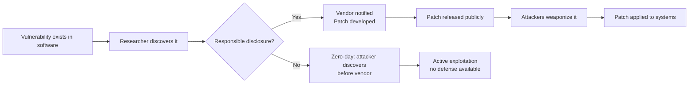

An **endpoint** is any device that connects to a network: laptops, desktops, servers, smartphones, IoT devices. Endpoints are the most common entry point for attackers — they run user code, process untrusted data, and are operated by humans who make mistakes. Endpoint protection is the collection of controls that detect and prevent compromise at the device level.

## Antivirus and Anti-Malware

Traditional **antivirus (AV)** software scans files for known malware signatures — byte patterns that uniquely identify specific malware. When a match is found, the file is quarantined or deleted.

### How Signature Detection Works

```
Malware X has byte sequence at offset 0x100:
  4D 5A 90 00 03 00 ... [signature]

AV engine scans new file:
  → Reads file into buffer
  → Searches for known signatures
  → Match found → flag as malware
```

Signature databases are updated multiple times per day as vendors analyze new malware samples. An unpatched signature database can be months behind — real malware is typically detected within hours of public analysis.

### Limitations of Signature Detection

- **Zero-day malware:** Unknown malware has no signature
- **Polymorphic malware:** Changes its byte sequence on each infection — no stable signature
- **Packed malware:** Compressed or encrypted; signature is the unpacker, not the payload
- **Fileless malware:** Runs only in memory — nothing on disk to scan
- **Living-off-the-land attacks:** Use built-in Windows tools (PowerShell, certutil) — no malware binary at all

### Next-Generation Antivirus (NGAV)

NGAV adds behavioral detection, machine learning, and exploit prevention to supplement signatures:

| Feature | What it does |
|---------|-------------|
| **ML-based detection** | Classifies files based on structural features, not specific signatures |
| **Exploit prevention** | Blocks common exploit techniques (heap spray, ROP chains, shellcode injection) |
| **Script analysis** | Inspects PowerShell, VBScript, JavaScript before execution |
| **Memory scanning** | Scans running process memory for malicious patterns |
| **Behavioral blocking** | Terminates processes exhibiting ransomware-like behavior (bulk file encryption) |

### EDR (Endpoint Detection and Response)

EDR goes beyond prevention to provide **detection, investigation, and response** capabilities. See [Detection & Defense](../malware/detection-and-defense) for a full breakdown. EDR is now the standard for enterprise endpoint protection.

## Host-Based Firewall

A **host-based firewall** controls what network connections are allowed to and from the endpoint, independent of network firewalls.

### Why Host Firewalls Matter

Network firewalls protect the perimeter but cannot see lateral movement within the network. If one endpoint is compromised, a host firewall on the next endpoint can prevent the malware from connecting to it.

### Windows Defender Firewall

Windows has a built-in host firewall configurable via PowerShell or Group Policy:

```powershell
# Block inbound SMB except from specific subnet
New-NetFirewallRule -DisplayName "Block SMB Inbound" `
    -Direction Inbound `
    -Protocol TCP `
    -LocalPort 445 `
    -Action Block

New-NetFirewallRule -DisplayName "Allow SMB from Corp Network" `
    -Direction Inbound `
    -Protocol TCP `
    -LocalPort 445 `
    -RemoteAddress 10.0.0.0/8 `
    -Action Allow

# Block all outbound by default, then allow specific services
Set-NetFirewallProfile -Profile Domain,Private,Public -DefaultOutboundAction Block

# Check current rules
Get-NetFirewallRule | Where-Object {$_.Enabled -eq $true} | Select-Object DisplayName, Direction, Action
```

### Linux iptables / nftables / ufw

```bash
# UFW (Uncomplicated Firewall) — simpler interface
ufw default deny incoming
ufw default allow outgoing
ufw allow ssh
ufw allow http
ufw allow https
ufw enable

# nftables — modern replacement for iptables
nft add table inet filter
nft add chain inet filter input { type filter hook input priority 0 \; policy drop \; }
nft add rule inet filter input iif lo accept
nft add rule inet filter input ct state established,related accept
nft add rule inet filter input tcp dport 22 accept
nft add rule inet filter input log drop
```

---

## Patch Management

**Patch management** is the process of keeping all software up to date with security fixes. It is one of the highest-ROI security controls available because the vast majority of exploits target **known, patched vulnerabilities** against systems where the patch hasn't been applied.

### The Vulnerability Window



The **vulnerability window** (time from patch release to application) is when organizations are most at risk. Critically, this period is **entirely preventable** by applying patches promptly.

### Patch Prioritization

Not all patches are equally urgent:

| Priority | Criteria | Target patch time |
|----------|---------|-----------------|
| **Critical** | CVSS 9.0+, internet-facing systems, actively exploited | 24–48 hours |
| **High** | CVSS 7.0–8.9, internal systems | 1–2 weeks |
| **Medium** | CVSS 4.0–6.9 | Next patch cycle (monthly) |
| **Low** | CVSS < 4.0 | Quarterly or at next planned maintenance |

**CVSS (Common Vulnerability Scoring System)** rates vulnerability severity from 0–10 based on exploitability, impact, and other factors.

**CISA KEV (Known Exploited Vulnerabilities catalog):** The US Cybersecurity and Infrastructure Security Agency publishes a catalog of CVEs being actively exploited in the wild. Federal agencies are required to patch these within tight deadlines; private organizations should use it to prioritize.

### Patch Management Tools

| Tool | Environment |
|------|-------------|
| **WSUS (Windows Server Update Services)** | Windows environments; on-premises |
| **Microsoft Endpoint Configuration Manager (MECM)** | Enterprise Windows patch management + software deployment |
| **Intune** | Microsoft cloud-based MDM for Windows, iOS, Android |
| **Ansible** | Agentless patch automation for Linux |
| **Puppet / Chef** | Configuration management including patching |
| **Qualys / Tenable / Rapid7** | Vulnerability scanning + patch prioritization |

---

## Application Whitelisting

**Application whitelisting** (also called allowlisting) only permits explicitly approved applications to execute. Any unauthorized executable — including malware — is blocked before it runs.

This is highly effective against commodity malware but requires ongoing maintenance (every new legitimate application must be approved).

### Windows Solutions

**AppLocker:**
```powershell
# Create AppLocker policy allowing only approved paths
# Scripts only from approved locations
New-AppLockerPolicy -RuleType Path -User Everyone `
    -Path "%WINDIR%\*" -Action Allow

# Block execution from user-writable locations
New-AppLockerPolicy -RuleType Path -User Everyone `
    -Path "%APPDATA%\*" -Action Deny

# Allow only signed executables from approved publishers
New-AppLockerPolicy -RuleType Publisher -User Everyone `
    -Publisher "O=MICROSOFT CORPORATION, L=REDMOND, S=WASHINGTON, C=US" `
    -Action Allow
```

**Windows Defender Application Control (WDAC):** The successor to AppLocker; runs at the kernel level and is much harder to bypass. Supports code integrity policies enforced before any user-mode code runs.

### Linux Solutions

**AppArmor:** Profile-based mandatory access control. Each application has a profile specifying which files it can access, which capabilities it can use, and which network connections it can make.

```
# /etc/apparmor.d/usr.bin.python3
/usr/bin/python3 {
    include <abstractions/base>
    /usr/lib/python3/** r,
    /tmp/ rw,
    deny /etc/shadow r,
    deny /root/** r,
}
```

**SELinux:** More granular but more complex than AppArmor. Used by default on RHEL/CentOS/Fedora. Operates on the principle of labeling — every file, process, and network port has a label, and policy defines which labels can interact.

---

## Endpoint Hardening

Hardening is the process of reducing the attack surface of an endpoint by disabling unnecessary services, tightening configurations, and applying security baselines.

### Windows Hardening Baseline

```powershell
# Disable SMBv1 (eliminates EternalBlue attack surface)
Set-SmbServerConfiguration -EnableSMB1Protocol $false -Force
Disable-WindowsOptionalFeature -Online -FeatureName smb1protocol

# Disable PowerShell v2 (bypasses AMSI)
Disable-WindowsOptionalFeature -Online -FeatureName MicrosoftWindowsPowerShellV2Root

# Enable Windows Defender Credential Guard
Enable-WindowsOptionalFeature -Online -FeatureName CredentialGuard

# Require admin approval for UAC (not auto-approve)
Set-ItemProperty -Path "HKLM:\SOFTWARE\Microsoft\Windows\CurrentVersion\Policies\System" `
    -Name "ConsentPromptBehaviorAdmin" -Value 2

# Enable Controlled Folder Access (ransomware protection)
Set-MpPreference -EnableControlledFolderAccess Enabled

# Disable AutoPlay / AutoRun
Set-ItemProperty -Path "HKLM:\SOFTWARE\Microsoft\Windows\CurrentVersion\Policies\Explorer" `
    -Name "NoDriveTypeAutoRun" -Value 255
```

### CIS Benchmarks

The **Center for Internet Security (CIS)** publishes detailed hardening benchmarks for every major OS, application, and cloud platform — covering hundreds of configuration settings with explanations of why each matters. CIS Benchmarks are the industry standard starting point for system hardening.

Available for: Windows 10/11/Server, Ubuntu, RHEL, macOS, Docker, Kubernetes, AWS, Azure, GCP, Apache, nginx, and dozens more.

### DISA STIGs

The **Defense Information Systems Agency (DISA)** publishes **Security Technical Implementation Guides (STIGs)** — mandatory hardening standards for US government and DoD systems. More stringent than CIS Benchmarks; publicly available and widely used as a reference even outside government.

---

## Mobile Device Security

Mobile devices (smartphones, tablets) are endpoints too — often with access to the same email, cloud storage, and VPNs as corporate laptops.

### MDM (Mobile Device Management)

MDM platforms allow organizations to enforce policies on corporate and BYOD devices:

| Capability | Examples |
|-----------|---------|
| Device enrollment | Require device enrollment before accessing corporate resources |
| Configuration profiles | Push WiFi, VPN, email settings |
| Security policies | Enforce PIN/biometric lock, encryption, minimum OS version |
| Remote wipe | Erase device if lost or employee leaves |
| App management | Install/remove apps, restrict which apps can access corporate data |
| Compliance enforcement | Block non-compliant devices from accessing corporate resources |

**MDM solutions:** Microsoft Intune, Jamf (Apple), VMware Workspace ONE, Google Workspace device management.

### Mobile Threat Defense (MTD)

MTD solutions detect mobile-specific threats:
- Malicious apps installed from third-party sources
- Jailbroken/rooted devices (security controls removed)
- Network-level MitM attacks (rogue WiFi)
- Phishing links in SMS and other apps

---

## Endpoint Visibility

You cannot protect what you cannot see. Endpoint visibility means knowing:

- **Inventory:** What devices exist, what software is installed, what OS version is running
- **Connectivity:** What network connections each endpoint is making
- **Activity:** What processes run, what files are accessed, what users are logged in
- **Vulnerability status:** What CVEs apply to each device, what is unpatched

### Asset Management Tools

| Tool | Purpose |
|------|---------|
| **Nmap** | Network scanning to discover active hosts |
| **Qualys / Tenable Nessus** | Vulnerability scanning and asset inventory |
| **SCCM / Intune** | Microsoft endpoint inventory and management |
| **Osquery** | SQL-based endpoint interrogation (query any endpoint like a database) |

```sql
-- Osquery: Find all processes with network connections
SELECT p.name, p.pid, p.path, l.local_port, l.remote_address
FROM processes p
JOIN listening_ports l ON p.pid = l.pid
WHERE l.address NOT IN ('127.0.0.1', '::1')
ORDER BY p.name;

-- Find all software with known CVEs
SELECT name, version, install_date
FROM programs
WHERE name LIKE '%log4j%';
```

---

## Endpoint Protection Summary

| Control | What it stops |
|---------|--------------|
| AV + NGAV | Known malware, behavioral threats |
| EDR | Advanced threats, lateral movement; enables investigation |
| Host firewall | Unauthorized network connections to/from endpoint |
| Patch management | Exploitation of known vulnerabilities |
| Application allowlisting | Unauthorized code execution (including novel malware) |
| Hardening (CIS/STIG) | Exploitation of misconfigured services and settings |
| Least privilege | Privilege escalation; limits blast radius |
| Disk encryption (BitLocker, FileVault) | Data exposure from stolen or lost devices |
| MFA | Credential-based access even if passwords are stolen |
| MDM | Mobile device policy enforcement and remote wipe |
