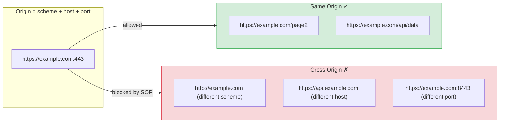
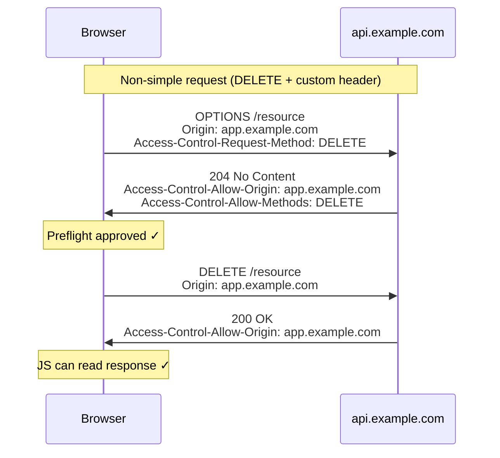

## Same-Origin Policy (SOP)

The Same-Origin Policy is the browser's primary security boundary between web origins.


It prevents a script from one origin from reading data returned by another origin.

**An origin is:** `scheme + host + port`

| URL | Same origin as `https://example.com`? |
|---|---|
| `https://example.com/other-page` | ✓ Yes |
| `http://example.com` | ✗ No (different scheme) |
| `https://api.example.com` | ✗ No (different host) |
| `https://example.com:8443` | ✗ No (different port) |

**What SOP restricts:**
- JavaScript reading responses from cross-origin `fetch` / `XMLHttpRequest`
- JavaScript reading `iframe` content from a different origin
- JavaScript accessing `localStorage` or cookies from a different origin

**What SOP does NOT restrict:**
- Simple cross-origin requests being *sent* (the request goes through, the browser just blocks the JS from *reading* the response)
- ``, `<script>`, `<link>`, `<form>` tags loading cross-origin resources (different mechanisms)

---

## CORS: How Cross-Origin Requests Work

CORS (Cross-Origin Resource Sharing) is a mechanism that allows a server to explicitly permit cross-origin reads. It works via HTTP headers.

### Simple Requests

Simple requests (GET/POST with standard headers and content types) are sent immediately. The browser checks the response headers to decide whether to expose the result to JS.

```
Browser → GET https://api.example.com/data
          Origin: https://app.example.com

Server  → 200 OK
          Access-Control-Allow-Origin: https://app.example.com

Browser: Origin matches → JS can read the response ✓
```

If `Access-Control-Allow-Origin` is missing or doesn't match, the browser blocks the JS from reading the response. The *request was still sent and processed* — CORS only controls reading.

### Preflight Requests

For non-simple requests (PUT, DELETE, custom headers, JSON body), the browser sends an `OPTIONS` preflight request first to ask permission.



```
Browser → OPTIONS https://api.example.com/users/123
          Origin: https://app.example.com
          Access-Control-Request-Method: DELETE
          Access-Control-Request-Headers: Authorization, Content-Type

Server  → 204 No Content
          Access-Control-Allow-Origin: https://app.example.com
          Access-Control-Allow-Methods: GET, POST, PUT, DELETE
          Access-Control-Allow-Headers: Authorization, Content-Type
          Access-Control-Max-Age: 86400  (cache preflight for 24h)

Browser: Preflight approved → sends actual DELETE request
```

### Credentialed Requests (Cookies)

By default, cross-origin requests do not include credentials (cookies, HTTP auth). To send cookies cross-origin:

**Client must set:**
```javascript
fetch('https://api.example.com/data', {
  credentials: 'include',  // send cookies
});
```

**Server must respond with:**
```
Access-Control-Allow-Origin: https://app.example.com  (cannot be *)
Access-Control-Allow-Credentials: true
```

When `credentials: 'include'` is used, `Access-Control-Allow-Origin: *` is explicitly prohibited by the CORS spec — the server must echo back the exact requesting origin.

---

## Secure CORS Configuration

### ✓ Correct Pattern: Allowlist with Echo

```javascript
// Express.js
const ALLOWED_ORIGINS = new Set([
  'https://app.example.com',
  'https://admin.example.com',
]);

app.use((req, res, next) => {
  const origin = req.headers.origin;
  if (ALLOWED_ORIGINS.has(origin)) {
    res.setHeader('Access-Control-Allow-Origin', origin);
    res.setHeader('Vary', 'Origin');  // required for caching correctness
  }

  if (req.method === 'OPTIONS') {
    res.setHeader('Access-Control-Allow-Methods', 'GET, POST, PUT, DELETE');
    res.setHeader('Access-Control-Allow-Headers', 'Content-Type, Authorization');
    res.setHeader('Access-Control-Max-Age', '86400');
    return res.sendStatus(204);
  }

  next();
});
```

### ✗ Dangerous Patterns

```javascript
// ✗ Wildcard with credentials — browsers reject this
res.setHeader('Access-Control-Allow-Origin', '*');
res.setHeader('Access-Control-Allow-Credentials', 'true');

// ✗ Reflecting origin without validation — allows any origin
const origin = req.headers.origin;
res.setHeader('Access-Control-Allow-Origin', origin);  // no allowlist check

// ✗ Regex that can be bypassed
const trusted = /example\.com$/;
if (trusted.test(origin)) { ... }
// Bypassed by: https://evil-example.com
//              https://example.com.evil.com

// ✗ null origin allowed — attackers use sandboxed iframes to send null
if (origin === null || origin === 'null') {
  res.setHeader('Access-Control-Allow-Origin', 'null');  // dangerous
}
```

### The `Vary: Origin` Header

Always include `Vary: Origin` when your CORS response depends on the `Origin` header. Without it, a CDN or browser cache might serve a cached response with the wrong `Access-Control-Allow-Origin` header to a different origin.

```
Vary: Origin
```

---

## CORS Is Not a Security Defense Against All Attacks

**CORS does not prevent:**
- CSRF — forms and `` tags bypass CORS; use [CSRF tokens or SameSite cookies](/security/web/csrf-clickjacking)
- Server-side attacks — the malicious request is still sent; CORS only controls whether JS can read the response
- Attacks from the same origin — same-origin scripts have full access

**CORS does prevent:**
- Cross-origin JavaScript reading API responses (the common attack scenario for API data theft via compromised third-party scripts)

---

## Common Debugging Reference

| Problem | Check |
|---|---|
| "No 'Access-Control-Allow-Origin' header" | Server didn't return CORS header; check allowlist logic and whether request triggered OPTIONS preflight |
| CORS works in dev, fails in prod | Different `Origin` values; check your allowlist for the prod domain |
| Preflight returns 404 or 405 | Server doesn't handle `OPTIONS` method; add an OPTIONS route/middleware |
| Cookie not sent cross-origin | Client needs `credentials: 'include'`; server needs `Allow-Credentials: true` and non-wildcard origin |
| CDN serving wrong origin header | Missing `Vary: Origin`; cached response has stale header |
