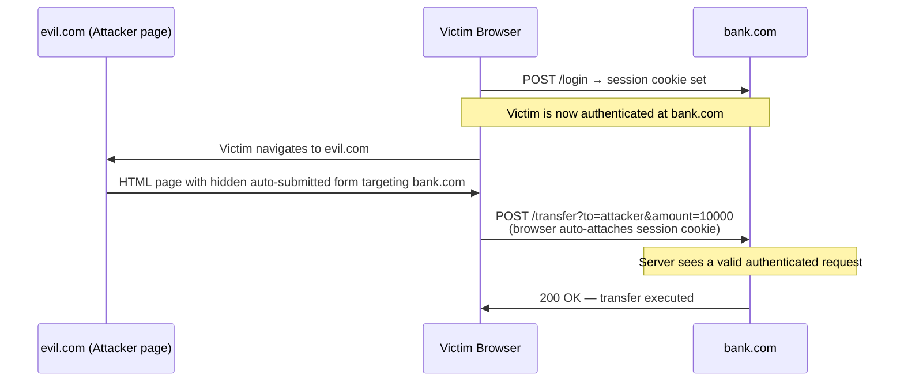

## Cross-Site Request Forgery (CSRF)

CSRF tricks an authenticated user's browser into making an unintended request to your application. The browser automatically attaches cookies, so the request appears legitimate to the server.

## How It Works



```html
<!-- Attacker's page at evil.com -->
<!-- Victim is logged into bank.com with a session cookie -->

<!-- Simple GET attack (visible in image src) -->


<!-- POST attack using auto-submitted form -->
<form id="x" action="https://bank.com/transfer" method="POST">
  <input name="to" value="attacker">
  <input name="amount" value="10000">
</form>
<script>document.getElementById('x').submit();</script>
```

When the victim loads the attacker's page, the browser silently makes the request to `bank.com` with the victim's cookie — the bank sees a valid authenticated request.

**CSRF requires:**
1. The victim is authenticated (has an active session cookie)
2. The server uses cookies for authentication
3. The attacker can predict the request format

---

### Defenses

#### SameSite Cookies (Best Modern Defense)

`SameSite` tells the browser when to send a cookie on cross-site requests:

| Value | Behavior | Recommended? |
|---|---|---|
| `Strict` | Cookie never sent on cross-site requests | ✓ Most secure; may break OAuth/email links |
| `Lax` | Sent on top-level GET navigations only | ✓ Good default; blocks CSRF POST |
| `None` | Always sent (requires `Secure`) | ✗ No CSRF protection |

```
Set-Cookie: session=abc123; SameSite=Lax; Secure; HttpOnly
```

`SameSite=Lax` blocks cross-site POST/PUT/DELETE requests while allowing normal link navigation. It is the browser default in Chrome and Firefox.

#### CSRF Tokens (Defense-in-Depth)

Generate a random per-session token, include it in every state-changing form, and verify it server-side. An attacker's page cannot read this token due to the Same-Origin Policy.

```javascript
// Server: generate and store token
app.use((req, res, next) => {
  if (!req.session.csrfToken) {
    req.session.csrfToken = crypto.randomBytes(32).toString('hex');
  }
  res.locals.csrfToken = req.session.csrfToken;
  next();
});

// Template: include token in form
// <input type="hidden" name="_csrf" value="{{ csrfToken }}">

// Server: validate on state-changing requests
app.post('/transfer', (req, res) => {
  if (req.body._csrf !== req.session.csrfToken) {
    return res.status(403).send('Invalid CSRF token');
  }
  // process transfer
});
```

**Double-submit cookie pattern** — an alternative that doesn't require server-side session state:

```javascript
// Set a non-HttpOnly cookie with a random value
res.cookie('csrf', token, { sameSite: 'Lax', secure: true });

// Client reads cookie and submits value in header
fetch('/api/transfer', {
  method: 'POST',
  headers: { 'X-CSRF-Token': getCookie('csrf') },
});

// Server checks cookie value matches header value
// An attacker's origin cannot read the cookie or set custom headers cross-origin
```

#### Custom Request Headers

Simple requests (forms, images) cannot set custom headers cross-origin. If your API requires a custom header (e.g., `X-Requested-With: XMLHttpRequest`), cross-site form submissions will be missing it.

```javascript
// Client always sends:
fetch('/api/action', {
  method: 'POST',
  headers: { 'X-Requested-With': 'XMLHttpRequest' },
});

// Server validates:
if (req.headers['x-requested-with'] !== 'XMLHttpRequest') {
  return res.status(403).send('Forbidden');
}
```

#### Origin / Referer Validation

Check that requests come from your own origin. Combine with other defenses since `Referer` can be stripped by browsers in some cases.

```javascript
const origin = req.headers.origin || req.headers.referer;
if (!origin?.startsWith('https://myapp.com')) {
  return res.status(403).send('Cross-origin request rejected');
}
```

---

### What CSRF Tokens Don't Protect Against

- XSS — if an attacker can run JavaScript on your domain, they can read the CSRF token and forge requests
- Credential-based attacks — CSRF is about session cookies, not about auth credentials
- State-reading attacks — CSRF only prevents state-changing requests; reading data requires a different defense (CORS)

---

## Clickjacking

Clickjacking loads your site in a hidden `<iframe>` on the attacker's page, overlaid on top of something the user thinks they're clicking.

```html
<!-- Attacker's page -->
<style>
  iframe {
    position: absolute;
    width: 500px;
    height: 300px;
    opacity: 0.0;  /* invisible! */
    z-index: 2;
  }
  #decoy {
    position: absolute;
    z-index: 1;
  }
</style>

<div id="decoy">Click here to claim your prize!</div>
<iframe src="https://bank.com/transfer?to=attacker&amount=1000"></iframe>
<!-- Victim thinks they click the decoy but actually click the bank's button -->
```

### Defenses

#### X-Frame-Options Header

```
X-Frame-Options: DENY          # never allowed in a frame
X-Frame-Options: SAMEORIGIN    # only same origin can frame it
```

#### Content-Security-Policy: frame-ancestors

CSP `frame-ancestors` is the modern replacement for `X-Frame-Options` and is more flexible:

```
Content-Security-Policy: frame-ancestors 'none'
Content-Security-Policy: frame-ancestors 'self'
Content-Security-Policy: frame-ancestors https://trusted-partner.com
```

Set both headers for maximum compatibility:

```javascript
// Express with Helmet
import helmet from 'helmet';
app.use(helmet.frameguard({ action: 'deny' }));
```

#### Frame-Busting JavaScript (Legacy — Avoid)

Older JS-based frame busting (`if (top !== self) top.location = self.location`) is easily defeated by sandbox attributes. Use HTTP headers instead.
